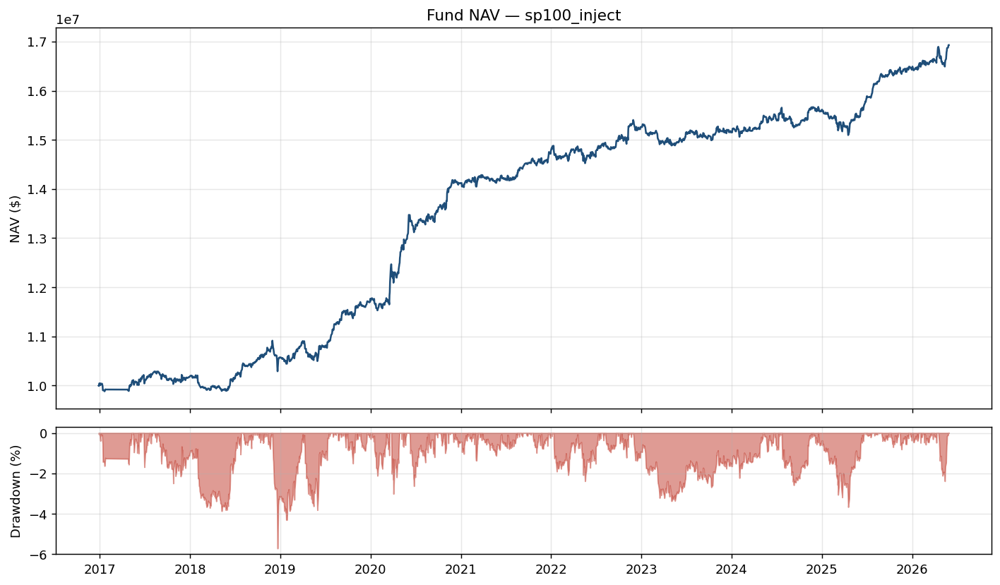
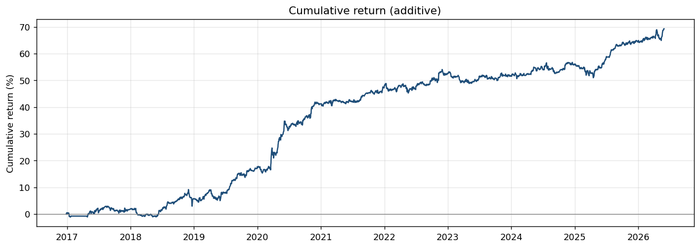
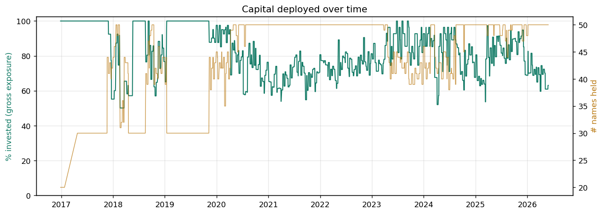
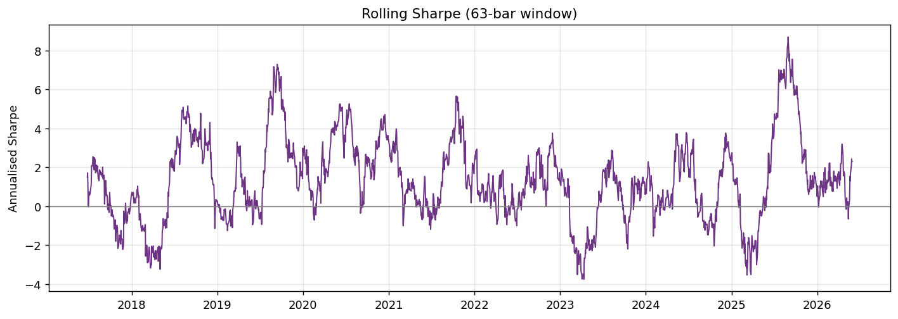
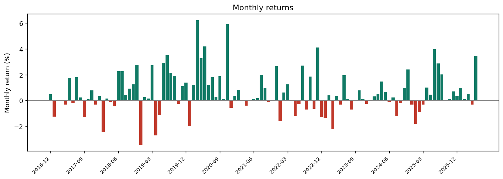
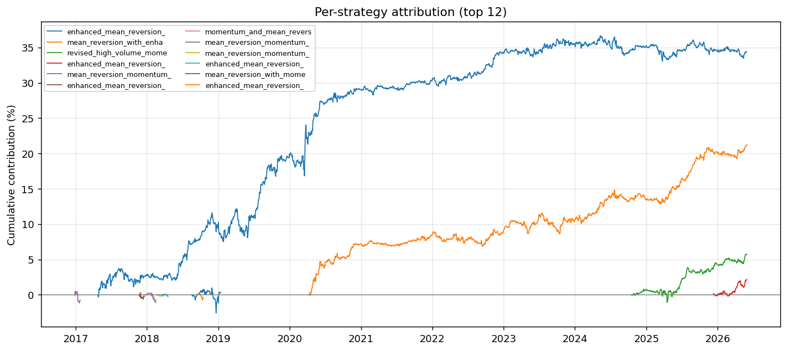
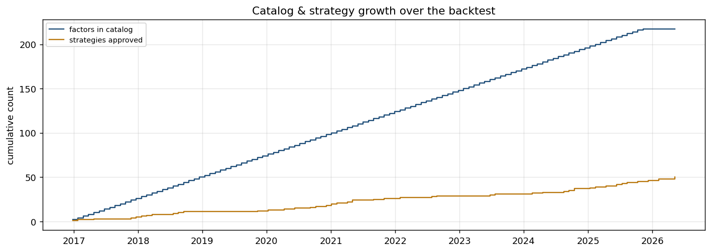

# Walk-forward backtest — sp100_inject

- **Span**: 2016-01-01 → 2026-06-01
- **Execution**: netted book
- **Factor source**: prerun_inject (preruns: sp100-5.4-mini, sp100-4o-mini, 2/meeting)
- **Meetings**: 115  |  **strategies deployed**: 27

## Key metrics

| Metric | Value |
|---|---|
| Final NAV | 16929381.52 (capital 10,000,000) |
| Total return | 0.692938 |
| Annualised return | 0.075724 |
| Annualised volatility | 0.054031 |
| Sharpe | 1.4015 |
| Sortino | 2.189 |
| Calmar | 1.3248 |
| Max drawdown | -0.057159 |
| Max DD duration (bars) | 360 |
| Hit rate | 0.4779 |
| % invested (mean) | 0.8161 |
| % invested (max) | 1.0 |
| Avg names held | 43.78 |
| Bars traded | 2306 |
| Total cost (return) | 0.07953 |
| Avg daily turnover | 0.2299 |

## Figures

### NAV & drawdown

### Cumulative return

### Percent invested & names held

### Rolling Sharpe

### Monthly returns

### Per-strategy attribution

### Catalog & strategy growth

