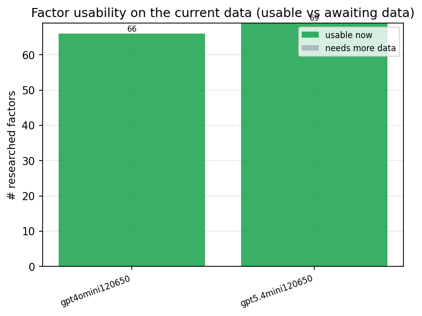
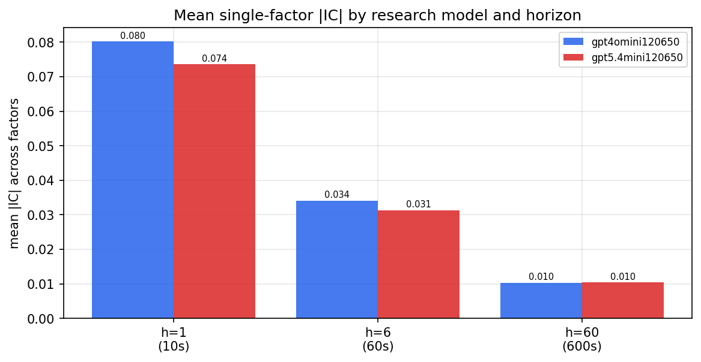
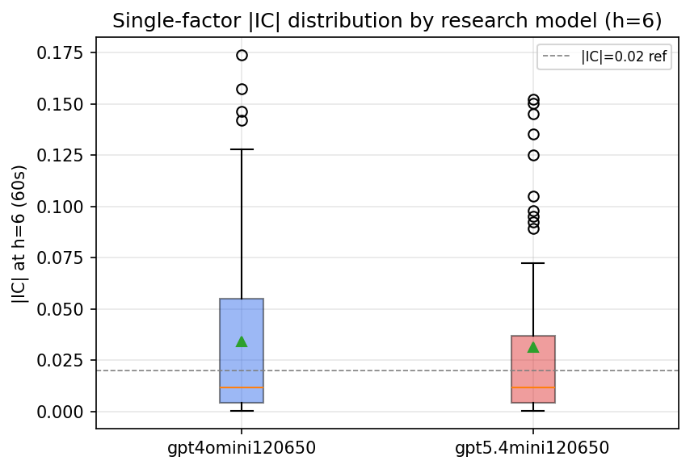
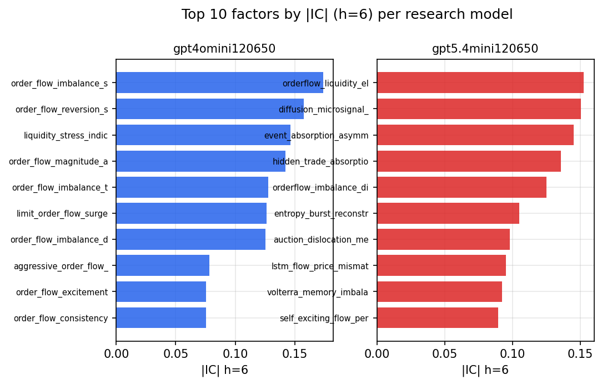
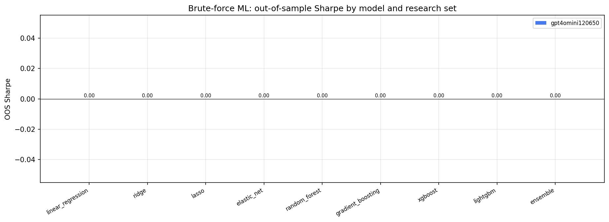
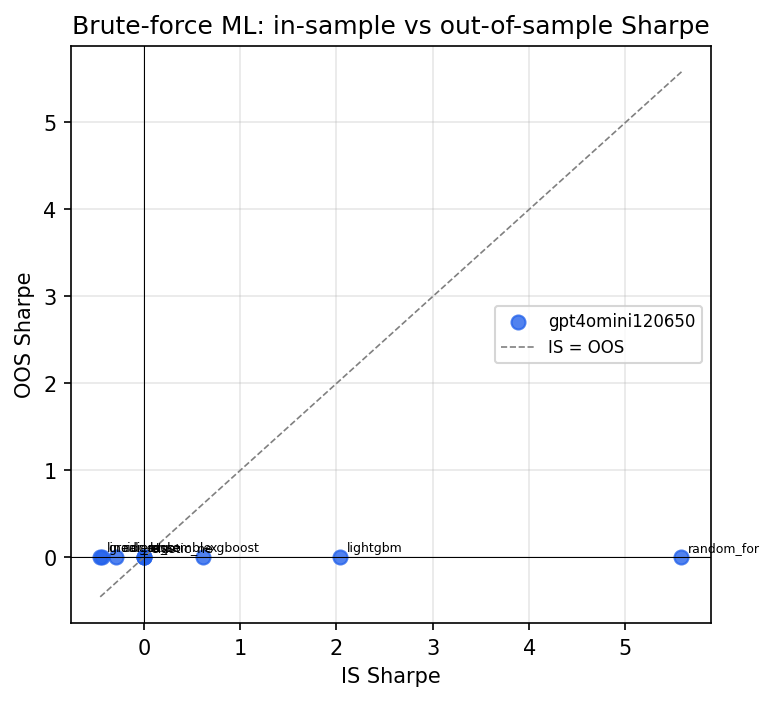

# Research-LLM factor comparison — `20260612_122349`

Comparing the **factor output of different research LLMs** on three axes (raw factor quality → factors as ML features → factors through the full agentic fund). The panel, IS/OOS split, horizon and model hyper-parameters are held identical across preruns — the *only* variable is the factor set.

## Preruns compared

| prerun | research_model | usable_factors | dropped_factors |
| --- | --- | --- | --- |
| gpt4omini120650 | gpt-4o-mini | 66 | 0 |
| gpt5.4mini120650 | gpt-5.4-mini | 69 | 0 |

> Dropped factors declare fields the current data doesn't have yet (e.g. fundamentals); they light up unchanged once that data is downloaded.

*Usable vs awaiting-data factors per research model*

## Key findings

- **Best brute-force OOS Sharpe:** `gpt4omini120650` with `linear_regression` (OOS Sharpe = 0.000).
- **Mean OOS Sharpe across models, by research set:** `gpt4omini120650` = 0.000.
- **Highest mean single-factor |IC| (h=6):** `gpt4omini120650` (mean |IC| = 0.0341).

## 1. Single-factor IC (raw factor quality)

Cross-sectional Spearman rank-IC of every researched factor, recomputed on the shared panel at horizons h=1, h=6, h=60.

| prerun | n_factors | mean_abs_ic_1 | mean_abs_ic_6 | mean_abs_ic_60 | mean_abs_icir_6 | best_factor_h6 | best_abs_ic_h6 |
| --- | --- | --- | --- | --- | --- | --- | --- |
| gpt4omini120650 | 66 | 0.0802 | 0.0341 | 0.0104 | 0.1988 | order_flow_imbalance_strength | 0.1738 |
| gpt5.4mini120650 | 69 | 0.0736 | 0.0313 | 0.0104 | 0.1859 | orderflow_liquidity_elasticity | 0.1524 |

*Mean |IC| by research model and horizon*

*Per-factor |IC| distribution by research model*

*Top factors by |IC| per research model*

## 2. Brute-force ML (factors as raw features, no agents)

Each prerun's factors fed straight into the model catalog + an equal-weight ensemble; fit on IS, evaluated on the held-out OOS tail.

| prerun | model | n_factors_used | oos_ic | oos_sharpe | is_sharpe | oos_ann_return | oos_max_drawdown |
| --- | --- | --- | --- | --- | --- | --- | --- |
| gpt4omini120650 | linear_regression | 66 | nan | 0.0 | -0.4523 | 0.0 | 0.0 |
| gpt4omini120650 | ridge | 66 | nan | 0.0 | -0.2869 | 0.0 | 0.0 |
| gpt4omini120650 | lasso | 66 | nan | 0.0 | 0.0 | 0.0 | 0.0 |
| gpt4omini120650 | elastic_net | 66 | nan | 0.0 | 0.0 | 0.0 | 0.0 |
| gpt4omini120650 | random_forest | 66 | nan | 0.0 | 5.5814 | 0.0 | 0.0 |
| gpt4omini120650 | gradient_boosting | 66 | nan | 0.0 | -0.4364 | 0.0 | 0.0 |
| gpt4omini120650 | xgboost | 66 | nan | 0.0 | 0.6145 | 0.0 | 0.0 |
| gpt4omini120650 | lightgbm | 66 | nan | 0.0 | 2.041 | 0.0 | 0.0 |
| gpt4omini120650 | ensemble | 66 | nan | 0.0 | 0.0 | 0.0 | 0.0 |
| gpt5.4mini120650 | linear_regression | 69 | nan | nan | nan | nan | nan |
| gpt5.4mini120650 | ridge | 69 | nan | nan | nan | nan | nan |
| gpt5.4mini120650 | lasso | 69 | nan | nan | nan | nan | nan |
| gpt5.4mini120650 | elastic_net | 69 | nan | nan | nan | nan | nan |
| gpt5.4mini120650 | random_forest | 69 | nan | nan | nan | nan | nan |
| gpt5.4mini120650 | gradient_boosting | 69 | nan | nan | nan | nan | nan |
| gpt5.4mini120650 | xgboost | 69 | nan | nan | nan | nan | nan |
| gpt5.4mini120650 | lightgbm | 69 | nan | nan | nan | nan | nan |

*Brute-force OOS Sharpe by model and research set*

*IS vs OOS Sharpe (overfitting diagnostic)*

---
*Generated by `run_model_comparison.py`. Tables: `*.csv`; interactive: `comparison.ipynb`.*
