# Research-LLM factor comparison — `20260622_093630`

Comparing the **factor output of different research LLMs** on three axes (raw factor quality → factors as ML features → factors through the full agentic fund). The panel, IS/OOS split, horizon and model hyper-parameters are held identical across preruns — the *only* variable is the factor set.

## Preruns compared

| prerun | research_model | usable_factors | dropped_factors |
| --- | --- | --- | --- |
| gpt4omini120650 | gpt-4o-mini | 66 | 0 |
| gpt5.4mini120650 | gpt-5.4-mini | 69 | 0 |
| main | ? | 109 | 0 |

> Dropped factors declare fields the current data doesn't have yet (e.g. fundamentals); they light up unchanged once that data is downloaded.

*Usable vs awaiting-data factors per research model*

## Key findings

- **Best ML-combined OOS Sharpe:** `gpt5.4mini120650` with `gradient_boosting` (OOS Sharpe = 4.864).
- **Mean OOS Sharpe across models, by research set:** `gpt5.4mini120650` = 1.837, `gpt4omini120650` = 1.616, `main` = 0.715.
- **Highest mean single-factor |IC| (h=6):** `main` (mean |IC| = 0.0131).
- **Most diverse zoo (highest effective/raw factor ratio):** `gpt4omini120650` (eff 24.6 of 66, ratio 0.37).
- **Best selection-deflated single-factor |IC|:** `main` (deflated |IC| = 0.2062 from 102 factors tried).

## 1. Single-factor IC (raw factor quality)

Cross-sectional Spearman rank-IC of every researched factor, recomputed on the shared panel at horizons h=1, h=6, h=60.

| prerun | n_factors | mean_abs_ic_1 | mean_abs_ic_6 | mean_abs_ic_60 | mean_abs_icir_6 | best_factor_h6 | best_abs_ic_h6 |
| --- | --- | --- | --- | --- | --- | --- | --- |
| gpt4omini120650 | 66 | 0.0045 | 0.007 | 0.0143 | 0.0185 | order_flow_pressure | 0.0305 |
| gpt5.4mini120650 | 69 | 0.0072 | 0.0118 | 0.0248 | 0.0323 | intraday_safety_margin_pressure | 0.0519 |
| main | 109 | 0.0078 | 0.0131 | 0.02 | 0.0306 | volatility_clustering_signal | 0.2279 |

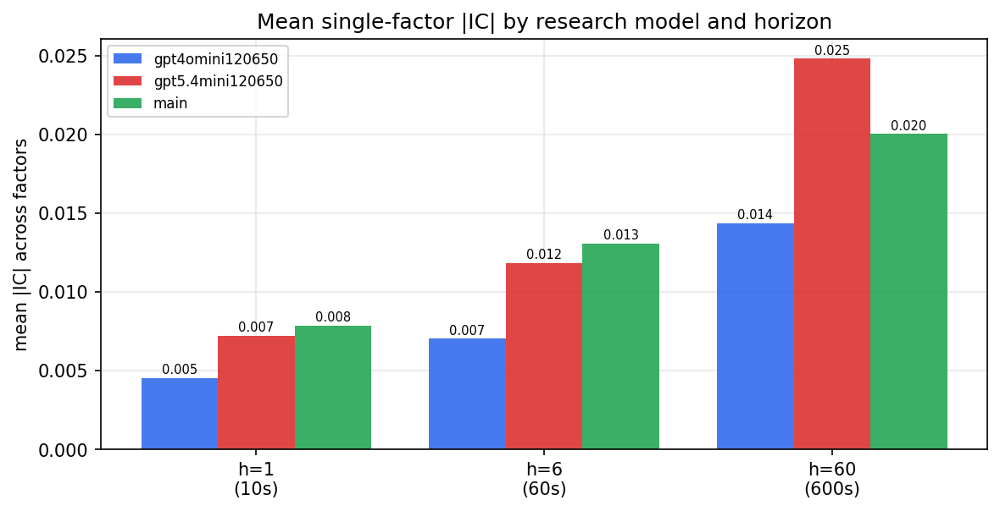

*Mean |IC| by research model and horizon*

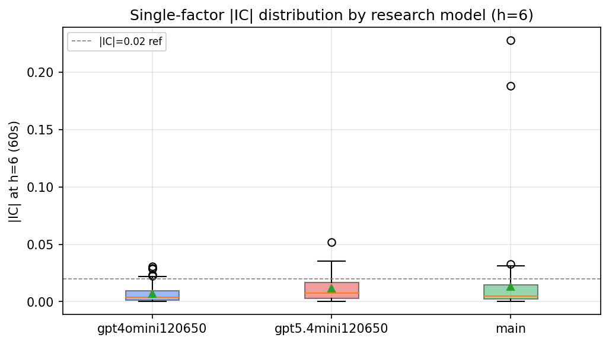

*Per-factor |IC| distribution by research model*

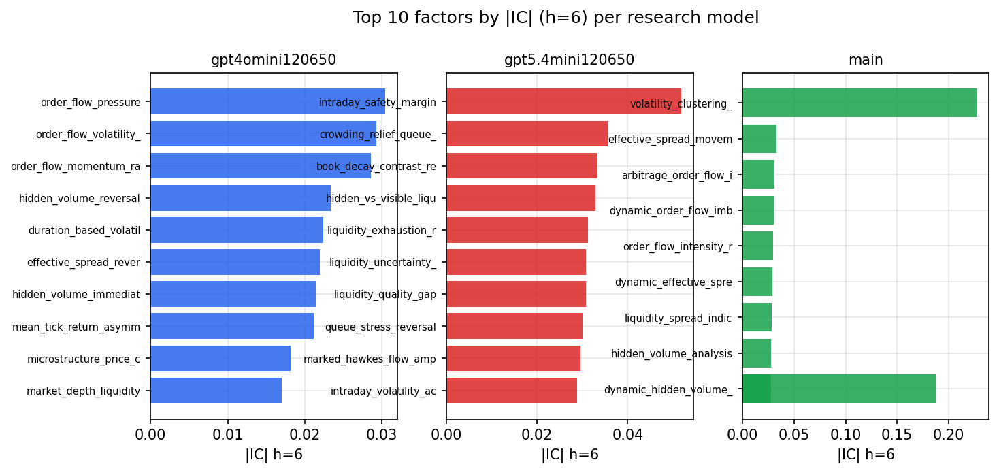

*Top factors by |IC| per research model*

## 2. Factor diversity & redundancy

Pairwise correlation of each zoo's *signals*. `eff_n_factors` is the effective number of independent factors (participation ratio of the correlation eigenvalues); `eff_ratio` and `redundancy` summarise how much unique information the zoo holds vs. how much is duplicated; `n_clusters` groups factors at |corr| ≥ 0.7.

| prerun | n_factors | eff_n_factors | eff_ratio | mean_abs_corr | n_clusters | redundancy |
| --- | --- | --- | --- | --- | --- | --- |
| gpt4omini120650 | 66 | 24.5925 | 0.3726 | 0.073 | 53 | 0.6274 |
| gpt5.4mini120650 | 69 | 22.7438 | 0.3296 | 0.0955 | 57 | 0.6704 |
| main | 109 | 39.815 | 0.3653 | 0.052 | 89 | 0.6347 |

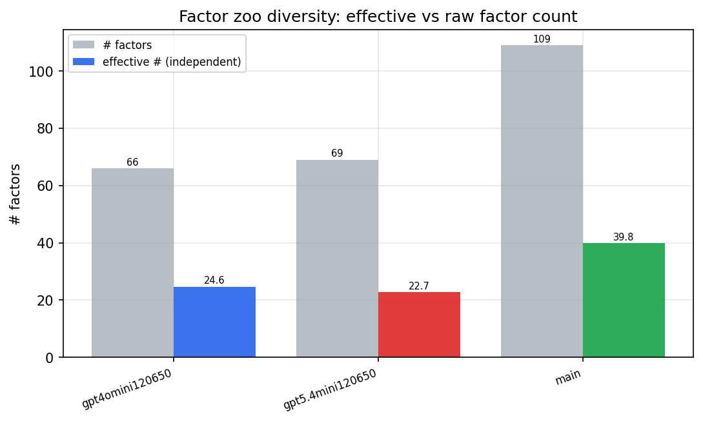

*Effective vs raw factor count per research model*

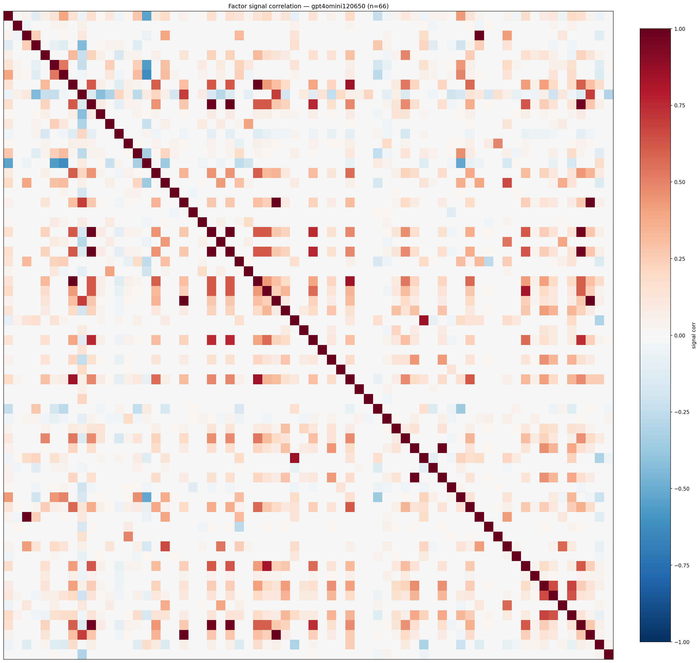

*Signal correlation matrix — gpt4omini120650*

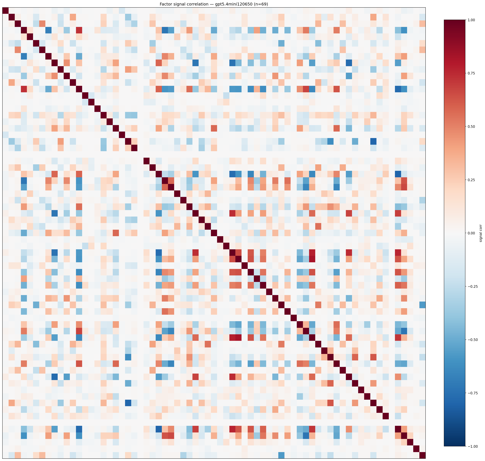

*Signal correlation matrix — gpt5.4mini120650*

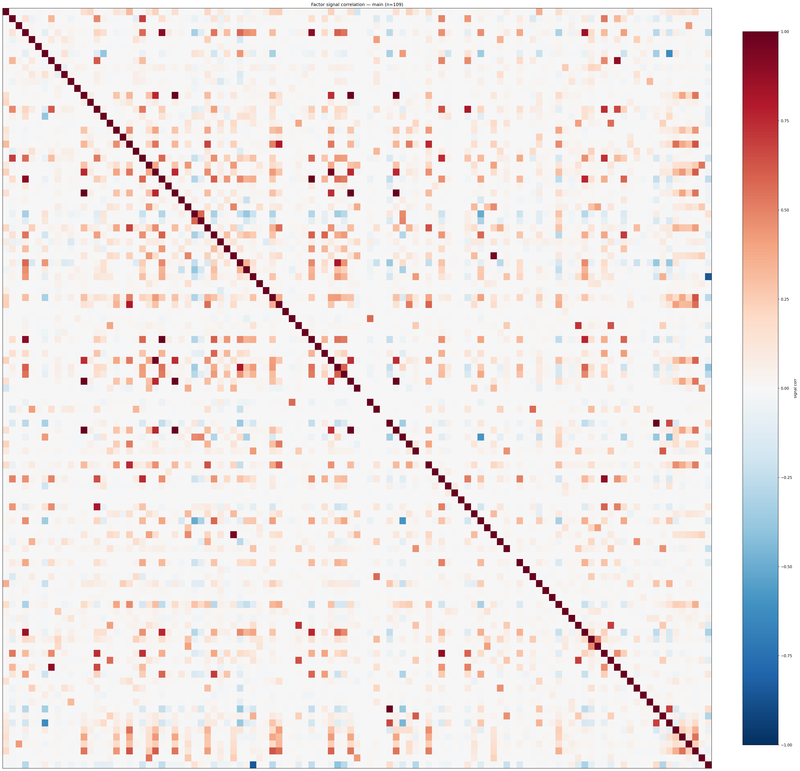

*Signal correlation matrix — main*

## 3. Deflation & model-based importance

`deflated_best_ic` haircuts each zoo's best |IC| for the number of factors tried (`ic_n_tested`) — a bigger zoo's best factor is more likely to be lucky. `lasso_n_nonzero` / `lasso_sparsity` show how many factors a sparse linear model actually keeps (model-view redundancy).

| prerun | best_ic | deflated_best_ic | deflated_best_t | ic_n_tested | ic_n_obs | lasso_n_nonzero | lasso_sparsity |
| --- | --- | --- | --- | --- | --- | --- | --- |
| gpt4omini120650 | 0.0305 | 0.0098 | 1.3838 | 66 | 19738 | 5 | 0.9242 |
| gpt5.4mini120650 | 0.0519 | 0.0312 | 4.3859 | 67 | 19742 | 2 | 0.971 |
| main | 0.2279 | 0.2062 | 28.9759 | 102 | 19742 | 0 | 1.0 |

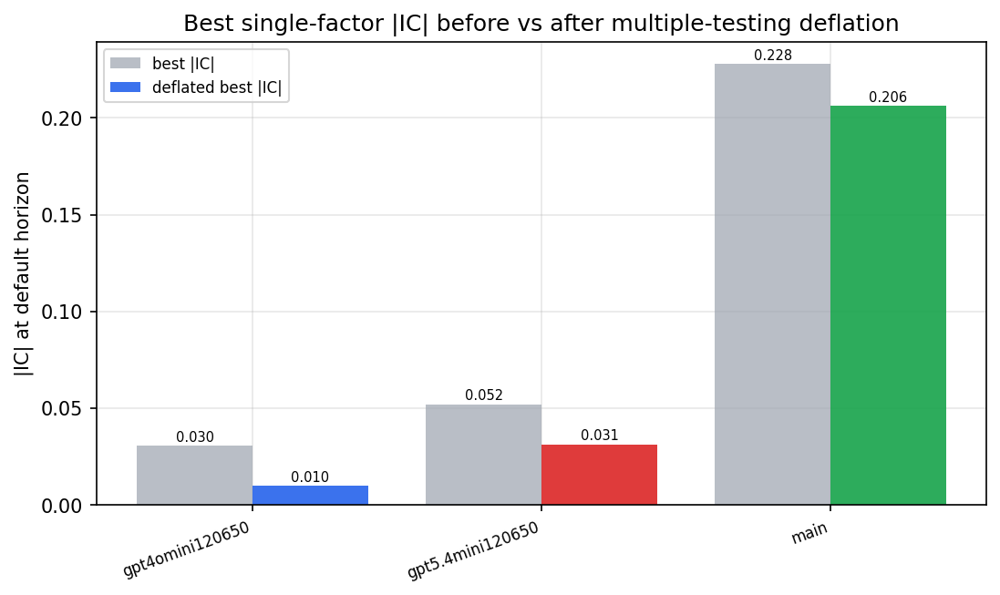

*Best |IC| before vs after multiple-testing deflation*

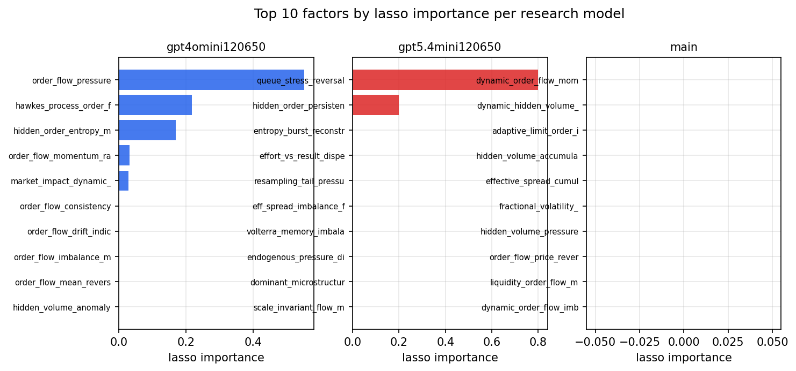

*Top factors by lasso importance per zoo*

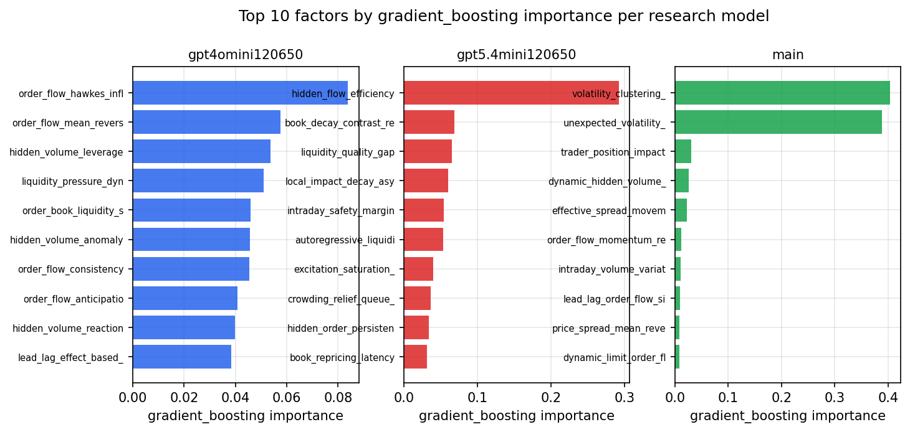

*Top factors by gradient_boosting importance per zoo*

## 4. ML-combined signal — per-underlying vectorised backtest

Each model combines a prerun's factors into ONE signal (fit `factors → forward return` on IS, predict per (bar, underlying)), then that combined signal is run through a simple vectorised backtest — `position(signal) × the underlying's own forward return` — on the held-out OOS tail (+ an equal-weight ensemble). No cross-sectional ranking.

> Config: position=**threshold** (t=1.0, z-score `expanding`), aggregation=**portfolio**, fit-standardise=**per_underlying**, horizon=6.

| prerun | model | n_factors_used | oos_ic | oos_sharpe | is_sharpe | oos_ann_return | oos_max_drawdown |
| --- | --- | --- | --- | --- | --- | --- | --- |
| gpt4omini120650 | linear_regression | 66 | 0.001 | -0.5138 | 2.6065 | -0.0547 | -0.0824 |
| gpt4omini120650 | ridge | 66 | 0.0052 | 0.5079 | 2.8582 | 0.0545 | -0.0937 |
| gpt4omini120650 | lasso | 66 | nan | 0.0 | 0.0 | 0.0 | 0.0 |
| gpt4omini120650 | elastic_net | 66 | nan | 0.0 | 0.0 | 0.0 | 0.0 |
| gpt4omini120650 | random_forest | 66 | 0.0226 | 4.056 | 5.2259 | 0.6365 | -0.1527 |
| gpt4omini120650 | gradient_boosting | 66 | 0.0137 | 1.8939 | 2.3467 | 0.1812 | -0.1615 |
| gpt4omini120650 | xgboost | 66 | 0.0237 | 1.6884 | 5.6626 | 0.2387 | -0.14 |
| gpt4omini120650 | lightgbm | 66 | 0.0211 | 3.6486 | 10.9172 | 0.5126 | -0.102 |
| gpt4omini120650 | ensemble | 66 | 0.0237 | 3.2606 | 5.4667 | 0.3449 | -0.109 |
| gpt5.4mini120650 | linear_regression | 69 | 0.0078 | 4.6657 | 3.5959 | 0.745 | -0.0898 |
| gpt5.4mini120650 | ridge | 69 | 0.0076 | 3.623 | 3.1584 | 0.5633 | -0.0871 |
| gpt5.4mini120650 | lasso | 69 | nan | 0.0 | 0.0 | 0.0 | 0.0 |
| gpt5.4mini120650 | elastic_net | 69 | nan | 0.0 | 0.0 | 0.0 | 0.0 |
| gpt5.4mini120650 | random_forest | 69 | 0.0172 | 1.4695 | 7.1718 | 0.2003 | -0.0772 |
| gpt5.4mini120650 | gradient_boosting | 69 | 0.0191 | 4.864 | 2.619 | 0.5981 | -0.0775 |
| gpt5.4mini120650 | xgboost | 69 | 0.0157 | 1.3193 | 5.4232 | 0.1698 | -0.1207 |
| gpt5.4mini120650 | lightgbm | 69 | 0.0082 | -1.944 | 9.7943 | -0.2901 | -0.1778 |
| gpt5.4mini120650 | ensemble | 69 | 0.0182 | 2.5396 | 6.8088 | 0.396 | -0.1423 |
| main | linear_regression | 109 | 0.0001 | 2.2386 | 2.4155 | 0.3342 | -0.1466 |
| main | ridge | 109 | -0.0012 | 2.1549 | 1.5484 | 0.3071 | -0.1169 |
| main | lasso | 109 | nan | 0.0 | 0.0 | 0.0 | 0.0 |
| main | elastic_net | 109 | nan | 0.0 | 0.0 | 0.0 | 0.0 |
| main | random_forest | 109 | 0.0024 | 0.7611 | 4.9239 | 0.1124 | -0.1734 |
| main | gradient_boosting | 109 | -0.0124 | -1.8547 | 2.329 | -0.1653 | -0.123 |
| main | xgboost | 109 | -0.0105 | -0.4231 | 7.5491 | -0.056 | -0.1882 |
| main | lightgbm | 109 | -0.0072 | 2.2144 | 11.3888 | 0.3151 | -0.0743 |
| main | ensemble | 109 | -0.002 | 1.3425 | 8.655 | 0.1904 | -0.1713 |

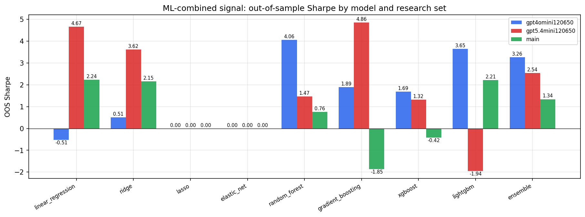

*ML-combined OOS Sharpe by model and research set*

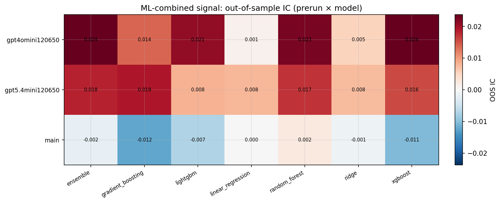

*ML-combined OOS IC (prerun × model)*

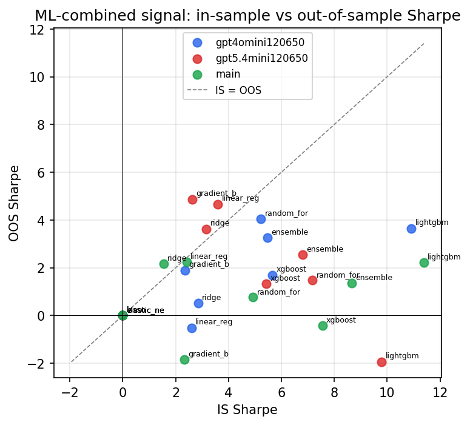

*IS vs OOS Sharpe (overfitting diagnostic)*

---
*Generated by `run_model_comparison.py`. Tables: `*.csv`; interactive: `comparison.ipynb`.*
