# Research-LLM factor comparison — `20260622_112737`

Comparing the **factor output of different research LLMs** on three axes (raw factor quality → factors as ML features → factors through the full agentic fund). The panel, IS/OOS split, horizon and model hyper-parameters are held identical across preruns — the *only* variable is the factor set.

## Preruns compared

| prerun | research_model | usable_factors | dropped_factors |
| --- | --- | --- | --- |
| gpt4omini120650 | gpt-4o-mini | 66 | 0 |
| gpt5.4mini120650 | gpt-5.4-mini | 69 | 0 |
| main | ? | 109 | 0 |

> Dropped factors declare fields the current data doesn't have yet (e.g. fundamentals); they light up unchanged once that data is downloaded.

*Usable vs awaiting-data factors per research model*

## Key findings

- **Best ML-combined OOS Sharpe:** `gpt4omini120650` with `lightgbm` (OOS Sharpe = 1.704).
- **Mean OOS Sharpe across models, by research set:** `gpt4omini120650` = -0.965, `gpt5.4mini120650` = -1.913, `main` = -2.476.
- **Highest mean single-factor |IC| (h=6):** `main` (mean |IC| = 0.0074).
- **Most diverse zoo (highest effective/raw factor ratio):** `gpt4omini120650` (eff 24.3 of 66, ratio 0.37).
- **Best selection-deflated single-factor |IC|:** `main` (deflated |IC| = 0.0906 from 103 factors tried).

## 1. Single-factor IC (raw factor quality)

Cross-sectional Spearman rank-IC of every researched factor, recomputed on the shared panel at horizons h=1, h=6, h=60.

| prerun | n_factors | mean_abs_ic_1 | mean_abs_ic_6 | mean_abs_ic_60 | mean_abs_icir_6 | best_factor_h6 | best_abs_ic_h6 |
| --- | --- | --- | --- | --- | --- | --- | --- |
| gpt4omini120650 | 66 | 0.0038 | 0.0044 | 0.0075 | 0.0116 | limit_order_book_imbalance_surge | 0.0211 |
| gpt5.4mini120650 | 69 | 0.0062 | 0.0069 | 0.0145 | 0.0184 | intraday_safety_margin_pressure | 0.0572 |
| main | 109 | 0.0056 | 0.0074 | 0.015 | 0.0174 | volatility_clustering_signal | 0.1003 |

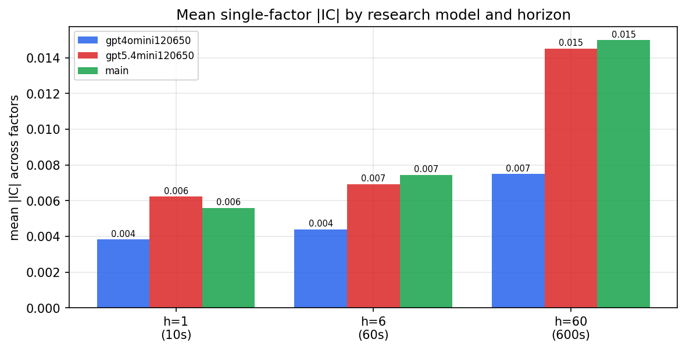

*Mean |IC| by research model and horizon*

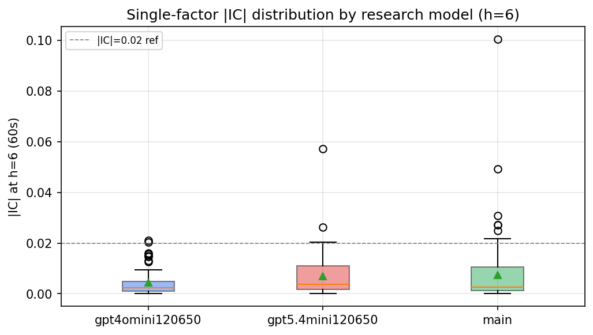

*Per-factor |IC| distribution by research model*

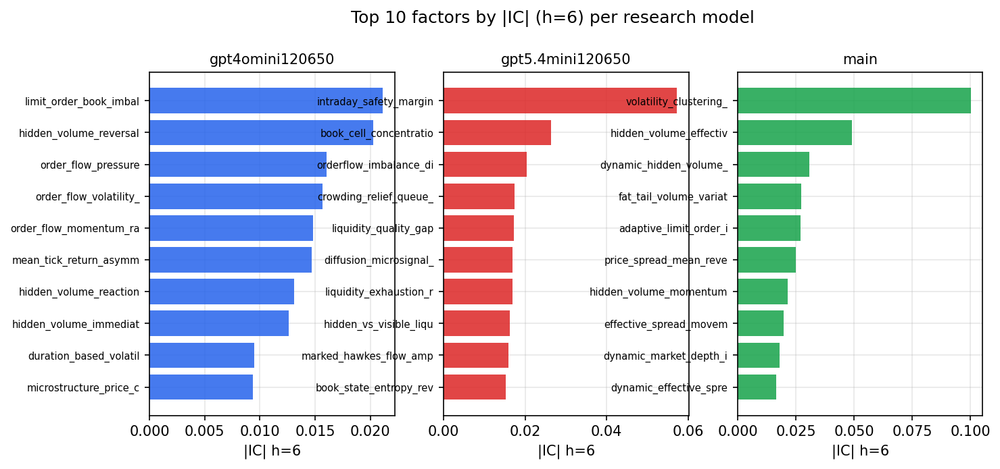

*Top factors by |IC| per research model*

## 2. Factor diversity & redundancy

Pairwise correlation of each zoo's *signals*. `eff_n_factors` is the effective number of independent factors (participation ratio of the correlation eigenvalues); `eff_ratio` and `redundancy` summarise how much unique information the zoo holds vs. how much is duplicated; `n_clusters` groups factors at |corr| ≥ 0.7.

| prerun | n_factors | eff_n_factors | eff_ratio | mean_abs_corr | n_clusters | redundancy |
| --- | --- | --- | --- | --- | --- | --- |
| gpt4omini120650 | 66 | 24.3232 | 0.3685 | 0.0766 | 54 | 0.6315 |
| gpt5.4mini120650 | 69 | 22.2354 | 0.3223 | 0.097 | 57 | 0.6777 |
| main | 109 | 39.6195 | 0.3635 | 0.0527 | 88 | 0.6365 |

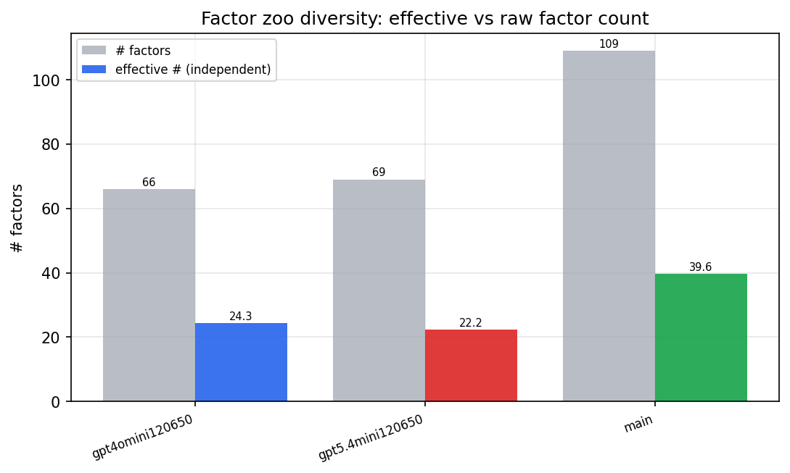

*Effective vs raw factor count per research model*

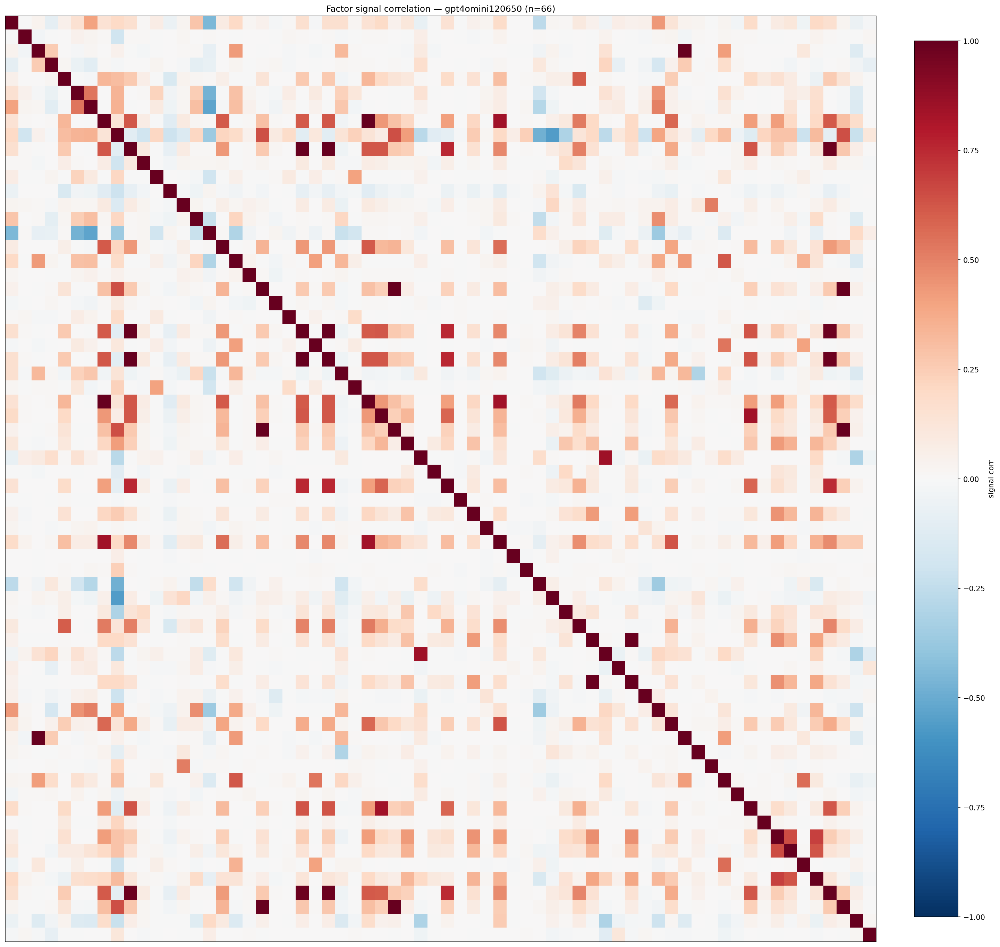

*Signal correlation matrix — gpt4omini120650*

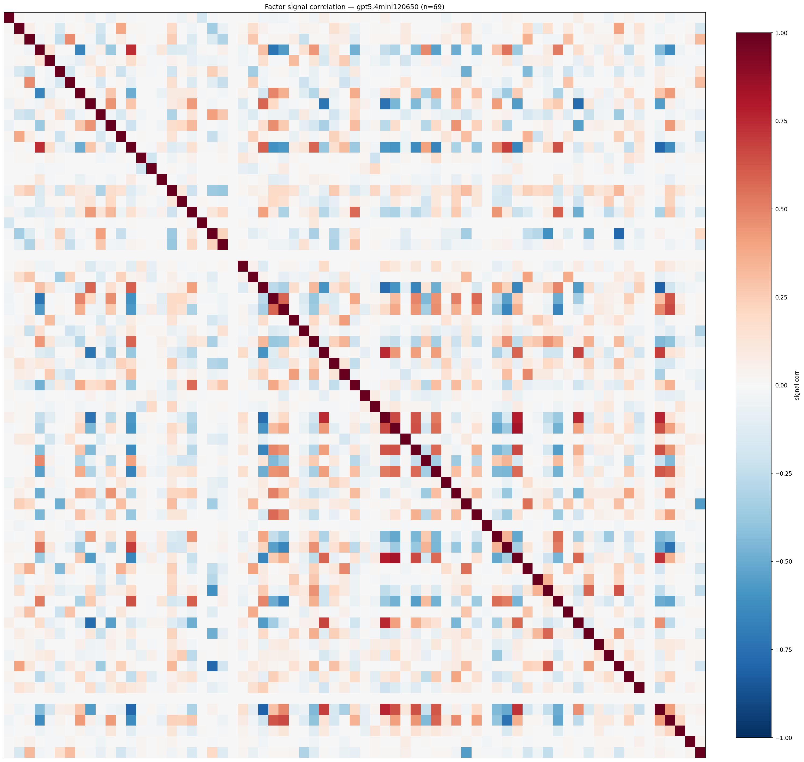

*Signal correlation matrix — gpt5.4mini120650*

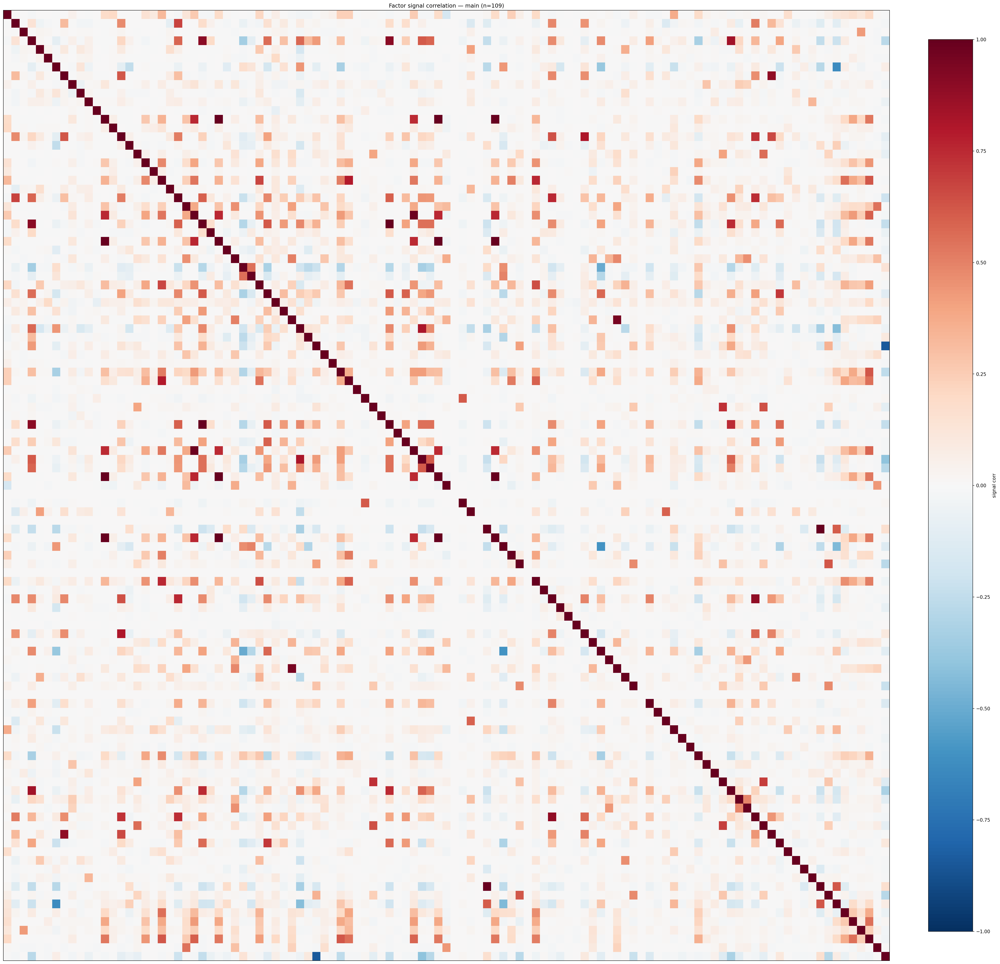

*Signal correlation matrix — main*

## 3. Deflation & model-based importance

`deflated_best_ic` haircuts each zoo's best |IC| for the number of factors tried (`ic_n_tested`) — a bigger zoo's best factor is more likely to be lucky. `lasso_n_nonzero` / `lasso_sparsity` show how many factors a sparse linear model actually keeps (model-view redundancy).

| prerun | best_ic | deflated_best_ic | deflated_best_t | ic_n_tested | ic_n_obs | lasso_n_nonzero | lasso_sparsity |
| --- | --- | --- | --- | --- | --- | --- | --- |
| gpt4omini120650 | 0.0211 | 0.0119 | 3.7289 | 66 | 98151 | 0 | 1.0 |
| gpt5.4mini120650 | 0.0572 | 0.048 | 15.0347 | 67 | 98151 | 7 | 0.8986 |
| main | 0.1003 | 0.0906 | 28.3854 | 103 | 98151 | 0 | 1.0 |

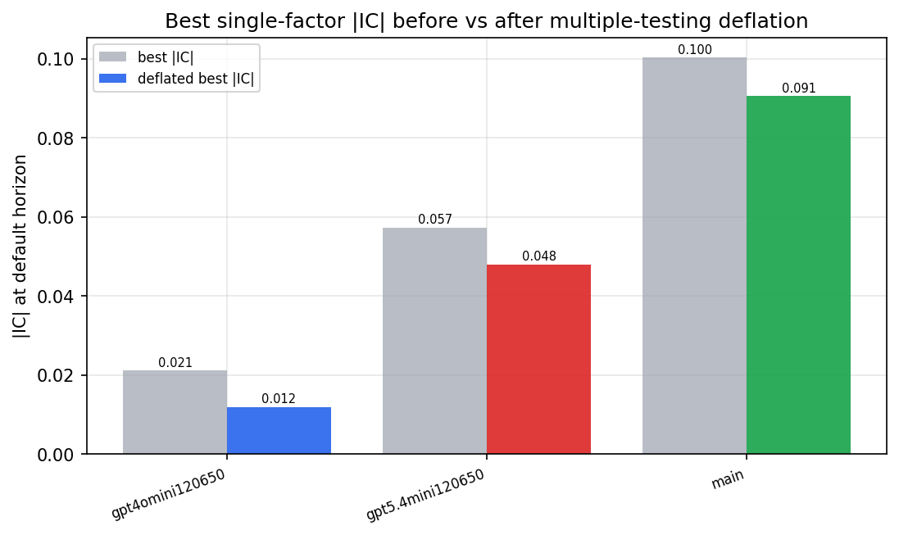

*Best |IC| before vs after multiple-testing deflation*

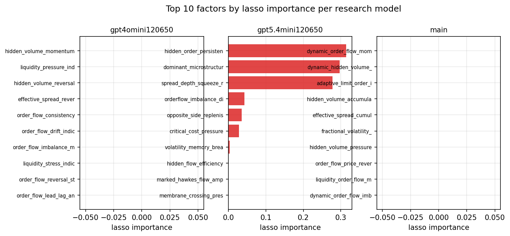

*Top factors by lasso importance per zoo*

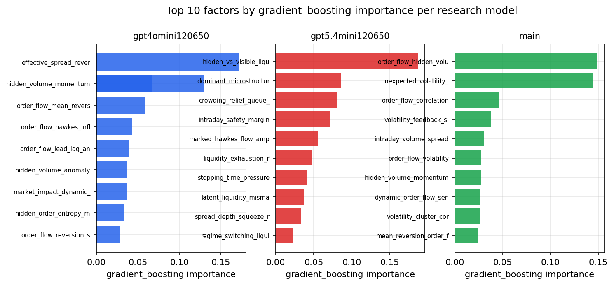

*Top factors by gradient_boosting importance per zoo*

## 4. ML-combined signal — per-underlying vectorised backtest

Each model combines a prerun's factors into ONE signal (fit `factors → forward return` on IS, predict per (bar, underlying)), then that combined signal is run through a simple vectorised backtest — `position(signal) × the underlying's own forward return` — on the held-out OOS tail (+ an equal-weight ensemble). No cross-sectional ranking.

> Config: position=**threshold** (t=1.0, z-score `expanding`), aggregation=**portfolio**, fit-standardise=**per_underlying**, horizon=6.

| prerun | model | n_factors_used | oos_ic | oos_sharpe | is_sharpe | oos_ann_return | oos_max_drawdown |
| --- | --- | --- | --- | --- | --- | --- | --- |
| gpt4omini120650 | linear_regression | 66 | -0.0028 | -3.9454 | 4.4048 | -0.5665 | -0.3527 |
| gpt4omini120650 | ridge | 66 | -0.003 | -3.0489 | 4.8032 | -0.4451 | -0.3013 |
| gpt4omini120650 | lasso | 66 | nan | nan | nan | nan | nan |
| gpt4omini120650 | elastic_net | 66 | nan | nan | nan | nan | nan |
| gpt4omini120650 | random_forest | 66 | 0.0015 | -1.0499 | 6.7779 | -0.1302 | -0.1576 |
| gpt4omini120650 | gradient_boosting | 66 | -0.0107 | 1.1676 | 3.6442 | 0.0629 | -0.0502 |
| gpt4omini120650 | xgboost | 66 | -0.0 | -1.5511 | 11.1801 | -0.2073 | -0.1932 |
| gpt4omini120650 | lightgbm | 66 | -0.0021 | 1.7036 | 17.617 | 0.2231 | -0.1196 |
| gpt4omini120650 | ensemble | 66 | -0.0026 | -0.0333 | 11.3045 | -0.0044 | -0.2063 |
| gpt5.4mini120650 | linear_regression | 69 | -0.0042 | -0.8304 | 8.1686 | -0.1343 | -0.2948 |
| gpt5.4mini120650 | ridge | 69 | -0.0046 | -0.8165 | 8.1185 | -0.1304 | -0.2836 |
| gpt5.4mini120650 | lasso | 69 | -0.0046 | -1.055 | 7.4136 | -0.1588 | -0.2846 |
| gpt5.4mini120650 | elastic_net | 69 | -0.0046 | -1.055 | 7.4136 | -0.1588 | -0.2846 |
| gpt5.4mini120650 | random_forest | 69 | -0.0062 | -1.8235 | 6.4232 | -0.2484 | -0.2773 |
| gpt5.4mini120650 | gradient_boosting | 69 | -0.0094 | -3.7296 | 5.68 | -0.419 | -0.2286 |
| gpt5.4mini120650 | xgboost | 69 | -0.0017 | -3.0835 | 9.1349 | -0.3797 | -0.2589 |
| gpt5.4mini120650 | lightgbm | 69 | -0.0 | -2.7625 | 15.3947 | -0.3081 | -0.2265 |
| gpt5.4mini120650 | ensemble | 69 | -0.0048 | -2.0634 | 11.7348 | -0.3121 | -0.3229 |
| main | linear_regression | 109 | -0.0019 | -3.0864 | 5.0937 | -0.2412 | -0.1172 |
| main | ridge | 109 | -0.0023 | -3.3027 | 4.9854 | -0.2534 | -0.1236 |
| main | lasso | 109 | nan | nan | nan | nan | nan |
| main | elastic_net | 109 | nan | nan | nan | nan | nan |
| main | random_forest | 109 | -0.0008 | -2.8359 | 8.0395 | -0.4278 | -0.285 |
| main | gradient_boosting | 109 | 0.0021 | 0.9986 | 6.7598 | 0.0852 | -0.0616 |
| main | xgboost | 109 | 0.0024 | -3.3124 | 11.2864 | -0.4765 | -0.3241 |
| main | lightgbm | 109 | 0.0023 | -2.3625 | 19.303 | -0.3547 | -0.2641 |
| main | ensemble | 109 | -0.0028 | -3.4306 | 12.9704 | -0.4655 | -0.3161 |

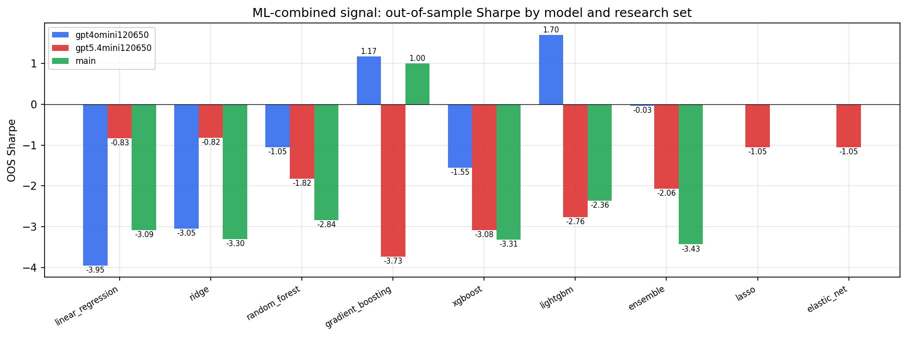

*ML-combined OOS Sharpe by model and research set*

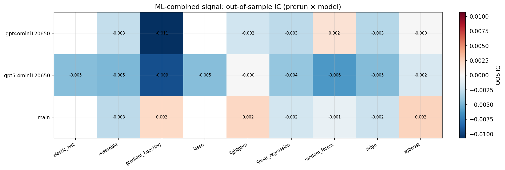

*ML-combined OOS IC (prerun × model)*

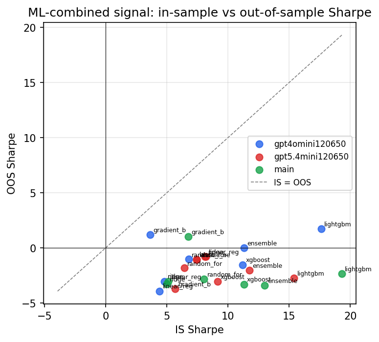

*IS vs OOS Sharpe (overfitting diagnostic)*

---
*Generated by `run_model_comparison.py`. Tables: `*.csv`; interactive: `comparison.ipynb`.*
