# Research-LLM factor comparison — `20260623_151609`

Comparing the **factor output of different research LLMs** on three axes (raw factor quality → factors as ML features → factors through the full agentic fund). The panel, IS/OOS split, horizon and model hyper-parameters are held identical across preruns — the *only* variable is the factor set.

## Preruns compared

| prerun | research_model | usable_factors | dropped_factors |
| --- | --- | --- | --- |
| sp100-5.4-mini | gpt-5.4-mini | 116 | 0 |
| sp100-4o-mini | gpt-4o-mini | 101 | 1 |
| main | ? | 10 | 99 |

> Dropped factors declare fields the current data doesn't have yet (e.g. fundamentals); they light up unchanged once that data is downloaded.

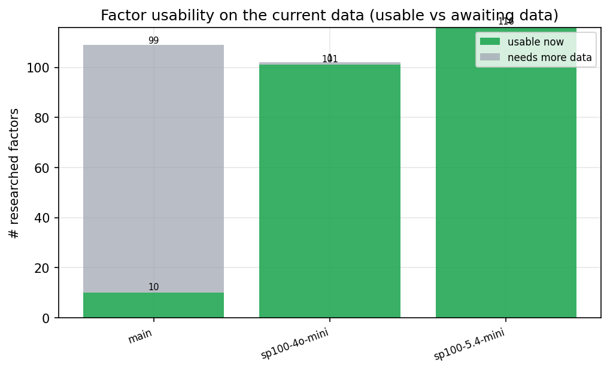

*Usable vs awaiting-data factors per research model*

## Key findings

- **Best ML-combined OOS Sharpe:** `main` with `gradient_boosting` (OOS Sharpe = 4.000).
- **Mean OOS Sharpe across models, by research set:** `main` = 3.082, `sp100-5.4-mini` = 0.564, `sp100-4o-mini` = -0.106.
- **Highest mean single-factor |IC| (h=6):** `sp100-4o-mini` (mean |IC| = 0.0061).
- **Most diverse zoo (highest effective/raw factor ratio):** `main` (eff 7.9 of 10, ratio 0.79).
- **Best selection-deflated single-factor |IC|:** `sp100-5.4-mini` (deflated |IC| = 0.0000 from 114 factors tried).

## 1. Single-factor IC (raw factor quality)

Cross-sectional Spearman rank-IC of every researched factor, recomputed on the shared panel at horizons h=1, h=6, h=60.

| prerun | n_factors | mean_abs_ic_1 | mean_abs_ic_6 | mean_abs_ic_60 | mean_abs_icir_6 | best_factor_h6 | best_abs_ic_h6 |
| --- | --- | --- | --- | --- | --- | --- | --- |
| main | 10 | 0.0028 | 0.0053 | 0.0108 | 0.0348 | unexpected_volatility_signal | 0.0115 |
| sp100-4o-mini | 101 | 0.0044 | 0.0061 | 0.011 | 0.0351 | intraday_price_correlation_decay | 0.0257 |
| sp100-5.4-mini | 116 | 0.0046 | 0.0038 | 0.0037 | 0.0231 | rough_volatility_persistence_spread | 0.0172 |

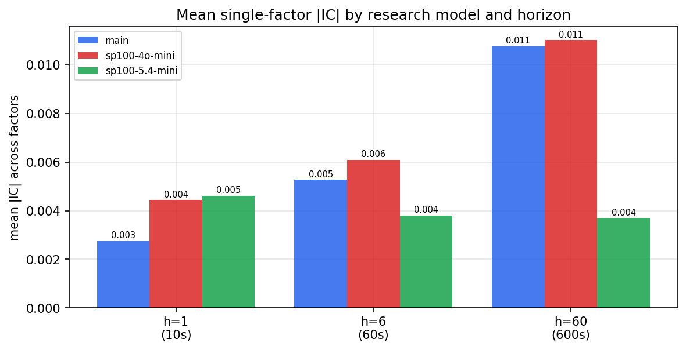

*Mean |IC| by research model and horizon*

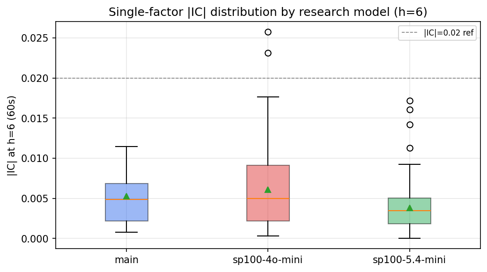

*Per-factor |IC| distribution by research model*

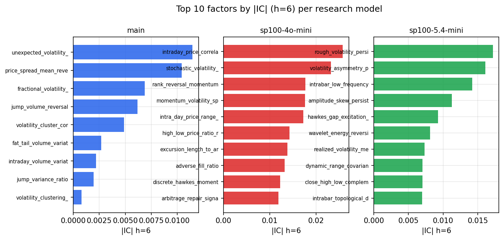

*Top factors by |IC| per research model*

## 2. Factor diversity & redundancy

Pairwise correlation of each zoo's *signals*. `eff_n_factors` is the effective number of independent factors (participation ratio of the correlation eigenvalues); `eff_ratio` and `redundancy` summarise how much unique information the zoo holds vs. how much is duplicated; `n_clusters` groups factors at |corr| ≥ 0.7.

| prerun | n_factors | eff_n_factors | eff_ratio | mean_abs_corr | n_clusters | redundancy |
| --- | --- | --- | --- | --- | --- | --- |
| sp100-5.4-mini | 116 | 13.8312 | 0.1192 | 0.1552 | 68 | 0.8808 |
| sp100-4o-mini | 101 | 22.3414 | 0.2212 | 0.0994 | 57 | 0.7788 |
| main | 10 | 7.879 | 0.7879 | 0.0605 | 9 | 0.2121 |

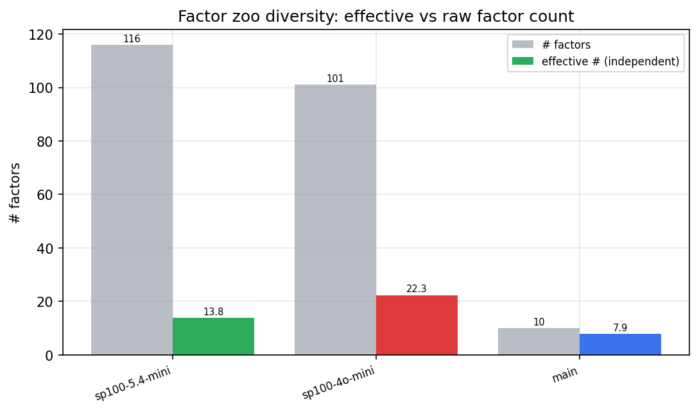

*Effective vs raw factor count per research model*

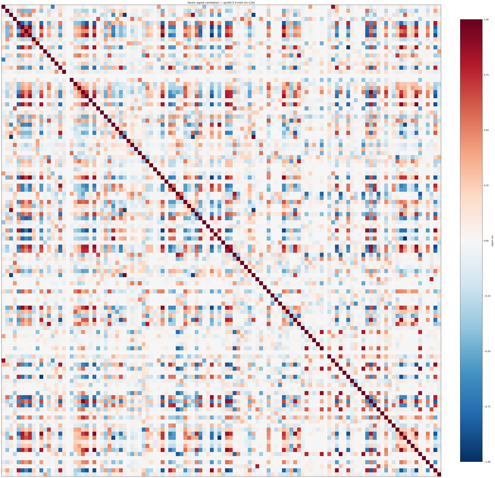

*Signal correlation matrix — sp100-5.4-mini*

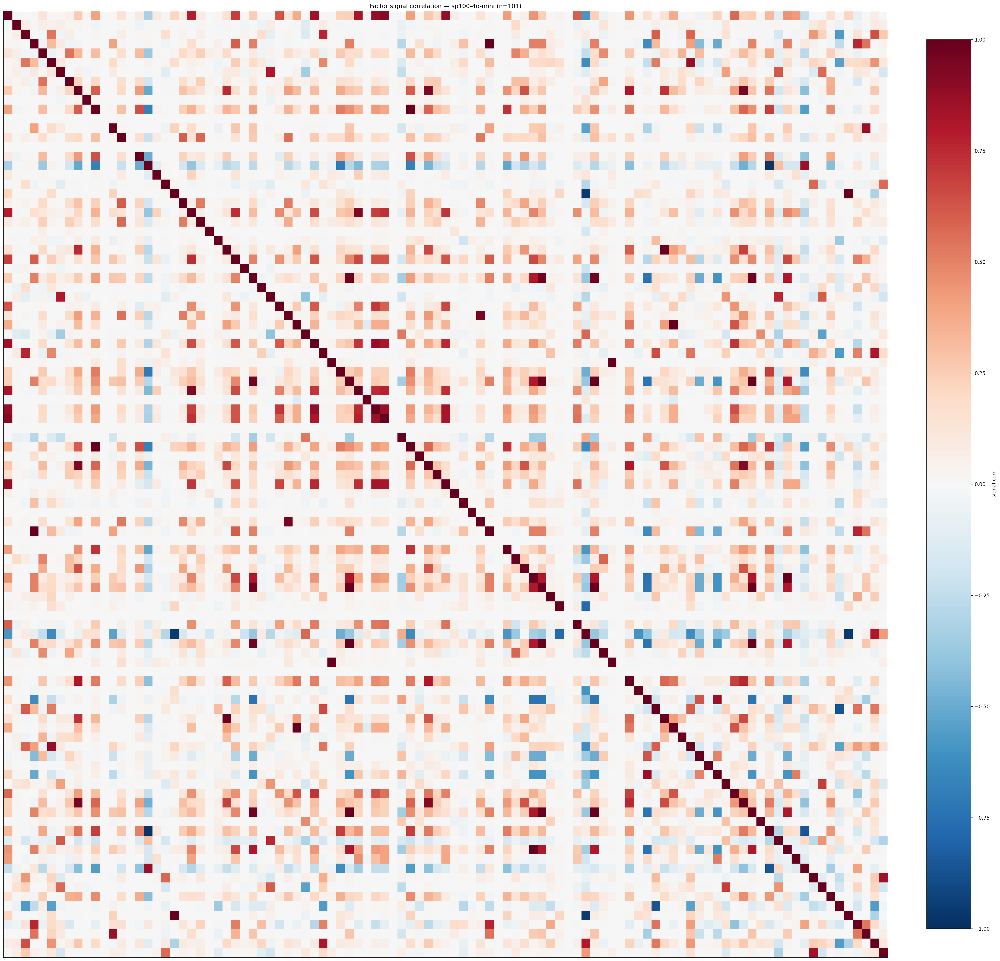

*Signal correlation matrix — sp100-4o-mini*

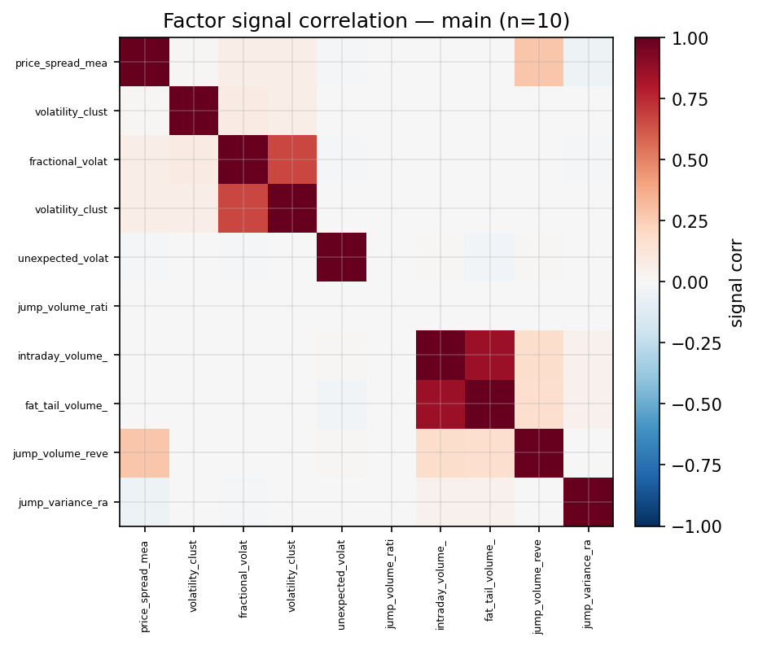

*Signal correlation matrix — main*

## 3. Deflation & model-based importance

`deflated_best_ic` haircuts each zoo's best |IC| for the number of factors tried (`ic_n_tested`) — a bigger zoo's best factor is more likely to be lucky. `lasso_n_nonzero` / `lasso_sparsity` show how many factors a sparse linear model actually keeps (model-view redundancy).

| prerun | best_ic | deflated_best_ic | deflated_best_t | ic_n_tested | ic_n_obs | lasso_n_nonzero | lasso_sparsity |
| --- | --- | --- | --- | --- | --- | --- | --- |
| sp100-5.4-mini | 0.0172 | 0.0 | -2.2843 | 114 | 2127 | 7 | 0.9397 |
| sp100-4o-mini | 0.0257 | 0.0 | -1.8197 | 92 | 2127 | 12 | 0.8812 |
| main | 0.0115 | 0.0 | -1.5687 | 9 | 2118 | 0 | 1.0 |

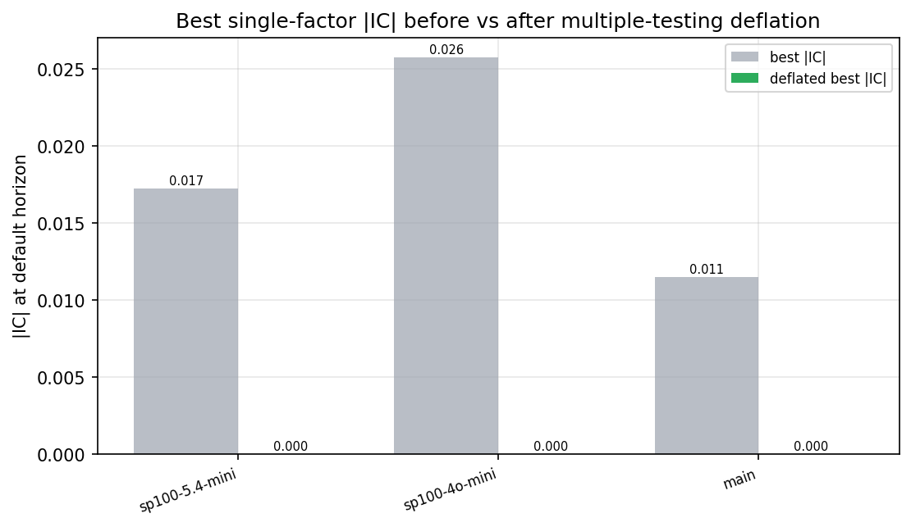

*Best |IC| before vs after multiple-testing deflation*

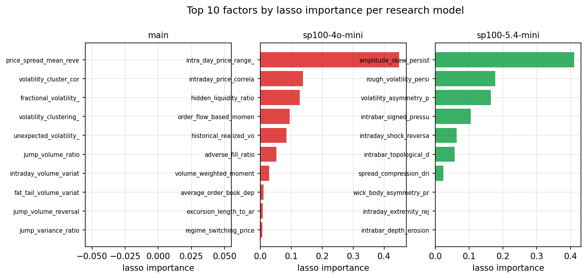

*Top factors by lasso importance per zoo*

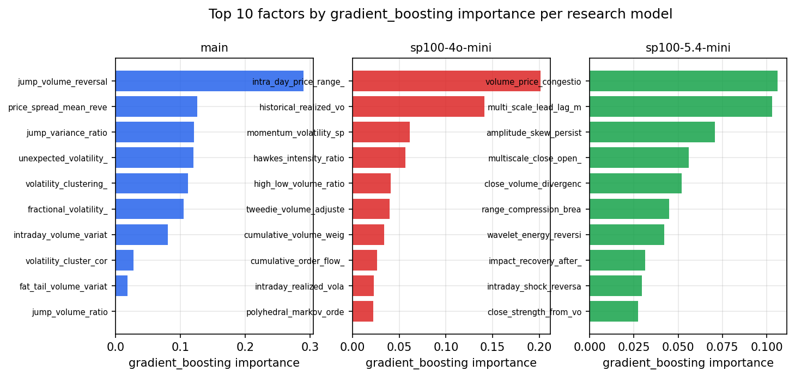

*Top factors by gradient_boosting importance per zoo*

## 4. ML-combined signal — per-underlying vectorised backtest

Each model combines a prerun's factors into ONE signal (fit `factors → forward return` on IS, predict per (bar, underlying)), then that combined signal is run through a simple vectorised backtest — `position(signal) × the underlying's own forward return` — on the held-out OOS tail (+ an equal-weight ensemble). No cross-sectional ranking.

> Config: position=**threshold** (t=1.0, z-score `expanding`), aggregation=**portfolio**, fit-standardise=**per_underlying**, horizon=6.

| prerun | model | n_factors_used | oos_ic | oos_sharpe | is_sharpe | oos_ann_return | oos_max_drawdown |
| --- | --- | --- | --- | --- | --- | --- | --- |
| sp100-5.4-mini | linear_regression | 116 | -0.0014 | 1.7652 | 1.9003 | 0.1389 | -0.0628 |
| sp100-5.4-mini | ridge | 116 | -0.0016 | 1.736 | 1.9106 | 0.1386 | -0.0644 |
| sp100-5.4-mini | lasso | 116 | nan | nan | nan | nan | nan |
| sp100-5.4-mini | elastic_net | 116 | nan | nan | nan | nan | nan |
| sp100-5.4-mini | random_forest | 116 | -0.0132 | 1.0561 | 1.6517 | 0.055 | -0.0386 |
| sp100-5.4-mini | gradient_boosting | 116 | -0.021 | -0.2676 | 1.8069 | -0.0139 | -0.086 |
| sp100-5.4-mini | xgboost | 116 | -0.0183 | -0.1217 | 2.3555 | -0.0057 | -0.0687 |
| sp100-5.4-mini | lightgbm | 116 | -0.0224 | -0.214 | 2.4919 | -0.0085 | -0.0609 |
| sp100-5.4-mini | ensemble | 116 | -0.0222 | -0.0087 | 2.2219 | -0.0004 | -0.0762 |
| sp100-4o-mini | linear_regression | 101 | -0.0134 | -1.4872 | 2.2417 | -0.1688 | -0.4407 |
| sp100-4o-mini | ridge | 101 | -0.0135 | -1.4724 | 2.2472 | -0.1671 | -0.4364 |
| sp100-4o-mini | lasso | 101 | -0.0118 | 1.1327 | 0.8351 | 0.1126 | -0.1618 |
| sp100-4o-mini | elastic_net | 101 | -0.0112 | 0.9813 | 0.7585 | 0.1002 | -0.1793 |
| sp100-4o-mini | random_forest | 101 | -0.0158 | 0.7645 | 2.5562 | 0.0333 | -0.0937 |
| sp100-4o-mini | gradient_boosting | 101 | -0.0156 | 0.1685 | 2.6746 | 0.0091 | -0.1543 |
| sp100-4o-mini | xgboost | 101 | -0.0176 | -0.3297 | 3.1142 | -0.019 | -0.1535 |
| sp100-4o-mini | lightgbm | 101 | -0.0146 | -0.1423 | 3.5763 | -0.0065 | -0.1031 |
| sp100-4o-mini | ensemble | 101 | -0.0173 | -0.5733 | 2.8783 | -0.0468 | -0.2542 |
| main | linear_regression | 10 | -0.0037 | 2.2334 | 0.9751 | 0.2336 | -0.1209 |
| main | ridge | 10 | -0.0036 | 2.2382 | 0.9809 | 0.2344 | -0.1191 |
| main | lasso | 10 | nan | nan | nan | nan | nan |
| main | elastic_net | 10 | nan | nan | nan | nan | nan |
| main | random_forest | 10 | 0.0096 | 3.9582 | 2.1024 | 0.3288 | -0.0951 |
| main | gradient_boosting | 10 | 0.0148 | 4.0004 | 2.145 | 0.3612 | -0.1292 |
| main | xgboost | 10 | 0.0081 | 3.1528 | 2.4371 | 0.2444 | -0.0793 |
| main | lightgbm | 10 | 0.0098 | 2.8869 | 3.0551 | 0.2193 | -0.0561 |
| main | ensemble | 10 | 0.0128 | 3.1022 | 2.1046 | 0.3032 | -0.1095 |

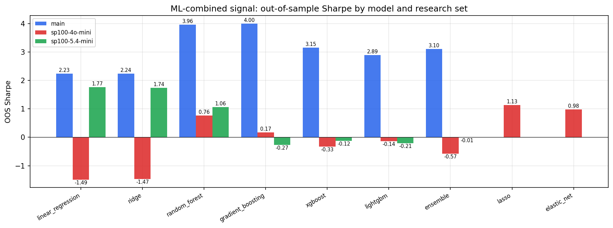

*ML-combined OOS Sharpe by model and research set*

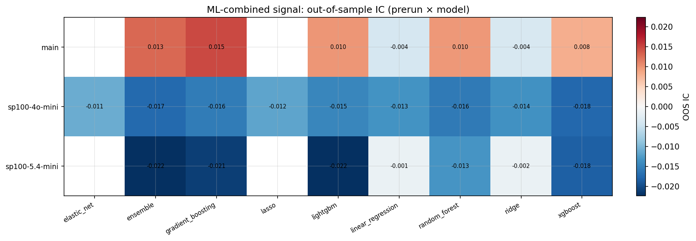

*ML-combined OOS IC (prerun × model)*

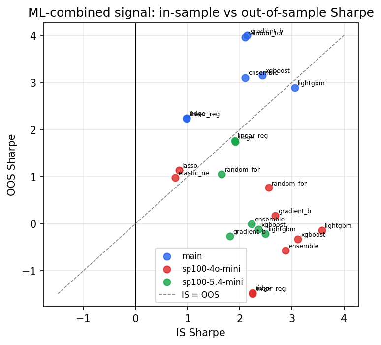

*IS vs OOS Sharpe (overfitting diagnostic)*

---
*Generated by `run_model_comparison.py`. Tables: `*.csv`; interactive: `comparison.ipynb`.*
