# Research-LLM factor comparison — `20260623_163959`

Comparing the **factor output of different research LLMs** on three axes (raw factor quality → factors as ML features → factors through the full agentic fund). The panel, IS/OOS split, horizon and model hyper-parameters are held identical across preruns — the *only* variable is the factor set.

## Preruns compared

| prerun | research_model | usable_factors | dropped_factors |
| --- | --- | --- | --- |
| sp100-5.4-mini | gpt-5.4-mini | 116 | 0 |
| sp100-4o-mini | gpt-4o-mini | 101 | 1 |
| main | seed library | 88 | 0 |

> Dropped factors declare fields the current data doesn't have yet (e.g. fundamentals); they light up unchanged once that data is downloaded.

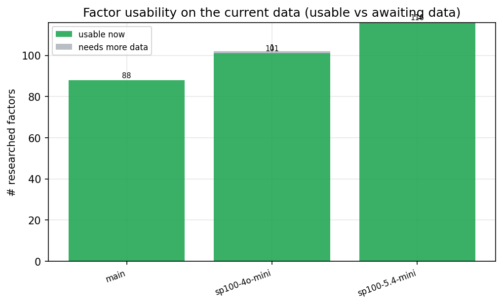

*Usable vs awaiting-data factors per research model*

## Key findings

- **Best ML-combined OOS Sharpe:** `sp100-5.4-mini` with `linear_regression` (OOS Sharpe = 1.784).
- **Mean OOS Sharpe across models, by research set:** `sp100-5.4-mini` = 0.675, `sp100-4o-mini` = -0.145, `main` = -0.270.
- **Highest mean single-factor |IC| (h=6):** `sp100-4o-mini` (mean |IC| = 0.0060).
- **Most diverse zoo (highest effective/raw factor ratio):** `main` (eff 23.0 of 88, ratio 0.26).
- **Best selection-deflated single-factor |IC|:** `sp100-5.4-mini` (deflated |IC| = 0.0000 from 114 factors tried).

## 1. Single-factor IC (raw factor quality)

Cross-sectional Spearman rank-IC of every researched factor, recomputed on the shared panel at horizons h=1, h=6, h=60.

| prerun | n_factors | mean_abs_ic_1 | mean_abs_ic_6 | mean_abs_ic_60 | mean_abs_icir_6 | best_factor_h6 | best_abs_ic_h6 |
| --- | --- | --- | --- | --- | --- | --- | --- |
| main | 88 | 0.0044 | 0.0051 | 0.0058 | 0.0328 | alpha_026 | 0.0159 |
| sp100-4o-mini | 101 | 0.0044 | 0.006 | 0.0109 | 0.0344 | intraday_price_correlation_decay | 0.0258 |
| sp100-5.4-mini | 116 | 0.0046 | 0.0038 | 0.0037 | 0.0231 | rough_volatility_persistence_spread | 0.0172 |

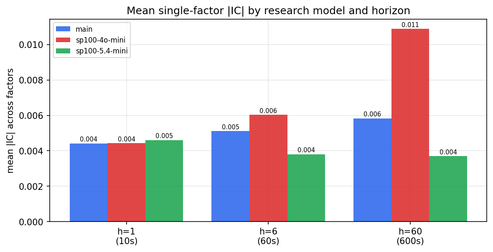

*Mean |IC| by research model and horizon*

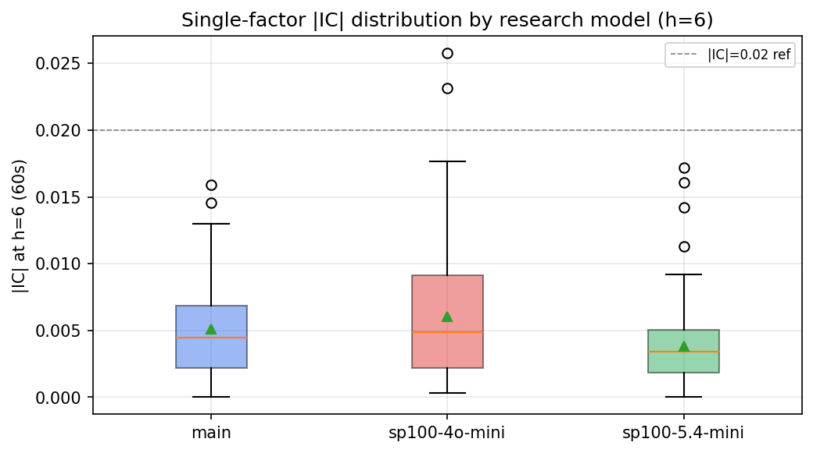

*Per-factor |IC| distribution by research model*

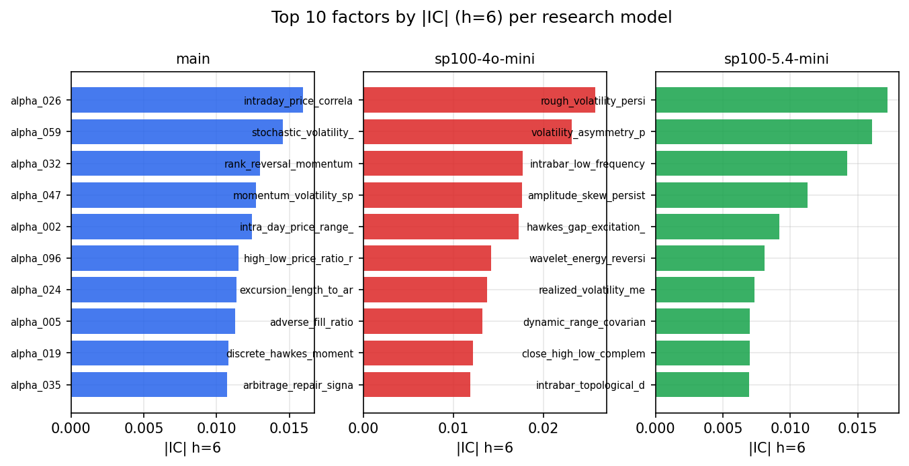

*Top factors by |IC| per research model*

## 2. Factor diversity & redundancy

Pairwise correlation of each zoo's *signals*. `eff_n_factors` is the effective number of independent factors (participation ratio of the correlation eigenvalues); `eff_ratio` and `redundancy` summarise how much unique information the zoo holds vs. how much is duplicated; `n_clusters` groups factors at |corr| ≥ 0.7.

| prerun | n_factors | eff_n_factors | eff_ratio | mean_abs_corr | n_clusters | redundancy |
| --- | --- | --- | --- | --- | --- | --- |
| sp100-5.4-mini | 116 | 13.8313 | 0.1192 | 0.1552 | 68 | 0.8808 |
| sp100-4o-mini | 101 | 22.3391 | 0.2212 | 0.0994 | 57 | 0.7788 |
| main | 88 | 23.0293 | 0.2617 | 0.1255 | 78 | 0.7383 |

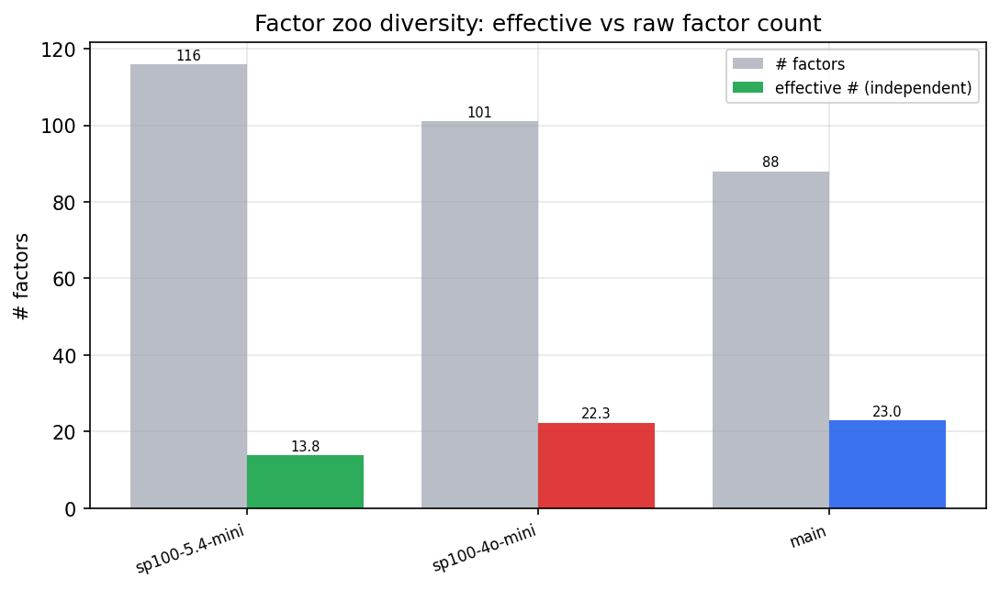

*Effective vs raw factor count per research model*

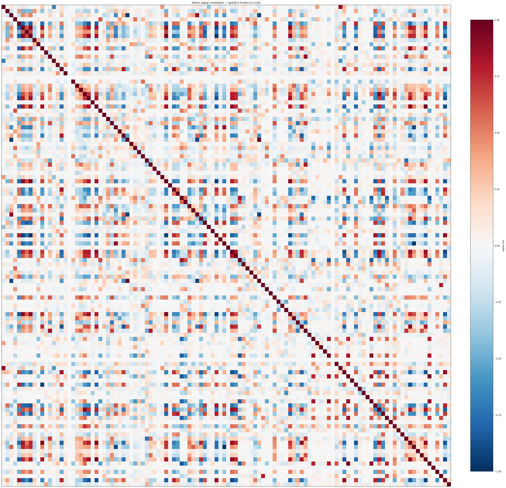

*Signal correlation matrix — sp100-5.4-mini*

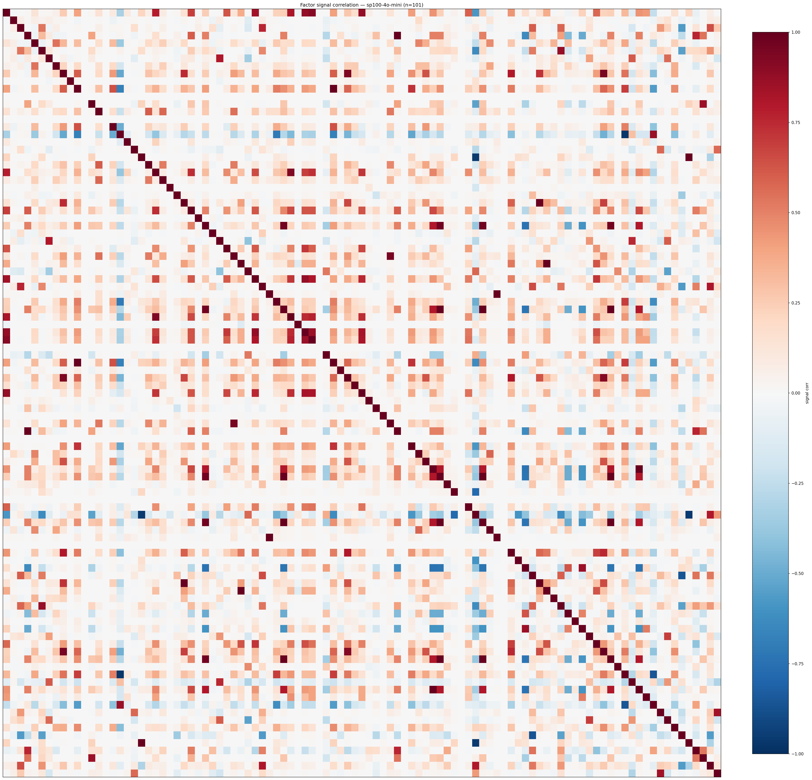

*Signal correlation matrix — sp100-4o-mini*

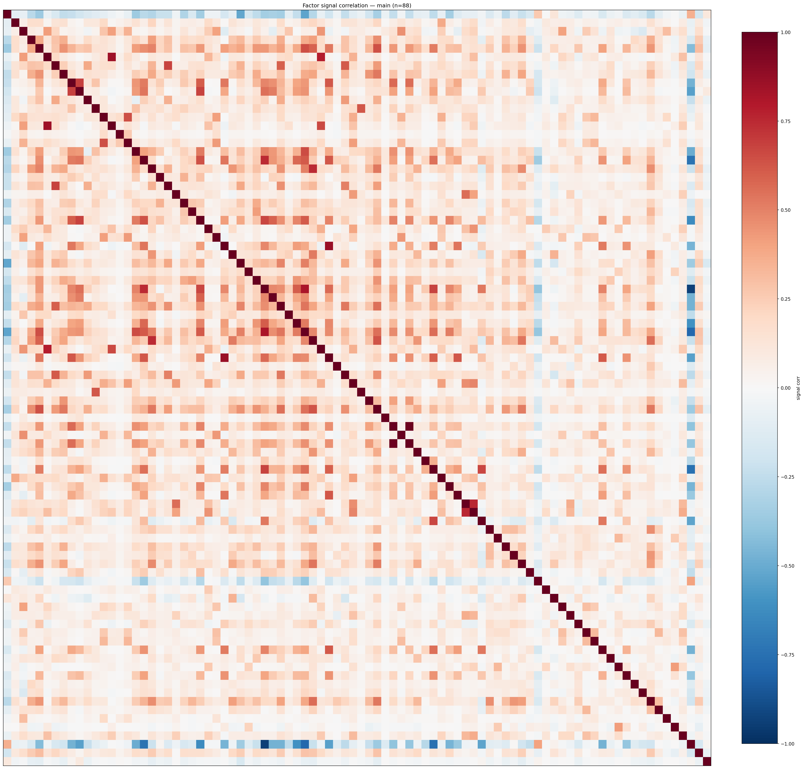

*Signal correlation matrix — main*

## 3. Deflation & model-based importance

`deflated_best_ic` haircuts each zoo's best |IC| for the number of factors tried (`ic_n_tested`) — a bigger zoo's best factor is more likely to be lucky. `lasso_n_nonzero` / `lasso_sparsity` show how many factors a sparse linear model actually keeps (model-view redundancy).

| prerun | best_ic | deflated_best_ic | deflated_best_t | ic_n_tested | ic_n_obs | lasso_n_nonzero | lasso_sparsity |
| --- | --- | --- | --- | --- | --- | --- | --- |
| sp100-5.4-mini | 0.0172 | 0.0 | -2.2842 | 114 | 2127 | 7 | 0.9397 |
| sp100-4o-mini | 0.0258 | 0.0 | -1.8196 | 92 | 2127 | 12 | 0.8812 |
| main | 0.0159 | 0.0 | -2.2576 | 88 | 2127 | 0 | 1.0 |

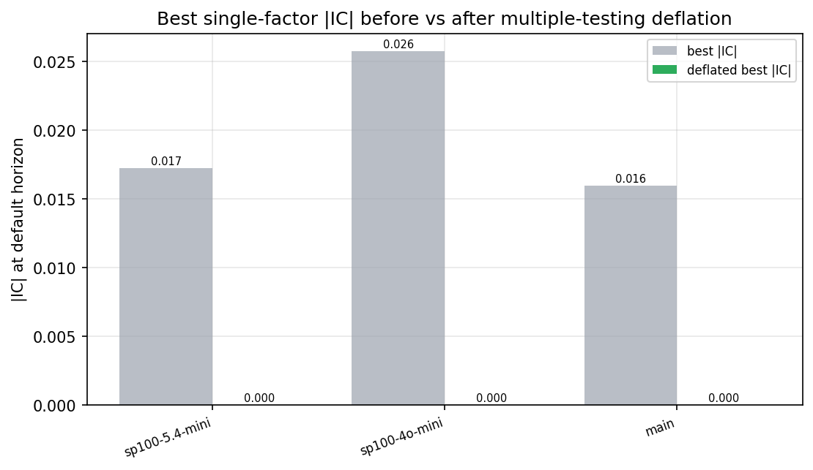

*Best |IC| before vs after multiple-testing deflation*

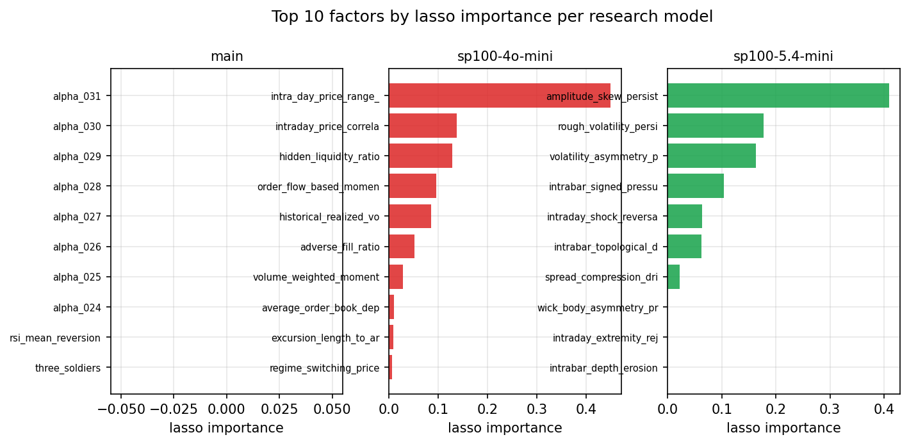

*Top factors by lasso importance per zoo*

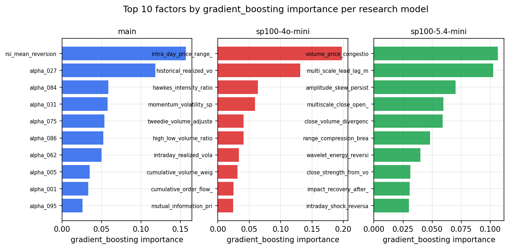

*Top factors by gradient_boosting importance per zoo*

## 4. ML-combined signal — per-underlying vectorised backtest

Each model combines a prerun's factors into ONE signal (fit `factors → forward return` on IS, predict per (bar, underlying)), then that combined signal is run through a simple vectorised backtest — `position(signal) × the underlying's own forward return` — on the held-out OOS tail (+ an equal-weight ensemble). No cross-sectional ranking.

> Config: position=**threshold** (t=1.0, z-score `expanding`), aggregation=**portfolio**, fit-standardise=**per_underlying**, horizon=6.

| prerun | model | n_factors_used | oos_ic | oos_sharpe | is_sharpe | oos_ann_return | oos_max_drawdown |
| --- | --- | --- | --- | --- | --- | --- | --- |
| sp100-5.4-mini | linear_regression | 116 | -0.0014 | 1.7841 | 1.8947 | 0.1404 | -0.0625 |
| sp100-5.4-mini | ridge | 116 | -0.0015 | 1.7624 | 1.91 | 0.1408 | -0.0632 |
| sp100-5.4-mini | lasso | 116 | nan | nan | nan | nan | nan |
| sp100-5.4-mini | elastic_net | 116 | nan | nan | nan | nan | nan |
| sp100-5.4-mini | random_forest | 116 | -0.0132 | 1.0522 | 1.6501 | 0.055 | -0.0383 |
| sp100-5.4-mini | gradient_boosting | 116 | -0.0222 | -0.0036 | 1.855 | -0.0002 | -0.0734 |
| sp100-5.4-mini | xgboost | 116 | -0.0222 | -0.2714 | 2.3231 | -0.0125 | -0.0838 |
| sp100-5.4-mini | lightgbm | 116 | -0.0233 | 0.1384 | 2.5346 | 0.0055 | -0.0536 |
| sp100-5.4-mini | ensemble | 116 | -0.0232 | 0.2655 | 2.1818 | 0.0113 | -0.0597 |
| sp100-4o-mini | linear_regression | 101 | -0.014 | -1.5158 | 2.2527 | -0.1706 | -0.4435 |
| sp100-4o-mini | ridge | 101 | -0.014 | -1.5098 | 2.2583 | -0.1703 | -0.4425 |
| sp100-4o-mini | lasso | 101 | -0.0118 | 1.1327 | 0.8351 | 0.1126 | -0.1618 |
| sp100-4o-mini | elastic_net | 101 | -0.0112 | 0.9813 | 0.7577 | 0.1002 | -0.1793 |
| sp100-4o-mini | random_forest | 101 | -0.0158 | 0.7289 | 2.5563 | 0.0319 | -0.095 |
| sp100-4o-mini | gradient_boosting | 101 | -0.0152 | -0.0479 | 2.6743 | -0.0026 | -0.1674 |
| sp100-4o-mini | xgboost | 101 | -0.0219 | -0.2787 | 3.0597 | -0.0157 | -0.1652 |
| sp100-4o-mini | lightgbm | 101 | -0.0115 | -0.1472 | 3.4569 | -0.0065 | -0.0934 |
| sp100-4o-mini | ensemble | 101 | -0.0172 | -0.6449 | 2.8603 | -0.0532 | -0.2637 |
| main | linear_regression | 88 | -0.0228 | 0.3757 | 2.2916 | 0.0258 | -0.1013 |
| main | ridge | 88 | -0.0229 | 0.3715 | 2.2974 | 0.0255 | -0.1019 |
| main | lasso | 88 | nan | nan | nan | nan | nan |
| main | elastic_net | 88 | nan | nan | nan | nan | nan |
| main | random_forest | 88 | nan | nan | nan | nan | nan |
| main | gradient_boosting | 88 | nan | nan | nan | nan | nan |
| main | xgboost | 88 | -0.026 | -0.7737 | 3.2287 | -0.0525 | -0.2152 |
| main | lightgbm | 88 | -0.0253 | -0.8654 | 3.6847 | -0.0478 | -0.1722 |
| main | ensemble | 88 | -0.0251 | -0.4605 | 3.1666 | -0.0264 | -0.1417 |

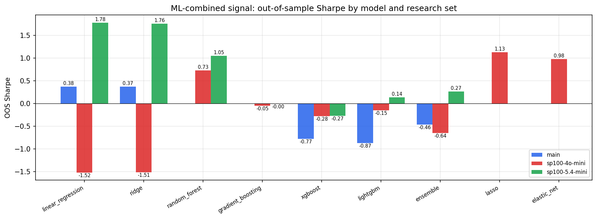

*ML-combined OOS Sharpe by model and research set*

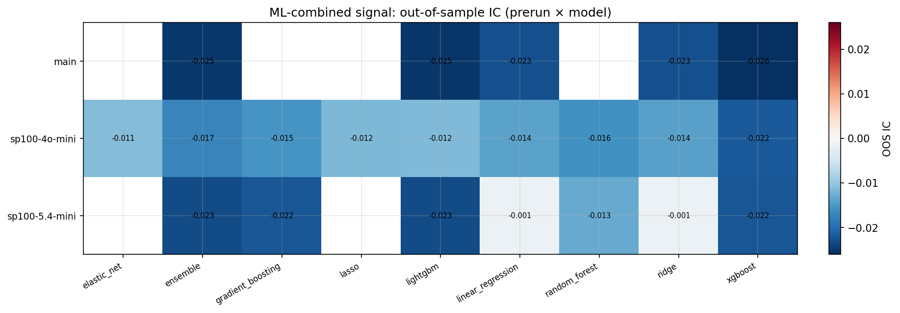

*ML-combined OOS IC (prerun × model)*

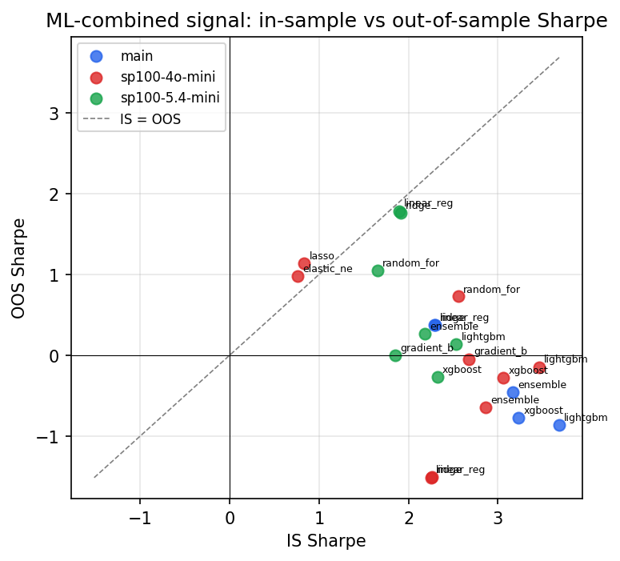

*IS vs OOS Sharpe (overfitting diagnostic)*

---
*Generated by `run_model_comparison.py`. Tables: `*.csv`; interactive: `comparison.ipynb`.*
