# Research-LLM factor comparison — `gld_hf_l4wf`

Comparing the **factor output of different research LLMs** on three axes (raw factor quality → factors as ML features → factors through the full agentic fund). The panel, IS/OOS split, horizon and model hyper-parameters are held identical across preruns — the *only* variable is the factor set.

## Preruns compared

| prerun | research_model | usable_factors | dropped_factors |
| --- | --- | --- | --- |
| L4WF_gld_s0 | gpt-5.6-terra | 26 | 0 |

> Dropped factors declare fields the current data doesn't have yet (e.g. fundamentals); they light up unchanged once that data is downloaded.

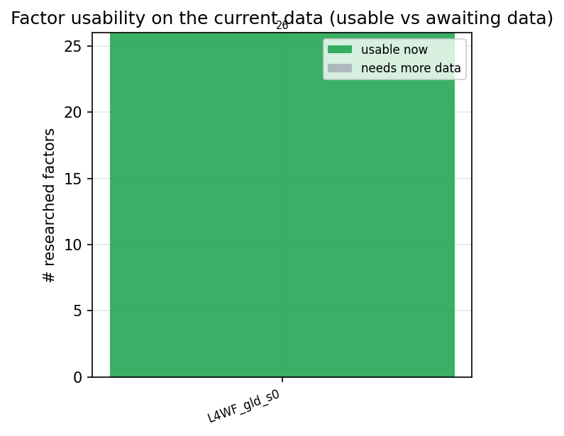

*Usable vs awaiting-data factors per research model*

## Key findings

- **Best ML-combined OOS Sharpe:** `L4WF_gld_s0` with `random_forest` (OOS Sharpe = 1.067).
- **Mean OOS Sharpe across models, by research set:** `L4WF_gld_s0` = 0.376.
- **Most diverse zoo (highest effective/raw factor ratio):** `L4WF_gld_s0` (eff 19.3 of 26, ratio 0.74).
- **Best selection-deflated single-factor |IC|:** `L4WF_gld_s0` (deflated |IC| = 0.0072 from 11 factors tried).

## 1. Single-factor IC (raw factor quality)

Per-underlying time-series Pearson IC of every researched factor, recomputed on the shared panel at horizons h=1, h=60, h=60. The per-underlying IC computes one factor/forward-return correlation per asset and aggregates them by valid observation count; the cross-sectional IC correlates across underlyings per timestamp.

| prerun | n_factors | mean_abs_ic_1 | mean_abs_ic_60 |
| --- | --- | --- | --- |
| L4WF_gld_s0 | 26 | 0.001 | 0.0053 |

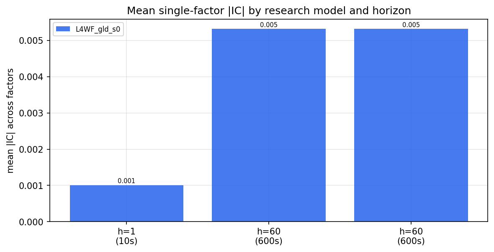

*Mean |IC| by research model and horizon*

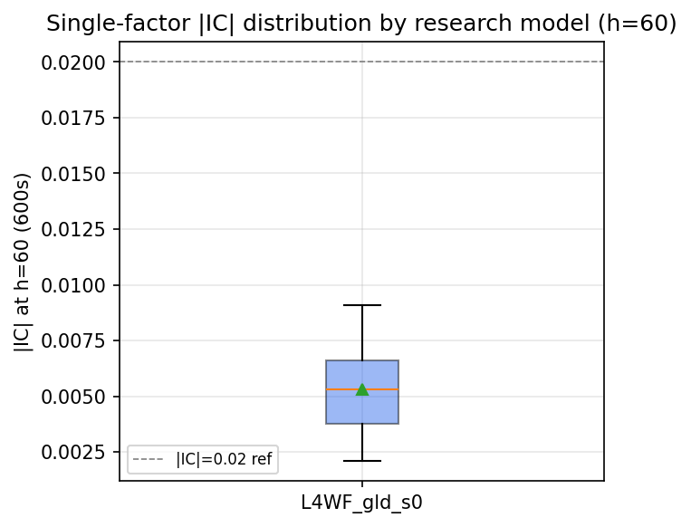

*Per-factor |IC| distribution by research model*

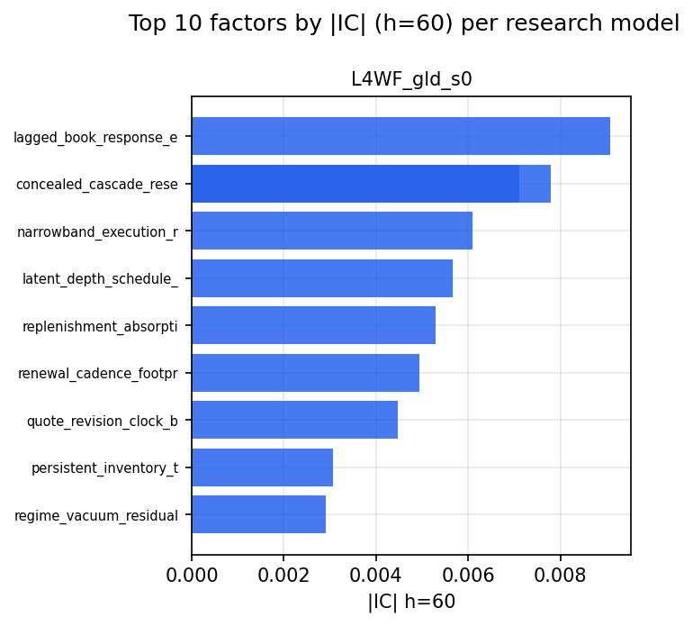

*Top factors by |IC| per research model*

## 2. Factor diversity & redundancy

Pairwise correlation of each zoo's *signals*. `eff_n_factors` is the effective number of independent factors (participation ratio of the correlation eigenvalues); `eff_ratio` and `redundancy` summarise how much unique information the zoo holds vs. how much is duplicated; `n_clusters` groups factors at |corr| ≥ 0.7.

| prerun | n_factors | eff_n_factors | eff_ratio | mean_abs_corr | n_clusters | redundancy |
| --- | --- | --- | --- | --- | --- | --- |
| L4WF_gld_s0 | 26 | 19.3456 | 0.7441 | 0.0193 | 24 | 0.2559 |

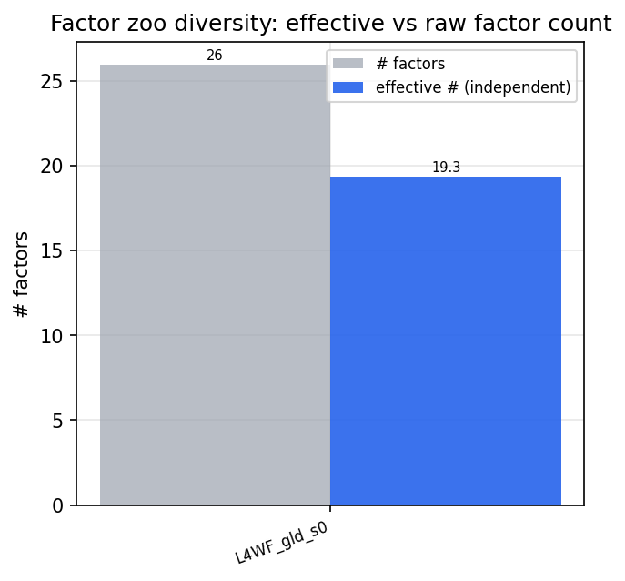

*Effective vs raw factor count per research model*

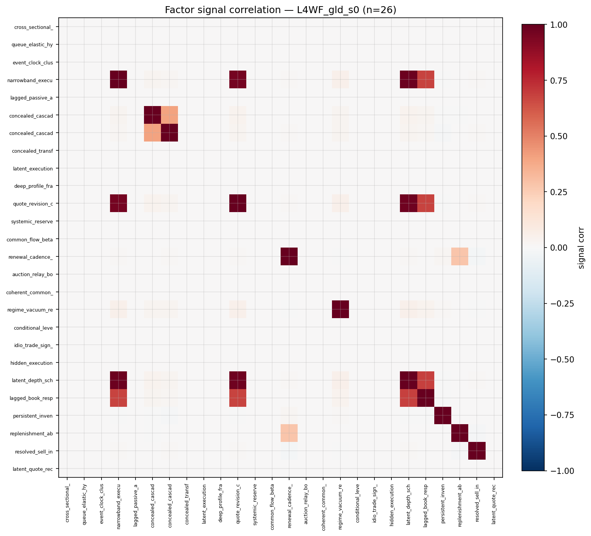

*Signal correlation matrix — L4WF_gld_s0*

## 3. Deflation & model-based importance

`deflated_best_ic` haircuts each zoo's best |IC| for the number of factors tried (`ic_n_tested`) — a bigger zoo's best factor is more likely to be lucky. `lasso_n_nonzero` / `lasso_sparsity` show how many factors a sparse linear model actually keeps (model-view redundancy).

| prerun | best_ic | deflated_best_ic | deflated_best_t | ic_n_tested | ic_n_obs | lasso_n_nonzero | lasso_sparsity |
| --- | --- | --- | --- | --- | --- | --- | --- |
| L4WF_gld_s0 | 0.0091 | 0.0072 | 8.5655 | 11 | 1402193 | 0 | 1.0 |

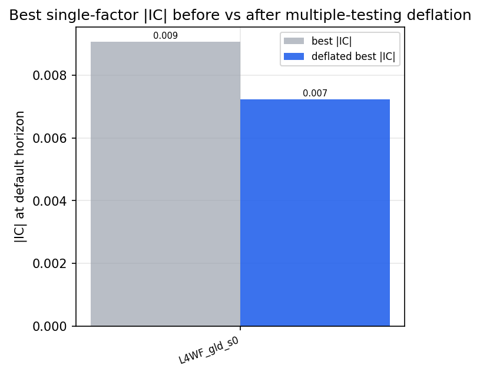

*Best |IC| before vs after multiple-testing deflation*

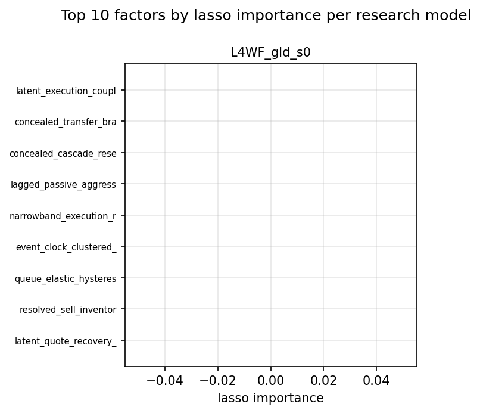

*Top factors by lasso importance per zoo*

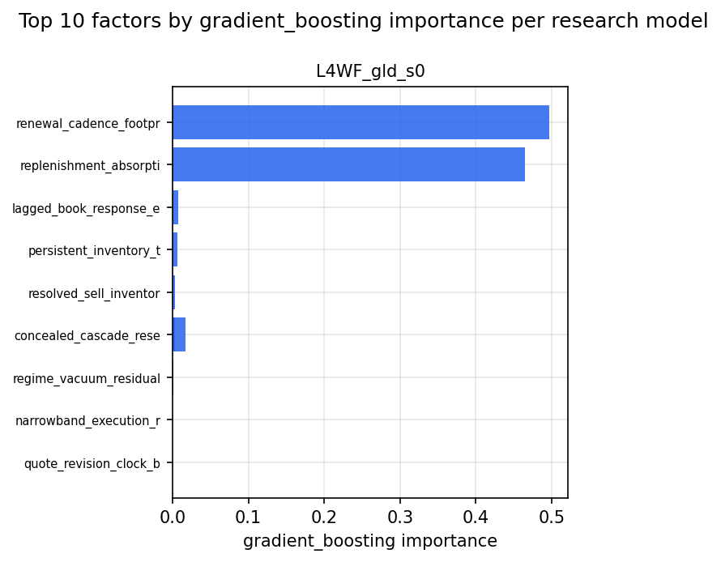

*Top factors by gradient_boosting importance per zoo*

## 4. ML-combined signal — per-underlying vectorised backtest

Each model combines a prerun's factors into ONE signal (fit `factors → forward return` on IS, predict per (bar, underlying)), then that combined signal is run through a simple vectorised backtest — `position(signal) × the underlying's own forward return` — on the held-out OOS tail (+ an equal-weight ensemble). No cross-sectional ranking.

> Config: position=**threshold** (t=1.0, z-score `expanding`), aggregation=**portfolio**, fit-standardise=**per_underlying**, horizon=60.

| prerun | model | n_factors_used | oos_ic | oos_sharpe | is_sharpe | oos_ann_return | oos_max_drawdown |
| --- | --- | --- | --- | --- | --- | --- | --- |
| L4WF_gld_s0 | linear_regression | 26 | -0.0016 | -0.1287 | 2.8826 | -0.0112 | -0.0766 |
| L4WF_gld_s0 | ridge | 26 | -0.0016 | -0.1177 | 2.8845 | -0.0103 | -0.0772 |
| L4WF_gld_s0 | lasso | 26 | nan | nan | nan | nan | nan |
| L4WF_gld_s0 | elastic_net | 26 | nan | nan | nan | nan | nan |
| L4WF_gld_s0 | random_forest | 26 | 0.0013 | 1.0675 | 2.8217 | 0.0914 | -0.0417 |
| L4WF_gld_s0 | gradient_boosting | 26 | -0.001 | 0.4345 | 2.9252 | 0.0317 | -0.0505 |
| L4WF_gld_s0 | xgboost | 26 | 0.001 | 0.8944 | 3.3421 | 0.0854 | -0.0424 |
| L4WF_gld_s0 | lightgbm | 26 | 0.0021 | 0.2536 | 4.8495 | 0.0166 | -0.0328 |
| L4WF_gld_s0 | ensemble | 26 | 0.0002 | 0.2293 | 3.9037 | 0.0189 | -0.0598 |

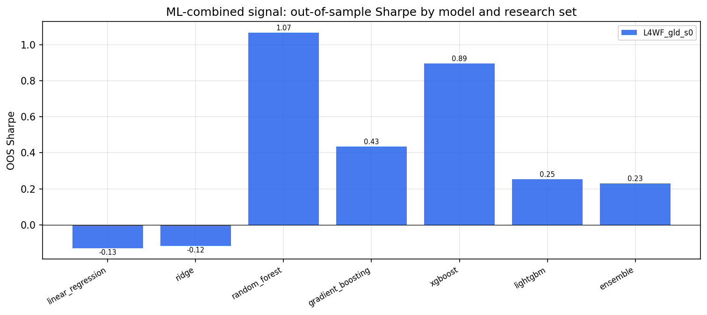

*ML-combined OOS Sharpe by model and research set*

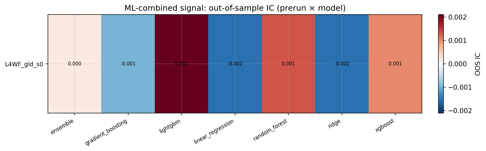

*ML-combined OOS IC (prerun × model)*

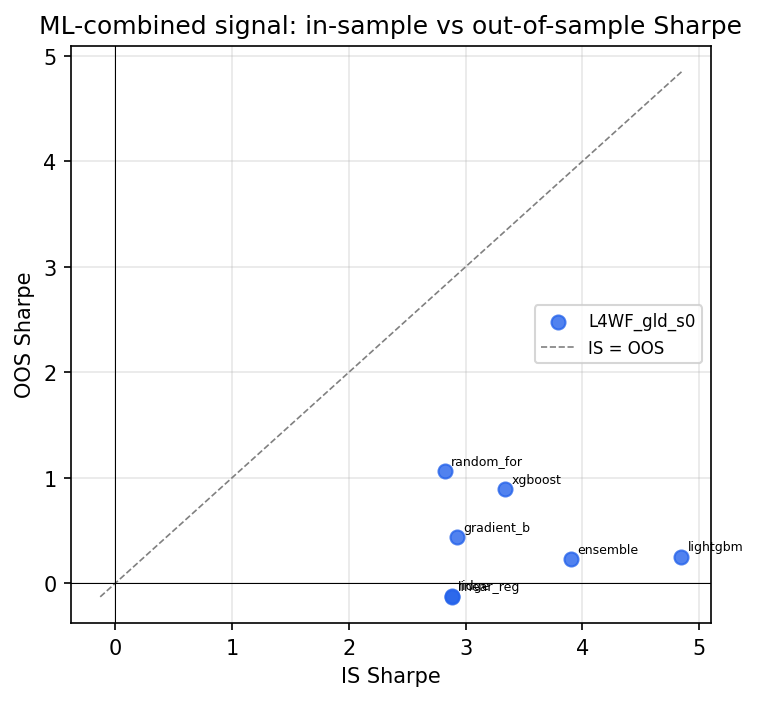

*IS vs OOS Sharpe (overfitting diagnostic)*

---
*Generated by `run_model_comparison.py`. Tables: `*.csv`; interactive: `comparison.ipynb`.*
