# Research-LLM factor comparison — `2024-03`

Comparing the **factor output of different research LLMs** on three axes (raw factor quality → factors as ML features → factors through the full agentic fund). The panel, IS/OOS split, horizon and model hyper-parameters are held identical across preruns — the *only* variable is the factor set.

## Preruns compared

| prerun | research_model | usable_factors | dropped_factors |
| --- | --- | --- | --- |
| gpt4omini120650 | gpt-4o-mini | 66 | 0 |
| gpt5.4mini120650 | gpt-5.4-mini | 68 | 1 |
| main | seed library | 77 | 11 |

> Dropped factors declare fields the current data doesn't have yet (e.g. fundamentals); they light up unchanged once that data is downloaded.

*Usable vs awaiting-data factors per research model*

## Key findings

- **Best ML-combined OOS Sharpe:** `main` with `random_forest` (OOS Sharpe = 15.868).
- **Mean OOS Sharpe across models, by research set:** `main` = 13.136, `gpt4omini120650` = 8.920, `gpt5.4mini120650` = 5.269.
- **Highest mean single-factor |IC| (h=6):** `main` (mean |IC| = 0.0531).
- **Most diverse zoo (highest effective/raw factor ratio):** `gpt5.4mini120650` (eff 55.6 of 68, ratio 0.82).
- **Best selection-deflated single-factor |IC|:** `main` (deflated |IC| = 0.1137 from 36 factors tried).

## 1. Single-factor IC (raw factor quality)

Per-underlying time-series Spearman rank-IC of every researched factor, recomputed on the shared panel at horizons h=1, h=6, h=60. The per-underlying IC correlates each factor's value vector with the underlying's own forward-return vector (pooled across underlyings); the cross-sectional IC ranks across underlyings per timestamp.

| prerun | n_factors | mean_abs_ic_1 | mean_abs_ic_6 | mean_abs_ic_60 | mean_abs_icir_6 | best_factor_h6 | best_abs_ic_h6 |
| --- | --- | --- | --- | --- | --- | --- | --- |
| gpt4omini120650 | 66 | 0.0212 | 0.0205 | 0.0157 | 0.6354 | hawkes_process_order_flow_indicator | 0.0797 |
| gpt5.4mini120650 | 68 | 0.0147 | 0.0164 | 0.0131 | 0.6357 | deterministic_control_gap | 0.095 |
| main | 77 | 0.0468 | 0.0531 | 0.0349 | 0.9808 | alpha_032 | 0.1208 |

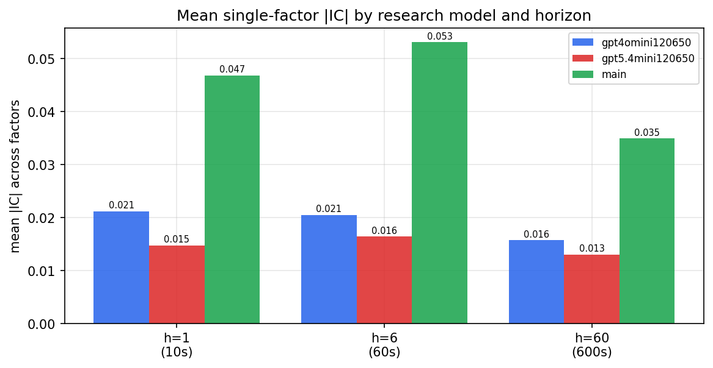

*Mean |IC| by research model and horizon*

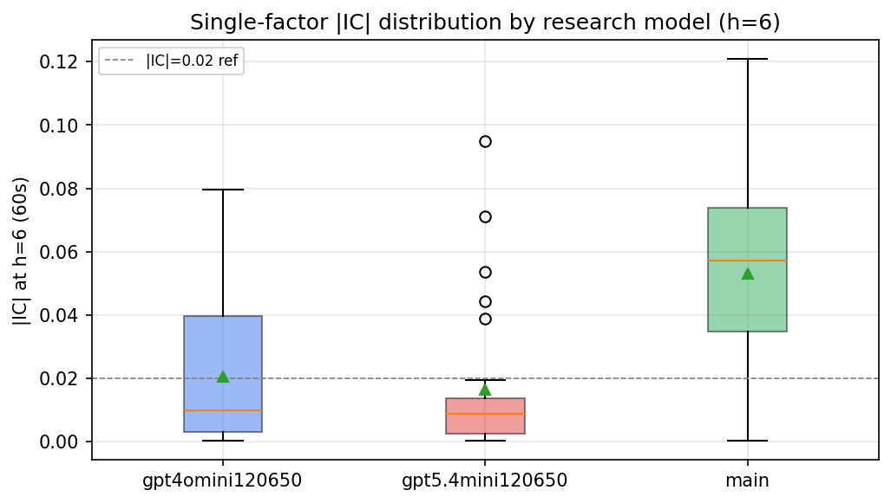

*Per-factor |IC| distribution by research model*

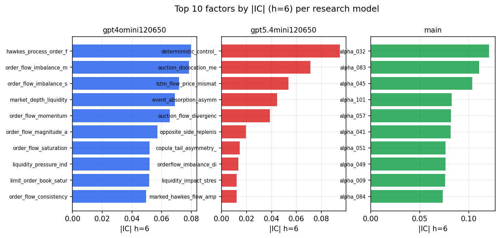

*Top factors by |IC| per research model*

## 2. Factor diversity & redundancy

Pairwise correlation of each zoo's *signals*. `eff_n_factors` is the effective number of independent factors (participation ratio of the correlation eigenvalues); `eff_ratio` and `redundancy` summarise how much unique information the zoo holds vs. how much is duplicated; `n_clusters` groups factors at |corr| ≥ 0.7.

| prerun | n_factors | eff_n_factors | eff_ratio | mean_abs_corr | n_clusters | redundancy |
| --- | --- | --- | --- | --- | --- | --- |
| gpt4omini120650 | 66 | 33.9605 | 0.5146 | 0.0428 | 55 | 0.4854 |
| gpt5.4mini120650 | 68 | 55.586 | 0.8174 | 0.0087 | 64 | 0.1826 |
| main | 77 | 44.633 | 0.5796 | 0.0295 | 70 | 0.4204 |

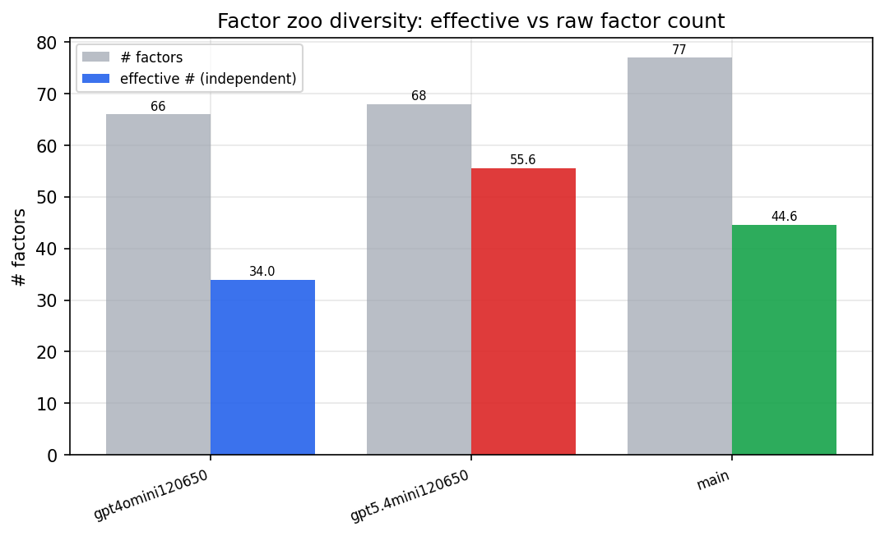

*Effective vs raw factor count per research model*

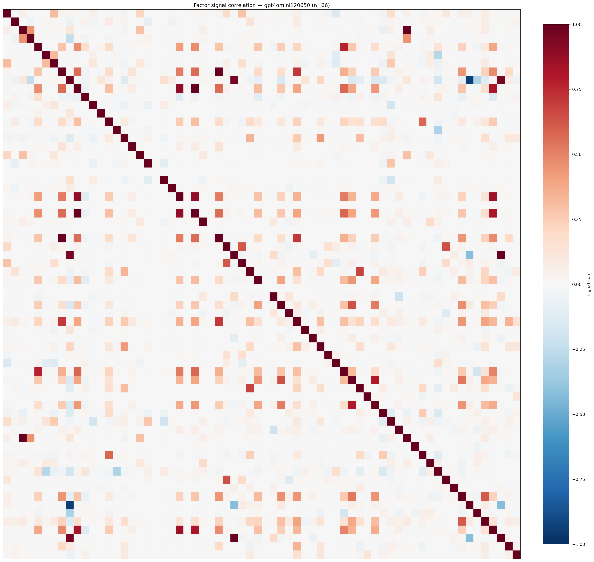

*Signal correlation matrix — gpt4omini120650*

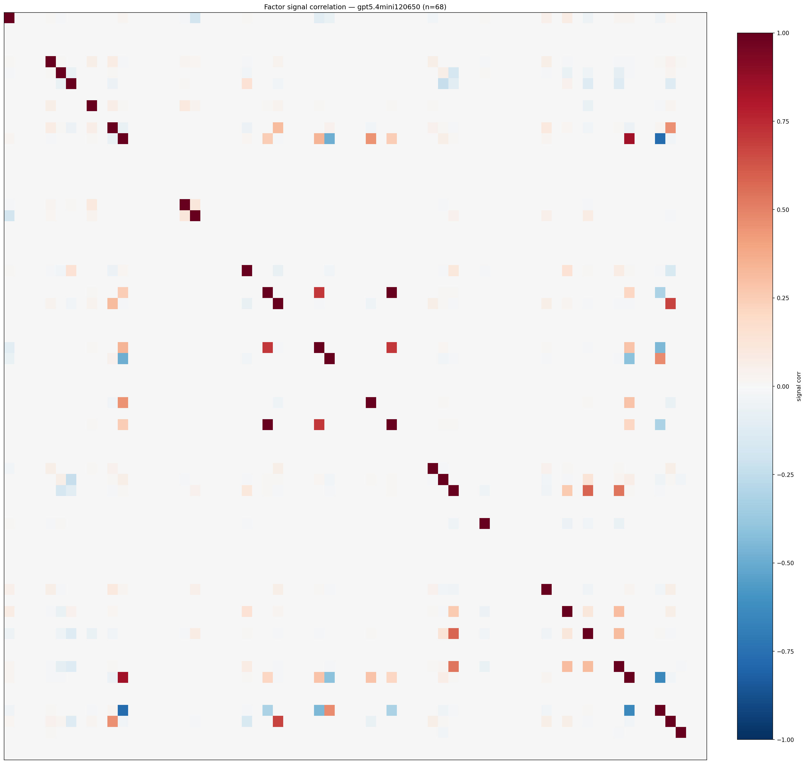

*Signal correlation matrix — gpt5.4mini120650*

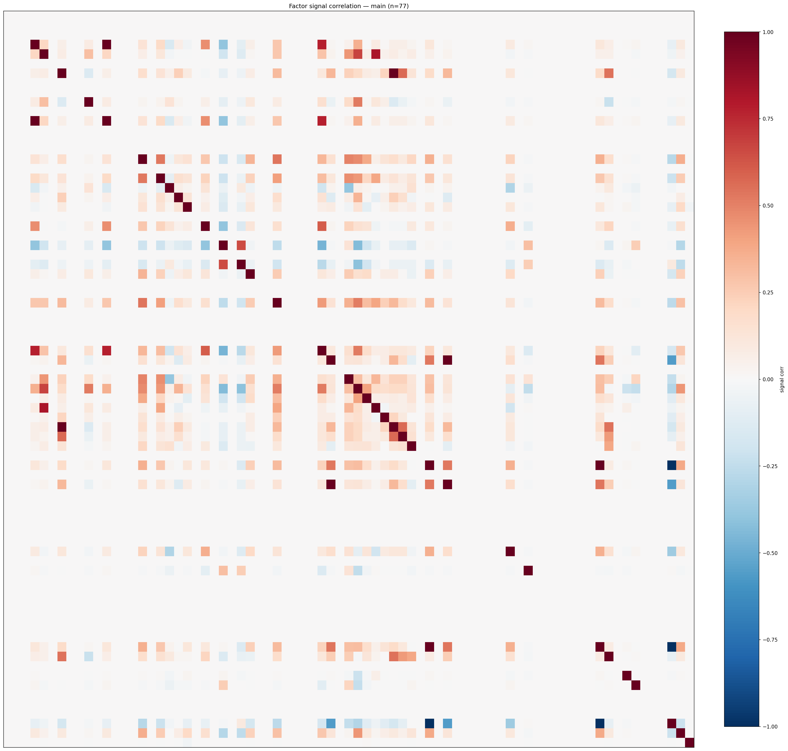

*Signal correlation matrix — main*

## 3. Deflation & model-based importance

`deflated_best_ic` haircuts each zoo's best |IC| for the number of factors tried (`ic_n_tested`) — a bigger zoo's best factor is more likely to be lucky. `lasso_n_nonzero` / `lasso_sparsity` show how many factors a sparse linear model actually keeps (model-view redundancy).

| prerun | best_ic | deflated_best_ic | deflated_best_t | ic_n_tested | ic_n_obs | lasso_n_nonzero | lasso_sparsity |
| --- | --- | --- | --- | --- | --- | --- | --- |
| gpt4omini120650 | 0.0797 | 0.0721 | 27.236 | 62 | 142739 | 18 | 0.7273 |
| gpt5.4mini120650 | 0.095 | 0.0882 | 33.3205 | 28 | 142739 | 6 | 0.9118 |
| main | 0.1208 | 0.1137 | 42.9495 | 36 | 142739 | 18 | 0.7662 |

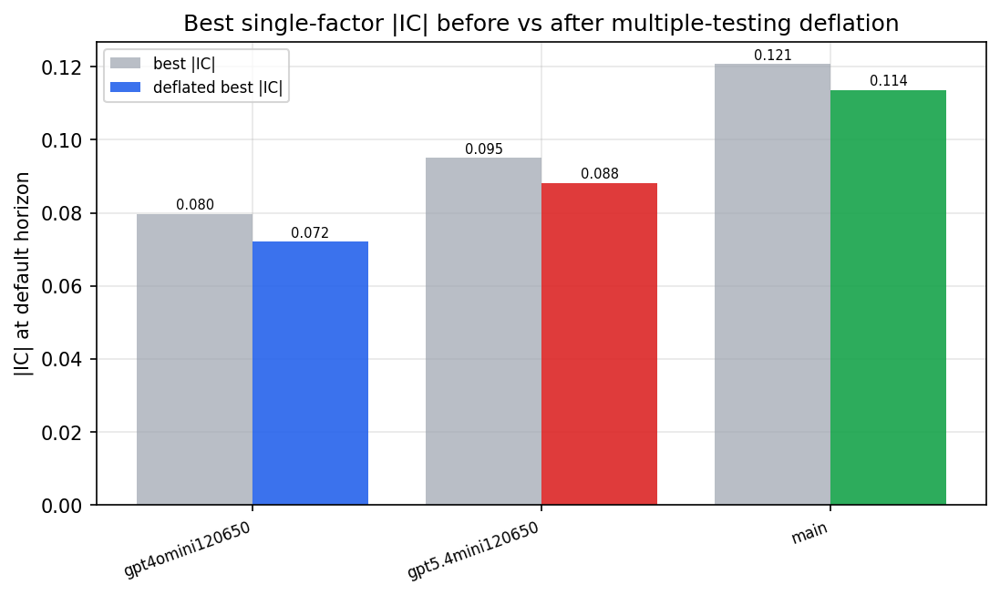

*Best |IC| before vs after multiple-testing deflation*

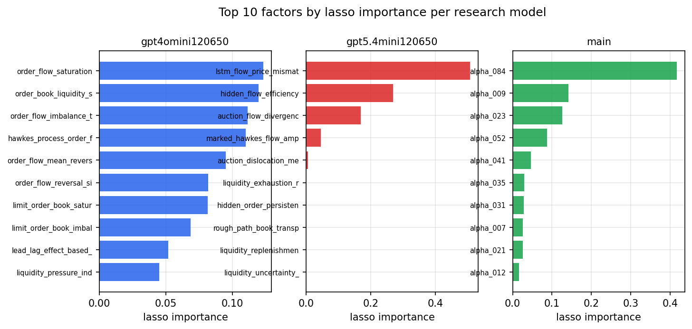

*Top factors by lasso importance per zoo*

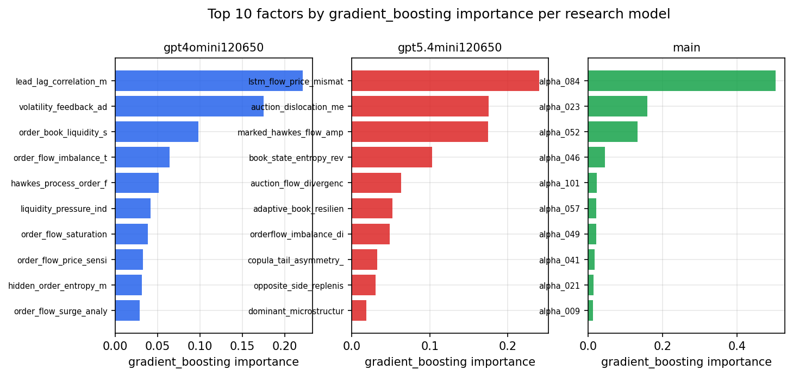

*Top factors by gradient_boosting importance per zoo*

## 4. ML-combined signal — per-underlying vectorised backtest

Each model combines a prerun's factors into ONE signal (fit `factors → forward return` on IS, predict per (bar, underlying)), then that combined signal is run through a simple vectorised backtest — `position(signal) × the underlying's own forward return` — on the held-out OOS tail (+ an equal-weight ensemble). No cross-sectional ranking.

> Config: position=**threshold** (t=1.0, z-score `expanding`), aggregation=**portfolio**, fit-standardise=**per_underlying**, horizon=6.

| prerun | model | n_factors_used | oos_ic | oos_sharpe | is_sharpe | oos_ann_return | oos_max_drawdown |
| --- | --- | --- | --- | --- | --- | --- | --- |
| gpt4omini120650 | linear_regression | 66 | 0.0435 | 10.6 | 16.8406 | 1.1875 | -0.0123 |
| gpt4omini120650 | ridge | 66 | 0.043 | 10.4893 | 17.2966 | 1.1767 | -0.0136 |
| gpt4omini120650 | lasso | 66 | 0.0329 | 12.5753 | 14.9733 | 1.237 | -0.0101 |
| gpt4omini120650 | elastic_net | 66 | 0.0331 | 12.7021 | 15.1612 | 1.2576 | -0.0101 |
| gpt4omini120650 | random_forest | 66 | 0.0443 | 4.3445 | 16.6076 | 0.9157 | -0.025 |
| gpt4omini120650 | gradient_boosting | 66 | 0.0455 | 7.2264 | 14.1956 | 0.5763 | -0.0113 |
| gpt4omini120650 | xgboost | 66 | 0.042 | 7.0476 | 16.0766 | 0.7232 | -0.0119 |
| gpt4omini120650 | lightgbm | 66 | 0.047 | 6.8719 | 15.9856 | 0.6901 | -0.01 |
| gpt4omini120650 | ensemble | 66 | 0.0447 | 8.4273 | 18.4457 | 1.1449 | -0.0144 |
| gpt5.4mini120650 | linear_regression | 68 | 0.0526 | 6.7024 | 13.6509 | 0.7403 | -0.0138 |
| gpt5.4mini120650 | ridge | 68 | 0.0542 | 6.7137 | 13.4495 | 0.7406 | -0.0138 |
| gpt5.4mini120650 | lasso | 68 | 0.0525 | 5.5111 | 15.24 | 0.6881 | -0.0172 |
| gpt5.4mini120650 | elastic_net | 68 | 0.0529 | 5.8864 | 14.7798 | 0.7425 | -0.0173 |
| gpt5.4mini120650 | random_forest | 68 | 0.0548 | 6.1591 | 23.1635 | 0.636 | -0.0153 |
| gpt5.4mini120650 | gradient_boosting | 68 | 0.0531 | 5.0556 | 11.7674 | 0.3234 | -0.0084 |
| gpt5.4mini120650 | xgboost | 68 | 0.0535 | 4.2477 | 13.4544 | 0.4097 | -0.0148 |
| gpt5.4mini120650 | lightgbm | 68 | 0.0523 | 1.7115 | 15.1209 | 0.2249 | -0.0272 |
| gpt5.4mini120650 | ensemble | 68 | 0.0544 | 5.4358 | 16.0708 | 0.7527 | -0.0171 |
| main | linear_regression | 77 | 0.0531 | 14.9165 | 21.3843 | 1.3823 | -0.0053 |
| main | ridge | 77 | 0.049 | 14.9657 | 21.0223 | 1.3545 | -0.0051 |
| main | lasso | 77 | 0.0445 | 14.5041 | 20.8997 | 1.2925 | -0.0056 |
| main | elastic_net | 77 | 0.0446 | 14.5269 | 20.8998 | 1.2946 | -0.0056 |
| main | random_forest | 77 | 0.0808 | 15.8683 | 31.4243 | 1.6418 | -0.0075 |
| main | gradient_boosting | 77 | 0.0705 | 8.6046 | 18.899 | 0.7665 | -0.0109 |
| main | xgboost | 77 | 0.0679 | 9.5133 | 21.2819 | 0.7703 | -0.0071 |
| main | lightgbm | 77 | 0.0749 | 11.6524 | 21.9307 | 1.0605 | -0.0068 |
| main | ensemble | 77 | 0.0651 | 13.6756 | 25.2316 | 1.3091 | -0.0057 |

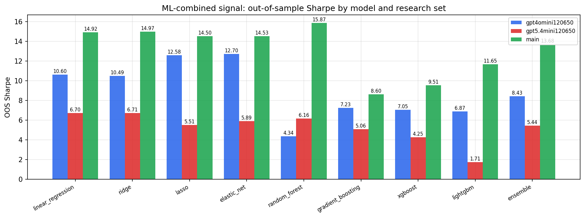

*ML-combined OOS Sharpe by model and research set*

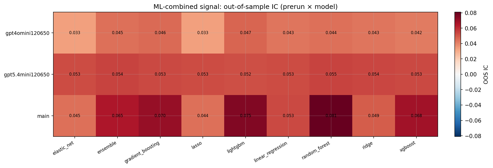

*ML-combined OOS IC (prerun × model)*

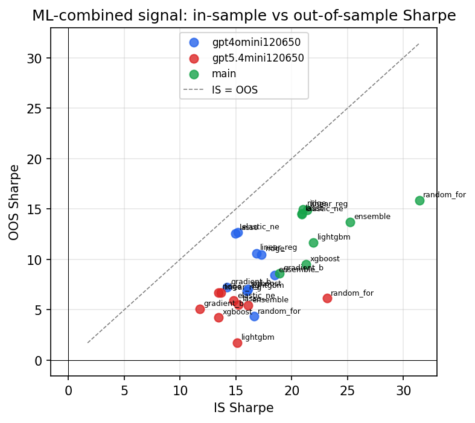

*IS vs OOS Sharpe (overfitting diagnostic)*

---
*Generated by `run_model_comparison.py`. Tables: `*.csv`; interactive: `comparison.ipynb`.*
