# Research-LLM factor comparison — `2024-04`

Comparing the **factor output of different research LLMs** on three axes (raw factor quality → factors as ML features → factors through the full agentic fund). The panel, IS/OOS split, horizon and model hyper-parameters are held identical across preruns — the *only* variable is the factor set.

## Preruns compared

| prerun | research_model | usable_factors | dropped_factors |
| --- | --- | --- | --- |
| gpt4omini120650 | gpt-4o-mini | 66 | 0 |
| gpt5.4mini120650 | gpt-5.4-mini | 68 | 1 |
| main | seed library | 78 | 10 |

> Dropped factors declare fields the current data doesn't have yet (e.g. fundamentals); they light up unchanged once that data is downloaded.

*Usable vs awaiting-data factors per research model*

## Key findings

- **Best ML-combined OOS Sharpe:** `main` with `random_forest` (OOS Sharpe = 19.131).
- **Mean OOS Sharpe across models, by research set:** `main` = 16.259, `gpt4omini120650` = 10.330, `gpt5.4mini120650` = 5.497.
- **Highest mean single-factor |IC| (h=6):** `main` (mean |IC| = 0.0514).
- **Most diverse zoo (highest effective/raw factor ratio):** `gpt5.4mini120650` (eff 57.0 of 68, ratio 0.84).
- **Best selection-deflated single-factor |IC|:** `main` (deflated |IC| = 0.5567 from 37 factors tried).

## 1. Single-factor IC (raw factor quality)

Per-underlying time-series Spearman rank-IC of every researched factor, recomputed on the shared panel at horizons h=1, h=6, h=60. The per-underlying IC correlates each factor's value vector with the underlying's own forward-return vector (pooled across underlyings); the cross-sectional IC ranks across underlyings per timestamp.

| prerun | n_factors | mean_abs_ic_1 | mean_abs_ic_6 | mean_abs_ic_60 | mean_abs_icir_6 | best_factor_h6 | best_abs_ic_h6 |
| --- | --- | --- | --- | --- | --- | --- | --- |
| gpt4omini120650 | 66 | 0.0195 | 0.0199 | 0.0154 | 0.6207 | hawkes_process_order_flow_indicator | 0.0729 |
| gpt5.4mini120650 | 68 | 0.0142 | 0.0165 | 0.0105 | 0.6864 | deterministic_control_gap | 0.0819 |
| main | 78 | 0.0392 | 0.0514 | 0.0482 | 0.806 | alpha_058 | 0.5638 |

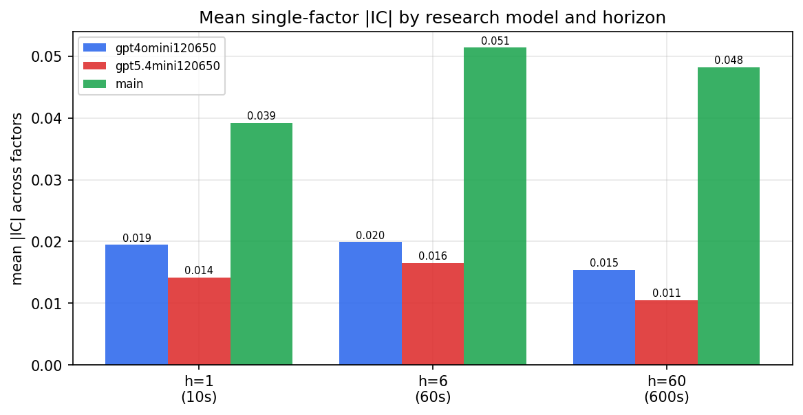

*Mean |IC| by research model and horizon*

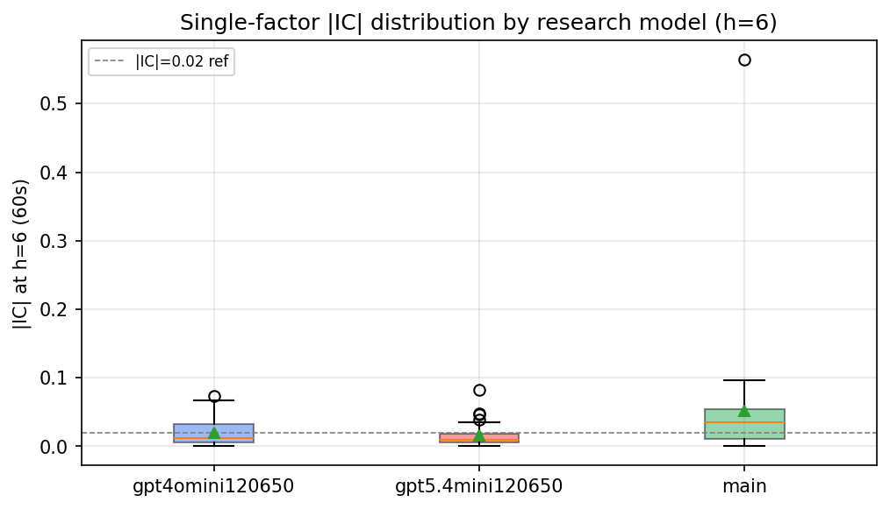

*Per-factor |IC| distribution by research model*

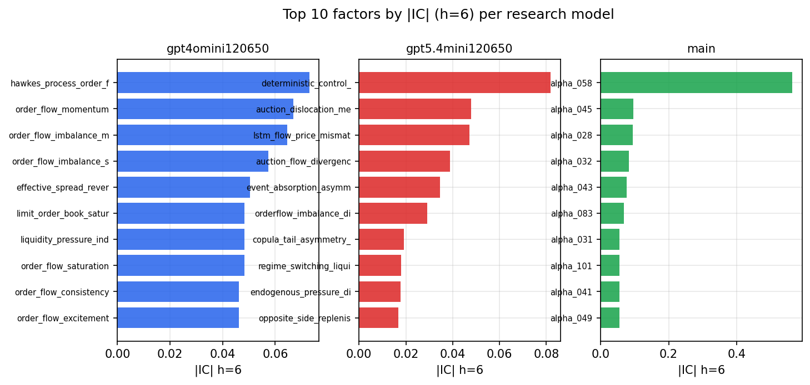

*Top factors by |IC| per research model*

## 2. Factor diversity & redundancy

Pairwise correlation of each zoo's *signals*. `eff_n_factors` is the effective number of independent factors (participation ratio of the correlation eigenvalues); `eff_ratio` and `redundancy` summarise how much unique information the zoo holds vs. how much is duplicated; `n_clusters` groups factors at |corr| ≥ 0.7.

| prerun | n_factors | eff_n_factors | eff_ratio | mean_abs_corr | n_clusters | redundancy |
| --- | --- | --- | --- | --- | --- | --- |
| gpt4omini120650 | 66 | 30.7117 | 0.4653 | 0.0538 | 38 | 0.5347 |
| gpt5.4mini120650 | 68 | 56.9618 | 0.8377 | 0.0076 | 64 | 0.1623 |
| main | 78 | 42.1174 | 0.54 | 0.0331 | 55 | 0.46 |

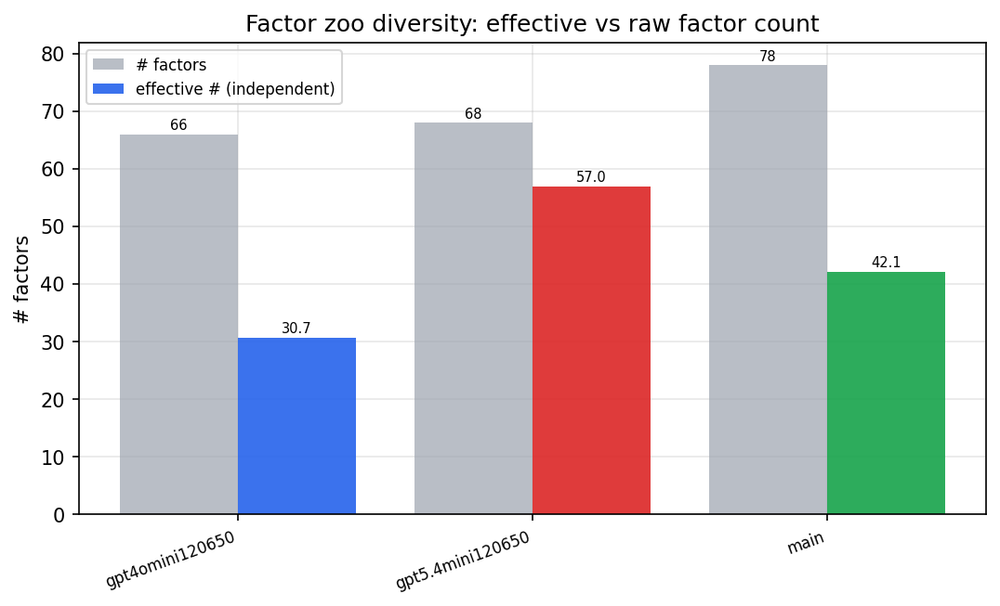

*Effective vs raw factor count per research model*

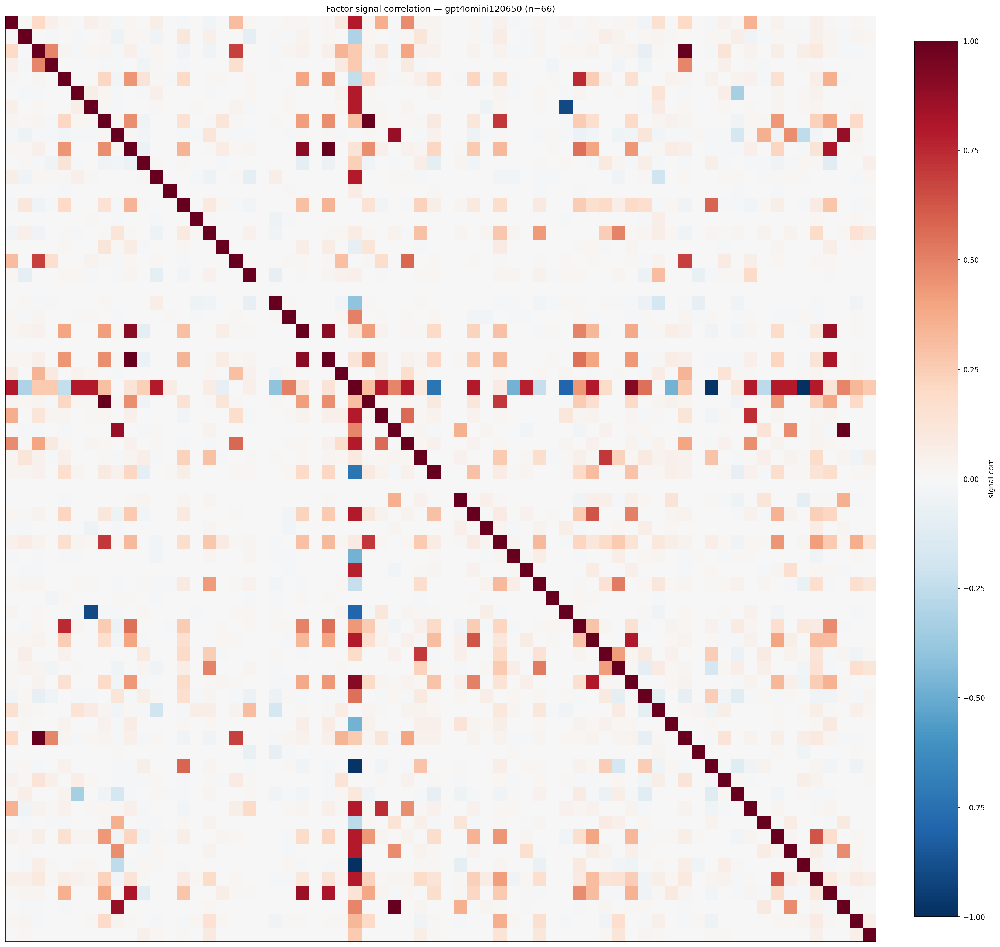

*Signal correlation matrix — gpt4omini120650*

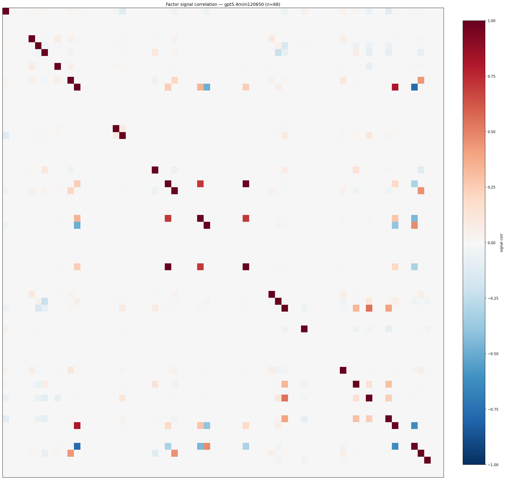

*Signal correlation matrix — gpt5.4mini120650*

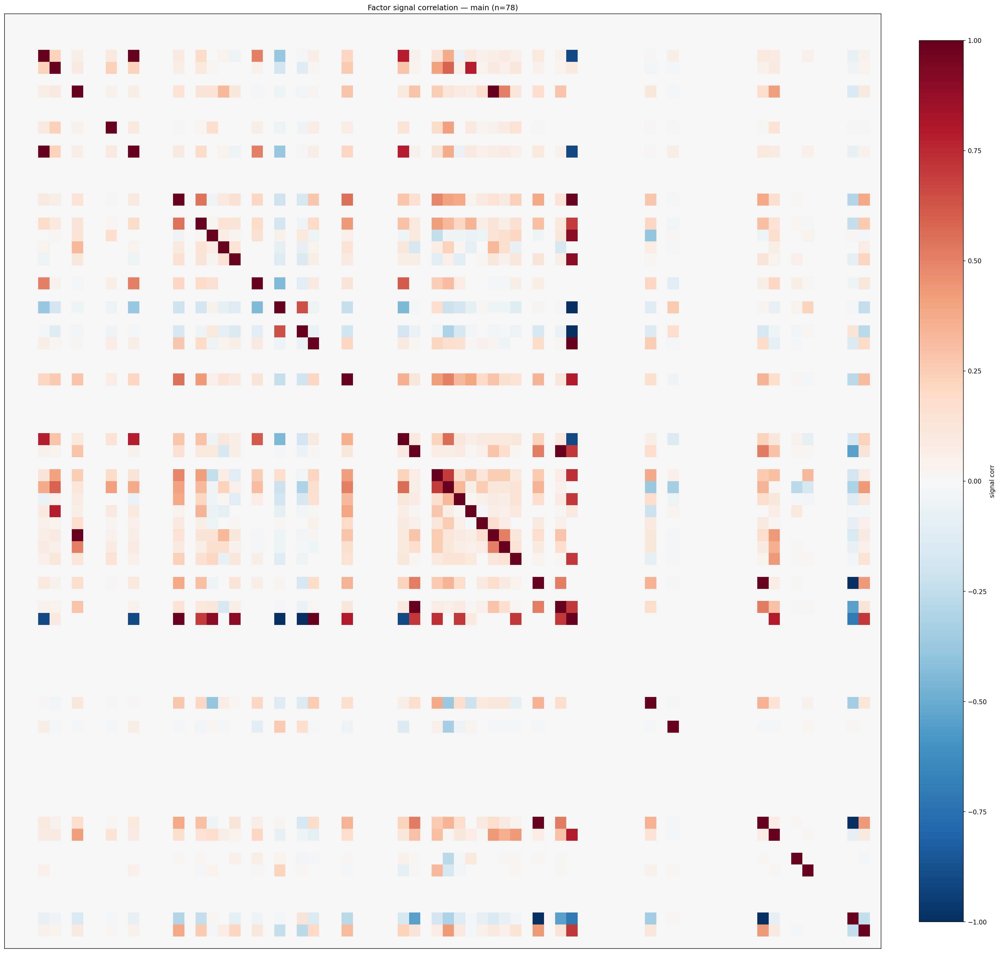

*Signal correlation matrix — main*

## 3. Deflation & model-based importance

`deflated_best_ic` haircuts each zoo's best |IC| for the number of factors tried (`ic_n_tested`) — a bigger zoo's best factor is more likely to be lucky. `lasso_n_nonzero` / `lasso_sparsity` show how many factors a sparse linear model actually keeps (model-view redundancy).

| prerun | best_ic | deflated_best_ic | deflated_best_t | ic_n_tested | ic_n_obs | lasso_n_nonzero | lasso_sparsity |
| --- | --- | --- | --- | --- | --- | --- | --- |
| gpt4omini120650 | 0.0729 | 0.0653 | 24.8884 | 63 | 145079 | 19 | 0.7121 |
| gpt5.4mini120650 | 0.0819 | 0.0751 | 28.6117 | 28 | 145079 | 5 | 0.9265 |
| main | 0.5638 | 0.5567 | 212.0619 | 37 | 145079 | 20 | 0.7436 |

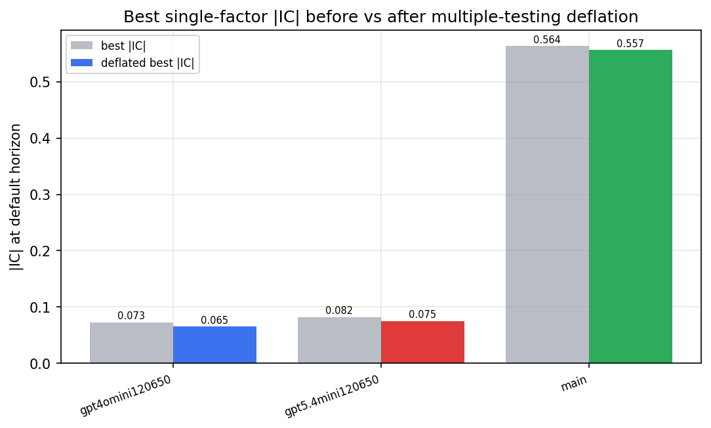

*Best |IC| before vs after multiple-testing deflation*

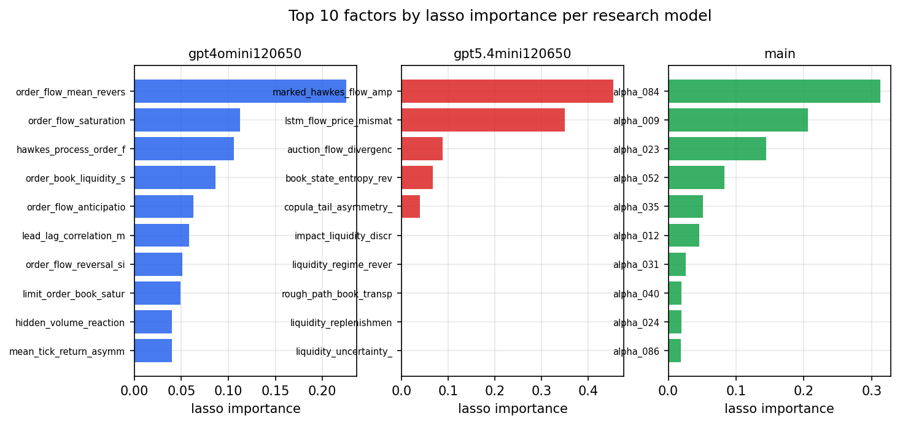

*Top factors by lasso importance per zoo*

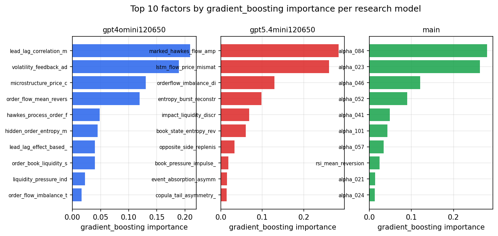

*Top factors by gradient_boosting importance per zoo*

## 4. ML-combined signal — per-underlying vectorised backtest

Each model combines a prerun's factors into ONE signal (fit `factors → forward return` on IS, predict per (bar, underlying)), then that combined signal is run through a simple vectorised backtest — `position(signal) × the underlying's own forward return` — on the held-out OOS tail (+ an equal-weight ensemble). No cross-sectional ranking.

> Config: position=**threshold** (t=1.0, z-score `expanding`), aggregation=**portfolio**, fit-standardise=**per_underlying**, horizon=6.

| prerun | model | n_factors_used | oos_ic | oos_sharpe | is_sharpe | oos_ann_return | oos_max_drawdown |
| --- | --- | --- | --- | --- | --- | --- | --- |
| gpt4omini120650 | linear_regression | 66 | 0.0453 | 6.4305 | 13.5314 | 0.2032 | -0.0032 |
| gpt4omini120650 | ridge | 66 | 0.0463 | 8.008 | 14.2403 | 0.2519 | -0.0023 |
| gpt4omini120650 | lasso | 66 | 0.0489 | 12.7498 | 12.2231 | 0.6821 | -0.0051 |
| gpt4omini120650 | elastic_net | 66 | 0.0472 | 12.5406 | 12.4017 | 0.6855 | -0.0049 |
| gpt4omini120650 | random_forest | 66 | 0.0488 | 15.2722 | 14.3718 | 1.5319 | -0.0075 |
| gpt4omini120650 | gradient_boosting | 66 | 0.0472 | 5.9092 | 14.0786 | 0.4511 | -0.0118 |
| gpt4omini120650 | xgboost | 66 | 0.0529 | 9.4525 | 14.6648 | 0.6847 | -0.0085 |
| gpt4omini120650 | lightgbm | 66 | 0.0495 | 8.7337 | 15.1133 | 0.5973 | -0.0103 |
| gpt4omini120650 | ensemble | 66 | 0.0541 | 13.8748 | 16.4416 | 1.2018 | -0.007 |
| gpt5.4mini120650 | linear_regression | 68 | 0.0543 | 1.4037 | 10.0946 | 0.0939 | -0.0208 |
| gpt5.4mini120650 | ridge | 68 | 0.0543 | 1.4037 | 10.0946 | 0.0939 | -0.0208 |
| gpt5.4mini120650 | lasso | 68 | 0.0544 | 1.3466 | 10.0535 | 0.0901 | -0.0208 |
| gpt5.4mini120650 | elastic_net | 68 | 0.0544 | 1.3466 | 10.0535 | 0.0901 | -0.0208 |
| gpt5.4mini120650 | random_forest | 68 | 0.0535 | 14.1204 | 12.1478 | 1.1676 | -0.0076 |
| gpt5.4mini120650 | gradient_boosting | 68 | 0.0481 | 4.2451 | 13.0676 | 0.2426 | -0.0154 |
| gpt5.4mini120650 | xgboost | 68 | 0.0548 | 9.9309 | 12.0285 | 0.6344 | -0.0113 |
| gpt5.4mini120650 | lightgbm | 68 | 0.0624 | 7.2421 | 13.9947 | 0.3646 | -0.0092 |
| gpt5.4mini120650 | ensemble | 68 | 0.0576 | 8.4319 | 13.4694 | 0.6448 | -0.0102 |
| main | linear_regression | 78 | 0.0455 | 16.8115 | 14.5411 | 0.882 | -0.0032 |
| main | ridge | 78 | 0.0441 | 16.2869 | 15.0118 | 0.8578 | -0.0032 |
| main | lasso | 78 | 0.0504 | 17.5852 | 13.9732 | 0.9151 | -0.0032 |
| main | elastic_net | 78 | 0.0508 | 17.0237 | 14.4393 | 0.9065 | -0.0032 |
| main | random_forest | 78 | 0.062 | 19.1314 | 13.6146 | 1.4261 | -0.0022 |
| main | gradient_boosting | 78 | 0.0565 | 14.2343 | 13.7841 | 0.9852 | -0.0034 |
| main | xgboost | 78 | 0.0592 | 13.6507 | 12.5451 | 1.0605 | -0.0044 |
| main | lightgbm | 78 | 0.0462 | 13.8576 | 14.0839 | 1.0848 | -0.0048 |
| main | ensemble | 78 | 0.0572 | 17.7484 | 13.6628 | 1.143 | -0.0026 |

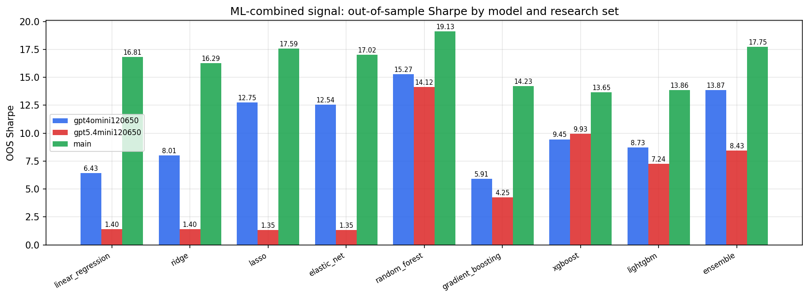

*ML-combined OOS Sharpe by model and research set*

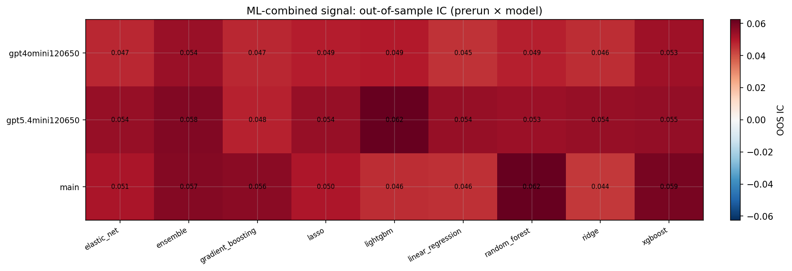

*ML-combined OOS IC (prerun × model)*

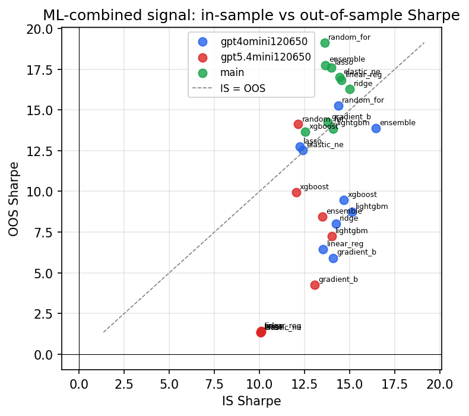

*IS vs OOS Sharpe (overfitting diagnostic)*

---
*Generated by `run_model_comparison.py`. Tables: `*.csv`; interactive: `comparison.ipynb`.*
