# Research-LLM factor comparison — `2024-05`

Comparing the **factor output of different research LLMs** on three axes (raw factor quality → factors as ML features → factors through the full agentic fund). The panel, IS/OOS split, horizon and model hyper-parameters are held identical across preruns — the *only* variable is the factor set.

## Preruns compared

| prerun | research_model | usable_factors | dropped_factors |
| --- | --- | --- | --- |
| gpt4omini120650 | gpt-4o-mini | 66 | 0 |
| gpt5.4mini120650 | gpt-5.4-mini | 68 | 1 |
| main | seed library | 78 | 10 |

> Dropped factors declare fields the current data doesn't have yet (e.g. fundamentals); they light up unchanged once that data is downloaded.

*Usable vs awaiting-data factors per research model*

## Key findings

- **Best ML-combined OOS Sharpe:** `main` with `lasso` (OOS Sharpe = 15.146).
- **Mean OOS Sharpe across models, by research set:** `main` = 10.855, `gpt5.4mini120650` = 4.727, `gpt4omini120650` = 4.358.
- **Highest mean single-factor |IC| (h=6):** `main` (mean |IC| = 0.0458).
- **Most diverse zoo (highest effective/raw factor ratio):** `gpt5.4mini120650` (eff 60.2 of 68, ratio 0.89).
- **Best selection-deflated single-factor |IC|:** `main` (deflated |IC| = 0.5569 from 36 factors tried).

## 1. Single-factor IC (raw factor quality)

Per-underlying time-series Spearman rank-IC of every researched factor, recomputed on the shared panel at horizons h=1, h=6, h=60. The per-underlying IC correlates each factor's value vector with the underlying's own forward-return vector (pooled across underlyings); the cross-sectional IC ranks across underlyings per timestamp.

| prerun | n_factors | mean_abs_ic_1 | mean_abs_ic_6 | mean_abs_ic_60 | mean_abs_icir_6 | best_factor_h6 | best_abs_ic_h6 |
| --- | --- | --- | --- | --- | --- | --- | --- |
| gpt4omini120650 | 66 | 0.0148 | 0.0188 | 0.014 | 0.6751 | effective_spread_reversal_strength | 0.0838 |
| gpt5.4mini120650 | 68 | 0.0105 | 0.0137 | 0.0115 | 0.7402 | deterministic_control_gap | 0.0542 |
| main | 78 | 0.031 | 0.0458 | 0.0495 | 0.8782 | alpha_058 | 0.5638 |

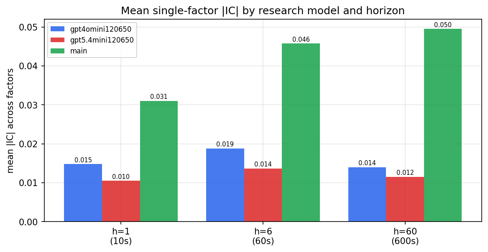

*Mean |IC| by research model and horizon*

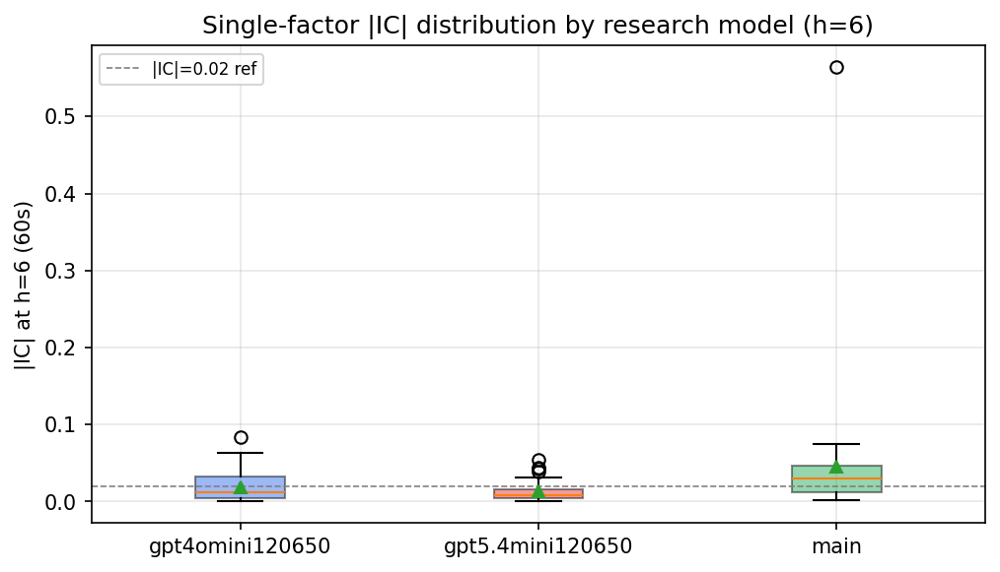

*Per-factor |IC| distribution by research model*

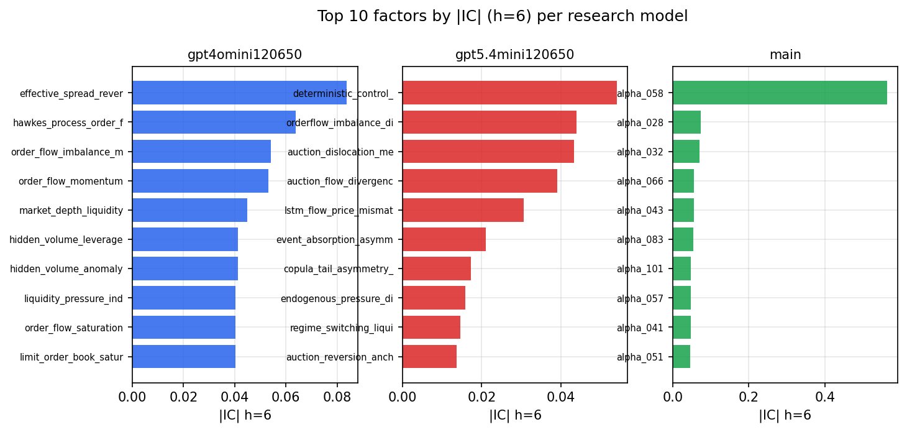

*Top factors by |IC| per research model*

## 2. Factor diversity & redundancy

Pairwise correlation of each zoo's *signals*. `eff_n_factors` is the effective number of independent factors (participation ratio of the correlation eigenvalues); `eff_ratio` and `redundancy` summarise how much unique information the zoo holds vs. how much is duplicated; `n_clusters` groups factors at |corr| ≥ 0.7.

| prerun | n_factors | eff_n_factors | eff_ratio | mean_abs_corr | n_clusters | redundancy |
| --- | --- | --- | --- | --- | --- | --- |
| gpt4omini120650 | 66 | 31.8513 | 0.4826 | 0.0497 | 42 | 0.5174 |
| gpt5.4mini120650 | 68 | 60.1909 | 0.8852 | 0.0061 | 67 | 0.1148 |
| main | 78 | 43.494 | 0.5576 | 0.0305 | 64 | 0.4424 |

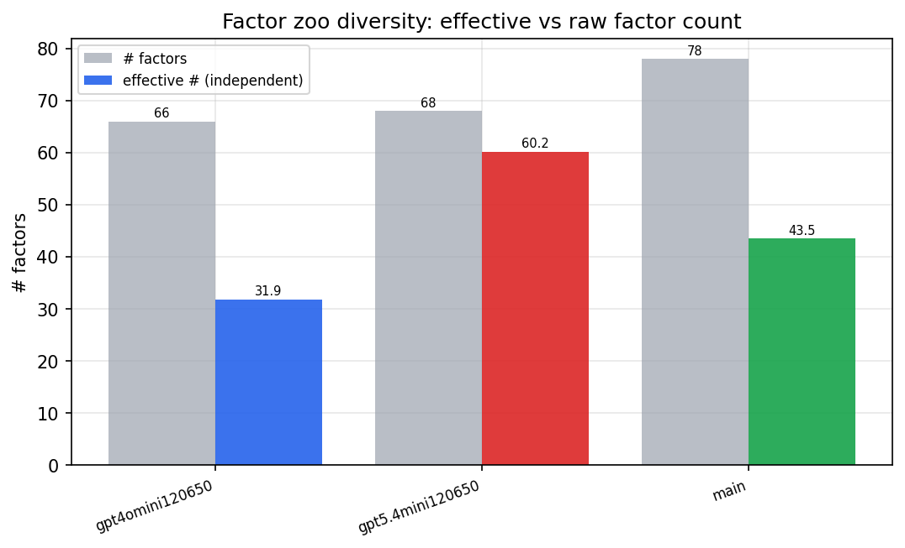

*Effective vs raw factor count per research model*

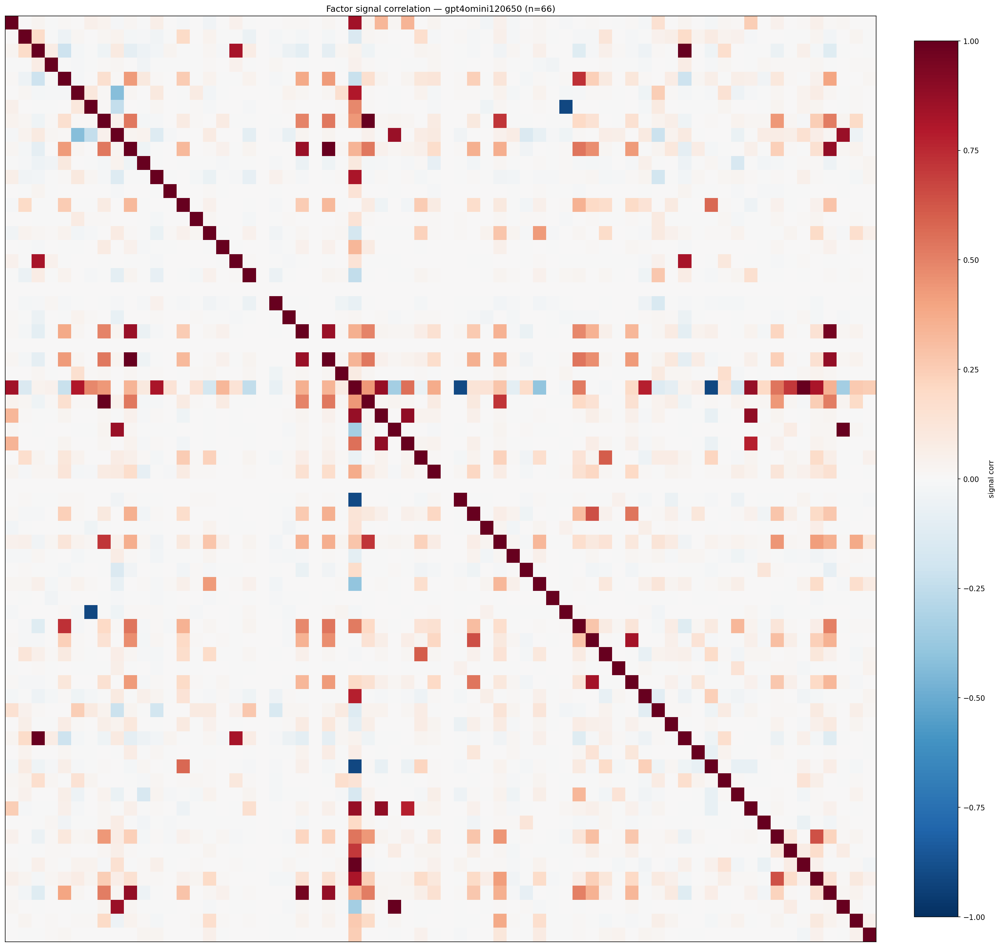

*Signal correlation matrix — gpt4omini120650*

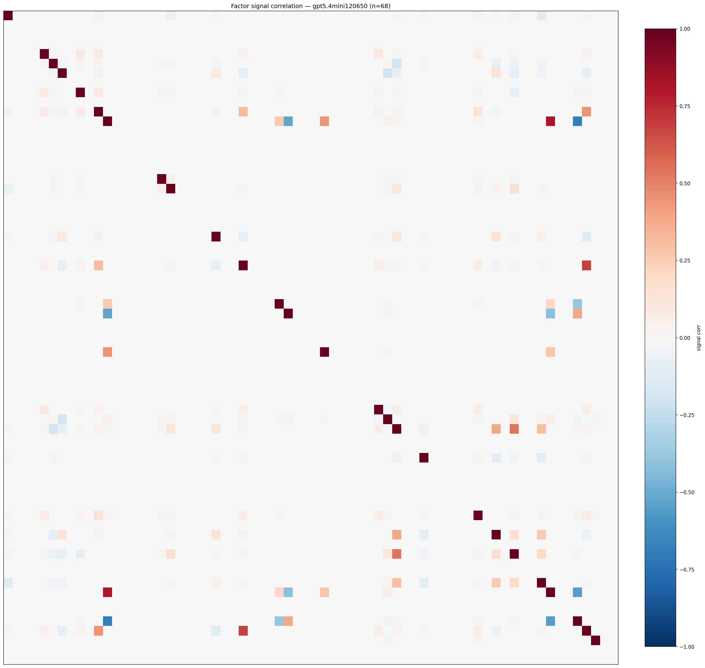

*Signal correlation matrix — gpt5.4mini120650*

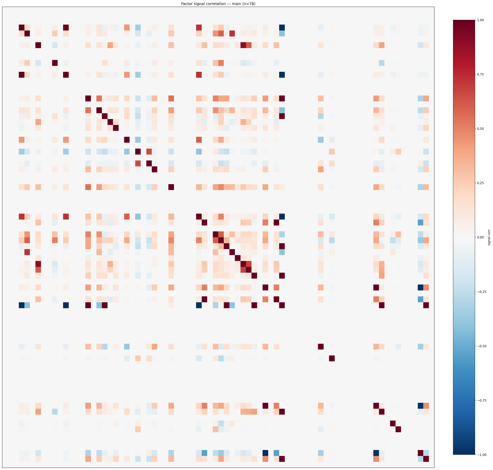

*Signal correlation matrix — main*

## 3. Deflation & model-based importance

`deflated_best_ic` haircuts each zoo's best |IC| for the number of factors tried (`ic_n_tested`) — a bigger zoo's best factor is more likely to be lucky. `lasso_n_nonzero` / `lasso_sparsity` show how many factors a sparse linear model actually keeps (model-view redundancy).

| prerun | best_ic | deflated_best_ic | deflated_best_t | ic_n_tested | ic_n_obs | lasso_n_nonzero | lasso_sparsity |
| --- | --- | --- | --- | --- | --- | --- | --- |
| gpt4omini120650 | 0.0838 | 0.0763 | 29.5435 | 63 | 149759 | 42 | 0.3636 |
| gpt5.4mini120650 | 0.0542 | 0.0475 | 18.3921 | 28 | 149759 | 7 | 0.8971 |
| main | 0.5638 | 0.5569 | 215.5083 | 36 | 149759 | 24 | 0.6923 |

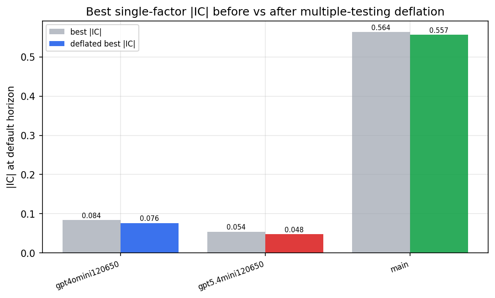

*Best |IC| before vs after multiple-testing deflation*

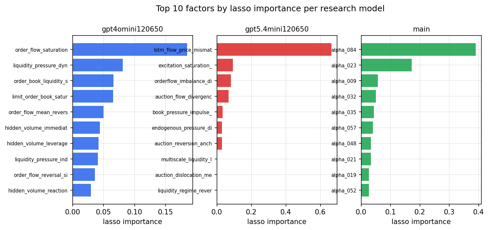

*Top factors by lasso importance per zoo*

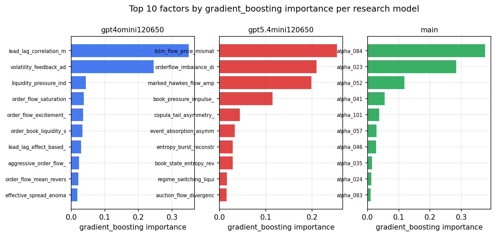

*Top factors by gradient_boosting importance per zoo*

## 4. ML-combined signal — per-underlying vectorised backtest

Each model combines a prerun's factors into ONE signal (fit `factors → forward return` on IS, predict per (bar, underlying)), then that combined signal is run through a simple vectorised backtest — `position(signal) × the underlying's own forward return` — on the held-out OOS tail (+ an equal-weight ensemble). No cross-sectional ranking.

> Config: position=**threshold** (t=1.0, z-score `expanding`), aggregation=**portfolio**, fit-standardise=**per_underlying**, horizon=6.

| prerun | model | n_factors_used | oos_ic | oos_sharpe | is_sharpe | oos_ann_return | oos_max_drawdown |
| --- | --- | --- | --- | --- | --- | --- | --- |
| gpt4omini120650 | linear_regression | 66 | 0.0508 | 7.0016 | 11.5855 | 0.5512 | -0.007 |
| gpt4omini120650 | ridge | 66 | 0.053 | 8.4294 | 12.1321 | 0.68 | -0.0074 |
| gpt4omini120650 | lasso | 66 | 0.0513 | 10.1298 | 10.236 | 0.7793 | -0.0071 |
| gpt4omini120650 | elastic_net | 66 | 0.0519 | 9.0628 | 11.6286 | 0.7433 | -0.0086 |
| gpt4omini120650 | random_forest | 66 | 0.0528 | 3.9858 | 11.5739 | 0.3422 | -0.0138 |
| gpt4omini120650 | gradient_boosting | 66 | 0.0448 | -6.8862 | 12.7136 | -0.3022 | -0.0285 |
| gpt4omini120650 | xgboost | 66 | 0.057 | 1.4436 | 12.7144 | 0.0789 | -0.015 |
| gpt4omini120650 | lightgbm | 66 | 0.0672 | 0.5357 | 15.0273 | 0.0412 | -0.0242 |
| gpt4omini120650 | ensemble | 66 | 0.0571 | 5.5186 | 13.9743 | 0.4238 | -0.0116 |
| gpt5.4mini120650 | linear_regression | 68 | 0.0498 | 10.257 | 7.3273 | 0.6861 | -0.0079 |
| gpt5.4mini120650 | ridge | 68 | 0.0495 | 10.8321 | 7.7071 | 0.7586 | -0.0077 |
| gpt5.4mini120650 | lasso | 68 | 0.0458 | 4.6599 | 5.5592 | 0.2858 | -0.0068 |
| gpt5.4mini120650 | elastic_net | 68 | 0.0451 | 5.1993 | 5.697 | 0.3206 | -0.0072 |
| gpt5.4mini120650 | random_forest | 68 | 0.0624 | 6.7853 | 12.6124 | 0.7605 | -0.0115 |
| gpt5.4mini120650 | gradient_boosting | 68 | 0.0556 | -4.725 | 12.0571 | -0.1743 | -0.0187 |
| gpt5.4mini120650 | xgboost | 68 | 0.0623 | 0.6254 | 10.5297 | 0.0418 | -0.0127 |
| gpt5.4mini120650 | lightgbm | 68 | 0.0656 | 3.641 | 13.9386 | 0.2207 | -0.0087 |
| gpt5.4mini120650 | ensemble | 68 | 0.059 | 5.2664 | 12.0779 | 0.3777 | -0.0115 |
| main | linear_regression | 78 | 0.0088 | 12.1073 | 15.246 | 0.8104 | -0.0063 |
| main | ridge | 78 | 0.009 | 12.4969 | 15.2347 | 0.8283 | -0.0063 |
| main | lasso | 78 | 0.0325 | 15.1457 | 14.1681 | 0.9685 | -0.0036 |
| main | elastic_net | 78 | 0.0343 | 15.0064 | 14.1045 | 0.9635 | -0.0036 |
| main | random_forest | 78 | 0.0804 | 8.8052 | 14.5465 | 0.636 | -0.0098 |
| main | gradient_boosting | 78 | 0.0305 | 8.2821 | 14.5183 | 0.4207 | -0.0085 |
| main | xgboost | 78 | 0.0383 | 8.0673 | 14.1726 | 0.4783 | -0.0116 |
| main | lightgbm | 78 | 0.0807 | 7.5656 | 15.1883 | 0.4607 | -0.0096 |
| main | ensemble | 78 | 0.0234 | 10.2205 | 15.3232 | 0.7005 | -0.0086 |

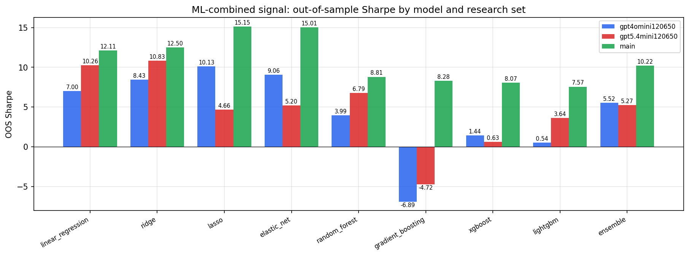

*ML-combined OOS Sharpe by model and research set*

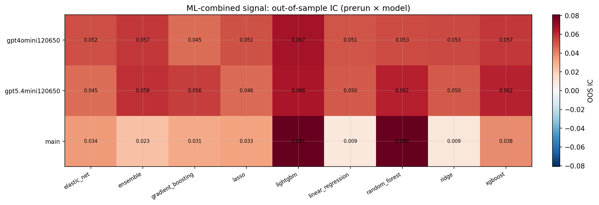

*ML-combined OOS IC (prerun × model)*

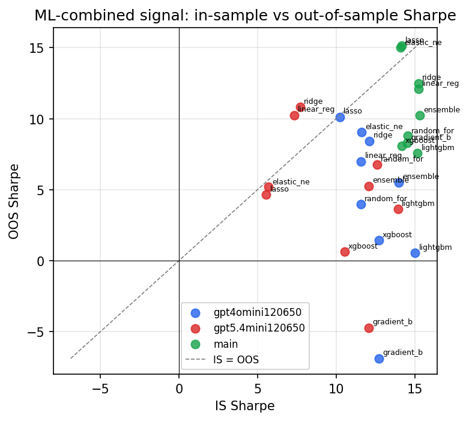

*IS vs OOS Sharpe (overfitting diagnostic)*

---
*Generated by `run_model_comparison.py`. Tables: `*.csv`; interactive: `comparison.ipynb`.*
