# Research-LLM factor comparison — `2024-06`

Comparing the **factor output of different research LLMs** on three axes (raw factor quality → factors as ML features → factors through the full agentic fund). The panel, IS/OOS split, horizon and model hyper-parameters are held identical across preruns — the *only* variable is the factor set.

## Preruns compared

| prerun | research_model | usable_factors | dropped_factors |
| --- | --- | --- | --- |
| gpt4omini120650 | gpt-4o-mini | 66 | 0 |
| gpt5.4mini120650 | gpt-5.4-mini | 68 | 1 |
| main | seed library | 78 | 10 |

> Dropped factors declare fields the current data doesn't have yet (e.g. fundamentals); they light up unchanged once that data is downloaded.

*Usable vs awaiting-data factors per research model*

## Key findings

- **Best ML-combined OOS Sharpe:** `main` with `linear_regression` (OOS Sharpe = 10.063).
- **Mean OOS Sharpe across models, by research set:** `main` = 8.464, `gpt5.4mini120650` = 4.244, `gpt4omini120650` = 3.517.
- **Highest mean single-factor |IC| (h=6):** `main` (mean |IC| = 0.0435).
- **Most diverse zoo (highest effective/raw factor ratio):** `gpt5.4mini120650` (eff 55.7 of 68, ratio 0.82).
- **Best selection-deflated single-factor |IC|:** `main` (deflated |IC| = 0.5064 from 37 factors tried).

## 1. Single-factor IC (raw factor quality)

Per-underlying time-series Spearman rank-IC of every researched factor, recomputed on the shared panel at horizons h=1, h=6, h=60. The per-underlying IC correlates each factor's value vector with the underlying's own forward-return vector (pooled across underlyings); the cross-sectional IC ranks across underlyings per timestamp.

| prerun | n_factors | mean_abs_ic_1 | mean_abs_ic_6 | mean_abs_ic_60 | mean_abs_icir_6 | best_factor_h6 | best_abs_ic_h6 |
| --- | --- | --- | --- | --- | --- | --- | --- |
| gpt4omini120650 | 66 | 0.0117 | 0.012 | 0.0101 | 0.5123 | limit_order_book_imbalance_surge | 0.0456 |
| gpt5.4mini120650 | 68 | 0.0102 | 0.0118 | 0.0102 | 0.5831 | auction_dislocation_mean_reversion | 0.0489 |
| main | 78 | 0.0442 | 0.0435 | 0.0266 | 0.8753 | alpha_058 | 0.5134 |

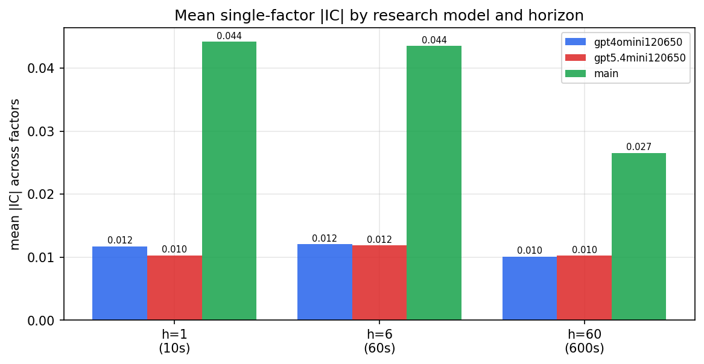

*Mean |IC| by research model and horizon*

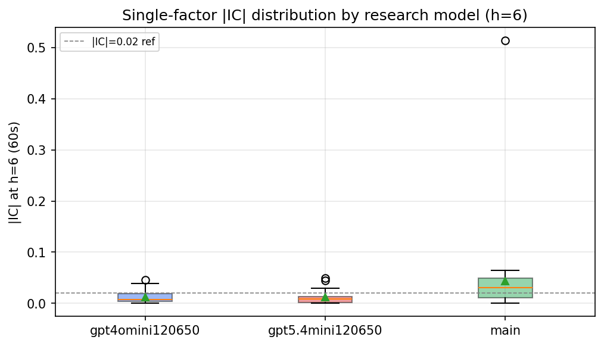

*Per-factor |IC| distribution by research model*

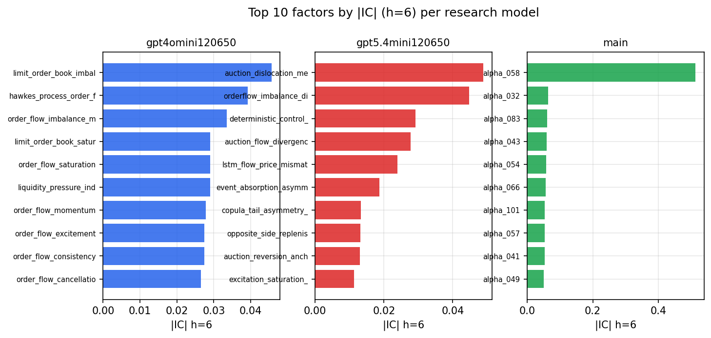

*Top factors by |IC| per research model*

## 2. Factor diversity & redundancy

Pairwise correlation of each zoo's *signals*. `eff_n_factors` is the effective number of independent factors (participation ratio of the correlation eigenvalues); `eff_ratio` and `redundancy` summarise how much unique information the zoo holds vs. how much is duplicated; `n_clusters` groups factors at |corr| ≥ 0.7.

| prerun | n_factors | eff_n_factors | eff_ratio | mean_abs_corr | n_clusters | redundancy |
| --- | --- | --- | --- | --- | --- | --- |
| gpt4omini120650 | 66 | 32.8615 | 0.4979 | 0.0463 | 53 | 0.5021 |
| gpt5.4mini120650 | 68 | 55.6529 | 0.8184 | 0.0088 | 64 | 0.1816 |
| main | 78 | 44.2345 | 0.5671 | 0.0312 | 69 | 0.4329 |

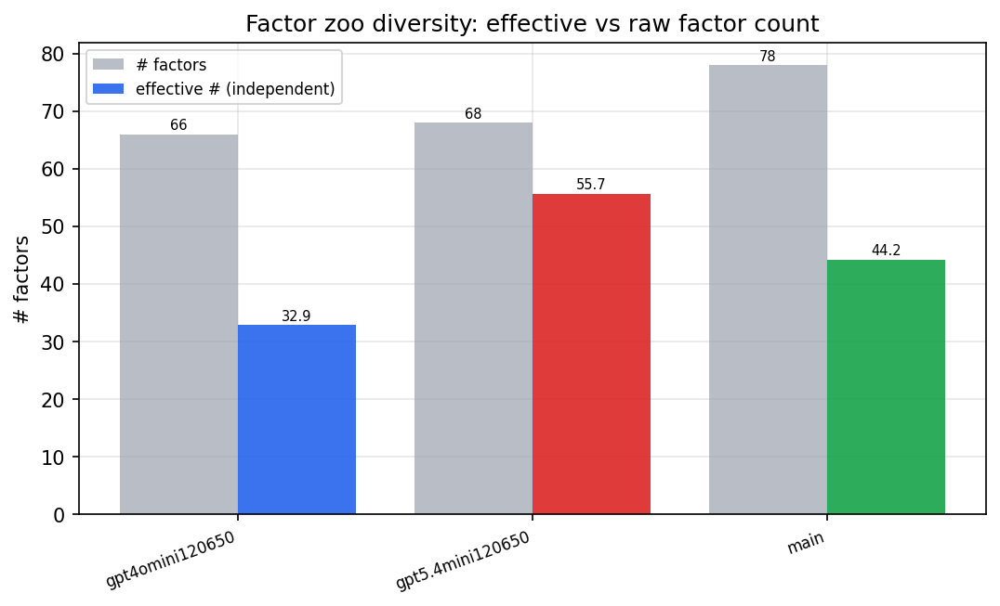

*Effective vs raw factor count per research model*

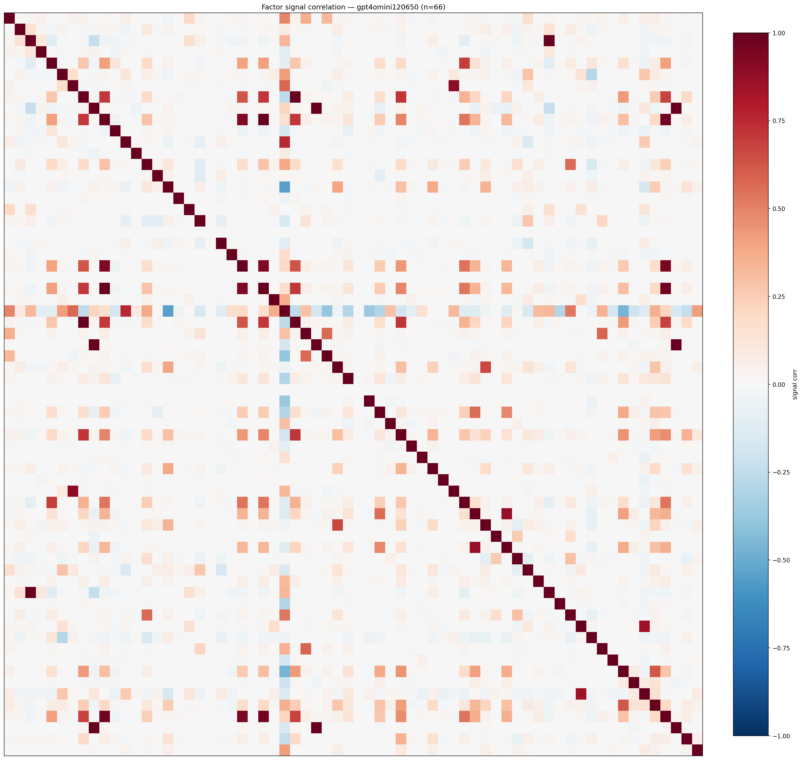

*Signal correlation matrix — gpt4omini120650*

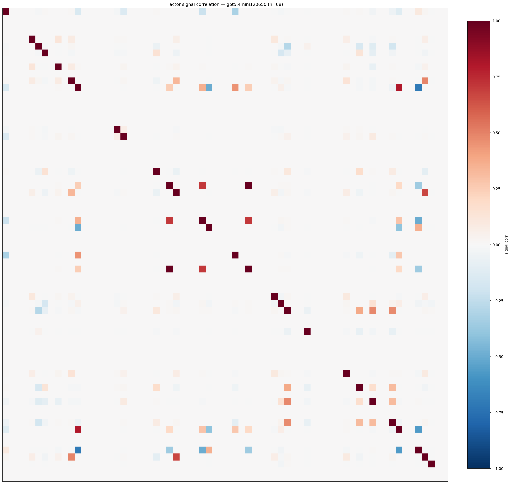

*Signal correlation matrix — gpt5.4mini120650*

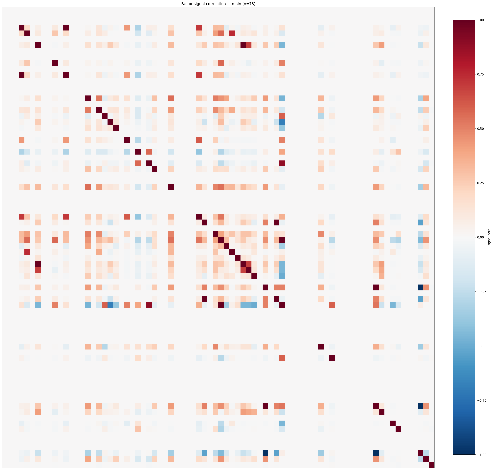

*Signal correlation matrix — main*

## 3. Deflation & model-based importance

`deflated_best_ic` haircuts each zoo's best |IC| for the number of factors tried (`ic_n_tested`) — a bigger zoo's best factor is more likely to be lucky. `lasso_n_nonzero` / `lasso_sparsity` show how many factors a sparse linear model actually keeps (model-view redundancy).

| prerun | best_ic | deflated_best_ic | deflated_best_t | ic_n_tested | ic_n_obs | lasso_n_nonzero | lasso_sparsity |
| --- | --- | --- | --- | --- | --- | --- | --- |
| gpt4omini120650 | 0.0456 | 0.0381 | 14.6305 | 63 | 147419 | 16 | 0.7576 |
| gpt5.4mini120650 | 0.0489 | 0.0422 | 16.2069 | 28 | 147419 | 0 | 1.0 |
| main | 0.5134 | 0.5064 | 194.4261 | 37 | 147419 | 11 | 0.859 |

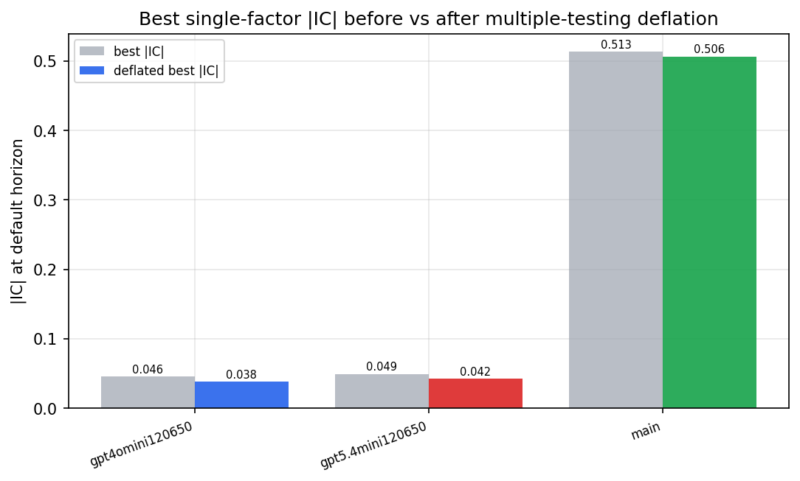

*Best |IC| before vs after multiple-testing deflation*

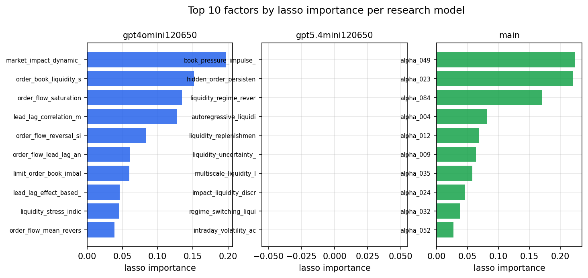

*Top factors by lasso importance per zoo*

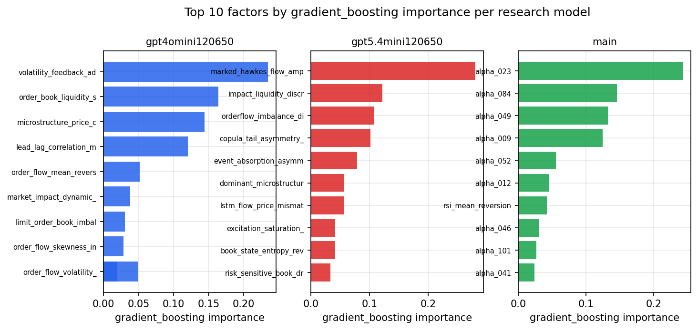

*Top factors by gradient_boosting importance per zoo*

## 4. ML-combined signal — per-underlying vectorised backtest

Each model combines a prerun's factors into ONE signal (fit `factors → forward return` on IS, predict per (bar, underlying)), then that combined signal is run through a simple vectorised backtest — `position(signal) × the underlying's own forward return` — on the held-out OOS tail (+ an equal-weight ensemble). No cross-sectional ranking.

> Config: position=**threshold** (t=1.0, z-score `expanding`), aggregation=**portfolio**, fit-standardise=**per_underlying**, horizon=6.

| prerun | model | n_factors_used | oos_ic | oos_sharpe | is_sharpe | oos_ann_return | oos_max_drawdown |
| --- | --- | --- | --- | --- | --- | --- | --- |
| gpt4omini120650 | linear_regression | 66 | 0.0213 | 5.8227 | 12.7555 | 0.5829 | -0.0225 |
| gpt4omini120650 | ridge | 66 | 0.02 | 4.8743 | 14.6034 | 0.5042 | -0.0266 |
| gpt4omini120650 | lasso | 66 | 0.0081 | 0.5189 | 6.1315 | 0.0147 | -0.007 |
| gpt4omini120650 | elastic_net | 66 | 0.0119 | 1.666 | 12.9978 | 0.1367 | -0.0283 |
| gpt4omini120650 | random_forest | 66 | 0.0061 | 3.2941 | 10.9352 | 0.4883 | -0.0546 |
| gpt4omini120650 | gradient_boosting | 66 | 0.0151 | 4.4701 | 9.9631 | 0.5728 | -0.0251 |
| gpt4omini120650 | xgboost | 66 | 0.0075 | 3.5403 | 10.8498 | 0.3923 | -0.0179 |
| gpt4omini120650 | lightgbm | 66 | 0.0041 | 1.6574 | 14.7897 | 0.1629 | -0.0308 |
| gpt4omini120650 | ensemble | 66 | 0.0119 | 5.8119 | 15.7688 | 0.744 | -0.0376 |
| gpt5.4mini120650 | linear_regression | 68 | 0.0321 | 3.9615 | 7.3363 | 0.3939 | -0.0223 |
| gpt5.4mini120650 | ridge | 68 | 0.0324 | 3.2779 | 7.0995 | 0.3242 | -0.022 |
| gpt5.4mini120650 | lasso | 68 | 0.032 | 4.0111 | 7.0215 | 0.3986 | -0.022 |
| gpt5.4mini120650 | elastic_net | 68 | 0.0315 | 4.2642 | 7.0523 | 0.4313 | -0.0197 |
| gpt5.4mini120650 | random_forest | 68 | 0.0496 | 8.4283 | 13.8653 | 0.8374 | -0.0176 |
| gpt5.4mini120650 | gradient_boosting | 68 | 0.0407 | 0.9515 | 8.4681 | 0.0593 | -0.0134 |
| gpt5.4mini120650 | xgboost | 68 | 0.0441 | 3.136 | 11.9071 | 0.2185 | -0.0138 |
| gpt5.4mini120650 | lightgbm | 68 | 0.0418 | 4.8111 | 12.6479 | 0.2903 | -0.0085 |
| gpt5.4mini120650 | ensemble | 68 | 0.0403 | 5.3552 | 11.6277 | 0.5014 | -0.0159 |
| main | linear_regression | 78 | 0.0409 | 10.0634 | 16.3269 | 1.0934 | -0.0139 |
| main | ridge | 78 | 0.0394 | 10.0165 | 16.4552 | 1.087 | -0.0139 |
| main | lasso | 78 | 0.0415 | 9.596 | 16.5105 | 1.0242 | -0.014 |
| main | elastic_net | 78 | 0.0417 | 9.7067 | 16.5875 | 1.0398 | -0.014 |
| main | random_forest | 78 | 0.0488 | 6.8908 | 14.5031 | 0.8214 | -0.0168 |
| main | gradient_boosting | 78 | 0.0438 | 8.1422 | 14.4841 | 0.571 | -0.0086 |
| main | xgboost | 78 | 0.0445 | 6.1554 | 14.1529 | 0.5696 | -0.0184 |
| main | lightgbm | 78 | 0.0546 | 7.3856 | 15.365 | 0.6735 | -0.0156 |
| main | ensemble | 78 | 0.0449 | 8.2219 | 16.7976 | 0.8756 | -0.014 |

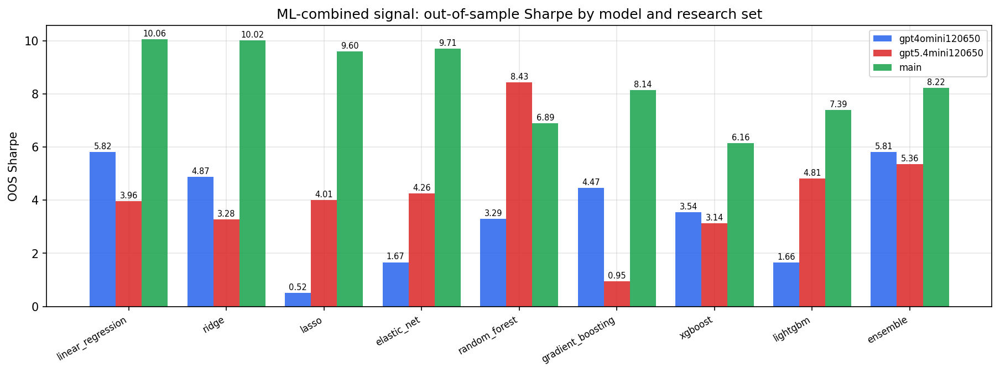

*ML-combined OOS Sharpe by model and research set*

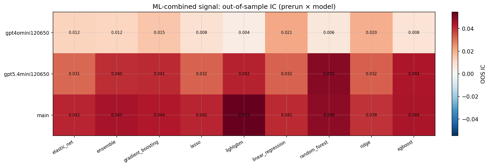

*ML-combined OOS IC (prerun × model)*

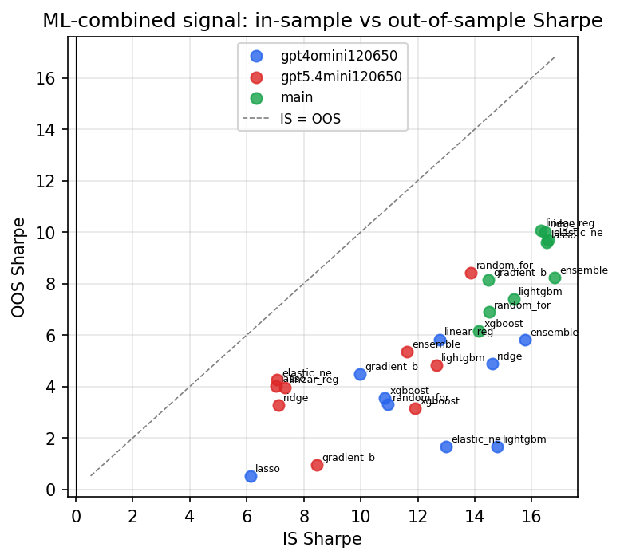

*IS vs OOS Sharpe (overfitting diagnostic)*

---
*Generated by `run_model_comparison.py`. Tables: `*.csv`; interactive: `comparison.ipynb`.*
