# Research-LLM factor comparison — `2024-07`

Comparing the **factor output of different research LLMs** on three axes (raw factor quality → factors as ML features → factors through the full agentic fund). The panel, IS/OOS split, horizon and model hyper-parameters are held identical across preruns — the *only* variable is the factor set.

## Preruns compared

| prerun | research_model | usable_factors | dropped_factors |
| --- | --- | --- | --- |
| gpt4omini120650 | gpt-4o-mini | 66 | 0 |
| gpt5.4mini120650 | gpt-5.4-mini | 68 | 1 |
| main | seed library | 78 | 10 |

> Dropped factors declare fields the current data doesn't have yet (e.g. fundamentals); they light up unchanged once that data is downloaded.

*Usable vs awaiting-data factors per research model*

## Key findings

- **Best ML-combined OOS Sharpe:** `main` with `lasso` (OOS Sharpe = 13.492).
- **Mean OOS Sharpe across models, by research set:** `main` = 9.834, `gpt5.4mini120650` = 6.367, `gpt4omini120650` = 4.547.
- **Highest mean single-factor |IC| (h=6):** `main` (mean |IC| = 0.0354).
- **Most diverse zoo (highest effective/raw factor ratio):** `gpt5.4mini120650` (eff 55.5 of 68, ratio 0.82).
- **Best selection-deflated single-factor |IC|:** `gpt4omini120650` (deflated |IC| = 0.0979 from 64 factors tried).

## 1. Single-factor IC (raw factor quality)

Per-underlying time-series Spearman rank-IC of every researched factor, recomputed on the shared panel at horizons h=1, h=6, h=60. The per-underlying IC correlates each factor's value vector with the underlying's own forward-return vector (pooled across underlyings); the cross-sectional IC ranks across underlyings per timestamp.

| prerun | n_factors | mean_abs_ic_1 | mean_abs_ic_6 | mean_abs_ic_60 | mean_abs_icir_6 | best_factor_h6 | best_abs_ic_h6 |
| --- | --- | --- | --- | --- | --- | --- | --- |
| gpt4omini120650 | 66 | 0.0097 | 0.0104 | 0.0089 | 0.4001 | effective_spread_reversal_strength | 0.1055 |
| gpt5.4mini120650 | 68 | 0.0093 | 0.0088 | 0.0076 | 0.4805 | auction_dislocation_mean_reversion | 0.0651 |
| main | 78 | 0.0447 | 0.0354 | 0.0278 | 0.9923 | alpha_054 | 0.077 |

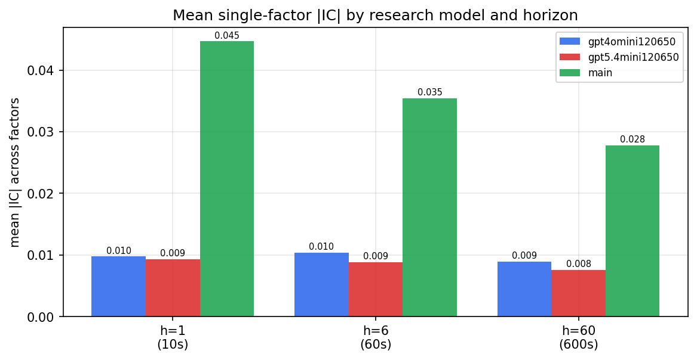

*Mean |IC| by research model and horizon*

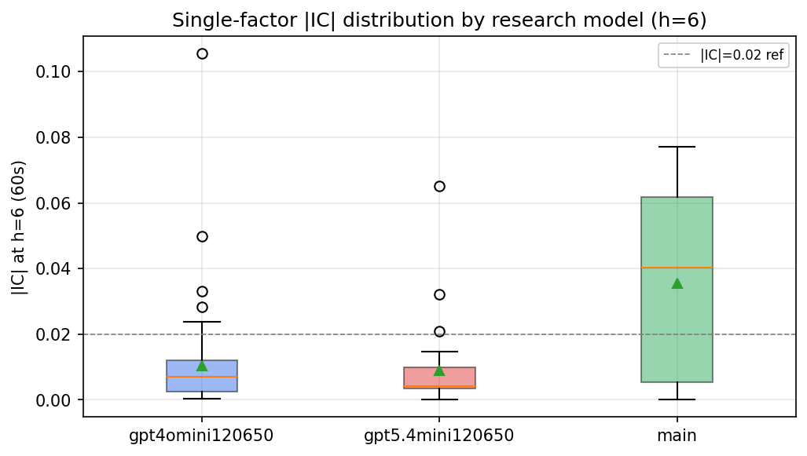

*Per-factor |IC| distribution by research model*

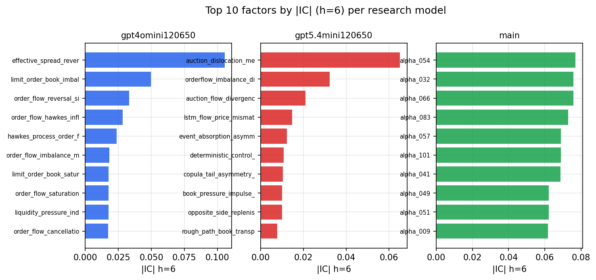

*Top factors by |IC| per research model*

## 2. Factor diversity & redundancy

Pairwise correlation of each zoo's *signals*. `eff_n_factors` is the effective number of independent factors (participation ratio of the correlation eigenvalues); `eff_ratio` and `redundancy` summarise how much unique information the zoo holds vs. how much is duplicated; `n_clusters` groups factors at |corr| ≥ 0.7.

| prerun | n_factors | eff_n_factors | eff_ratio | mean_abs_corr | n_clusters | redundancy |
| --- | --- | --- | --- | --- | --- | --- |
| gpt4omini120650 | 66 | 30.9913 | 0.4696 | 0.0526 | 54 | 0.5304 |
| gpt5.4mini120650 | 68 | 55.506 | 0.8163 | 0.009 | 64 | 0.1837 |
| main | 78 | 44.3946 | 0.5692 | 0.0309 | 71 | 0.4308 |

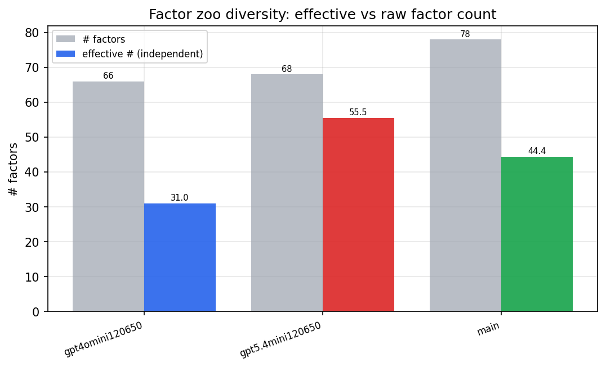

*Effective vs raw factor count per research model*

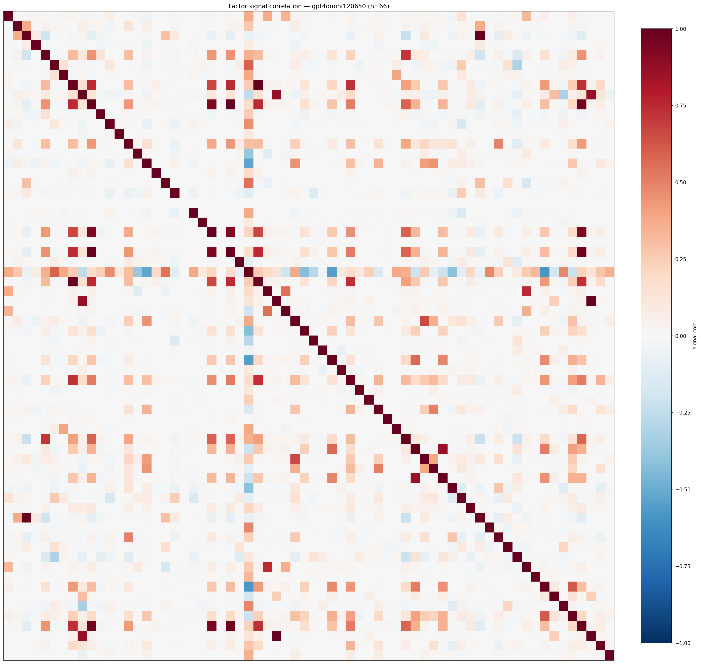

*Signal correlation matrix — gpt4omini120650*

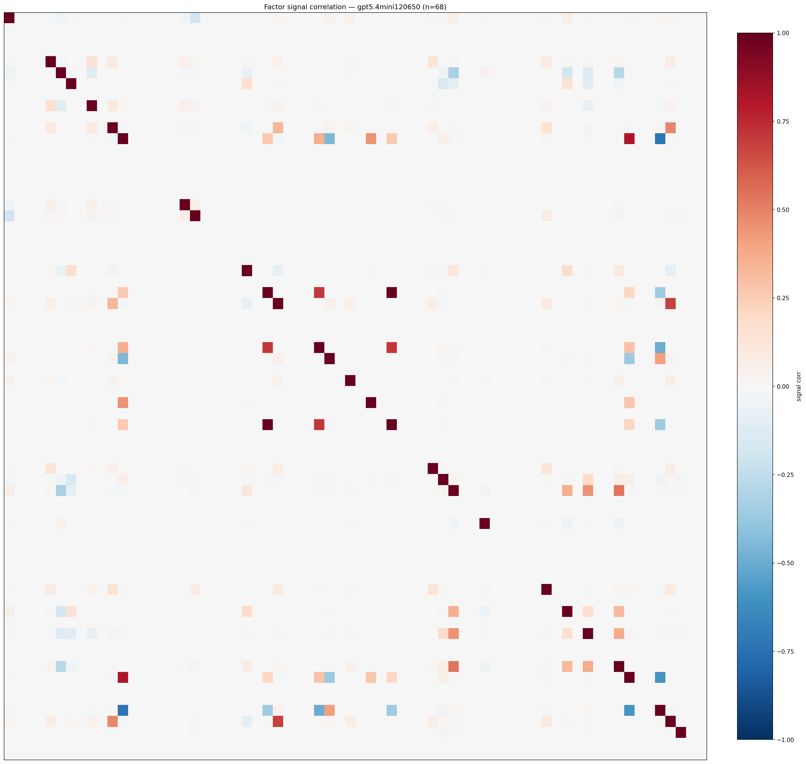

*Signal correlation matrix — gpt5.4mini120650*

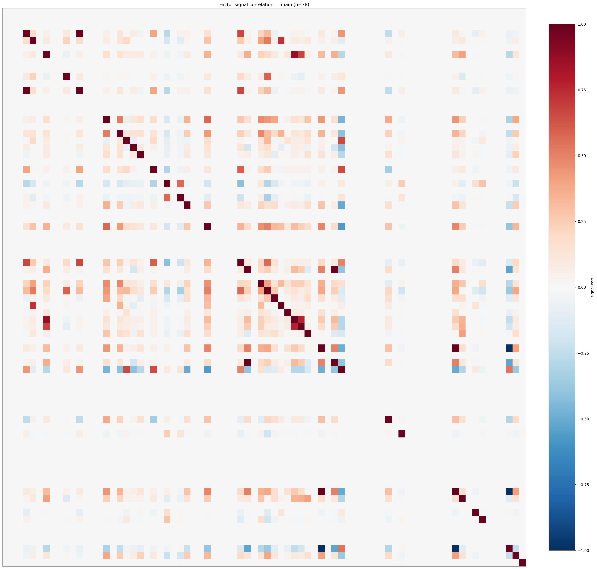

*Signal correlation matrix — main*

## 3. Deflation & model-based importance

`deflated_best_ic` haircuts each zoo's best |IC| for the number of factors tried (`ic_n_tested`) — a bigger zoo's best factor is more likely to be lucky. `lasso_n_nonzero` / `lasso_sparsity` show how many factors a sparse linear model actually keeps (model-view redundancy).

| prerun | best_ic | deflated_best_ic | deflated_best_t | ic_n_tested | ic_n_obs | lasso_n_nonzero | lasso_sparsity |
| --- | --- | --- | --- | --- | --- | --- | --- |
| gpt4omini120650 | 0.1055 | 0.0979 | 37.4577 | 64 | 146339 | 0 | 1.0 |
| gpt5.4mini120650 | 0.0651 | 0.0583 | 22.319 | 29 | 146339 | 0 | 1.0 |
| main | 0.077 | 0.07 | 26.7827 | 37 | 146339 | 2 | 0.9744 |

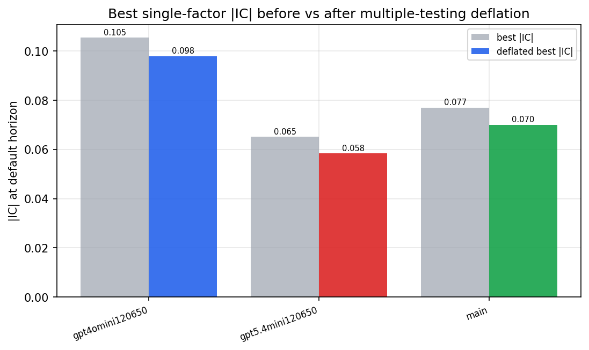

*Best |IC| before vs after multiple-testing deflation*

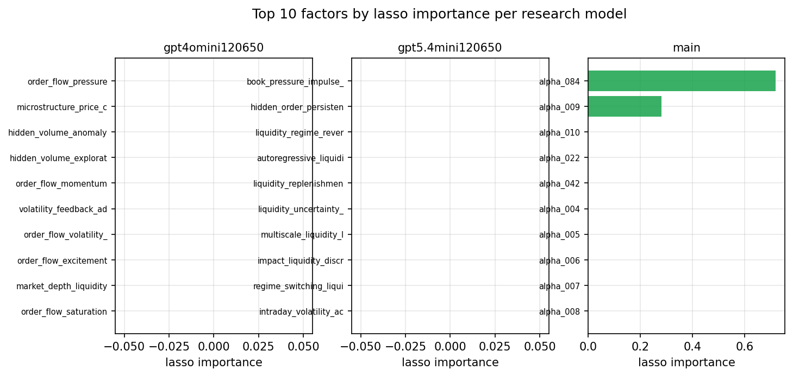

*Top factors by lasso importance per zoo*

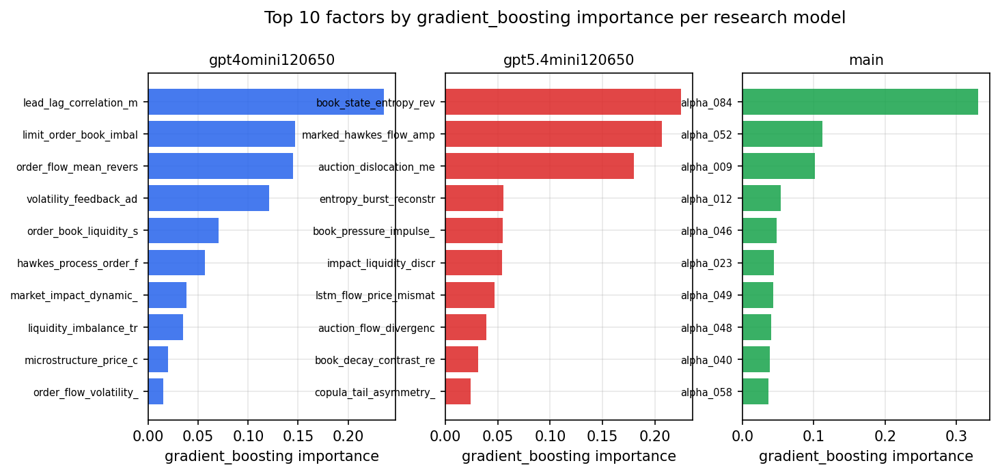

*Top factors by gradient_boosting importance per zoo*

## 4. ML-combined signal — per-underlying vectorised backtest

Each model combines a prerun's factors into ONE signal (fit `factors → forward return` on IS, predict per (bar, underlying)), then that combined signal is run through a simple vectorised backtest — `position(signal) × the underlying's own forward return` — on the held-out OOS tail (+ an equal-weight ensemble). No cross-sectional ranking.

> Config: position=**threshold** (t=1.0, z-score `expanding`), aggregation=**portfolio**, fit-standardise=**per_underlying**, horizon=6.

| prerun | model | n_factors_used | oos_ic | oos_sharpe | is_sharpe | oos_ann_return | oos_max_drawdown |
| --- | --- | --- | --- | --- | --- | --- | --- |
| gpt4omini120650 | linear_regression | 66 | 0.0296 | 6.777 | 11.7894 | 0.6076 | -0.0147 |
| gpt4omini120650 | ridge | 66 | 0.029 | 7.174 | 11.8326 | 0.6462 | -0.015 |
| gpt4omini120650 | lasso | 66 | 0.0231 | 5.6928 | 9.1848 | 0.5143 | -0.0134 |
| gpt4omini120650 | elastic_net | 66 | 0.0232 | 5.7133 | 9.2735 | 0.5142 | -0.0143 |
| gpt4omini120650 | random_forest | 66 | 0.0232 | 1.3626 | 7.6418 | 0.1469 | -0.0194 |
| gpt4omini120650 | gradient_boosting | 66 | -0.0029 | 2.0855 | 10.6882 | 0.143 | -0.0087 |
| gpt4omini120650 | xgboost | 66 | 0.0217 | 2.6038 | 15.3131 | 0.2093 | -0.014 |
| gpt4omini120650 | lightgbm | 66 | 0.0174 | 4.5755 | 17.1723 | 0.3708 | -0.0082 |
| gpt4omini120650 | ensemble | 66 | 0.0265 | 4.94 | 15.301 | 0.4557 | -0.0128 |
| gpt5.4mini120650 | linear_regression | 68 | 0.0506 | 9.7434 | 4.4576 | 0.7921 | -0.0069 |
| gpt5.4mini120650 | ridge | 68 | 0.0501 | 9.9939 | 4.8085 | 0.7503 | -0.0067 |
| gpt5.4mini120650 | lasso | 68 | nan | nan | nan | nan | nan |
| gpt5.4mini120650 | elastic_net | 68 | nan | nan | nan | nan | nan |
| gpt5.4mini120650 | random_forest | 68 | 0.0428 | 6.6798 | 15.7169 | 0.7024 | -0.0149 |
| gpt5.4mini120650 | gradient_boosting | 68 | 0.04 | 5.819 | 12.3695 | 0.2977 | -0.0046 |
| gpt5.4mini120650 | xgboost | 68 | 0.0406 | 4.1166 | 15.5888 | 0.2702 | -0.0104 |
| gpt5.4mini120650 | lightgbm | 68 | 0.0459 | 4.4714 | 16.9602 | 0.2833 | -0.0116 |
| gpt5.4mini120650 | ensemble | 68 | 0.0504 | 3.7456 | 12.0308 | 0.1288 | -0.0069 |
| main | linear_regression | 78 | 0.0299 | 10.3305 | 12.1203 | 0.8447 | -0.0053 |
| main | ridge | 78 | 0.0422 | 10.986 | 12.2227 | 0.9042 | -0.0053 |
| main | lasso | 78 | 0.0576 | 13.4924 | 12.2835 | 1.0737 | -0.0049 |
| main | elastic_net | 78 | 0.0576 | 13.4924 | 12.2835 | 1.0737 | -0.0049 |
| main | random_forest | 78 | 0.0861 | 9.2484 | 12.3007 | 0.8457 | -0.0066 |
| main | gradient_boosting | 78 | 0.0537 | 7.1047 | 14.6064 | 0.4469 | -0.0068 |
| main | xgboost | 78 | 0.0737 | 7.4091 | 15.434 | 0.4432 | -0.0045 |
| main | lightgbm | 78 | 0.0763 | 6.7504 | 19.5202 | 0.5386 | -0.0082 |
| main | ensemble | 78 | 0.0573 | 9.6952 | 13.7471 | 0.7546 | -0.0066 |

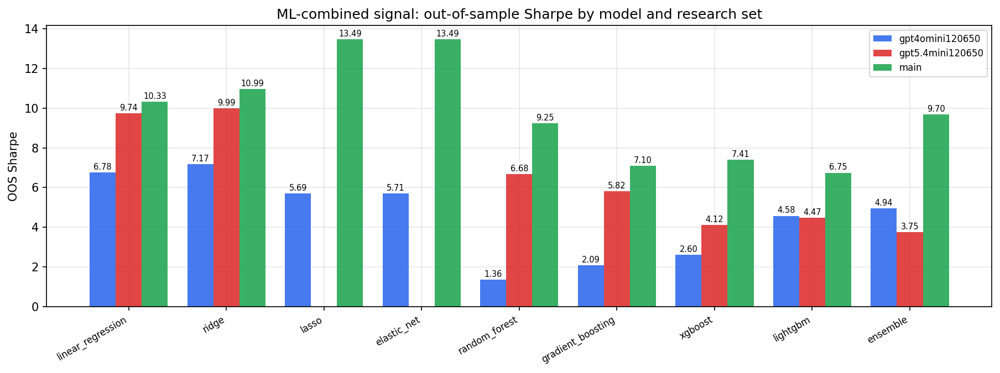

*ML-combined OOS Sharpe by model and research set*

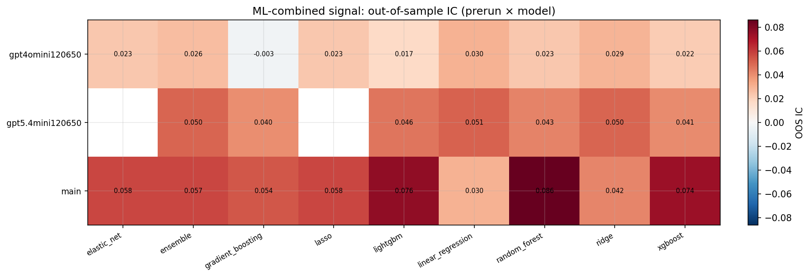

*ML-combined OOS IC (prerun × model)*

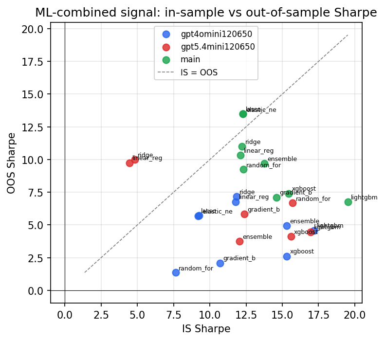

*IS vs OOS Sharpe (overfitting diagnostic)*

---
*Generated by `run_model_comparison.py`. Tables: `*.csv`; interactive: `comparison.ipynb`.*
