# Research-LLM factor comparison — `2024-08`

Comparing the **factor output of different research LLMs** on three axes (raw factor quality → factors as ML features → factors through the full agentic fund). The panel, IS/OOS split, horizon and model hyper-parameters are held identical across preruns — the *only* variable is the factor set.

## Preruns compared

| prerun | research_model | usable_factors | dropped_factors |
| --- | --- | --- | --- |
| gpt4omini120650 | gpt-4o-mini | 66 | 0 |
| gpt5.4mini120650 | gpt-5.4-mini | 68 | 1 |
| main | seed library | 78 | 10 |

> Dropped factors declare fields the current data doesn't have yet (e.g. fundamentals); they light up unchanged once that data is downloaded.

*Usable vs awaiting-data factors per research model*

## Key findings

- **Best ML-combined OOS Sharpe:** `gpt5.4mini120650` with `random_forest` (OOS Sharpe = 17.085).
- **Mean OOS Sharpe across models, by research set:** `main` = 12.898, `gpt5.4mini120650` = 5.751, `gpt4omini120650` = 1.915.
- **Highest mean single-factor |IC| (h=6):** `main` (mean |IC| = 0.0379).
- **Most diverse zoo (highest effective/raw factor ratio):** `gpt5.4mini120650` (eff 56.7 of 68, ratio 0.83).
- **Best selection-deflated single-factor |IC|:** `gpt4omini120650` (deflated |IC| = 0.1745 from 64 factors tried).

## 1. Single-factor IC (raw factor quality)

Per-underlying time-series Spearman rank-IC of every researched factor, recomputed on the shared panel at horizons h=1, h=6, h=60. The per-underlying IC correlates each factor's value vector with the underlying's own forward-return vector (pooled across underlyings); the cross-sectional IC ranks across underlyings per timestamp.

| prerun | n_factors | mean_abs_ic_1 | mean_abs_ic_6 | mean_abs_ic_60 | mean_abs_icir_6 | best_factor_h6 | best_abs_ic_h6 |
| --- | --- | --- | --- | --- | --- | --- | --- |
| gpt4omini120650 | 66 | 0.0112 | 0.011 | 0.0107 | 0.3005 | effective_spread_reversal_strength | 0.1821 |
| gpt5.4mini120650 | 68 | 0.011 | 0.0109 | 0.0094 | 0.4295 | auction_dislocation_mean_reversion | 0.0724 |
| main | 78 | 0.0516 | 0.0379 | 0.0261 | 1.1268 | alpha_054 | 0.0879 |

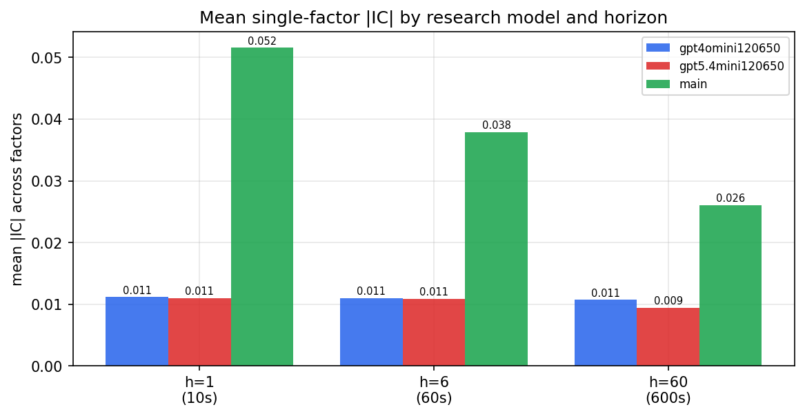

*Mean |IC| by research model and horizon*

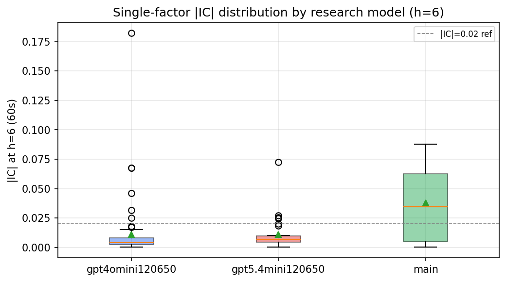

*Per-factor |IC| distribution by research model*

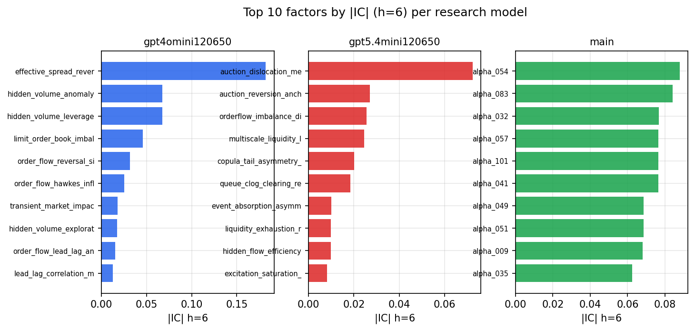

*Top factors by |IC| per research model*

## 2. Factor diversity & redundancy

Pairwise correlation of each zoo's *signals*. `eff_n_factors` is the effective number of independent factors (participation ratio of the correlation eigenvalues); `eff_ratio` and `redundancy` summarise how much unique information the zoo holds vs. how much is duplicated; `n_clusters` groups factors at |corr| ≥ 0.7.

| prerun | n_factors | eff_n_factors | eff_ratio | mean_abs_corr | n_clusters | redundancy |
| --- | --- | --- | --- | --- | --- | --- |
| gpt4omini120650 | 66 | 30.0761 | 0.4557 | 0.0518 | 47 | 0.5443 |
| gpt5.4mini120650 | 68 | 56.6977 | 0.8338 | 0.0081 | 65 | 0.1662 |
| main | 78 | 42.5332 | 0.5453 | 0.0335 | 71 | 0.4547 |

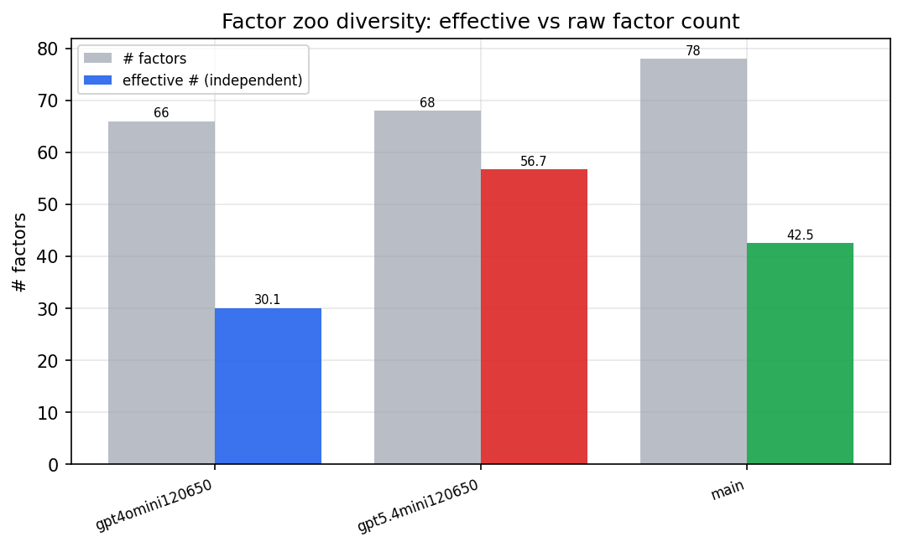

*Effective vs raw factor count per research model*

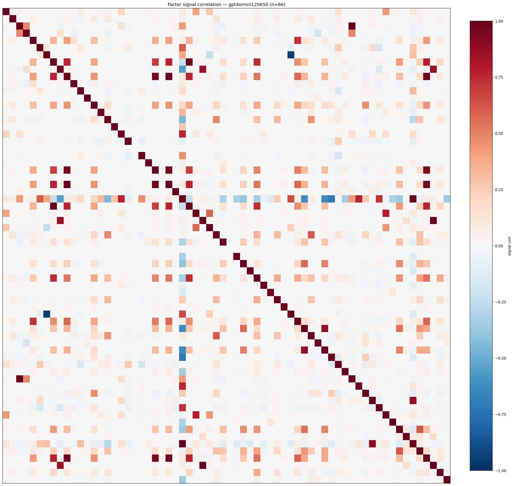

*Signal correlation matrix — gpt4omini120650*

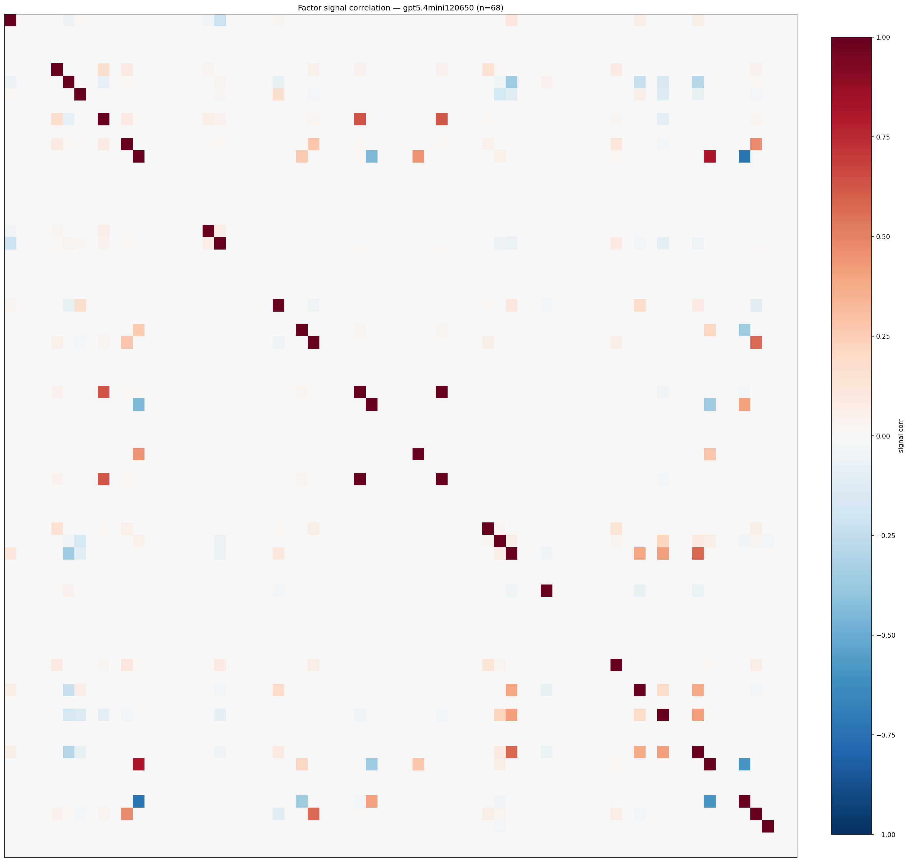

*Signal correlation matrix — gpt5.4mini120650*

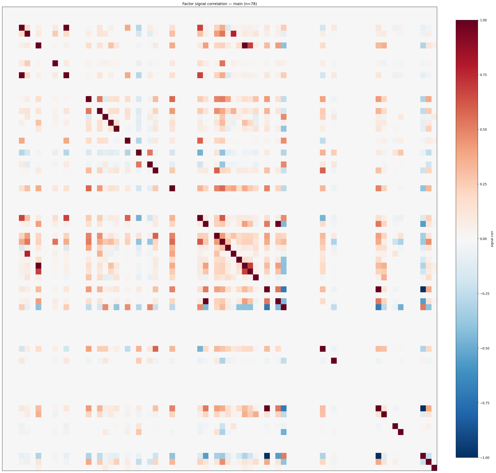

*Signal correlation matrix — main*

## 3. Deflation & model-based importance

`deflated_best_ic` haircuts each zoo's best |IC| for the number of factors tried (`ic_n_tested`) — a bigger zoo's best factor is more likely to be lucky. `lasso_n_nonzero` / `lasso_sparsity` show how many factors a sparse linear model actually keeps (model-view redundancy).

| prerun | best_ic | deflated_best_ic | deflated_best_t | ic_n_tested | ic_n_obs | lasso_n_nonzero | lasso_sparsity |
| --- | --- | --- | --- | --- | --- | --- | --- |
| gpt4omini120650 | 0.1821 | 0.1745 | 66.2236 | 64 | 143998 | 0 | 1.0 |
| gpt5.4mini120650 | 0.0724 | 0.0656 | 24.8805 | 29 | 143998 | 7 | 0.8971 |
| main | 0.0879 | 0.0808 | 30.6723 | 37 | 143998 | 15 | 0.8077 |

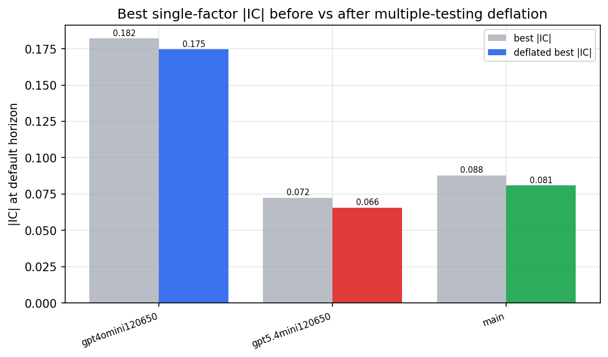

*Best |IC| before vs after multiple-testing deflation*

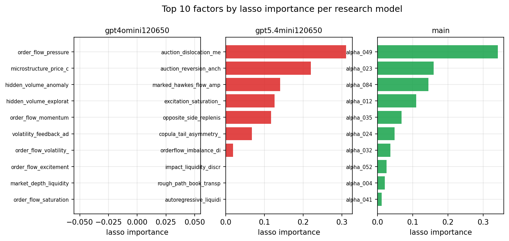

*Top factors by lasso importance per zoo*

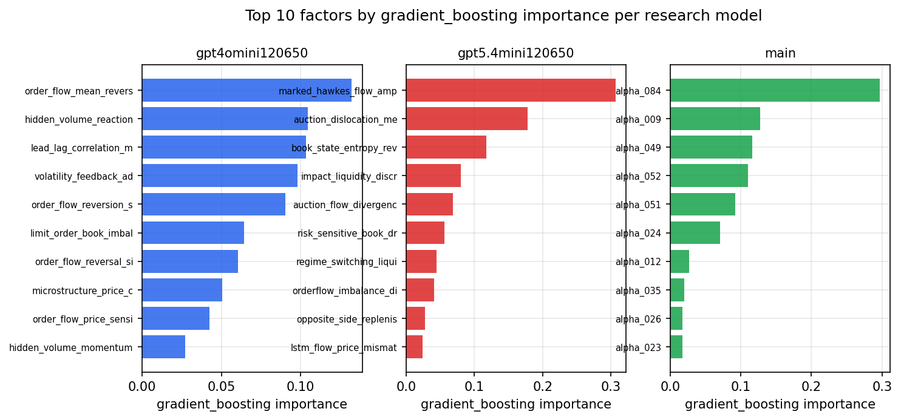

*Top factors by gradient_boosting importance per zoo*

## 4. ML-combined signal — per-underlying vectorised backtest

Each model combines a prerun's factors into ONE signal (fit `factors → forward return` on IS, predict per (bar, underlying)), then that combined signal is run through a simple vectorised backtest — `position(signal) × the underlying's own forward return` — on the held-out OOS tail (+ an equal-weight ensemble). No cross-sectional ranking.

> Config: position=**threshold** (t=1.0, z-score `expanding`), aggregation=**portfolio**, fit-standardise=**per_underlying**, horizon=6.

| prerun | model | n_factors_used | oos_ic | oos_sharpe | is_sharpe | oos_ann_return | oos_max_drawdown |
| --- | --- | --- | --- | --- | --- | --- | --- |
| gpt4omini120650 | linear_regression | 66 | 0.0423 | 3.4369 | 12.0539 | 0.3985 | -0.0206 |
| gpt4omini120650 | ridge | 66 | 0.0396 | 3.2383 | 11.9212 | 0.3582 | -0.0223 |
| gpt4omini120650 | lasso | 66 | 0.0349 | 1.4023 | 9.2663 | 0.1072 | -0.0136 |
| gpt4omini120650 | elastic_net | 66 | 0.0332 | 1.3805 | 9.0256 | 0.104 | -0.0141 |
| gpt4omini120650 | random_forest | 66 | 0.0352 | 1.2303 | 6.7062 | 0.1539 | -0.0364 |
| gpt4omini120650 | gradient_boosting | 66 | -0.0149 | 0.1306 | 10.4701 | 0.0146 | -0.0398 |
| gpt4omini120650 | xgboost | 66 | 0.0394 | 0.3129 | 12.1015 | 0.0339 | -0.0314 |
| gpt4omini120650 | lightgbm | 66 | 0.0427 | 4.7035 | 18.1225 | 0.387 | -0.0125 |
| gpt4omini120650 | ensemble | 66 | 0.0415 | 1.3979 | 15.106 | 0.1662 | -0.0363 |
| gpt5.4mini120650 | linear_regression | 68 | 0.0734 | 4.4314 | 5.5638 | 0.0658 | -0.0037 |
| gpt5.4mini120650 | ridge | 68 | 0.0731 | 4.6945 | 5.6504 | 0.0641 | -0.0031 |
| gpt5.4mini120650 | lasso | 68 | 0.0774 | -2.1442 | 1.6841 | -0.0275 | -0.005 |
| gpt5.4mini120650 | elastic_net | 68 | 0.0774 | -2.1442 | 1.6841 | -0.0275 | -0.005 |
| gpt5.4mini120650 | random_forest | 68 | 0.0856 | 17.0852 | 17.3359 | 1.5091 | -0.01 |
| gpt5.4mini120650 | gradient_boosting | 68 | 0.0807 | 3.3766 | 9.5261 | 0.1251 | -0.003 |
| gpt5.4mini120650 | xgboost | 68 | 0.085 | 7.899 | 13.9968 | 0.3857 | -0.0039 |
| gpt5.4mini120650 | lightgbm | 68 | 0.0822 | 9.0611 | 16.8945 | 0.6366 | -0.0047 |
| gpt5.4mini120650 | ensemble | 68 | 0.0883 | 9.4963 | 18.1274 | 0.5895 | -0.0046 |
| main | linear_regression | 78 | 0.0711 | 13.2596 | 12.928 | 0.5882 | -0.0032 |
| main | ridge | 78 | 0.0589 | 13.3322 | 13.0568 | 0.5898 | -0.0032 |
| main | lasso | 78 | 0.0736 | 14.4366 | 11.3359 | 0.6381 | -0.0029 |
| main | elastic_net | 78 | 0.0736 | 14.4366 | 11.3359 | 0.6381 | -0.0029 |
| main | random_forest | 78 | 0.0753 | 14.1819 | 12.498 | 1.0628 | -0.0051 |
| main | gradient_boosting | 78 | 0.0614 | 10.4749 | 12.4933 | 0.5497 | -0.003 |
| main | xgboost | 78 | 0.0651 | 11.441 | 15.0355 | 0.4769 | -0.003 |
| main | lightgbm | 78 | 0.0695 | 11.121 | 17.1352 | 0.6258 | -0.0038 |
| main | ensemble | 78 | 0.078 | 13.4017 | 15.7868 | 0.8731 | -0.0044 |

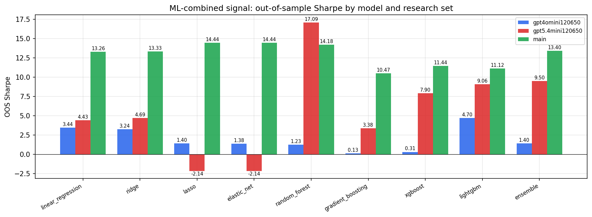

*ML-combined OOS Sharpe by model and research set*

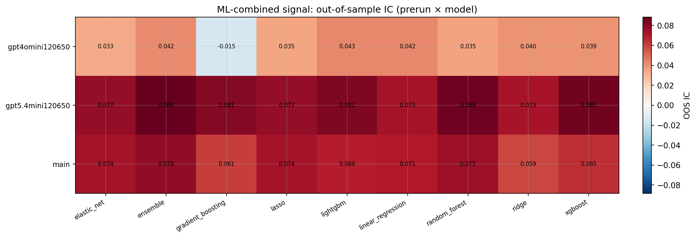

*ML-combined OOS IC (prerun × model)*

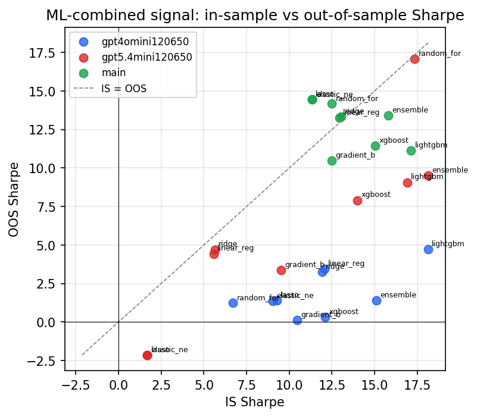

*IS vs OOS Sharpe (overfitting diagnostic)*

---
*Generated by `run_model_comparison.py`. Tables: `*.csv`; interactive: `comparison.ipynb`.*
