# Research-LLM factor comparison — `2024-09`

Comparing the **factor output of different research LLMs** on three axes (raw factor quality → factors as ML features → factors through the full agentic fund). The panel, IS/OOS split, horizon and model hyper-parameters are held identical across preruns — the *only* variable is the factor set.

## Preruns compared

| prerun | research_model | usable_factors | dropped_factors |
| --- | --- | --- | --- |
| gpt4omini120650 | gpt-4o-mini | 66 | 0 |
| gpt5.4mini120650 | gpt-5.4-mini | 68 | 1 |
| main | seed library | 78 | 10 |

> Dropped factors declare fields the current data doesn't have yet (e.g. fundamentals); they light up unchanged once that data is downloaded.

*Usable vs awaiting-data factors per research model*

## Key findings

- **Best ML-combined OOS Sharpe:** `gpt5.4mini120650` with `random_forest` (OOS Sharpe = 23.107).
- **Mean OOS Sharpe across models, by research set:** `main` = 14.749, `gpt5.4mini120650` = 8.478, `gpt4omini120650` = 8.176.
- **Highest mean single-factor |IC| (h=6):** `main` (mean |IC| = 0.0563).
- **Most diverse zoo (highest effective/raw factor ratio):** `gpt5.4mini120650` (eff 56.8 of 68, ratio 0.84).
- **Best selection-deflated single-factor |IC|:** `main` (deflated |IC| = 0.3368 from 37 factors tried).

## 1. Single-factor IC (raw factor quality)

Per-underlying time-series Spearman rank-IC of every researched factor, recomputed on the shared panel at horizons h=1, h=6, h=60. The per-underlying IC correlates each factor's value vector with the underlying's own forward-return vector (pooled across underlyings); the cross-sectional IC ranks across underlyings per timestamp.

| prerun | n_factors | mean_abs_ic_1 | mean_abs_ic_6 | mean_abs_ic_60 | mean_abs_icir_6 | best_factor_h6 | best_abs_ic_h6 |
| --- | --- | --- | --- | --- | --- | --- | --- |
| gpt4omini120650 | 66 | 0.0137 | 0.0114 | 0.0163 | 0.3127 | effective_spread_reversal_strength | 0.1497 |
| gpt5.4mini120650 | 68 | 0.0103 | 0.0085 | 0.0101 | 0.4791 | auction_dislocation_mean_reversion | 0.0821 |
| main | 78 | 0.0507 | 0.0563 | 0.0335 | 1.4595 | alpha_058 | 0.3439 |

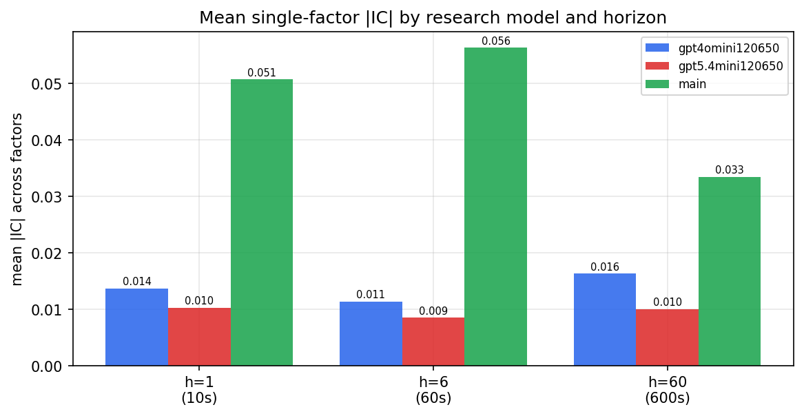

*Mean |IC| by research model and horizon*

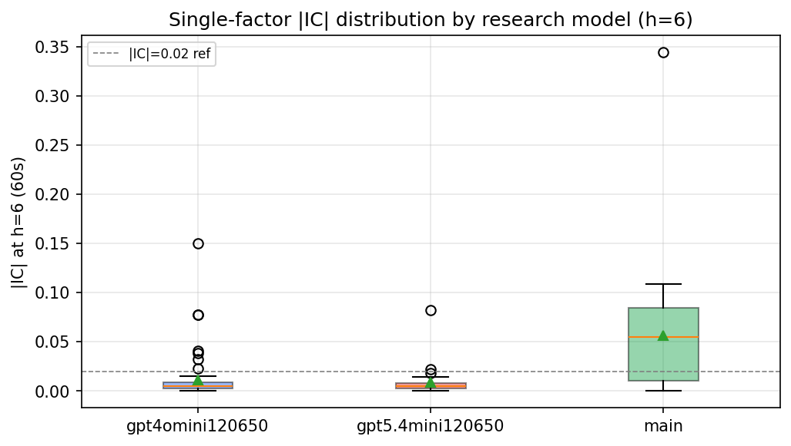

*Per-factor |IC| distribution by research model*

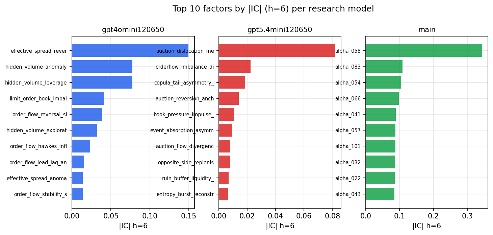

*Top factors by |IC| per research model*

## 2. Factor diversity & redundancy

Pairwise correlation of each zoo's *signals*. `eff_n_factors` is the effective number of independent factors (participation ratio of the correlation eigenvalues); `eff_ratio` and `redundancy` summarise how much unique information the zoo holds vs. how much is duplicated; `n_clusters` groups factors at |corr| ≥ 0.7.

| prerun | n_factors | eff_n_factors | eff_ratio | mean_abs_corr | n_clusters | redundancy |
| --- | --- | --- | --- | --- | --- | --- |
| gpt4omini120650 | 66 | 24.9958 | 0.3787 | 0.0708 | 22 | 0.6213 |
| gpt5.4mini120650 | 68 | 56.8175 | 0.8356 | 0.008 | 64 | 0.1644 |
| main | 78 | 41.3613 | 0.5303 | 0.0347 | 68 | 0.4697 |

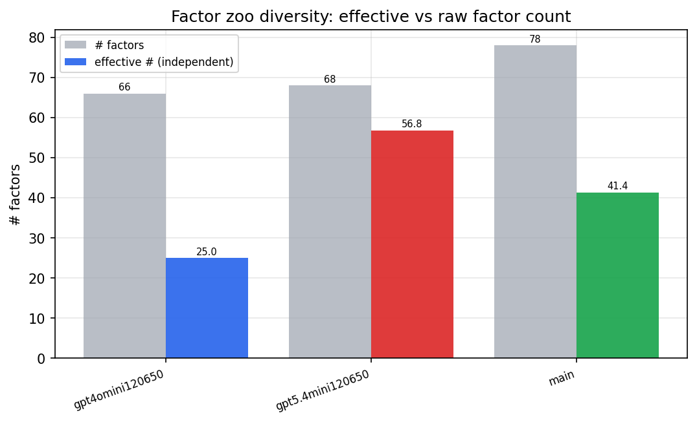

*Effective vs raw factor count per research model*

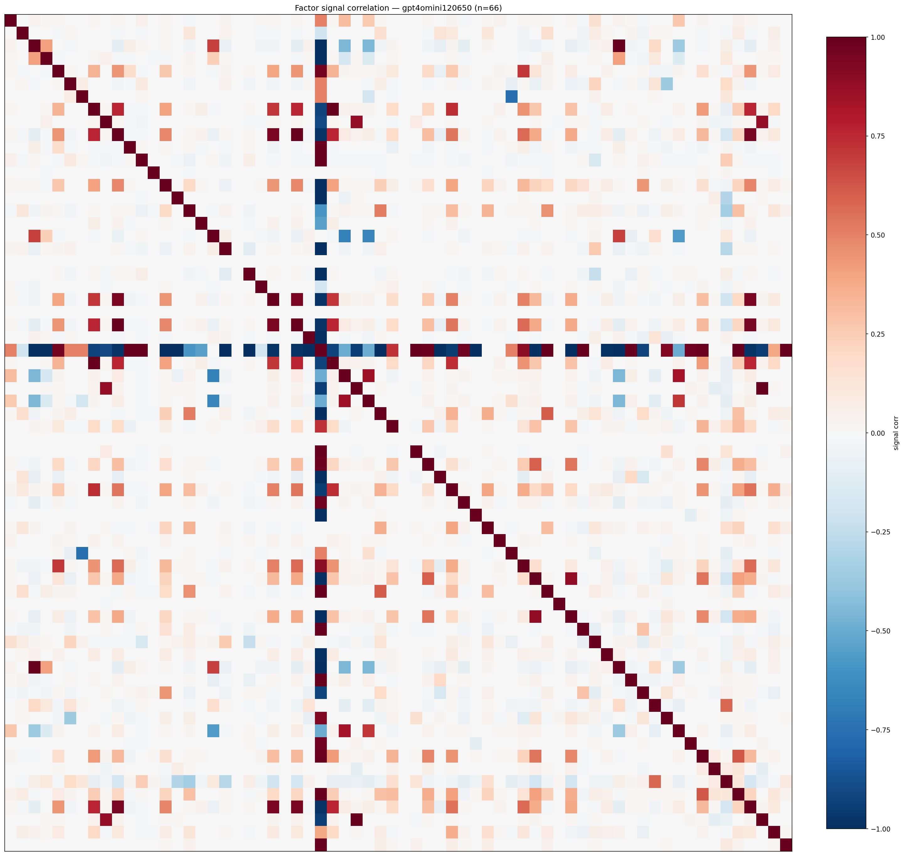

*Signal correlation matrix — gpt4omini120650*

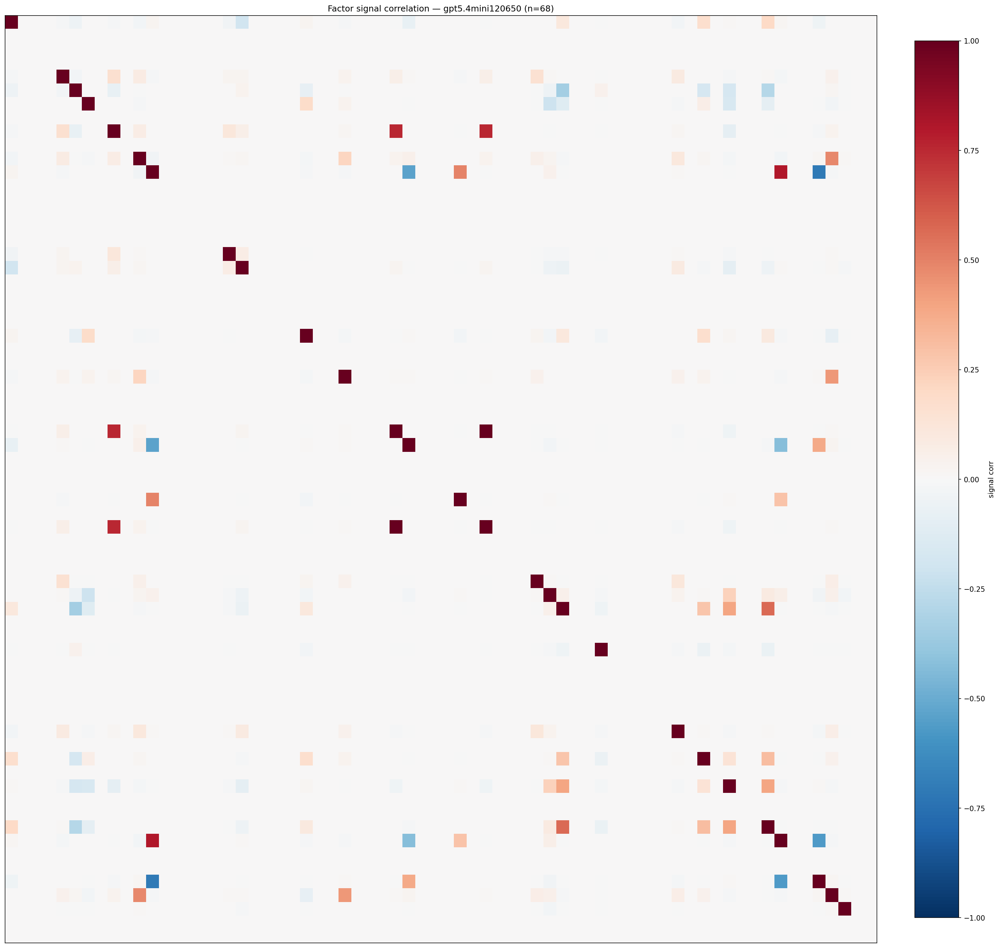

*Signal correlation matrix — gpt5.4mini120650*

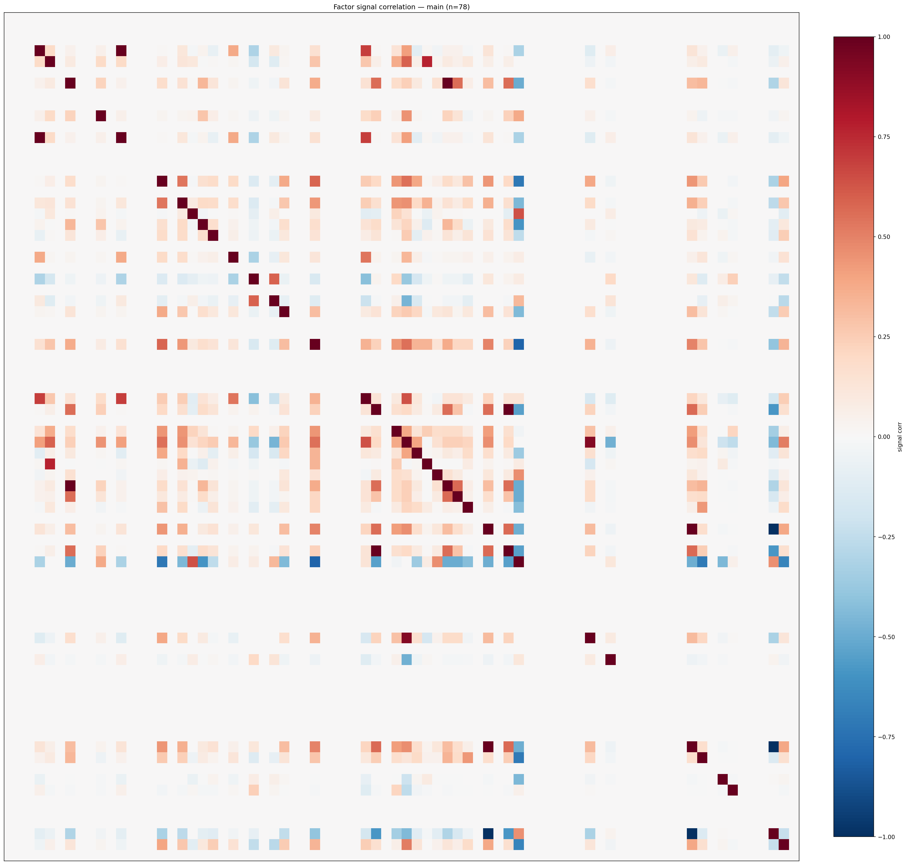

*Signal correlation matrix — main*

## 3. Deflation & model-based importance

`deflated_best_ic` haircuts each zoo's best |IC| for the number of factors tried (`ic_n_tested`) — a bigger zoo's best factor is more likely to be lucky. `lasso_n_nonzero` / `lasso_sparsity` show how many factors a sparse linear model actually keeps (model-view redundancy).

| prerun | best_ic | deflated_best_ic | deflated_best_t | ic_n_tested | ic_n_obs | lasso_n_nonzero | lasso_sparsity |
| --- | --- | --- | --- | --- | --- | --- | --- |
| gpt4omini120650 | 0.1497 | 0.1421 | 53.9211 | 64 | 143997 | 0 | 1.0 |
| gpt5.4mini120650 | 0.0821 | 0.0753 | 28.5566 | 29 | 143997 | 0 | 1.0 |
| main | 0.3439 | 0.3368 | 127.8109 | 37 | 143997 | 18 | 0.7692 |

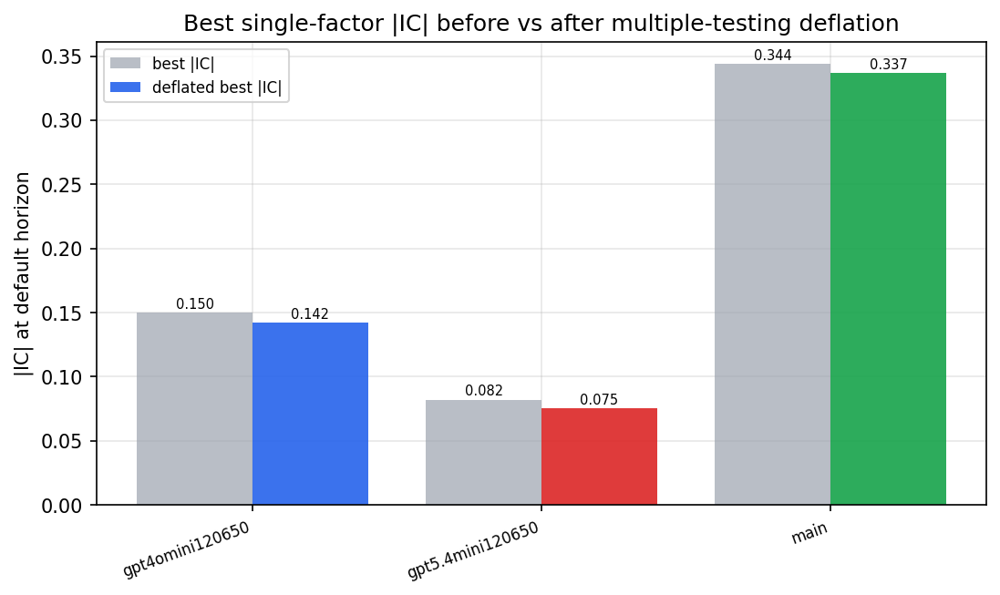

*Best |IC| before vs after multiple-testing deflation*

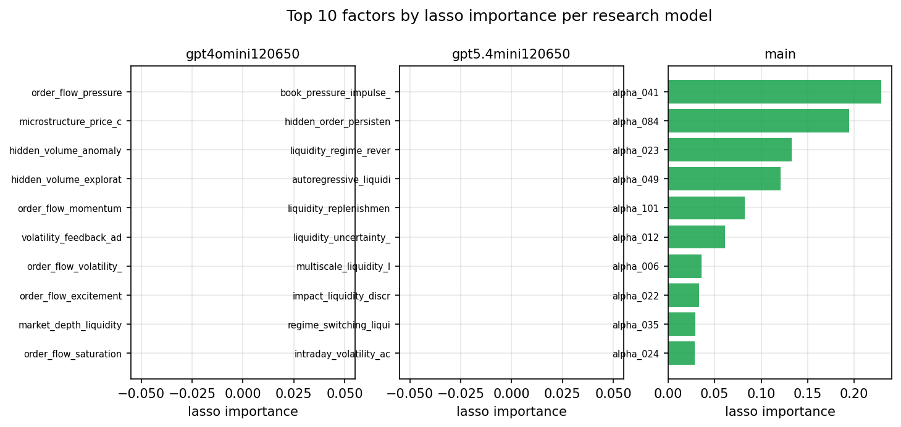

*Top factors by lasso importance per zoo*

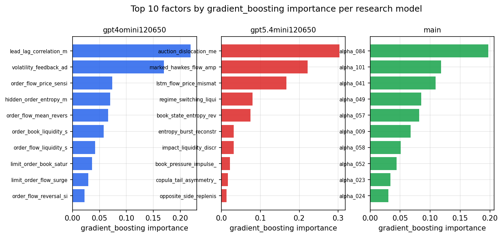

*Top factors by gradient_boosting importance per zoo*

## 4. ML-combined signal — per-underlying vectorised backtest

Each model combines a prerun's factors into ONE signal (fit `factors → forward return` on IS, predict per (bar, underlying)), then that combined signal is run through a simple vectorised backtest — `position(signal) × the underlying's own forward return` — on the held-out OOS tail (+ an equal-weight ensemble). No cross-sectional ranking.

> Config: position=**threshold** (t=1.0, z-score `expanding`), aggregation=**portfolio**, fit-standardise=**per_underlying**, horizon=6.

| prerun | model | n_factors_used | oos_ic | oos_sharpe | is_sharpe | oos_ann_return | oos_max_drawdown |
| --- | --- | --- | --- | --- | --- | --- | --- |
| gpt4omini120650 | linear_regression | 66 | 0.042 | 11.8326 | 15.5134 | 0.6439 | -0.0111 |
| gpt4omini120650 | ridge | 66 | 0.0406 | 13.2068 | 15.6474 | 0.7375 | -0.0113 |
| gpt4omini120650 | lasso | 66 | 0.046 | 12.9955 | 13.6251 | 0.649 | -0.0122 |
| gpt4omini120650 | elastic_net | 66 | 0.046 | 12.9955 | 13.6251 | 0.649 | -0.0122 |
| gpt4omini120650 | random_forest | 66 | 0.0188 | 2.5315 | 8.9111 | 0.2095 | -0.0127 |
| gpt4omini120650 | gradient_boosting | 66 | 0.0048 | 3.4899 | 9.7117 | 0.1837 | -0.0106 |
| gpt4omini120650 | xgboost | 66 | 0.0394 | 1.9911 | 14.1506 | 0.1222 | -0.0098 |
| gpt4omini120650 | lightgbm | 66 | 0.0589 | 6.993 | 17.5848 | 0.4075 | -0.0067 |
| gpt4omini120650 | ensemble | 66 | 0.0467 | 7.5466 | 18.0487 | 0.5587 | -0.0086 |
| gpt5.4mini120650 | linear_regression | 68 | 0.0668 | -2.9855 | 8.932 | -0.0855 | -0.0096 |
| gpt5.4mini120650 | ridge | 68 | 0.0668 | -2.8806 | 9.0104 | -0.0824 | -0.0096 |
| gpt5.4mini120650 | lasso | 68 | 0.0768 | 18.0432 | 15.2356 | 1.0839 | -0.0068 |
| gpt5.4mini120650 | elastic_net | 68 | 0.0768 | 18.0432 | 15.2356 | 1.0839 | -0.0068 |
| gpt5.4mini120650 | random_forest | 68 | 0.0898 | 23.1069 | 21.4712 | 1.3754 | -0.0063 |
| gpt5.4mini120650 | gradient_boosting | 68 | 0.0863 | -0.0614 | 9.9324 | -0.004 | -0.0198 |
| gpt5.4mini120650 | xgboost | 68 | 0.082 | 4.275 | 14.7908 | 0.2331 | -0.0105 |
| gpt5.4mini120650 | lightgbm | 68 | 0.0838 | 7.3911 | 17.4195 | 0.3154 | -0.0127 |
| gpt5.4mini120650 | ensemble | 68 | 0.088 | 11.3744 | 18.7573 | 0.7646 | -0.0137 |
| main | linear_regression | 78 | 0.0848 | 12.8689 | 16.4555 | 0.8364 | -0.0139 |
| main | ridge | 78 | 0.084 | 12.9345 | 16.6307 | 0.8371 | -0.0138 |
| main | lasso | 78 | 0.0836 | 13.6741 | 16.3835 | 0.8912 | -0.014 |
| main | elastic_net | 78 | 0.0836 | 13.6741 | 16.3835 | 0.8912 | -0.014 |
| main | random_forest | 78 | 0.1004 | 22.9112 | 16.3822 | 1.5843 | -0.0111 |
| main | gradient_boosting | 78 | 0.0964 | 12.9136 | 12.2387 | 0.5694 | -0.0051 |
| main | xgboost | 78 | 0.0983 | 14.0002 | 14.5578 | 0.6201 | -0.0066 |
| main | lightgbm | 78 | 0.0961 | 13.3501 | 17.2347 | 0.7249 | -0.0086 |
| main | ensemble | 78 | 0.0968 | 16.418 | 17.3146 | 1.0237 | -0.0104 |

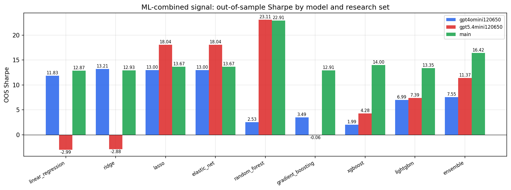

*ML-combined OOS Sharpe by model and research set*

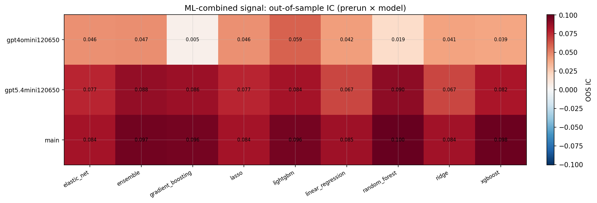

*ML-combined OOS IC (prerun × model)*

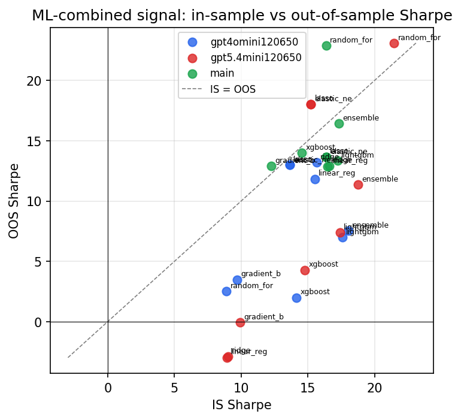

*IS vs OOS Sharpe (overfitting diagnostic)*

---
*Generated by `run_model_comparison.py`. Tables: `*.csv`; interactive: `comparison.ipynb`.*
