# Research-LLM factor comparison — `2024-10`

Comparing the **factor output of different research LLMs** on three axes (raw factor quality → factors as ML features → factors through the full agentic fund). The panel, IS/OOS split, horizon and model hyper-parameters are held identical across preruns — the *only* variable is the factor set.

## Preruns compared

| prerun | research_model | usable_factors | dropped_factors |
| --- | --- | --- | --- |
| gpt4omini120650 | gpt-4o-mini | 66 | 0 |
| gpt5.4mini120650 | gpt-5.4-mini | 68 | 1 |
| main | seed library | 77 | 11 |

> Dropped factors declare fields the current data doesn't have yet (e.g. fundamentals); they light up unchanged once that data is downloaded.

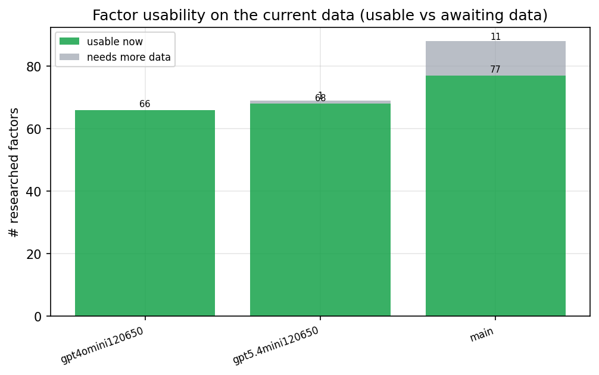

*Usable vs awaiting-data factors per research model*

## Key findings

- **Best ML-combined OOS Sharpe:** `gpt5.4mini120650` with `random_forest` (OOS Sharpe = 16.929).
- **Mean OOS Sharpe across models, by research set:** `main` = 12.873, `gpt5.4mini120650` = 11.323, `gpt4omini120650` = 7.373.
- **Highest mean single-factor |IC| (h=6):** `main` (mean |IC| = 0.0686).
- **Most diverse zoo (highest effective/raw factor ratio):** `gpt5.4mini120650` (eff 57.7 of 68, ratio 0.85).
- **Best selection-deflated single-factor |IC|:** `main` (deflated |IC| = 0.8651 from 37 factors tried).

## 1. Single-factor IC (raw factor quality)

Per-underlying time-series Spearman rank-IC of every researched factor, recomputed on the shared panel at horizons h=1, h=6, h=60. The per-underlying IC correlates each factor's value vector with the underlying's own forward-return vector (pooled across underlyings); the cross-sectional IC ranks across underlyings per timestamp.

| prerun | n_factors | mean_abs_ic_1 | mean_abs_ic_6 | mean_abs_ic_60 | mean_abs_icir_6 | best_factor_h6 | best_abs_ic_h6 |
| --- | --- | --- | --- | --- | --- | --- | --- |
| gpt4omini120650 | 66 | 0.0245 | 0.015 | 0.0172 | 0.2594 | effective_spread_reversal_strength | 0.527 |
| gpt5.4mini120650 | 68 | 0.0091 | 0.0084 | 0.0086 | 0.4654 | auction_dislocation_mean_reversion | 0.0741 |
| main | 77 | 0.0451 | 0.0686 | 0.0404 | 1.3974 | alpha_058 | 0.8721 |

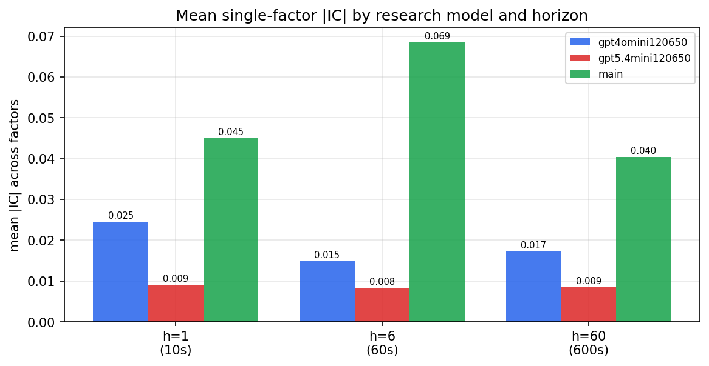

*Mean |IC| by research model and horizon*

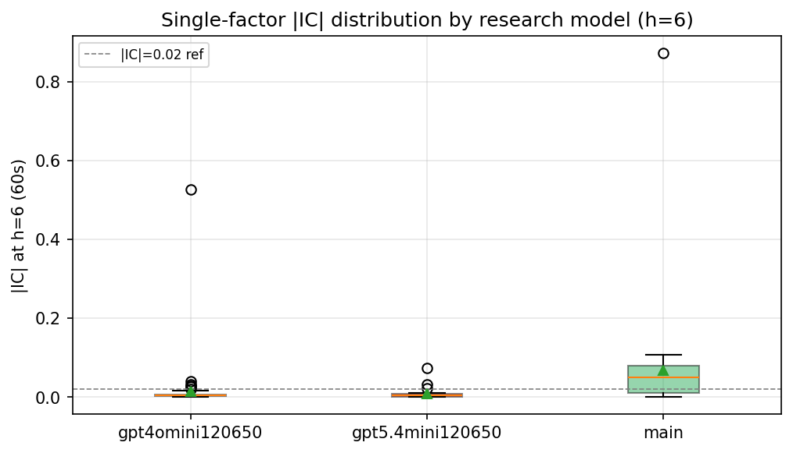

*Per-factor |IC| distribution by research model*

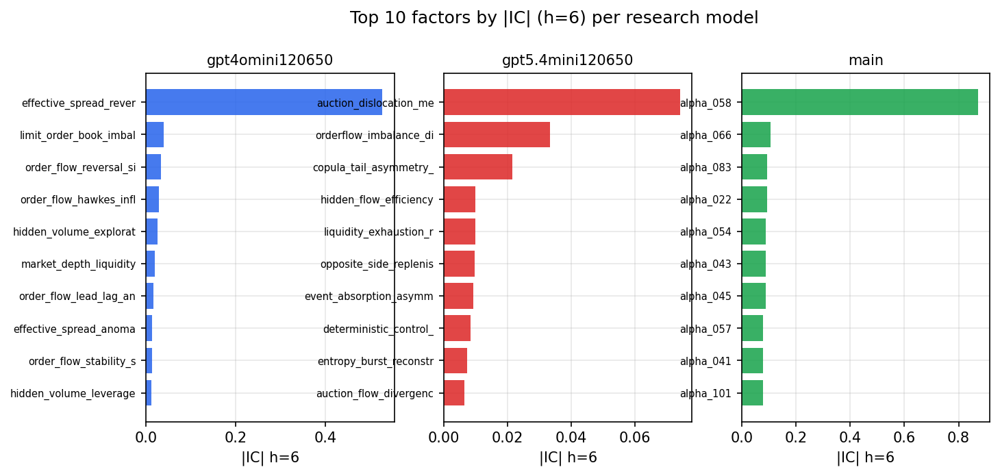

*Top factors by |IC| per research model*

## 2. Factor diversity & redundancy

Pairwise correlation of each zoo's *signals*. `eff_n_factors` is the effective number of independent factors (participation ratio of the correlation eigenvalues); `eff_ratio` and `redundancy` summarise how much unique information the zoo holds vs. how much is duplicated; `n_clusters` groups factors at |corr| ≥ 0.7.

| prerun | n_factors | eff_n_factors | eff_ratio | mean_abs_corr | n_clusters | redundancy |
| --- | --- | --- | --- | --- | --- | --- |
| gpt4omini120650 | 66 | 23.6047 | 0.3576 | 0.0715 | 18 | 0.6424 |
| gpt5.4mini120650 | 68 | 57.7003 | 0.8485 | 0.0073 | 65 | 0.1515 |
| main | 77 | 41.4774 | 0.5387 | 0.033 | 67 | 0.4613 |

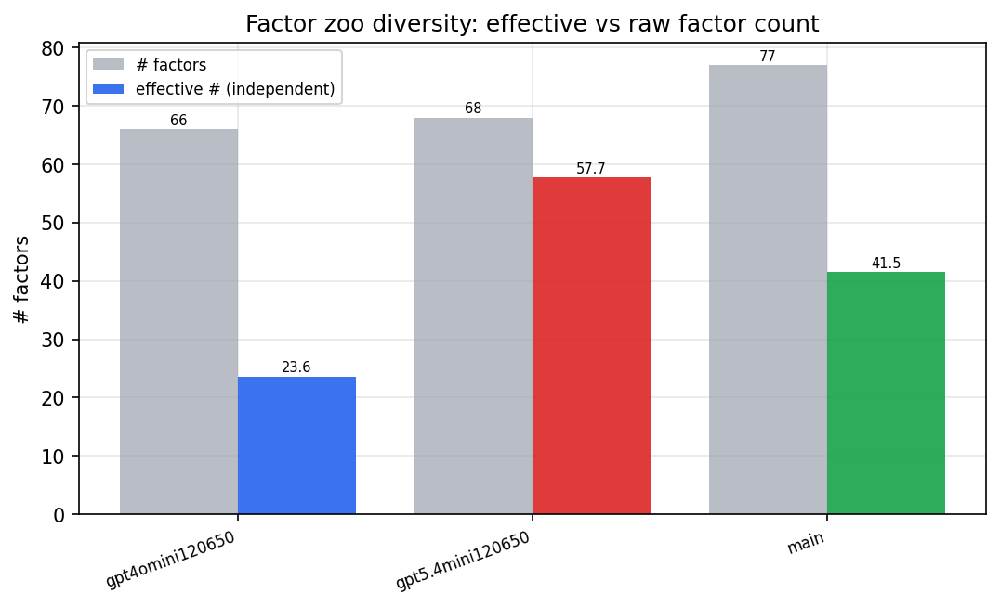

*Effective vs raw factor count per research model*

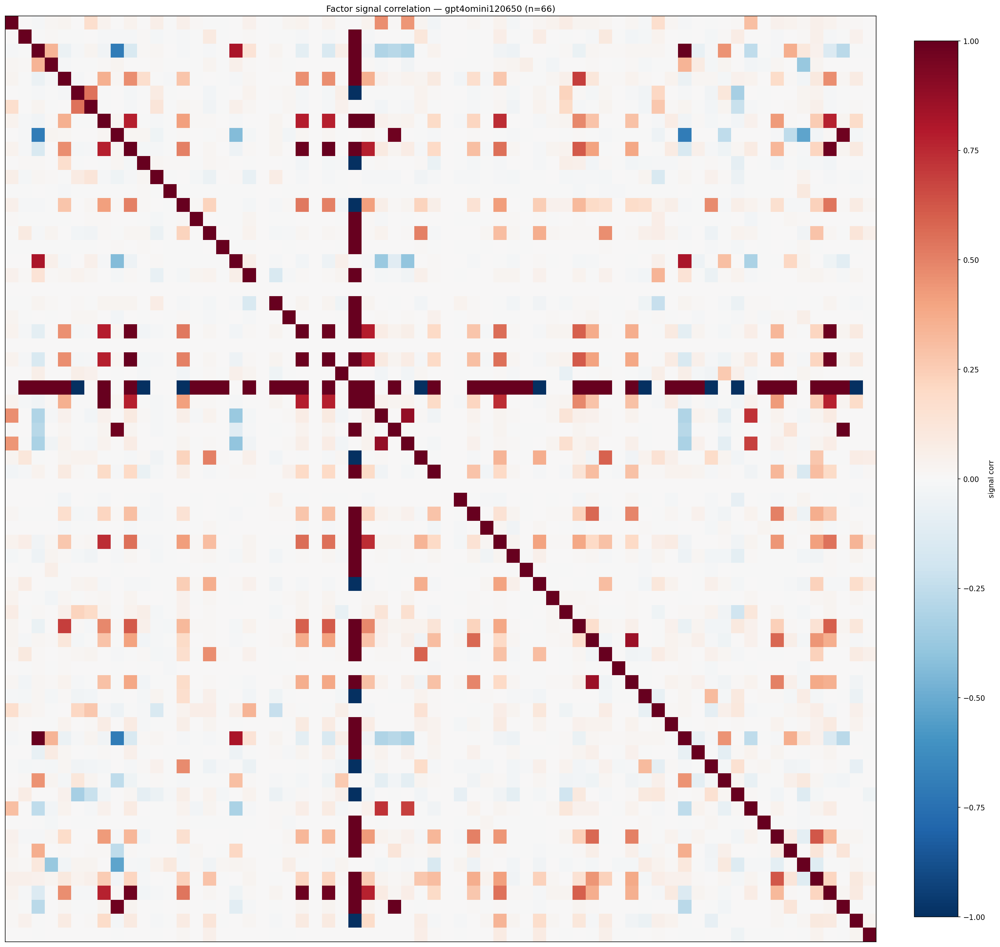

*Signal correlation matrix — gpt4omini120650*

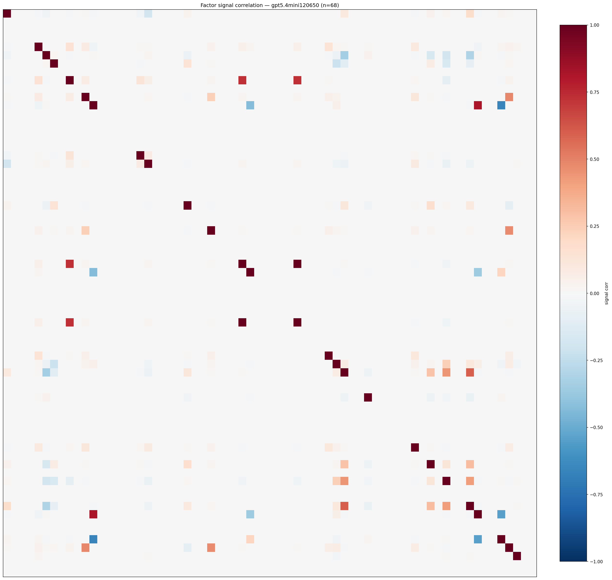

*Signal correlation matrix — gpt5.4mini120650*

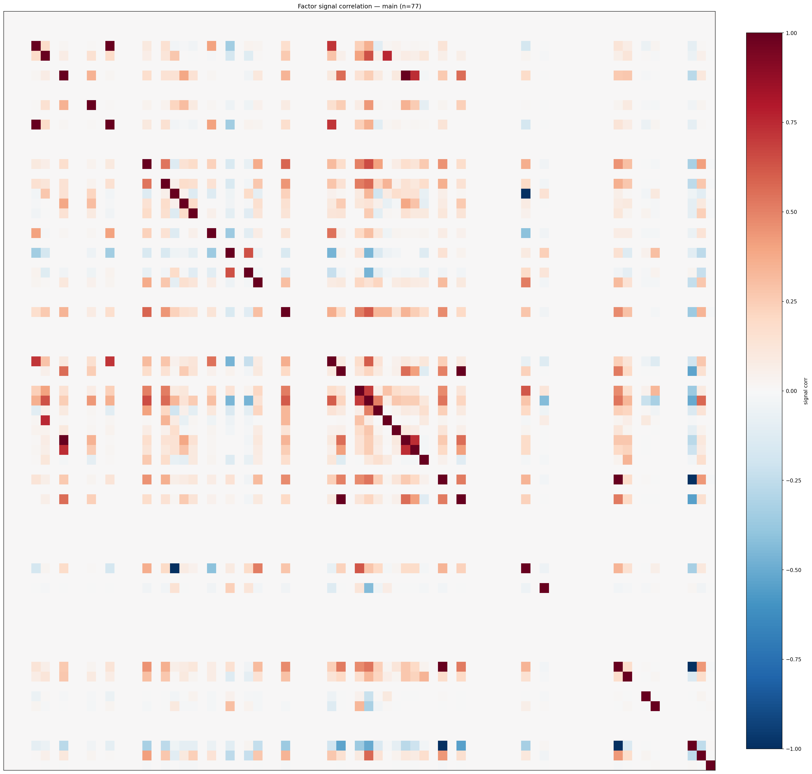

*Signal correlation matrix — main*

## 3. Deflation & model-based importance

`deflated_best_ic` haircuts each zoo's best |IC| for the number of factors tried (`ic_n_tested`) — a bigger zoo's best factor is more likely to be lucky. `lasso_n_nonzero` / `lasso_sparsity` show how many factors a sparse linear model actually keeps (model-view redundancy).

| prerun | best_ic | deflated_best_ic | deflated_best_t | ic_n_tested | ic_n_obs | lasso_n_nonzero | lasso_sparsity |
| --- | --- | --- | --- | --- | --- | --- | --- |
| gpt4omini120650 | 0.527 | 0.5195 | 199.4804 | 63 | 147417 | 0 | 1.0 |
| gpt5.4mini120650 | 0.0741 | 0.0674 | 25.882 | 28 | 147417 | 0 | 1.0 |
| main | 0.8721 | 0.8651 | 332.1477 | 37 | 147417 | 33 | 0.5714 |

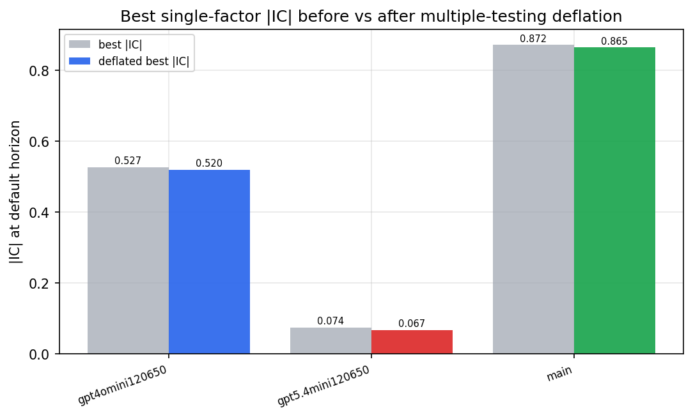

*Best |IC| before vs after multiple-testing deflation*

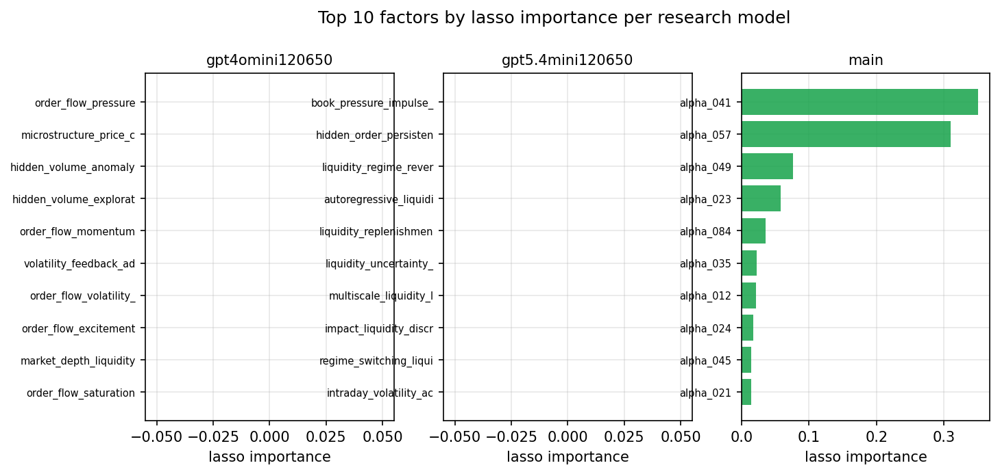

*Top factors by lasso importance per zoo*

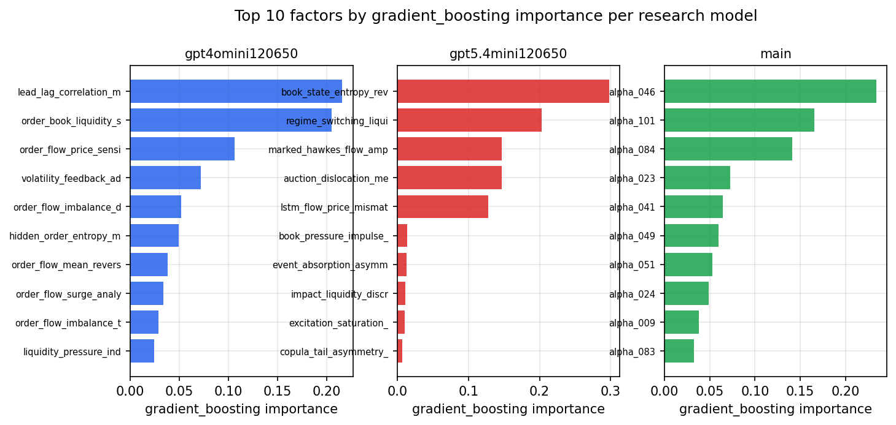

*Top factors by gradient_boosting importance per zoo*

## 4. ML-combined signal — per-underlying vectorised backtest

Each model combines a prerun's factors into ONE signal (fit `factors → forward return` on IS, predict per (bar, underlying)), then that combined signal is run through a simple vectorised backtest — `position(signal) × the underlying's own forward return` — on the held-out OOS tail (+ an equal-weight ensemble). No cross-sectional ranking.

> Config: position=**threshold** (t=1.0, z-score `expanding`), aggregation=**portfolio**, fit-standardise=**per_underlying**, horizon=6.

| prerun | model | n_factors_used | oos_ic | oos_sharpe | is_sharpe | oos_ann_return | oos_max_drawdown |
| --- | --- | --- | --- | --- | --- | --- | --- |
| gpt4omini120650 | linear_regression | 66 | 0.0431 | 8.2234 | 12.4472 | 0.6404 | -0.0087 |
| gpt4omini120650 | ridge | 66 | 0.0422 | 8.6984 | 11.6612 | 0.6763 | -0.0066 |
| gpt4omini120650 | lasso | 66 | nan | nan | nan | nan | nan |
| gpt4omini120650 | elastic_net | 66 | nan | nan | nan | nan | nan |
| gpt4omini120650 | random_forest | 66 | 0.0332 | 5.2895 | 7.9067 | 0.4635 | -0.0091 |
| gpt4omini120650 | gradient_boosting | 66 | 0.0332 | 5.8378 | 13.7309 | 0.3702 | -0.0089 |
| gpt4omini120650 | xgboost | 66 | 0.0337 | 5.96 | 17.0858 | 0.4689 | -0.0121 |
| gpt4omini120650 | lightgbm | 66 | 0.0496 | 8.1188 | 18.8256 | 0.5933 | -0.0119 |
| gpt4omini120650 | ensemble | 66 | 0.0517 | 9.4816 | 18.8057 | 0.7291 | -0.0108 |
| gpt5.4mini120650 | linear_regression | 68 | 0.0594 | 5.9439 | 6.2164 | 0.1874 | -0.0048 |
| gpt5.4mini120650 | ridge | 68 | 0.0589 | 10.5343 | 8.9136 | 0.4156 | -0.0066 |
| gpt5.4mini120650 | lasso | 68 | nan | nan | nan | nan | nan |
| gpt5.4mini120650 | elastic_net | 68 | nan | nan | nan | nan | nan |
| gpt5.4mini120650 | random_forest | 68 | 0.0844 | 16.9286 | 23.0346 | 1.1868 | -0.0042 |
| gpt5.4mini120650 | gradient_boosting | 68 | 0.0754 | 7.845 | 10.0932 | 0.3533 | -0.0049 |
| gpt5.4mini120650 | xgboost | 68 | 0.0831 | 10.1926 | 11.9911 | 0.4687 | -0.0032 |
| gpt5.4mini120650 | lightgbm | 68 | 0.0823 | 12.1017 | 17.0525 | 0.6418 | -0.0032 |
| gpt5.4mini120650 | ensemble | 68 | 0.0806 | 15.7155 | 17.4887 | 0.8674 | -0.0048 |
| main | linear_regression | 77 | 0.07 | 13.6032 | 13.1264 | 0.7583 | -0.0033 |
| main | ridge | 77 | 0.0703 | 14.4023 | 14.0461 | 0.8363 | -0.0025 |
| main | lasso | 77 | 0.0705 | 13.6506 | 13.4453 | 0.7986 | -0.0033 |
| main | elastic_net | 77 | 0.0705 | 13.6506 | 13.4453 | 0.7986 | -0.0033 |
| main | random_forest | 77 | 0.074 | 16.3896 | 18.2419 | 1.255 | -0.0042 |
| main | gradient_boosting | 77 | 0.0763 | 9.7567 | 13.0653 | 0.5377 | -0.0051 |
| main | xgboost | 77 | 0.0739 | 11.2714 | 13.7714 | 0.6476 | -0.0048 |
| main | lightgbm | 77 | 0.073 | 9.0923 | 14.4252 | 0.5046 | -0.0054 |
| main | ensemble | 77 | 0.0794 | 14.0394 | 16.0705 | 0.9324 | -0.0047 |

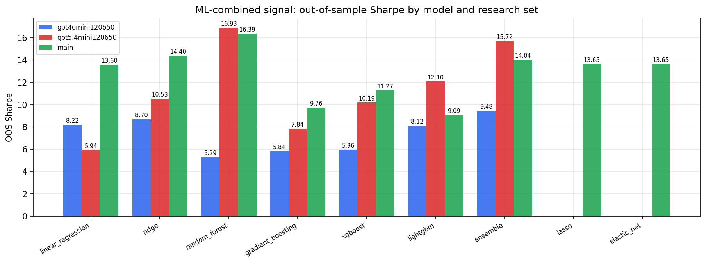

*ML-combined OOS Sharpe by model and research set*

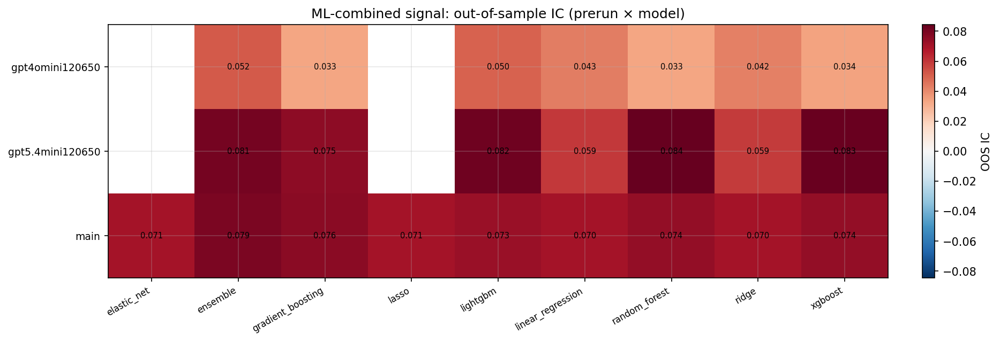

*ML-combined OOS IC (prerun × model)*

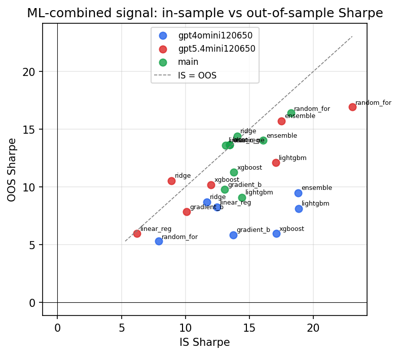

*IS vs OOS Sharpe (overfitting diagnostic)*

---
*Generated by `run_model_comparison.py`. Tables: `*.csv`; interactive: `comparison.ipynb`.*
