# Research-LLM factor comparison — `2024-11`

Comparing the **factor output of different research LLMs** on three axes (raw factor quality → factors as ML features → factors through the full agentic fund). The panel, IS/OOS split, horizon and model hyper-parameters are held identical across preruns — the *only* variable is the factor set.

## Preruns compared

| prerun | research_model | usable_factors | dropped_factors |
| --- | --- | --- | --- |
| gpt4omini120650 | gpt-4o-mini | 66 | 0 |
| gpt5.4mini120650 | gpt-5.4-mini | 68 | 1 |
| main | seed library | 77 | 11 |

> Dropped factors declare fields the current data doesn't have yet (e.g. fundamentals); they light up unchanged once that data is downloaded.

*Usable vs awaiting-data factors per research model*

## Key findings

- **Best ML-combined OOS Sharpe:** `main` with `gradient_boosting` (OOS Sharpe = 11.582).
- **Mean OOS Sharpe across models, by research set:** `main` = 10.234, `gpt5.4mini120650` = 1.953, `gpt4omini120650` = -0.068.
- **Highest mean single-factor |IC| (h=6):** `main` (mean |IC| = 0.0493).
- **Most diverse zoo (highest effective/raw factor ratio):** `gpt5.4mini120650` (eff 57.2 of 68, ratio 0.84).
- **Best selection-deflated single-factor |IC|:** `main` (deflated |IC| = 0.4929 from 37 factors tried).

## 1. Single-factor IC (raw factor quality)

Per-underlying time-series Spearman rank-IC of every researched factor, recomputed on the shared panel at horizons h=1, h=6, h=60. The per-underlying IC correlates each factor's value vector with the underlying's own forward-return vector (pooled across underlyings); the cross-sectional IC ranks across underlyings per timestamp.

| prerun | n_factors | mean_abs_ic_1 | mean_abs_ic_6 | mean_abs_ic_60 | mean_abs_icir_6 | best_factor_h6 | best_abs_ic_h6 |
| --- | --- | --- | --- | --- | --- | --- | --- |
| gpt4omini120650 | 66 | 0.0191 | 0.0143 | 0.0091 | 0.2629 | effective_spread_reversal_strength | 0.4617 |
| gpt5.4mini120650 | 68 | 0.0105 | 0.0113 | 0.0106 | 0.4323 | auction_dislocation_mean_reversion | 0.0614 |
| main | 77 | 0.0413 | 0.0493 | 0.057 | 1.0195 | alpha_058 | 0.5 |

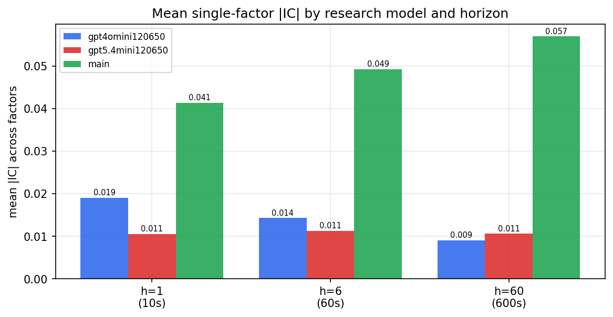

*Mean |IC| by research model and horizon*

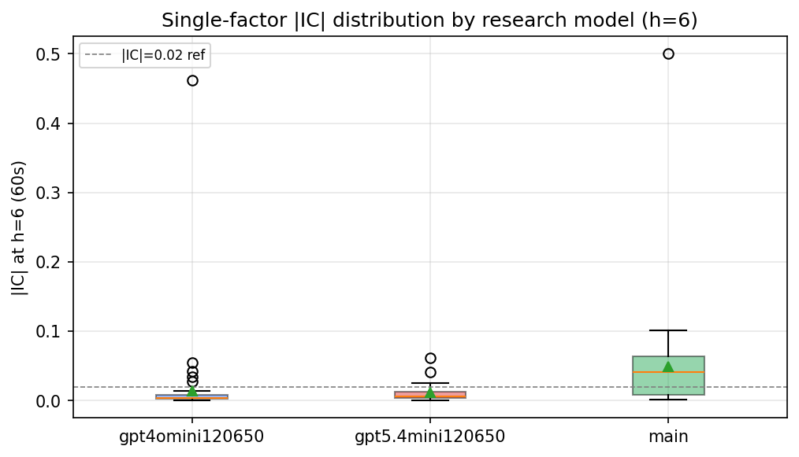

*Per-factor |IC| distribution by research model*

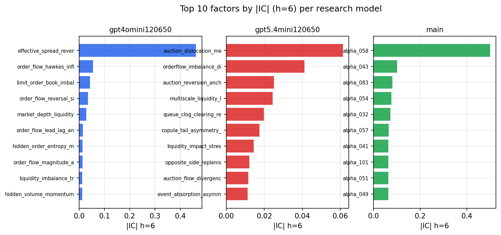

*Top factors by |IC| per research model*

## 2. Factor diversity & redundancy

Pairwise correlation of each zoo's *signals*. `eff_n_factors` is the effective number of independent factors (participation ratio of the correlation eigenvalues); `eff_ratio` and `redundancy` summarise how much unique information the zoo holds vs. how much is duplicated; `n_clusters` groups factors at |corr| ≥ 0.7.

| prerun | n_factors | eff_n_factors | eff_ratio | mean_abs_corr | n_clusters | redundancy |
| --- | --- | --- | --- | --- | --- | --- |
| gpt4omini120650 | 66 | 25.4519 | 0.3856 | 0.0644 | 24 | 0.6144 |
| gpt5.4mini120650 | 68 | 57.2311 | 0.8416 | 0.0078 | 65 | 0.1584 |
| main | 77 | 42.5187 | 0.5522 | 0.0322 | 69 | 0.4478 |

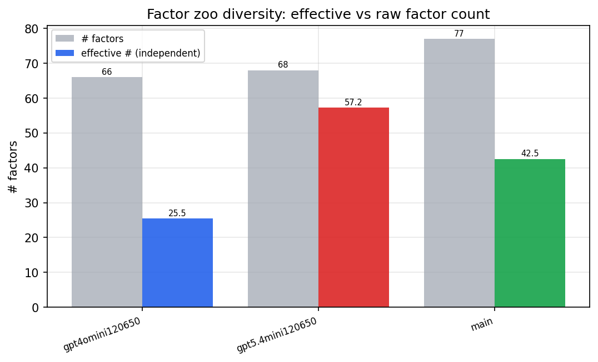

*Effective vs raw factor count per research model*

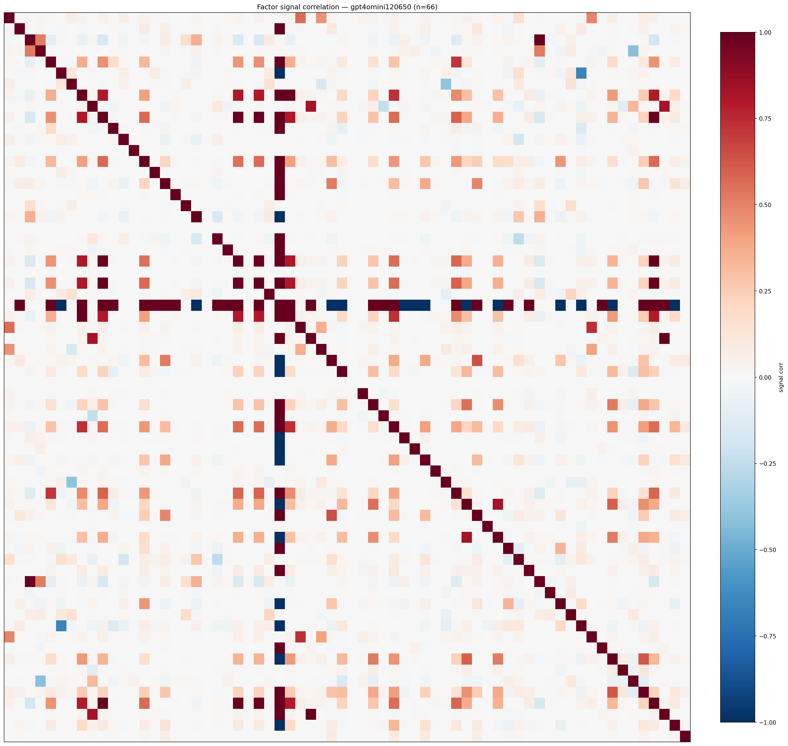

*Signal correlation matrix — gpt4omini120650*

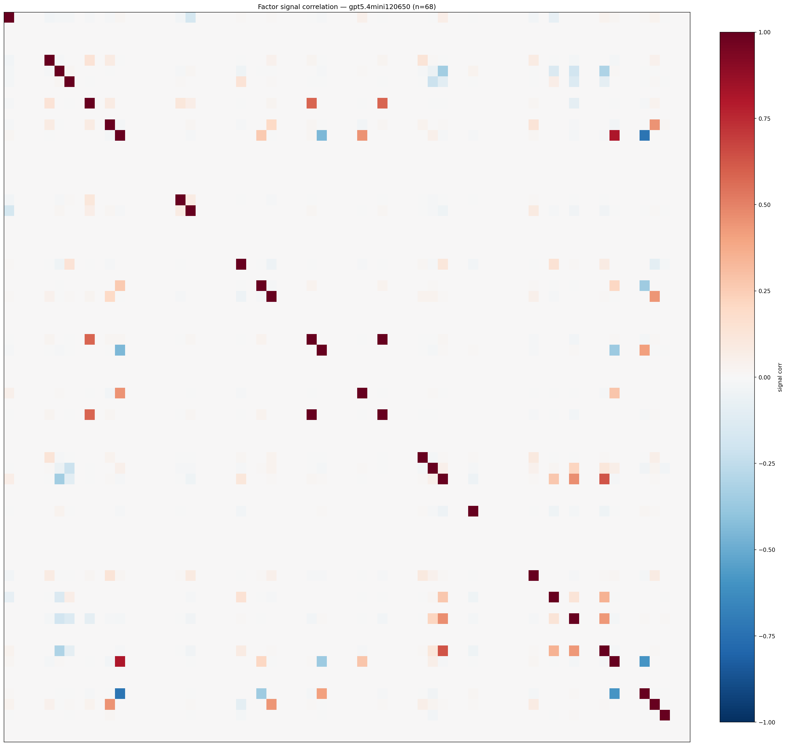

*Signal correlation matrix — gpt5.4mini120650*

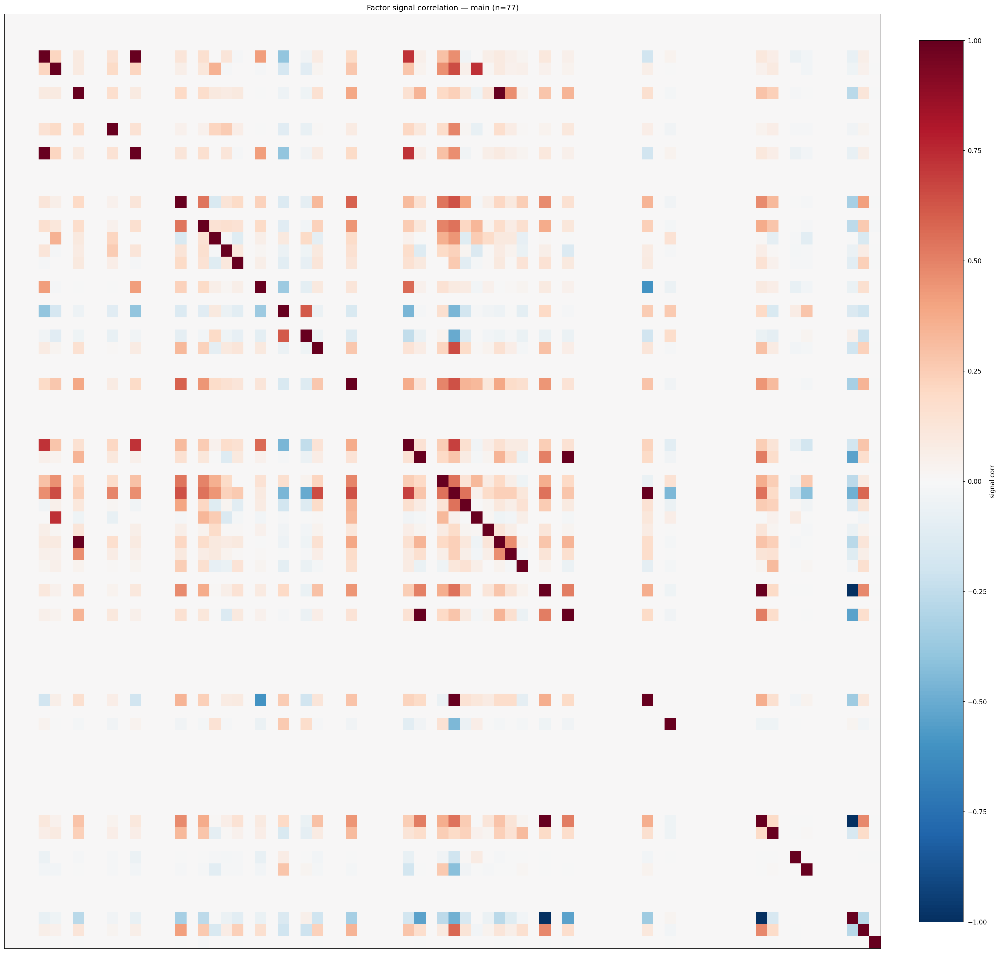

*Signal correlation matrix — main*

## 3. Deflation & model-based importance

`deflated_best_ic` haircuts each zoo's best |IC| for the number of factors tried (`ic_n_tested`) — a bigger zoo's best factor is more likely to be lucky. `lasso_n_nonzero` / `lasso_sparsity` show how many factors a sparse linear model actually keeps (model-view redundancy).

| prerun | best_ic | deflated_best_ic | deflated_best_t | ic_n_tested | ic_n_obs | lasso_n_nonzero | lasso_sparsity |
| --- | --- | --- | --- | --- | --- | --- | --- |
| gpt4omini120650 | 0.4617 | 0.4541 | 172.3193 | 63 | 143998 | 0 | 1.0 |
| gpt5.4mini120650 | 0.0614 | 0.0546 | 20.7245 | 28 | 143998 | 13 | 0.8088 |
| main | 0.5 | 0.4929 | 187.048 | 37 | 143998 | 13 | 0.8312 |

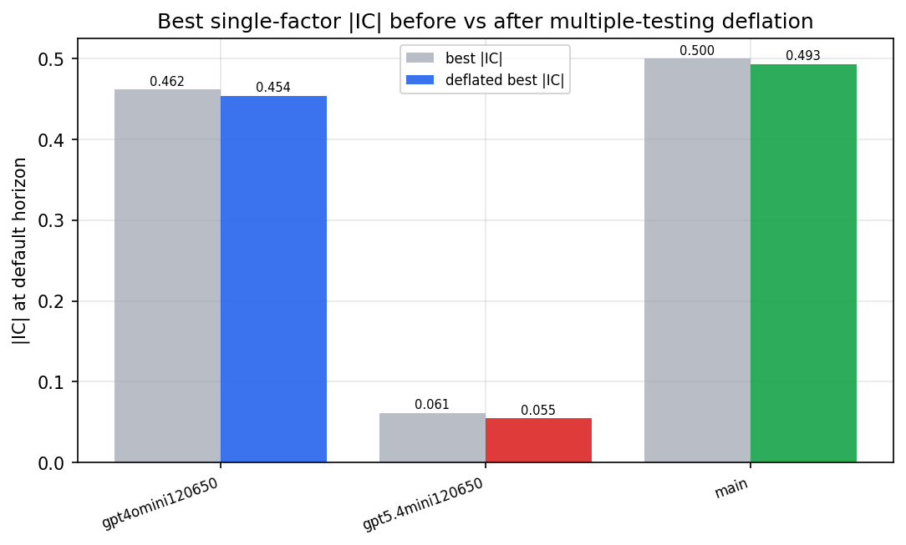

*Best |IC| before vs after multiple-testing deflation*

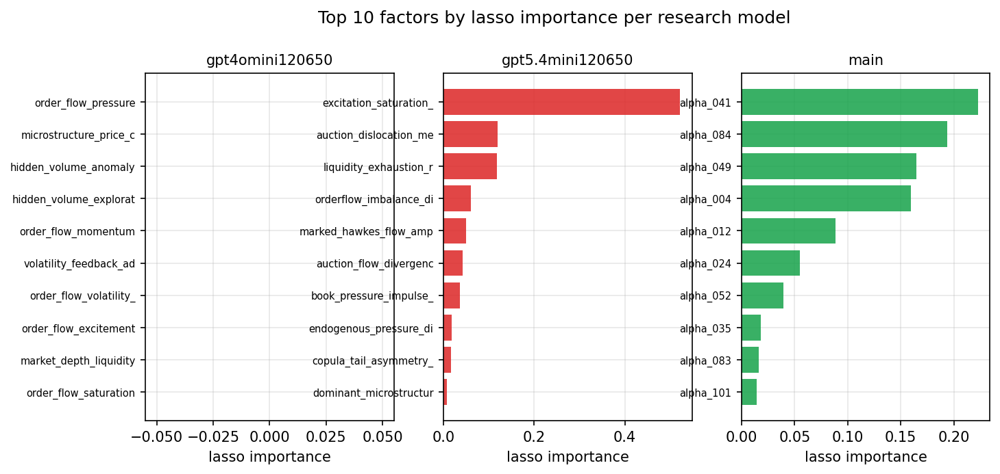

*Top factors by lasso importance per zoo*

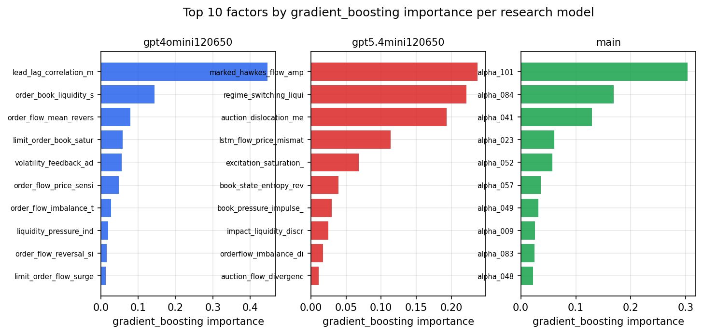

*Top factors by gradient_boosting importance per zoo*

## 4. ML-combined signal — per-underlying vectorised backtest

Each model combines a prerun's factors into ONE signal (fit `factors → forward return` on IS, predict per (bar, underlying)), then that combined signal is run through a simple vectorised backtest — `position(signal) × the underlying's own forward return` — on the held-out OOS tail (+ an equal-weight ensemble). No cross-sectional ranking.

> Config: position=**threshold** (t=1.0, z-score `expanding`), aggregation=**portfolio**, fit-standardise=**per_underlying**, horizon=6.

| prerun | model | n_factors_used | oos_ic | oos_sharpe | is_sharpe | oos_ann_return | oos_max_drawdown |
| --- | --- | --- | --- | --- | --- | --- | --- |
| gpt4omini120650 | linear_regression | 66 | 0.0183 | 0.9658 | 7.137 | 0.0381 | -0.0091 |
| gpt4omini120650 | ridge | 66 | 0.0176 | 0.043 | 7.2025 | 0.0017 | -0.0106 |
| gpt4omini120650 | lasso | 66 | 0.0057 | -3.7235 | 5.0189 | -0.1867 | -0.0186 |
| gpt4omini120650 | elastic_net | 66 | 0.0093 | -3.549 | 5.0948 | -0.1729 | -0.0179 |
| gpt4omini120650 | random_forest | 66 | 0.0283 | 1.7819 | 12.9204 | 0.1251 | -0.0204 |
| gpt4omini120650 | gradient_boosting | 66 | 0.0036 | -1.8937 | 11.6347 | -0.1083 | -0.0258 |
| gpt4omini120650 | xgboost | 66 | 0.0235 | 0.3898 | 14.9641 | 0.0276 | -0.0226 |
| gpt4omini120650 | lightgbm | 66 | 0.04 | 6.0527 | 16.2749 | 0.4017 | -0.013 |
| gpt4omini120650 | ensemble | 66 | 0.0197 | -0.6805 | 13.7428 | -0.0454 | -0.0231 |
| gpt5.4mini120650 | linear_regression | 68 | 0.0252 | -3.5085 | 3.6046 | -0.0111 | -0.0011 |
| gpt5.4mini120650 | ridge | 68 | 0.0264 | -3.5085 | 4.0643 | -0.0111 | -0.0011 |
| gpt5.4mini120650 | lasso | 68 | 0.0286 | 2.7491 | 3.913 | 0.0243 | -0.0011 |
| gpt5.4mini120650 | elastic_net | 68 | 0.0287 | -3.5085 | 3.3693 | -0.0111 | -0.0011 |
| gpt5.4mini120650 | random_forest | 68 | 0.0617 | 10.0598 | 22.6767 | 0.5652 | -0.0101 |
| gpt5.4mini120650 | gradient_boosting | 68 | 0.0548 | 6.8574 | 4.8483 | 0.0723 | -0.0002 |
| gpt5.4mini120650 | xgboost | 68 | 0.0589 | 1.0017 | 5.5378 | 0.0366 | -0.0107 |
| gpt5.4mini120650 | lightgbm | 68 | 0.0563 | 3.1138 | 17.3559 | 0.1104 | -0.0071 |
| gpt5.4mini120650 | ensemble | 68 | 0.0579 | 4.324 | 12.201 | 0.1292 | -0.0045 |
| main | linear_regression | 77 | 0.0357 | 11.1857 | 11.6814 | 0.5934 | -0.0041 |
| main | ridge | 77 | 0.0357 | 11.1857 | 11.7226 | 0.5934 | -0.0041 |
| main | lasso | 77 | 0.0357 | 10.378 | 11.8604 | 0.5222 | -0.0033 |
| main | elastic_net | 77 | 0.0357 | 10.3536 | 11.8327 | 0.5158 | -0.0033 |
| main | random_forest | 77 | 0.0353 | 9.7996 | 19.974 | 0.5625 | -0.0068 |
| main | gradient_boosting | 77 | 0.0365 | 11.582 | 13.4661 | 0.5672 | -0.0028 |
| main | xgboost | 77 | 0.0403 | 8.9096 | 16.3504 | 0.4858 | -0.0055 |
| main | lightgbm | 77 | 0.044 | 7.8973 | 16.2601 | 0.4082 | -0.0053 |
| main | ensemble | 77 | 0.0403 | 10.8103 | 15.9349 | 0.5717 | -0.0043 |

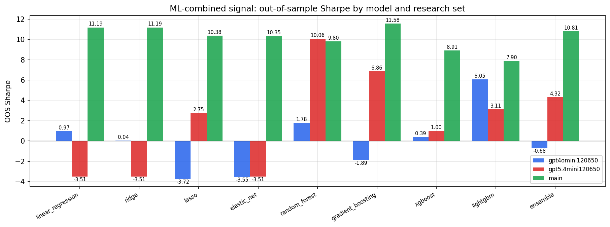

*ML-combined OOS Sharpe by model and research set*

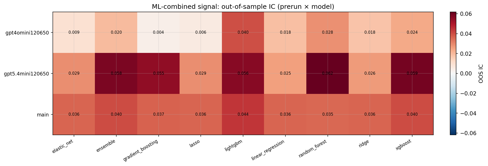

*ML-combined OOS IC (prerun × model)*

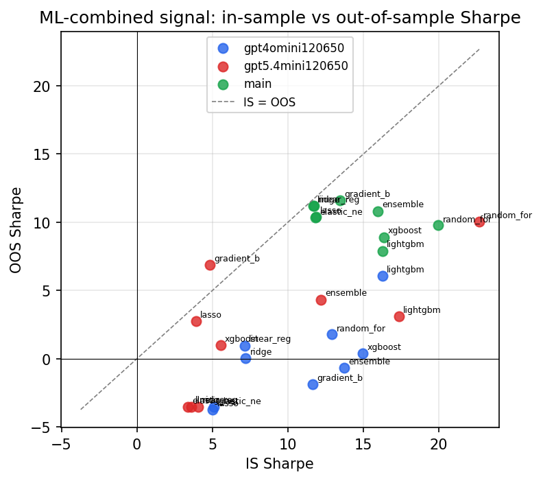

*IS vs OOS Sharpe (overfitting diagnostic)*

---
*Generated by `run_model_comparison.py`. Tables: `*.csv`; interactive: `comparison.ipynb`.*
