# Research-LLM factor comparison — `2024-12`

Comparing the **factor output of different research LLMs** on three axes (raw factor quality → factors as ML features → factors through the full agentic fund). The panel, IS/OOS split, horizon and model hyper-parameters are held identical across preruns — the *only* variable is the factor set.

## Preruns compared

| prerun | research_model | usable_factors | dropped_factors |
| --- | --- | --- | --- |
| gpt4omini120650 | gpt-4o-mini | 66 | 0 |
| gpt5.4mini120650 | gpt-5.4-mini | 68 | 1 |
| main | seed library | 78 | 10 |

> Dropped factors declare fields the current data doesn't have yet (e.g. fundamentals); they light up unchanged once that data is downloaded.

*Usable vs awaiting-data factors per research model*

## Key findings

- **Best ML-combined OOS Sharpe:** `main` with `linear_regression` (OOS Sharpe = 14.238).
- **Mean OOS Sharpe across models, by research set:** `main` = 11.948, `gpt4omini120650` = 6.115, `gpt5.4mini120650` = 4.990.
- **Highest mean single-factor |IC| (h=6):** `main` (mean |IC| = 0.0394).
- **Most diverse zoo (highest effective/raw factor ratio):** `gpt5.4mini120650` (eff 54.7 of 68, ratio 0.80).
- **Best selection-deflated single-factor |IC|:** `gpt4omini120650` (deflated |IC| = 0.3667 from 63 factors tried).

## 1. Single-factor IC (raw factor quality)

Per-underlying time-series Spearman rank-IC of every researched factor, recomputed on the shared panel at horizons h=1, h=6, h=60. The per-underlying IC correlates each factor's value vector with the underlying's own forward-return vector (pooled across underlyings); the cross-sectional IC ranks across underlyings per timestamp.

| prerun | n_factors | mean_abs_ic_1 | mean_abs_ic_6 | mean_abs_ic_60 | mean_abs_icir_6 | best_factor_h6 | best_abs_ic_h6 |
| --- | --- | --- | --- | --- | --- | --- | --- |
| gpt4omini120650 | 66 | 0.0152 | 0.0132 | 0.0175 | 0.2503 | effective_spread_reversal_strength | 0.3742 |
| gpt5.4mini120650 | 68 | 0.0092 | 0.0086 | 0.013 | 0.4312 | auction_dislocation_mean_reversion | 0.0552 |
| main | 78 | 0.0415 | 0.0394 | 0.0436 | 0.9738 | alpha_058 | 0.1906 |

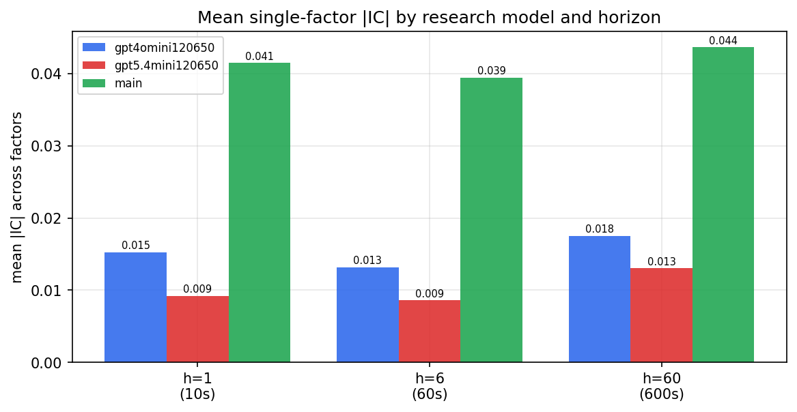

*Mean |IC| by research model and horizon*

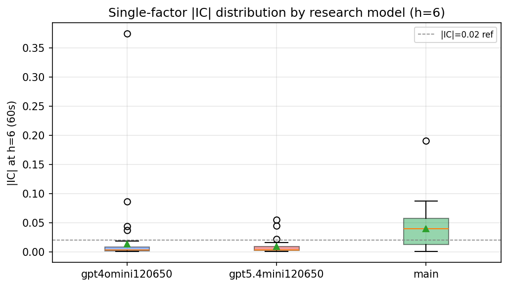

*Per-factor |IC| distribution by research model*

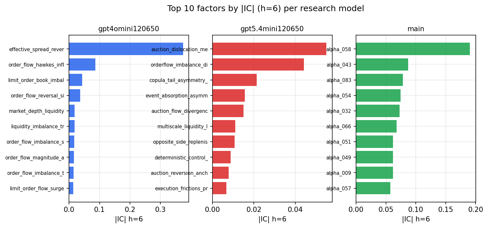

*Top factors by |IC| per research model*

## 2. Factor diversity & redundancy

Pairwise correlation of each zoo's *signals*. `eff_n_factors` is the effective number of independent factors (participation ratio of the correlation eigenvalues); `eff_ratio` and `redundancy` summarise how much unique information the zoo holds vs. how much is duplicated; `n_clusters` groups factors at |corr| ≥ 0.7.

| prerun | n_factors | eff_n_factors | eff_ratio | mean_abs_corr | n_clusters | redundancy |
| --- | --- | --- | --- | --- | --- | --- |
| gpt4omini120650 | 66 | 29.9327 | 0.4535 | 0.0482 | 52 | 0.5465 |
| gpt5.4mini120650 | 68 | 54.6868 | 0.8042 | 0.0091 | 63 | 0.1958 |
| main | 78 | 39.4899 | 0.5063 | 0.0383 | 63 | 0.4937 |

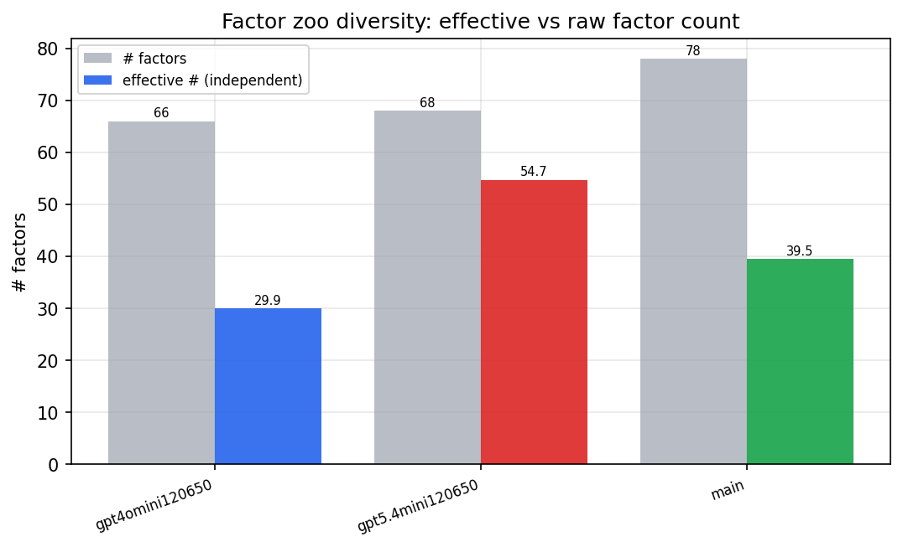

*Effective vs raw factor count per research model*

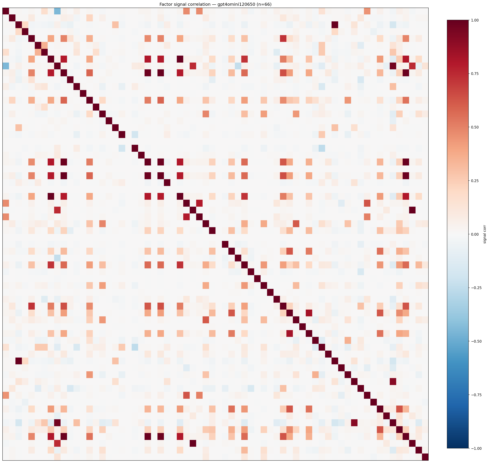

*Signal correlation matrix — gpt4omini120650*

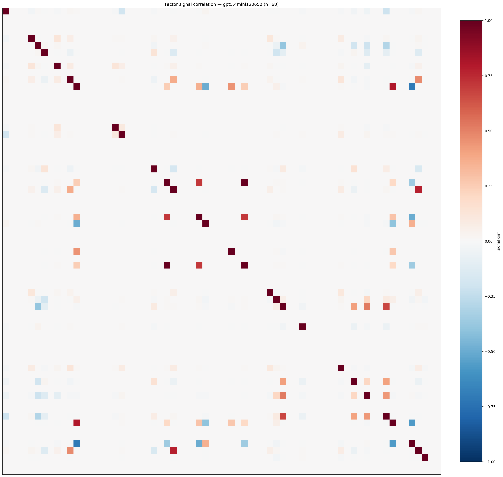

*Signal correlation matrix — gpt5.4mini120650*

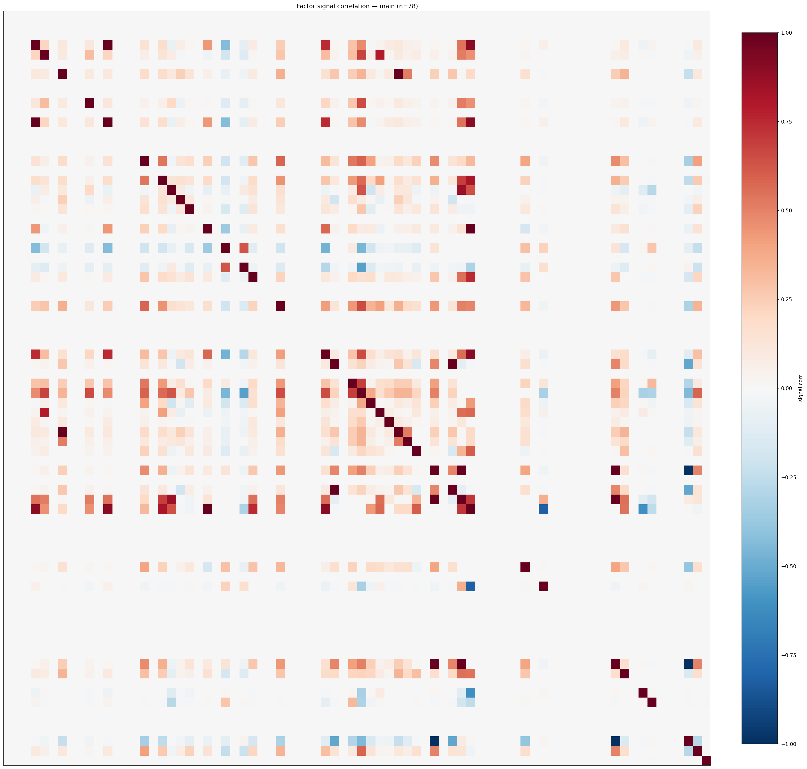

*Signal correlation matrix — main*

## 3. Deflation & model-based importance

`deflated_best_ic` haircuts each zoo's best |IC| for the number of factors tried (`ic_n_tested`) — a bigger zoo's best factor is more likely to be lucky. `lasso_n_nonzero` / `lasso_sparsity` show how many factors a sparse linear model actually keeps (model-view redundancy).

| prerun | best_ic | deflated_best_ic | deflated_best_t | ic_n_tested | ic_n_obs | lasso_n_nonzero | lasso_sparsity |
| --- | --- | --- | --- | --- | --- | --- | --- |
| gpt4omini120650 | 0.3742 | 0.3667 | 140.8995 | 63 | 147599 | 61 | 0.0758 |
| gpt5.4mini120650 | 0.0552 | 0.0484 | 18.6128 | 28 | 147599 | 0 | 1.0 |
| main | 0.1906 | 0.1836 | 70.518 | 38 | 147599 | 10 | 0.8718 |

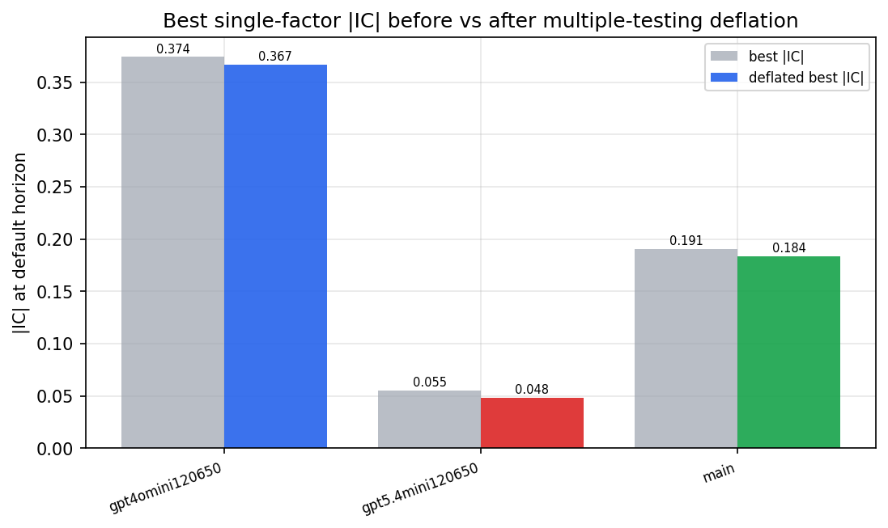

*Best |IC| before vs after multiple-testing deflation*

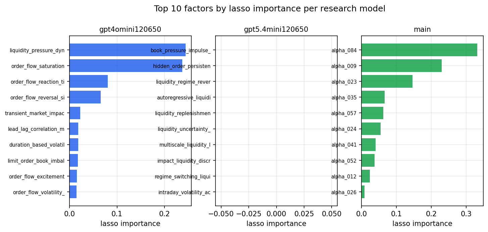

*Top factors by lasso importance per zoo*

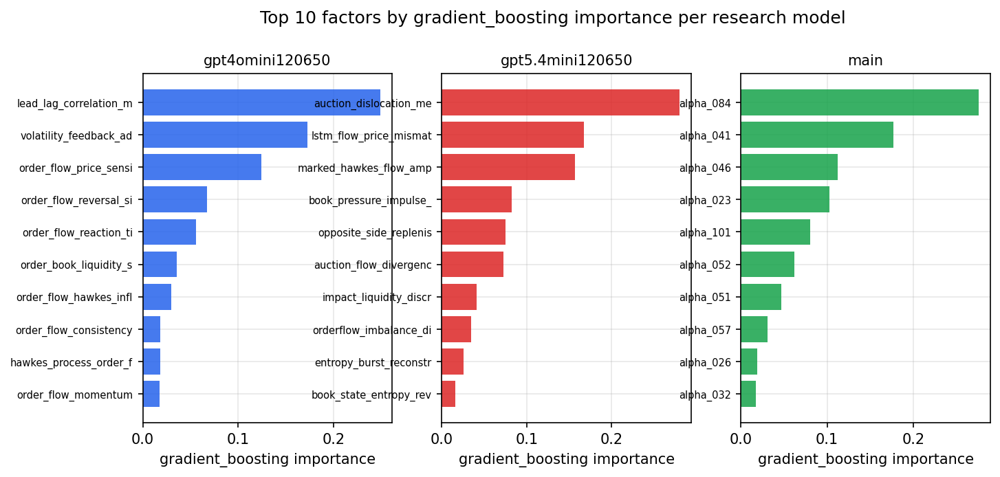

*Top factors by gradient_boosting importance per zoo*

## 4. ML-combined signal — per-underlying vectorised backtest

Each model combines a prerun's factors into ONE signal (fit `factors → forward return` on IS, predict per (bar, underlying)), then that combined signal is run through a simple vectorised backtest — `position(signal) × the underlying's own forward return` — on the held-out OOS tail (+ an equal-weight ensemble). No cross-sectional ranking.

> Config: position=**threshold** (t=1.0, z-score `expanding`), aggregation=**portfolio**, fit-standardise=**per_underlying**, horizon=6.

| prerun | model | n_factors_used | oos_ic | oos_sharpe | is_sharpe | oos_ann_return | oos_max_drawdown |
| --- | --- | --- | --- | --- | --- | --- | --- |
| gpt4omini120650 | linear_regression | 66 | 0.0357 | 5.9329 | 7.1745 | 0.1814 | -0.0072 |
| gpt4omini120650 | ridge | 66 | 0.0375 | 6.5518 | 6.5297 | 0.213 | -0.0062 |
| gpt4omini120650 | lasso | 66 | 0.0468 | 9.3634 | 7.5112 | 0.2507 | -0.0061 |
| gpt4omini120650 | elastic_net | 66 | 0.0465 | 9.6699 | 7.2911 | 0.2728 | -0.006 |
| gpt4omini120650 | random_forest | 66 | 0.0357 | 3.8066 | 13.8778 | 0.215 | -0.0107 |
| gpt4omini120650 | gradient_boosting | 66 | 0.0149 | 4.0941 | 9.3213 | 0.1925 | -0.0072 |
| gpt4omini120650 | xgboost | 66 | 0.0356 | 8.8294 | 12.8648 | 0.5069 | -0.005 |
| gpt4omini120650 | lightgbm | 66 | 0.0317 | -0.0988 | 15.8453 | -0.0075 | -0.0192 |
| gpt4omini120650 | ensemble | 66 | 0.0497 | 6.8869 | 14.955 | 0.3468 | -0.0059 |
| gpt5.4mini120650 | linear_regression | 68 | 0.0691 | 5.459 | 9.9726 | 0.5075 | -0.013 |
| gpt5.4mini120650 | ridge | 68 | 0.07 | 5.6297 | 10.0648 | 0.5333 | -0.0124 |
| gpt5.4mini120650 | lasso | 68 | 0.0699 | 5.8468 | 9.3388 | 0.6023 | -0.013 |
| gpt5.4mini120650 | elastic_net | 68 | 0.0702 | 5.7961 | 10.1211 | 0.5973 | -0.0131 |
| gpt5.4mini120650 | random_forest | 68 | 0.0741 | 8.1574 | 20.2918 | 0.5645 | -0.0234 |
| gpt5.4mini120650 | gradient_boosting | 68 | 0.07 | -0.8882 | 10.9653 | -0.0456 | -0.0143 |
| gpt5.4mini120650 | xgboost | 68 | 0.0719 | 6.3088 | 14.3144 | 0.2826 | -0.0167 |
| gpt5.4mini120650 | lightgbm | 68 | 0.0638 | 1.8048 | 15.9015 | 0.1097 | -0.0121 |
| gpt5.4mini120650 | ensemble | 68 | 0.0771 | 6.7938 | 17.7361 | 0.5881 | -0.0215 |
| main | linear_regression | 78 | 0.0469 | 14.2379 | 16.1231 | 0.8779 | -0.0059 |
| main | ridge | 78 | 0.047 | 14.1253 | 16.1171 | 0.8722 | -0.006 |
| main | lasso | 78 | 0.0424 | 13.2514 | 17.0558 | 0.8711 | -0.0072 |
| main | elastic_net | 78 | 0.0459 | 13.8907 | 17.2917 | 0.9135 | -0.0071 |
| main | random_forest | 78 | 0.0793 | 13.4073 | 15.324 | 0.9097 | -0.0063 |
| main | gradient_boosting | 78 | 0.0745 | 9.5111 | 14.808 | 0.5277 | -0.0044 |
| main | xgboost | 78 | 0.0783 | 9.2683 | 16.8 | 0.538 | -0.0055 |
| main | lightgbm | 78 | 0.0804 | 7.3433 | 18.1942 | 0.4629 | -0.0052 |
| main | ensemble | 78 | 0.0576 | 12.4998 | 17.0851 | 0.8114 | -0.0065 |

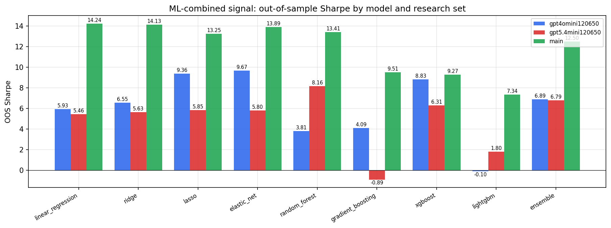

*ML-combined OOS Sharpe by model and research set*

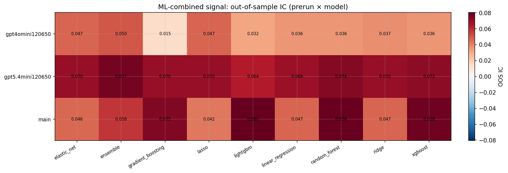

*ML-combined OOS IC (prerun × model)*

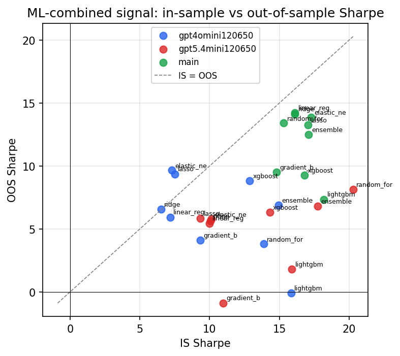

*IS vs OOS Sharpe (overfitting diagnostic)*

---
*Generated by `run_model_comparison.py`. Tables: `*.csv`; interactive: `comparison.ipynb`.*
