# Research-LLM factor comparison — `2025-01`

Comparing the **factor output of different research LLMs** on three axes (raw factor quality → factors as ML features → factors through the full agentic fund). The panel, IS/OOS split, horizon and model hyper-parameters are held identical across preruns — the *only* variable is the factor set.

## Preruns compared

| prerun | research_model | usable_factors | dropped_factors |
| --- | --- | --- | --- |
| gpt4omini120650 | gpt-4o-mini | 66 | 0 |
| gpt5.4mini120650 | gpt-5.4-mini | 68 | 1 |
| main | seed library | 78 | 10 |

> Dropped factors declare fields the current data doesn't have yet (e.g. fundamentals); they light up unchanged once that data is downloaded.

*Usable vs awaiting-data factors per research model*

## Key findings

- **Best ML-combined OOS Sharpe:** `gpt4omini120650` with `lasso` (OOS Sharpe = 15.868).
- **Mean OOS Sharpe across models, by research set:** `main` = 10.283, `gpt4omini120650` = 7.967, `gpt5.4mini120650` = 5.510.
- **Highest mean single-factor |IC| (h=6):** `main` (mean |IC| = 0.0493).
- **Most diverse zoo (highest effective/raw factor ratio):** `gpt5.4mini120650` (eff 54.2 of 68, ratio 0.80).
- **Best selection-deflated single-factor |IC|:** `gpt4omini120650` (deflated |IC| = 0.2769 from 63 factors tried).

## 1. Single-factor IC (raw factor quality)

Per-underlying time-series Spearman rank-IC of every researched factor, recomputed on the shared panel at horizons h=1, h=6, h=60. The per-underlying IC correlates each factor's value vector with the underlying's own forward-return vector (pooled across underlyings); the cross-sectional IC ranks across underlyings per timestamp.

| prerun | n_factors | mean_abs_ic_1 | mean_abs_ic_6 | mean_abs_ic_60 | mean_abs_icir_6 | best_factor_h6 | best_abs_ic_h6 |
| --- | --- | --- | --- | --- | --- | --- | --- |
| gpt4omini120650 | 66 | 0.0194 | 0.0175 | 0.0151 | 0.3673 | effective_spread_reversal_strength | 0.2846 |
| gpt5.4mini120650 | 68 | 0.0151 | 0.0128 | 0.0117 | 0.479 | auction_dislocation_mean_reversion | 0.0732 |
| main | 78 | 0.0511 | 0.0493 | 0.0367 | 1.1028 | alpha_058 | 0.2305 |

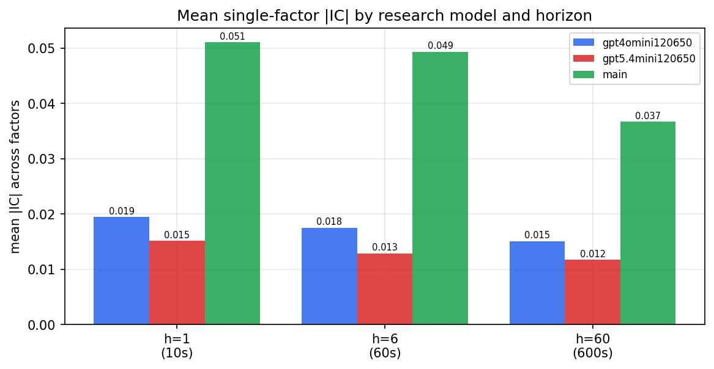

*Mean |IC| by research model and horizon*

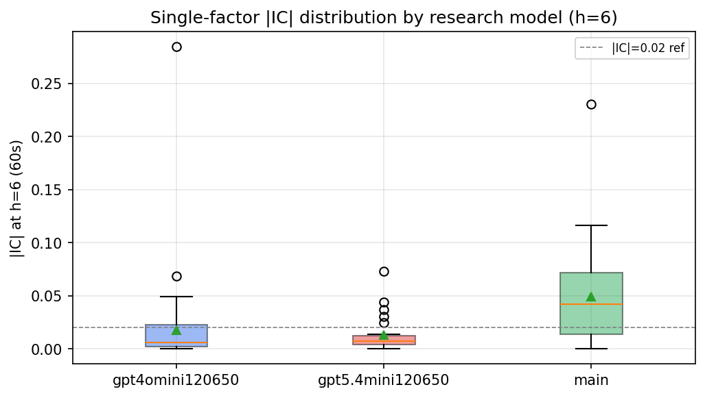

*Per-factor |IC| distribution by research model*

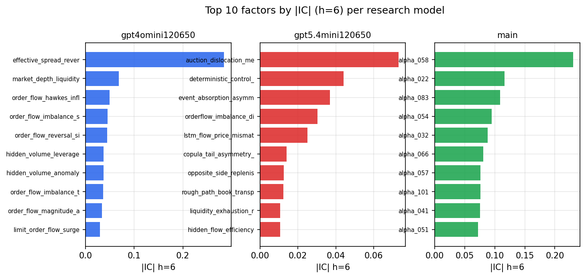

*Top factors by |IC| per research model*

## 2. Factor diversity & redundancy

Pairwise correlation of each zoo's *signals*. `eff_n_factors` is the effective number of independent factors (participation ratio of the correlation eigenvalues); `eff_ratio` and `redundancy` summarise how much unique information the zoo holds vs. how much is duplicated; `n_clusters` groups factors at |corr| ≥ 0.7.

| prerun | n_factors | eff_n_factors | eff_ratio | mean_abs_corr | n_clusters | redundancy |
| --- | --- | --- | --- | --- | --- | --- |
| gpt4omini120650 | 66 | 25.1996 | 0.3818 | 0.0662 | 24 | 0.6182 |
| gpt5.4mini120650 | 68 | 54.2142 | 0.7973 | 0.0096 | 64 | 0.2027 |
| main | 78 | 40.2576 | 0.5161 | 0.0369 | 64 | 0.4839 |

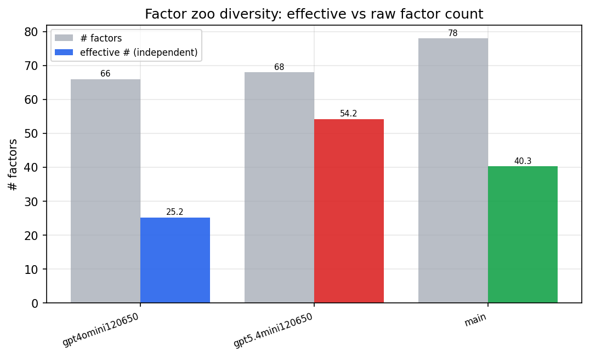

*Effective vs raw factor count per research model*

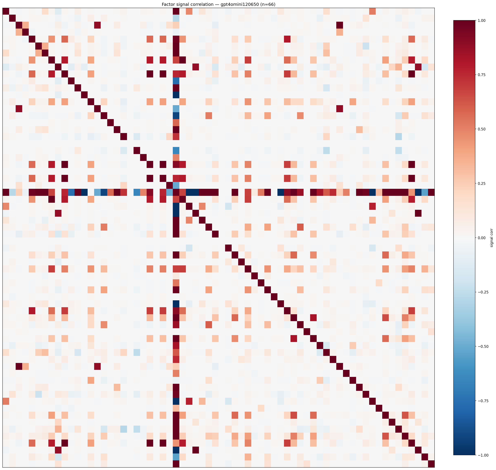

*Signal correlation matrix — gpt4omini120650*

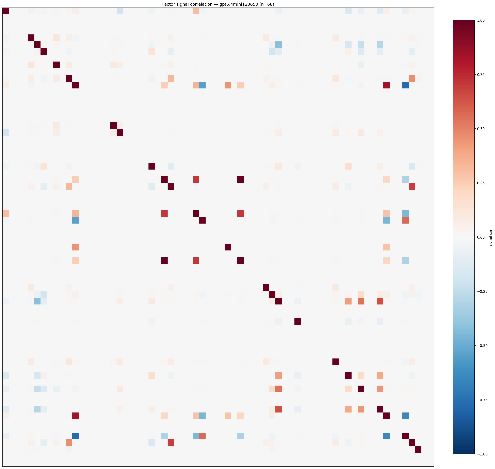

*Signal correlation matrix — gpt5.4mini120650*

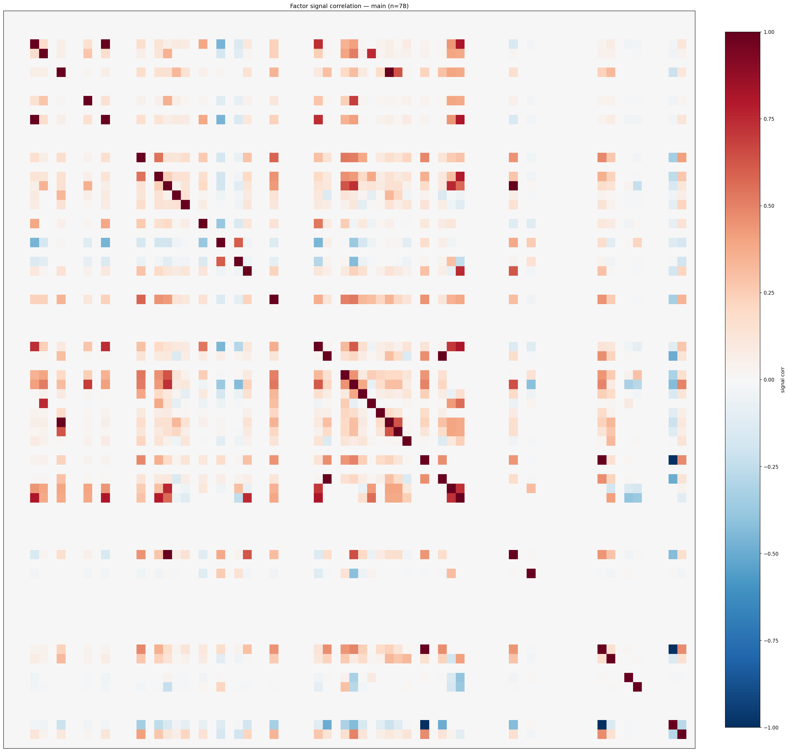

*Signal correlation matrix — main*

## 3. Deflation & model-based importance

`deflated_best_ic` haircuts each zoo's best |IC| for the number of factors tried (`ic_n_tested`) — a bigger zoo's best factor is more likely to be lucky. `lasso_n_nonzero` / `lasso_sparsity` show how many factors a sparse linear model actually keeps (model-view redundancy).

| prerun | best_ic | deflated_best_ic | deflated_best_t | ic_n_tested | ic_n_obs | lasso_n_nonzero | lasso_sparsity |
| --- | --- | --- | --- | --- | --- | --- | --- |
| gpt4omini120650 | 0.2846 | 0.2769 | 103.8308 | 63 | 140579 | 11 | 0.8333 |
| gpt5.4mini120650 | 0.0732 | 0.0663 | 24.8664 | 28 | 140579 | 9 | 0.8676 |
| main | 0.2305 | 0.2233 | 83.7242 | 37 | 140579 | 12 | 0.8462 |

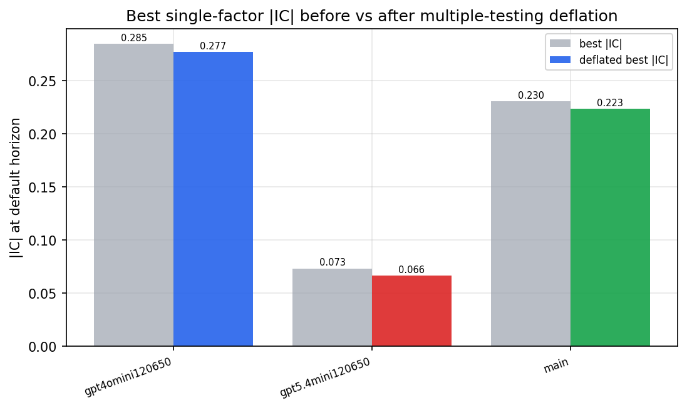

*Best |IC| before vs after multiple-testing deflation*

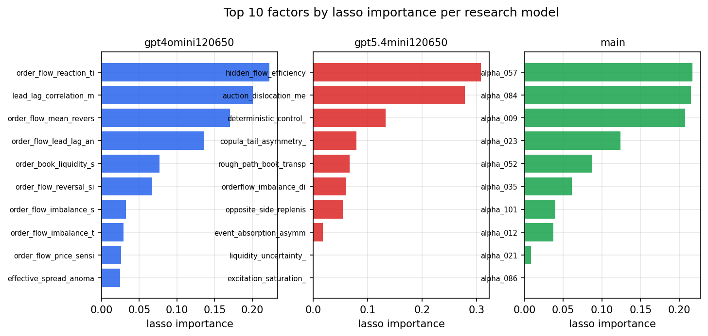

*Top factors by lasso importance per zoo*

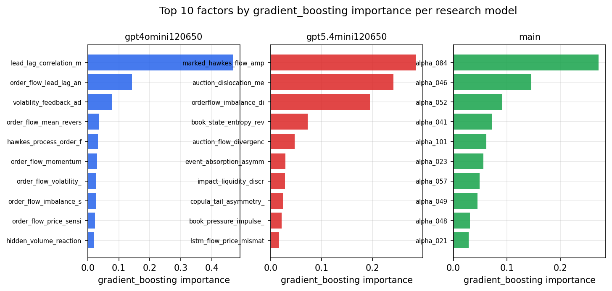

*Top factors by gradient_boosting importance per zoo*

## 4. ML-combined signal — per-underlying vectorised backtest

Each model combines a prerun's factors into ONE signal (fit `factors → forward return` on IS, predict per (bar, underlying)), then that combined signal is run through a simple vectorised backtest — `position(signal) × the underlying's own forward return` — on the held-out OOS tail (+ an equal-weight ensemble). No cross-sectional ranking.

> Config: position=**threshold** (t=1.0, z-score `expanding`), aggregation=**portfolio**, fit-standardise=**per_underlying**, horizon=6.

| prerun | model | n_factors_used | oos_ic | oos_sharpe | is_sharpe | oos_ann_return | oos_max_drawdown |
| --- | --- | --- | --- | --- | --- | --- | --- |
| gpt4omini120650 | linear_regression | 66 | 0.0416 | 8.7142 | 13.3089 | 0.8458 | -0.0087 |
| gpt4omini120650 | ridge | 66 | 0.0445 | 7.8656 | 12.5186 | 0.7252 | -0.0096 |
| gpt4omini120650 | lasso | 66 | 0.0589 | 15.8684 | 11.8807 | 1.361 | -0.0071 |
| gpt4omini120650 | elastic_net | 66 | 0.0579 | 15.6027 | 11.5951 | 1.3337 | -0.0072 |
| gpt4omini120650 | random_forest | 66 | 0.0363 | 3.2385 | 10.3243 | 0.5716 | -0.0237 |
| gpt4omini120650 | gradient_boosting | 66 | 0.0294 | 0.5735 | 11.4886 | 0.0469 | -0.0131 |
| gpt4omini120650 | xgboost | 66 | 0.0357 | 8.0925 | 11.9025 | 0.8195 | -0.0101 |
| gpt4omini120650 | lightgbm | 66 | 0.0339 | 4.2121 | 15.0557 | 0.4318 | -0.0127 |
| gpt4omini120650 | ensemble | 66 | 0.0538 | 7.5375 | 15.9284 | 0.9729 | -0.0185 |
| gpt5.4mini120650 | linear_regression | 68 | 0.0736 | 4.2981 | 6.9909 | 0.3606 | -0.0085 |
| gpt5.4mini120650 | ridge | 68 | 0.0749 | 4.45 | 6.9705 | 0.3333 | -0.0072 |
| gpt5.4mini120650 | lasso | 68 | 0.0808 | 4.0569 | 5.4221 | 0.2805 | -0.0069 |
| gpt5.4mini120650 | elastic_net | 68 | 0.0786 | 4.2862 | 5.8577 | 0.3036 | -0.0071 |
| gpt5.4mini120650 | random_forest | 68 | 0.0919 | 14.6346 | 18.694 | 1.6883 | -0.0119 |
| gpt5.4mini120650 | gradient_boosting | 68 | 0.0874 | 1.8279 | 7.933 | 0.1223 | -0.0128 |
| gpt5.4mini120650 | xgboost | 68 | 0.0831 | 4.8255 | 10.0339 | 0.3692 | -0.0114 |
| gpt5.4mini120650 | lightgbm | 68 | 0.0722 | 4.4598 | 16.9525 | 0.4268 | -0.0097 |
| gpt5.4mini120650 | ensemble | 68 | 0.091 | 6.7485 | 13.6665 | 0.6837 | -0.0092 |
| main | linear_regression | 78 | -0.0227 | 7.8399 | 12.1439 | 0.7618 | -0.0096 |
| main | ridge | 78 | 0.0488 | 11.5884 | 12.6355 | 1.0935 | -0.009 |
| main | lasso | 78 | 0.0342 | 9.5138 | 12.1709 | 0.9199 | -0.0089 |
| main | elastic_net | 78 | 0.0627 | 11.8376 | 12.5197 | 1.1861 | -0.0086 |
| main | random_forest | 78 | 0.106 | 14.1783 | 12.1348 | 1.5055 | -0.0069 |
| main | gradient_boosting | 78 | 0.0854 | 12.9272 | 11.4737 | 1.4738 | -0.0098 |
| main | xgboost | 78 | 0.101 | 6.712 | 12.2166 | 0.5315 | -0.0063 |
| main | lightgbm | 78 | 0.0911 | 5.4542 | 15.8532 | 0.5206 | -0.0084 |
| main | ensemble | 78 | 0.0732 | 12.4915 | 12.6438 | 1.1617 | -0.0063 |

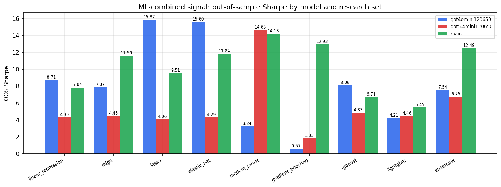

*ML-combined OOS Sharpe by model and research set*

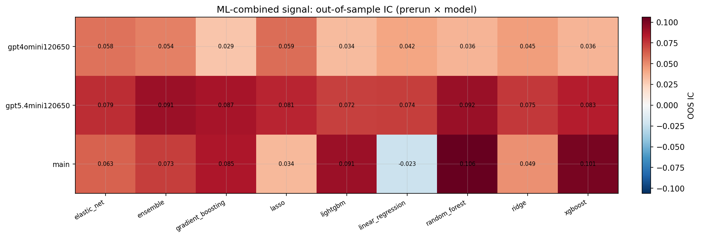

*ML-combined OOS IC (prerun × model)*

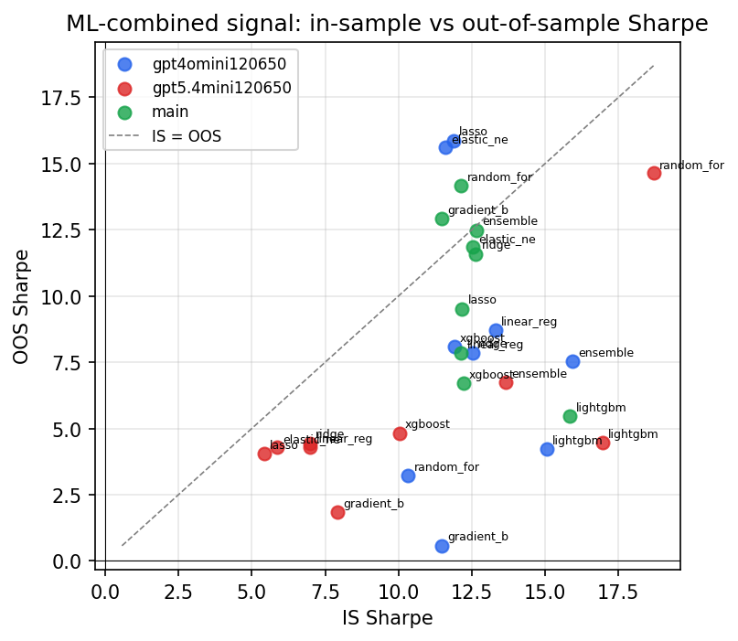

*IS vs OOS Sharpe (overfitting diagnostic)*

---
*Generated by `run_model_comparison.py`. Tables: `*.csv`; interactive: `comparison.ipynb`.*
