# Research-LLM factor comparison — `2025-02`

Comparing the **factor output of different research LLMs** on three axes (raw factor quality → factors as ML features → factors through the full agentic fund). The panel, IS/OOS split, horizon and model hyper-parameters are held identical across preruns — the *only* variable is the factor set.

## Preruns compared

| prerun | research_model | usable_factors | dropped_factors |
| --- | --- | --- | --- |
| gpt4omini120650 | gpt-4o-mini | 66 | 0 |
| gpt5.4mini120650 | gpt-5.4-mini | 68 | 1 |
| main | seed library | 78 | 10 |

> Dropped factors declare fields the current data doesn't have yet (e.g. fundamentals); they light up unchanged once that data is downloaded.

*Usable vs awaiting-data factors per research model*

## Key findings

- **Best ML-combined OOS Sharpe:** `gpt5.4mini120650` with `ensemble` (OOS Sharpe = 13.970).
- **Mean OOS Sharpe across models, by research set:** `gpt5.4mini120650` = 9.338, `main` = 9.249, `gpt4omini120650` = 4.478.
- **Highest mean single-factor |IC| (h=6):** `main` (mean |IC| = 0.0462).
- **Most diverse zoo (highest effective/raw factor ratio):** `gpt5.4mini120650` (eff 54.0 of 68, ratio 0.79).
- **Best selection-deflated single-factor |IC|:** `main` (deflated |IC| = 0.1092 from 37 factors tried).

## 1. Single-factor IC (raw factor quality)

Per-underlying time-series Spearman rank-IC of every researched factor, recomputed on the shared panel at horizons h=1, h=6, h=60. The per-underlying IC correlates each factor's value vector with the underlying's own forward-return vector (pooled across underlyings); the cross-sectional IC ranks across underlyings per timestamp.

| prerun | n_factors | mean_abs_ic_1 | mean_abs_ic_6 | mean_abs_ic_60 | mean_abs_icir_6 | best_factor_h6 | best_abs_ic_h6 |
| --- | --- | --- | --- | --- | --- | --- | --- |
| gpt4omini120650 | 66 | 0.0185 | 0.0121 | 0.0105 | 0.4061 | effective_spread_reversal_strength | 0.0517 |
| gpt5.4mini120650 | 68 | 0.0138 | 0.0104 | 0.0095 | 0.5476 | auction_dislocation_mean_reversion | 0.081 |
| main | 78 | 0.0482 | 0.0462 | 0.0327 | 1.1985 | alpha_066 | 0.1164 |

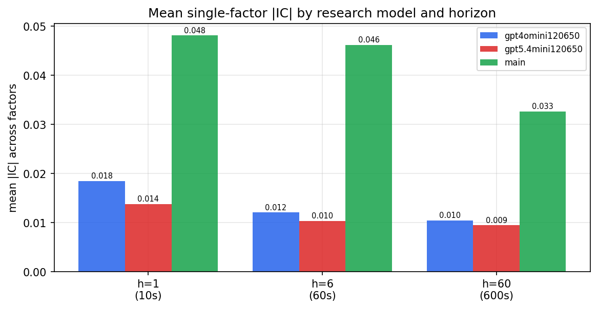

*Mean |IC| by research model and horizon*

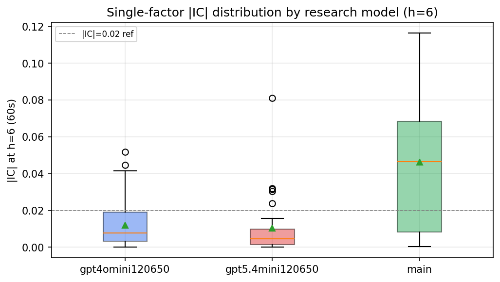

*Per-factor |IC| distribution by research model*

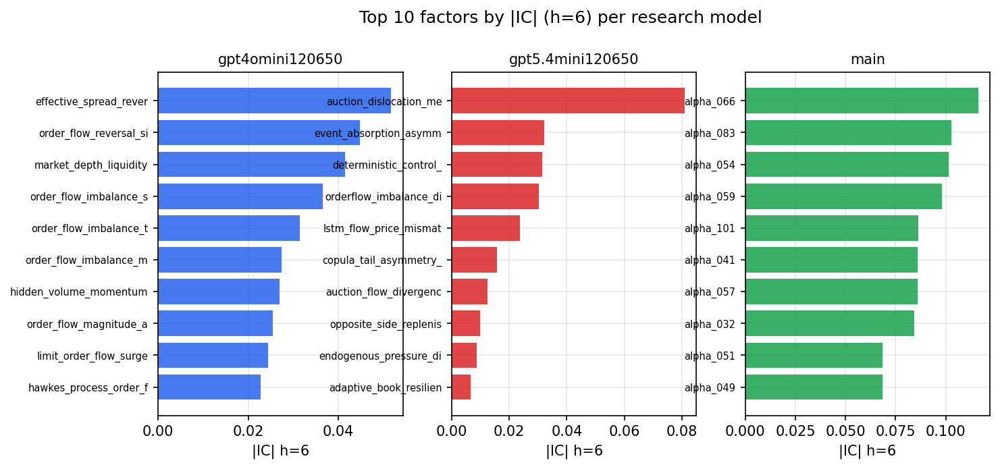

*Top factors by |IC| per research model*

## 2. Factor diversity & redundancy

Pairwise correlation of each zoo's *signals*. `eff_n_factors` is the effective number of independent factors (participation ratio of the correlation eigenvalues); `eff_ratio` and `redundancy` summarise how much unique information the zoo holds vs. how much is duplicated; `n_clusters` groups factors at |corr| ≥ 0.7.

| prerun | n_factors | eff_n_factors | eff_ratio | mean_abs_corr | n_clusters | redundancy |
| --- | --- | --- | --- | --- | --- | --- |
| gpt4omini120650 | 66 | 29.5178 | 0.4472 | 0.0535 | 51 | 0.5528 |
| gpt5.4mini120650 | 68 | 53.9555 | 0.7935 | 0.009 | 64 | 0.2065 |
| main | 78 | 42.9362 | 0.5505 | 0.033 | 67 | 0.4495 |

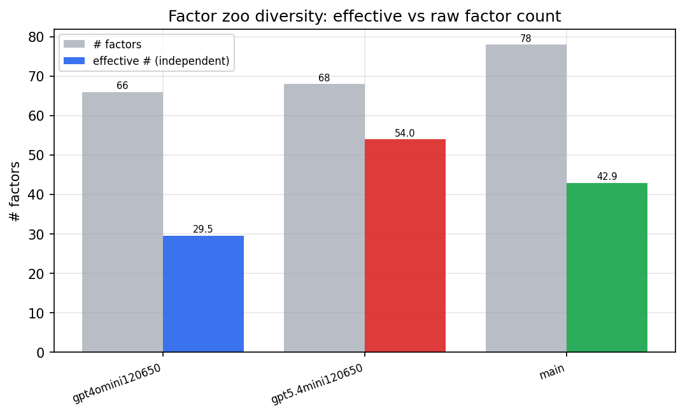

*Effective vs raw factor count per research model*

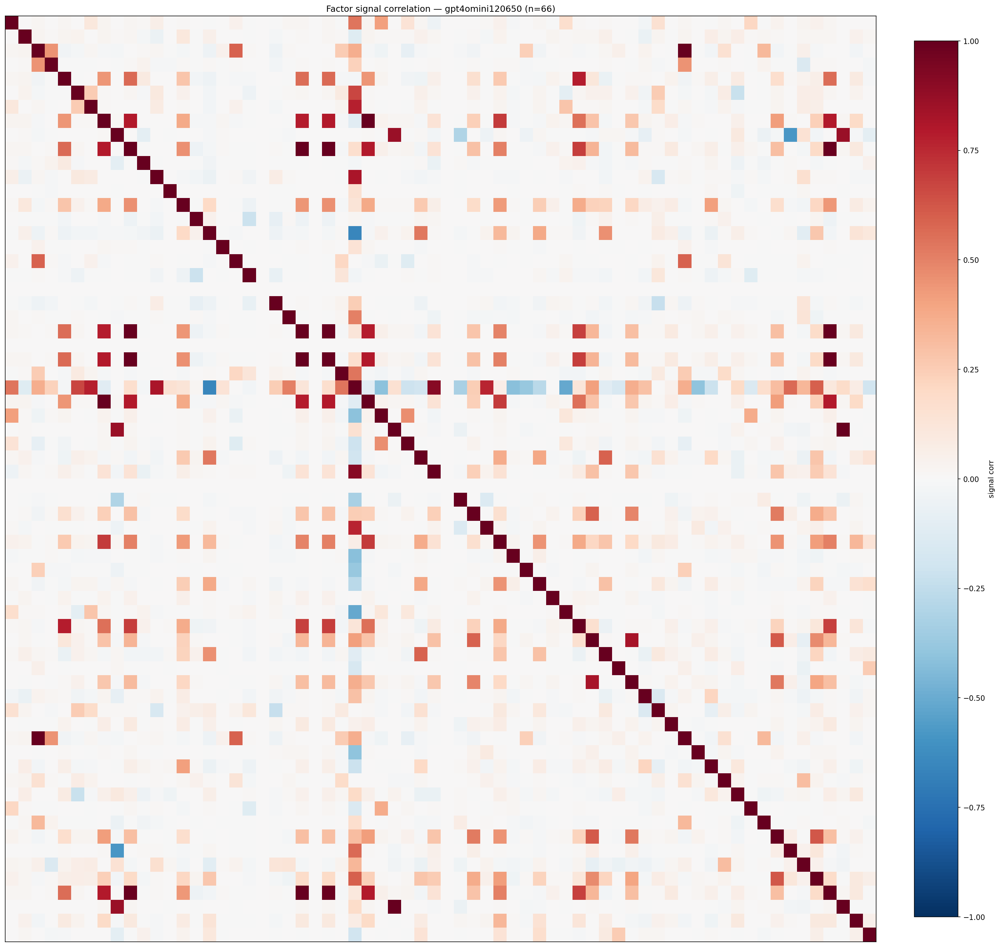

*Signal correlation matrix — gpt4omini120650*

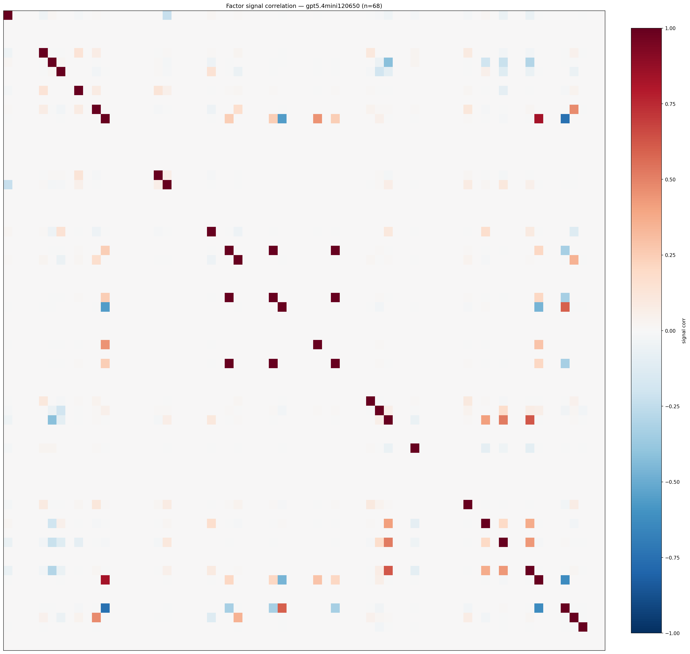

*Signal correlation matrix — gpt5.4mini120650*

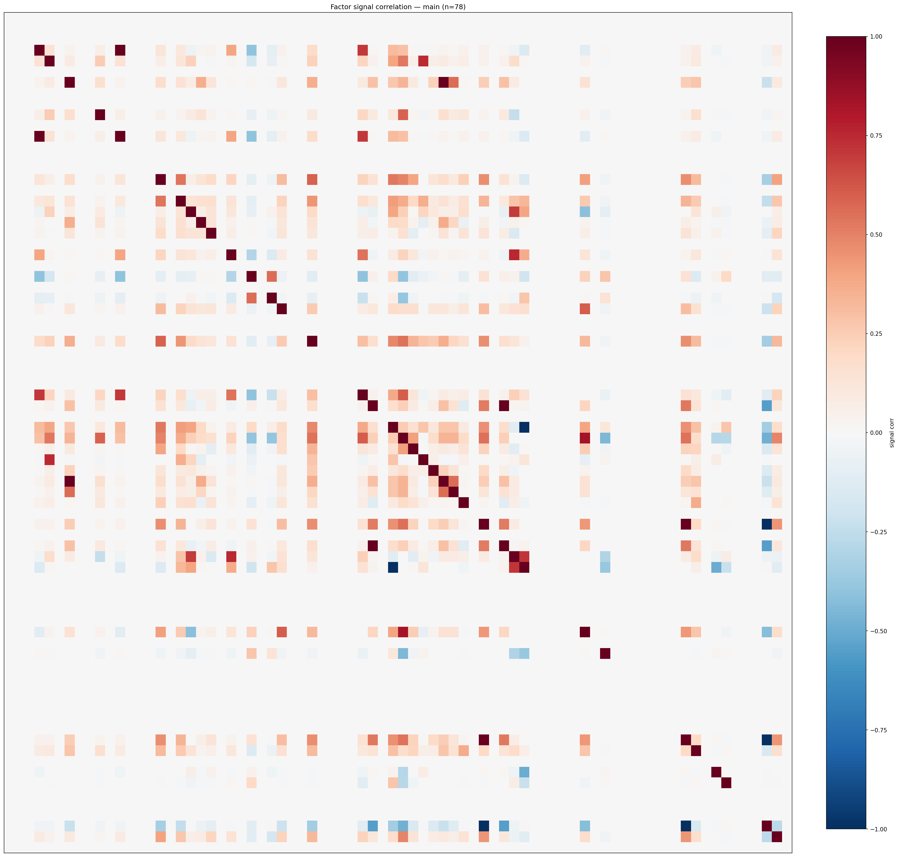

*Signal correlation matrix — main*

## 3. Deflation & model-based importance

`deflated_best_ic` haircuts each zoo's best |IC| for the number of factors tried (`ic_n_tested`) — a bigger zoo's best factor is more likely to be lucky. `lasso_n_nonzero` / `lasso_sparsity` show how many factors a sparse linear model actually keeps (model-view redundancy).

| prerun | best_ic | deflated_best_ic | deflated_best_t | ic_n_tested | ic_n_obs | lasso_n_nonzero | lasso_sparsity |
| --- | --- | --- | --- | --- | --- | --- | --- |
| gpt4omini120650 | 0.0517 | 0.044 | 16.4145 | 64 | 139319 | 0 | 1.0 |
| gpt5.4mini120650 | 0.081 | 0.0741 | 27.652 | 29 | 139319 | 0 | 1.0 |
| main | 0.1164 | 0.1092 | 40.7468 | 37 | 139319 | 35 | 0.5513 |

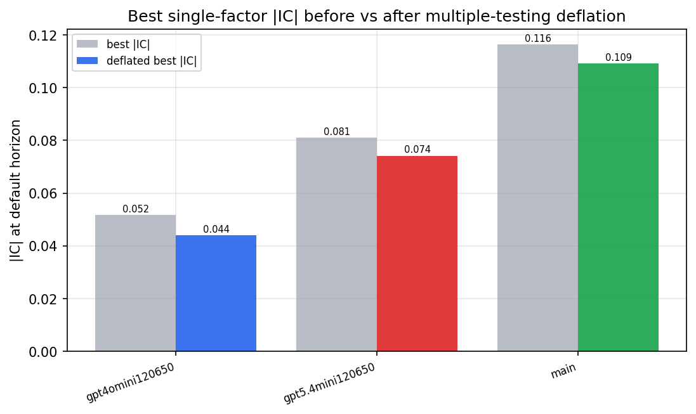

*Best |IC| before vs after multiple-testing deflation*

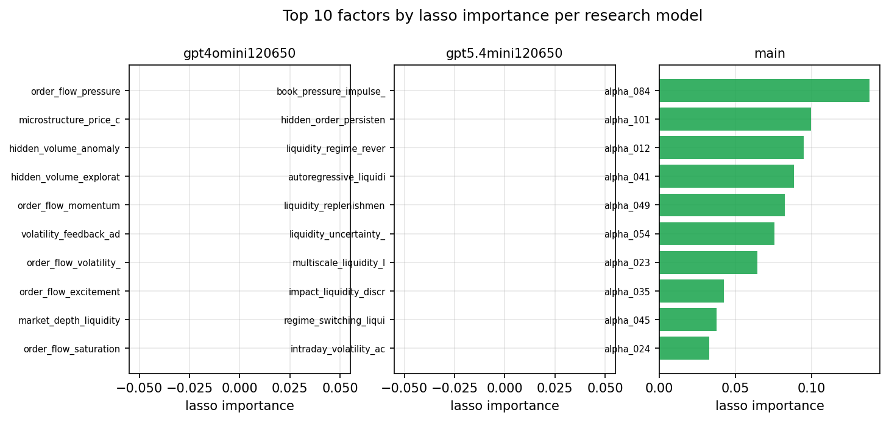

*Top factors by lasso importance per zoo*

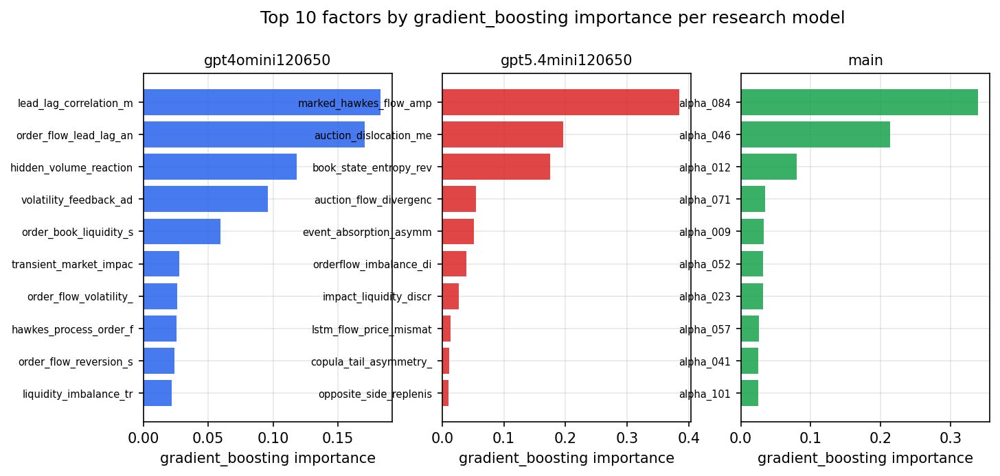

*Top factors by gradient_boosting importance per zoo*

## 4. ML-combined signal — per-underlying vectorised backtest

Each model combines a prerun's factors into ONE signal (fit `factors → forward return` on IS, predict per (bar, underlying)), then that combined signal is run through a simple vectorised backtest — `position(signal) × the underlying's own forward return` — on the held-out OOS tail (+ an equal-weight ensemble). No cross-sectional ranking.

> Config: position=**threshold** (t=1.0, z-score `expanding`), aggregation=**portfolio**, fit-standardise=**per_underlying**, horizon=6.

| prerun | model | n_factors_used | oos_ic | oos_sharpe | is_sharpe | oos_ann_return | oos_max_drawdown |
| --- | --- | --- | --- | --- | --- | --- | --- |
| gpt4omini120650 | linear_regression | 66 | 0.0079 | 2.7618 | 13.2691 | 0.1154 | -0.0072 |
| gpt4omini120650 | ridge | 66 | 0.0078 | 4.2565 | 13.4233 | 0.21 | -0.0057 |
| gpt4omini120650 | lasso | 66 | nan | nan | nan | nan | nan |
| gpt4omini120650 | elastic_net | 66 | nan | nan | nan | nan | nan |
| gpt4omini120650 | random_forest | 66 | 0.0235 | 7.2454 | 14.0266 | 0.6062 | -0.011 |
| gpt4omini120650 | gradient_boosting | 66 | 0.0184 | 1.0113 | 11.1021 | 0.0609 | -0.008 |
| gpt4omini120650 | xgboost | 66 | 0.0281 | 5.7698 | 14.0525 | 0.3879 | -0.0081 |
| gpt4omini120650 | lightgbm | 66 | 0.0288 | 4.9636 | 17.747 | 0.3695 | -0.0076 |
| gpt4omini120650 | ensemble | 66 | 0.0208 | 5.3405 | 18.2446 | 0.4733 | -0.0096 |
| gpt5.4mini120650 | linear_regression | 68 | 0.0518 | 9.6914 | 15.7732 | 0.6341 | -0.01 |
| gpt5.4mini120650 | ridge | 68 | 0.0517 | 9.3887 | 16.6636 | 0.6266 | -0.0103 |
| gpt5.4mini120650 | lasso | 68 | 0.0537 | 7.8921 | 18.377 | 0.6543 | -0.0124 |
| gpt5.4mini120650 | elastic_net | 68 | 0.0532 | 8.3118 | 18.9653 | 0.6871 | -0.0117 |
| gpt5.4mini120650 | random_forest | 68 | 0.0752 | 11.4648 | 23.4038 | 0.775 | -0.0124 |
| gpt5.4mini120650 | gradient_boosting | 68 | 0.0692 | 0.8378 | 18.1125 | 0.0485 | -0.0099 |
| gpt5.4mini120650 | xgboost | 68 | 0.0732 | 13.0782 | 22.9802 | 0.8666 | -0.0043 |
| gpt5.4mini120650 | lightgbm | 68 | 0.0771 | 9.4092 | 21.8928 | 0.7295 | -0.0066 |
| gpt5.4mini120650 | ensemble | 68 | 0.0666 | 13.9698 | 29.2058 | 1.2433 | -0.0066 |
| main | linear_regression | 78 | 0.0575 | 10.6673 | 14.6843 | 0.7976 | -0.0153 |
| main | ridge | 78 | 0.0588 | 12.8339 | 15.0651 | 0.956 | -0.0151 |
| main | lasso | 78 | 0.0627 | 11.0543 | 14.9763 | 0.8699 | -0.0172 |
| main | elastic_net | 78 | 0.0645 | 10.4117 | 15.8351 | 0.8154 | -0.018 |
| main | random_forest | 78 | 0.0692 | 8.8784 | 16.075 | 0.8855 | -0.0109 |
| main | gradient_boosting | 78 | 0.0697 | 5.4426 | 12.2579 | 0.3193 | -0.012 |
| main | xgboost | 78 | 0.068 | 6.8736 | 14.6869 | 0.5764 | -0.0111 |
| main | lightgbm | 78 | 0.0688 | 4.9675 | 19.51 | 0.4003 | -0.0084 |
| main | ensemble | 78 | 0.0721 | 12.1148 | 17.3238 | 0.8079 | -0.0119 |

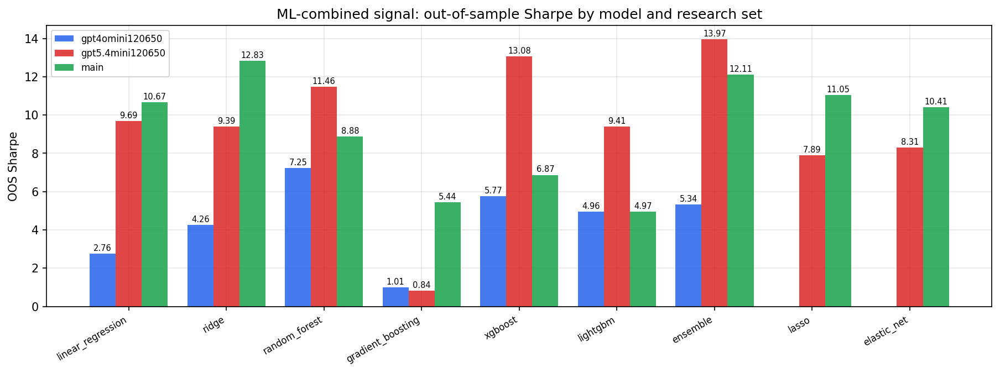

*ML-combined OOS Sharpe by model and research set*

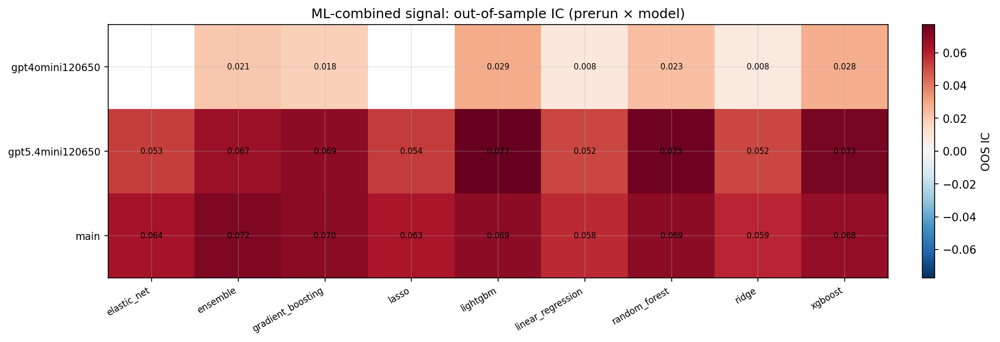

*ML-combined OOS IC (prerun × model)*

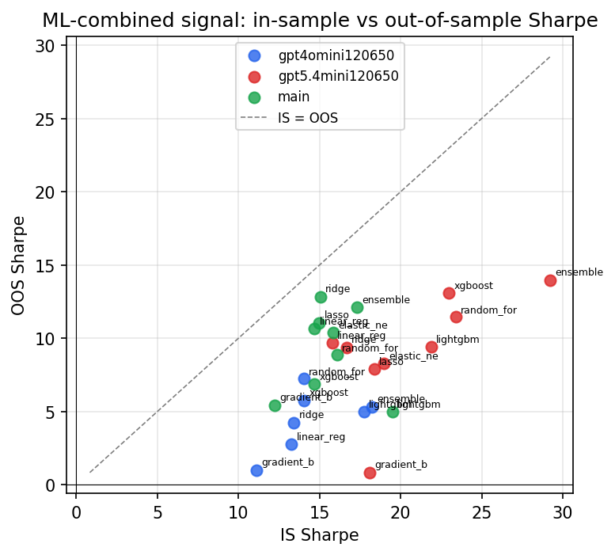

*IS vs OOS Sharpe (overfitting diagnostic)*

---
*Generated by `run_model_comparison.py`. Tables: `*.csv`; interactive: `comparison.ipynb`.*
