# Research-LLM factor comparison — `2025-04`

Comparing the **factor output of different research LLMs** on three axes (raw factor quality → factors as ML features → factors through the full agentic fund). The panel, IS/OOS split, horizon and model hyper-parameters are held identical across preruns — the *only* variable is the factor set.

## Preruns compared

| prerun | research_model | usable_factors | dropped_factors |
| --- | --- | --- | --- |
| gpt4omini120650 | gpt-4o-mini | 66 | 0 |
| gpt5.4mini120650 | gpt-5.4-mini | 68 | 1 |
| main | seed library | 78 | 10 |

> Dropped factors declare fields the current data doesn't have yet (e.g. fundamentals); they light up unchanged once that data is downloaded.

*Usable vs awaiting-data factors per research model*

## Key findings

- **Best ML-combined OOS Sharpe:** `gpt5.4mini120650` with `random_forest` (OOS Sharpe = 13.181).
- **Mean OOS Sharpe across models, by research set:** `main` = 7.702, `gpt5.4mini120650` = 7.667, `gpt4omini120650` = -0.729.
- **Highest mean single-factor |IC| (h=6):** `main` (mean |IC| = 0.0361).
- **Most diverse zoo (highest effective/raw factor ratio):** `gpt5.4mini120650` (eff 55.1 of 68, ratio 0.81).
- **Best selection-deflated single-factor |IC|:** `main` (deflated |IC| = 0.2500 from 38 factors tried).

## 1. Single-factor IC (raw factor quality)

Per-underlying time-series Spearman rank-IC of every researched factor, recomputed on the shared panel at horizons h=1, h=6, h=60. The per-underlying IC correlates each factor's value vector with the underlying's own forward-return vector (pooled across underlyings); the cross-sectional IC ranks across underlyings per timestamp.

| prerun | n_factors | mean_abs_ic_1 | mean_abs_ic_6 | mean_abs_ic_60 | mean_abs_icir_6 | best_factor_h6 | best_abs_ic_h6 |
| --- | --- | --- | --- | --- | --- | --- | --- |
| gpt4omini120650 | 66 | 0.0113 | 0.0102 | 0.0098 | 0.3295 | effective_spread_reversal_strength | 0.1542 |
| gpt5.4mini120650 | 68 | 0.0104 | 0.0076 | 0.0107 | 0.437 | auction_dislocation_mean_reversion | 0.0603 |
| main | 78 | 0.04 | 0.0361 | 0.0389 | 1.3491 | alpha_059 | 0.2571 |

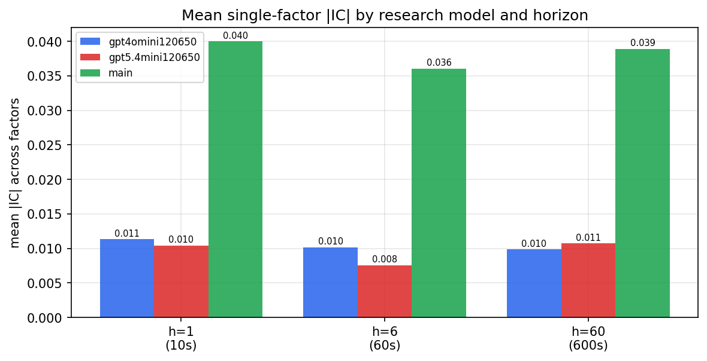

*Mean |IC| by research model and horizon*

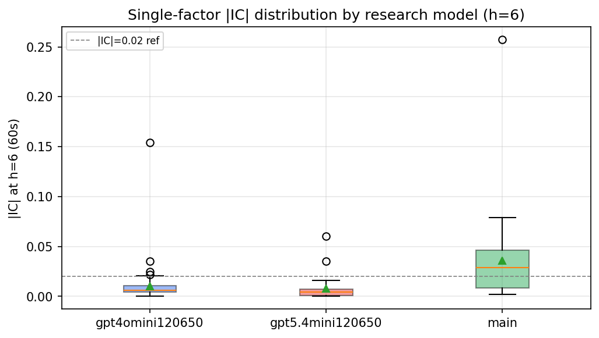

*Per-factor |IC| distribution by research model*

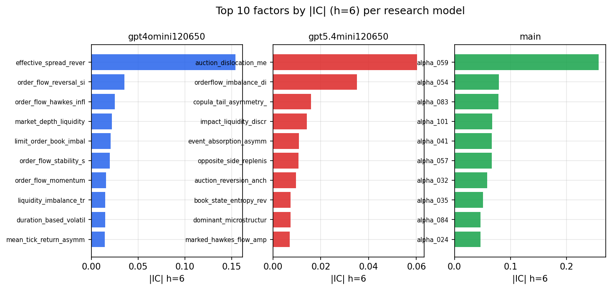

*Top factors by |IC| per research model*

## 2. Factor diversity & redundancy

Pairwise correlation of each zoo's *signals*. `eff_n_factors` is the effective number of independent factors (participation ratio of the correlation eigenvalues); `eff_ratio` and `redundancy` summarise how much unique information the zoo holds vs. how much is duplicated; `n_clusters` groups factors at |corr| ≥ 0.7.

| prerun | n_factors | eff_n_factors | eff_ratio | mean_abs_corr | n_clusters | redundancy |
| --- | --- | --- | --- | --- | --- | --- |
| gpt4omini120650 | 66 | 29.9719 | 0.4541 | 0.0517 | 53 | 0.5459 |
| gpt5.4mini120650 | 68 | 55.139 | 0.8109 | 0.0092 | 64 | 0.1891 |
| main | 78 | 43.6752 | 0.5599 | 0.0336 | 68 | 0.4401 |

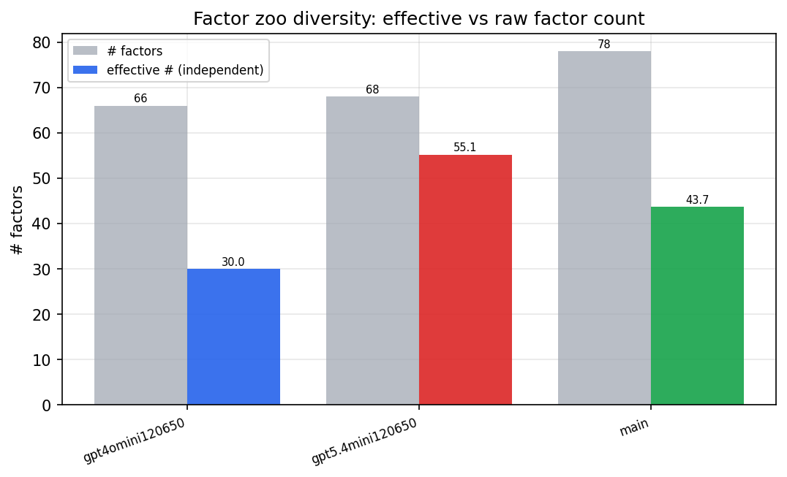

*Effective vs raw factor count per research model*

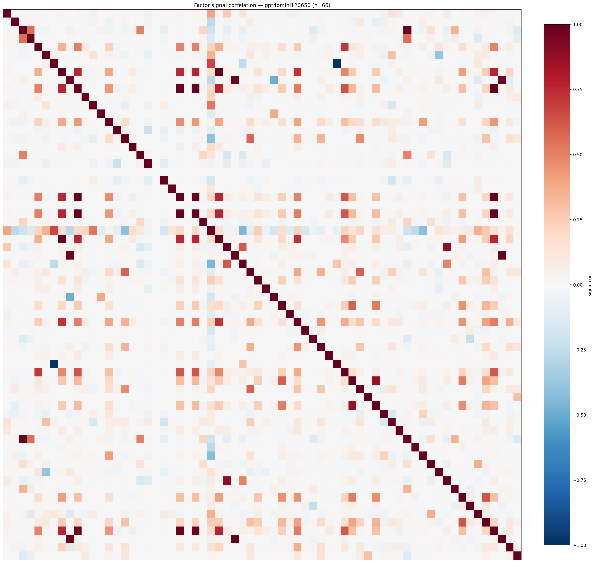

*Signal correlation matrix — gpt4omini120650*

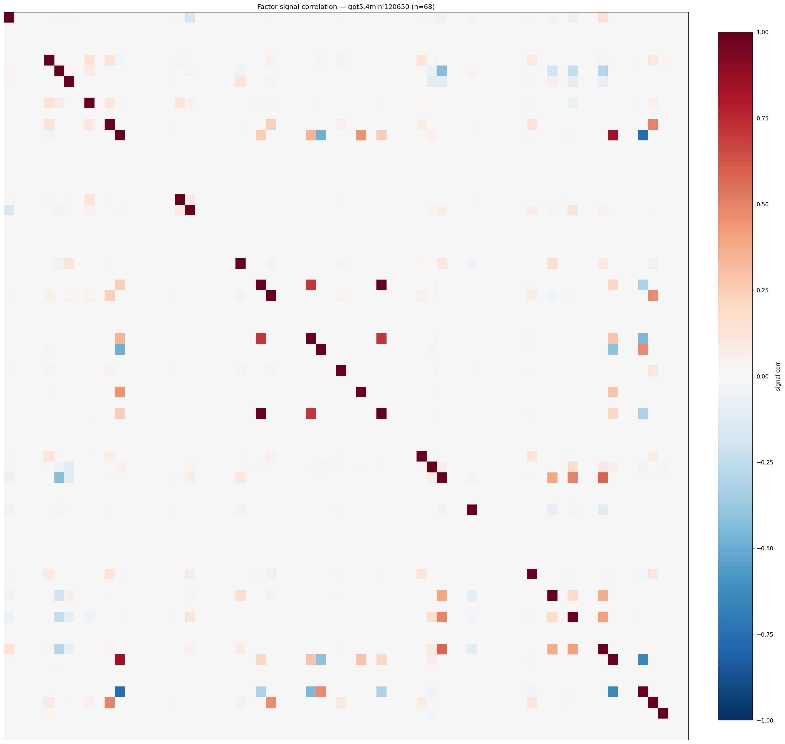

*Signal correlation matrix — gpt5.4mini120650*

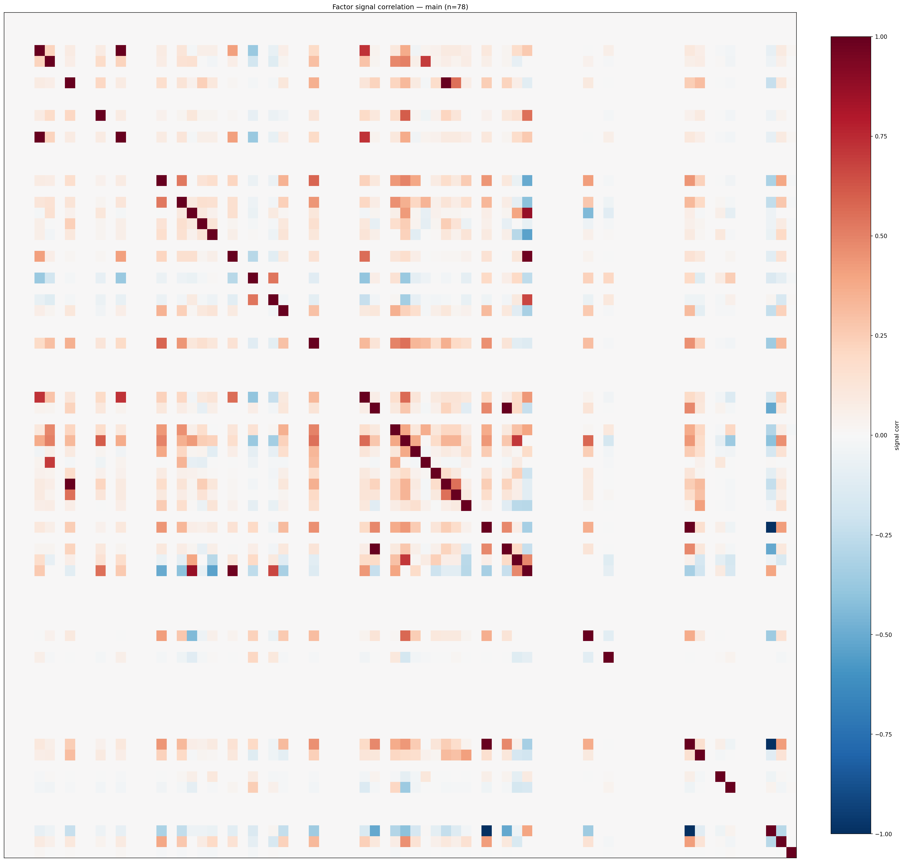

*Signal correlation matrix — main*

## 3. Deflation & model-based importance

`deflated_best_ic` haircuts each zoo's best |IC| for the number of factors tried (`ic_n_tested`) — a bigger zoo's best factor is more likely to be lucky. `lasso_n_nonzero` / `lasso_sparsity` show how many factors a sparse linear model actually keeps (model-view redundancy).

| prerun | best_ic | deflated_best_ic | deflated_best_t | ic_n_tested | ic_n_obs | lasso_n_nonzero | lasso_sparsity |
| --- | --- | --- | --- | --- | --- | --- | --- |
| gpt4omini120650 | 0.1542 | 0.1465 | 55.3612 | 64 | 142739 | 0 | 1.0 |
| gpt5.4mini120650 | 0.0603 | 0.0534 | 20.1696 | 29 | 142739 | 0 | 1.0 |
| main | 0.2571 | 0.25 | 94.4349 | 38 | 142739 | 9 | 0.8846 |

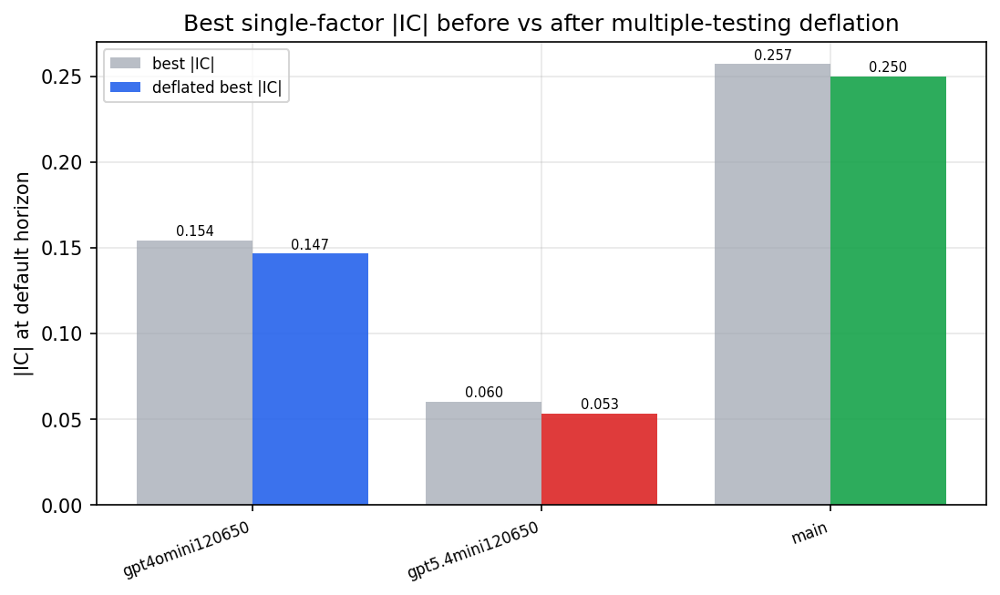

*Best |IC| before vs after multiple-testing deflation*

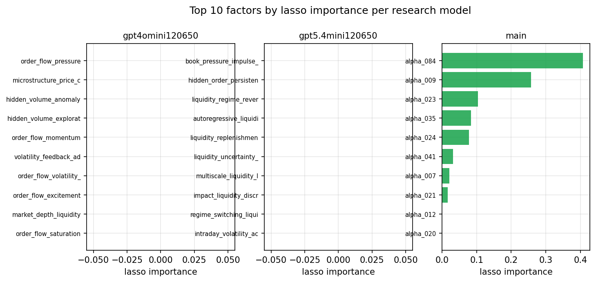

*Top factors by lasso importance per zoo*

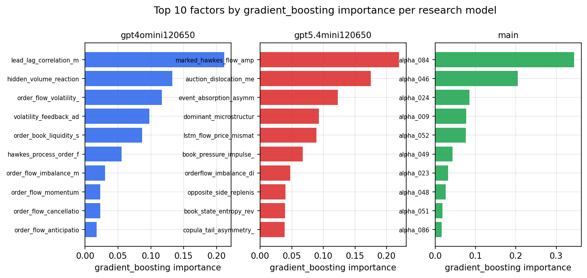

*Top factors by gradient_boosting importance per zoo*

## 4. ML-combined signal — per-underlying vectorised backtest

Each model combines a prerun's factors into ONE signal (fit `factors → forward return` on IS, predict per (bar, underlying)), then that combined signal is run through a simple vectorised backtest — `position(signal) × the underlying's own forward return` — on the held-out OOS tail (+ an equal-weight ensemble). No cross-sectional ranking.

> Config: position=**threshold** (t=1.0, z-score `expanding`), aggregation=**portfolio**, fit-standardise=**per_underlying**, horizon=6.

| prerun | model | n_factors_used | oos_ic | oos_sharpe | is_sharpe | oos_ann_return | oos_max_drawdown |
| --- | --- | --- | --- | --- | --- | --- | --- |
| gpt4omini120650 | linear_regression | 66 | 0.0124 | -0.0681 | 7.5384 | -0.0104 | -0.0325 |
| gpt4omini120650 | ridge | 66 | 0.0097 | 0.3081 | 7.1769 | 0.0542 | -0.0362 |
| gpt4omini120650 | lasso | 66 | nan | nan | nan | nan | nan |
| gpt4omini120650 | elastic_net | 66 | nan | nan | nan | nan | nan |
| gpt4omini120650 | random_forest | 66 | 0.0135 | -2.3486 | 6.4991 | -0.436 | -0.0551 |
| gpt4omini120650 | gradient_boosting | 66 | -0.0197 | -5.6282 | 7.7147 | -0.518 | -0.046 |
| gpt4omini120650 | xgboost | 66 | 0.0241 | 1.9457 | 11.946 | 0.18 | -0.0185 |
| gpt4omini120650 | lightgbm | 66 | 0.0313 | 0.869 | 15.1545 | 0.0853 | -0.0203 |
| gpt4omini120650 | ensemble | 66 | 0.0135 | -0.1789 | 11.8221 | -0.0294 | -0.0297 |
| gpt5.4mini120650 | linear_regression | 68 | 0.0496 | 5.9248 | 3.8355 | 0.5645 | -0.0117 |
| gpt5.4mini120650 | ridge | 68 | 0.0485 | 6.3384 | 3.6112 | 0.605 | -0.0117 |
| gpt5.4mini120650 | lasso | 68 | 0.049 | 6.4374 | 2.1407 | 0.6017 | -0.0117 |
| gpt5.4mini120650 | elastic_net | 68 | 0.0492 | 6.3753 | 2.4885 | 0.6018 | -0.0117 |
| gpt5.4mini120650 | random_forest | 68 | 0.0741 | 13.1813 | 17.1569 | 1.2898 | -0.0111 |
| gpt5.4mini120650 | gradient_boosting | 68 | 0.0747 | 6.6041 | 8.9022 | 0.3357 | -0.0055 |
| gpt5.4mini120650 | xgboost | 68 | 0.0697 | 6.8261 | 12.1497 | 0.4464 | -0.0087 |
| gpt5.4mini120650 | lightgbm | 68 | 0.0736 | 5.7503 | 16.6182 | 0.5149 | -0.0098 |
| gpt5.4mini120650 | ensemble | 68 | 0.0709 | 11.5654 | 12.8616 | 0.8822 | -0.0094 |
| main | linear_regression | 78 | 0.0322 | 8.3124 | 9.7456 | 1.1848 | -0.0147 |
| main | ridge | 78 | 0.0328 | 8.3673 | 10.0644 | 1.1779 | -0.0147 |
| main | lasso | 78 | 0.0421 | 8.9544 | 9.9966 | 1.2192 | -0.0117 |
| main | elastic_net | 78 | 0.0441 | 9.1739 | 9.6229 | 1.2596 | -0.0117 |
| main | random_forest | 78 | 0.0673 | 8.1613 | 9.3417 | 1.1559 | -0.015 |
| main | gradient_boosting | 78 | 0.0614 | 5.45 | 8.9617 | 0.6079 | -0.0148 |
| main | xgboost | 78 | 0.0634 | 6.4071 | 9.9695 | 0.7511 | -0.0151 |
| main | lightgbm | 78 | 0.0583 | 6.6992 | 12.806 | 0.9186 | -0.0155 |
| main | ensemble | 78 | 0.0581 | 7.7912 | 10.7041 | 1.0982 | -0.0152 |

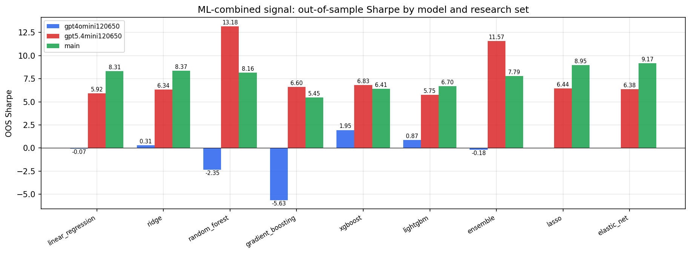

*ML-combined OOS Sharpe by model and research set*

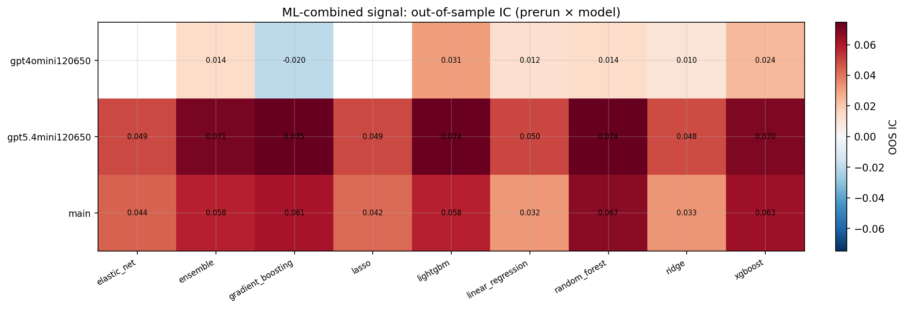

*ML-combined OOS IC (prerun × model)*

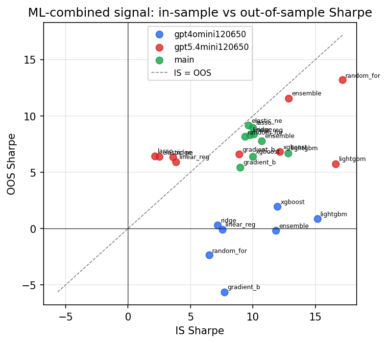

*IS vs OOS Sharpe (overfitting diagnostic)*

---
*Generated by `run_model_comparison.py`. Tables: `*.csv`; interactive: `comparison.ipynb`.*
