# Research-LLM factor comparison — `2025-05`

Comparing the **factor output of different research LLMs** on three axes (raw factor quality → factors as ML features → factors through the full agentic fund). The panel, IS/OOS split, horizon and model hyper-parameters are held identical across preruns — the *only* variable is the factor set.

## Preruns compared

| prerun | research_model | usable_factors | dropped_factors |
| --- | --- | --- | --- |
| gpt4omini120650 | gpt-4o-mini | 66 | 0 |
| gpt5.4mini120650 | gpt-5.4-mini | 68 | 1 |
| main | seed library | 78 | 10 |

> Dropped factors declare fields the current data doesn't have yet (e.g. fundamentals); they light up unchanged once that data is downloaded.

*Usable vs awaiting-data factors per research model*

## Key findings

- **Best ML-combined OOS Sharpe:** `main` with `ensemble` (OOS Sharpe = 12.790).
- **Mean OOS Sharpe across models, by research set:** `main` = 11.766, `gpt4omini120650` = 4.552, `gpt5.4mini120650` = 4.367.
- **Highest mean single-factor |IC| (h=6):** `main` (mean |IC| = 0.0423).
- **Most diverse zoo (highest effective/raw factor ratio):** `gpt5.4mini120650` (eff 57.1 of 68, ratio 0.84).
- **Best selection-deflated single-factor |IC|:** `main` (deflated |IC| = 0.4929 from 38 factors tried).

## 1. Single-factor IC (raw factor quality)

Per-underlying time-series Spearman rank-IC of every researched factor, recomputed on the shared panel at horizons h=1, h=6, h=60. The per-underlying IC correlates each factor's value vector with the underlying's own forward-return vector (pooled across underlyings); the cross-sectional IC ranks across underlyings per timestamp.

| prerun | n_factors | mean_abs_ic_1 | mean_abs_ic_6 | mean_abs_ic_60 | mean_abs_icir_6 | best_factor_h6 | best_abs_ic_h6 |
| --- | --- | --- | --- | --- | --- | --- | --- |
| gpt4omini120650 | 66 | 0.0112 | 0.0105 | 0.01 | 0.2973 | effective_spread_reversal_strength | 0.1432 |
| gpt5.4mini120650 | 68 | 0.0097 | 0.0081 | 0.0092 | 0.3229 | auction_dislocation_mean_reversion | 0.0537 |
| main | 78 | 0.051 | 0.0423 | 0.064 | 0.7673 | alpha_059 | 0.5 |

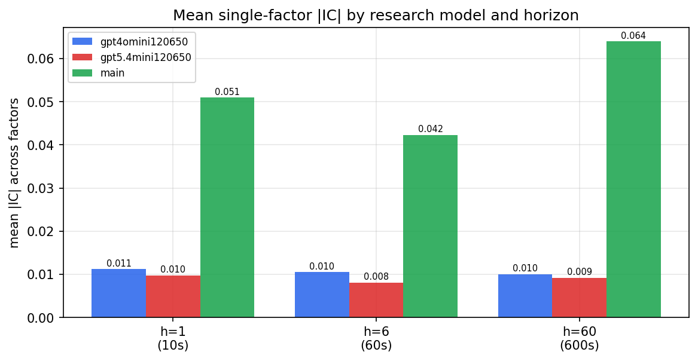

*Mean |IC| by research model and horizon*

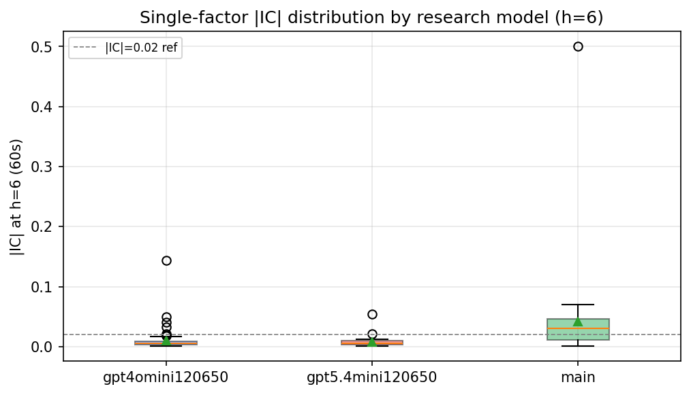

*Per-factor |IC| distribution by research model*

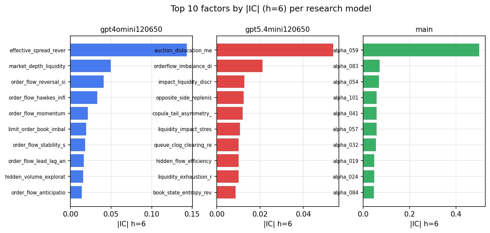

*Top factors by |IC| per research model*

## 2. Factor diversity & redundancy

Pairwise correlation of each zoo's *signals*. `eff_n_factors` is the effective number of independent factors (participation ratio of the correlation eigenvalues); `eff_ratio` and `redundancy` summarise how much unique information the zoo holds vs. how much is duplicated; `n_clusters` groups factors at |corr| ≥ 0.7.

| prerun | n_factors | eff_n_factors | eff_ratio | mean_abs_corr | n_clusters | redundancy |
| --- | --- | --- | --- | --- | --- | --- |
| gpt4omini120650 | 66 | 30.0926 | 0.4559 | 0.049 | 53 | 0.5441 |
| gpt5.4mini120650 | 68 | 57.0518 | 0.839 | 0.0085 | 65 | 0.161 |
| main | 78 | 43.5239 | 0.558 | 0.0347 | 63 | 0.442 |

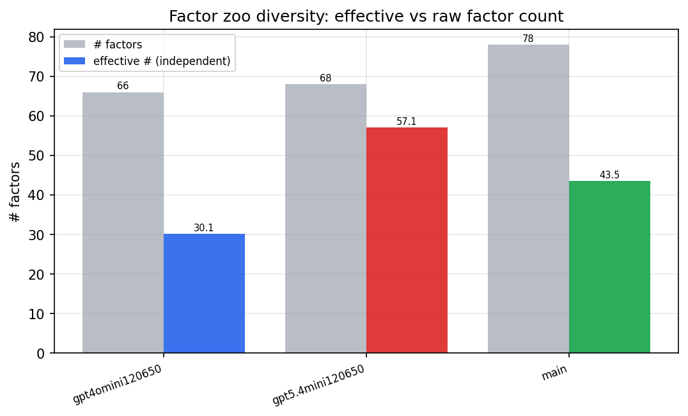

*Effective vs raw factor count per research model*

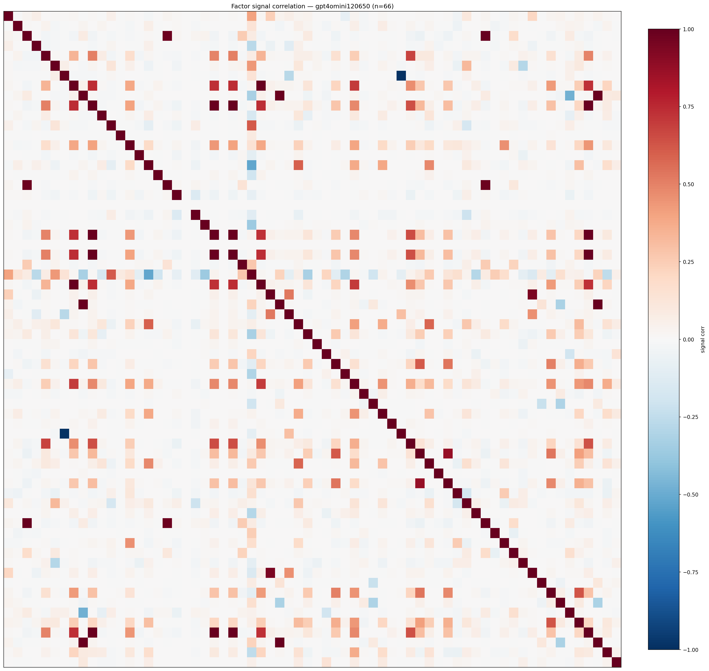

*Signal correlation matrix — gpt4omini120650*

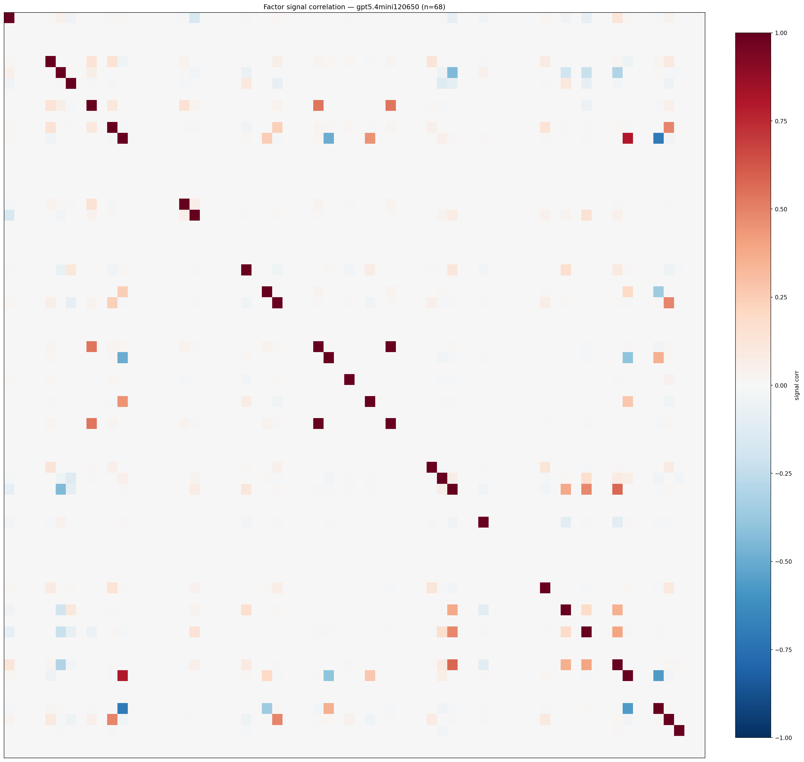

*Signal correlation matrix — gpt5.4mini120650*

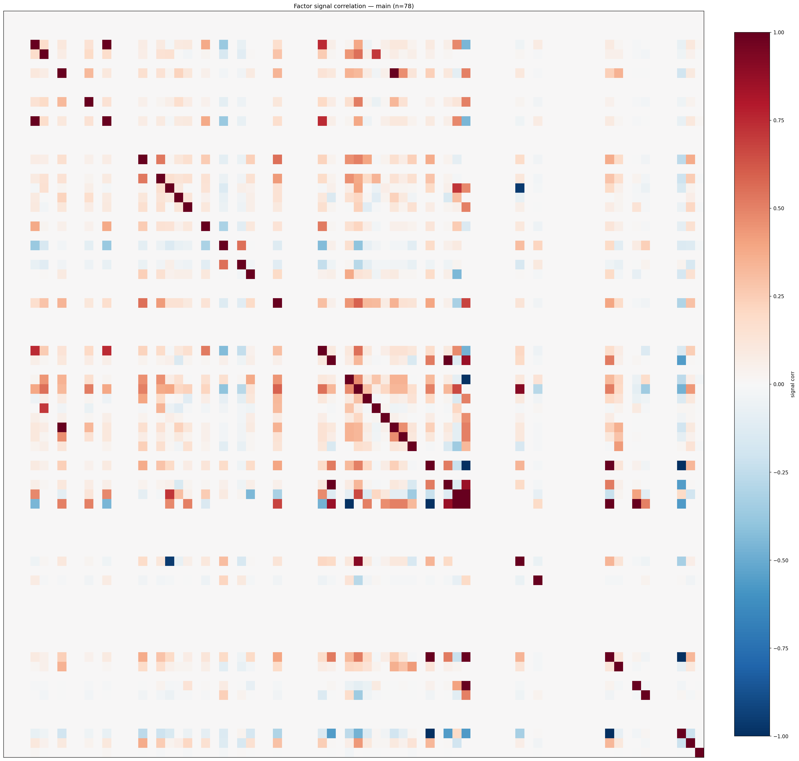

*Signal correlation matrix — main*

## 3. Deflation & model-based importance

`deflated_best_ic` haircuts each zoo's best |IC| for the number of factors tried (`ic_n_tested`) — a bigger zoo's best factor is more likely to be lucky. `lasso_n_nonzero` / `lasso_sparsity` show how many factors a sparse linear model actually keeps (model-view redundancy).

| prerun | best_ic | deflated_best_ic | deflated_best_t | ic_n_tested | ic_n_obs | lasso_n_nonzero | lasso_sparsity |
| --- | --- | --- | --- | --- | --- | --- | --- |
| gpt4omini120650 | 0.1432 | 0.1356 | 51.6542 | 64 | 145078 | 0 | 1.0 |
| gpt5.4mini120650 | 0.0537 | 0.0469 | 17.86 | 29 | 145078 | 0 | 1.0 |
| main | 0.5 | 0.4929 | 187.7483 | 38 | 145078 | 17 | 0.7821 |

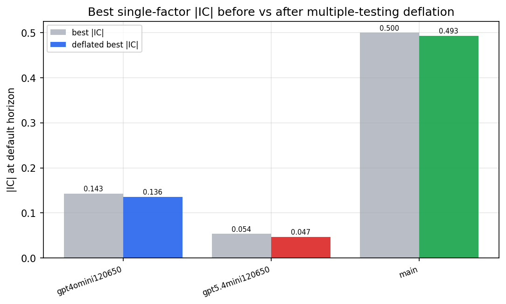

*Best |IC| before vs after multiple-testing deflation*

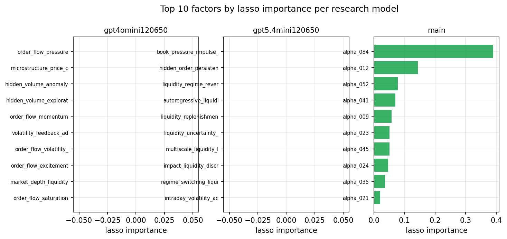

*Top factors by lasso importance per zoo*

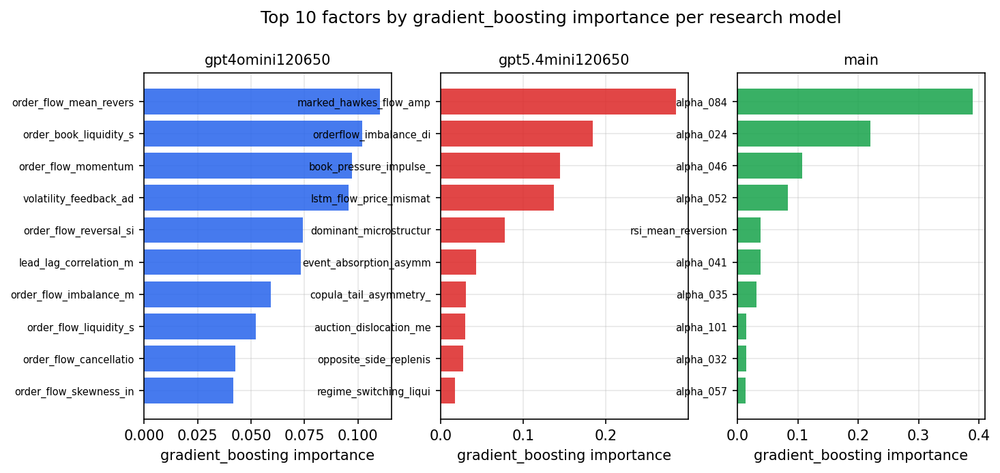

*Top factors by gradient_boosting importance per zoo*

## 4. ML-combined signal — per-underlying vectorised backtest

Each model combines a prerun's factors into ONE signal (fit `factors → forward return` on IS, predict per (bar, underlying)), then that combined signal is run through a simple vectorised backtest — `position(signal) × the underlying's own forward return` — on the held-out OOS tail (+ an equal-weight ensemble). No cross-sectional ranking.

> Config: position=**threshold** (t=1.0, z-score `expanding`), aggregation=**portfolio**, fit-standardise=**per_underlying**, horizon=6.

| prerun | model | n_factors_used | oos_ic | oos_sharpe | is_sharpe | oos_ann_return | oos_max_drawdown |
| --- | --- | --- | --- | --- | --- | --- | --- |
| gpt4omini120650 | linear_regression | 66 | 0.0094 | -0.5162 | 6.7546 | -0.0496 | -0.0271 |
| gpt4omini120650 | ridge | 66 | 0.0063 | -0.8175 | 5.4004 | -0.08 | -0.025 |
| gpt4omini120650 | lasso | 66 | nan | nan | nan | nan | nan |
| gpt4omini120650 | elastic_net | 66 | nan | nan | nan | nan | nan |
| gpt4omini120650 | random_forest | 66 | 0.0113 | 3.8475 | 6.8879 | 0.6503 | -0.0289 |
| gpt4omini120650 | gradient_boosting | 66 | 0.0172 | 6.5806 | 9.2046 | 0.6634 | -0.0124 |
| gpt4omini120650 | xgboost | 66 | 0.0132 | 7.2202 | 11.5532 | 0.9899 | -0.0103 |
| gpt4omini120650 | lightgbm | 66 | -0.0037 | 8.5135 | 17.5104 | 1.188 | -0.0111 |
| gpt4omini120650 | ensemble | 66 | 0.0121 | 7.0387 | 13.4482 | 1.1301 | -0.0221 |
| gpt5.4mini120650 | linear_regression | 68 | 0.0056 | 0.9153 | 5.1344 | 0.0698 | -0.0107 |
| gpt5.4mini120650 | ridge | 68 | 0.0059 | 2.1676 | 5.427 | 0.1714 | -0.0129 |
| gpt5.4mini120650 | lasso | 68 | 0.0168 | 0.882 | 4.2896 | 0.0773 | -0.0196 |
| gpt5.4mini120650 | elastic_net | 68 | 0.0166 | 0.8542 | 4.3932 | 0.0759 | -0.0199 |
| gpt5.4mini120650 | random_forest | 68 | 0.0394 | 8.7809 | 16.5209 | 0.7207 | -0.0108 |
| gpt5.4mini120650 | gradient_boosting | 68 | 0.0348 | 5.1386 | 10.5709 | 0.4888 | -0.0089 |
| gpt5.4mini120650 | xgboost | 68 | 0.0275 | 6.1122 | 12.3407 | 0.6225 | -0.0105 |
| gpt5.4mini120650 | lightgbm | 68 | 0.0309 | 8.1706 | 15.4408 | 0.7141 | -0.0104 |
| gpt5.4mini120650 | ensemble | 68 | 0.0323 | 6.2784 | 14.3652 | 0.6947 | -0.0198 |
| main | linear_regression | 78 | 0.0354 | 12.6347 | 9.4397 | 1.8559 | -0.0053 |
| main | ridge | 78 | 0.0358 | 12.385 | 8.982 | 1.7916 | -0.0048 |
| main | lasso | 78 | 0.032 | 12.3188 | 9.4905 | 1.7812 | -0.006 |
| main | elastic_net | 78 | 0.0336 | 12.2829 | 9.4572 | 1.7745 | -0.006 |
| main | random_forest | 78 | 0.0586 | 10.9119 | 8.3479 | 1.5957 | -0.0063 |
| main | gradient_boosting | 78 | 0.051 | 10.2204 | 8.2968 | 1.3818 | -0.0046 |
| main | xgboost | 78 | 0.0621 | 10.9169 | 9.7668 | 1.4913 | -0.0061 |
| main | lightgbm | 78 | 0.0637 | 11.4303 | 13.5063 | 1.5588 | -0.004 |
| main | ensemble | 78 | 0.0394 | 12.7905 | 10.6994 | 1.8377 | -0.0041 |

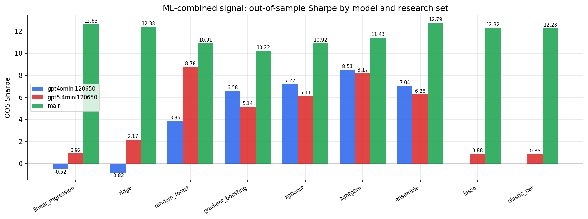

*ML-combined OOS Sharpe by model and research set*

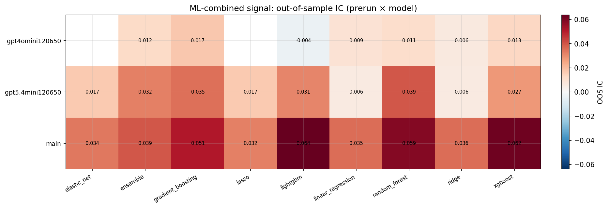

*ML-combined OOS IC (prerun × model)*

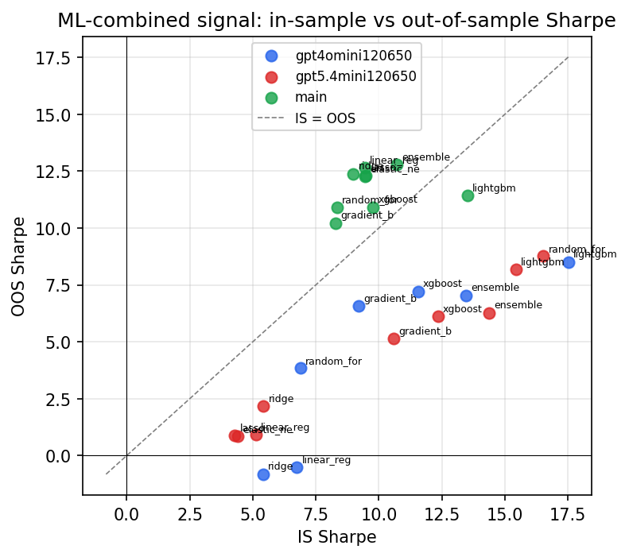

*IS vs OOS Sharpe (overfitting diagnostic)*

---
*Generated by `run_model_comparison.py`. Tables: `*.csv`; interactive: `comparison.ipynb`.*
