# Research-LLM factor comparison — `2025-06`

Comparing the **factor output of different research LLMs** on three axes (raw factor quality → factors as ML features → factors through the full agentic fund). The panel, IS/OOS split, horizon and model hyper-parameters are held identical across preruns — the *only* variable is the factor set.

## Preruns compared

| prerun | research_model | usable_factors | dropped_factors |
| --- | --- | --- | --- |
| gpt4omini120650 | gpt-4o-mini | 66 | 0 |
| gpt5.4mini120650 | gpt-5.4-mini | 68 | 1 |
| main | seed library | 78 | 10 |

> Dropped factors declare fields the current data doesn't have yet (e.g. fundamentals); they light up unchanged once that data is downloaded.

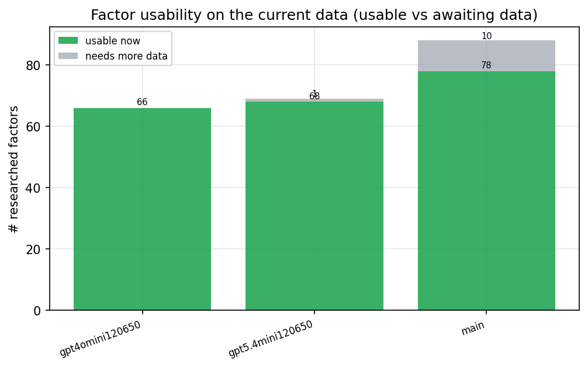

*Usable vs awaiting-data factors per research model*

## Key findings

- **Best ML-combined OOS Sharpe:** `main` with `lasso` (OOS Sharpe = 11.546).
- **Mean OOS Sharpe across models, by research set:** `main` = 11.019, `gpt5.4mini120650` = 2.926, `gpt4omini120650` = 2.814.
- **Highest mean single-factor |IC| (h=6):** `main` (mean |IC| = 0.0470).
- **Most diverse zoo (highest effective/raw factor ratio):** `gpt5.4mini120650` (eff 57.4 of 68, ratio 0.84).
- **Best selection-deflated single-factor |IC|:** `main` (deflated |IC| = 0.4929 from 38 factors tried).

## 1. Single-factor IC (raw factor quality)

Per-underlying time-series Spearman rank-IC of every researched factor, recomputed on the shared panel at horizons h=1, h=6, h=60. The per-underlying IC correlates each factor's value vector with the underlying's own forward-return vector (pooled across underlyings); the cross-sectional IC ranks across underlyings per timestamp.

| prerun | n_factors | mean_abs_ic_1 | mean_abs_ic_6 | mean_abs_ic_60 | mean_abs_icir_6 | best_factor_h6 | best_abs_ic_h6 |
| --- | --- | --- | --- | --- | --- | --- | --- |
| gpt4omini120650 | 66 | 0.0138 | 0.0124 | 0.0124 | 0.2913 | effective_spread_reversal_strength | 0.1989 |
| gpt5.4mini120650 | 68 | 0.0094 | 0.0076 | 0.0096 | 0.3785 | auction_dislocation_mean_reversion | 0.0549 |
| main | 78 | 0.0441 | 0.047 | 0.0581 | 0.7289 | alpha_059 | 0.5 |

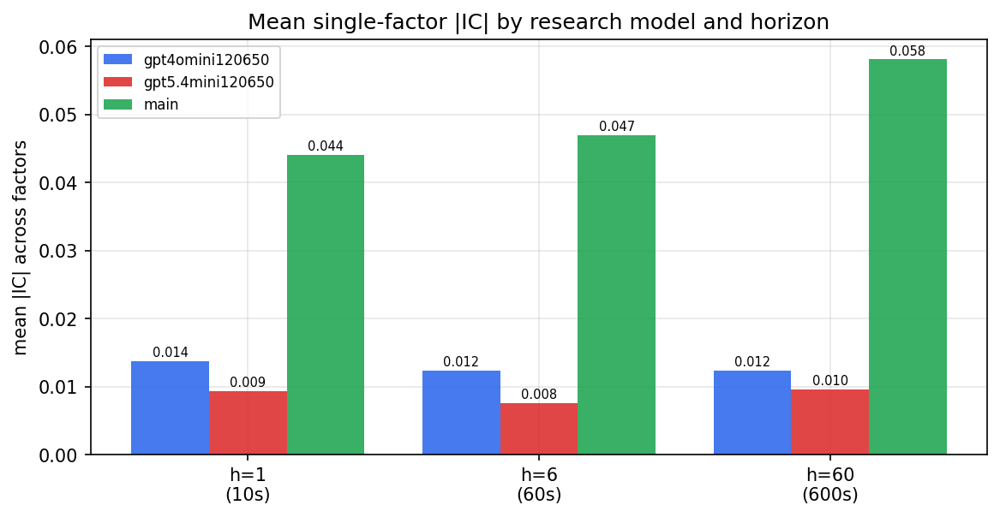

*Mean |IC| by research model and horizon*

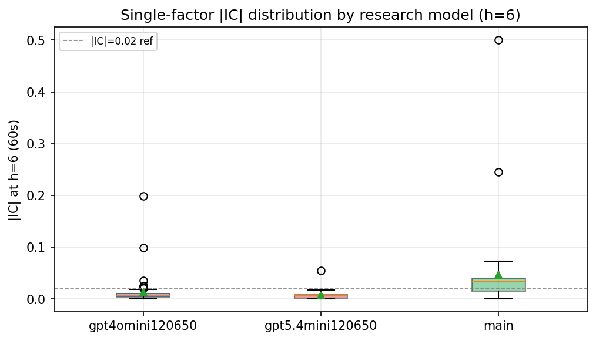

*Per-factor |IC| distribution by research model*

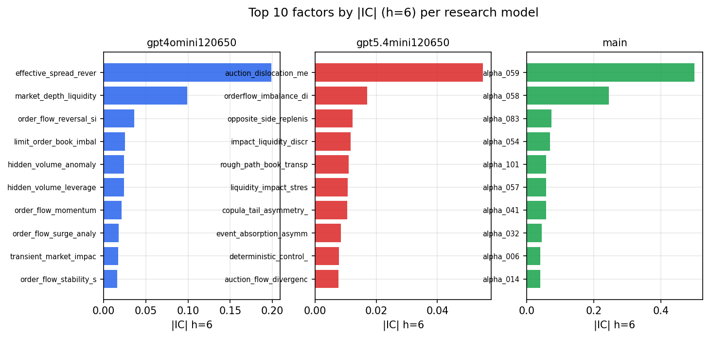

*Top factors by |IC| per research model*

## 2. Factor diversity & redundancy

Pairwise correlation of each zoo's *signals*. `eff_n_factors` is the effective number of independent factors (participation ratio of the correlation eigenvalues); `eff_ratio` and `redundancy` summarise how much unique information the zoo holds vs. how much is duplicated; `n_clusters` groups factors at |corr| ≥ 0.7.

| prerun | n_factors | eff_n_factors | eff_ratio | mean_abs_corr | n_clusters | redundancy |
| --- | --- | --- | --- | --- | --- | --- |
| gpt4omini120650 | 66 | 35.9299 | 0.5444 | 0.0425 | 56 | 0.4556 |
| gpt5.4mini120650 | 68 | 57.4018 | 0.8441 | 0.0077 | 65 | 0.1559 |
| main | 78 | 46.8554 | 0.6007 | 0.0273 | 69 | 0.3993 |

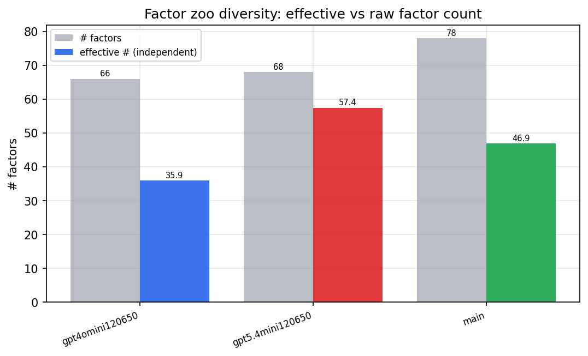

*Effective vs raw factor count per research model*

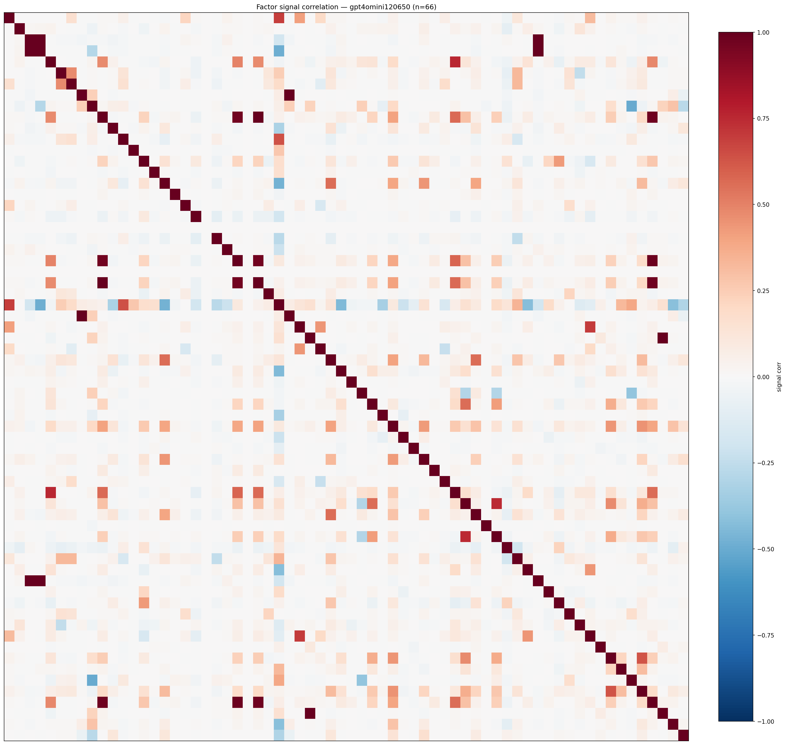

*Signal correlation matrix — gpt4omini120650*

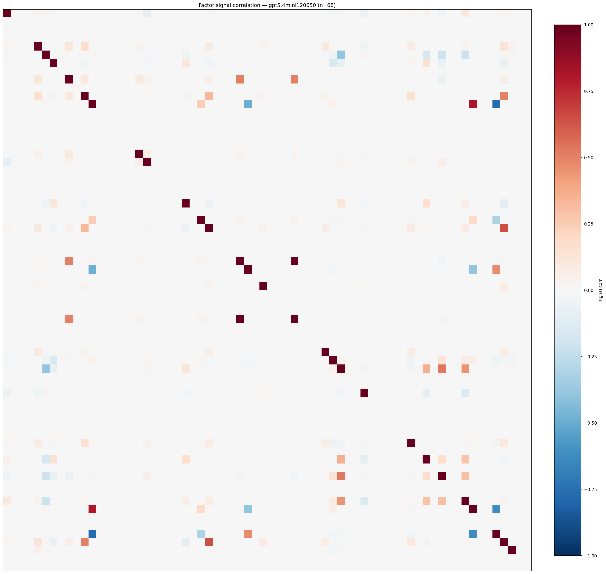

*Signal correlation matrix — gpt5.4mini120650*

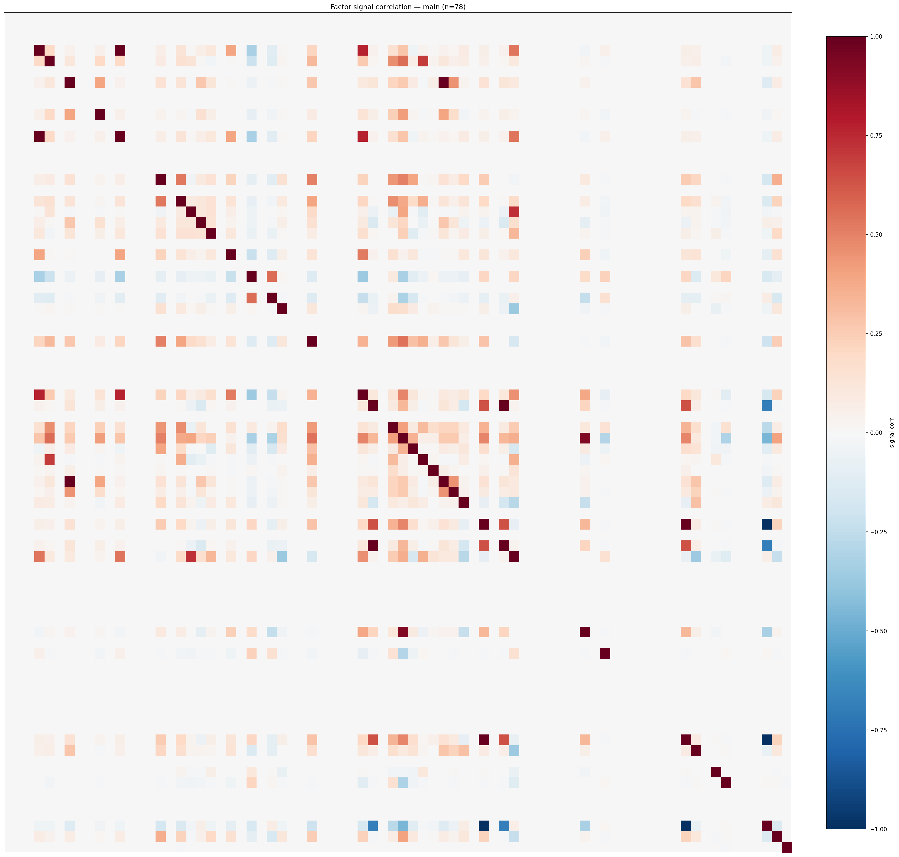

*Signal correlation matrix — main*

## 3. Deflation & model-based importance

`deflated_best_ic` haircuts each zoo's best |IC| for the number of factors tried (`ic_n_tested`) — a bigger zoo's best factor is more likely to be lucky. `lasso_n_nonzero` / `lasso_sparsity` show how many factors a sparse linear model actually keeps (model-view redundancy).

| prerun | best_ic | deflated_best_ic | deflated_best_t | ic_n_tested | ic_n_obs | lasso_n_nonzero | lasso_sparsity |
| --- | --- | --- | --- | --- | --- | --- | --- |
| gpt4omini120650 | 0.1989 | 0.1913 | 72.2624 | 64 | 142738 | 0 | 1.0 |
| gpt5.4mini120650 | 0.0549 | 0.048 | 18.1481 | 29 | 142738 | 5 | 0.9265 |
| main | 0.5 | 0.4929 | 186.2062 | 38 | 142738 | 18 | 0.7692 |

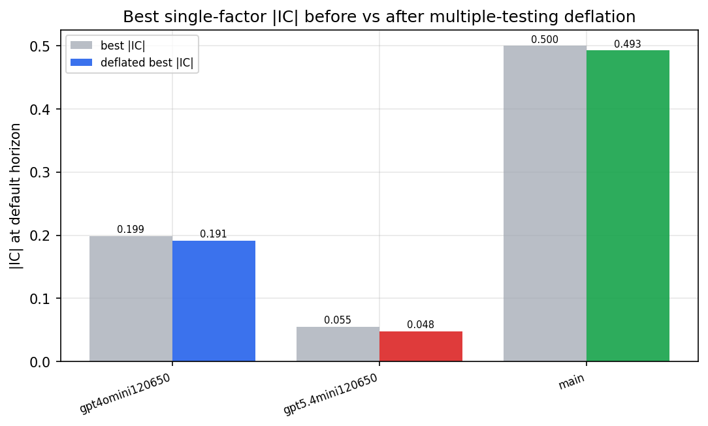

*Best |IC| before vs after multiple-testing deflation*

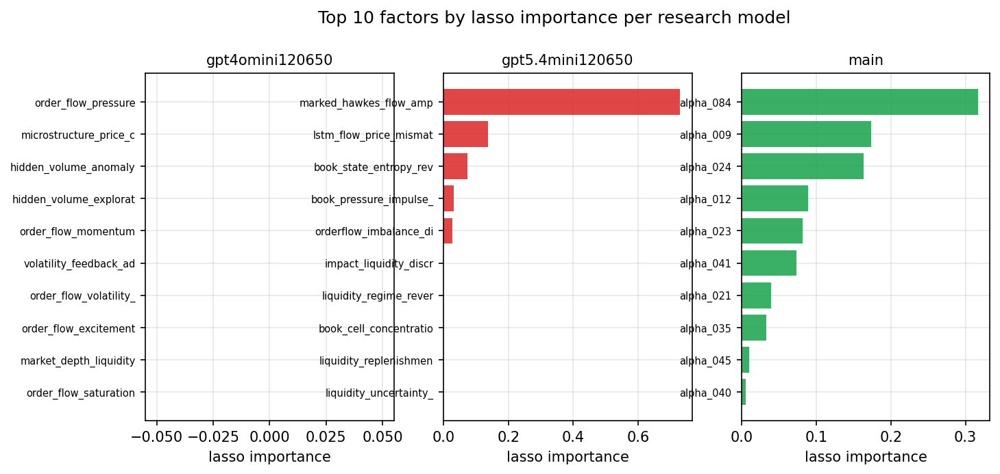

*Top factors by lasso importance per zoo*

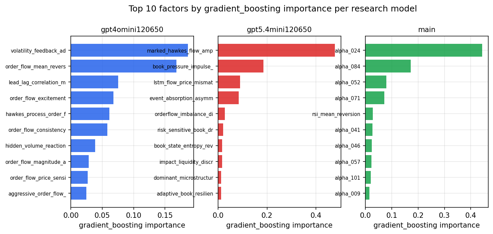

*Top factors by gradient_boosting importance per zoo*

## 4. ML-combined signal — per-underlying vectorised backtest

Each model combines a prerun's factors into ONE signal (fit `factors → forward return` on IS, predict per (bar, underlying)), then that combined signal is run through a simple vectorised backtest — `position(signal) × the underlying's own forward return` — on the held-out OOS tail (+ an equal-weight ensemble). No cross-sectional ranking.

> Config: position=**threshold** (t=1.0, z-score `expanding`), aggregation=**portfolio**, fit-standardise=**per_underlying**, horizon=6.

| prerun | model | n_factors_used | oos_ic | oos_sharpe | is_sharpe | oos_ann_return | oos_max_drawdown |
| --- | --- | --- | --- | --- | --- | --- | --- |
| gpt4omini120650 | linear_regression | 66 | 0.0126 | -0.1923 | 9.2028 | -0.0062 | -0.0086 |
| gpt4omini120650 | ridge | 66 | 0.0138 | -0.7111 | 8.9812 | -0.0233 | -0.0085 |
| gpt4omini120650 | lasso | 66 | nan | nan | nan | nan | nan |
| gpt4omini120650 | elastic_net | 66 | nan | nan | nan | nan | nan |
| gpt4omini120650 | random_forest | 66 | 0.0057 | 2.0117 | 7.2726 | 0.2799 | -0.0205 |
| gpt4omini120650 | gradient_boosting | 66 | 0.0031 | -0.967 | 12.1752 | -0.0997 | -0.0215 |
| gpt4omini120650 | xgboost | 66 | 0.0129 | 7.0388 | 12.8796 | 0.9242 | -0.018 |
| gpt4omini120650 | lightgbm | 66 | 0.013 | 6.2864 | 18.0049 | 0.7723 | -0.0194 |
| gpt4omini120650 | ensemble | 66 | 0.0273 | 6.2312 | 14.6021 | 0.7501 | -0.0195 |
| gpt5.4mini120650 | linear_regression | 68 | 0.0319 | 1.6172 | 3.6474 | 0.0467 | -0.0038 |
| gpt5.4mini120650 | ridge | 68 | 0.0323 | -1.0264 | 3.8705 | -0.0197 | -0.0038 |
| gpt5.4mini120650 | lasso | 68 | -0.0121 | 1.1413 | 2.473 | 0.0553 | -0.0096 |
| gpt5.4mini120650 | elastic_net | 68 | -0.0121 | 1.1413 | 2.473 | 0.0553 | -0.0096 |
| gpt5.4mini120650 | random_forest | 68 | 0.0374 | 4.5625 | 13.3943 | 0.5111 | -0.0125 |
| gpt5.4mini120650 | gradient_boosting | 68 | 0.0322 | 2.3761 | 7.5409 | 0.2266 | -0.0195 |
| gpt5.4mini120650 | xgboost | 68 | 0.0289 | 5.8979 | 9.8488 | 0.6477 | -0.0106 |
| gpt5.4mini120650 | lightgbm | 68 | 0.0347 | 6.1884 | 17.2968 | 0.5944 | -0.0037 |
| gpt5.4mini120650 | ensemble | 68 | 0.0361 | 4.4317 | 9.6025 | 0.4664 | -0.0156 |
| main | linear_regression | 78 | 0.0369 | 11.2912 | 11.0701 | 1.422 | -0.0041 |
| main | ridge | 78 | 0.043 | 11.1431 | 11.291 | 1.4024 | -0.0041 |
| main | lasso | 78 | 0.0608 | 11.546 | 11.6426 | 1.4574 | -0.0041 |
| main | elastic_net | 78 | 0.0589 | 11.4907 | 11.1628 | 1.4482 | -0.0041 |
| main | random_forest | 78 | 0.0327 | 11.1561 | 10.7543 | 1.4107 | -0.0048 |
| main | gradient_boosting | 78 | 0.0289 | 10.5057 | 9.6774 | 1.2294 | -0.0026 |
| main | xgboost | 78 | 0.0361 | 10.5949 | 11.9608 | 1.3185 | -0.0026 |
| main | lightgbm | 78 | 0.046 | 10.5875 | 14.5766 | 1.3172 | -0.003 |
| main | ensemble | 78 | 0.0478 | 10.8566 | 12.6186 | 1.3518 | -0.0041 |

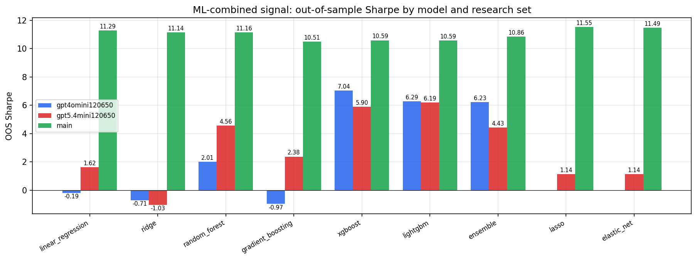

*ML-combined OOS Sharpe by model and research set*

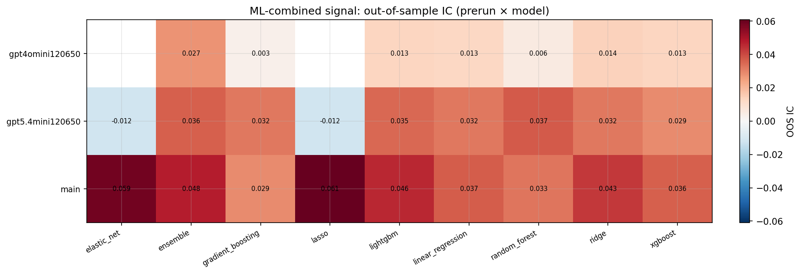

*ML-combined OOS IC (prerun × model)*

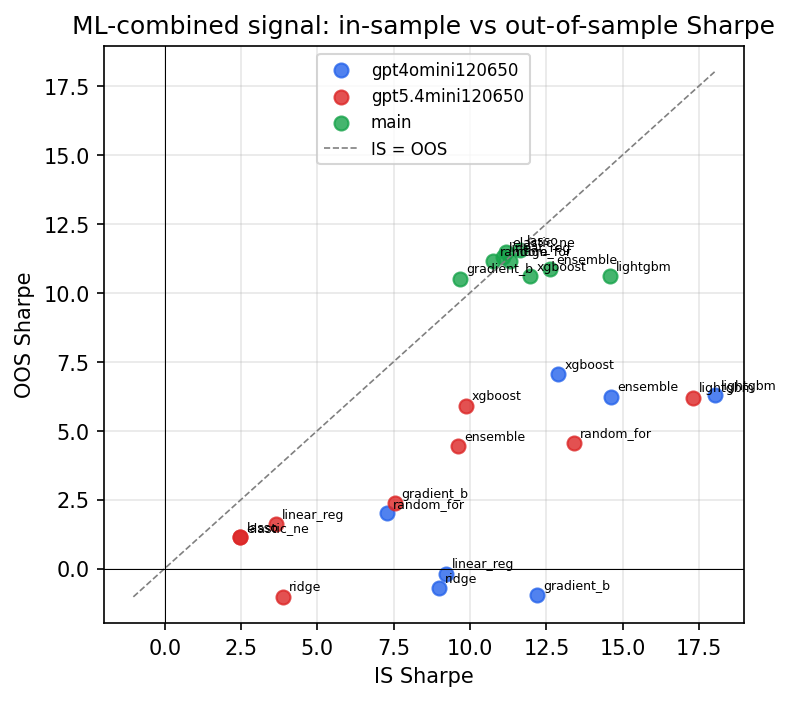

*IS vs OOS Sharpe (overfitting diagnostic)*

---
*Generated by `run_model_comparison.py`. Tables: `*.csv`; interactive: `comparison.ipynb`.*
