# Research-LLM factor comparison — `2025-07`

Comparing the **factor output of different research LLMs** on three axes (raw factor quality → factors as ML features → factors through the full agentic fund). The panel, IS/OOS split, horizon and model hyper-parameters are held identical across preruns — the *only* variable is the factor set.

## Preruns compared

| prerun | research_model | usable_factors | dropped_factors |
| --- | --- | --- | --- |
| gpt4omini120650 | gpt-4o-mini | 66 | 0 |
| gpt5.4mini120650 | gpt-5.4-mini | 68 | 1 |
| main | seed library | 77 | 11 |

> Dropped factors declare fields the current data doesn't have yet (e.g. fundamentals); they light up unchanged once that data is downloaded.

*Usable vs awaiting-data factors per research model*

## Key findings

- **Best ML-combined OOS Sharpe:** `gpt5.4mini120650` with `xgboost` (OOS Sharpe = 10.219).
- **Mean OOS Sharpe across models, by research set:** `main` = 8.147, `gpt5.4mini120650` = 7.050, `gpt4omini120650` = 4.588.
- **Highest mean single-factor |IC| (h=6):** `main` (mean |IC| = 0.0259).
- **Most diverse zoo (highest effective/raw factor ratio):** `gpt5.4mini120650` (eff 57.4 of 68, ratio 0.84).
- **Best selection-deflated single-factor |IC|:** `gpt4omini120650` (deflated |IC| = 0.1485 from 63 factors tried).

## 1. Single-factor IC (raw factor quality)

Per-underlying time-series Spearman rank-IC of every researched factor, recomputed on the shared panel at horizons h=1, h=6, h=60. The per-underlying IC correlates each factor's value vector with the underlying's own forward-return vector (pooled across underlyings); the cross-sectional IC ranks across underlyings per timestamp.

| prerun | n_factors | mean_abs_ic_1 | mean_abs_ic_6 | mean_abs_ic_60 | mean_abs_icir_6 | best_factor_h6 | best_abs_ic_h6 |
| --- | --- | --- | --- | --- | --- | --- | --- |
| gpt4omini120650 | 66 | 0.0122 | 0.0129 | 0.0189 | 0.252 | market_depth_liquidity_risk | 0.1561 |
| gpt5.4mini120650 | 68 | 0.0075 | 0.0067 | 0.0106 | 0.2736 | auction_dislocation_mean_reversion | 0.042 |
| main | 77 | 0.0191 | 0.0259 | 0.0234 | 0.4633 | alpha_058 | 0.1167 |

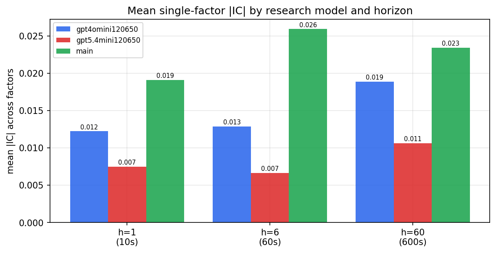

*Mean |IC| by research model and horizon*

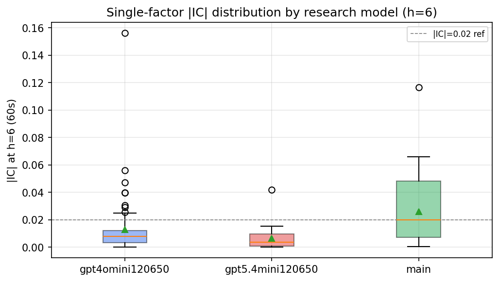

*Per-factor |IC| distribution by research model*

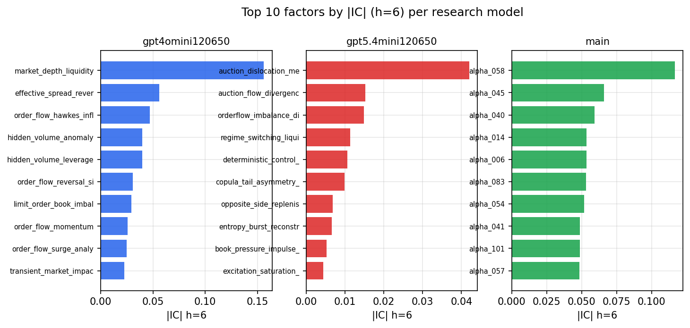

*Top factors by |IC| per research model*

## 2. Factor diversity & redundancy

Pairwise correlation of each zoo's *signals*. `eff_n_factors` is the effective number of independent factors (participation ratio of the correlation eigenvalues); `eff_ratio` and `redundancy` summarise how much unique information the zoo holds vs. how much is duplicated; `n_clusters` groups factors at |corr| ≥ 0.7.

| prerun | n_factors | eff_n_factors | eff_ratio | mean_abs_corr | n_clusters | redundancy |
| --- | --- | --- | --- | --- | --- | --- |
| gpt4omini120650 | 66 | 33.6555 | 0.5099 | 0.0443 | 54 | 0.4901 |
| gpt5.4mini120650 | 68 | 57.4343 | 0.8446 | 0.0079 | 64 | 0.1554 |
| main | 77 | 40.2913 | 0.5233 | 0.0327 | 57 | 0.4767 |

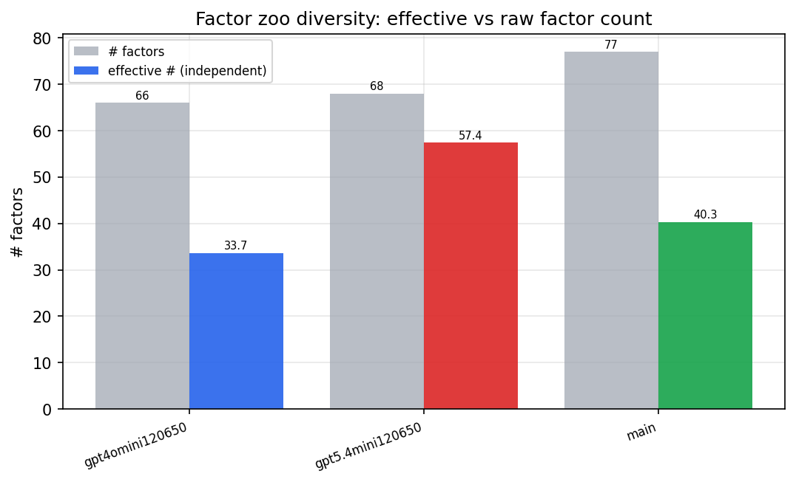

*Effective vs raw factor count per research model*

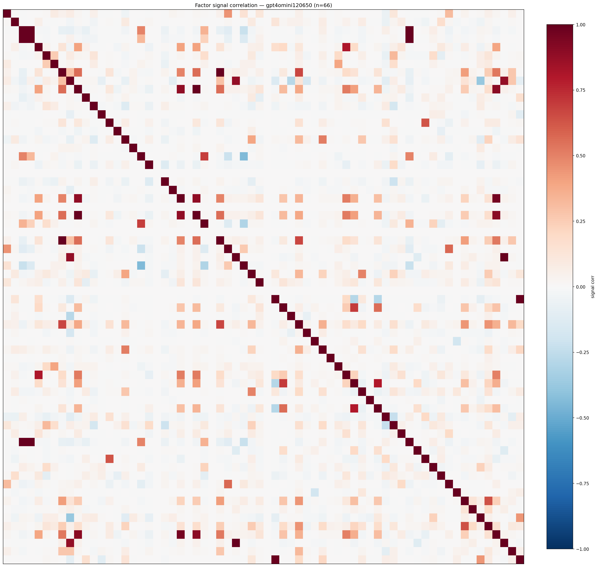

*Signal correlation matrix — gpt4omini120650*

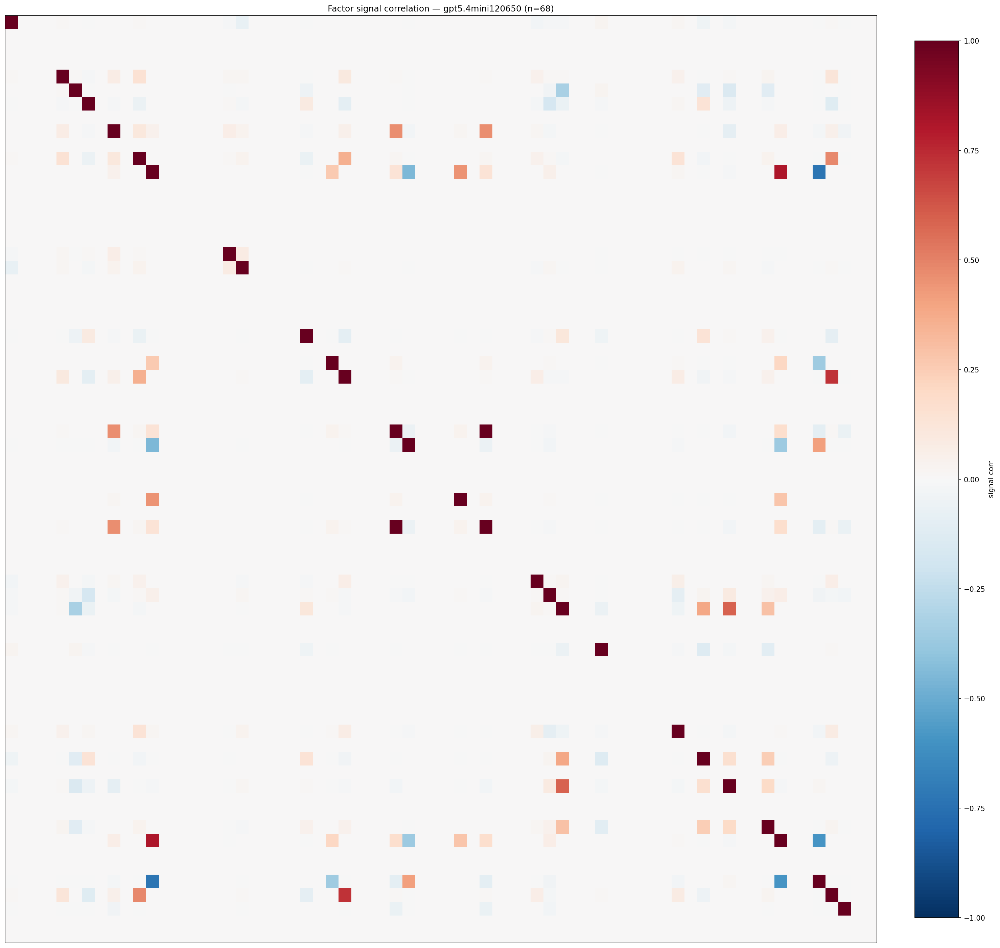

*Signal correlation matrix — gpt5.4mini120650*

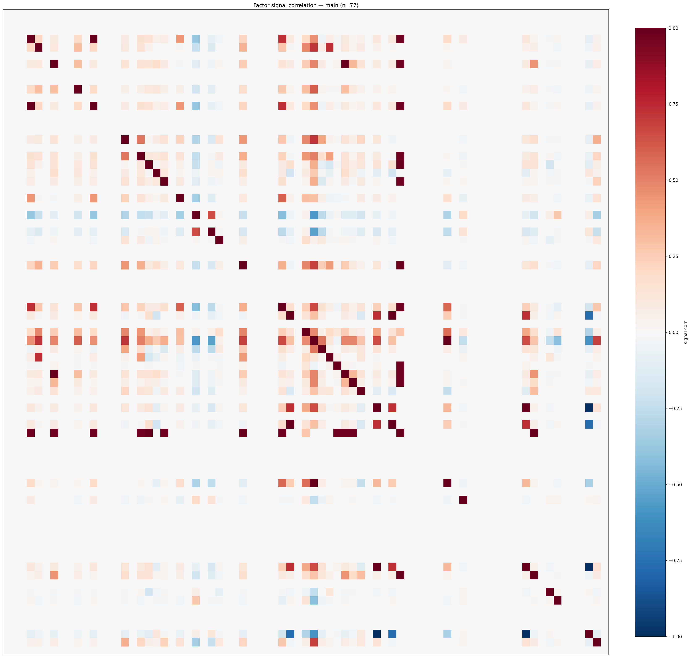

*Signal correlation matrix — main*

## 3. Deflation & model-based importance

`deflated_best_ic` haircuts each zoo's best |IC| for the number of factors tried (`ic_n_tested`) — a bigger zoo's best factor is more likely to be lucky. `lasso_n_nonzero` / `lasso_sparsity` show how many factors a sparse linear model actually keeps (model-view redundancy).

| prerun | best_ic | deflated_best_ic | deflated_best_t | ic_n_tested | ic_n_obs | lasso_n_nonzero | lasso_sparsity |
| --- | --- | --- | --- | --- | --- | --- | --- |
| gpt4omini120650 | 0.1561 | 0.1485 | 56.3662 | 63 | 143999 | 11 | 0.8333 |
| gpt5.4mini120650 | 0.042 | 0.0355 | 13.4858 | 21 | 143999 | 3 | 0.9559 |
| main | 0.1167 | 0.1096 | 41.5849 | 37 | 143999 | 20 | 0.7403 |

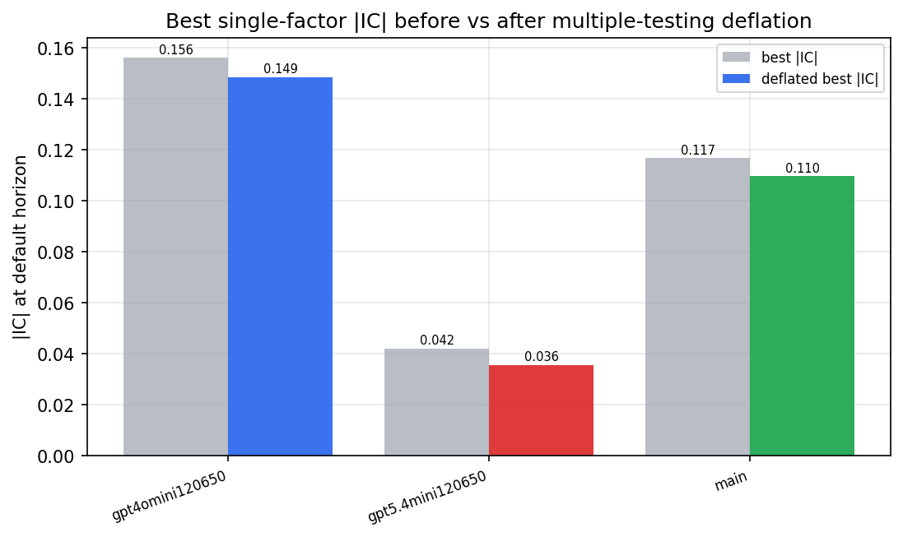

*Best |IC| before vs after multiple-testing deflation*

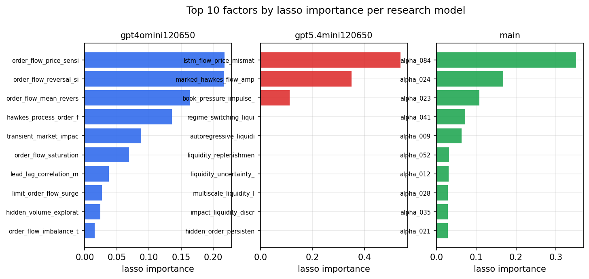

*Top factors by lasso importance per zoo*

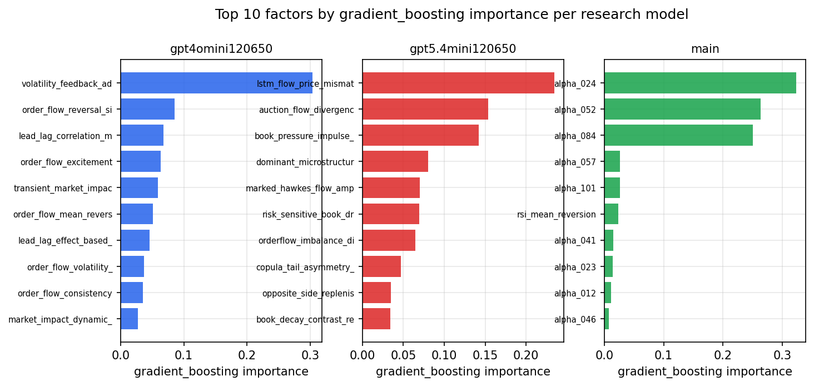

*Top factors by gradient_boosting importance per zoo*

## 4. ML-combined signal — per-underlying vectorised backtest

Each model combines a prerun's factors into ONE signal (fit `factors → forward return` on IS, predict per (bar, underlying)), then that combined signal is run through a simple vectorised backtest — `position(signal) × the underlying's own forward return` — on the held-out OOS tail (+ an equal-weight ensemble). No cross-sectional ranking.

> Config: position=**threshold** (t=1.0, z-score `expanding`), aggregation=**portfolio**, fit-standardise=**per_underlying**, horizon=6.

| prerun | model | n_factors_used | oos_ic | oos_sharpe | is_sharpe | oos_ann_return | oos_max_drawdown |
| --- | --- | --- | --- | --- | --- | --- | --- |
| gpt4omini120650 | linear_regression | 66 | -0.0045 | 8.2935 | 8.8633 | 0.8702 | -0.0143 |
| gpt4omini120650 | ridge | 66 | -0.0013 | 8.3618 | 8.2514 | 0.8832 | -0.0145 |
| gpt4omini120650 | lasso | 66 | 0.0112 | 9.0247 | 7.1133 | 0.8869 | -0.0111 |
| gpt4omini120650 | elastic_net | 66 | 0.0157 | 8.8391 | 7.5503 | 0.867 | -0.0109 |
| gpt4omini120650 | random_forest | 66 | 0.0077 | -4.7555 | 9.2143 | -0.8908 | -0.0909 |
| gpt4omini120650 | gradient_boosting | 66 | 0.0261 | 6.3615 | 11.8747 | 0.6256 | -0.0109 |
| gpt4omini120650 | xgboost | 66 | 0.001 | -2.8427 | 13.8007 | -0.4035 | -0.0585 |
| gpt4omini120650 | lightgbm | 66 | 0.0076 | 4.9703 | 16.6629 | 0.6413 | -0.0154 |
| gpt4omini120650 | ensemble | 66 | -0.0024 | 3.0356 | 13.6724 | 0.3494 | -0.0226 |
| gpt5.4mini120650 | linear_regression | 68 | 0.0095 | 6.2483 | 5.4176 | 0.5595 | -0.0087 |
| gpt5.4mini120650 | ridge | 68 | 0.0107 | 6.7132 | 5.4065 | 0.6222 | -0.0078 |
| gpt5.4mini120650 | lasso | 68 | nan | nan | nan | nan | nan |
| gpt5.4mini120650 | elastic_net | 68 | nan | nan | nan | nan | nan |
| gpt5.4mini120650 | random_forest | 68 | 0.052 | 8.6037 | 10.1621 | 0.9332 | -0.0058 |
| gpt5.4mini120650 | gradient_boosting | 68 | 0.014 | 4.504 | 8.0741 | 0.2269 | -0.004 |
| gpt5.4mini120650 | xgboost | 68 | 0.0472 | 10.2191 | 13.1459 | 0.9096 | -0.0035 |
| gpt5.4mini120650 | lightgbm | 68 | 0.0419 | 5.5654 | 17.4878 | 0.5129 | -0.0189 |
| gpt5.4mini120650 | ensemble | 68 | 0.034 | 7.4982 | 14.901 | 0.8625 | -0.0118 |
| main | linear_regression | 77 | 0.0022 | 8.9369 | 12.8031 | 1.11 | -0.0141 |
| main | ridge | 77 | 0.017 | 9.2096 | 13.1275 | 1.1405 | -0.0125 |
| main | lasso | 77 | 0.0177 | 9.0589 | 12.7683 | 1.1317 | -0.0124 |
| main | elastic_net | 77 | 0.0177 | 9.1113 | 13.0006 | 1.1357 | -0.0123 |
| main | random_forest | 77 | 0.043 | 8.8584 | 11.5085 | 1.0595 | -0.0147 |
| main | gradient_boosting | 77 | 0.0218 | 6.3707 | 12.3369 | 0.732 | -0.014 |
| main | xgboost | 77 | 0.0234 | 6.4197 | 12.9741 | 0.7203 | -0.014 |
| main | lightgbm | 77 | 0.0383 | 6.4375 | 15.7386 | 0.7991 | -0.014 |
| main | ensemble | 77 | 0.018 | 8.9201 | 13.2765 | 1.1362 | -0.0142 |

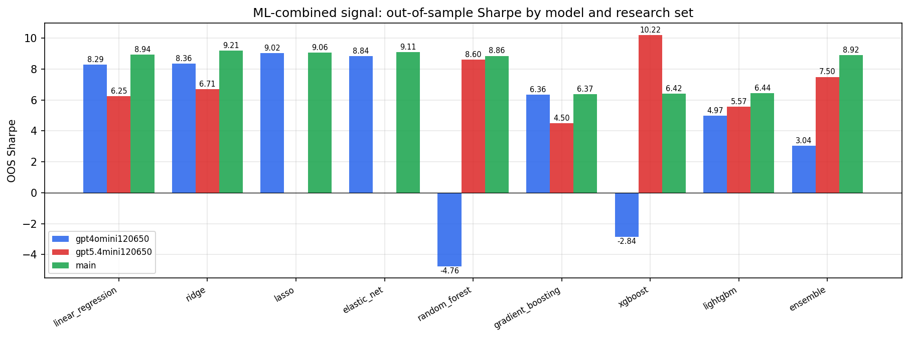

*ML-combined OOS Sharpe by model and research set*

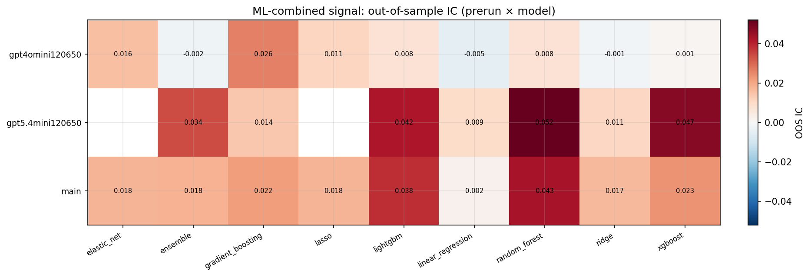

*ML-combined OOS IC (prerun × model)*

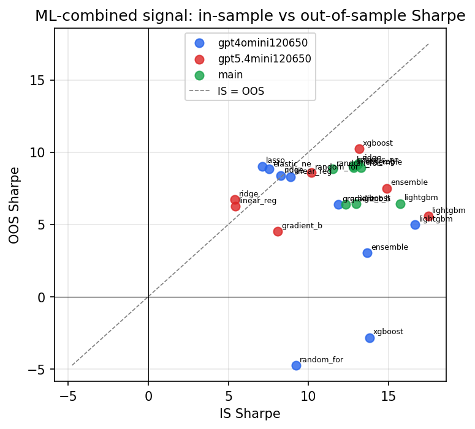

*IS vs OOS Sharpe (overfitting diagnostic)*

---
*Generated by `run_model_comparison.py`. Tables: `*.csv`; interactive: `comparison.ipynb`.*
