# Research-LLM factor comparison — `2025-08`

Comparing the **factor output of different research LLMs** on three axes (raw factor quality → factors as ML features → factors through the full agentic fund). The panel, IS/OOS split, horizon and model hyper-parameters are held identical across preruns — the *only* variable is the factor set.

## Preruns compared

| prerun | research_model | usable_factors | dropped_factors |
| --- | --- | --- | --- |
| gpt4omini120650 | gpt-4o-mini | 66 | 0 |
| gpt5.4mini120650 | gpt-5.4-mini | 68 | 1 |
| main | seed library | 77 | 11 |

> Dropped factors declare fields the current data doesn't have yet (e.g. fundamentals); they light up unchanged once that data is downloaded.

*Usable vs awaiting-data factors per research model*

## Key findings

- **Best ML-combined OOS Sharpe:** `main` with `lightgbm` (OOS Sharpe = 10.953).
- **Mean OOS Sharpe across models, by research set:** `main` = 10.199, `gpt5.4mini120650` = 0.457, `gpt4omini120650` = -0.802.
- **Highest mean single-factor |IC| (h=6):** `main` (mean |IC| = 0.0350).
- **Most diverse zoo (highest effective/raw factor ratio):** `gpt5.4mini120650` (eff 55.9 of 68, ratio 0.82).
- **Best selection-deflated single-factor |IC|:** `main` (deflated |IC| = 0.6255 from 36 factors tried).

## 1. Single-factor IC (raw factor quality)

Per-underlying time-series Spearman rank-IC of every researched factor, recomputed on the shared panel at horizons h=1, h=6, h=60. The per-underlying IC correlates each factor's value vector with the underlying's own forward-return vector (pooled across underlyings); the cross-sectional IC ranks across underlyings per timestamp.

| prerun | n_factors | mean_abs_ic_1 | mean_abs_ic_6 | mean_abs_ic_60 | mean_abs_icir_6 | best_factor_h6 | best_abs_ic_h6 |
| --- | --- | --- | --- | --- | --- | --- | --- |
| gpt4omini120650 | 66 | 0.0249 | 0.0228 | 0.0232 | 0.2823 | effective_spread_reversal_strength | 0.6124 |
| gpt5.4mini120650 | 68 | 0.005 | 0.0072 | 0.0085 | 0.2647 | deterministic_control_gap | 0.0547 |
| main | 77 | 0.0208 | 0.035 | 0.0414 | 0.308 | alpha_058 | 0.6325 |

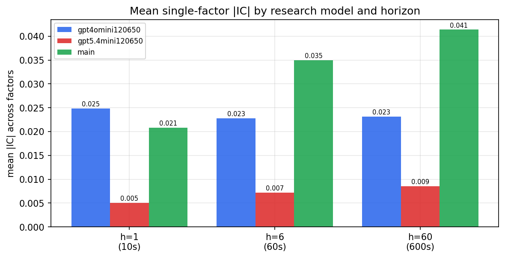

*Mean |IC| by research model and horizon*

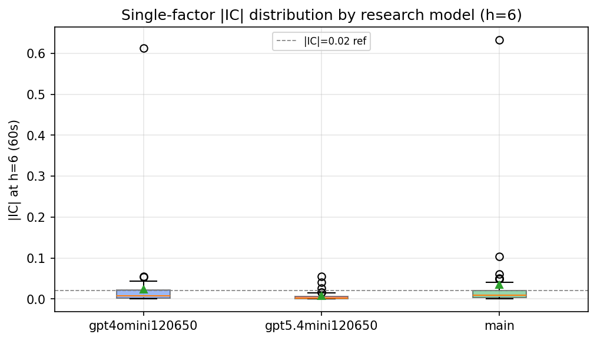

*Per-factor |IC| distribution by research model*

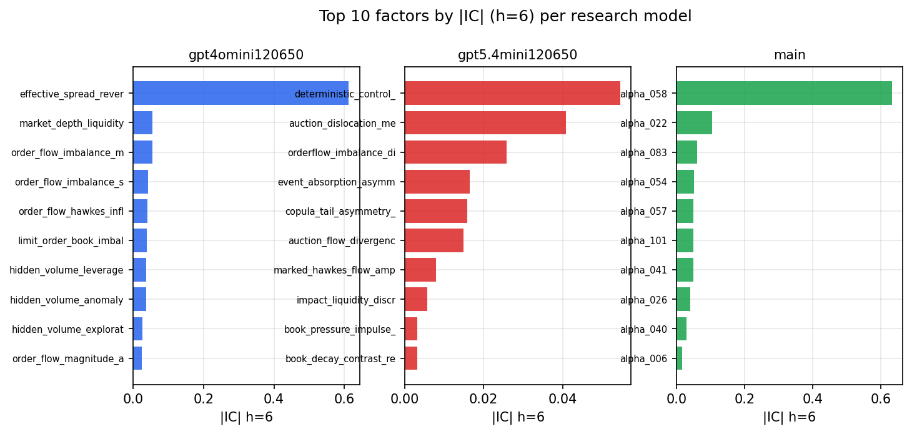

*Top factors by |IC| per research model*

## 2. Factor diversity & redundancy

Pairwise correlation of each zoo's *signals*. `eff_n_factors` is the effective number of independent factors (participation ratio of the correlation eigenvalues); `eff_ratio` and `redundancy` summarise how much unique information the zoo holds vs. how much is duplicated; `n_clusters` groups factors at |corr| ≥ 0.7.

| prerun | n_factors | eff_n_factors | eff_ratio | mean_abs_corr | n_clusters | redundancy |
| --- | --- | --- | --- | --- | --- | --- |
| gpt4omini120650 | 66 | 37.9231 | 0.5746 | 0.0388 | 55 | 0.4254 |
| gpt5.4mini120650 | 68 | 55.8887 | 0.8219 | 0.008 | 63 | 0.1781 |
| main | 77 | 36.9648 | 0.4801 | 0.0382 | 50 | 0.5199 |

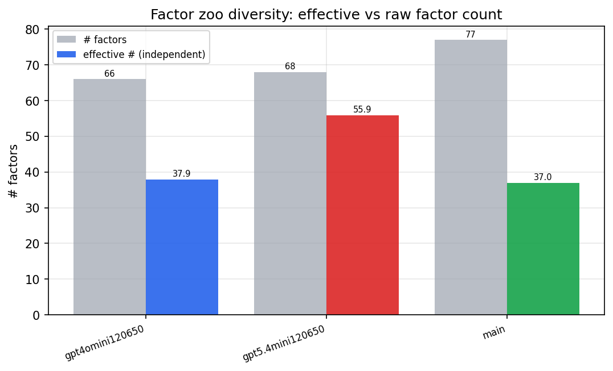

*Effective vs raw factor count per research model*

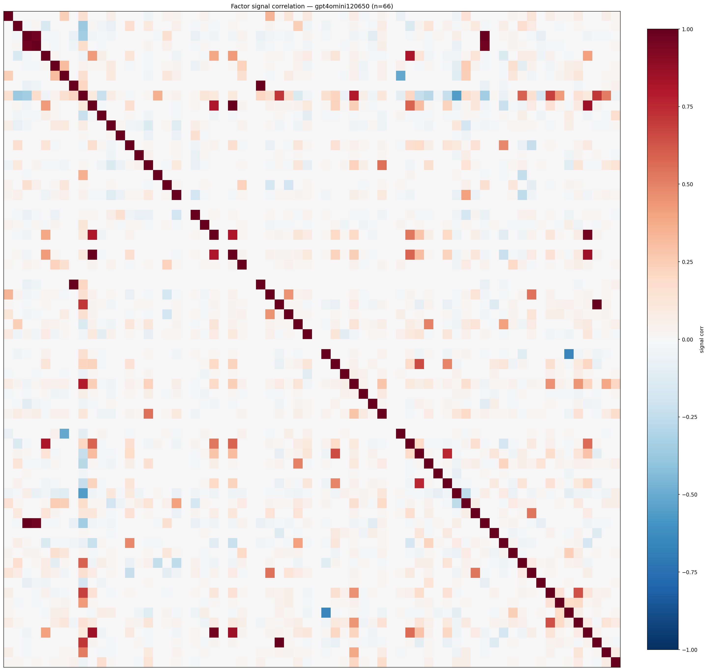

*Signal correlation matrix — gpt4omini120650*

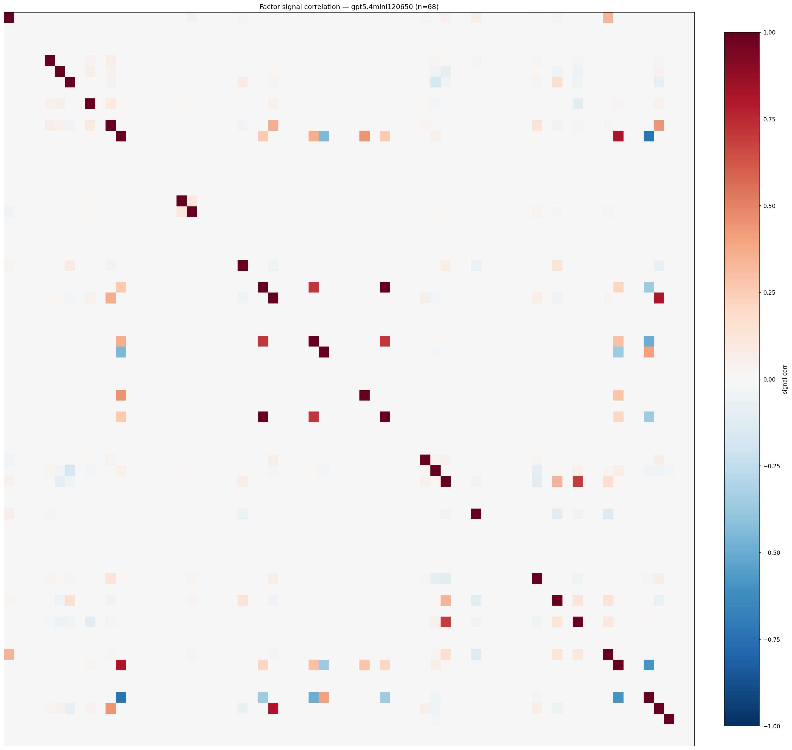

*Signal correlation matrix — gpt5.4mini120650*

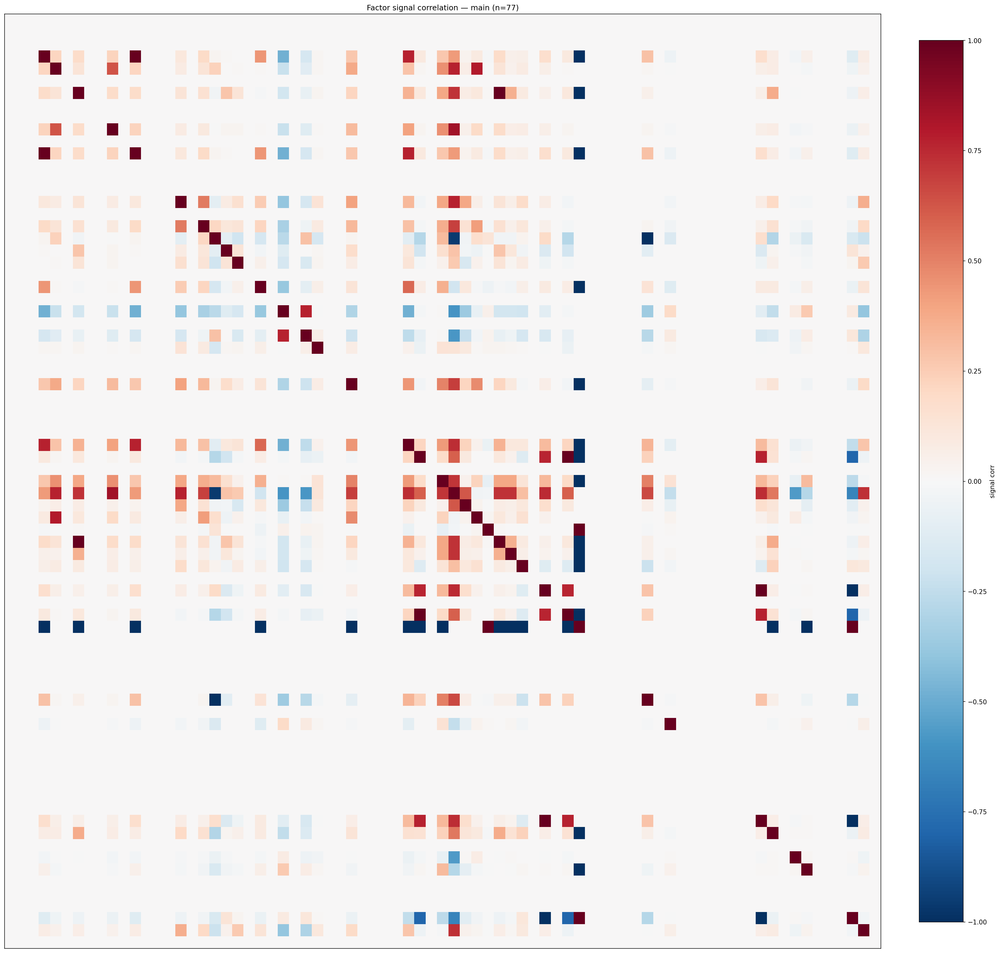

*Signal correlation matrix — main*

## 3. Deflation & model-based importance

`deflated_best_ic` haircuts each zoo's best |IC| for the number of factors tried (`ic_n_tested`) — a bigger zoo's best factor is more likely to be lucky. `lasso_n_nonzero` / `lasso_sparsity` show how many factors a sparse linear model actually keeps (model-view redundancy).

| prerun | best_ic | deflated_best_ic | deflated_best_t | ic_n_tested | ic_n_obs | lasso_n_nonzero | lasso_sparsity |
| --- | --- | --- | --- | --- | --- | --- | --- |
| gpt4omini120650 | 0.6124 | 0.6048 | 231.3801 | 63 | 146339 | 2 | 0.9697 |
| gpt5.4mini120650 | 0.0547 | 0.0479 | 18.3303 | 28 | 146339 | 0 | 1.0 |
| main | 0.6325 | 0.6255 | 239.2642 | 36 | 146339 | 18 | 0.7662 |

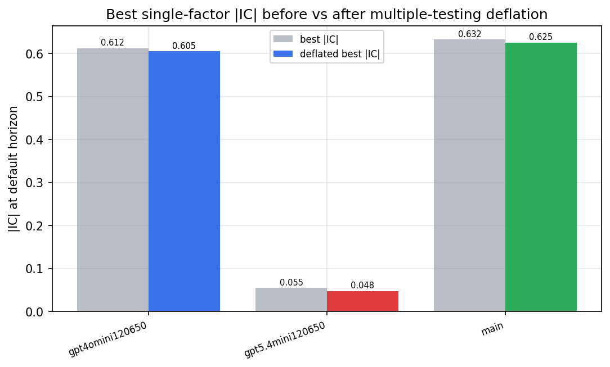

*Best |IC| before vs after multiple-testing deflation*

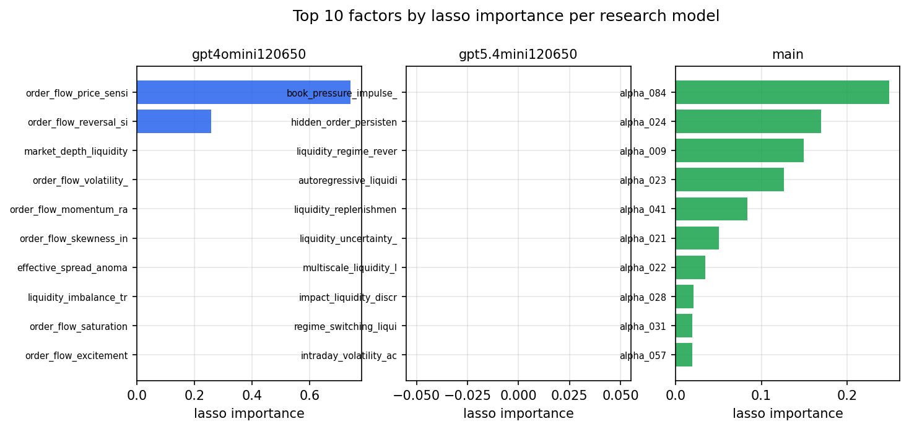

*Top factors by lasso importance per zoo*

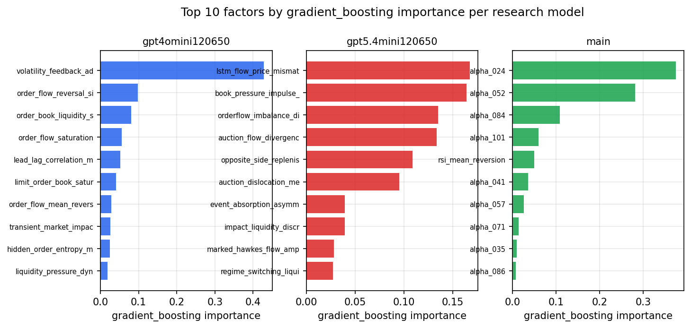

*Top factors by gradient_boosting importance per zoo*

## 4. ML-combined signal — per-underlying vectorised backtest

Each model combines a prerun's factors into ONE signal (fit `factors → forward return` on IS, predict per (bar, underlying)), then that combined signal is run through a simple vectorised backtest — `position(signal) × the underlying's own forward return` — on the held-out OOS tail (+ an equal-weight ensemble). No cross-sectional ranking.

> Config: position=**threshold** (t=1.0, z-score `expanding`), aggregation=**portfolio**, fit-standardise=**per_underlying**, horizon=6.

| prerun | model | n_factors_used | oos_ic | oos_sharpe | is_sharpe | oos_ann_return | oos_max_drawdown |
| --- | --- | --- | --- | --- | --- | --- | --- |
| gpt4omini120650 | linear_regression | 66 | 0.0069 | 1.2533 | 10.3218 | 0.1652 | -0.0355 |
| gpt4omini120650 | ridge | 66 | 0.0072 | 0.0655 | 10.3889 | 0.0095 | -0.0454 |
| gpt4omini120650 | lasso | 66 | 0.004 | 1.8908 | 10.0762 | 0.2359 | -0.0336 |
| gpt4omini120650 | elastic_net | 66 | 0.0032 | 1.2444 | 9.9465 | 0.1616 | -0.0379 |
| gpt4omini120650 | random_forest | 66 | 0.0037 | -2.8302 | 7.9564 | -0.5416 | -0.0854 |
| gpt4omini120650 | gradient_boosting | 66 | 0.007 | -2.1869 | 10.9755 | -0.302 | -0.0562 |
| gpt4omini120650 | xgboost | 66 | -0.0013 | -3.0448 | 13.762 | -0.5166 | -0.0718 |
| gpt4omini120650 | lightgbm | 66 | 0.0015 | -1.7351 | 15.6855 | -0.3026 | -0.0677 |
| gpt4omini120650 | ensemble | 66 | 0.0079 | -1.8743 | 13.1529 | -0.3221 | -0.0606 |
| gpt5.4mini120650 | linear_regression | 68 | 0.025 | 1.905 | 8.6101 | 0.1995 | -0.0193 |
| gpt5.4mini120650 | ridge | 68 | 0.0245 | 1.752 | 8.86 | 0.1803 | -0.0213 |
| gpt5.4mini120650 | lasso | 68 | -0.0208 | -0.5285 | 8.1598 | -0.0362 | -0.018 |
| gpt5.4mini120650 | elastic_net | 68 | -0.0209 | -0.5285 | 8.2495 | -0.0362 | -0.018 |
| gpt5.4mini120650 | random_forest | 68 | 0.0283 | 1.1448 | 12.0285 | 0.1527 | -0.0227 |
| gpt5.4mini120650 | gradient_boosting | 68 | 0.0056 | -1.0503 | 10.4409 | -0.1107 | -0.0324 |
| gpt5.4mini120650 | xgboost | 68 | 0.0344 | -0.0304 | 14.1194 | -0.0038 | -0.0326 |
| gpt5.4mini120650 | lightgbm | 68 | 0.0472 | 0.9637 | 16.4554 | 0.1538 | -0.0343 |
| gpt5.4mini120650 | ensemble | 68 | 0.029 | 0.487 | 13.9887 | 0.0674 | -0.0284 |
| main | linear_regression | 77 | 0.0109 | 9.9443 | 11.7093 | 1.5596 | -0.0093 |
| main | ridge | 77 | 0.0125 | 10.053 | 11.8543 | 1.5762 | -0.0092 |
| main | lasso | 77 | 0.019 | 9.9992 | 11.5717 | 1.5673 | -0.01 |
| main | elastic_net | 77 | 0.018 | 10.0781 | 11.7693 | 1.579 | -0.0093 |
| main | random_forest | 77 | 0.04 | 10.0691 | 11.796 | 1.4653 | -0.0084 |
| main | gradient_boosting | 77 | 0.0397 | 9.8348 | 11.8715 | 1.3083 | -0.0027 |
| main | xgboost | 77 | 0.0351 | 10.7855 | 12.1204 | 1.5922 | -0.003 |
| main | lightgbm | 77 | 0.0382 | 10.953 | 13.5991 | 1.7083 | -0.0057 |
| main | ensemble | 77 | 0.0186 | 10.0731 | 12.236 | 1.56 | -0.0065 |

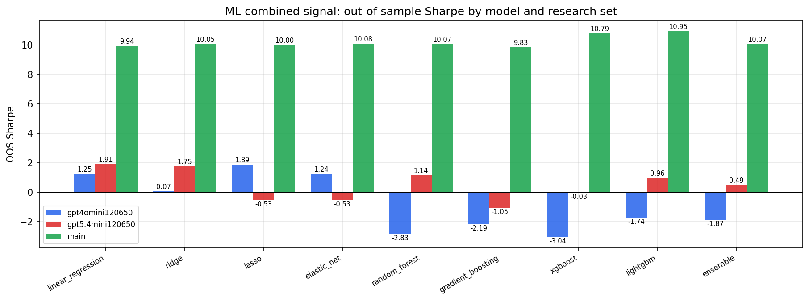

*ML-combined OOS Sharpe by model and research set*

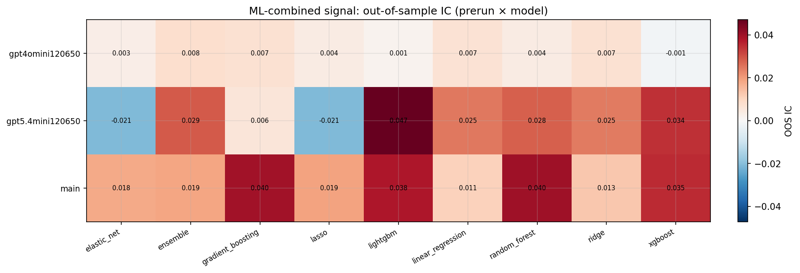

*ML-combined OOS IC (prerun × model)*

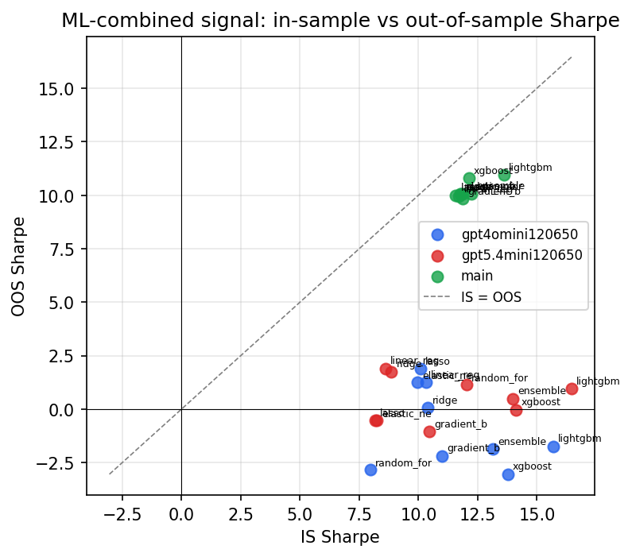

*IS vs OOS Sharpe (overfitting diagnostic)*

---
*Generated by `run_model_comparison.py`. Tables: `*.csv`; interactive: `comparison.ipynb`.*
