# Research-LLM factor comparison — `2025-09`

Comparing the **factor output of different research LLMs** on three axes (raw factor quality → factors as ML features → factors through the full agentic fund). The panel, IS/OOS split, horizon and model hyper-parameters are held identical across preruns — the *only* variable is the factor set.

## Preruns compared

| prerun | research_model | usable_factors | dropped_factors |
| --- | --- | --- | --- |
| gpt4omini120650 | gpt-4o-mini | 66 | 0 |
| gpt5.4mini120650 | gpt-5.4-mini | 68 | 1 |
| main | seed library | 76 | 12 |

> Dropped factors declare fields the current data doesn't have yet (e.g. fundamentals); they light up unchanged once that data is downloaded.

*Usable vs awaiting-data factors per research model*

## Key findings

- **Best ML-combined OOS Sharpe:** `gpt4omini120650` with `elastic_net` (OOS Sharpe = 13.482).
- **Mean OOS Sharpe across models, by research set:** `gpt4omini120650` = 6.565, `main` = 4.550, `gpt5.4mini120650` = 3.950.
- **Highest mean single-factor |IC| (h=6):** `gpt4omini120650` (mean |IC| = 0.0277).
- **Most diverse zoo (highest effective/raw factor ratio):** `gpt5.4mini120650` (eff 59.5 of 68, ratio 0.87).
- **Best selection-deflated single-factor |IC|:** `gpt4omini120650` (deflated |IC| = 0.5699 from 63 factors tried).

## 1. Single-factor IC (raw factor quality)

Per-underlying time-series Spearman rank-IC of every researched factor, recomputed on the shared panel at horizons h=1, h=6, h=60. The per-underlying IC correlates each factor's value vector with the underlying's own forward-return vector (pooled across underlyings); the cross-sectional IC ranks across underlyings per timestamp.

| prerun | n_factors | mean_abs_ic_1 | mean_abs_ic_6 | mean_abs_ic_60 | mean_abs_icir_6 | best_factor_h6 | best_abs_ic_h6 |
| --- | --- | --- | --- | --- | --- | --- | --- |
| gpt4omini120650 | 66 | 0.0325 | 0.0277 | 0.0275 | 0.3717 | effective_spread_reversal_strength | 0.5774 |
| gpt5.4mini120650 | 68 | 0.0108 | 0.0126 | 0.012 | 0.383 | deterministic_control_gap | 0.074 |
| main | 76 | 0.0177 | 0.0234 | 0.0172 | 0.293 | alpha_022 | 0.1673 |

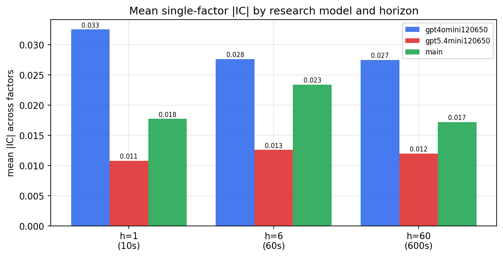

*Mean |IC| by research model and horizon*

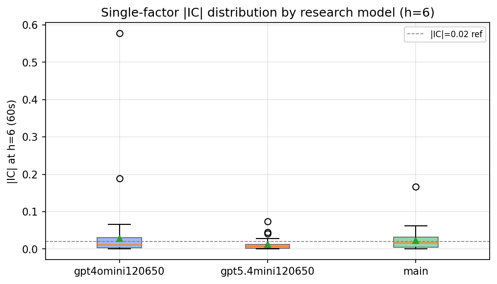

*Per-factor |IC| distribution by research model*

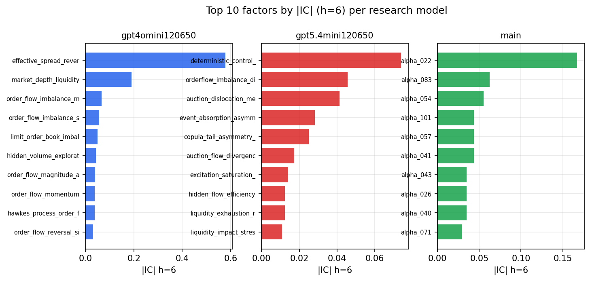

*Top factors by |IC| per research model*

## 2. Factor diversity & redundancy

Pairwise correlation of each zoo's *signals*. `eff_n_factors` is the effective number of independent factors (participation ratio of the correlation eigenvalues); `eff_ratio` and `redundancy` summarise how much unique information the zoo holds vs. how much is duplicated; `n_clusters` groups factors at |corr| ≥ 0.7.

| prerun | n_factors | eff_n_factors | eff_ratio | mean_abs_corr | n_clusters | redundancy |
| --- | --- | --- | --- | --- | --- | --- |
| gpt4omini120650 | 66 | 34.8264 | 0.5277 | 0.0443 | 55 | 0.4723 |
| gpt5.4mini120650 | 68 | 59.462 | 0.8744 | 0.0066 | 65 | 0.1256 |
| main | 76 | 38.8791 | 0.5116 | 0.0354 | 57 | 0.4884 |

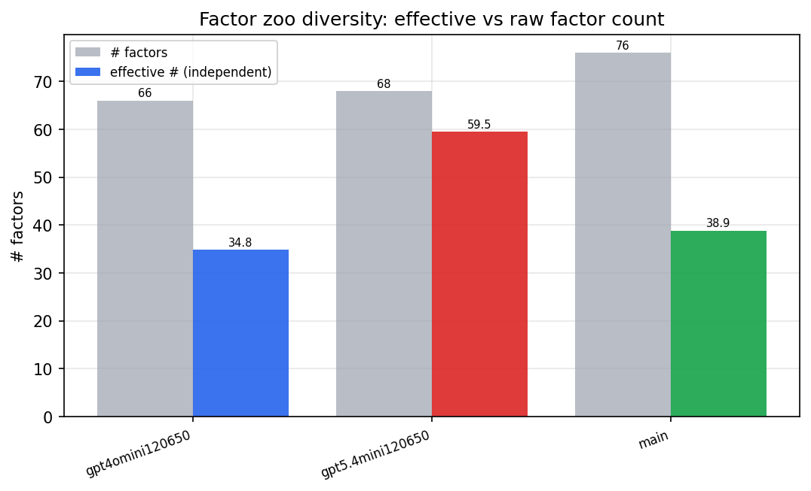

*Effective vs raw factor count per research model*

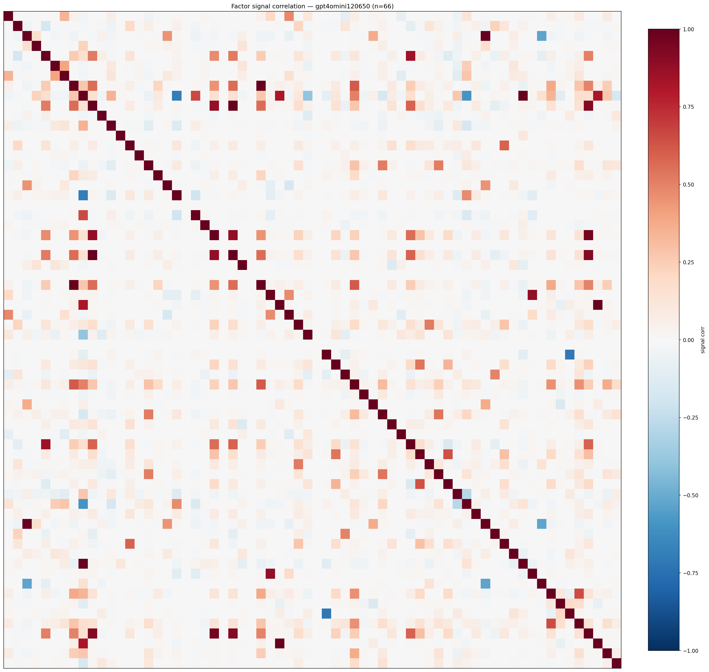

*Signal correlation matrix — gpt4omini120650*

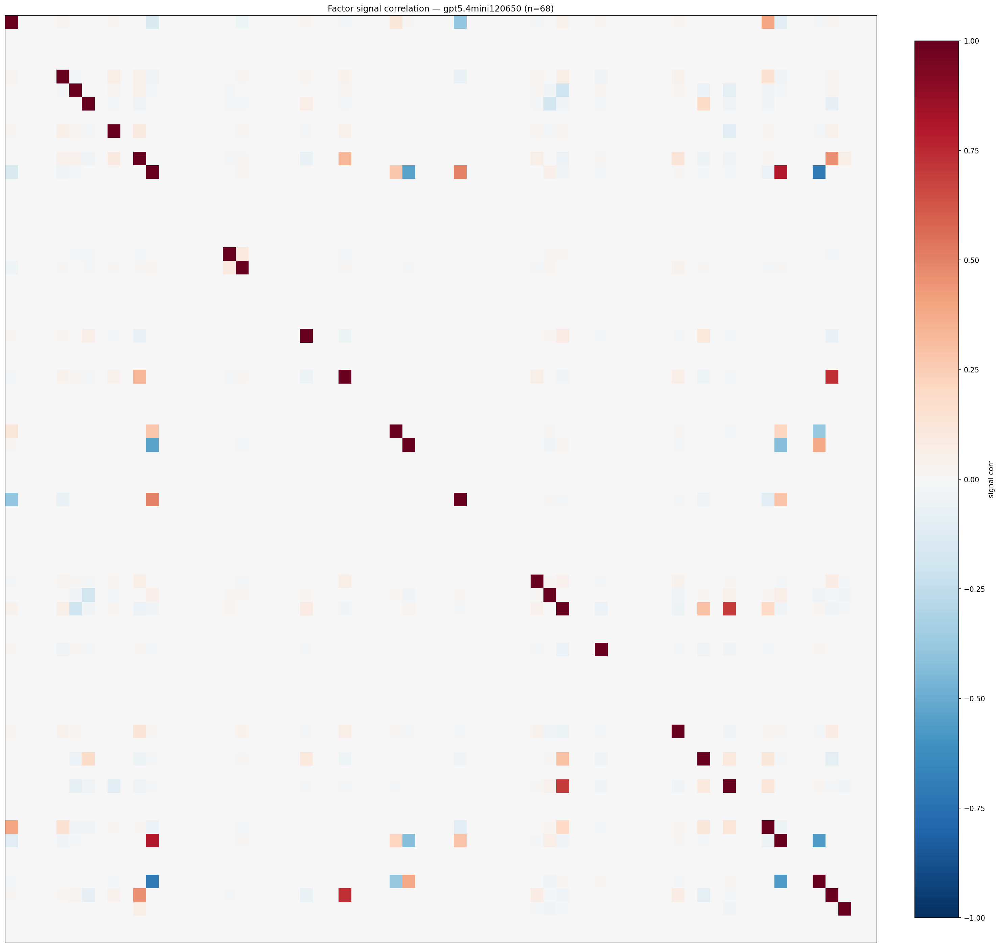

*Signal correlation matrix — gpt5.4mini120650*

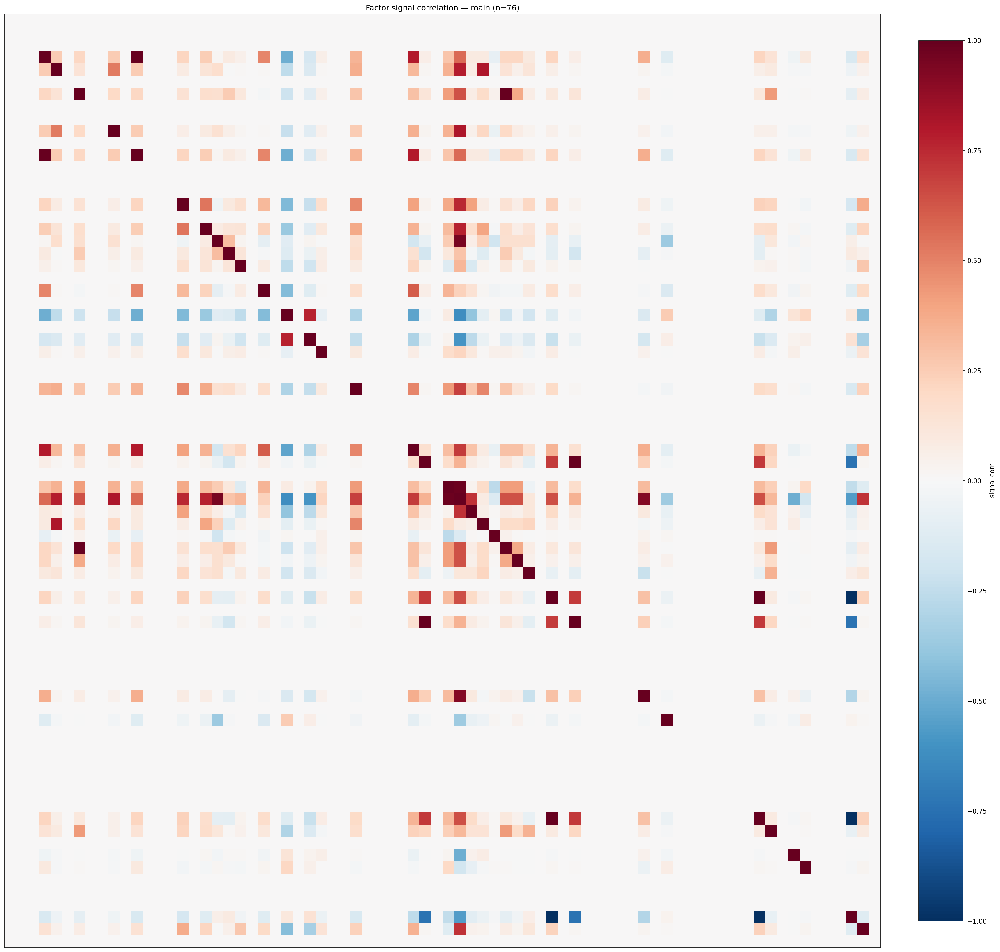

*Signal correlation matrix — main*

## 3. Deflation & model-based importance

`deflated_best_ic` haircuts each zoo's best |IC| for the number of factors tried (`ic_n_tested`) — a bigger zoo's best factor is more likely to be lucky. `lasso_n_nonzero` / `lasso_sparsity` show how many factors a sparse linear model actually keeps (model-view redundancy).

| prerun | best_ic | deflated_best_ic | deflated_best_t | ic_n_tested | ic_n_obs | lasso_n_nonzero | lasso_sparsity |
| --- | --- | --- | --- | --- | --- | --- | --- |
| gpt4omini120650 | 0.5774 | 0.5699 | 219.7414 | 63 | 148679 | 0 | 1.0 |
| gpt5.4mini120650 | 0.074 | 0.0673 | 25.9412 | 28 | 148679 | 1 | 0.9853 |
| main | 0.1673 | 0.1604 | 61.835 | 35 | 148679 | 32 | 0.5789 |

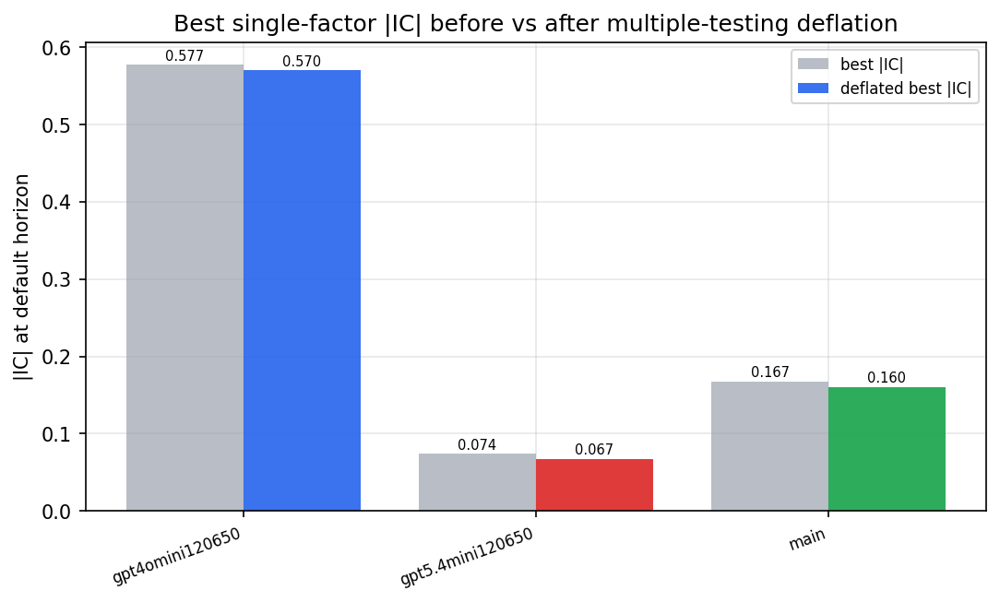

*Best |IC| before vs after multiple-testing deflation*

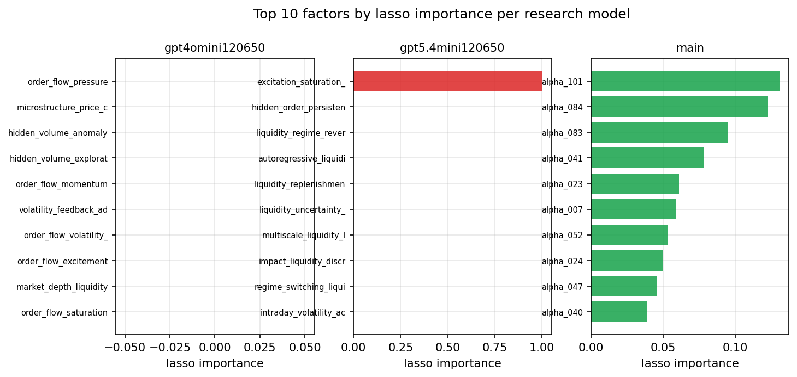

*Top factors by lasso importance per zoo*

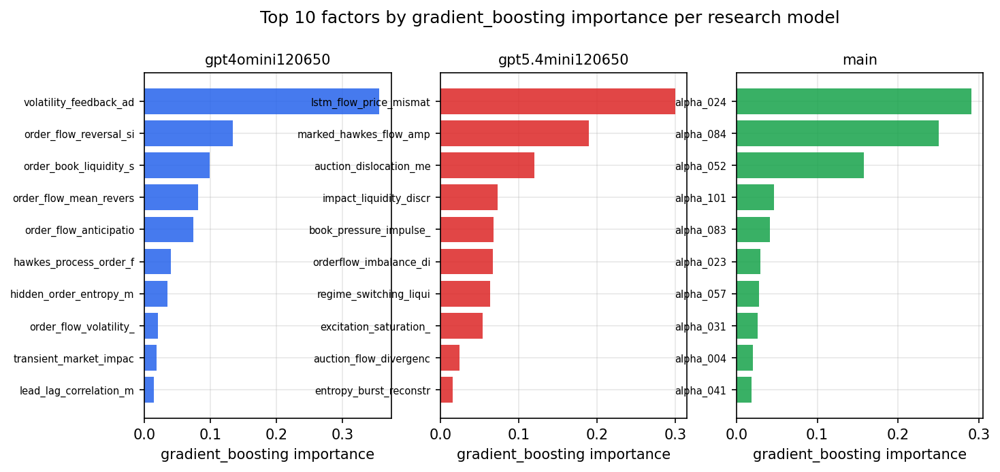

*Top factors by gradient_boosting importance per zoo*

## 4. ML-combined signal — per-underlying vectorised backtest

Each model combines a prerun's factors into ONE signal (fit `factors → forward return` on IS, predict per (bar, underlying)), then that combined signal is run through a simple vectorised backtest — `position(signal) × the underlying's own forward return` — on the held-out OOS tail (+ an equal-weight ensemble). No cross-sectional ranking.

> Config: position=**threshold** (t=1.0, z-score `expanding`), aggregation=**portfolio**, fit-standardise=**per_underlying**, horizon=6.

| prerun | model | n_factors_used | oos_ic | oos_sharpe | is_sharpe | oos_ann_return | oos_max_drawdown |
| --- | --- | --- | --- | --- | --- | --- | --- |
| gpt4omini120650 | linear_regression | 66 | 0.0379 | 5.8732 | 10.3585 | 0.5299 | -0.0133 |
| gpt4omini120650 | ridge | 66 | 0.0438 | 6.4359 | 9.5441 | 0.5774 | -0.0132 |
| gpt4omini120650 | lasso | 66 | 0.0617 | 5.163 | 6.1067 | 0.1549 | -0.0022 |
| gpt4omini120650 | elastic_net | 66 | 0.0346 | 13.4818 | 9.9374 | 0.5202 | -0.0037 |
| gpt4omini120650 | random_forest | 66 | 0.052 | -1.7295 | 7.9954 | -0.1387 | -0.0289 |
| gpt4omini120650 | gradient_boosting | 66 | 0.0259 | 6.0251 | 10.9378 | 0.343 | -0.0061 |
| gpt4omini120650 | xgboost | 66 | 0.0487 | 5.7801 | 14.2476 | 0.302 | -0.0039 |
| gpt4omini120650 | lightgbm | 66 | 0.0657 | 7.772 | 16.0183 | 0.4743 | -0.0038 |
| gpt4omini120650 | ensemble | 66 | 0.0532 | 10.2828 | 15.1667 | 0.5219 | -0.0032 |
| gpt5.4mini120650 | linear_regression | 68 | 0.0801 | 6.2753 | 5.2827 | 0.3327 | -0.016 |
| gpt5.4mini120650 | ridge | 68 | 0.0797 | 6.3667 | 5.2248 | 0.335 | -0.0158 |
| gpt5.4mini120650 | lasso | 68 | nan | nan | -2.5666 | nan | nan |
| gpt5.4mini120650 | elastic_net | 68 | 0.0759 | 3.2619 | 2.5781 | 0.1177 | -0.0136 |
| gpt5.4mini120650 | random_forest | 68 | 0.0588 | 4.7255 | 9.6339 | 0.4299 | -0.0193 |
| gpt5.4mini120650 | gradient_boosting | 68 | 0.0564 | 3.9477 | 9.8162 | 0.243 | -0.0094 |
| gpt5.4mini120650 | xgboost | 68 | 0.0305 | 3.117 | 9.851 | 0.1826 | -0.0093 |
| gpt5.4mini120650 | lightgbm | 68 | 0.0312 | -1.1485 | 14.9441 | -0.091 | -0.0229 |
| gpt5.4mini120650 | ensemble | 68 | 0.0653 | 5.056 | 12.0216 | 0.3822 | -0.015 |
| main | linear_regression | 76 | 0.0114 | 4.9731 | 9.7542 | 0.4271 | -0.0138 |
| main | ridge | 76 | 0.0125 | 4.9501 | 9.671 | 0.4253 | -0.0143 |
| main | lasso | 76 | 0.0276 | 4.8112 | 9.6051 | 0.4145 | -0.0158 |
| main | elastic_net | 76 | 0.0335 | 5.1134 | 9.6029 | 0.4407 | -0.015 |
| main | random_forest | 76 | 0.0124 | 2.9852 | 11.0392 | 0.2548 | -0.0149 |
| main | gradient_boosting | 76 | -0.007 | 5.9326 | 11.5937 | 0.2346 | -0.0055 |
| main | xgboost | 76 | 0.0099 | 2.953 | 11.8666 | 0.2265 | -0.012 |
| main | lightgbm | 76 | 0.0328 | 5.9417 | 13.0009 | 0.2207 | -0.0055 |
| main | ensemble | 76 | 0.0176 | 3.2871 | 11.5826 | 0.2757 | -0.0159 |

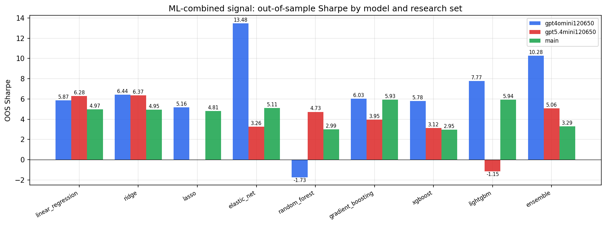

*ML-combined OOS Sharpe by model and research set*

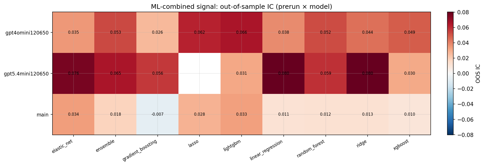

*ML-combined OOS IC (prerun × model)*

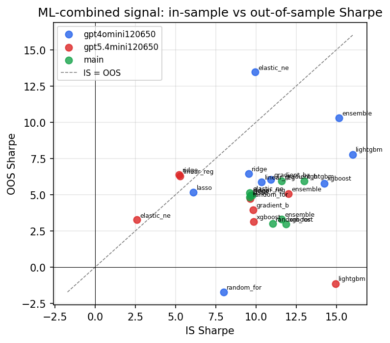

*IS vs OOS Sharpe (overfitting diagnostic)*

---
*Generated by `run_model_comparison.py`. Tables: `*.csv`; interactive: `comparison.ipynb`.*
