# Research-LLM factor comparison — `2025-10`

Comparing the **factor output of different research LLMs** on three axes (raw factor quality → factors as ML features → factors through the full agentic fund). The panel, IS/OOS split, horizon and model hyper-parameters are held identical across preruns — the *only* variable is the factor set.

## Preruns compared

| prerun | research_model | usable_factors | dropped_factors |
| --- | --- | --- | --- |
| gpt4omini120650 | gpt-4o-mini | 65 | 1 |
| gpt5.4mini120650 | gpt-5.4-mini | 68 | 1 |
| main | seed library | 76 | 12 |

> Dropped factors declare fields the current data doesn't have yet (e.g. fundamentals); they light up unchanged once that data is downloaded.

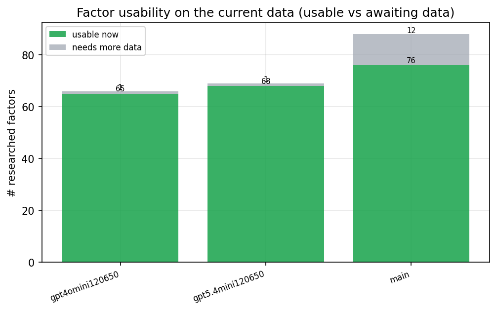

*Usable vs awaiting-data factors per research model*

## Key findings

- **Best ML-combined OOS Sharpe:** `gpt5.4mini120650` with `ensemble` (OOS Sharpe = 26.826).
- **Mean OOS Sharpe across models, by research set:** `gpt5.4mini120650` = 19.662, `gpt4omini120650` = 9.541, `main` = 8.487.
- **Highest mean single-factor |IC| (h=6):** `main` (mean |IC| = 0.0371).
- **Most diverse zoo (highest effective/raw factor ratio):** `gpt5.4mini120650` (eff 60.6 of 68, ratio 0.89).
- **Best selection-deflated single-factor |IC|:** `gpt4omini120650` (deflated |IC| = 0.1446 from 62 factors tried).

## 1. Single-factor IC (raw factor quality)

Per-underlying time-series Spearman rank-IC of every researched factor, recomputed on the shared panel at horizons h=1, h=6, h=60. The per-underlying IC correlates each factor's value vector with the underlying's own forward-return vector (pooled across underlyings); the cross-sectional IC ranks across underlyings per timestamp.

| prerun | n_factors | mean_abs_ic_1 | mean_abs_ic_6 | mean_abs_ic_60 | mean_abs_icir_6 | best_factor_h6 | best_abs_ic_h6 |
| --- | --- | --- | --- | --- | --- | --- | --- |
| gpt4omini120650 | 65 | 0.0187 | 0.0198 | 0.0218 | 0.4477 | market_depth_liquidity_risk | 0.152 |
| gpt5.4mini120650 | 68 | 0.0132 | 0.0148 | 0.0128 | 0.4911 | deterministic_control_gap | 0.0709 |
| main | 76 | 0.0312 | 0.0371 | 0.0208 | 0.543 | alpha_083 | 0.0911 |

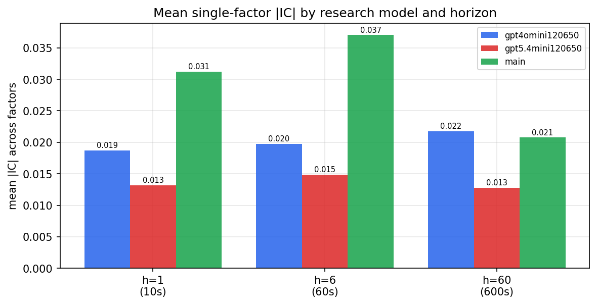

*Mean |IC| by research model and horizon*

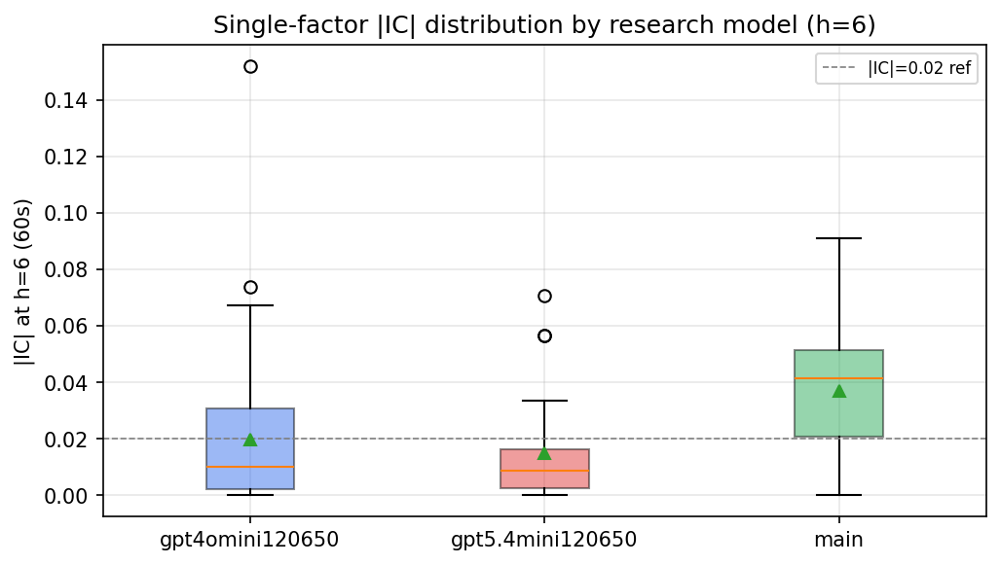

*Per-factor |IC| distribution by research model*

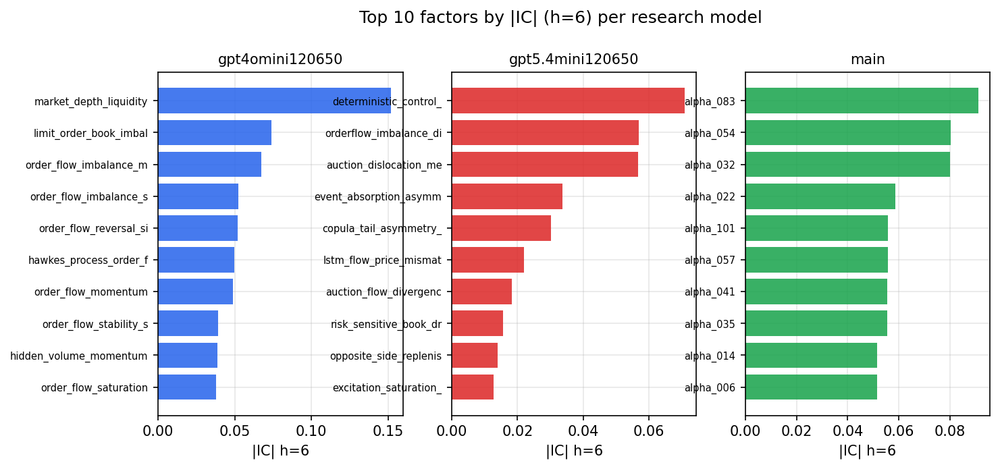

*Top factors by |IC| per research model*

## 2. Factor diversity & redundancy

Pairwise correlation of each zoo's *signals*. `eff_n_factors` is the effective number of independent factors (participation ratio of the correlation eigenvalues); `eff_ratio` and `redundancy` summarise how much unique information the zoo holds vs. how much is duplicated; `n_clusters` groups factors at |corr| ≥ 0.7.

| prerun | n_factors | eff_n_factors | eff_ratio | mean_abs_corr | n_clusters | redundancy |
| --- | --- | --- | --- | --- | --- | --- |
| gpt4omini120650 | 65 | 32.9402 | 0.5068 | 0.0465 | 53 | 0.4932 |
| gpt5.4mini120650 | 68 | 60.6426 | 0.8918 | 0.0056 | 66 | 0.1082 |
| main | 76 | 38.6257 | 0.5082 | 0.037 | 60 | 0.4918 |

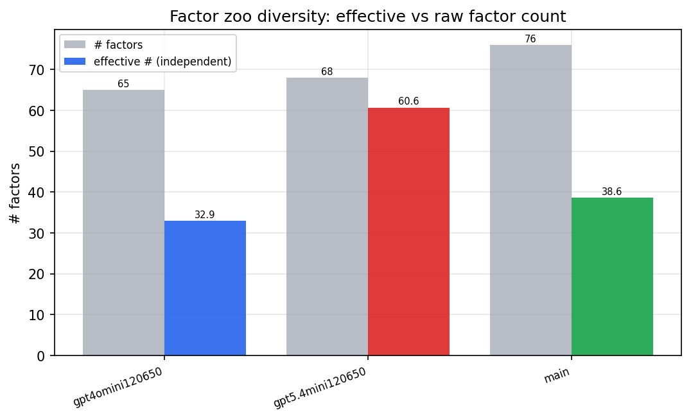

*Effective vs raw factor count per research model*

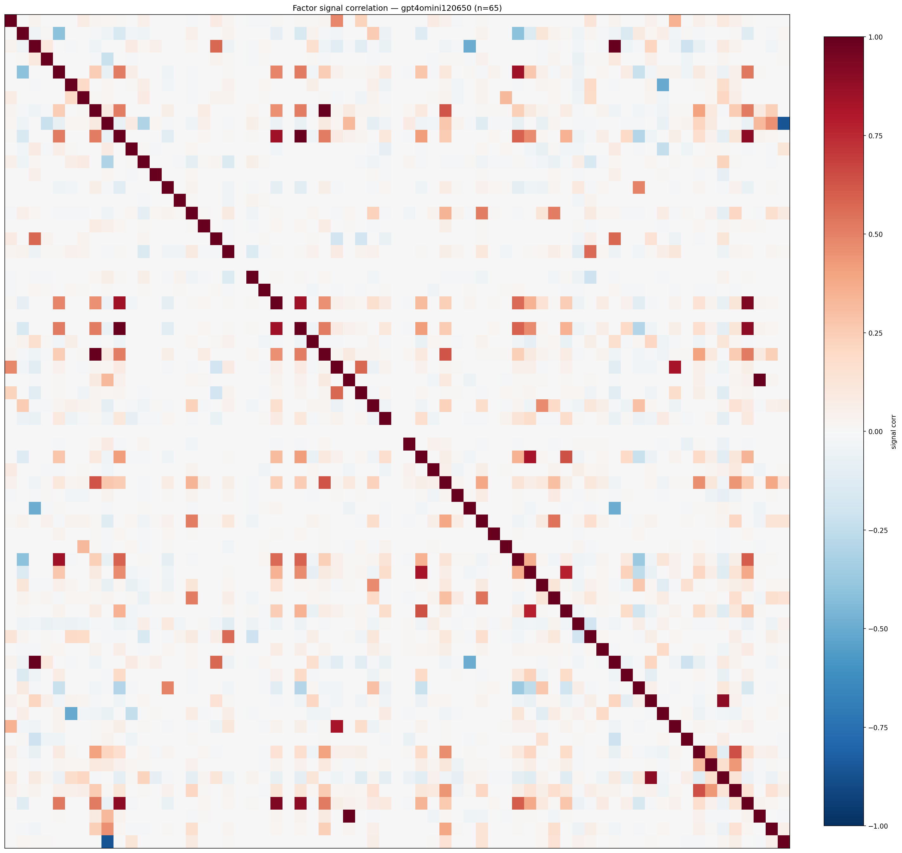

*Signal correlation matrix — gpt4omini120650*

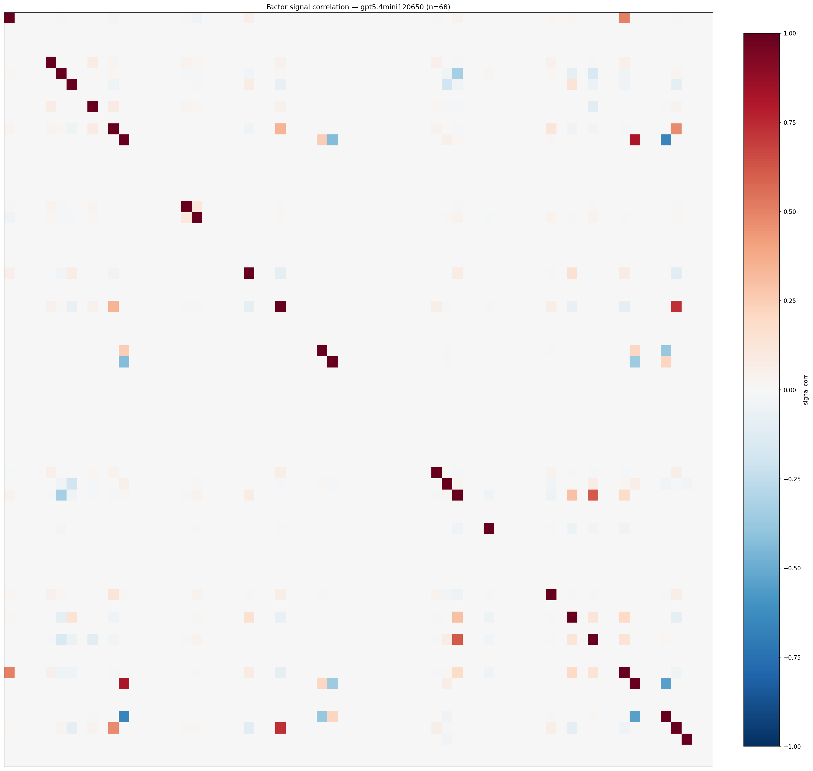

*Signal correlation matrix — gpt5.4mini120650*

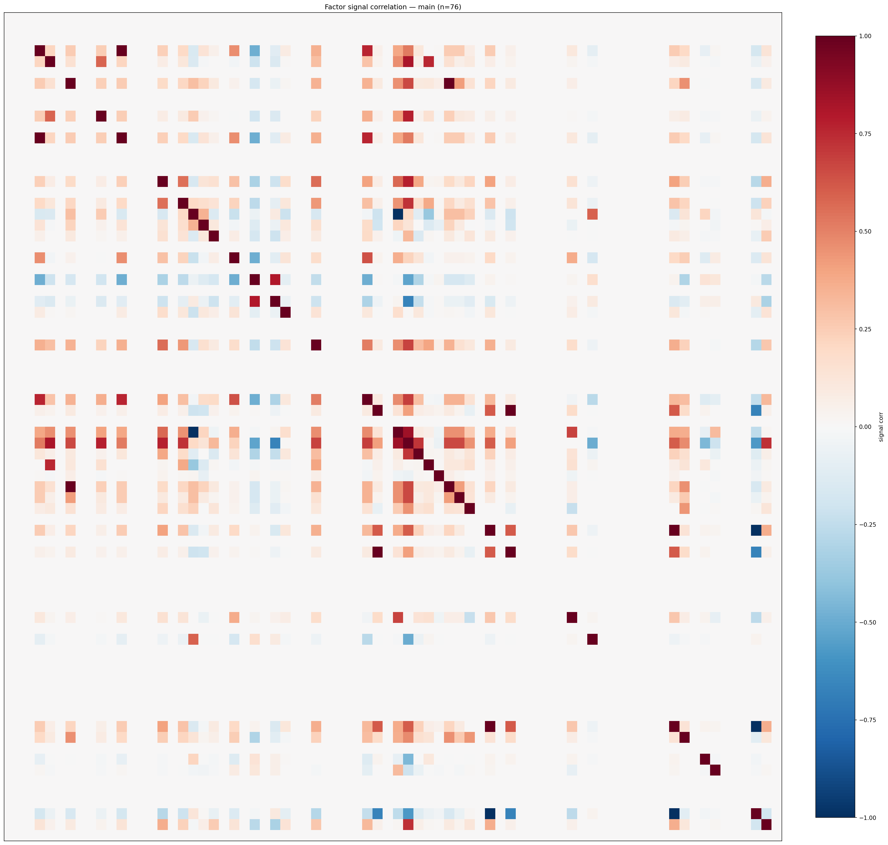

*Signal correlation matrix — main*

## 3. Deflation & model-based importance

`deflated_best_ic` haircuts each zoo's best |IC| for the number of factors tried (`ic_n_tested`) — a bigger zoo's best factor is more likely to be lucky. `lasso_n_nonzero` / `lasso_sparsity` show how many factors a sparse linear model actually keeps (model-view redundancy).

| prerun | best_ic | deflated_best_ic | deflated_best_t | ic_n_tested | ic_n_obs | lasso_n_nonzero | lasso_sparsity |
| --- | --- | --- | --- | --- | --- | --- | --- |
| gpt4omini120650 | 0.152 | 0.1446 | 56.3968 | 62 | 152099 | 0 | 1.0 |
| gpt5.4mini120650 | 0.0709 | 0.0643 | 25.0751 | 28 | 152099 | 11 | 0.8382 |
| main | 0.0911 | 0.0843 | 32.8617 | 35 | 152099 | 22 | 0.7105 |

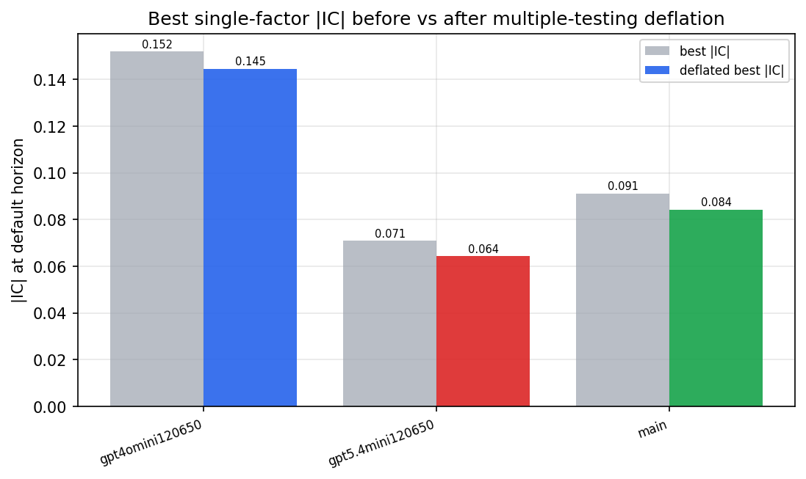

*Best |IC| before vs after multiple-testing deflation*

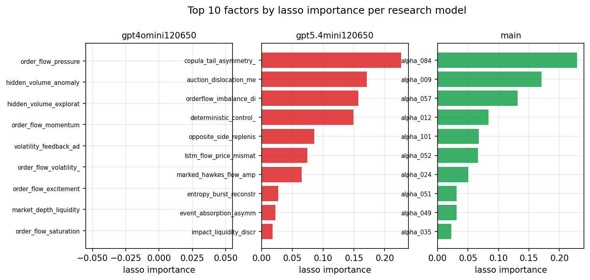

*Top factors by lasso importance per zoo*

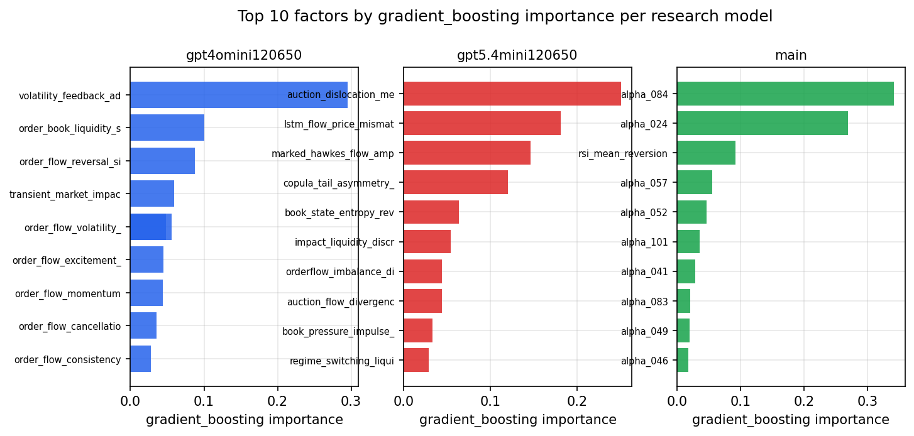

*Top factors by gradient_boosting importance per zoo*

## 4. ML-combined signal — per-underlying vectorised backtest

Each model combines a prerun's factors into ONE signal (fit `factors → forward return` on IS, predict per (bar, underlying)), then that combined signal is run through a simple vectorised backtest — `position(signal) × the underlying's own forward return` — on the held-out OOS tail (+ an equal-weight ensemble). No cross-sectional ranking.

> Config: position=**threshold** (t=1.0, z-score `expanding`), aggregation=**portfolio**, fit-standardise=**per_underlying**, horizon=6.

| prerun | model | n_factors_used | oos_ic | oos_sharpe | is_sharpe | oos_ann_return | oos_max_drawdown |
| --- | --- | --- | --- | --- | --- | --- | --- |
| gpt4omini120650 | linear_regression | 65 | 0.0339 | 11.0286 | 8.4605 | 0.3843 | -0.004 |
| gpt4omini120650 | ridge | 65 | 0.0335 | 11.5196 | 8.6073 | 0.4078 | -0.0033 |
| gpt4omini120650 | lasso | 65 | 0.0218 | 14.4262 | 7.8162 | 0.597 | -0.0045 |
| gpt4omini120650 | elastic_net | 65 | 0.0219 | 14.5497 | 7.9623 | 0.607 | -0.0046 |
| gpt4omini120650 | random_forest | 65 | 0.0435 | 9.768 | 9.6376 | 0.3148 | -0.0053 |
| gpt4omini120650 | gradient_boosting | 65 | 0.0226 | 1.5332 | 11.7286 | 0.0132 | -0.0026 |
| gpt4omini120650 | xgboost | 65 | 0.0517 | 6.2862 | 12.589 | 0.0882 | -0.0023 |
| gpt4omini120650 | lightgbm | 65 | 0.047 | 3.8775 | 14.5638 | 0.0626 | -0.0027 |
| gpt4omini120650 | ensemble | 65 | 0.0326 | 12.8827 | 13.7454 | 0.3642 | -0.0023 |
| gpt5.4mini120650 | linear_regression | 68 | 0.0855 | 25.5132 | 9.1377 | 1.2097 | -0.004 |
| gpt5.4mini120650 | ridge | 68 | 0.0853 | 25.445 | 8.4979 | 1.2047 | -0.0041 |
| gpt5.4mini120650 | lasso | 68 | 0.083 | 18.1556 | 7.2696 | 0.9069 | -0.0069 |
| gpt5.4mini120650 | elastic_net | 68 | 0.083 | 18.1689 | 7.3494 | 0.9043 | -0.0069 |
| gpt5.4mini120650 | random_forest | 68 | 0.0907 | 23.9477 | 16.5951 | 1.2371 | -0.0043 |
| gpt5.4mini120650 | gradient_boosting | 68 | 0.0865 | 11.6101 | 10.3 | 0.2326 | -0.0026 |
| gpt5.4mini120650 | xgboost | 68 | 0.0791 | 18.0996 | 13.3906 | 0.5633 | -0.0028 |
| gpt5.4mini120650 | lightgbm | 68 | 0.0799 | 9.1924 | 13.199 | 0.1916 | -0.0023 |
| gpt5.4mini120650 | ensemble | 68 | 0.0885 | 26.8259 | 16.0549 | 1.2883 | -0.0041 |
| main | linear_regression | 76 | 0.0261 | 12.2726 | 9.8292 | 0.282 | -0.0065 |
| main | ridge | 76 | 0.0266 | 13.327 | 9.6665 | 0.3051 | -0.0062 |
| main | lasso | 76 | 0.0272 | 13.1123 | 9.3621 | 0.3011 | -0.0056 |
| main | elastic_net | 76 | 0.0283 | 13.5085 | 9.302 | 0.3113 | -0.0055 |
| main | random_forest | 76 | 0.076 | 13.068 | 8.9715 | 0.226 | -0.0018 |
| main | gradient_boosting | 76 | 0.0565 | -3.0007 | 9.9641 | -0.0082 | -0.0011 |
| main | xgboost | 76 | 0.0646 | 0.0093 | 9.8611 | 0.0 | -0.0006 |
| main | lightgbm | 76 | 0.0727 | -0.0938 | 11.6255 | -0.0006 | -0.0021 |
| main | ensemble | 76 | 0.041 | 14.182 | 9.6998 | 0.2143 | -0.0021 |

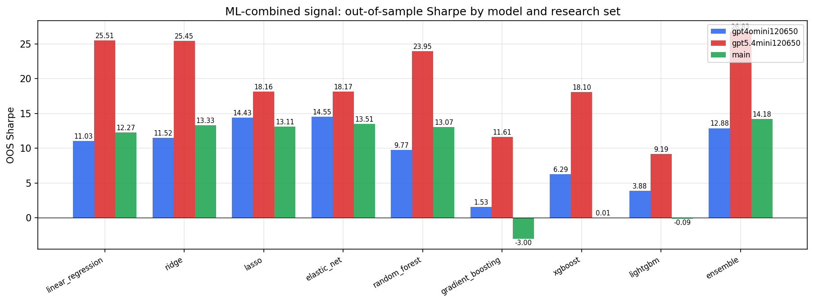

*ML-combined OOS Sharpe by model and research set*

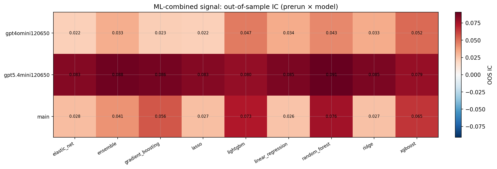

*ML-combined OOS IC (prerun × model)*

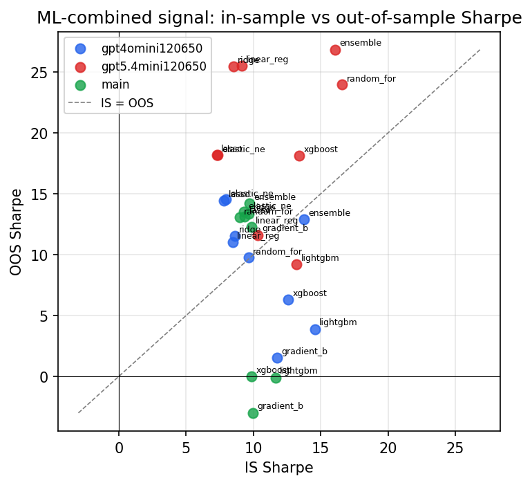

*IS vs OOS Sharpe (overfitting diagnostic)*

---
*Generated by `run_model_comparison.py`. Tables: `*.csv`; interactive: `comparison.ipynb`.*
