# Research-LLM factor comparison — `2025-11`

Comparing the **factor output of different research LLMs** on three axes (raw factor quality → factors as ML features → factors through the full agentic fund). The panel, IS/OOS split, horizon and model hyper-parameters are held identical across preruns — the *only* variable is the factor set.

## Preruns compared

| prerun | research_model | usable_factors | dropped_factors |
| --- | --- | --- | --- |
| gpt4omini120650 | gpt-4o-mini | 66 | 0 |
| gpt5.4mini120650 | gpt-5.4-mini | 68 | 1 |
| main | seed library | 76 | 12 |

> Dropped factors declare fields the current data doesn't have yet (e.g. fundamentals); they light up unchanged once that data is downloaded.

*Usable vs awaiting-data factors per research model*

## Key findings

- **Best ML-combined OOS Sharpe:** `gpt5.4mini120650` with `ensemble` (OOS Sharpe = 30.374).
- **Mean OOS Sharpe across models, by research set:** `gpt5.4mini120650` = 27.275, `gpt4omini120650` = 16.357, `main` = 15.785.
- **Highest mean single-factor |IC| (h=6):** `main` (mean |IC| = 0.0495).
- **Most diverse zoo (highest effective/raw factor ratio):** `gpt5.4mini120650` (eff 55.8 of 68, ratio 0.82).
- **Best selection-deflated single-factor |IC|:** `gpt4omini120650` (deflated |IC| = 0.1214 from 62 factors tried).

## 1. Single-factor IC (raw factor quality)

Per-underlying time-series Spearman rank-IC of every researched factor, recomputed on the shared panel at horizons h=1, h=6, h=60. The per-underlying IC correlates each factor's value vector with the underlying's own forward-return vector (pooled across underlyings); the cross-sectional IC ranks across underlyings per timestamp.

| prerun | n_factors | mean_abs_ic_1 | mean_abs_ic_6 | mean_abs_ic_60 | mean_abs_icir_6 | best_factor_h6 | best_abs_ic_h6 |
| --- | --- | --- | --- | --- | --- | --- | --- |
| gpt4omini120650 | 66 | 0.0199 | 0.0227 | 0.0216 | 0.666 | market_depth_liquidity_risk | 0.1289 |
| gpt5.4mini120650 | 68 | 0.0146 | 0.017 | 0.0135 | 0.7547 | deterministic_control_gap | 0.0855 |
| main | 76 | 0.0417 | 0.0495 | 0.0339 | 0.8941 | alpha_032 | 0.1175 |

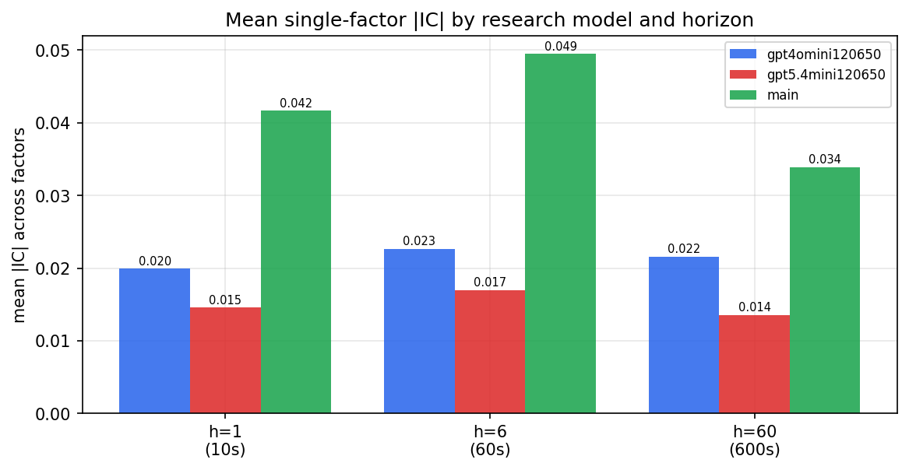

*Mean |IC| by research model and horizon*

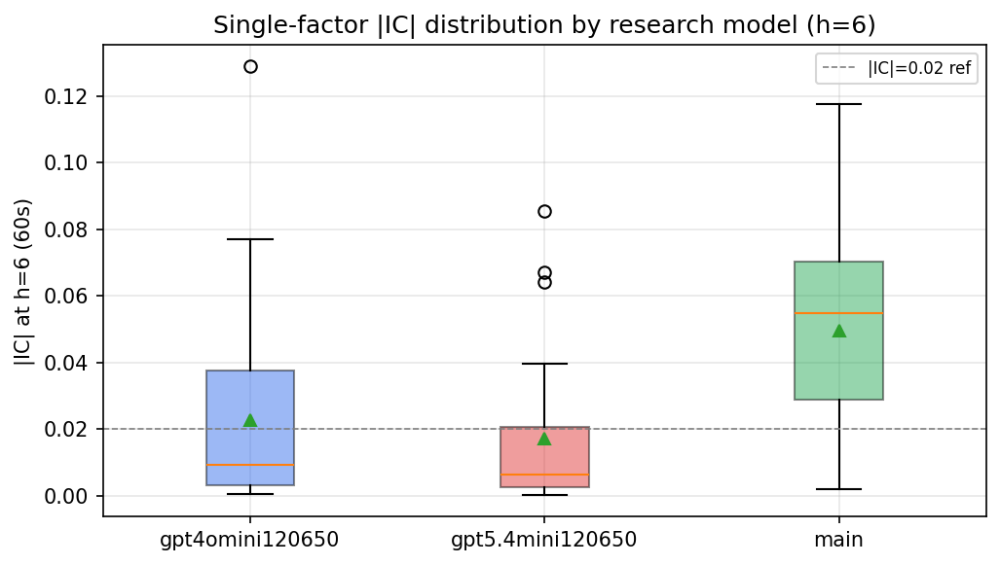

*Per-factor |IC| distribution by research model*

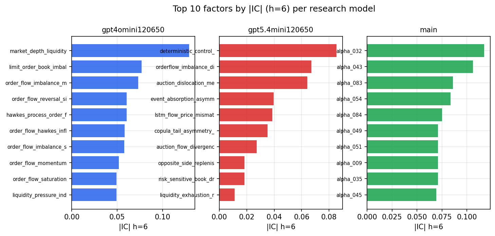

*Top factors by |IC| per research model*

## 2. Factor diversity & redundancy

Pairwise correlation of each zoo's *signals*. `eff_n_factors` is the effective number of independent factors (participation ratio of the correlation eigenvalues); `eff_ratio` and `redundancy` summarise how much unique information the zoo holds vs. how much is duplicated; `n_clusters` groups factors at |corr| ≥ 0.7.

| prerun | n_factors | eff_n_factors | eff_ratio | mean_abs_corr | n_clusters | redundancy |
| --- | --- | --- | --- | --- | --- | --- |
| gpt4omini120650 | 66 | 32.763 | 0.4964 | 0.0459 | 53 | 0.5036 |
| gpt5.4mini120650 | 68 | 55.8307 | 0.821 | 0.0082 | 63 | 0.179 |
| main | 76 | 36.8777 | 0.4852 | 0.0391 | 65 | 0.5148 |

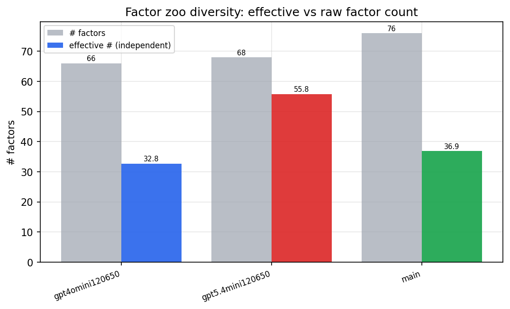

*Effective vs raw factor count per research model*

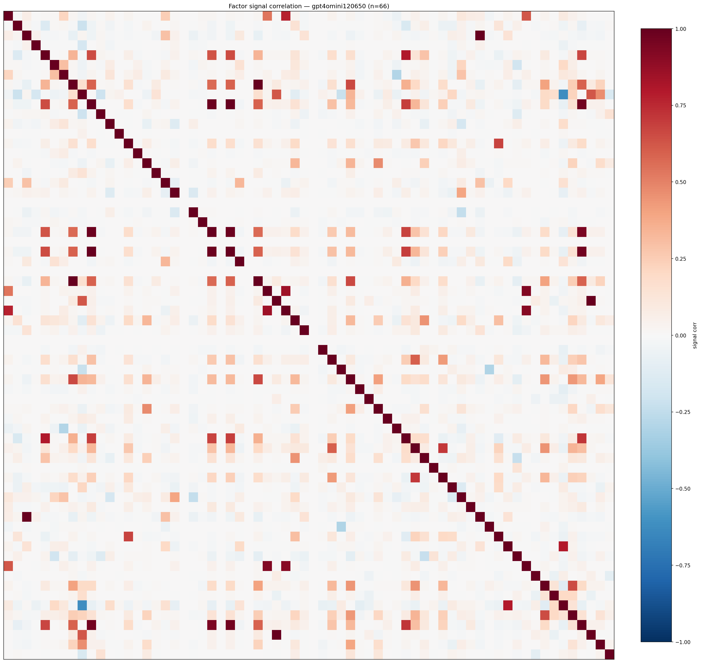

*Signal correlation matrix — gpt4omini120650*

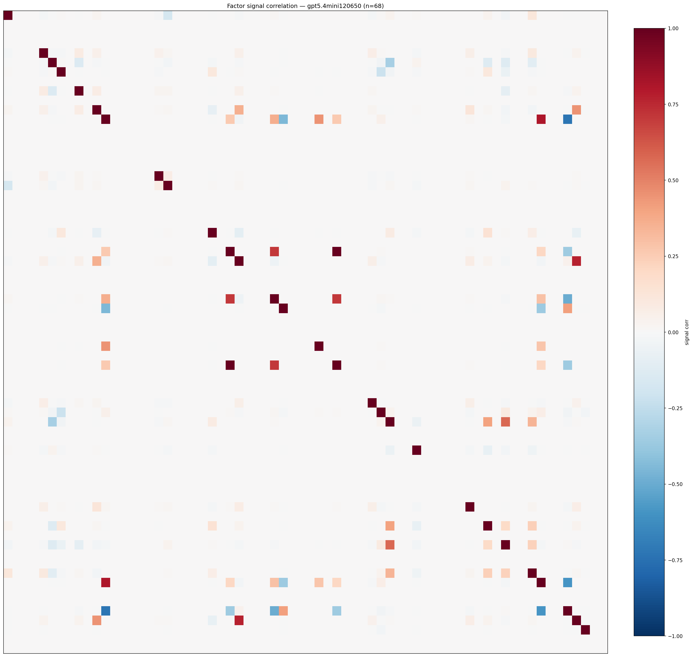

*Signal correlation matrix — gpt5.4mini120650*

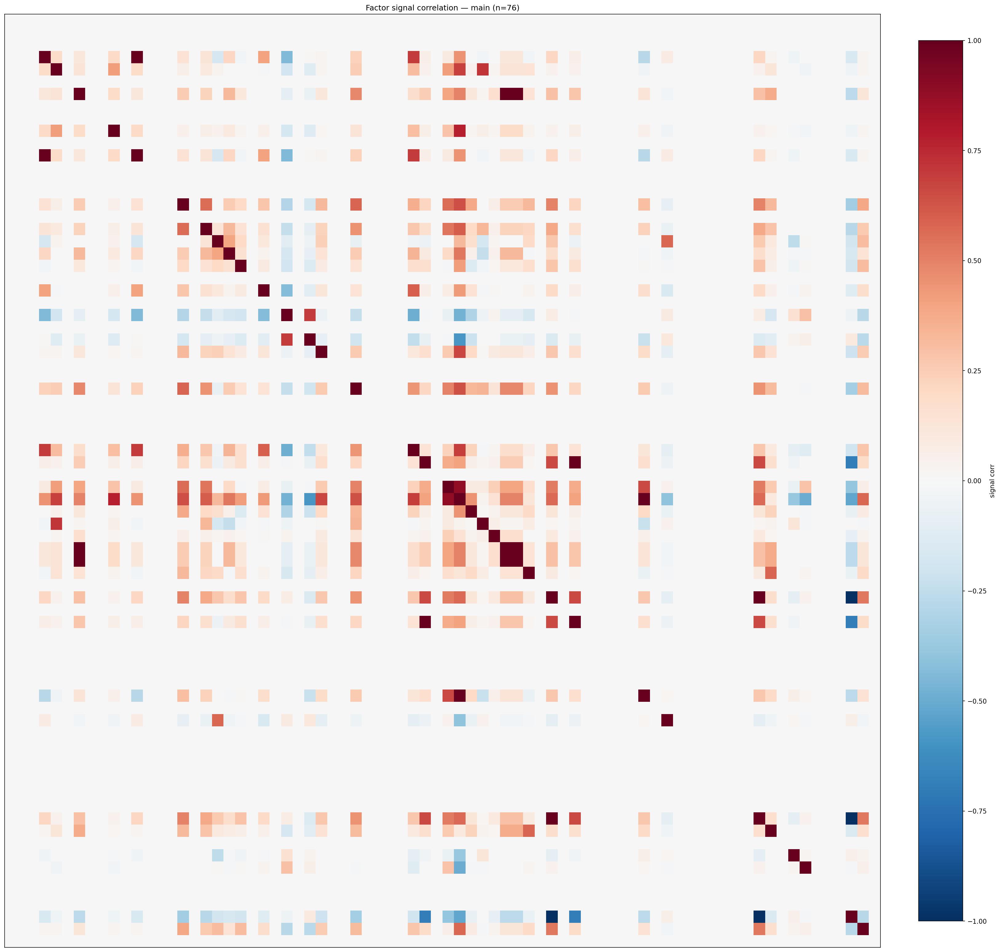

*Signal correlation matrix — main*

## 3. Deflation & model-based importance

`deflated_best_ic` haircuts each zoo's best |IC| for the number of factors tried (`ic_n_tested`) — a bigger zoo's best factor is more likely to be lucky. `lasso_n_nonzero` / `lasso_sparsity` show how many factors a sparse linear model actually keeps (model-view redundancy).

| prerun | best_ic | deflated_best_ic | deflated_best_t | ic_n_tested | ic_n_obs | lasso_n_nonzero | lasso_sparsity |
| --- | --- | --- | --- | --- | --- | --- | --- |
| gpt4omini120650 | 0.1289 | 0.1214 | 46.4361 | 62 | 146339 | 15 | 0.7727 |
| gpt5.4mini120650 | 0.0855 | 0.0788 | 30.126 | 28 | 146339 | 13 | 0.8088 |
| main | 0.1175 | 0.1105 | 42.2736 | 35 | 146339 | 0 | 1.0 |

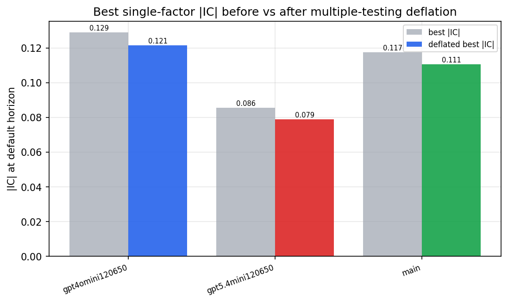

*Best |IC| before vs after multiple-testing deflation*

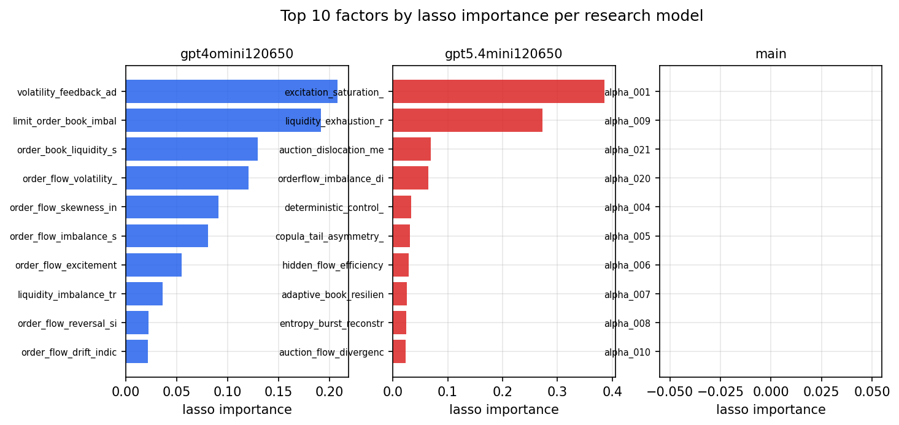

*Top factors by lasso importance per zoo*

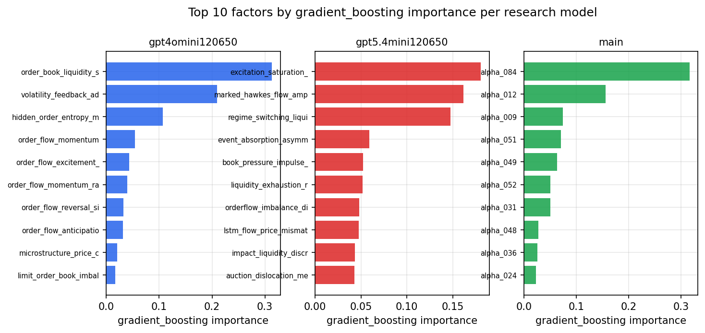

*Top factors by gradient_boosting importance per zoo*

## 4. ML-combined signal — per-underlying vectorised backtest

Each model combines a prerun's factors into ONE signal (fit `factors → forward return` on IS, predict per (bar, underlying)), then that combined signal is run through a simple vectorised backtest — `position(signal) × the underlying's own forward return` — on the held-out OOS tail (+ an equal-weight ensemble). No cross-sectional ranking.

> Config: position=**threshold** (t=1.0, z-score `expanding`), aggregation=**portfolio**, fit-standardise=**per_underlying**, horizon=6.

| prerun | model | n_factors_used | oos_ic | oos_sharpe | is_sharpe | oos_ann_return | oos_max_drawdown |
| --- | --- | --- | --- | --- | --- | --- | --- |
| gpt4omini120650 | linear_regression | 66 | 0.0608 | 14.0877 | 17.4535 | 0.6577 | -0.0029 |
| gpt4omini120650 | ridge | 66 | 0.0612 | 15.1588 | 17.4177 | 0.7008 | -0.0021 |
| gpt4omini120650 | lasso | 66 | 0.0643 | 21.9715 | 16.7034 | 1.2544 | -0.0033 |
| gpt4omini120650 | elastic_net | 66 | 0.0645 | 22.5616 | 16.2787 | 1.2007 | -0.0033 |
| gpt4omini120650 | random_forest | 66 | 0.0727 | 22.3787 | 17.8264 | 1.2521 | -0.0036 |
| gpt4omini120650 | gradient_boosting | 66 | 0.0681 | 5.2492 | 7.0896 | 0.0809 | -0.0028 |
| gpt4omini120650 | xgboost | 66 | 0.0784 | 15.0918 | 16.4056 | 0.8397 | -0.0038 |
| gpt4omini120650 | lightgbm | 66 | 0.0848 | 9.0362 | 17.6214 | 0.3965 | -0.0047 |
| gpt4omini120650 | ensemble | 66 | 0.0771 | 21.6738 | 20.5 | 1.278 | -0.0041 |
| gpt5.4mini120650 | linear_regression | 68 | 0.103 | 25.7099 | 11.7195 | 1.0089 | -0.0022 |
| gpt5.4mini120650 | ridge | 68 | 0.1031 | 28.9713 | 17.081 | 1.3809 | -0.0031 |
| gpt5.4mini120650 | lasso | 68 | 0.1035 | 26.0937 | 12.5488 | 0.9479 | -0.0027 |
| gpt5.4mini120650 | elastic_net | 68 | 0.1036 | 27.3941 | 15.3308 | 1.1661 | -0.003 |
| gpt5.4mini120650 | random_forest | 68 | 0.1092 | 29.8712 | 33.0227 | 1.7344 | -0.0045 |
| gpt5.4mini120650 | gradient_boosting | 68 | 0.1081 | 25.229 | 15.2362 | 0.7802 | -0.0022 |
| gpt5.4mini120650 | xgboost | 68 | 0.1159 | 24.1806 | 21.61 | 1.0669 | -0.0029 |
| gpt5.4mini120650 | lightgbm | 68 | 0.1163 | 27.6519 | 30.8579 | 1.2898 | -0.0032 |
| gpt5.4mini120650 | ensemble | 68 | 0.113 | 30.3744 | 23.8591 | 1.4537 | -0.0029 |
| main | linear_regression | 76 | 0.027 | 12.4636 | 14.494 | 0.6201 | -0.0112 |
| main | ridge | 76 | 0.0578 | 15.4437 | 12.9431 | 0.7669 | -0.0078 |
| main | lasso | 76 | 0.0771 | 20.5792 | 14.6401 | 0.9166 | -0.0048 |
| main | elastic_net | 76 | 0.0849 | 22.617 | 15.7279 | 0.9882 | -0.0041 |
| main | random_forest | 76 | 0.097 | 24.5767 | 24.417 | 1.348 | -0.004 |
| main | gradient_boosting | 76 | 0.0926 | 6.0229 | 6.9496 | 0.11 | -0.0039 |
| main | xgboost | 76 | 0.0939 | 13.163 | 8.5309 | 0.3063 | -0.0033 |
| main | lightgbm | 76 | 0.0728 | 7.0634 | 23.5032 | 0.3458 | -0.0082 |
| main | ensemble | 76 | 0.0852 | 20.1337 | 18.3908 | 0.848 | -0.0048 |

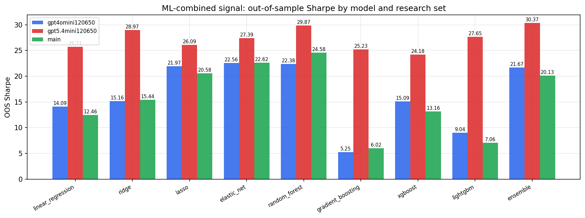

*ML-combined OOS Sharpe by model and research set*

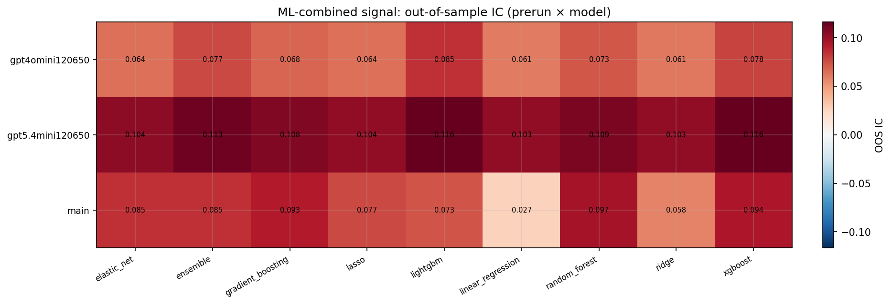

*ML-combined OOS IC (prerun × model)*

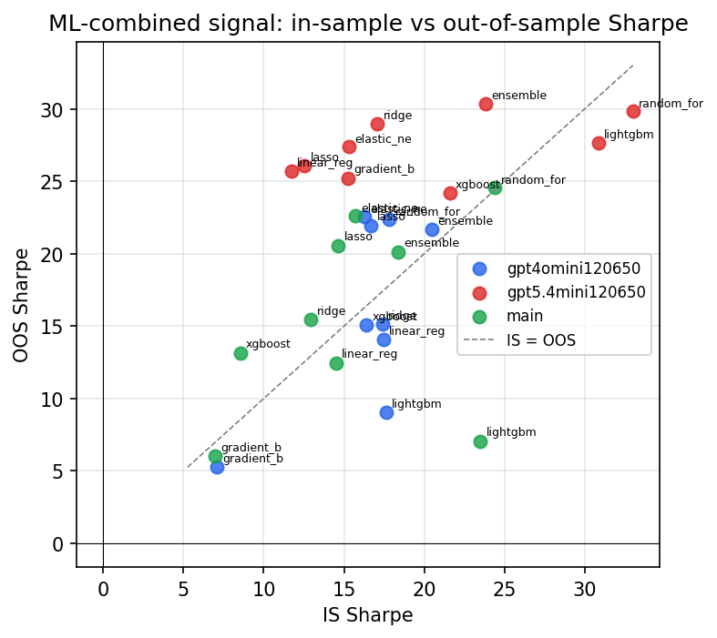

*IS vs OOS Sharpe (overfitting diagnostic)*

---
*Generated by `run_model_comparison.py`. Tables: `*.csv`; interactive: `comparison.ipynb`.*
