# Research-LLM factor comparison — `2025-12`

Comparing the **factor output of different research LLMs** on three axes (raw factor quality → factors as ML features → factors through the full agentic fund). The panel, IS/OOS split, horizon and model hyper-parameters are held identical across preruns — the *only* variable is the factor set.

## Preruns compared

| prerun | research_model | usable_factors | dropped_factors |
| --- | --- | --- | --- |
| gpt4omini120650 | gpt-4o-mini | 66 | 0 |
| gpt5.4mini120650 | gpt-5.4-mini | 68 | 1 |
| main | seed library | 76 | 12 |

> Dropped factors declare fields the current data doesn't have yet (e.g. fundamentals); they light up unchanged once that data is downloaded.

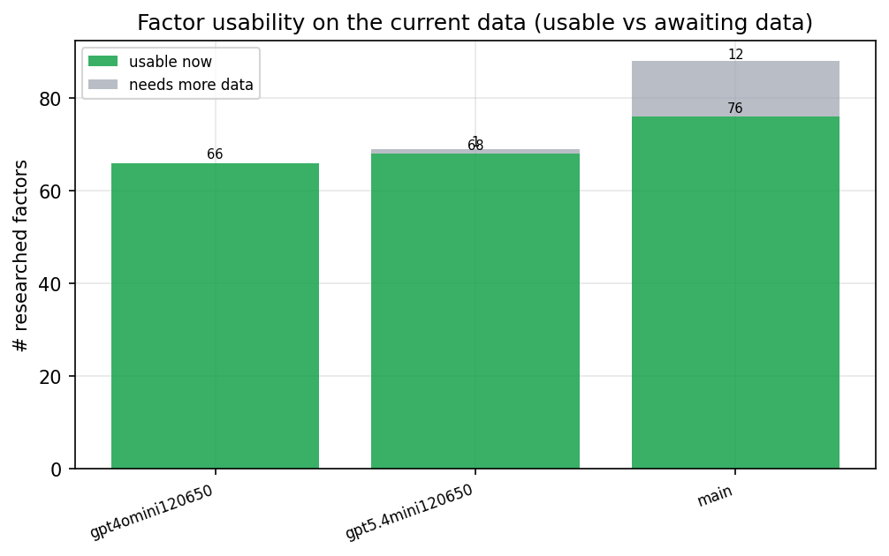

*Usable vs awaiting-data factors per research model*

## Key findings

- **Best ML-combined OOS Sharpe:** `gpt5.4mini120650` with `ensemble` (OOS Sharpe = 44.115).
- **Mean OOS Sharpe across models, by research set:** `gpt5.4mini120650` = 35.546, `main` = 29.746, `gpt4omini120650` = 26.381.
- **Highest mean single-factor |IC| (h=6):** `main` (mean |IC| = 0.0630).
- **Most diverse zoo (highest effective/raw factor ratio):** `gpt5.4mini120650` (eff 55.9 of 68, ratio 0.82).
- **Best selection-deflated single-factor |IC|:** `main` (deflated |IC| = 0.1480 from 35 factors tried).

## 1. Single-factor IC (raw factor quality)

Per-underlying time-series Spearman rank-IC of every researched factor, recomputed on the shared panel at horizons h=1, h=6, h=60. The per-underlying IC correlates each factor's value vector with the underlying's own forward-return vector (pooled across underlyings); the cross-sectional IC ranks across underlyings per timestamp.

| prerun | n_factors | mean_abs_ic_1 | mean_abs_ic_6 | mean_abs_ic_60 | mean_abs_icir_6 | best_factor_h6 | best_abs_ic_h6 |
| --- | --- | --- | --- | --- | --- | --- | --- |
| gpt4omini120650 | 66 | 0.0211 | 0.0219 | 0.0155 | 0.7373 | market_depth_liquidity_risk | 0.121 |
| gpt5.4mini120650 | 68 | 0.0148 | 0.0173 | 0.0145 | 0.727 | auction_dislocation_mean_reversion | 0.0892 |
| main | 76 | 0.0541 | 0.063 | 0.0436 | 1.4461 | alpha_032 | 0.1549 |

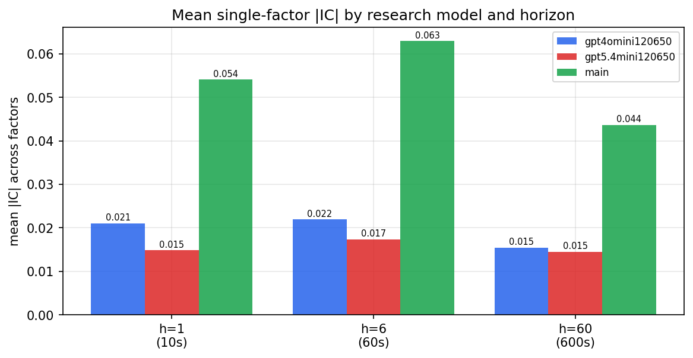

*Mean |IC| by research model and horizon*

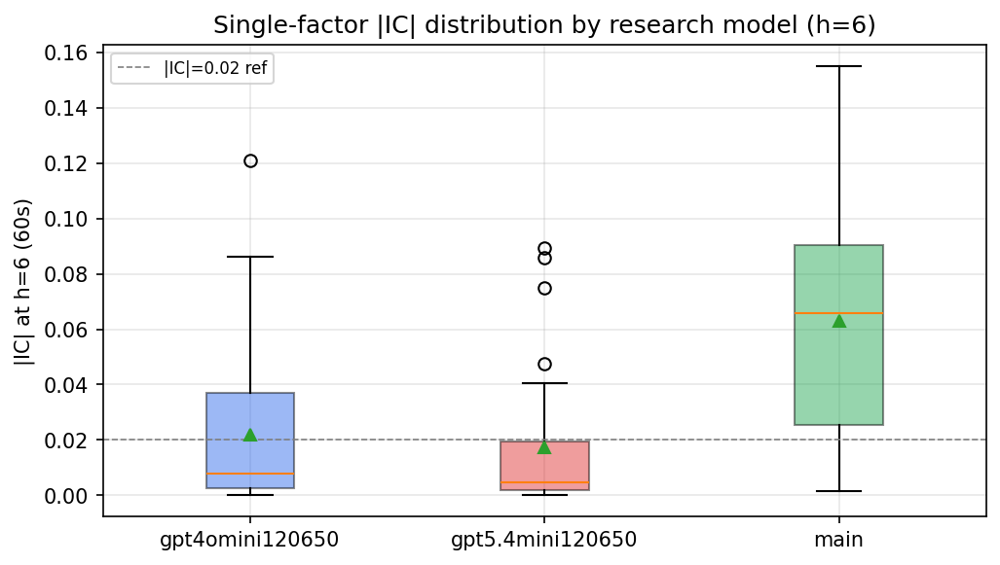

*Per-factor |IC| distribution by research model*

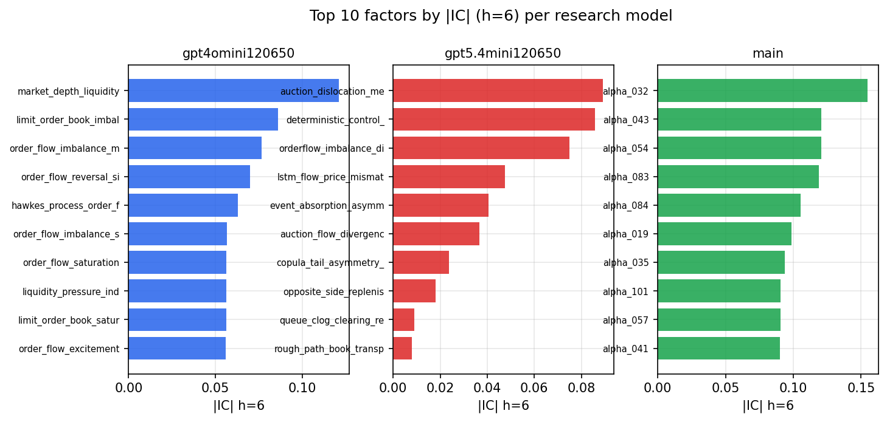

*Top factors by |IC| per research model*

## 2. Factor diversity & redundancy

Pairwise correlation of each zoo's *signals*. `eff_n_factors` is the effective number of independent factors (participation ratio of the correlation eigenvalues); `eff_ratio` and `redundancy` summarise how much unique information the zoo holds vs. how much is duplicated; `n_clusters` groups factors at |corr| ≥ 0.7.

| prerun | n_factors | eff_n_factors | eff_ratio | mean_abs_corr | n_clusters | redundancy |
| --- | --- | --- | --- | --- | --- | --- |
| gpt4omini120650 | 66 | 32.1337 | 0.4869 | 0.0469 | 52 | 0.5131 |
| gpt5.4mini120650 | 68 | 55.929 | 0.8225 | 0.0086 | 63 | 0.1775 |
| main | 76 | 35.519 | 0.4674 | 0.0402 | 65 | 0.5326 |

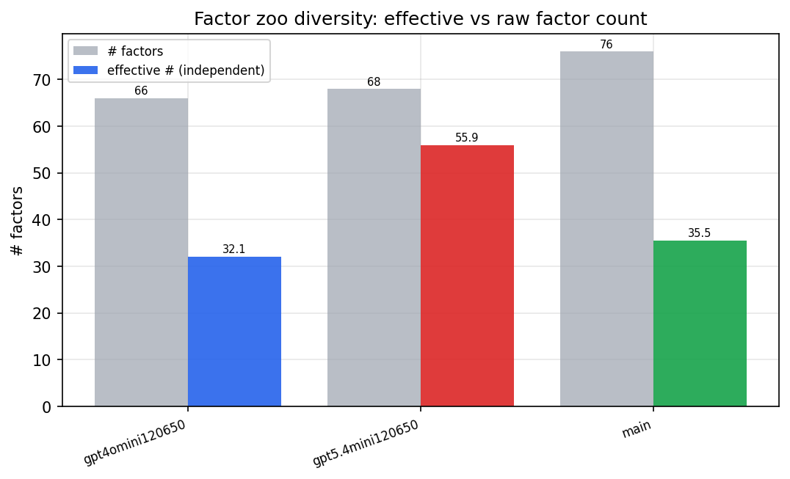

*Effective vs raw factor count per research model*

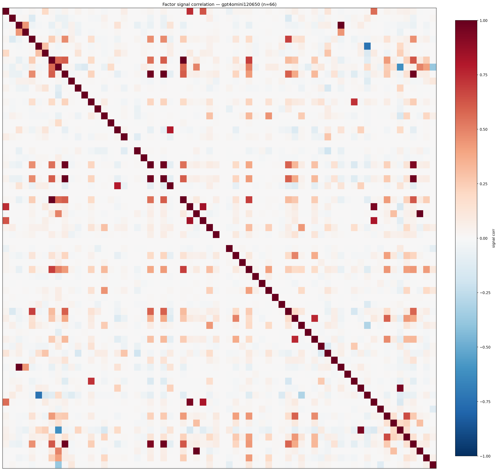

*Signal correlation matrix — gpt4omini120650*

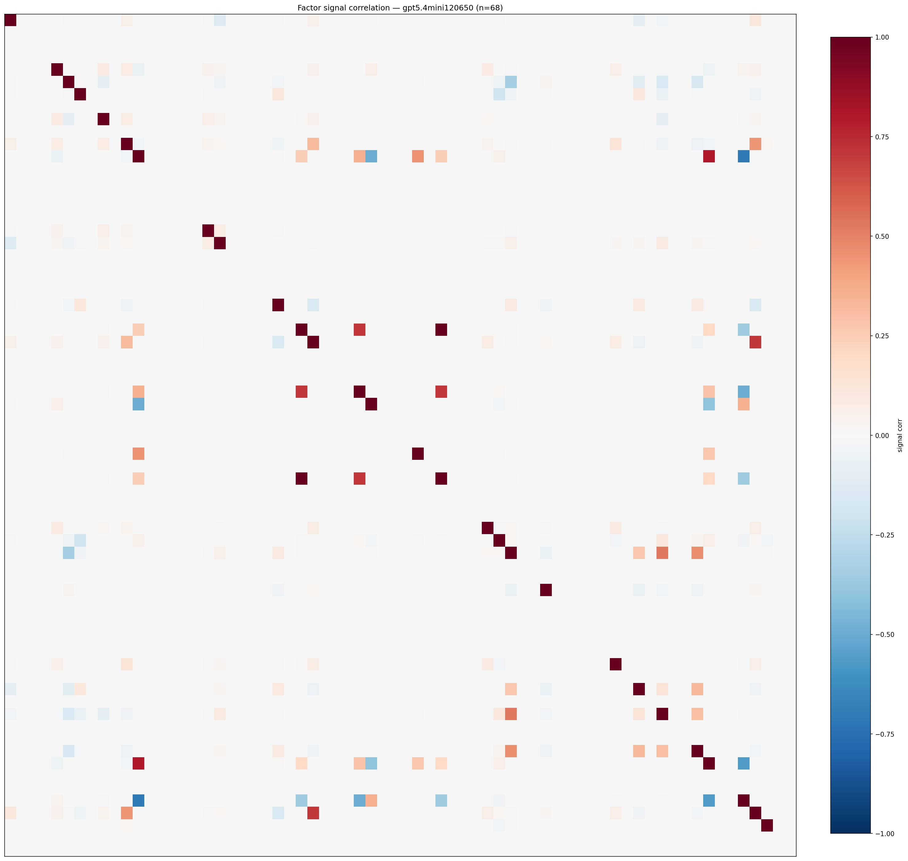

*Signal correlation matrix — gpt5.4mini120650*

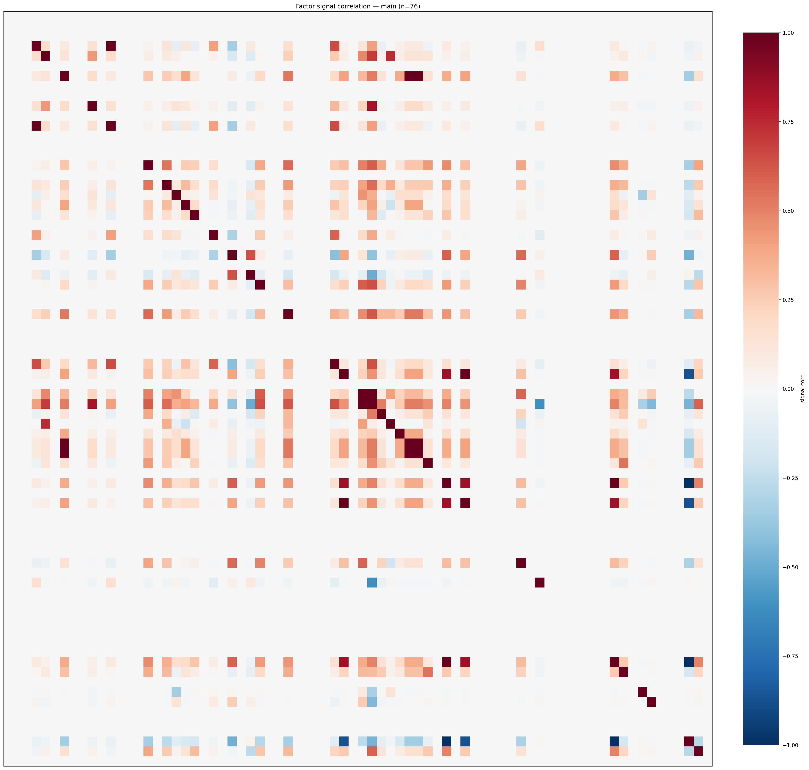

*Signal correlation matrix — main*

## 3. Deflation & model-based importance

`deflated_best_ic` haircuts each zoo's best |IC| for the number of factors tried (`ic_n_tested`) — a bigger zoo's best factor is more likely to be lucky. `lasso_n_nonzero` / `lasso_sparsity` show how many factors a sparse linear model actually keeps (model-view redundancy).

| prerun | best_ic | deflated_best_ic | deflated_best_t | ic_n_tested | ic_n_obs | lasso_n_nonzero | lasso_sparsity |
| --- | --- | --- | --- | --- | --- | --- | --- |
| gpt4omini120650 | 0.121 | 0.1135 | 43.6191 | 62 | 147599 | 19 | 0.7121 |
| gpt5.4mini120650 | 0.0892 | 0.0825 | 31.6958 | 28 | 147599 | 13 | 0.8088 |
| main | 0.1549 | 0.148 | 56.8484 | 35 | 147599 | 19 | 0.75 |

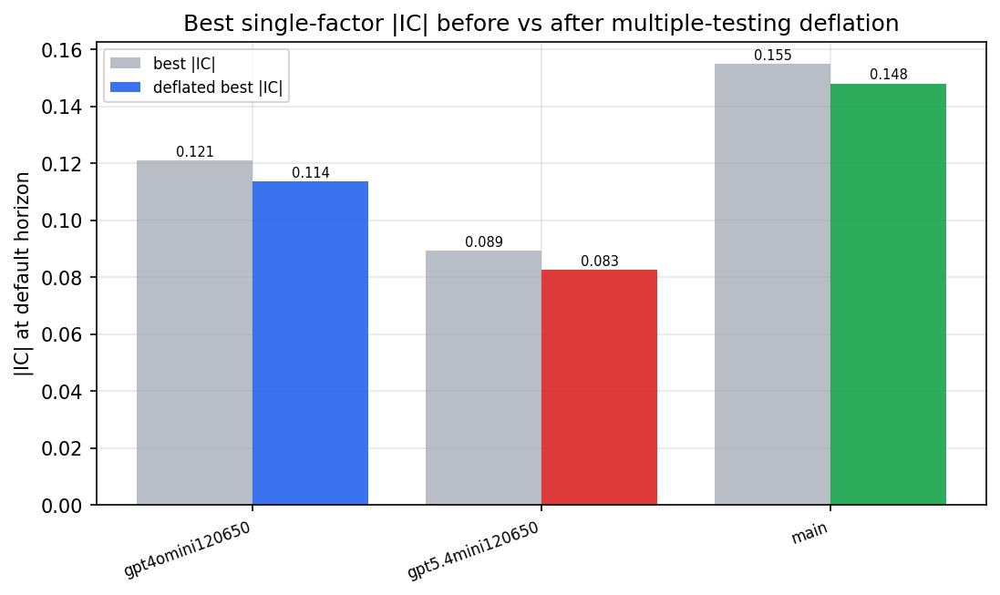

*Best |IC| before vs after multiple-testing deflation*

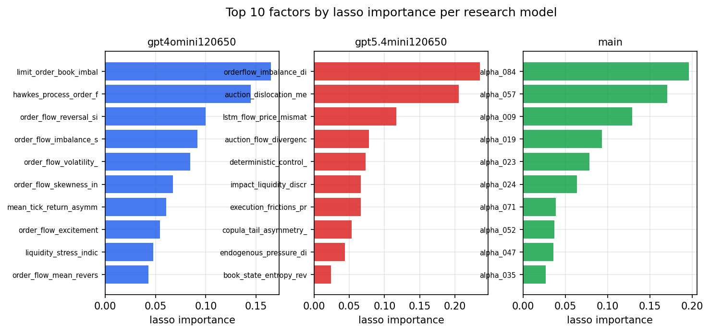

*Top factors by lasso importance per zoo*

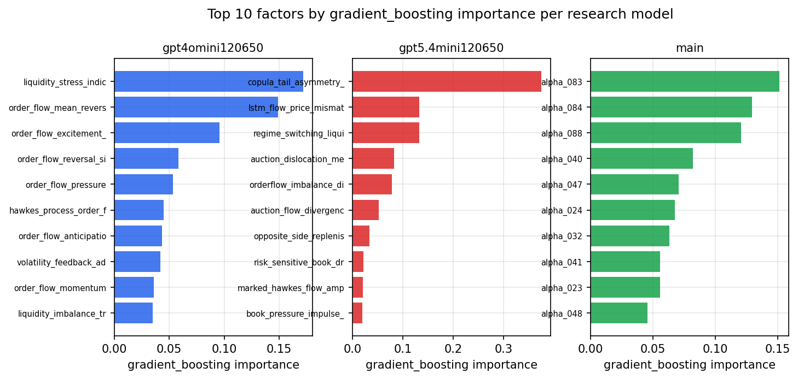

*Top factors by gradient_boosting importance per zoo*

## 4. ML-combined signal — per-underlying vectorised backtest

Each model combines a prerun's factors into ONE signal (fit `factors → forward return` on IS, predict per (bar, underlying)), then that combined signal is run through a simple vectorised backtest — `position(signal) × the underlying's own forward return` — on the held-out OOS tail (+ an equal-weight ensemble). No cross-sectional ranking.

> Config: position=**threshold** (t=1.0, z-score `expanding`), aggregation=**portfolio**, fit-standardise=**per_underlying**, horizon=6.

| prerun | model | n_factors_used | oos_ic | oos_sharpe | is_sharpe | oos_ann_return | oos_max_drawdown |
| --- | --- | --- | --- | --- | --- | --- | --- |
| gpt4omini120650 | linear_regression | 66 | 0.0792 | 24.738 | 20.3545 | 0.96 | -0.0038 |
| gpt4omini120650 | ridge | 66 | 0.0814 | 25.9685 | 20.2983 | 1.009 | -0.0025 |
| gpt4omini120650 | lasso | 66 | 0.0939 | 31.858 | 18.2363 | 1.1402 | -0.0018 |
| gpt4omini120650 | elastic_net | 66 | 0.0946 | 29.3364 | 18.8774 | 1.0931 | -0.0027 |
| gpt4omini120650 | random_forest | 66 | 0.1347 | 36.553 | 27.6165 | 1.5882 | -0.0034 |
| gpt4omini120650 | gradient_boosting | 66 | 0.1142 | 12.756 | 22.9231 | 0.2228 | -0.0024 |
| gpt4omini120650 | xgboost | 66 | 0.1168 | 19.5461 | 30.198 | 0.5092 | -0.0028 |
| gpt4omini120650 | lightgbm | 66 | 0.1192 | 20.3726 | 35.4725 | 0.5601 | -0.0022 |
| gpt4omini120650 | ensemble | 66 | 0.1074 | 36.3044 | 30.4567 | 1.4674 | -0.0021 |
| gpt5.4mini120650 | linear_regression | 68 | 0.1485 | 41.7482 | 25.4502 | 2.0481 | -0.0032 |
| gpt5.4mini120650 | ridge | 68 | 0.148 | 41.5848 | 25.8396 | 2.0409 | -0.0032 |
| gpt5.4mini120650 | lasso | 68 | 0.152 | 41.8476 | 26.5673 | 2.076 | -0.004 |
| gpt5.4mini120650 | elastic_net | 68 | 0.1518 | 41.5011 | 26.4635 | 2.0657 | -0.004 |
| gpt5.4mini120650 | random_forest | 68 | 0.1674 | 39.8603 | 35.932 | 2.1904 | -0.0037 |
| gpt5.4mini120650 | gradient_boosting | 68 | 0.1615 | 3.2177 | 25.7939 | 0.0425 | -0.004 |
| gpt5.4mini120650 | xgboost | 68 | 0.1646 | 33.387 | 34.5601 | 1.3177 | -0.004 |
| gpt5.4mini120650 | lightgbm | 68 | 0.1629 | 32.6499 | 37.0081 | 1.066 | -0.0032 |
| gpt5.4mini120650 | ensemble | 68 | 0.1664 | 44.1149 | 33.0045 | 2.2965 | -0.0039 |
| main | linear_regression | 76 | 0.1535 | 28.5752 | 29.0906 | 1.3777 | -0.0047 |
| main | ridge | 76 | 0.1598 | 29.9551 | 28.6339 | 1.4316 | -0.0049 |
| main | lasso | 76 | 0.1747 | 36.4443 | 28.6929 | 1.6634 | -0.0042 |
| main | elastic_net | 76 | 0.1749 | 36.6841 | 28.2414 | 1.6711 | -0.0044 |
| main | random_forest | 76 | 0.178 | 30.3498 | 32.9481 | 1.4482 | -0.0054 |
| main | gradient_boosting | 76 | 0.1796 | 19.5131 | 27.5804 | 0.4504 | -0.0018 |
| main | xgboost | 76 | 0.1793 | 27.6365 | 29.7904 | 0.8186 | -0.0028 |
| main | lightgbm | 76 | 0.167 | 24.8876 | 37.093 | 0.7985 | -0.0028 |
| main | ensemble | 76 | 0.1802 | 33.6709 | 30.5934 | 1.5202 | -0.0047 |

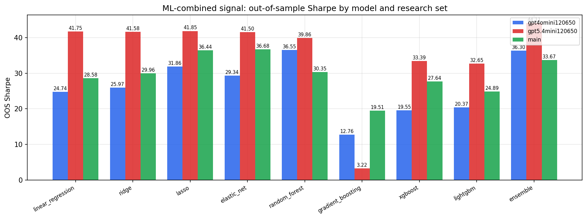

*ML-combined OOS Sharpe by model and research set*

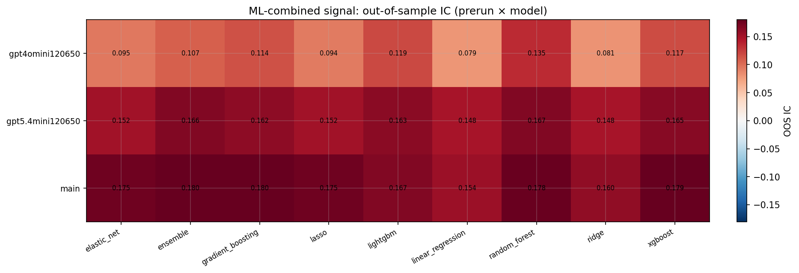

*ML-combined OOS IC (prerun × model)*

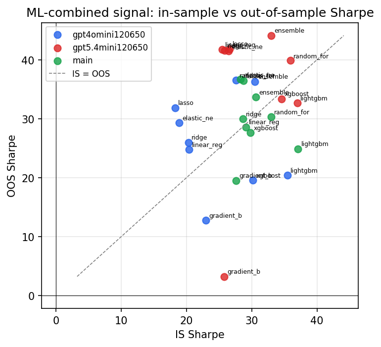

*IS vs OOS Sharpe (overfitting diagnostic)*

---
*Generated by `run_model_comparison.py`. Tables: `*.csv`; interactive: `comparison.ipynb`.*
