# Research-LLM factor comparison — `2026-01`

Comparing the **factor output of different research LLMs** on three axes (raw factor quality → factors as ML features → factors through the full agentic fund). The panel, IS/OOS split, horizon and model hyper-parameters are held identical across preruns — the *only* variable is the factor set.

## Preruns compared

| prerun | research_model | usable_factors | dropped_factors |
| --- | --- | --- | --- |
| gpt4omini120650 | gpt-4o-mini | 66 | 0 |
| gpt5.4mini120650 | gpt-5.4-mini | 68 | 1 |
| main | seed library | 77 | 11 |

> Dropped factors declare fields the current data doesn't have yet (e.g. fundamentals); they light up unchanged once that data is downloaded.

*Usable vs awaiting-data factors per research model*

## Key findings

- **Best ML-combined OOS Sharpe:** `gpt5.4mini120650` with `random_forest` (OOS Sharpe = 30.965).
- **Mean OOS Sharpe across models, by research set:** `gpt5.4mini120650` = 24.957, `gpt4omini120650` = 13.213, `main` = 11.261.
- **Highest mean single-factor |IC| (h=6):** `main` (mean |IC| = 0.0591).
- **Most diverse zoo (highest effective/raw factor ratio):** `gpt5.4mini120650` (eff 55.1 of 68, ratio 0.81).
- **Best selection-deflated single-factor |IC|:** `main` (deflated |IC| = 0.1555 from 36 factors tried).

## 1. Single-factor IC (raw factor quality)

Per-underlying time-series Spearman rank-IC of every researched factor, recomputed on the shared panel at horizons h=1, h=6, h=60. The per-underlying IC correlates each factor's value vector with the underlying's own forward-return vector (pooled across underlyings); the cross-sectional IC ranks across underlyings per timestamp.

| prerun | n_factors | mean_abs_ic_1 | mean_abs_ic_6 | mean_abs_ic_60 | mean_abs_icir_6 | best_factor_h6 | best_abs_ic_h6 |
| --- | --- | --- | --- | --- | --- | --- | --- |
| gpt4omini120650 | 66 | 0.0211 | 0.0232 | 0.0129 | 0.7828 | market_depth_liquidity_risk | 0.0982 |
| gpt5.4mini120650 | 68 | 0.0169 | 0.0206 | 0.0155 | 0.7181 | auction_dislocation_mean_reversion | 0.0986 |
| main | 77 | 0.0568 | 0.0591 | 0.0511 | 1.1228 | alpha_032 | 0.1627 |

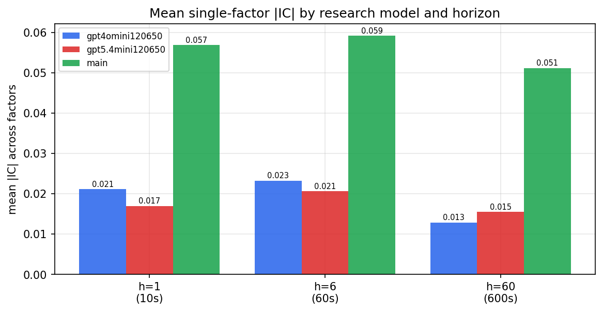

*Mean |IC| by research model and horizon*

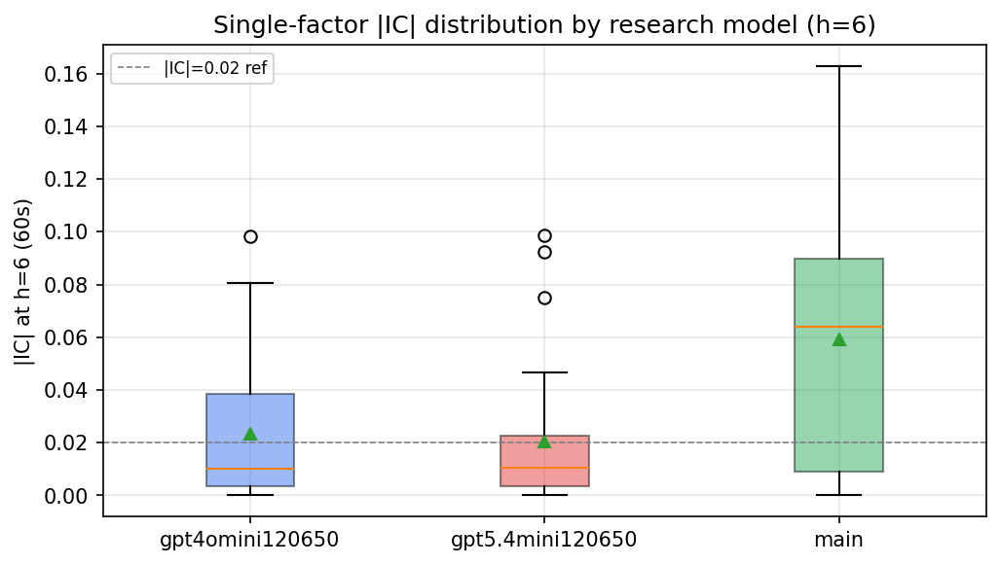

*Per-factor |IC| distribution by research model*

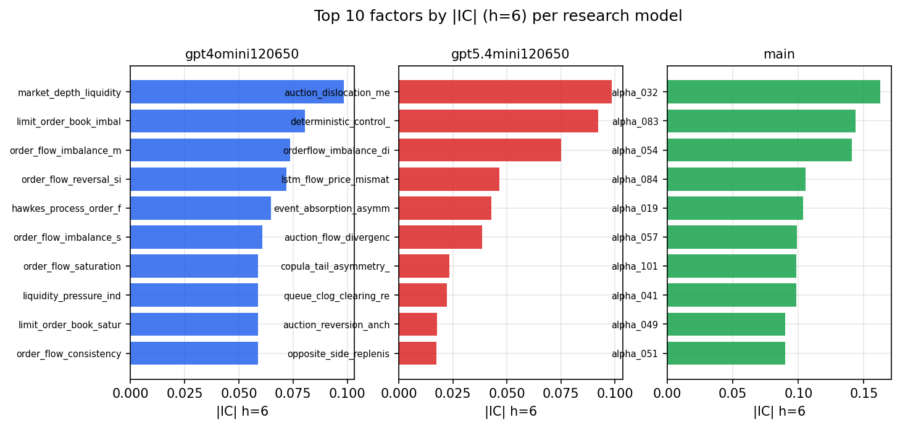

*Top factors by |IC| per research model*

## 2. Factor diversity & redundancy

Pairwise correlation of each zoo's *signals*. `eff_n_factors` is the effective number of independent factors (participation ratio of the correlation eigenvalues); `eff_ratio` and `redundancy` summarise how much unique information the zoo holds vs. how much is duplicated; `n_clusters` groups factors at |corr| ≥ 0.7.

| prerun | n_factors | eff_n_factors | eff_ratio | mean_abs_corr | n_clusters | redundancy |
| --- | --- | --- | --- | --- | --- | --- |
| gpt4omini120650 | 66 | 31.9151 | 0.4836 | 0.0483 | 53 | 0.5164 |
| gpt5.4mini120650 | 68 | 55.0843 | 0.8101 | 0.0088 | 63 | 0.1899 |
| main | 77 | 36.9068 | 0.4793 | 0.042 | 55 | 0.5207 |

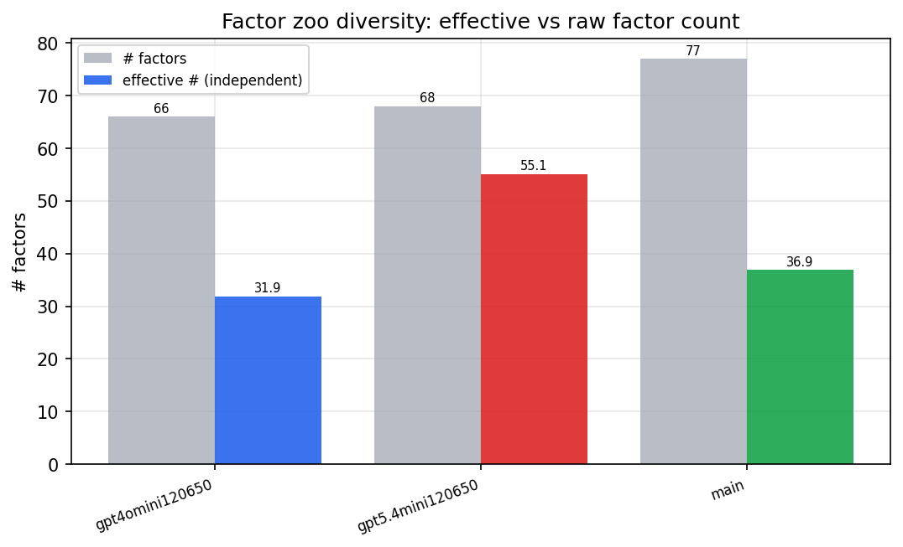

*Effective vs raw factor count per research model*

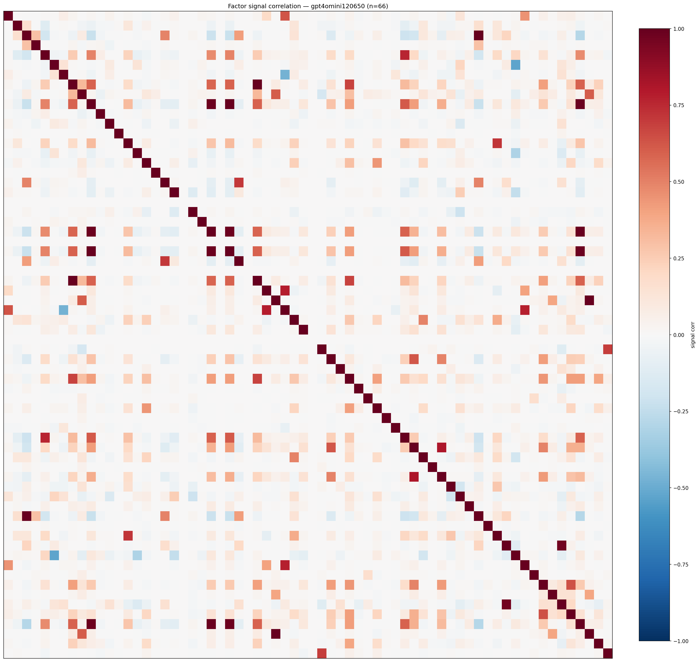

*Signal correlation matrix — gpt4omini120650*

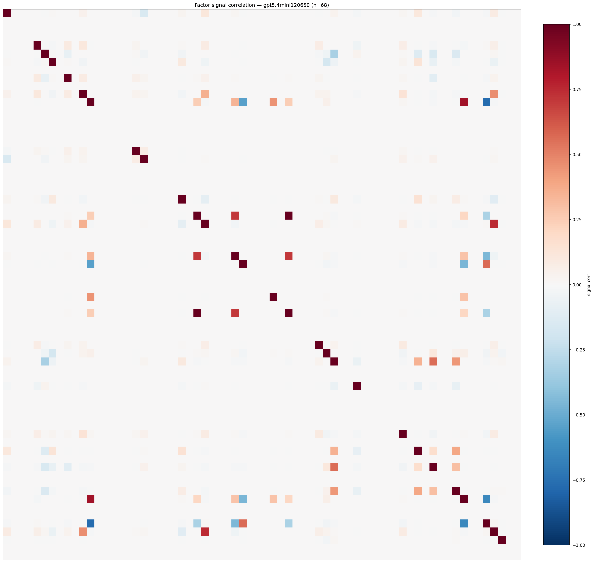

*Signal correlation matrix — gpt5.4mini120650*

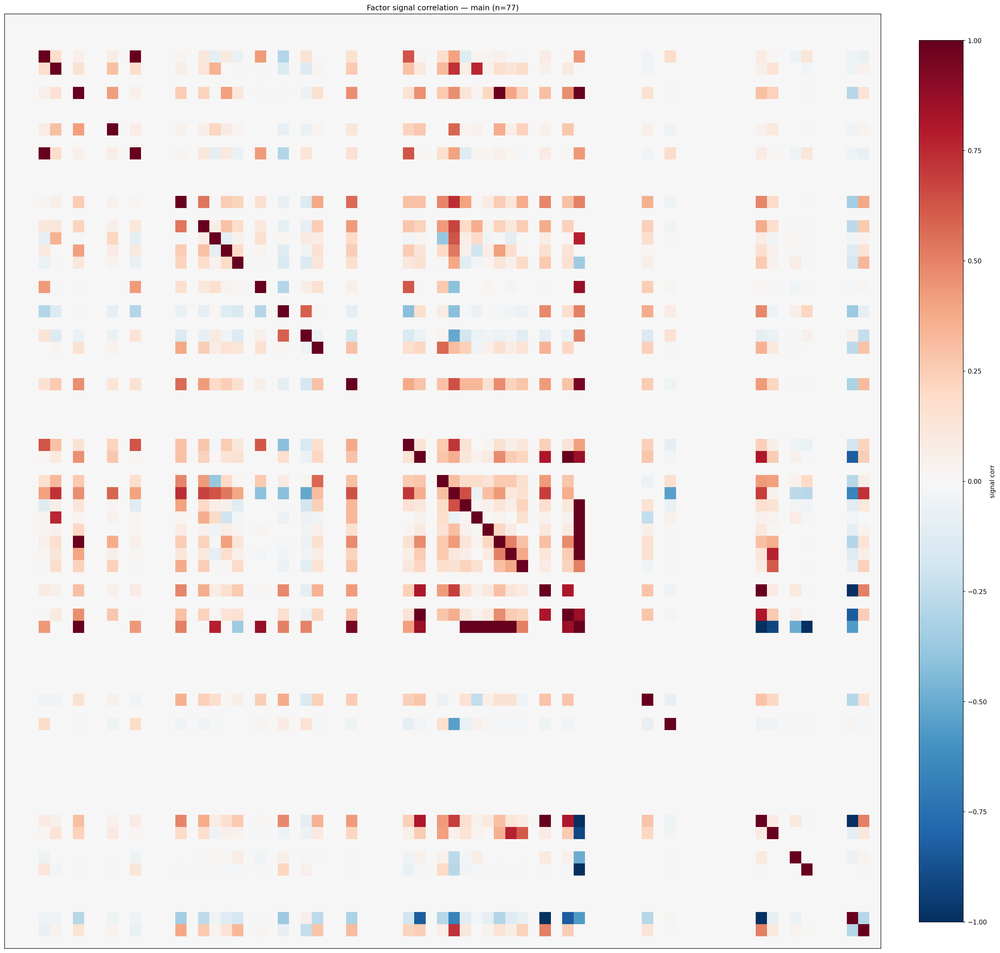

*Signal correlation matrix — main*

## 3. Deflation & model-based importance

`deflated_best_ic` haircuts each zoo's best |IC| for the number of factors tried (`ic_n_tested`) — a bigger zoo's best factor is more likely to be lucky. `lasso_n_nonzero` / `lasso_sparsity` show how many factors a sparse linear model actually keeps (model-view redundancy).

| prerun | best_ic | deflated_best_ic | deflated_best_t | ic_n_tested | ic_n_obs | lasso_n_nonzero | lasso_sparsity |
| --- | --- | --- | --- | --- | --- | --- | --- |
| gpt4omini120650 | 0.0982 | 0.0906 | 33.9637 | 62 | 140579 | 26 | 0.6061 |
| gpt5.4mini120650 | 0.0986 | 0.0917 | 34.3894 | 28 | 140579 | 14 | 0.7941 |
| main | 0.1627 | 0.1555 | 58.3187 | 36 | 140579 | 25 | 0.6753 |

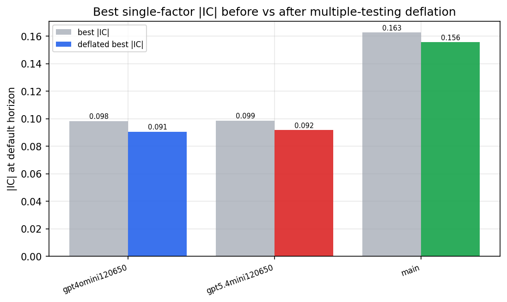

*Best |IC| before vs after multiple-testing deflation*

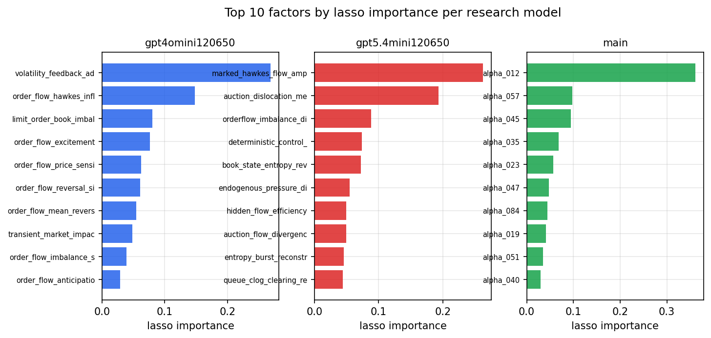

*Top factors by lasso importance per zoo*

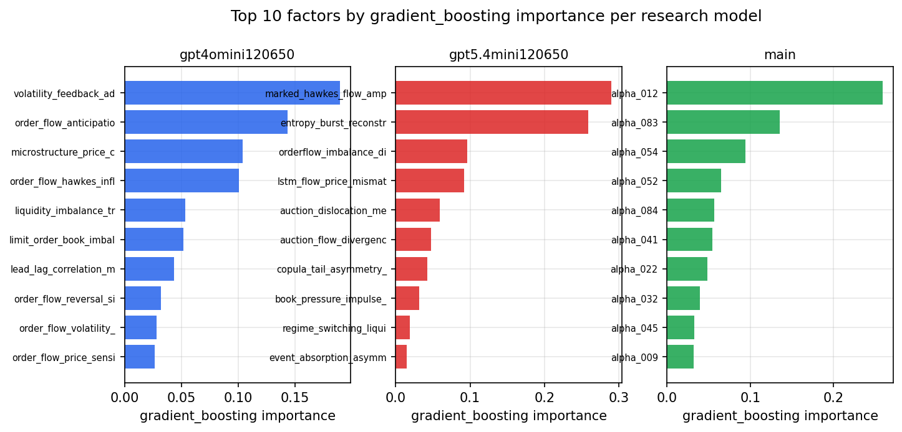

*Top factors by gradient_boosting importance per zoo*

## 4. ML-combined signal — per-underlying vectorised backtest

Each model combines a prerun's factors into ONE signal (fit `factors → forward return` on IS, predict per (bar, underlying)), then that combined signal is run through a simple vectorised backtest — `position(signal) × the underlying's own forward return` — on the held-out OOS tail (+ an equal-weight ensemble). No cross-sectional ranking.

> Config: position=**threshold** (t=1.0, z-score `expanding`), aggregation=**portfolio**, fit-standardise=**per_underlying**, horizon=6.

| prerun | model | n_factors_used | oos_ic | oos_sharpe | is_sharpe | oos_ann_return | oos_max_drawdown |
| --- | --- | --- | --- | --- | --- | --- | --- |
| gpt4omini120650 | linear_regression | 66 | 0.0609 | 13.3313 | 25.5828 | 0.5117 | -0.0075 |
| gpt4omini120650 | ridge | 66 | 0.0608 | 14.9091 | 25.1472 | 0.5781 | -0.0046 |
| gpt4omini120650 | lasso | 66 | 0.0548 | 15.4476 | 25.8025 | 0.5931 | -0.0065 |
| gpt4omini120650 | elastic_net | 66 | 0.0548 | 15.4476 | 25.8025 | 0.5931 | -0.0065 |
| gpt4omini120650 | random_forest | 66 | 0.0669 | 14.1226 | 29.1495 | 0.586 | -0.0126 |
| gpt4omini120650 | gradient_boosting | 66 | 0.0584 | 4.3768 | 17.2471 | 0.1243 | -0.0067 |
| gpt4omini120650 | xgboost | 66 | 0.07 | 12.2564 | 28.4546 | 0.4241 | -0.0056 |
| gpt4omini120650 | lightgbm | 66 | 0.0832 | 13.6409 | 35.8485 | 0.4829 | -0.0027 |
| gpt4omini120650 | ensemble | 66 | 0.0739 | 15.3874 | 34.8045 | 0.6686 | -0.01 |
| gpt5.4mini120650 | linear_regression | 68 | 0.0994 | 23.4809 | 33.9496 | 0.9878 | -0.006 |
| gpt5.4mini120650 | ridge | 68 | 0.0989 | 23.0742 | 33.3301 | 0.9732 | -0.0061 |
| gpt5.4mini120650 | lasso | 68 | 0.1015 | 24.2829 | 32.8524 | 1.0024 | -0.0049 |
| gpt5.4mini120650 | elastic_net | 68 | 0.1006 | 23.4287 | 32.9362 | 0.9645 | -0.0056 |
| gpt5.4mini120650 | random_forest | 68 | 0.1178 | 30.965 | 42.8812 | 1.425 | -0.0028 |
| gpt5.4mini120650 | gradient_boosting | 68 | 0.1128 | 19.5299 | 23.8994 | 0.6077 | -0.0029 |
| gpt5.4mini120650 | xgboost | 68 | 0.118 | 26.3828 | 37.0042 | 1.0676 | -0.0023 |
| gpt5.4mini120650 | lightgbm | 68 | 0.1194 | 25.2292 | 44.1631 | 1.0022 | -0.0037 |
| gpt5.4mini120650 | ensemble | 68 | 0.1147 | 28.2414 | 39.0091 | 1.2946 | -0.0022 |
| main | linear_regression | 77 | 0.0928 | 4.7075 | 31.3747 | 0.2375 | -0.0203 |
| main | ridge | 77 | 0.0978 | 11.8846 | 30.8163 | 0.743 | -0.0203 |
| main | lasso | 77 | 0.1054 | 10.564 | 31.5488 | 0.844 | -0.03 |
| main | elastic_net | 77 | 0.1046 | 13.4669 | 31.7319 | 0.8397 | -0.0203 |
| main | random_forest | 77 | 0.0996 | 11.2903 | 34.2172 | 0.8238 | -0.0264 |
| main | gradient_boosting | 77 | 0.0983 | 8.4807 | 19.3729 | 0.2088 | -0.003 |
| main | xgboost | 77 | 0.0996 | 18.5679 | 26.7071 | 0.5262 | -0.0021 |
| main | lightgbm | 77 | 0.0871 | 11.1574 | 34.2407 | 0.3655 | -0.0044 |
| main | ensemble | 77 | 0.1036 | 11.2276 | 32.5517 | 0.7865 | -0.0252 |

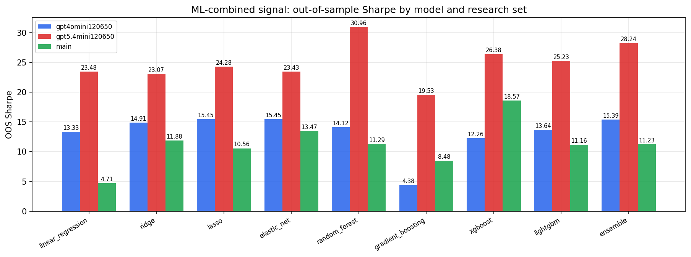

*ML-combined OOS Sharpe by model and research set*

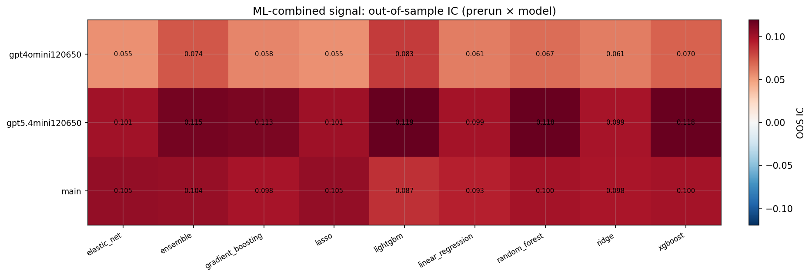

*ML-combined OOS IC (prerun × model)*

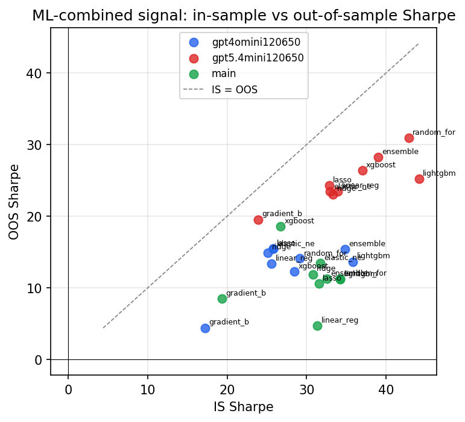

*IS vs OOS Sharpe (overfitting diagnostic)*

---
*Generated by `run_model_comparison.py`. Tables: `*.csv`; interactive: `comparison.ipynb`.*
