# Research-LLM factor comparison — `2026-02`

Comparing the **factor output of different research LLMs** on three axes (raw factor quality → factors as ML features → factors through the full agentic fund). The panel, IS/OOS split, horizon and model hyper-parameters are held identical across preruns — the *only* variable is the factor set.

## Preruns compared

| prerun | research_model | usable_factors | dropped_factors |
| --- | --- | --- | --- |
| gpt4omini120650 | gpt-4o-mini | 66 | 0 |
| gpt5.4mini120650 | gpt-5.4-mini | 68 | 1 |
| main | seed library | 77 | 11 |

> Dropped factors declare fields the current data doesn't have yet (e.g. fundamentals); they light up unchanged once that data is downloaded.

*Usable vs awaiting-data factors per research model*

## Key findings

- **Best ML-combined OOS Sharpe:** `gpt5.4mini120650` with `xgboost` (OOS Sharpe = 41.855).
- **Mean OOS Sharpe across models, by research set:** `gpt5.4mini120650` = 37.729, `main` = 20.949, `gpt4omini120650` = 20.439.
- **Highest mean single-factor |IC| (h=6):** `main` (mean |IC| = 0.0606).
- **Most diverse zoo (highest effective/raw factor ratio):** `gpt5.4mini120650` (eff 55.3 of 68, ratio 0.81).
- **Best selection-deflated single-factor |IC|:** `main` (deflated |IC| = 0.1615 from 36 factors tried).

## 1. Single-factor IC (raw factor quality)

Per-underlying time-series Spearman rank-IC of every researched factor, recomputed on the shared panel at horizons h=1, h=6, h=60. The per-underlying IC correlates each factor's value vector with the underlying's own forward-return vector (pooled across underlyings); the cross-sectional IC ranks across underlyings per timestamp.

| prerun | n_factors | mean_abs_ic_1 | mean_abs_ic_6 | mean_abs_ic_60 | mean_abs_icir_6 | best_factor_h6 | best_abs_ic_h6 |
| --- | --- | --- | --- | --- | --- | --- | --- |
| gpt4omini120650 | 66 | 0.0222 | 0.0223 | 0.0148 | 0.614 | market_depth_liquidity_risk | 0.0965 |
| gpt5.4mini120650 | 68 | 0.0169 | 0.0207 | 0.0176 | 0.7567 | auction_dislocation_mean_reversion | 0.1114 |
| main | 77 | 0.0582 | 0.0606 | 0.0484 | 1.1814 | alpha_083 | 0.1687 |

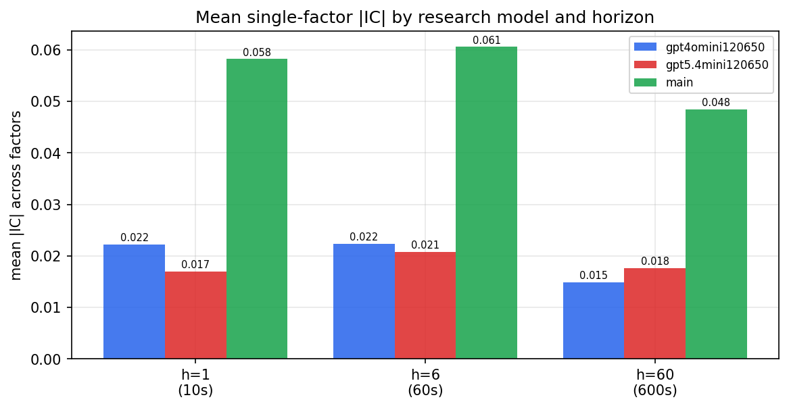

*Mean |IC| by research model and horizon*

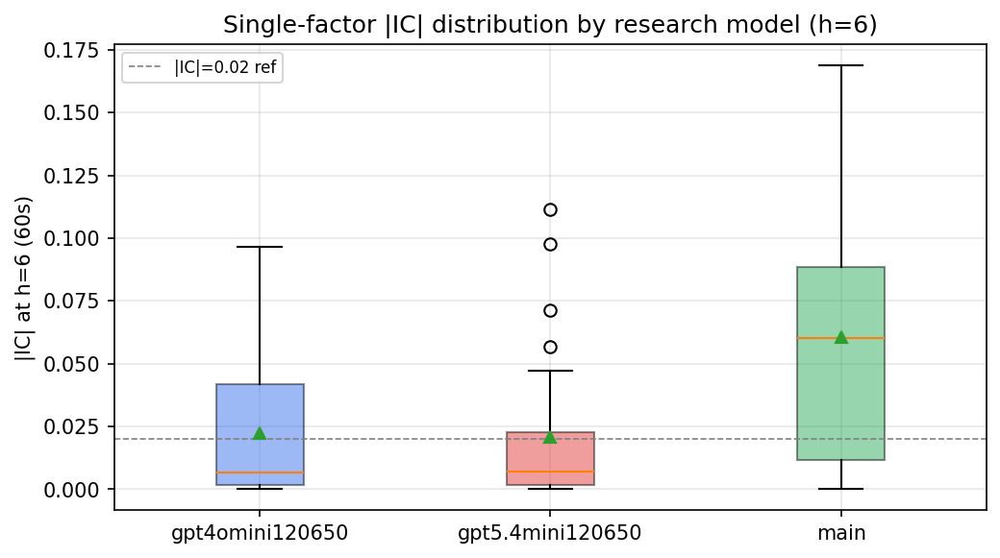

*Per-factor |IC| distribution by research model*

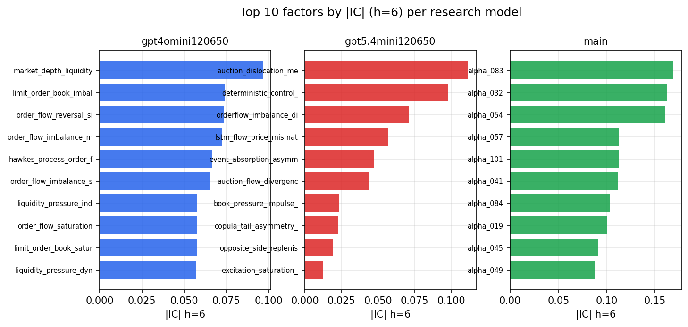

*Top factors by |IC| per research model*

## 2. Factor diversity & redundancy

Pairwise correlation of each zoo's *signals*. `eff_n_factors` is the effective number of independent factors (participation ratio of the correlation eigenvalues); `eff_ratio` and `redundancy` summarise how much unique information the zoo holds vs. how much is duplicated; `n_clusters` groups factors at |corr| ≥ 0.7.

| prerun | n_factors | eff_n_factors | eff_ratio | mean_abs_corr | n_clusters | redundancy |
| --- | --- | --- | --- | --- | --- | --- |
| gpt4omini120650 | 66 | 35.5872 | 0.5392 | 0.0405 | 55 | 0.4608 |
| gpt5.4mini120650 | 68 | 55.2952 | 0.8132 | 0.0088 | 63 | 0.1868 |
| main | 77 | 37.5306 | 0.4874 | 0.0376 | 64 | 0.5126 |

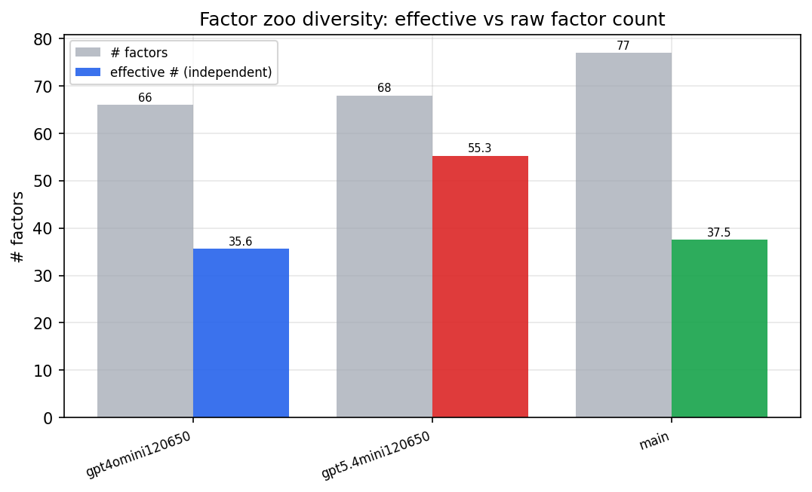

*Effective vs raw factor count per research model*

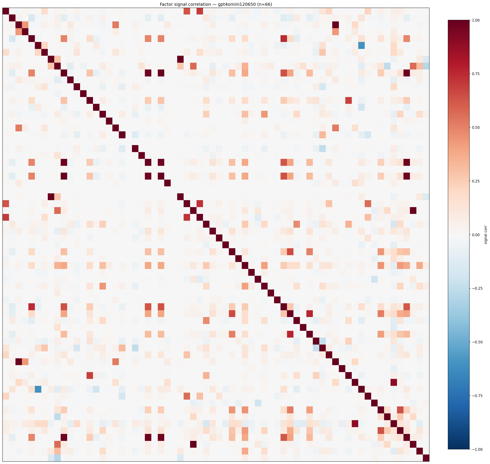

*Signal correlation matrix — gpt4omini120650*

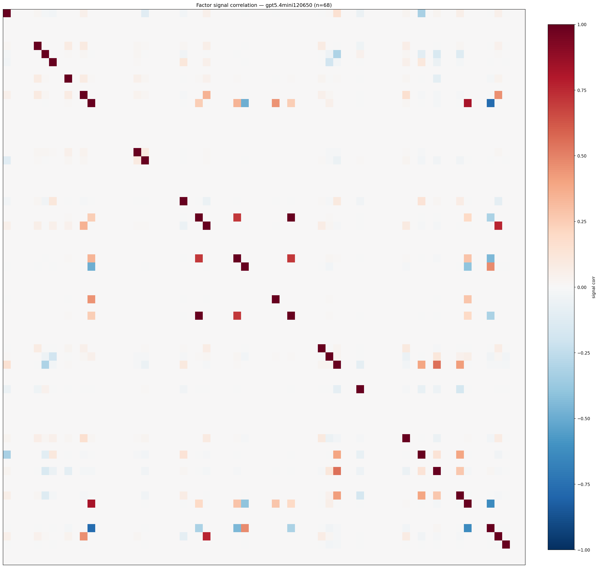

*Signal correlation matrix — gpt5.4mini120650*

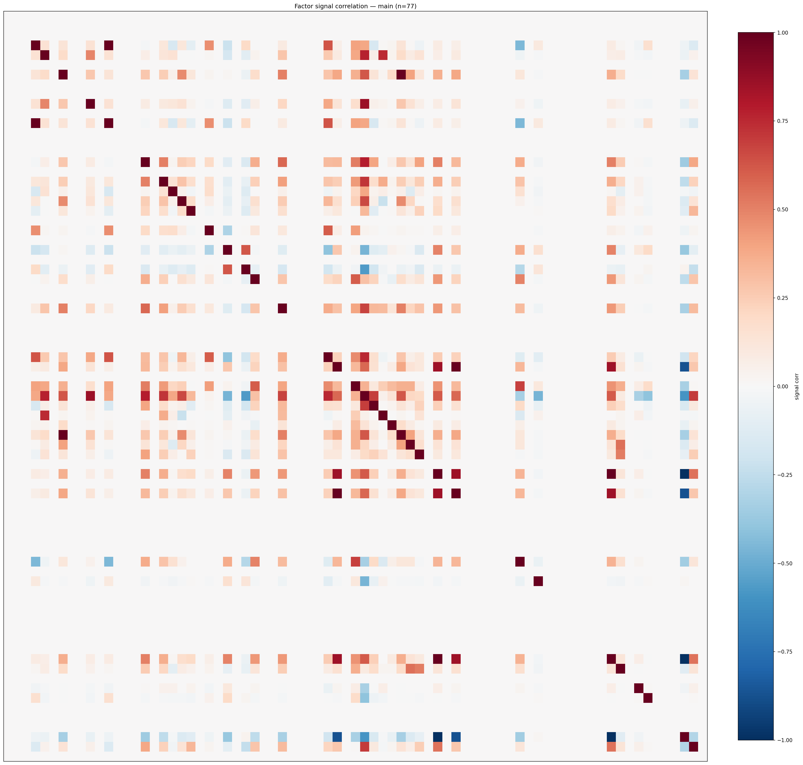

*Signal correlation matrix — main*

## 3. Deflation & model-based importance

`deflated_best_ic` haircuts each zoo's best |IC| for the number of factors tried (`ic_n_tested`) — a bigger zoo's best factor is more likely to be lucky. `lasso_n_nonzero` / `lasso_sparsity` show how many factors a sparse linear model actually keeps (model-view redundancy).

| prerun | best_ic | deflated_best_ic | deflated_best_t | ic_n_tested | ic_n_obs | lasso_n_nonzero | lasso_sparsity |
| --- | --- | --- | --- | --- | --- | --- | --- |
| gpt4omini120650 | 0.0965 | 0.0888 | 33.4241 | 63 | 141659 | 16 | 0.7576 |
| gpt5.4mini120650 | 0.1114 | 0.1046 | 39.353 | 28 | 141659 | 8 | 0.8824 |
| main | 0.1687 | 0.1615 | 60.8034 | 36 | 141659 | 12 | 0.8442 |

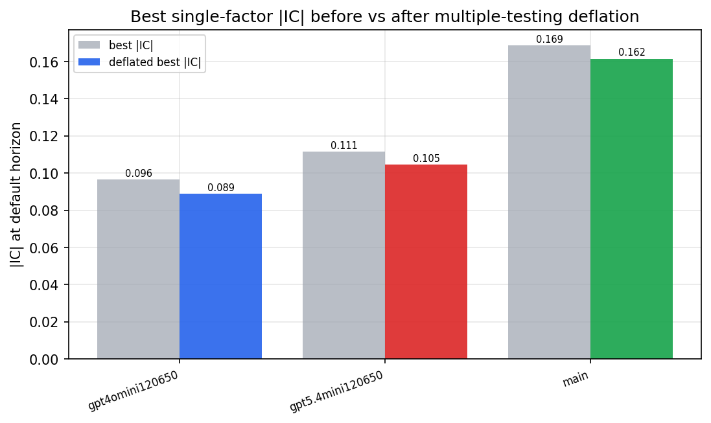

*Best |IC| before vs after multiple-testing deflation*

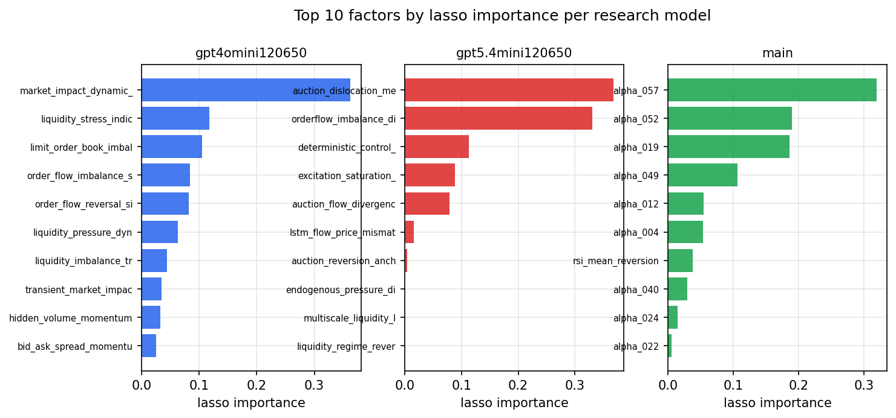

*Top factors by lasso importance per zoo*

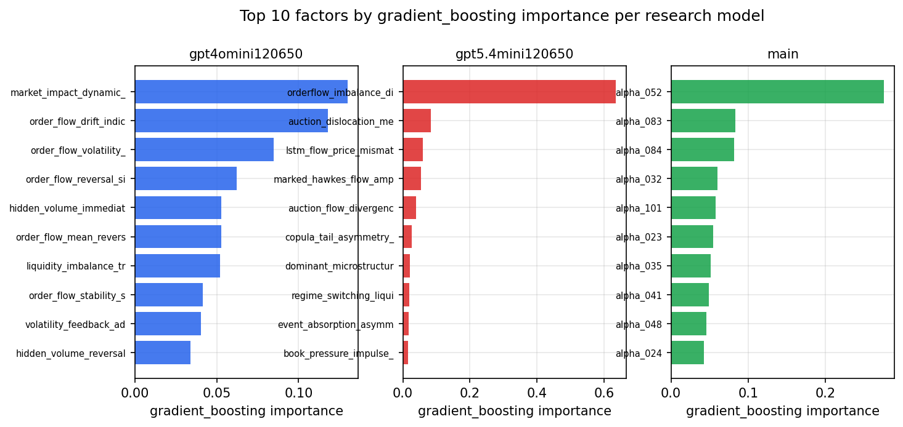

*Top factors by gradient_boosting importance per zoo*

## 4. ML-combined signal — per-underlying vectorised backtest

Each model combines a prerun's factors into ONE signal (fit `factors → forward return` on IS, predict per (bar, underlying)), then that combined signal is run through a simple vectorised backtest — `position(signal) × the underlying's own forward return` — on the held-out OOS tail (+ an equal-weight ensemble). No cross-sectional ranking.

> Config: position=**threshold** (t=1.0, z-score `expanding`), aggregation=**portfolio**, fit-standardise=**per_underlying**, horizon=6.

| prerun | model | n_factors_used | oos_ic | oos_sharpe | is_sharpe | oos_ann_return | oos_max_drawdown |
| --- | --- | --- | --- | --- | --- | --- | --- |
| gpt4omini120650 | linear_regression | 66 | 0.0698 | 14.8495 | 29.616 | 0.3242 | -0.0024 |
| gpt4omini120650 | ridge | 66 | 0.0678 | 14.5612 | 28.7446 | 0.2982 | -0.0023 |
| gpt4omini120650 | lasso | 66 | 0.0651 | 27.2622 | 30.6429 | 0.6163 | -0.0031 |
| gpt4omini120650 | elastic_net | 66 | 0.0636 | 15.8462 | 31.1276 | 0.2595 | -0.0022 |
| gpt4omini120650 | random_forest | 66 | 0.097 | 24.0367 | 31.2836 | 1.0743 | -0.0052 |
| gpt4omini120650 | gradient_boosting | 66 | 0.0942 | 18.8733 | 29.2933 | 0.6008 | -0.0037 |
| gpt4omini120650 | xgboost | 66 | 0.0963 | 22.1122 | 33.3874 | 0.9001 | -0.0034 |
| gpt4omini120650 | lightgbm | 66 | 0.0933 | 19.4489 | 36.0434 | 0.745 | -0.0064 |
| gpt4omini120650 | ensemble | 66 | 0.1001 | 26.9616 | 32.5319 | 1.0077 | -0.0051 |
| gpt5.4mini120650 | linear_regression | 68 | 0.1295 | 35.2865 | 31.3381 | 1.3409 | -0.0026 |
| gpt5.4mini120650 | ridge | 68 | 0.1296 | 36.476 | 32.2554 | 1.4304 | -0.0025 |
| gpt5.4mini120650 | lasso | 68 | 0.1262 | 36.1791 | 31.4671 | 1.5015 | -0.0027 |
| gpt5.4mini120650 | elastic_net | 68 | 0.1262 | 36.1791 | 31.4671 | 1.5015 | -0.0027 |
| gpt5.4mini120650 | random_forest | 68 | 0.1359 | 41.6913 | 44.0673 | 2.6275 | -0.0037 |
| gpt5.4mini120650 | gradient_boosting | 68 | 0.1365 | 30.8739 | 40.4746 | 1.1894 | -0.0021 |
| gpt5.4mini120650 | xgboost | 68 | 0.1365 | 41.8548 | 42.3933 | 2.1356 | -0.0018 |
| gpt5.4mini120650 | lightgbm | 68 | 0.1361 | 39.9502 | 43.1254 | 2.1498 | -0.0026 |
| gpt5.4mini120650 | ensemble | 68 | 0.1359 | 41.0668 | 33.6474 | 2.2459 | -0.0027 |
| main | linear_regression | 77 | 0.0919 | 16.6958 | 33.0411 | 0.861 | -0.0126 |
| main | ridge | 77 | 0.1063 | 22.0744 | 30.1402 | 1.313 | -0.0042 |
| main | lasso | 77 | 0.0965 | 17.2902 | 33.1229 | 0.959 | -0.0134 |
| main | elastic_net | 77 | 0.0967 | 17.5805 | 33.238 | 0.9743 | -0.0127 |
| main | random_forest | 77 | 0.1219 | 29.3546 | 35.3422 | 1.8102 | -0.0035 |
| main | gradient_boosting | 77 | 0.1267 | 20.6472 | 32.8021 | 0.5265 | -0.0021 |
| main | xgboost | 77 | 0.1235 | 20.3729 | 35.44 | 0.7237 | -0.0089 |
| main | lightgbm | 77 | 0.1121 | 20.9914 | 40.1754 | 0.8877 | -0.0062 |
| main | ensemble | 77 | 0.1136 | 23.5317 | 37.958 | 1.3563 | -0.0103 |

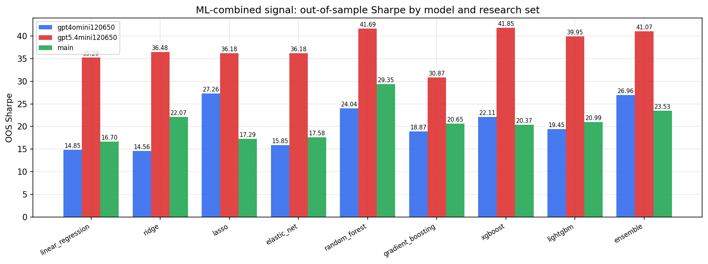

*ML-combined OOS Sharpe by model and research set*

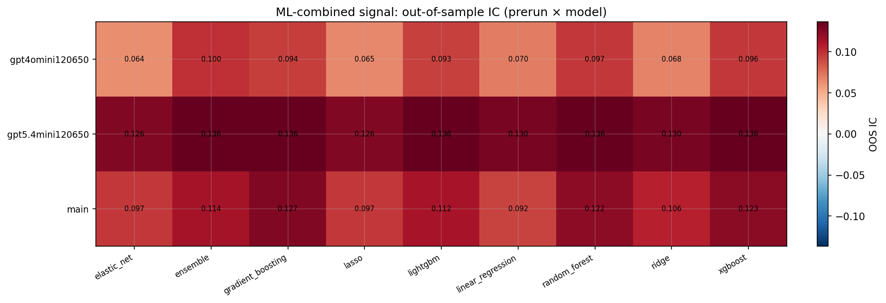

*ML-combined OOS IC (prerun × model)*

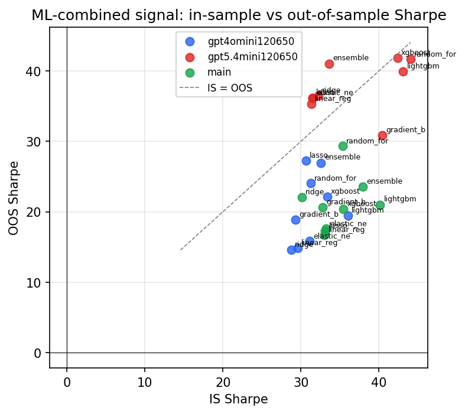

*IS vs OOS Sharpe (overfitting diagnostic)*

---
*Generated by `run_model_comparison.py`. Tables: `*.csv`; interactive: `comparison.ipynb`.*
