# Research-LLM factor comparison — `2026-03`

Comparing the **factor output of different research LLMs** on three axes (raw factor quality → factors as ML features → factors through the full agentic fund). The panel, IS/OOS split, horizon and model hyper-parameters are held identical across preruns — the *only* variable is the factor set.

## Preruns compared

| prerun | research_model | usable_factors | dropped_factors |
| --- | --- | --- | --- |
| gpt4omini120650 | gpt-4o-mini | 66 | 0 |
| gpt5.4mini120650 | gpt-5.4-mini | 69 | 0 |
| main | seed library | 78 | 10 |

> Dropped factors declare fields the current data doesn't have yet (e.g. fundamentals); they light up unchanged once that data is downloaded.

*Usable vs awaiting-data factors per research model*

## Key findings

- **Best ML-combined OOS Sharpe:** `main` with `random_forest` (OOS Sharpe = 31.422).
- **Mean OOS Sharpe across models, by research set:** `main` = 22.006, `gpt5.4mini120650` = 19.524, `gpt4omini120650` = 10.642.
- **Highest mean single-factor |IC| (h=6):** `main` (mean |IC| = 0.0513).
- **Most diverse zoo (highest effective/raw factor ratio):** `gpt5.4mini120650` (eff 56.4 of 69, ratio 0.82).
- **Best selection-deflated single-factor |IC|:** `main` (deflated |IC| = 0.1495 from 38 factors tried).

## 1. Single-factor IC (raw factor quality)

Per-underlying time-series Spearman rank-IC of every researched factor, recomputed on the shared panel at horizons h=1, h=6, h=60. The per-underlying IC correlates each factor's value vector with the underlying's own forward-return vector (pooled across underlyings); the cross-sectional IC ranks across underlyings per timestamp.

| prerun | n_factors | mean_abs_ic_1 | mean_abs_ic_6 | mean_abs_ic_60 | mean_abs_icir_6 | best_factor_h6 | best_abs_ic_h6 |
| --- | --- | --- | --- | --- | --- | --- | --- |
| gpt4omini120650 | 66 | 0.0147 | 0.0149 | 0.0124 | 0.4494 | order_flow_reversal_signal | 0.0649 |
| gpt5.4mini120650 | 69 | 0.0144 | 0.0168 | 0.0139 | 0.6648 | auction_dislocation_mean_reversion | 0.0981 |
| main | 78 | 0.0517 | 0.0513 | 0.0387 | 1.1147 | alpha_083 | 0.1567 |

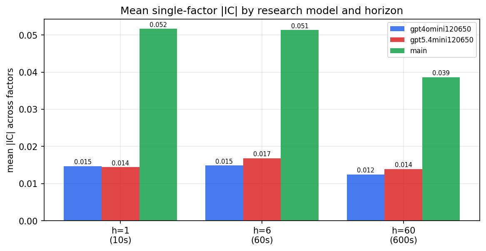

*Mean |IC| by research model and horizon*

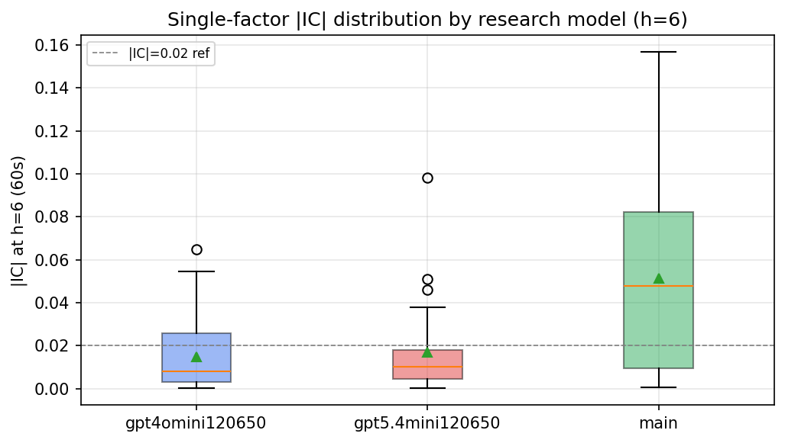

*Per-factor |IC| distribution by research model*

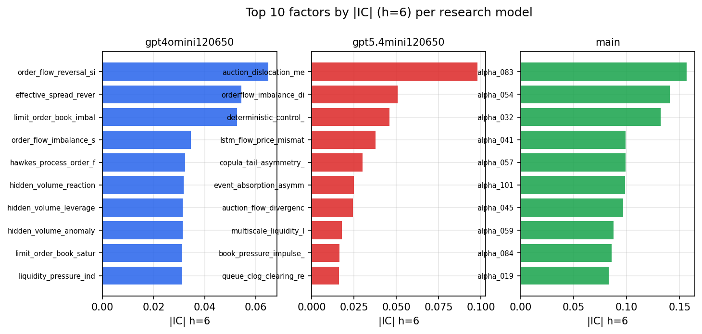

*Top factors by |IC| per research model*

## 2. Factor diversity & redundancy

Pairwise correlation of each zoo's *signals*. `eff_n_factors` is the effective number of independent factors (participation ratio of the correlation eigenvalues); `eff_ratio` and `redundancy` summarise how much unique information the zoo holds vs. how much is duplicated; `n_clusters` groups factors at |corr| ≥ 0.7.

| prerun | n_factors | eff_n_factors | eff_ratio | mean_abs_corr | n_clusters | redundancy |
| --- | --- | --- | --- | --- | --- | --- |
| gpt4omini120650 | 66 | 37.948 | 0.575 | 0.0396 | 56 | 0.425 |
| gpt5.4mini120650 | 69 | 56.3754 | 0.817 | 0.0091 | 64 | 0.183 |
| main | 78 | 39.3372 | 0.5043 | 0.0377 | 71 | 0.4957 |

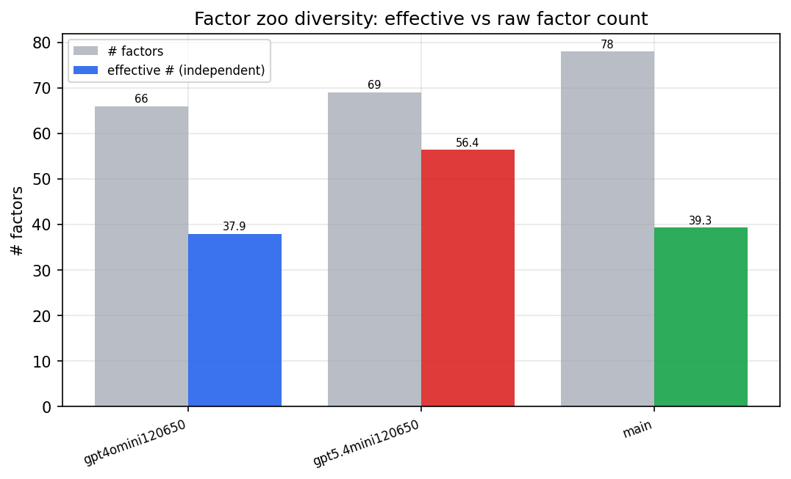

*Effective vs raw factor count per research model*

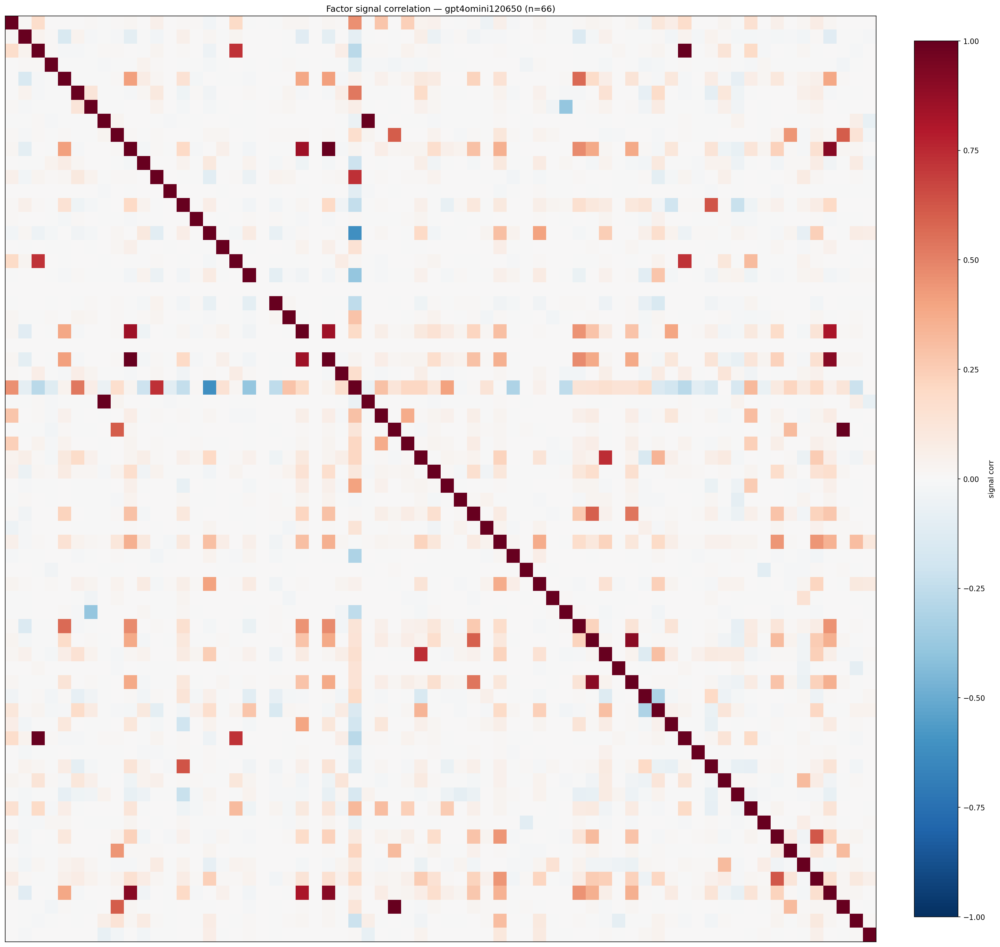

*Signal correlation matrix — gpt4omini120650*

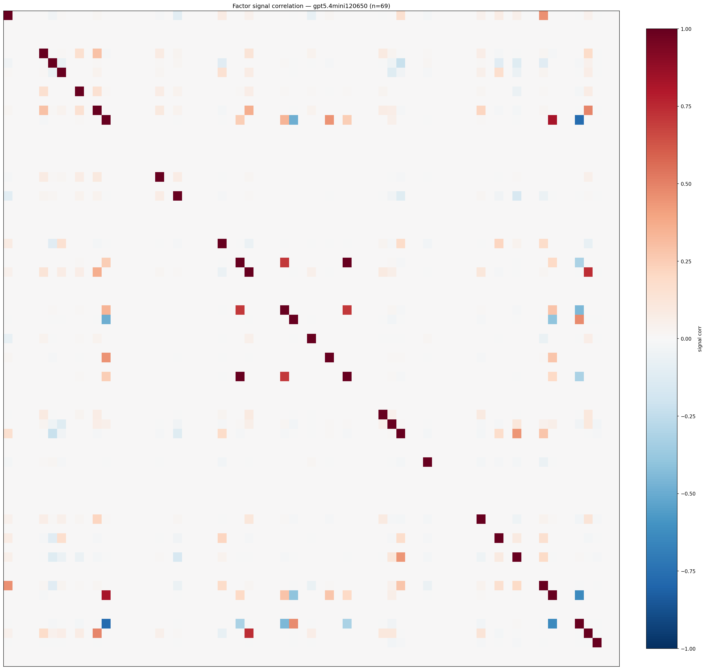

*Signal correlation matrix — gpt5.4mini120650*

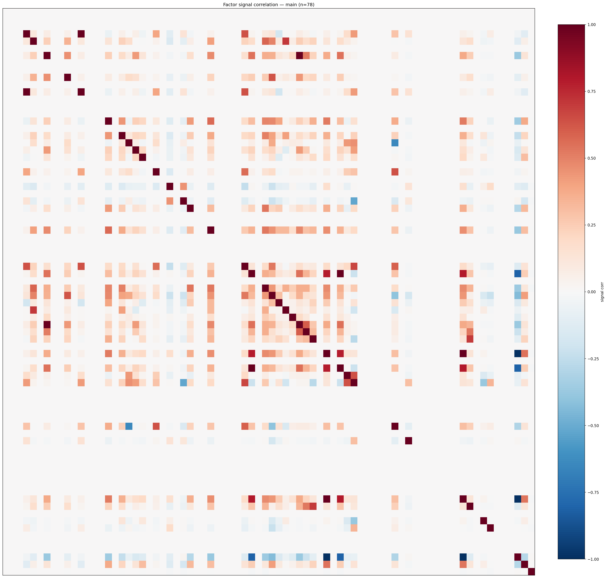

*Signal correlation matrix — main*

## 3. Deflation & model-based importance

`deflated_best_ic` haircuts each zoo's best |IC| for the number of factors tried (`ic_n_tested`) — a bigger zoo's best factor is more likely to be lucky. `lasso_n_nonzero` / `lasso_sparsity` show how many factors a sparse linear model actually keeps (model-view redundancy).

| prerun | best_ic | deflated_best_ic | deflated_best_t | ic_n_tested | ic_n_obs | lasso_n_nonzero | lasso_sparsity |
| --- | --- | --- | --- | --- | --- | --- | --- |
| gpt4omini120650 | 0.0649 | 0.0573 | 21.6545 | 64 | 142739 | 12 | 0.8182 |
| gpt5.4mini120650 | 0.0981 | 0.0912 | 34.4498 | 29 | 142739 | 7 | 0.8986 |
| main | 0.1567 | 0.1495 | 56.4937 | 38 | 142739 | 14 | 0.8205 |

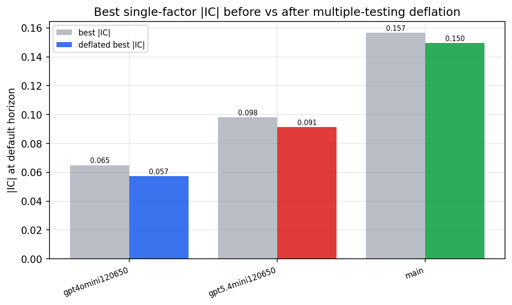

*Best |IC| before vs after multiple-testing deflation*

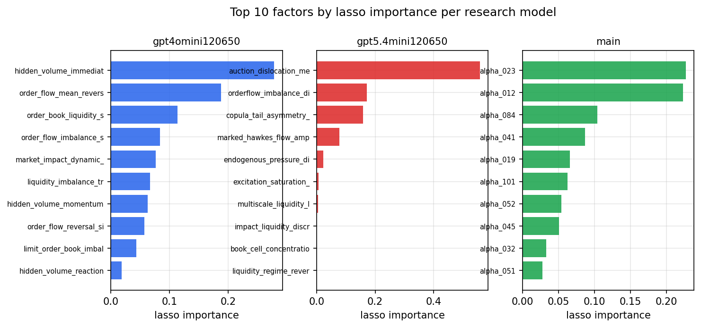

*Top factors by lasso importance per zoo*

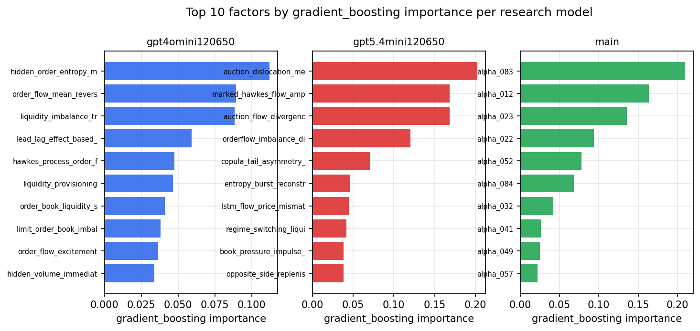

*Top factors by gradient_boosting importance per zoo*

## 4. ML-combined signal — per-underlying vectorised backtest

Each model combines a prerun's factors into ONE signal (fit `factors → forward return` on IS, predict per (bar, underlying)), then that combined signal is run through a simple vectorised backtest — `position(signal) × the underlying's own forward return` — on the held-out OOS tail (+ an equal-weight ensemble). No cross-sectional ranking.

> Config: position=**threshold** (t=1.0, z-score `expanding`), aggregation=**portfolio**, fit-standardise=**per_underlying**, horizon=6.

| prerun | model | n_factors_used | oos_ic | oos_sharpe | is_sharpe | oos_ann_return | oos_max_drawdown |
| --- | --- | --- | --- | --- | --- | --- | --- |
| gpt4omini120650 | linear_regression | 66 | 0.0525 | 10.7041 | 22.5907 | 0.9135 | -0.0097 |
| gpt4omini120650 | ridge | 66 | 0.0478 | 9.6617 | 21.8881 | 0.7953 | -0.0111 |
| gpt4omini120650 | lasso | 66 | 0.0561 | 14.9708 | 24.83 | 0.94 | -0.0047 |
| gpt4omini120650 | elastic_net | 66 | 0.0563 | 14.7721 | 23.7149 | 0.9274 | -0.0048 |
| gpt4omini120650 | random_forest | 66 | 0.0837 | 15.5908 | 31.0343 | 1.7177 | -0.0122 |
| gpt4omini120650 | gradient_boosting | 66 | 0.0477 | 3.4985 | 17.7798 | 0.2813 | -0.0167 |
| gpt4omini120650 | xgboost | 66 | 0.0447 | 6.6137 | 30.6453 | 0.8635 | -0.0168 |
| gpt4omini120650 | lightgbm | 66 | 0.0389 | 5.3632 | 27.9397 | 0.6313 | -0.0166 |
| gpt4omini120650 | ensemble | 66 | 0.0643 | 14.5994 | 30.0026 | 1.7237 | -0.0109 |
| gpt5.4mini120650 | linear_regression | 69 | 0.0614 | 18.7988 | 30.6793 | 1.4052 | -0.0071 |
| gpt5.4mini120650 | ridge | 69 | 0.0617 | 18.5636 | 31.5113 | 1.4161 | -0.0087 |
| gpt5.4mini120650 | lasso | 69 | 0.0649 | 22.7413 | 31.5866 | 1.5792 | -0.0066 |
| gpt5.4mini120650 | elastic_net | 69 | 0.064 | 21.9025 | 31.7874 | 1.5635 | -0.0065 |
| gpt5.4mini120650 | random_forest | 69 | 0.0984 | 26.6518 | 39.8482 | 2.414 | -0.0071 |
| gpt5.4mini120650 | gradient_boosting | 69 | 0.0854 | 12.0888 | 26.4442 | 0.9178 | -0.0083 |
| gpt5.4mini120650 | xgboost | 69 | 0.0829 | 19.123 | 33.9089 | 1.7183 | -0.0073 |
| gpt5.4mini120650 | lightgbm | 69 | 0.0734 | 12.9554 | 35.9106 | 1.176 | -0.011 |
| gpt5.4mini120650 | ensemble | 69 | 0.0812 | 22.8874 | 32.652 | 2.0462 | -0.0062 |
| main | linear_regression | 78 | 0.078 | 21.2756 | 21.3418 | 1.9193 | -0.012 |
| main | ridge | 78 | 0.0729 | 17.4663 | 21.6094 | 1.509 | -0.0114 |
| main | lasso | 78 | 0.059 | 22.209 | 27.9389 | 1.8013 | -0.009 |
| main | elastic_net | 78 | 0.0647 | 23.2778 | 28.2508 | 1.8816 | -0.0091 |
| main | random_forest | 78 | 0.1166 | 31.4223 | 32.44 | 2.6257 | -0.0063 |
| main | gradient_boosting | 78 | 0.1102 | 14.3414 | 26.05 | 0.9268 | -0.0093 |
| main | xgboost | 78 | 0.1104 | 22.0335 | 28.7623 | 1.617 | -0.007 |
| main | lightgbm | 78 | 0.09 | 21.2067 | 35.0047 | 1.9572 | -0.0079 |
| main | ensemble | 78 | 0.0968 | 24.8215 | 33.6643 | 2.2536 | -0.0092 |

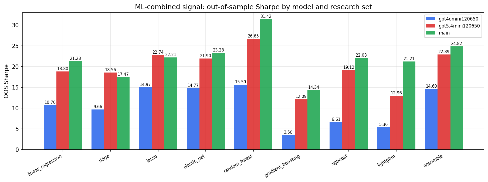

*ML-combined OOS Sharpe by model and research set*

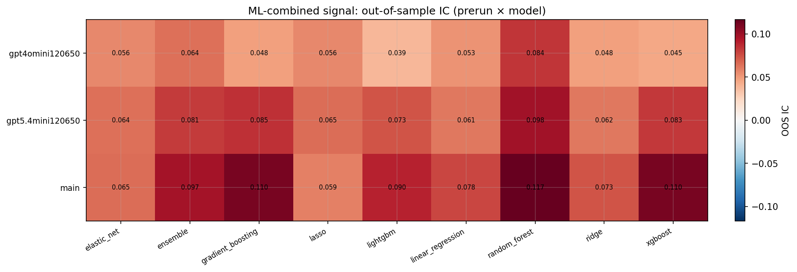

*ML-combined OOS IC (prerun × model)*

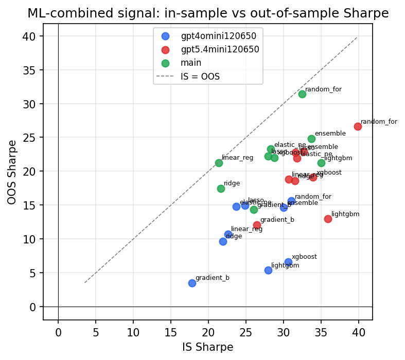

*IS vs OOS Sharpe (overfitting diagnostic)*

---
*Generated by `run_model_comparison.py`. Tables: `*.csv`; interactive: `comparison.ipynb`.*
