# Research-LLM factor comparison — `2026-04`

Comparing the **factor output of different research LLMs** on three axes (raw factor quality → factors as ML features → factors through the full agentic fund). The panel, IS/OOS split, horizon and model hyper-parameters are held identical across preruns — the *only* variable is the factor set.

## Preruns compared

| prerun | research_model | usable_factors | dropped_factors |
| --- | --- | --- | --- |
| gpt4omini120650 | gpt-4o-mini | 66 | 0 |
| gpt5.4mini120650 | gpt-5.4-mini | 69 | 0 |
| main | seed library | 78 | 10 |

> Dropped factors declare fields the current data doesn't have yet (e.g. fundamentals); they light up unchanged once that data is downloaded.

*Usable vs awaiting-data factors per research model*

## Key findings

- **Best ML-combined OOS Sharpe:** `gpt5.4mini120650` with `lasso` (OOS Sharpe = 44.343).
- **Mean OOS Sharpe across models, by research set:** `gpt5.4mini120650` = 32.051, `main` = 25.135, `gpt4omini120650` = 4.074.
- **Highest mean single-factor |IC| (h=6):** `main` (mean |IC| = 0.0558).
- **Most diverse zoo (highest effective/raw factor ratio):** `gpt5.4mini120650` (eff 57.2 of 69, ratio 0.83).
- **Best selection-deflated single-factor |IC|:** `main` (deflated |IC| = 0.1460 from 38 factors tried).

## 1. Single-factor IC (raw factor quality)

Per-underlying time-series Spearman rank-IC of every researched factor, recomputed on the shared panel at horizons h=1, h=6, h=60. The per-underlying IC correlates each factor's value vector with the underlying's own forward-return vector (pooled across underlyings); the cross-sectional IC ranks across underlyings per timestamp.

| prerun | n_factors | mean_abs_ic_1 | mean_abs_ic_6 | mean_abs_ic_60 | mean_abs_icir_6 | best_factor_h6 | best_abs_ic_h6 |
| --- | --- | --- | --- | --- | --- | --- | --- |
| gpt4omini120650 | 66 | 0.0096 | 0.0098 | 0.0082 | 0.381 | effective_spread_reversal_strength | 0.0749 |
| gpt5.4mini120650 | 69 | 0.0115 | 0.0118 | 0.0106 | 0.7086 | auction_dislocation_mean_reversion | 0.1029 |
| main | 78 | 0.0592 | 0.0558 | 0.0414 | 1.629 | alpha_083 | 0.1531 |

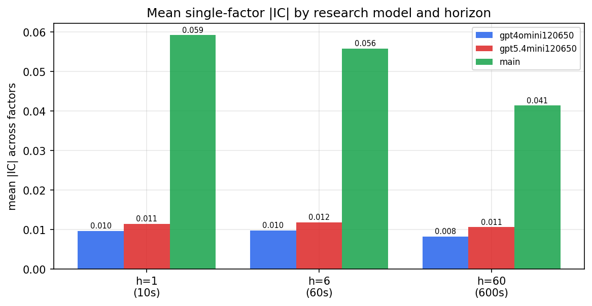

*Mean |IC| by research model and horizon*

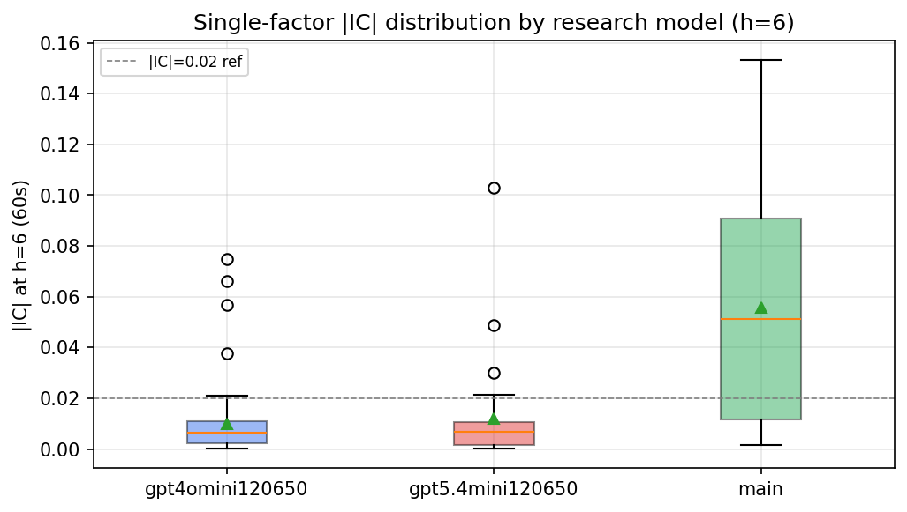

*Per-factor |IC| distribution by research model*

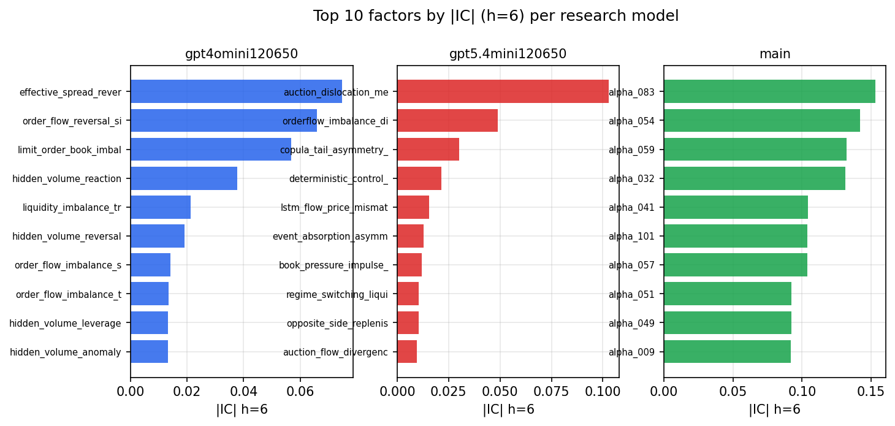

*Top factors by |IC| per research model*

## 2. Factor diversity & redundancy

Pairwise correlation of each zoo's *signals*. `eff_n_factors` is the effective number of independent factors (participation ratio of the correlation eigenvalues); `eff_ratio` and `redundancy` summarise how much unique information the zoo holds vs. how much is duplicated; `n_clusters` groups factors at |corr| ≥ 0.7.

| prerun | n_factors | eff_n_factors | eff_ratio | mean_abs_corr | n_clusters | redundancy |
| --- | --- | --- | --- | --- | --- | --- |
| gpt4omini120650 | 66 | 35.0266 | 0.5307 | 0.0411 | 55 | 0.4693 |
| gpt5.4mini120650 | 69 | 57.2479 | 0.8297 | 0.0085 | 65 | 0.1703 |
| main | 78 | 38.3082 | 0.4911 | 0.0379 | 70 | 0.5089 |

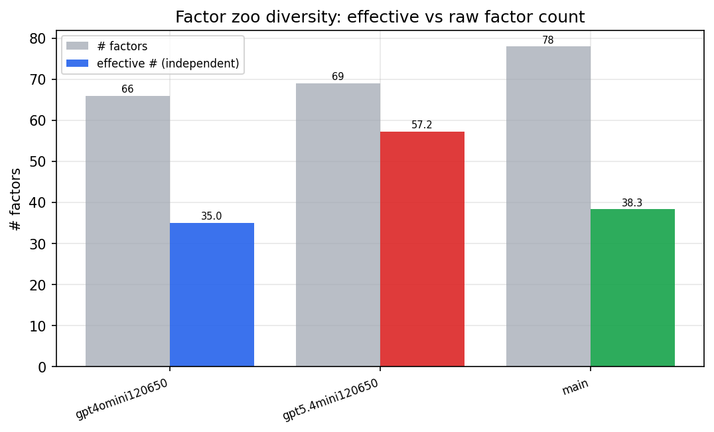

*Effective vs raw factor count per research model*

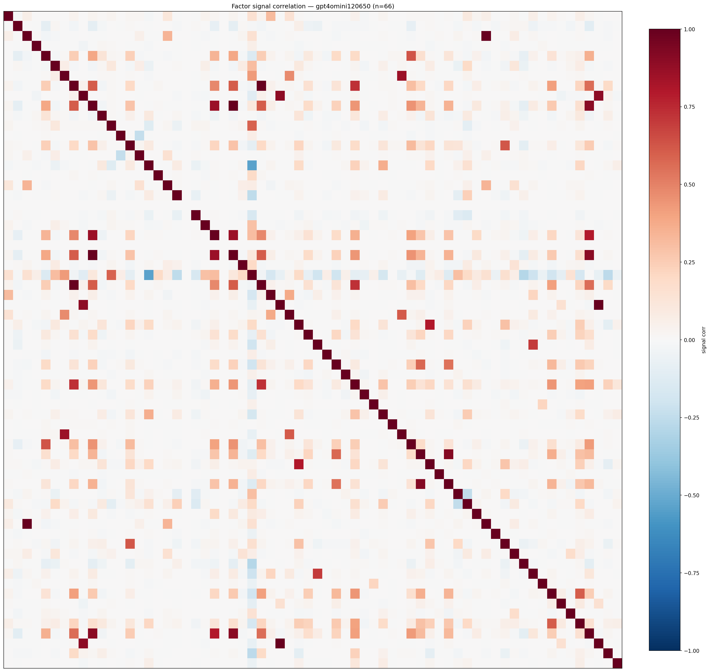

*Signal correlation matrix — gpt4omini120650*

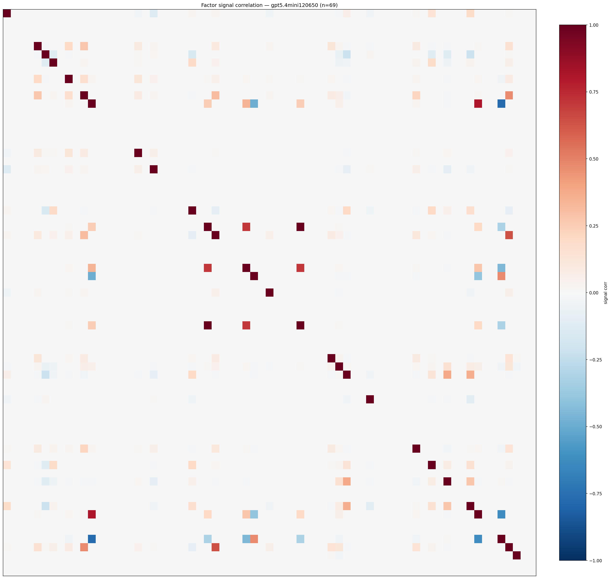

*Signal correlation matrix — gpt5.4mini120650*

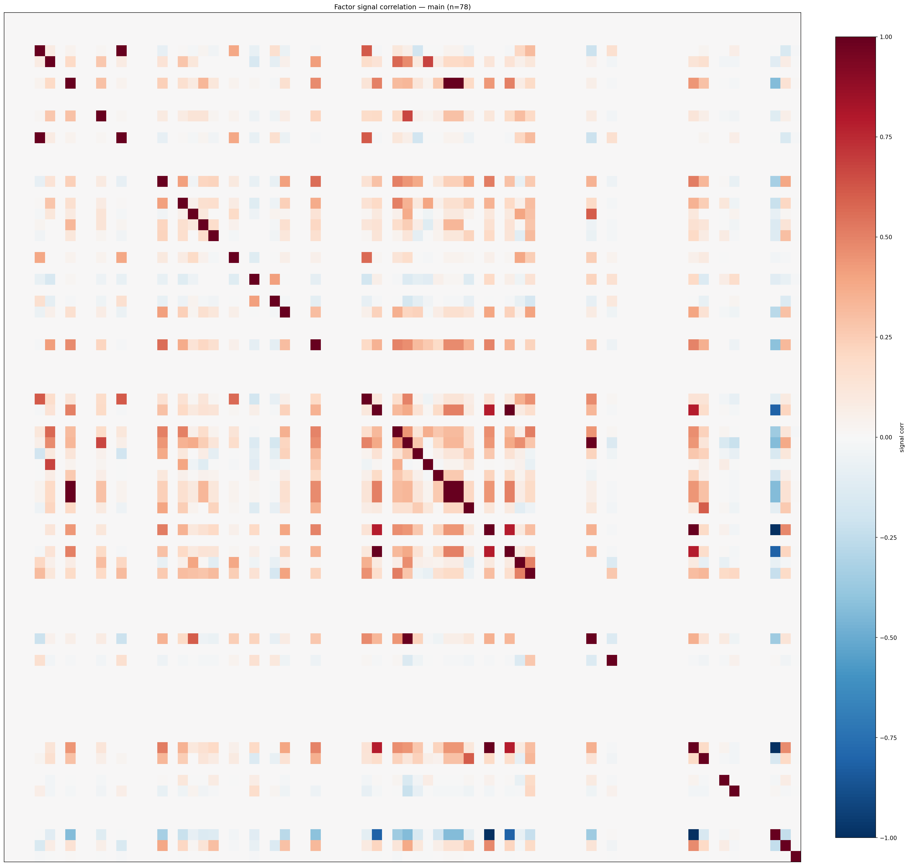

*Signal correlation matrix — main*

## 3. Deflation & model-based importance

`deflated_best_ic` haircuts each zoo's best |IC| for the number of factors tried (`ic_n_tested`) — a bigger zoo's best factor is more likely to be lucky. `lasso_n_nonzero` / `lasso_sparsity` show how many factors a sparse linear model actually keeps (model-view redundancy).

| prerun | best_ic | deflated_best_ic | deflated_best_t | ic_n_tested | ic_n_obs | lasso_n_nonzero | lasso_sparsity |
| --- | --- | --- | --- | --- | --- | --- | --- |
| gpt4omini120650 | 0.0749 | 0.0673 | 25.6373 | 64 | 145079 | 12 | 0.8182 |
| gpt5.4mini120650 | 0.1029 | 0.0961 | 36.6072 | 29 | 145079 | 9 | 0.8696 |
| main | 0.1531 | 0.146 | 55.6254 | 38 | 145079 | 13 | 0.8333 |

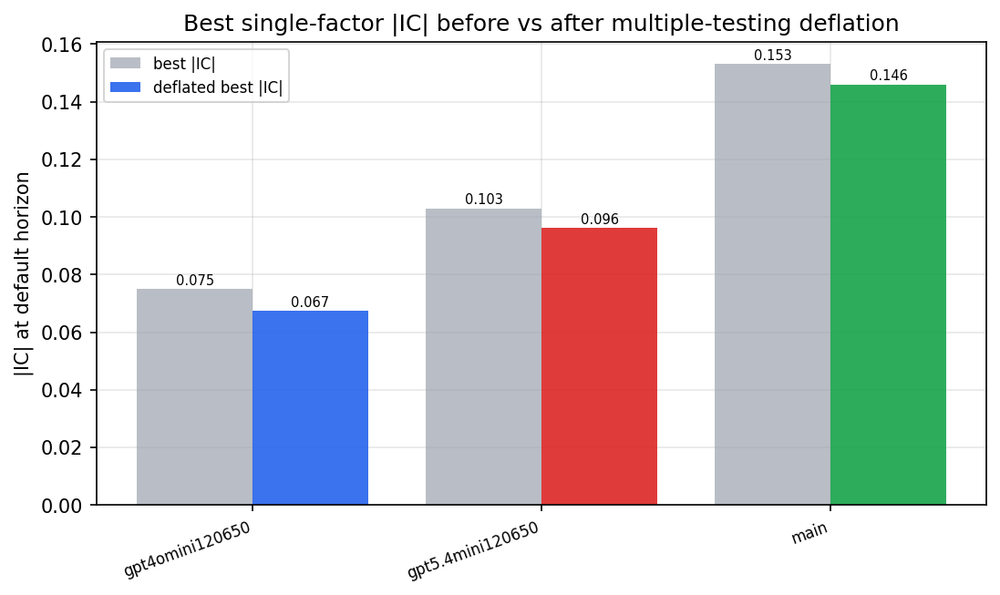

*Best |IC| before vs after multiple-testing deflation*

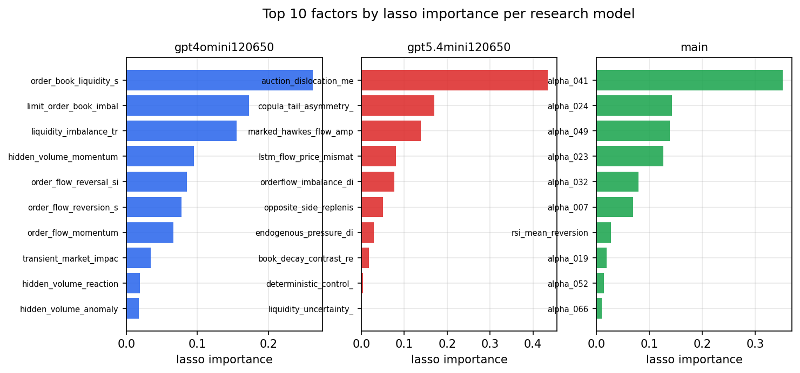

*Top factors by lasso importance per zoo*

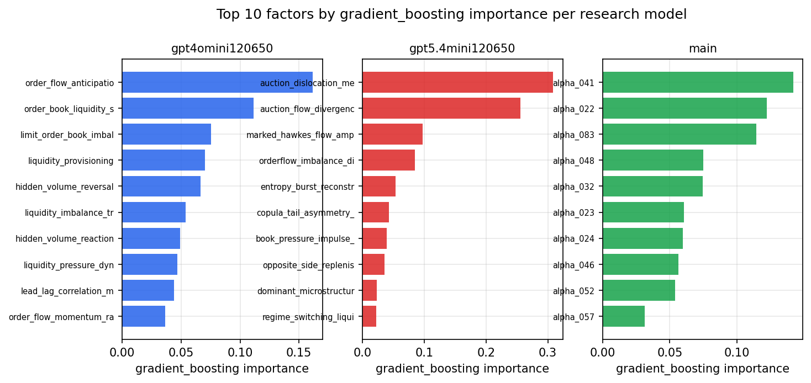

*Top factors by gradient_boosting importance per zoo*

## 4. ML-combined signal — per-underlying vectorised backtest

Each model combines a prerun's factors into ONE signal (fit `factors → forward return` on IS, predict per (bar, underlying)), then that combined signal is run through a simple vectorised backtest — `position(signal) × the underlying's own forward return` — on the held-out OOS tail (+ an equal-weight ensemble). No cross-sectional ranking.

> Config: position=**threshold** (t=1.0, z-score `expanding`), aggregation=**portfolio**, fit-standardise=**per_underlying**, horizon=6.

| prerun | model | n_factors_used | oos_ic | oos_sharpe | is_sharpe | oos_ann_return | oos_max_drawdown |
| --- | --- | --- | --- | --- | --- | --- | --- |
| gpt4omini120650 | linear_regression | 66 | 0.0489 | 6.5723 | 19.3832 | 0.6978 | -0.0215 |
| gpt4omini120650 | ridge | 66 | 0.0489 | 5.9784 | 18.4434 | 0.6236 | -0.0229 |
| gpt4omini120650 | lasso | 66 | 0.0462 | 4.4467 | 13.8911 | 0.4622 | -0.0235 |
| gpt4omini120650 | elastic_net | 66 | 0.0484 | 4.735 | 15.5831 | 0.4929 | -0.025 |
| gpt4omini120650 | random_forest | 66 | 0.0697 | 7.7642 | 19.0675 | 0.8068 | -0.0196 |
| gpt4omini120650 | gradient_boosting | 66 | 0.0708 | 1.3517 | 18.6195 | 0.1237 | -0.0186 |
| gpt4omini120650 | xgboost | 66 | 0.0864 | -0.3726 | 24.4276 | -0.0264 | -0.0165 |
| gpt4omini120650 | lightgbm | 66 | 0.0765 | -0.5322 | 28.8767 | -0.0304 | -0.0123 |
| gpt4omini120650 | ensemble | 66 | 0.0685 | 6.7206 | 25.8509 | 0.6957 | -0.0185 |
| gpt5.4mini120650 | linear_regression | 69 | 0.1078 | 36.7714 | 24.4568 | 1.7839 | -0.0041 |
| gpt5.4mini120650 | ridge | 69 | 0.1066 | 36.5341 | 24.5319 | 1.762 | -0.0042 |
| gpt5.4mini120650 | lasso | 69 | 0.1052 | 44.3433 | 27.3461 | 1.8447 | -0.0032 |
| gpt5.4mini120650 | elastic_net | 69 | 0.1052 | 44.3433 | 27.3461 | 1.8447 | -0.0032 |
| gpt5.4mini120650 | random_forest | 69 | 0.1182 | 32.6032 | 35.2861 | 1.4163 | -0.0055 |
| gpt5.4mini120650 | gradient_boosting | 69 | 0.0996 | 19.3616 | 28.5518 | 0.9898 | -0.0047 |
| gpt5.4mini120650 | xgboost | 69 | 0.1051 | 20.9137 | 35.3477 | 1.2078 | -0.0095 |
| gpt5.4mini120650 | lightgbm | 69 | 0.1026 | 16.404 | 37.6372 | 0.7203 | -0.0079 |
| gpt5.4mini120650 | ensemble | 69 | 0.1154 | 37.1824 | 33.249 | 1.7416 | -0.0031 |
| main | linear_regression | 78 | 0.1066 | 24.8094 | 24.8362 | 1.0235 | -0.0069 |
| main | ridge | 78 | 0.1114 | 28.9663 | 26.7829 | 1.1826 | -0.0059 |
| main | lasso | 78 | 0.1198 | 30.8702 | 25.4537 | 1.2529 | -0.0059 |
| main | elastic_net | 78 | 0.1198 | 30.8702 | 25.4537 | 1.2529 | -0.0059 |
| main | random_forest | 78 | 0.1272 | 16.7174 | 24.2002 | 1.051 | -0.0104 |
| main | gradient_boosting | 78 | 0.1237 | 19.6762 | 27.1546 | 0.5464 | -0.0023 |
| main | xgboost | 78 | 0.1303 | 24.6718 | 31.299 | 0.8693 | -0.0041 |
| main | lightgbm | 78 | 0.1195 | 21.3567 | 33.0468 | 0.7301 | -0.0045 |
| main | ensemble | 78 | 0.1229 | 28.2798 | 28.7811 | 1.1613 | -0.0059 |

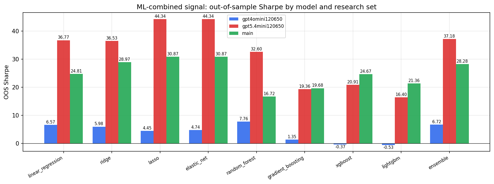

*ML-combined OOS Sharpe by model and research set*

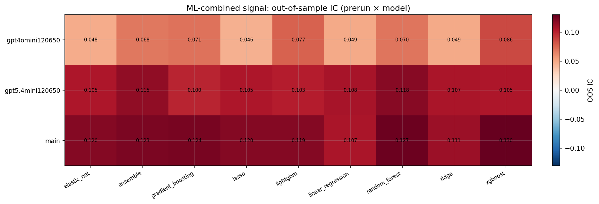

*ML-combined OOS IC (prerun × model)*

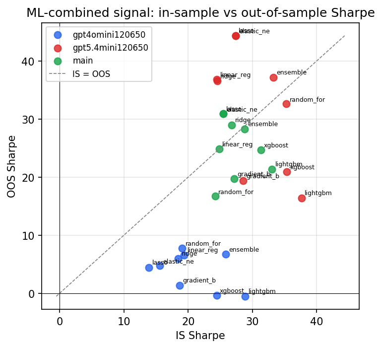

*IS vs OOS Sharpe (overfitting diagnostic)*

---
*Generated by `run_model_comparison.py`. Tables: `*.csv`; interactive: `comparison.ipynb`.*
