# Research-LLM factor comparison — `2026-05`

Comparing the **factor output of different research LLMs** on three axes (raw factor quality → factors as ML features → factors through the full agentic fund). The panel, IS/OOS split, horizon and model hyper-parameters are held identical across preruns — the *only* variable is the factor set.

## Preruns compared

| prerun | research_model | usable_factors | dropped_factors |
| --- | --- | --- | --- |
| gpt4omini120650 | gpt-4o-mini | 66 | 0 |
| gpt5.4mini120650 | gpt-5.4-mini | 69 | 0 |
| main | seed library | 78 | 10 |

> Dropped factors declare fields the current data doesn't have yet (e.g. fundamentals); they light up unchanged once that data is downloaded.

*Usable vs awaiting-data factors per research model*

## Key findings

- **Best ML-combined OOS Sharpe:** `gpt5.4mini120650` with `xgboost` (OOS Sharpe = 26.603).
- **Mean OOS Sharpe across models, by research set:** `gpt5.4mini120650` = 21.335, `main` = 12.728, `gpt4omini120650` = 5.629.
- **Highest mean single-factor |IC| (h=6):** `main` (mean |IC| = 0.0475).
- **Most diverse zoo (highest effective/raw factor ratio):** `gpt5.4mini120650` (eff 56.9 of 69, ratio 0.82).
- **Best selection-deflated single-factor |IC|:** `main` (deflated |IC| = 0.1257 from 38 factors tried).

## 1. Single-factor IC (raw factor quality)

Per-underlying time-series Spearman rank-IC of every researched factor, recomputed on the shared panel at horizons h=1, h=6, h=60. The per-underlying IC correlates each factor's value vector with the underlying's own forward-return vector (pooled across underlyings); the cross-sectional IC ranks across underlyings per timestamp.

| prerun | n_factors | mean_abs_ic_1 | mean_abs_ic_6 | mean_abs_ic_60 | mean_abs_icir_6 | best_factor_h6 | best_abs_ic_h6 |
| --- | --- | --- | --- | --- | --- | --- | --- |
| gpt4omini120650 | 66 | 0.0066 | 0.0089 | 0.007 | 0.3078 | effective_spread_reversal_strength | 0.0701 |
| gpt5.4mini120650 | 69 | 0.01 | 0.0115 | 0.0102 | 0.4653 | auction_dislocation_mean_reversion | 0.0942 |
| main | 78 | 0.0568 | 0.0475 | 0.0332 | 1.4579 | alpha_083 | 0.1327 |

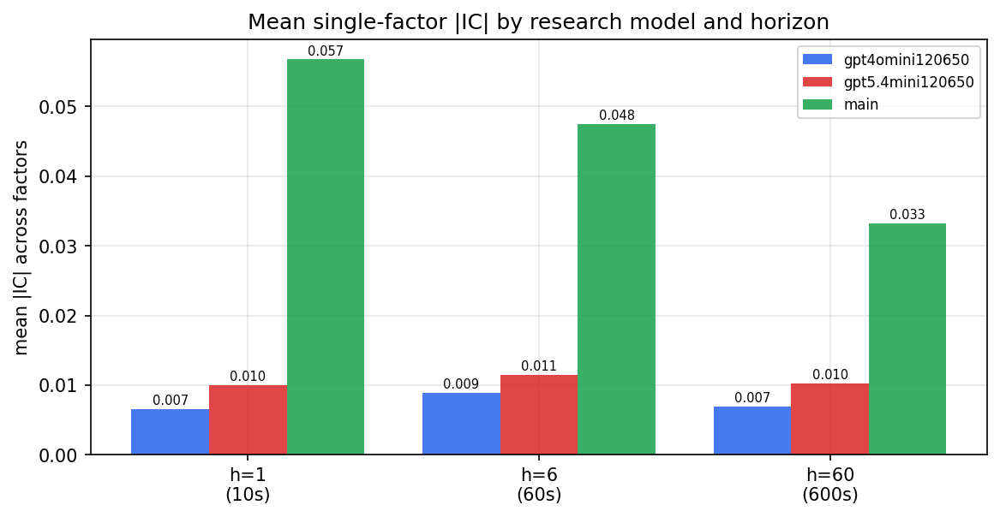

*Mean |IC| by research model and horizon*

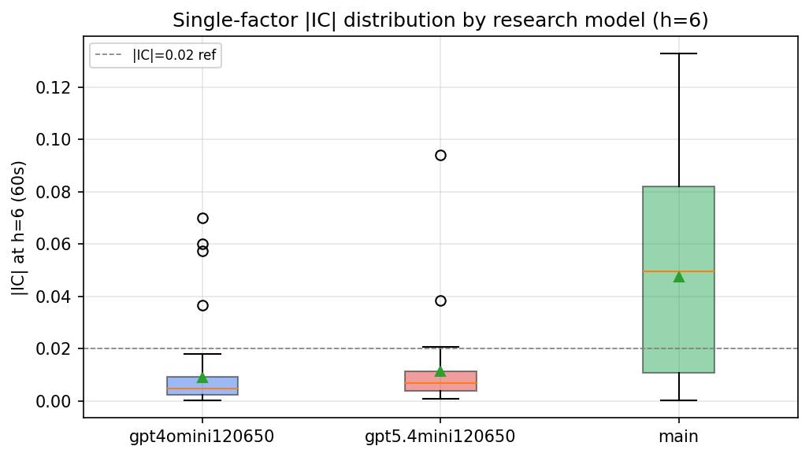

*Per-factor |IC| distribution by research model*

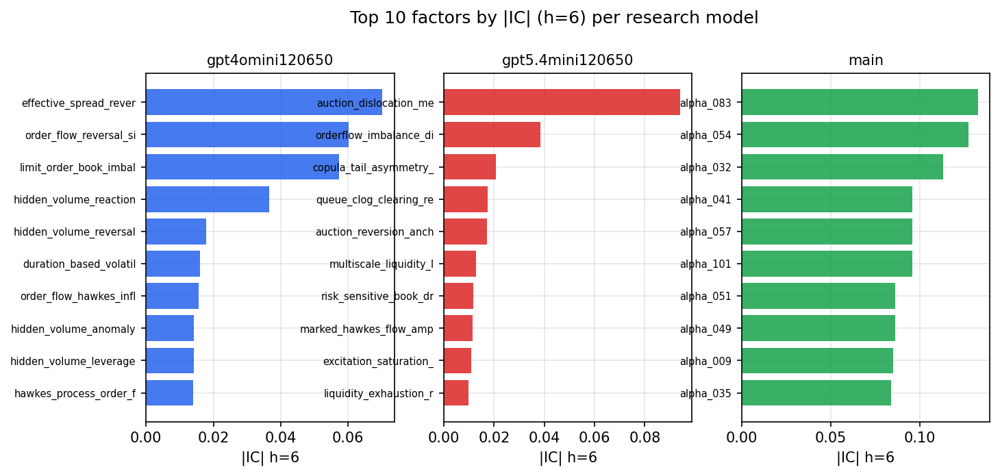

*Top factors by |IC| per research model*

## 2. Factor diversity & redundancy

Pairwise correlation of each zoo's *signals*. `eff_n_factors` is the effective number of independent factors (participation ratio of the correlation eigenvalues); `eff_ratio` and `redundancy` summarise how much unique information the zoo holds vs. how much is duplicated; `n_clusters` groups factors at |corr| ≥ 0.7.

| prerun | n_factors | eff_n_factors | eff_ratio | mean_abs_corr | n_clusters | redundancy |
| --- | --- | --- | --- | --- | --- | --- |
| gpt4omini120650 | 66 | 34.9757 | 0.5299 | 0.041 | 56 | 0.4701 |
| gpt5.4mini120650 | 69 | 56.8786 | 0.8243 | 0.0087 | 65 | 0.1757 |
| main | 78 | 37.9083 | 0.486 | 0.0385 | 68 | 0.514 |

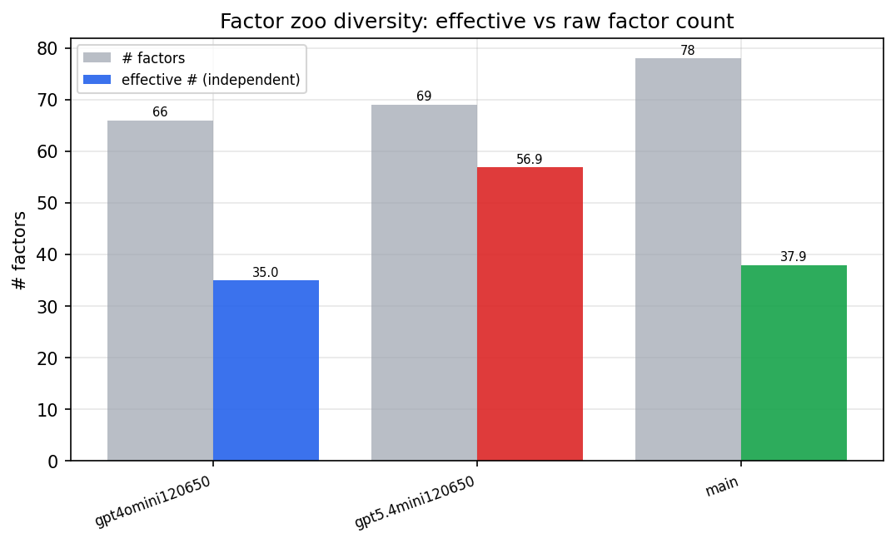

*Effective vs raw factor count per research model*

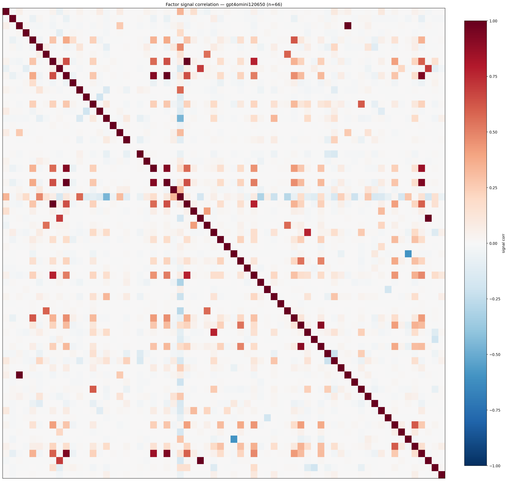

*Signal correlation matrix — gpt4omini120650*

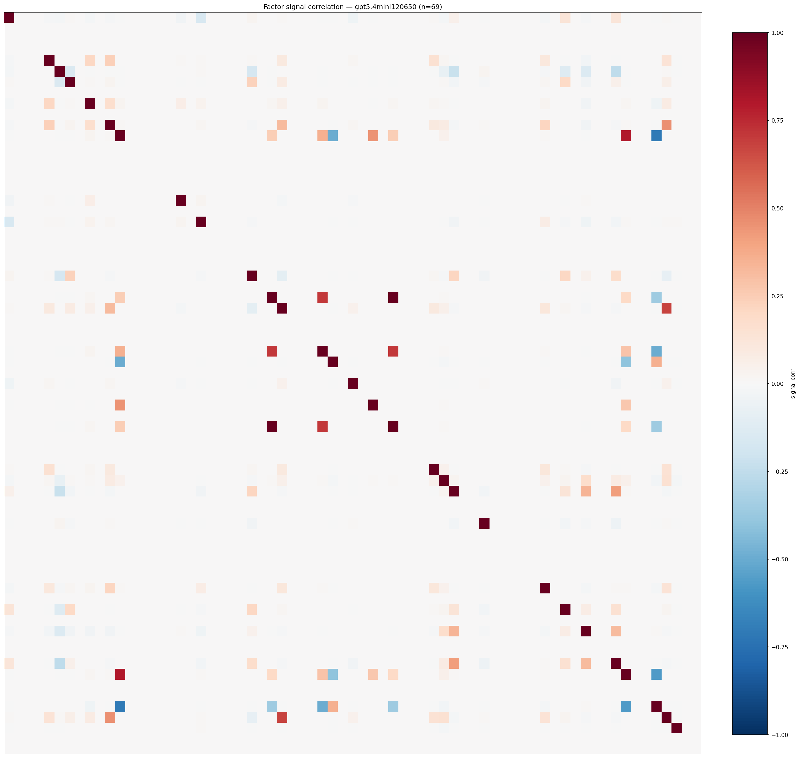

*Signal correlation matrix — gpt5.4mini120650*

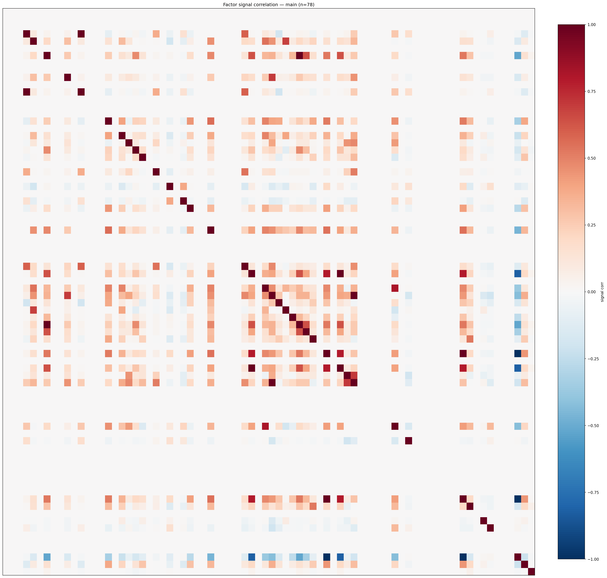

*Signal correlation matrix — main*

## 3. Deflation & model-based importance

`deflated_best_ic` haircuts each zoo's best |IC| for the number of factors tried (`ic_n_tested`) — a bigger zoo's best factor is more likely to be lucky. `lasso_n_nonzero` / `lasso_sparsity` show how many factors a sparse linear model actually keeps (model-view redundancy).

| prerun | best_ic | deflated_best_ic | deflated_best_t | ic_n_tested | ic_n_obs | lasso_n_nonzero | lasso_sparsity |
| --- | --- | --- | --- | --- | --- | --- | --- |
| gpt4omini120650 | 0.0701 | 0.0626 | 24.0475 | 64 | 147419 | 9 | 0.8636 |
| gpt5.4mini120650 | 0.0942 | 0.0874 | 33.5556 | 29 | 147419 | 16 | 0.7681 |
| main | 0.1327 | 0.1257 | 48.2667 | 38 | 147419 | 19 | 0.7564 |

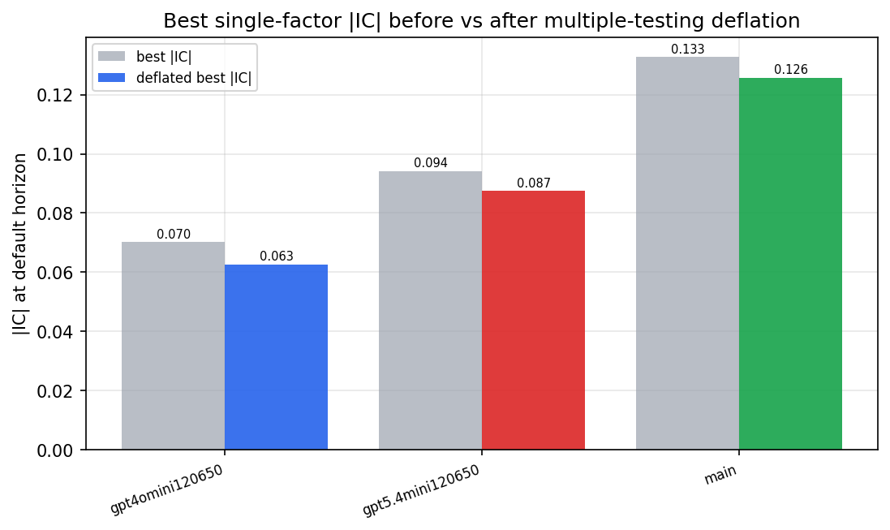

*Best |IC| before vs after multiple-testing deflation*

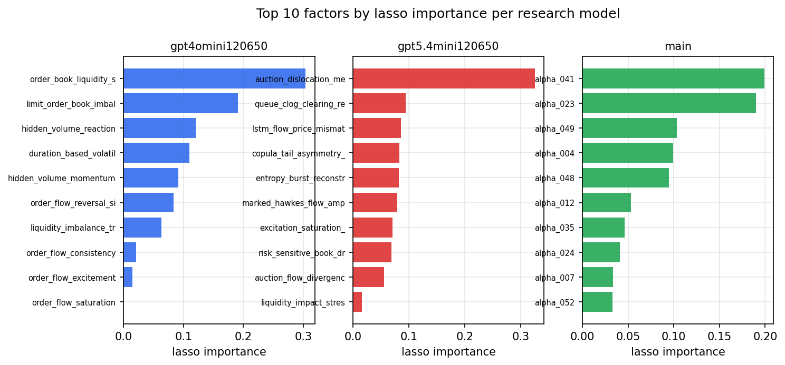

*Top factors by lasso importance per zoo*

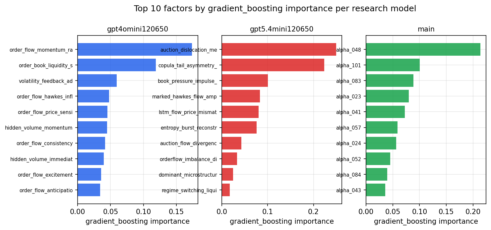

*Top factors by gradient_boosting importance per zoo*

## 4. ML-combined signal — per-underlying vectorised backtest

Each model combines a prerun's factors into ONE signal (fit `factors → forward return` on IS, predict per (bar, underlying)), then that combined signal is run through a simple vectorised backtest — `position(signal) × the underlying's own forward return` — on the held-out OOS tail (+ an equal-weight ensemble). No cross-sectional ranking.

> Config: position=**threshold** (t=1.0, z-score `expanding`), aggregation=**portfolio**, fit-standardise=**per_underlying**, horizon=6.

| prerun | model | n_factors_used | oos_ic | oos_sharpe | is_sharpe | oos_ann_return | oos_max_drawdown |
| --- | --- | --- | --- | --- | --- | --- | --- |
| gpt4omini120650 | linear_regression | 66 | 0.0456 | 5.8196 | 15.2497 | 0.5283 | -0.0189 |
| gpt4omini120650 | ridge | 66 | 0.045 | 6.4853 | 15.0625 | 0.5903 | -0.0186 |
| gpt4omini120650 | lasso | 66 | 0.0452 | 8.6077 | 11.5233 | 0.7392 | -0.012 |
| gpt4omini120650 | elastic_net | 66 | 0.0456 | 8.0478 | 11.3832 | 0.7082 | -0.0125 |
| gpt4omini120650 | random_forest | 66 | 0.0672 | 8.5553 | 18.9306 | 0.6809 | -0.0081 |
| gpt4omini120650 | gradient_boosting | 66 | 0.0567 | 1.8622 | 15.8271 | 0.1127 | -0.0083 |
| gpt4omini120650 | xgboost | 66 | 0.062 | 4.0935 | 18.8487 | 0.2472 | -0.0077 |
| gpt4omini120650 | lightgbm | 66 | 0.0653 | -1.0513 | 23.1069 | -0.0572 | -0.0159 |
| gpt4omini120650 | ensemble | 66 | 0.0596 | 8.2381 | 23.5297 | 0.6878 | -0.0151 |
| gpt5.4mini120650 | linear_regression | 69 | 0.0799 | 21.893 | 30.2445 | 1.1369 | -0.0095 |
| gpt5.4mini120650 | ridge | 69 | 0.0798 | 21.4251 | 29.5432 | 1.107 | -0.0095 |
| gpt5.4mini120650 | lasso | 69 | 0.0791 | 23.0416 | 30.4127 | 1.1497 | -0.0086 |
| gpt5.4mini120650 | elastic_net | 69 | 0.0791 | 23.0416 | 30.4127 | 1.1497 | -0.0086 |
| gpt5.4mini120650 | random_forest | 69 | 0.0816 | 14.2484 | 34.4679 | 1.0107 | -0.016 |
| gpt5.4mini120650 | gradient_boosting | 69 | 0.0827 | 18.7517 | 22.3711 | 0.7895 | -0.0065 |
| gpt5.4mini120650 | xgboost | 69 | 0.0869 | 26.6029 | 31.7873 | 1.2781 | -0.0041 |
| gpt5.4mini120650 | lightgbm | 69 | 0.0851 | 20.2988 | 28.2054 | 0.8574 | -0.0065 |
| gpt5.4mini120650 | ensemble | 69 | 0.0866 | 22.7153 | 31.9305 | 1.1596 | -0.0094 |
| main | linear_regression | 78 | 0.0712 | 11.8983 | 30.445 | 0.5662 | -0.006 |
| main | ridge | 78 | 0.0713 | 13.0764 | 31.2888 | 0.6615 | -0.0059 |
| main | lasso | 78 | 0.074 | 14.2217 | 31.6316 | 0.7291 | -0.0059 |
| main | elastic_net | 78 | 0.0748 | 14.4225 | 31.5906 | 0.7454 | -0.0059 |
| main | random_forest | 78 | 0.0799 | 14.9786 | 29.4115 | 0.7574 | -0.0085 |
| main | gradient_boosting | 78 | 0.0735 | 10.0716 | 27.7195 | 0.4785 | -0.0064 |
| main | xgboost | 78 | 0.0795 | 11.8898 | 31.5445 | 0.5709 | -0.0096 |
| main | lightgbm | 78 | 0.0722 | 10.0911 | 33.363 | 0.5264 | -0.0079 |
| main | ensemble | 78 | 0.0756 | 13.8984 | 33.0899 | 0.7094 | -0.0086 |

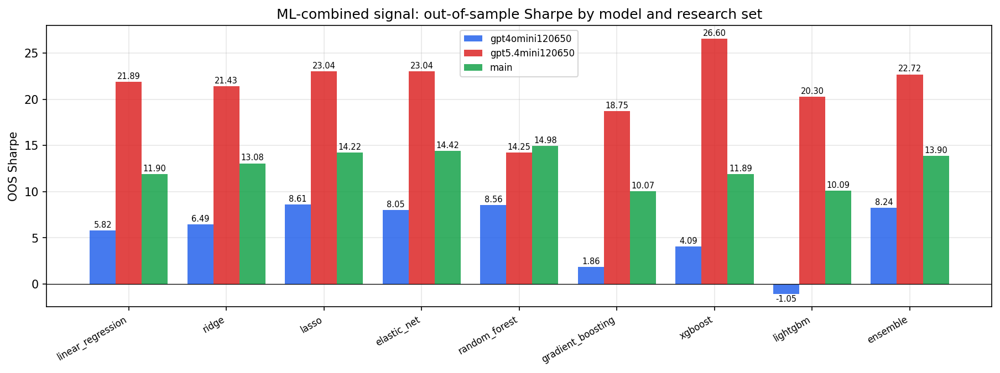

*ML-combined OOS Sharpe by model and research set*

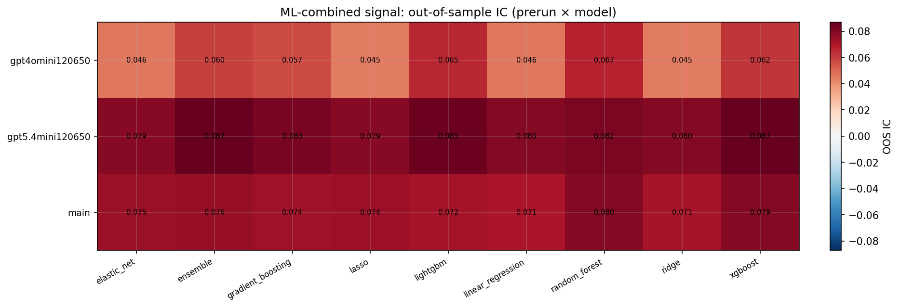

*ML-combined OOS IC (prerun × model)*

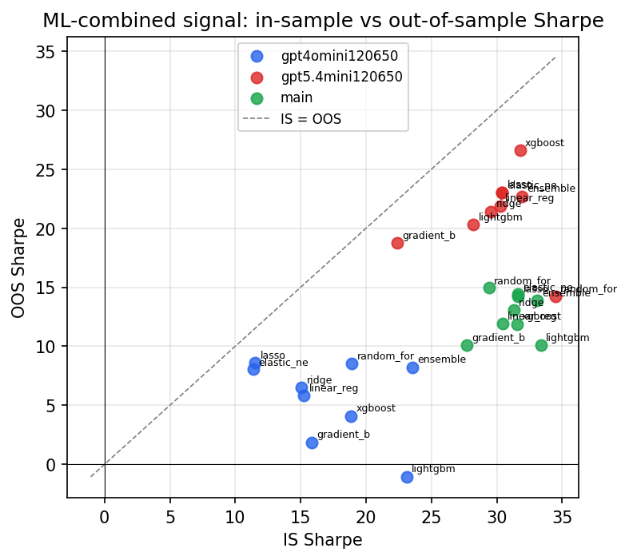

*IS vs OOS Sharpe (overfitting diagnostic)*

---
*Generated by `run_model_comparison.py`. Tables: `*.csv`; interactive: `comparison.ipynb`.*
