# Research-LLM factor comparison — `2024-04`

Comparing the **factor output of different research LLMs** on three axes (raw factor quality → factors as ML features → factors through the full agentic fund). The panel, IS/OOS split, horizon and model hyper-parameters are held identical across preruns — the *only* variable is the factor set.

## Preruns compared

| prerun | research_model | usable_factors | dropped_factors |
| --- | --- | --- | --- |
| gpt4omini120650 | gpt-4o-mini | 66 | 0 |
| gpt5.4mini120650 | gpt-5.4-mini | 68 | 1 |
| main | seed library | 77 | 11 |

> Dropped factors declare fields the current data doesn't have yet (e.g. fundamentals); they light up unchanged once that data is downloaded.

*Usable vs awaiting-data factors per research model*

## Key findings

- **Best ML-combined OOS Sharpe:** `gpt5.4mini120650` with `ensemble` (OOS Sharpe = 30.452).
- **Mean OOS Sharpe across models, by research set:** `gpt5.4mini120650` = 25.752, `main` = 24.585, `gpt4omini120650` = 16.524.
- **Highest mean single-factor |IC| (h=6):** `main` (mean |IC| = 0.0449).
- **Most diverse zoo (highest effective/raw factor ratio):** `gpt5.4mini120650` (eff 55.9 of 68, ratio 0.82).
- **Best selection-deflated single-factor |IC|:** `gpt4omini120650` (deflated |IC| = 0.3002 from 63 factors tried).

## 1. Single-factor IC (raw factor quality)

Per-underlying time-series Spearman rank-IC of every researched factor, recomputed on the shared panel at horizons h=1, h=6, h=60. The per-underlying IC correlates each factor's value vector with the underlying's own forward-return vector (pooled across underlyings); the cross-sectional IC ranks across underlyings per timestamp.

| prerun | n_factors | mean_abs_ic_1 | mean_abs_ic_6 | mean_abs_ic_60 | mean_abs_icir_6 | best_factor_h6 | best_abs_ic_h6 |
| --- | --- | --- | --- | --- | --- | --- | --- |
| gpt4omini120650 | 66 | 0.0294 | 0.031 | 0.024 | 0.624 | effective_spread_reversal_strength | 0.3078 |
| gpt5.4mini120650 | 68 | 0.0183 | 0.0201 | 0.0153 | 0.5819 | deterministic_control_gap | 0.1084 |
| main | 77 | 0.0412 | 0.0449 | 0.0313 | 0.4354 | alpha_058 | 0.2874 |

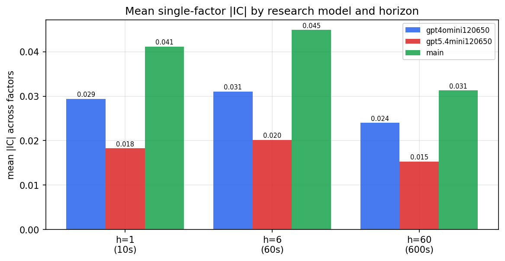

*Mean |IC| by research model and horizon*

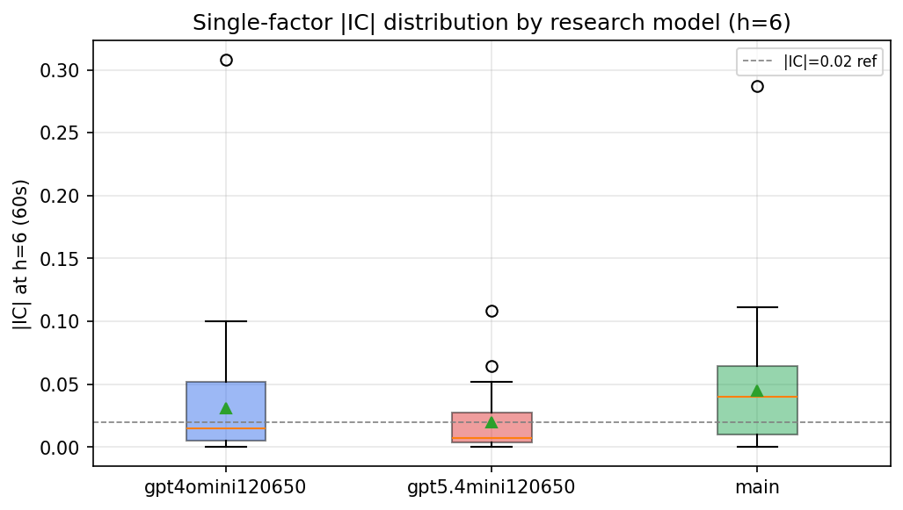

*Per-factor |IC| distribution by research model*

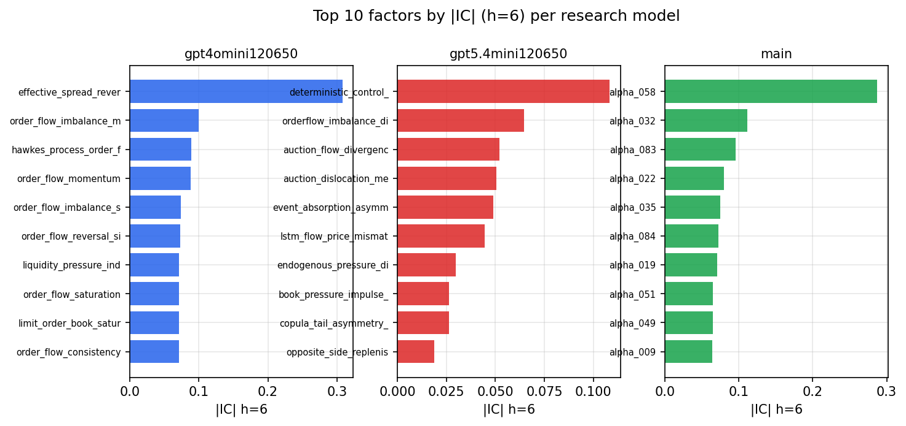

*Top factors by |IC| per research model*

## 2. Factor diversity & redundancy

Pairwise correlation of each zoo's *signals*. `eff_n_factors` is the effective number of independent factors (participation ratio of the correlation eigenvalues); `eff_ratio` and `redundancy` summarise how much unique information the zoo holds vs. how much is duplicated; `n_clusters` groups factors at |corr| ≥ 0.7.

| prerun | n_factors | eff_n_factors | eff_ratio | mean_abs_corr | n_clusters | redundancy |
| --- | --- | --- | --- | --- | --- | --- |
| gpt4omini120650 | 66 | 27.2462 | 0.4128 | 0.0641 | 18 | 0.5872 |
| gpt5.4mini120650 | 68 | 55.9326 | 0.8225 | 0.0084 | 63 | 0.1775 |
| main | 77 | 39.4444 | 0.5123 | 0.0379 | 65 | 0.4877 |

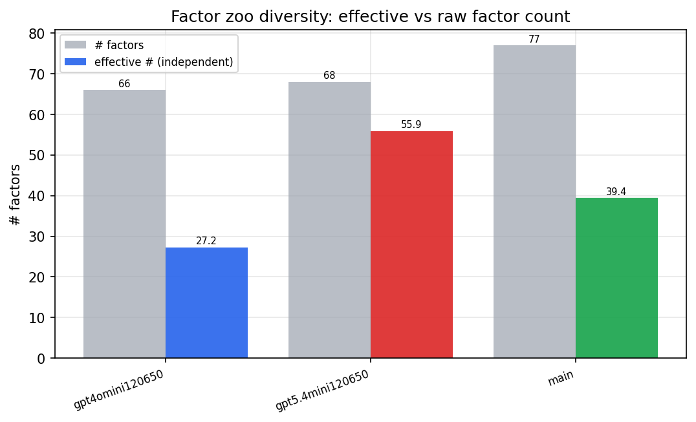

*Effective vs raw factor count per research model*

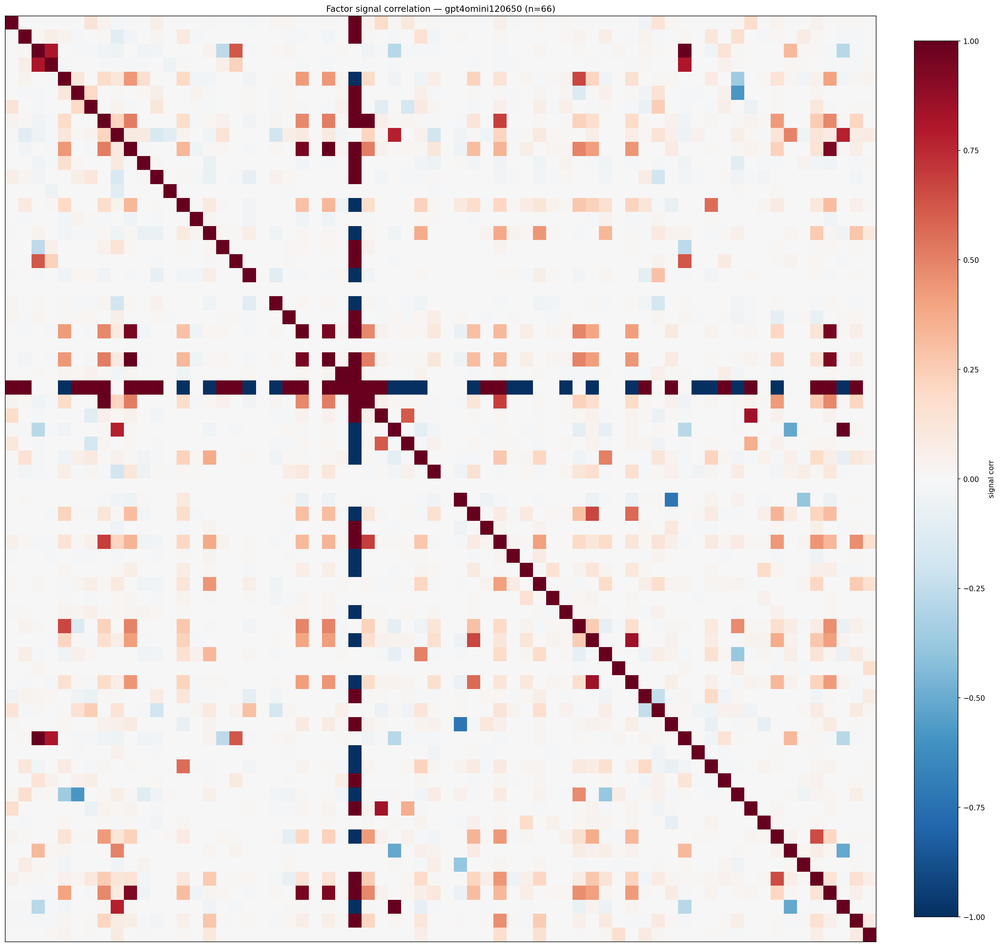

*Signal correlation matrix — gpt4omini120650*

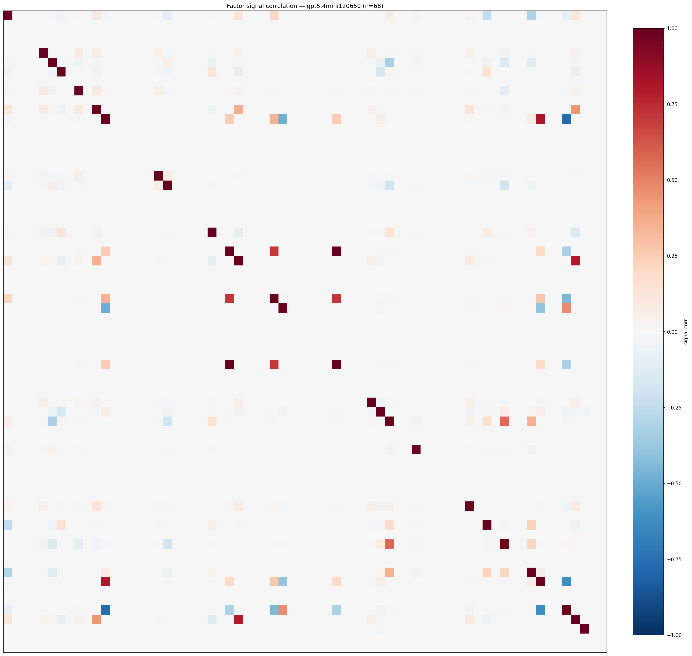

*Signal correlation matrix — gpt5.4mini120650*

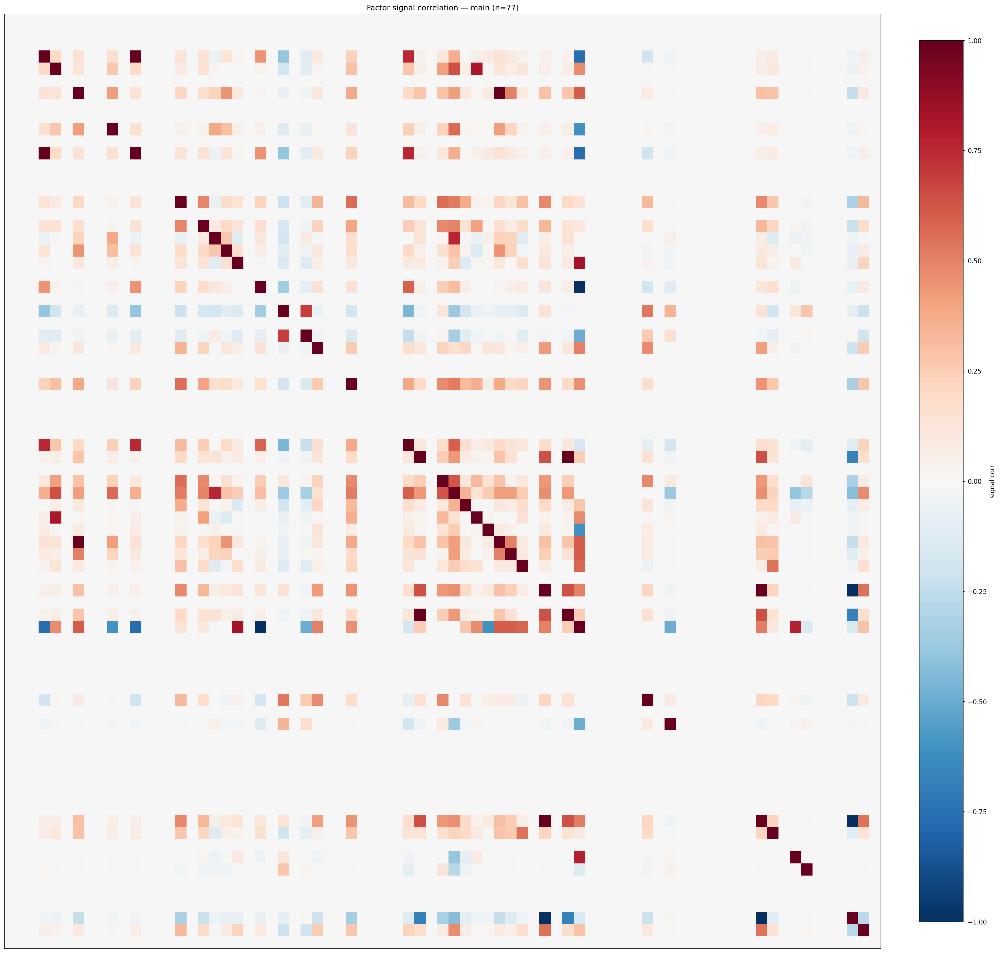

*Signal correlation matrix — main*

## 3. Deflation & model-based importance

`deflated_best_ic` haircuts each zoo's best |IC| for the number of factors tried (`ic_n_tested`) — a bigger zoo's best factor is more likely to be lucky. `lasso_n_nonzero` / `lasso_sparsity` show how many factors a sparse linear model actually keeps (model-view redundancy).

| prerun | best_ic | deflated_best_ic | deflated_best_t | ic_n_tested | ic_n_obs | lasso_n_nonzero | lasso_sparsity |
| --- | --- | --- | --- | --- | --- | --- | --- |
| gpt4omini120650 | 0.3078 | 0.3002 | 114.3491 | 63 | 145079 | 9 | 0.8636 |
| gpt5.4mini120650 | 0.1084 | 0.1016 | 38.6972 | 28 | 145079 | 9 | 0.8676 |
| main | 0.2874 | 0.2803 | 106.7732 | 36 | 145079 | 19 | 0.7532 |

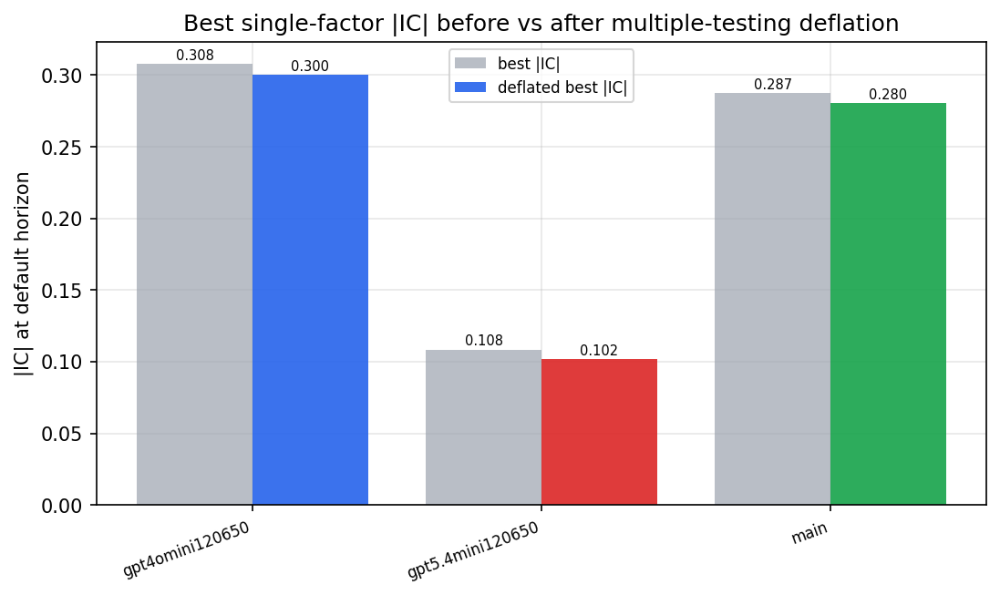

*Best |IC| before vs after multiple-testing deflation*

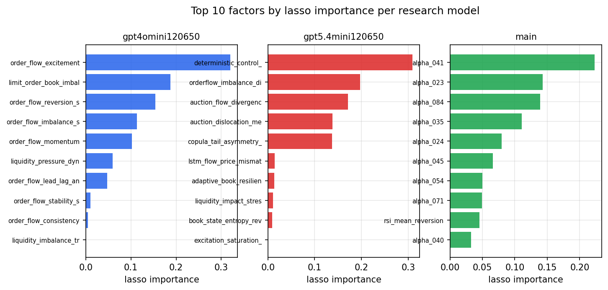

*Top factors by lasso importance per zoo*

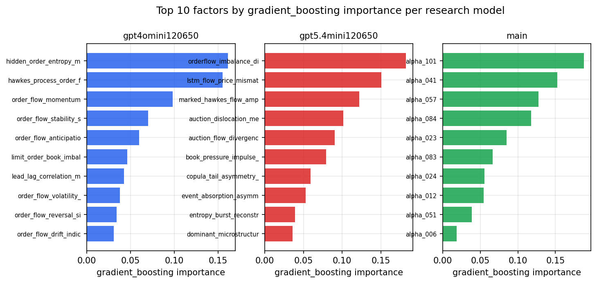

*Top factors by gradient_boosting importance per zoo*

## 4. ML-combined signal — per-underlying vectorised backtest

Each model combines a prerun's factors into ONE signal (fit `factors → forward return` on IS, predict per (bar, underlying)), then that combined signal is run through a simple vectorised backtest — `position(signal) × the underlying's own forward return` — on the held-out OOS tail (+ an equal-weight ensemble). No cross-sectional ranking.

> Config: position=**threshold** (t=1.0, z-score `expanding`), aggregation=**portfolio**, fit-standardise=**per_underlying**, horizon=6.

| prerun | model | n_factors_used | oos_ic | oos_sharpe | is_sharpe | oos_ann_return | oos_max_drawdown |
| --- | --- | --- | --- | --- | --- | --- | --- |
| gpt4omini120650 | linear_regression | 66 | 0.0691 | 12.1442 | 11.1261 | 0.3668 | -0.0035 |
| gpt4omini120650 | ridge | 66 | 0.0712 | 13.8259 | 10.8941 | 0.4746 | -0.0022 |
| gpt4omini120650 | lasso | 66 | 0.0676 | 20.8886 | 10.8802 | 2.749 | -0.0121 |
| gpt4omini120650 | elastic_net | 66 | 0.0677 | 20.5789 | 10.8491 | 2.773 | -0.0121 |
| gpt4omini120650 | random_forest | 66 | 0.0782 | 16.6142 | 18.1379 | 1.9287 | -0.0118 |
| gpt4omini120650 | gradient_boosting | 66 | 0.0787 | 8.3192 | 15.1212 | 0.3924 | -0.0071 |
| gpt4omini120650 | xgboost | 66 | 0.0859 | 20.6806 | 21.6673 | 2.1412 | -0.01 |
| gpt4omini120650 | lightgbm | 66 | 0.0813 | 12.332 | 22.8621 | 1.1167 | -0.0124 |
| gpt4omini120650 | ensemble | 66 | 0.0793 | 23.3288 | 22.732 | 2.7226 | -0.0121 |
| gpt5.4mini120650 | linear_regression | 68 | 0.0918 | 27.8648 | 17.0156 | 2.5215 | -0.0069 |
| gpt5.4mini120650 | ridge | 68 | 0.0928 | 28.1642 | 16.9993 | 2.5566 | -0.0069 |
| gpt5.4mini120650 | lasso | 68 | 0.0933 | 24.5133 | 14.6067 | 2.6919 | -0.0127 |
| gpt5.4mini120650 | elastic_net | 68 | 0.0933 | 24.5133 | 14.6067 | 2.6919 | -0.0127 |
| gpt5.4mini120650 | random_forest | 68 | 0.1069 | 24.5051 | 24.5064 | 2.8081 | -0.0134 |
| gpt5.4mini120650 | gradient_boosting | 68 | 0.1026 | 27.3961 | 21.9762 | 2.4581 | -0.0073 |
| gpt5.4mini120650 | xgboost | 68 | 0.1027 | 25.0126 | 25.3593 | 2.6547 | -0.0113 |
| gpt5.4mini120650 | lightgbm | 68 | 0.0934 | 19.3487 | 25.544 | 1.8545 | -0.0118 |
| gpt5.4mini120650 | ensemble | 68 | 0.1056 | 30.452 | 24.9379 | 3.241 | -0.0096 |
| main | linear_regression | 77 | 0.1083 | 23.1999 | 22.301 | 2.9423 | -0.0175 |
| main | ridge | 77 | 0.1088 | 23.4011 | 22.2274 | 2.9402 | -0.0166 |
| main | lasso | 77 | 0.1059 | 24.731 | 20.9306 | 2.7551 | -0.0163 |
| main | elastic_net | 77 | 0.1074 | 24.9876 | 21.1453 | 2.7922 | -0.0161 |
| main | random_forest | 77 | 0.0914 | 24.5121 | 21.1627 | 2.1005 | -0.0114 |
| main | gradient_boosting | 77 | 0.095 | 23.6794 | 23.3841 | 2.0295 | -0.0109 |
| main | xgboost | 77 | 0.094 | 26.042 | 25.8836 | 2.2531 | -0.0108 |
| main | lightgbm | 77 | 0.0879 | 25.8494 | 23.8144 | 2.1266 | -0.0104 |
| main | ensemble | 77 | 0.1092 | 24.8624 | 26.4986 | 2.8039 | -0.0158 |

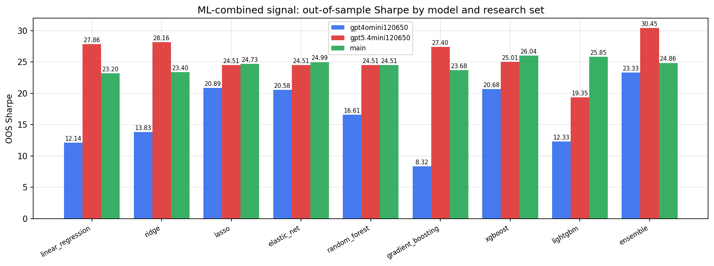

*ML-combined OOS Sharpe by model and research set*

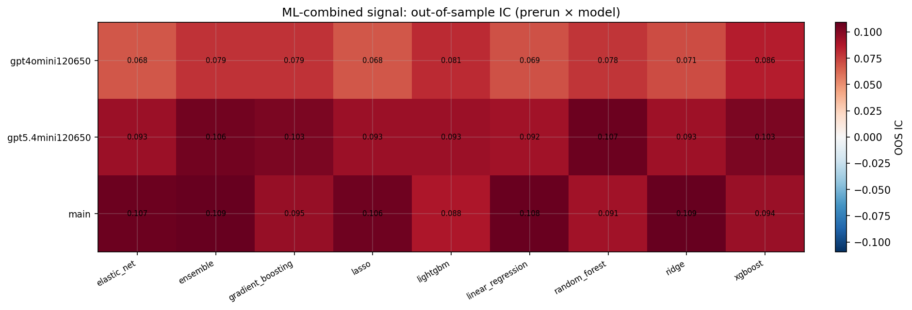

*ML-combined OOS IC (prerun × model)*

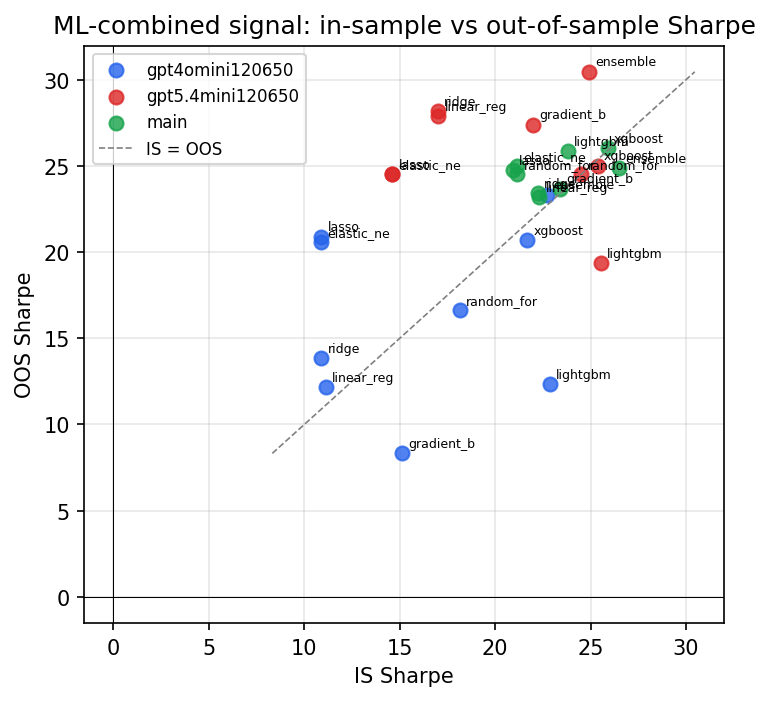

*IS vs OOS Sharpe (overfitting diagnostic)*

---
*Generated by `run_model_comparison.py`. Tables: `*.csv`; interactive: `comparison.ipynb`.*
