# Research-LLM factor comparison — `2024-05`

Comparing the **factor output of different research LLMs** on three axes (raw factor quality → factors as ML features → factors through the full agentic fund). The panel, IS/OOS split, horizon and model hyper-parameters are held identical across preruns — the *only* variable is the factor set.

## Preruns compared

| prerun | research_model | usable_factors | dropped_factors |
| --- | --- | --- | --- |
| gpt4omini120650 | gpt-4o-mini | 66 | 0 |
| gpt5.4mini120650 | gpt-5.4-mini | 68 | 1 |
| main | seed library | 78 | 10 |

> Dropped factors declare fields the current data doesn't have yet (e.g. fundamentals); they light up unchanged once that data is downloaded.

*Usable vs awaiting-data factors per research model*

## Key findings

- **Best ML-combined OOS Sharpe:** `main` with `xgboost` (OOS Sharpe = 38.949).
- **Mean OOS Sharpe across models, by research set:** `main` = 33.894, `gpt5.4mini120650` = 24.115, `gpt4omini120650` = 19.666.
- **Highest mean single-factor |IC| (h=6):** `main` (mean |IC| = 0.0515).
- **Most diverse zoo (highest effective/raw factor ratio):** `gpt5.4mini120650` (eff 59.5 of 68, ratio 0.87).
- **Best selection-deflated single-factor |IC|:** `main` (deflated |IC| = 0.1662 from 37 factors tried).

## 1. Single-factor IC (raw factor quality)

Per-underlying time-series Spearman rank-IC of every researched factor, recomputed on the shared panel at horizons h=1, h=6, h=60. The per-underlying IC correlates each factor's value vector with the underlying's own forward-return vector (pooled across underlyings); the cross-sectional IC ranks across underlyings per timestamp.

| prerun | n_factors | mean_abs_ic_1 | mean_abs_ic_6 | mean_abs_ic_60 | mean_abs_icir_6 | best_factor_h6 | best_abs_ic_h6 |
| --- | --- | --- | --- | --- | --- | --- | --- |
| gpt4omini120650 | 66 | 0.0183 | 0.0225 | 0.0241 | 0.6405 | order_flow_momentum | 0.0748 |
| gpt5.4mini120650 | 68 | 0.0144 | 0.0186 | 0.0157 | 0.6788 | deterministic_control_gap | 0.0841 |
| main | 78 | 0.0441 | 0.0515 | 0.0411 | 0.8222 | alpha_059 | 0.1731 |

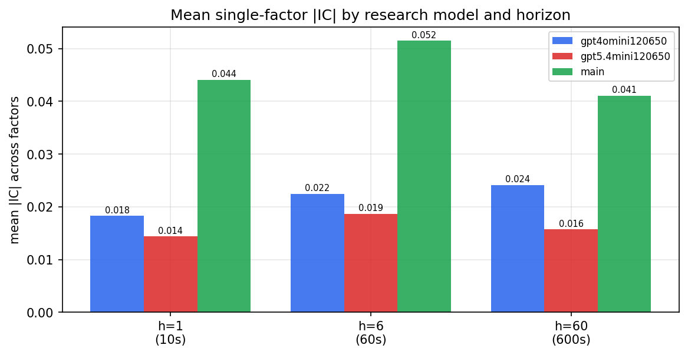

*Mean |IC| by research model and horizon*

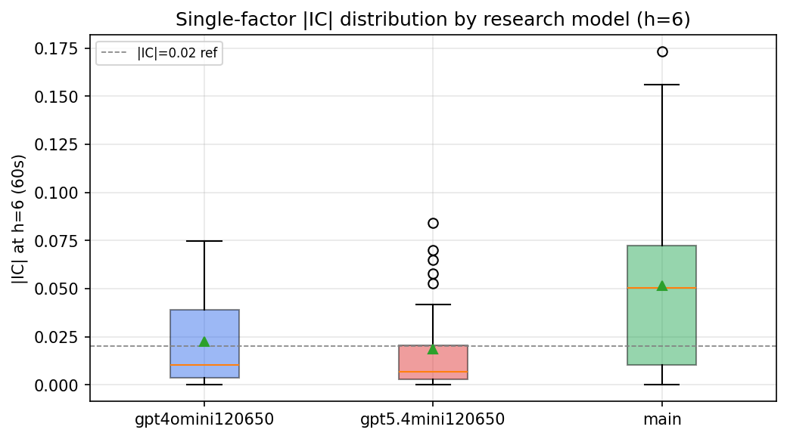

*Per-factor |IC| distribution by research model*

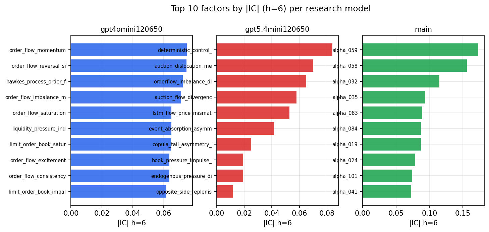

*Top factors by |IC| per research model*

## 2. Factor diversity & redundancy

Pairwise correlation of each zoo's *signals*. `eff_n_factors` is the effective number of independent factors (participation ratio of the correlation eigenvalues); `eff_ratio` and `redundancy` summarise how much unique information the zoo holds vs. how much is duplicated; `n_clusters` groups factors at |corr| ≥ 0.7.

| prerun | n_factors | eff_n_factors | eff_ratio | mean_abs_corr | n_clusters | redundancy |
| --- | --- | --- | --- | --- | --- | --- |
| gpt4omini120650 | 66 | 33.608 | 0.5092 | 0.0474 | 52 | 0.4908 |
| gpt5.4mini120650 | 68 | 59.4661 | 0.8745 | 0.007 | 66 | 0.1255 |
| main | 78 | 41.4535 | 0.5315 | 0.036 | 65 | 0.4685 |

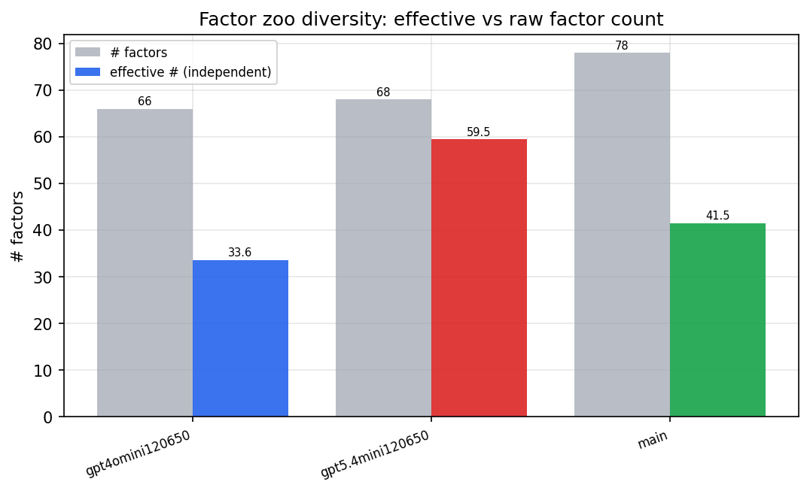

*Effective vs raw factor count per research model*

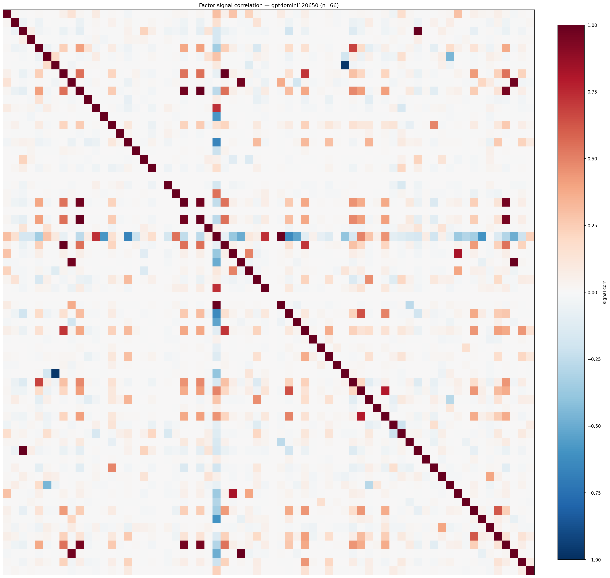

*Signal correlation matrix — gpt4omini120650*

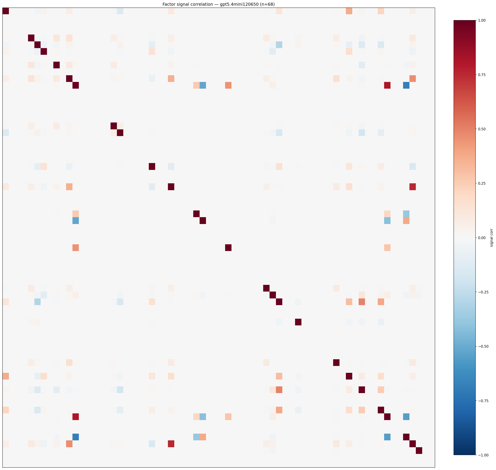

*Signal correlation matrix — gpt5.4mini120650*

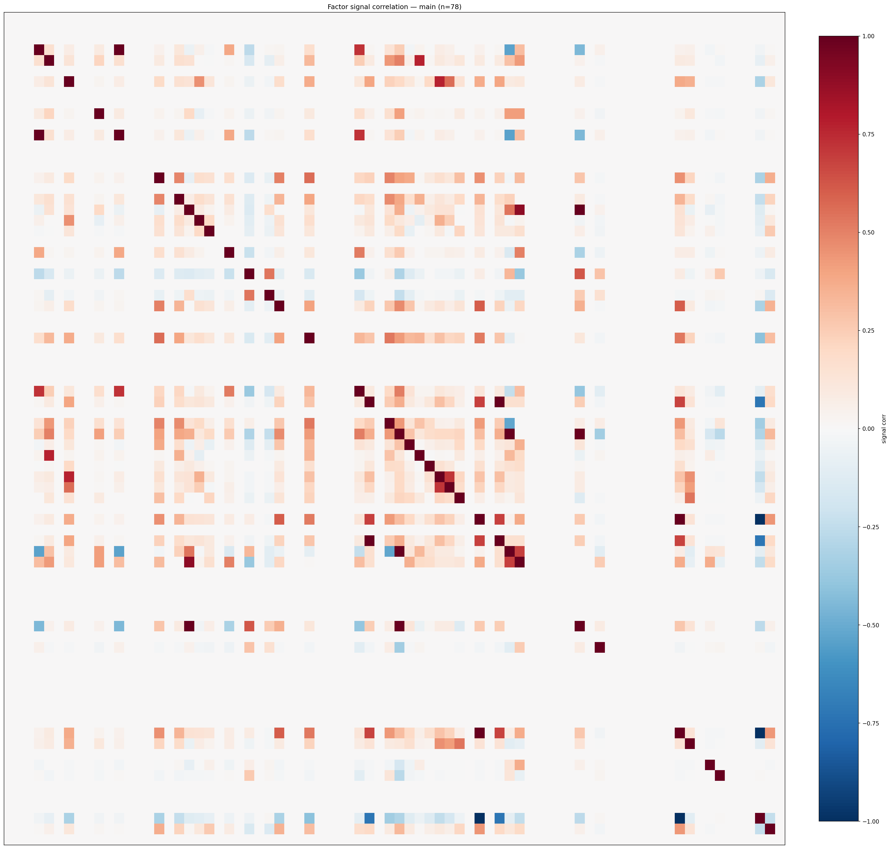

*Signal correlation matrix — main*

## 3. Deflation & model-based importance

`deflated_best_ic` haircuts each zoo's best |IC| for the number of factors tried (`ic_n_tested`) — a bigger zoo's best factor is more likely to be lucky. `lasso_n_nonzero` / `lasso_sparsity` show how many factors a sparse linear model actually keeps (model-view redundancy).

| prerun | best_ic | deflated_best_ic | deflated_best_t | ic_n_tested | ic_n_obs | lasso_n_nonzero | lasso_sparsity |
| --- | --- | --- | --- | --- | --- | --- | --- |
| gpt4omini120650 | 0.0748 | 0.0674 | 26.073 | 63 | 149759 | 15 | 0.7727 |
| gpt5.4mini120650 | 0.0841 | 0.0774 | 29.963 | 28 | 149759 | 8 | 0.8824 |
| main | 0.1731 | 0.1662 | 64.3195 | 37 | 149759 | 12 | 0.8462 |

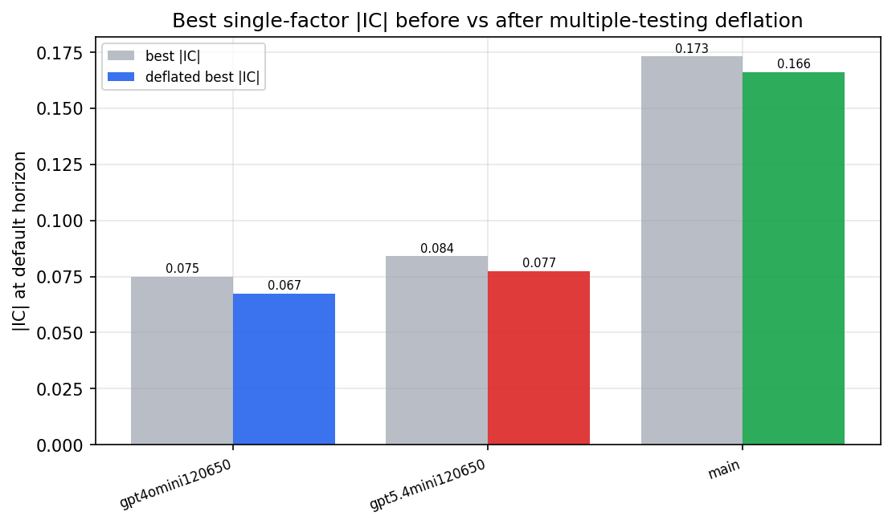

*Best |IC| before vs after multiple-testing deflation*

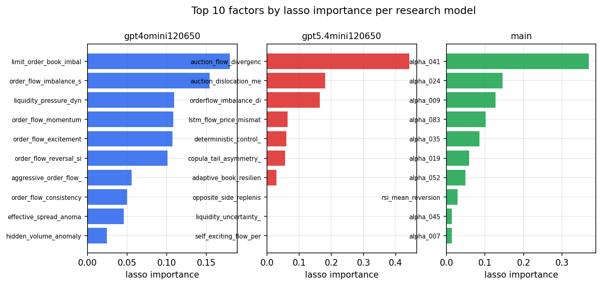

*Top factors by lasso importance per zoo*

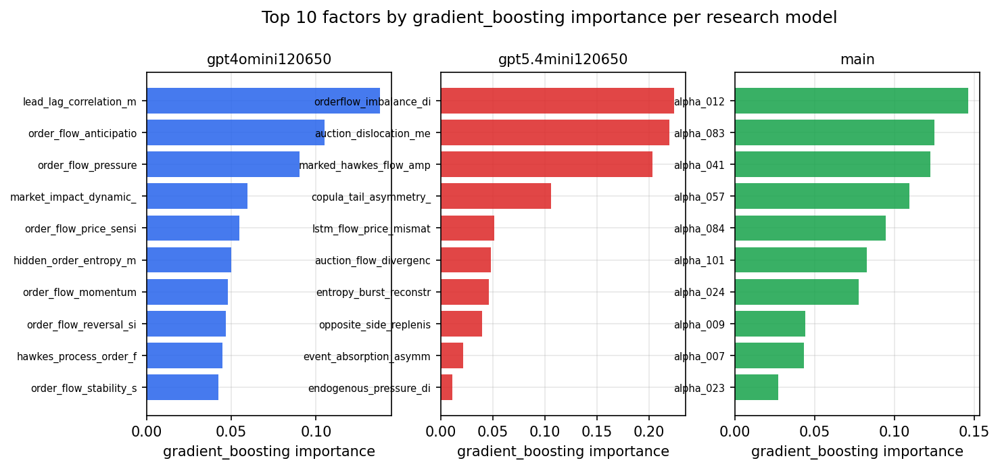

*Top factors by gradient_boosting importance per zoo*

## 4. ML-combined signal — per-underlying vectorised backtest

Each model combines a prerun's factors into ONE signal (fit `factors → forward return` on IS, predict per (bar, underlying)), then that combined signal is run through a simple vectorised backtest — `position(signal) × the underlying's own forward return` — on the held-out OOS tail (+ an equal-weight ensemble). No cross-sectional ranking.

> Config: position=**threshold** (t=1.0, z-score `expanding`), aggregation=**portfolio**, fit-standardise=**per_underlying**, horizon=6.

| prerun | model | n_factors_used | oos_ic | oos_sharpe | is_sharpe | oos_ann_return | oos_max_drawdown |
| --- | --- | --- | --- | --- | --- | --- | --- |
| gpt4omini120650 | linear_regression | 66 | 0.0635 | 16.9726 | 21.938 | 1.8044 | -0.0218 |
| gpt4omini120650 | ridge | 66 | 0.0651 | 18.4541 | 21.1693 | 1.9668 | -0.0194 |
| gpt4omini120650 | lasso | 66 | 0.0699 | 20.5947 | 20.7167 | 3.0922 | -0.014 |
| gpt4omini120650 | elastic_net | 66 | 0.0691 | 19.2417 | 20.8922 | 2.6399 | -0.0162 |
| gpt4omini120650 | random_forest | 66 | 0.0801 | 18.453 | 24.0135 | 2.9283 | -0.019 |
| gpt4omini120650 | gradient_boosting | 66 | 0.0772 | 14.1378 | 20.8798 | 2.0846 | -0.0155 |
| gpt4omini120650 | xgboost | 66 | 0.0858 | 20.9542 | 27.871 | 3.0108 | -0.01 |
| gpt4omini120650 | lightgbm | 66 | 0.09 | 25.5058 | 29.2847 | 2.2298 | -0.0071 |
| gpt4omini120650 | ensemble | 66 | 0.0835 | 22.6836 | 27.5499 | 3.2589 | -0.0175 |
| gpt5.4mini120650 | linear_regression | 68 | 0.0846 | 22.5222 | 26.5404 | 2.2792 | -0.014 |
| gpt5.4mini120650 | ridge | 68 | 0.0838 | 23.7726 | 26.8845 | 2.3628 | -0.0148 |
| gpt5.4mini120650 | lasso | 68 | 0.0828 | 24.0269 | 25.6366 | 2.3885 | -0.0159 |
| gpt5.4mini120650 | elastic_net | 68 | 0.0828 | 24.0269 | 25.6366 | 2.3885 | -0.0159 |
| gpt5.4mini120650 | random_forest | 68 | 0.1144 | 26.2486 | 30.7819 | 3.1134 | -0.0146 |
| gpt5.4mini120650 | gradient_boosting | 68 | 0.112 | 26.2007 | 30.841 | 2.721 | -0.0099 |
| gpt5.4mini120650 | xgboost | 68 | 0.1209 | 23.9118 | 35.3964 | 3.0213 | -0.0158 |
| gpt5.4mini120650 | lightgbm | 68 | 0.1177 | 19.6452 | 35.5359 | 2.6931 | -0.021 |
| gpt5.4mini120650 | ensemble | 68 | 0.1068 | 26.679 | 32.149 | 3.0011 | -0.0175 |
| main | linear_regression | 78 | 0.1144 | 28.01 | 29.4887 | 3.0798 | -0.017 |
| main | ridge | 78 | 0.1166 | 31.732 | 29.5099 | 3.2594 | -0.0124 |
| main | lasso | 78 | 0.13 | 31.7692 | 28.5707 | 3.2266 | -0.0122 |
| main | elastic_net | 78 | 0.1282 | 32.0946 | 29.2162 | 3.2761 | -0.0124 |
| main | random_forest | 78 | 0.1443 | 38.6391 | 32.8431 | 3.8143 | -0.0079 |
| main | gradient_boosting | 78 | 0.1294 | 28.5359 | 31.9363 | 3.3228 | -0.0147 |
| main | xgboost | 78 | 0.1385 | 38.9488 | 35.0171 | 3.6436 | -0.006 |
| main | lightgbm | 78 | 0.1315 | 38.4895 | 36.0227 | 3.4577 | -0.0049 |
| main | ensemble | 78 | 0.1361 | 36.8304 | 36.3743 | 3.7344 | -0.0078 |

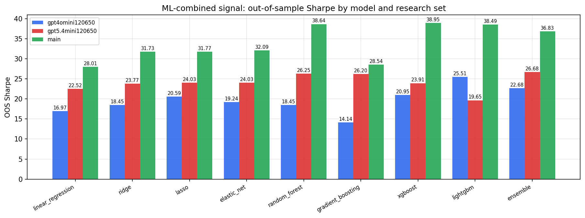

*ML-combined OOS Sharpe by model and research set*

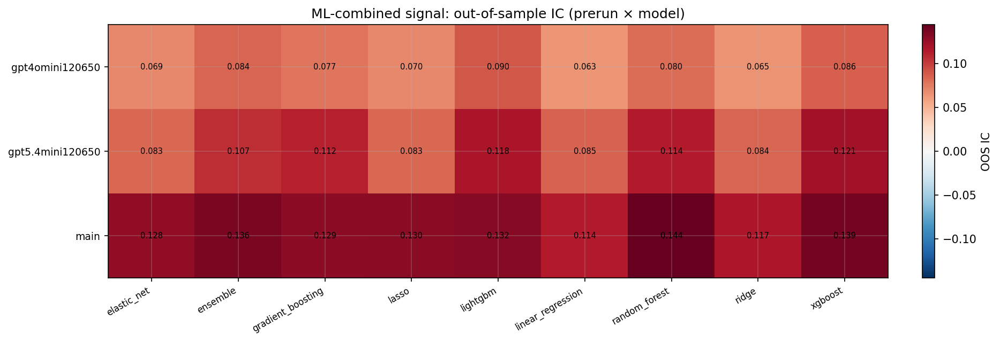

*ML-combined OOS IC (prerun × model)*

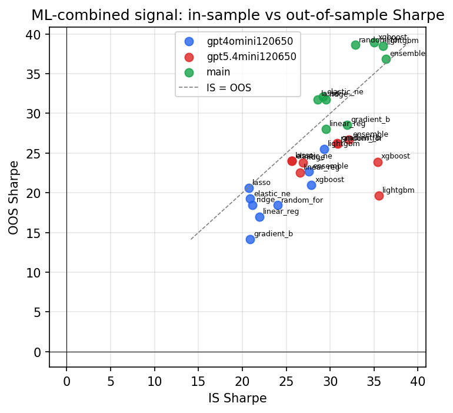

*IS vs OOS Sharpe (overfitting diagnostic)*

---
*Generated by `run_model_comparison.py`. Tables: `*.csv`; interactive: `comparison.ipynb`.*
