# Research-LLM factor comparison — `2024-06`

Comparing the **factor output of different research LLMs** on three axes (raw factor quality → factors as ML features → factors through the full agentic fund). The panel, IS/OOS split, horizon and model hyper-parameters are held identical across preruns — the *only* variable is the factor set.

## Preruns compared

| prerun | research_model | usable_factors | dropped_factors |
| --- | --- | --- | --- |
| gpt4omini120650 | gpt-4o-mini | 66 | 0 |
| gpt5.4mini120650 | gpt-5.4-mini | 68 | 1 |
| main | seed library | 78 | 10 |

> Dropped factors declare fields the current data doesn't have yet (e.g. fundamentals); they light up unchanged once that data is downloaded.

*Usable vs awaiting-data factors per research model*

## Key findings

- **Best ML-combined OOS Sharpe:** `gpt5.4mini120650` with `lightgbm` (OOS Sharpe = 24.016).
- **Mean OOS Sharpe across models, by research set:** `main` = 19.351, `gpt5.4mini120650` = 7.629, `gpt4omini120650` = 3.991.
- **Highest mean single-factor |IC| (h=6):** `main` (mean |IC| = 0.0421).
- **Most diverse zoo (highest effective/raw factor ratio):** `gpt5.4mini120650` (eff 55.2 of 68, ratio 0.81).
- **Best selection-deflated single-factor |IC|:** `main` (deflated |IC| = 0.1540 from 37 factors tried).

## 1. Single-factor IC (raw factor quality)

Per-underlying time-series Spearman rank-IC of every researched factor, recomputed on the shared panel at horizons h=1, h=6, h=60. The per-underlying IC correlates each factor's value vector with the underlying's own forward-return vector (pooled across underlyings); the cross-sectional IC ranks across underlyings per timestamp.

| prerun | n_factors | mean_abs_ic_1 | mean_abs_ic_6 | mean_abs_ic_60 | mean_abs_icir_6 | best_factor_h6 | best_abs_ic_h6 |
| --- | --- | --- | --- | --- | --- | --- | --- |
| gpt4omini120650 | 66 | 0.0172 | 0.0182 | 0.0207 | 0.4591 | effective_spread_reversal_strength | 0.1108 |
| gpt5.4mini120650 | 68 | 0.0137 | 0.0155 | 0.0144 | 0.5459 | orderflow_imbalance_divergence | 0.066 |
| main | 78 | 0.0421 | 0.0421 | 0.0333 | 0.7238 | alpha_059 | 0.161 |

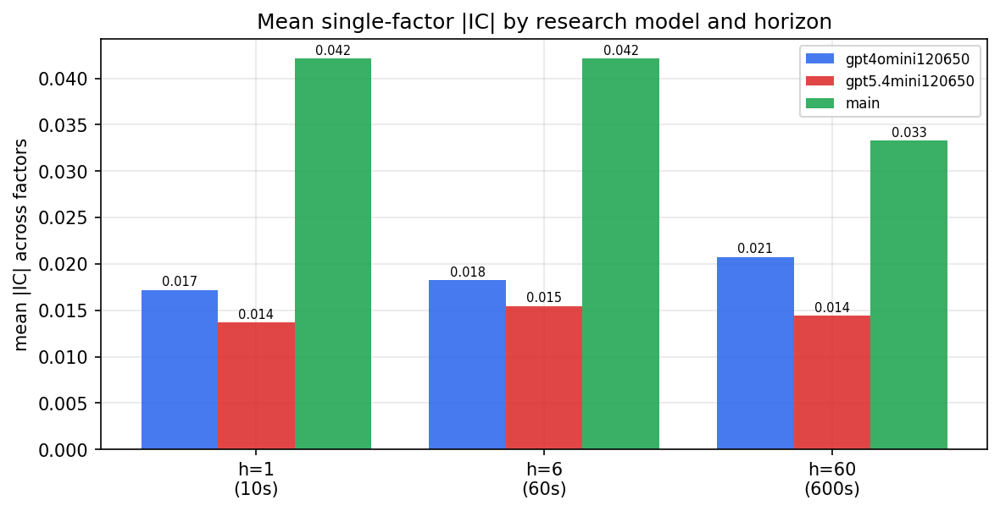

*Mean |IC| by research model and horizon*

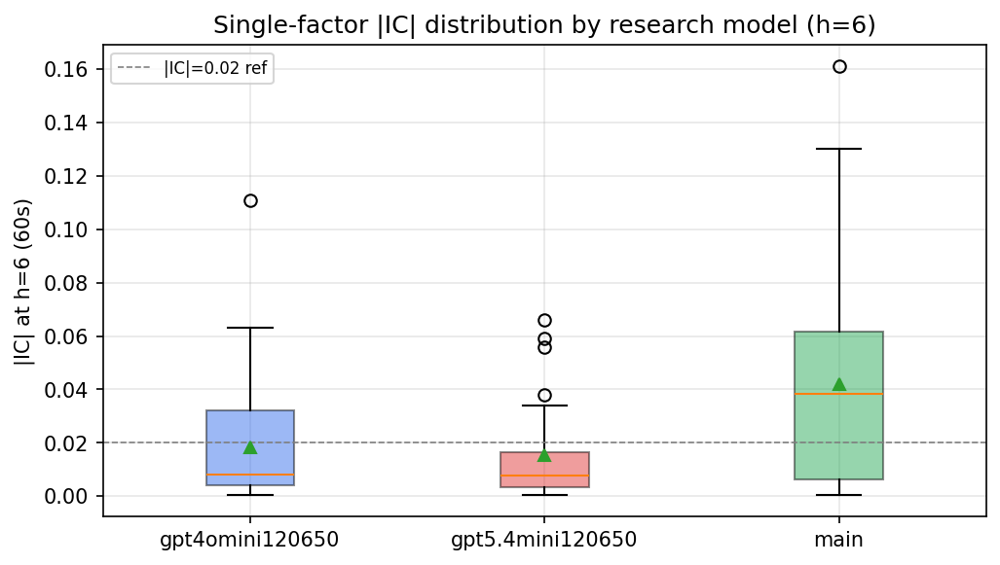

*Per-factor |IC| distribution by research model*

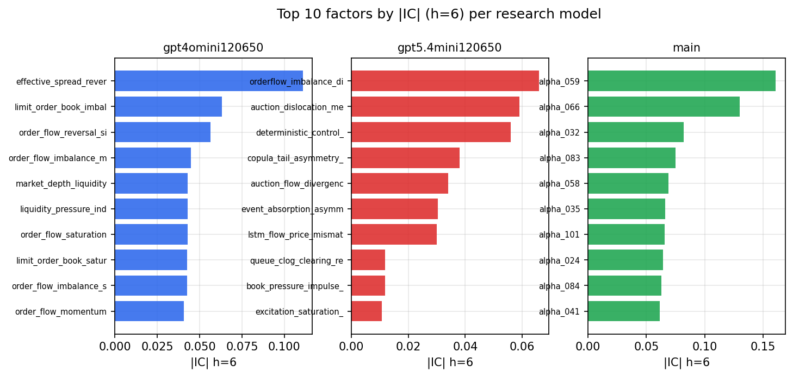

*Top factors by |IC| per research model*

## 2. Factor diversity & redundancy

Pairwise correlation of each zoo's *signals*. `eff_n_factors` is the effective number of independent factors (participation ratio of the correlation eigenvalues); `eff_ratio` and `redundancy` summarise how much unique information the zoo holds vs. how much is duplicated; `n_clusters` groups factors at |corr| ≥ 0.7.

| prerun | n_factors | eff_n_factors | eff_ratio | mean_abs_corr | n_clusters | redundancy |
| --- | --- | --- | --- | --- | --- | --- |
| gpt4omini120650 | 66 | 33.7958 | 0.5121 | 0.0461 | 50 | 0.4879 |
| gpt5.4mini120650 | 68 | 55.2122 | 0.8119 | 0.0088 | 63 | 0.1881 |
| main | 78 | 40.4987 | 0.5192 | 0.0348 | 65 | 0.4808 |

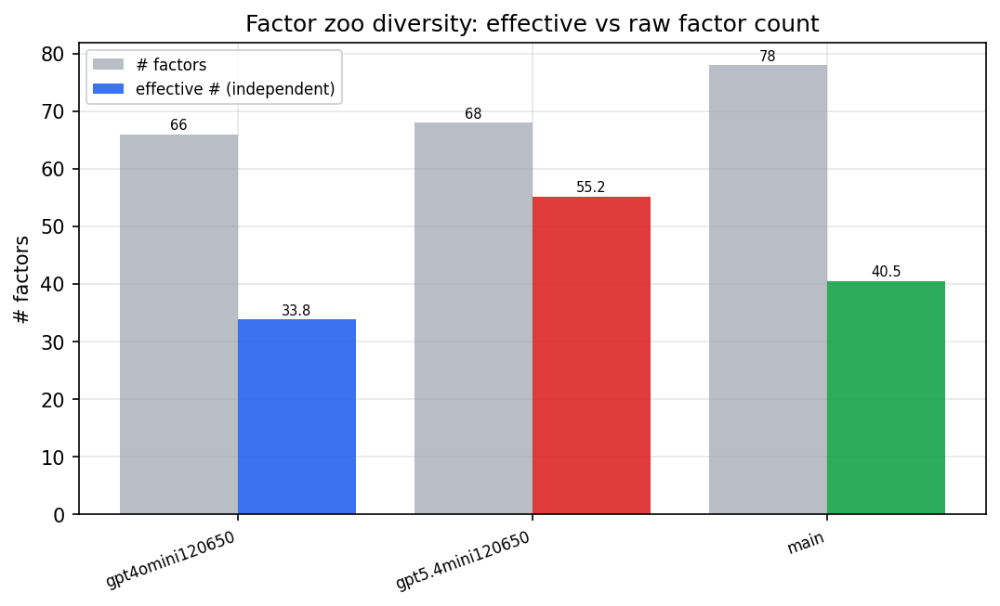

*Effective vs raw factor count per research model*

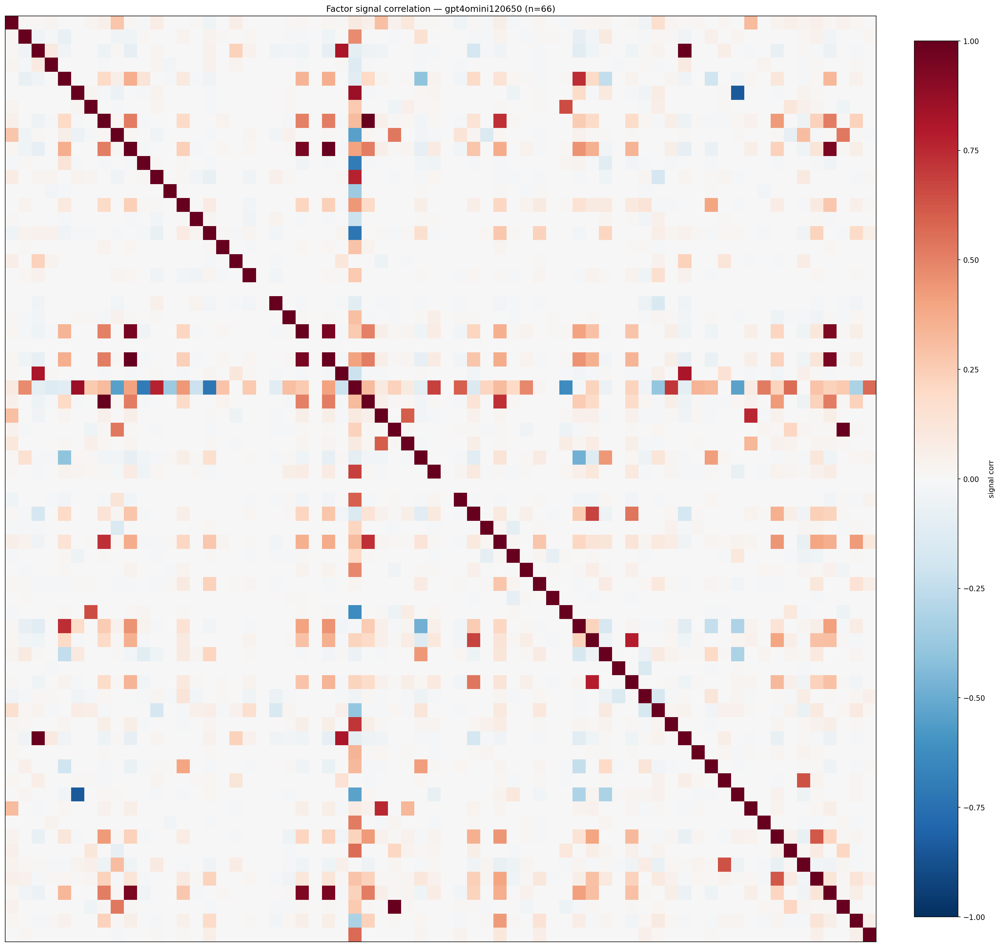

*Signal correlation matrix — gpt4omini120650*

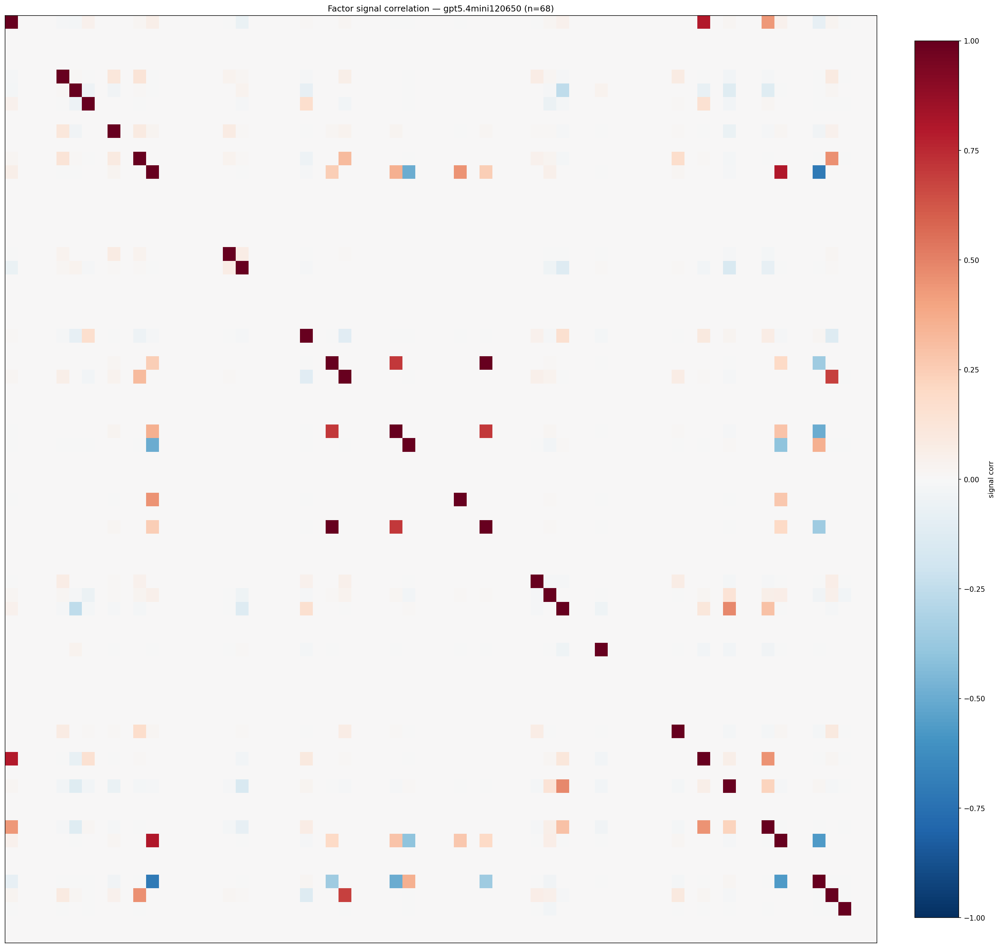

*Signal correlation matrix — gpt5.4mini120650*

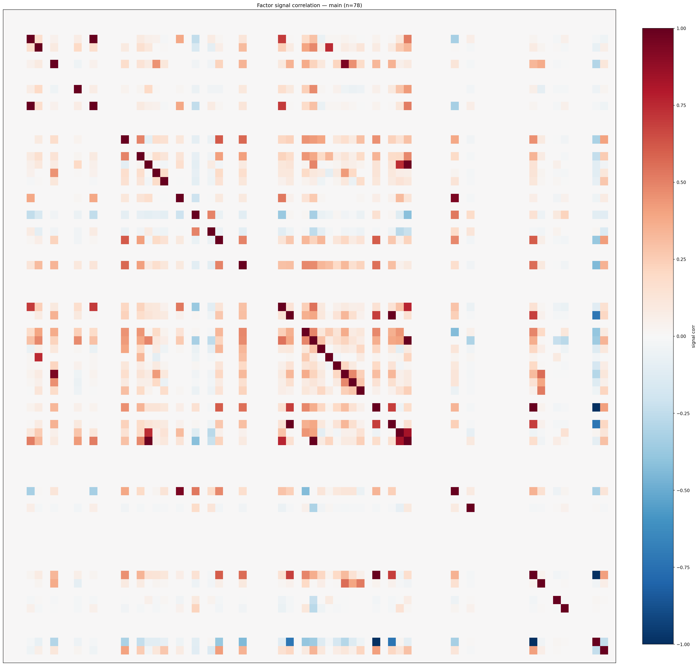

*Signal correlation matrix — main*

## 3. Deflation & model-based importance

`deflated_best_ic` haircuts each zoo's best |IC| for the number of factors tried (`ic_n_tested`) — a bigger zoo's best factor is more likely to be lucky. `lasso_n_nonzero` / `lasso_sparsity` show how many factors a sparse linear model actually keeps (model-view redundancy).

| prerun | best_ic | deflated_best_ic | deflated_best_t | ic_n_tested | ic_n_obs | lasso_n_nonzero | lasso_sparsity |
| --- | --- | --- | --- | --- | --- | --- | --- |
| gpt4omini120650 | 0.1108 | 0.1033 | 39.6584 | 63 | 147419 | 0 | 1.0 |
| gpt5.4mini120650 | 0.066 | 0.0593 | 22.7703 | 28 | 147419 | 7 | 0.8971 |
| main | 0.161 | 0.154 | 59.1397 | 37 | 147419 | 22 | 0.7179 |

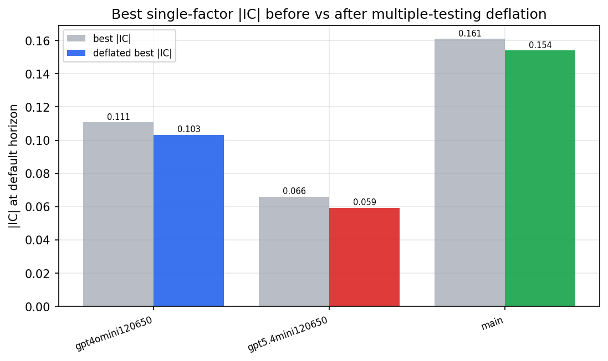

*Best |IC| before vs after multiple-testing deflation*

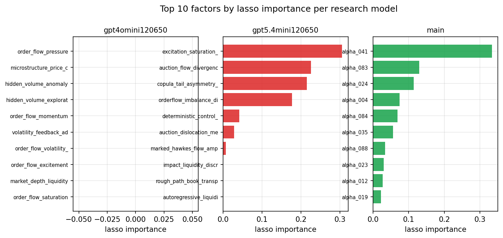

*Top factors by lasso importance per zoo*

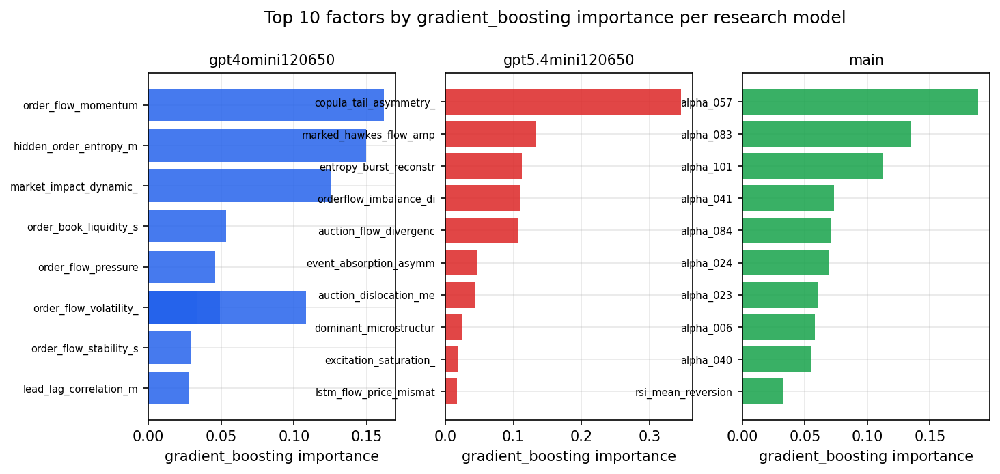

*Top factors by gradient_boosting importance per zoo*

## 4. ML-combined signal — per-underlying vectorised backtest

Each model combines a prerun's factors into ONE signal (fit `factors → forward return` on IS, predict per (bar, underlying)), then that combined signal is run through a simple vectorised backtest — `position(signal) × the underlying's own forward return` — on the held-out OOS tail (+ an equal-weight ensemble). No cross-sectional ranking.

> Config: position=**threshold** (t=1.0, z-score `expanding`), aggregation=**portfolio**, fit-standardise=**per_underlying**, horizon=6.

| prerun | model | n_factors_used | oos_ic | oos_sharpe | is_sharpe | oos_ann_return | oos_max_drawdown |
| --- | --- | --- | --- | --- | --- | --- | --- |
| gpt4omini120650 | linear_regression | 66 | 0.0168 | 1.7548 | 19.7892 | 0.2724 | -0.0434 |
| gpt4omini120650 | ridge | 66 | 0.0153 | 1.1133 | 19.751 | 0.1925 | -0.0483 |
| gpt4omini120650 | lasso | 66 | 0.011 | 1.1079 | 23.1333 | 0.126 | -0.037 |
| gpt4omini120650 | elastic_net | 66 | 0.01 | 0.4739 | 22.2507 | 0.0544 | -0.0399 |
| gpt4omini120650 | random_forest | 66 | 0.0098 | 2.8332 | 24.3829 | 0.4995 | -0.0401 |
| gpt4omini120650 | gradient_boosting | 66 | 0.0152 | 8.7224 | 23.0699 | 0.8924 | -0.013 |
| gpt4omini120650 | xgboost | 66 | 0.0401 | 12.1019 | 25.6242 | 1.3844 | -0.0085 |
| gpt4omini120650 | lightgbm | 66 | 0.0426 | 3.81 | 27.2063 | 0.5956 | -0.0339 |
| gpt4omini120650 | ensemble | 66 | 0.02 | 4.0031 | 25.4889 | 0.7295 | -0.0485 |
| gpt5.4mini120650 | linear_regression | 68 | 0.0201 | -3.6531 | 18.8609 | -0.424 | -0.0476 |
| gpt5.4mini120650 | ridge | 68 | 0.0192 | -3.0436 | 18.9024 | -0.3558 | -0.0457 |
| gpt5.4mini120650 | lasso | 68 | 0.0004 | -4.3941 | 16.1935 | -0.5212 | -0.0557 |
| gpt5.4mini120650 | elastic_net | 68 | 0.009 | -4.9071 | 18.499 | -0.5866 | -0.0593 |
| gpt5.4mini120650 | random_forest | 68 | 0.069 | 18.7545 | 37.7037 | 1.2652 | -0.0086 |
| gpt5.4mini120650 | gradient_boosting | 68 | 0.0688 | 14.3971 | 30.9892 | 1.0916 | -0.0087 |
| gpt5.4mini120650 | xgboost | 68 | 0.0743 | 19.9961 | 28.3171 | 1.2083 | -0.0079 |
| gpt5.4mini120650 | lightgbm | 68 | 0.0829 | 24.0157 | 28.3694 | 1.0183 | -0.0031 |
| gpt5.4mini120650 | ensemble | 68 | 0.0397 | 7.4953 | 25.3151 | 0.8428 | -0.0269 |
| main | linear_regression | 78 | 0.0182 | 17.5167 | 30.1167 | 1.0135 | -0.0089 |
| main | ridge | 78 | 0.0191 | 17.1504 | 30.5941 | 1.0025 | -0.0086 |
| main | lasso | 78 | 0.0224 | 16.7746 | 29.6692 | 0.9705 | -0.0083 |
| main | elastic_net | 78 | 0.0211 | 17.772 | 30.1006 | 1.0201 | -0.0081 |
| main | random_forest | 78 | 0.0287 | 13.8918 | 35.6388 | 1.2666 | -0.0114 |
| main | gradient_boosting | 78 | 0.0272 | 23.3807 | 33.5724 | 1.1411 | -0.0022 |
| main | xgboost | 78 | 0.0279 | 23.5798 | 33.231 | 1.1529 | -0.0025 |
| main | lightgbm | 78 | 0.0285 | 20.376 | 33.5275 | 0.9768 | -0.006 |
| main | ensemble | 78 | 0.0262 | 23.7164 | 32.7813 | 1.254 | -0.0059 |

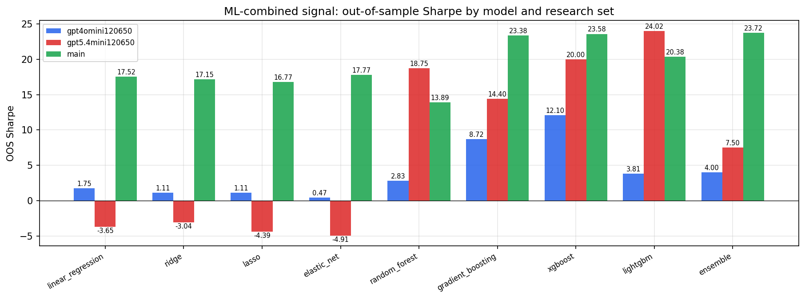

*ML-combined OOS Sharpe by model and research set*

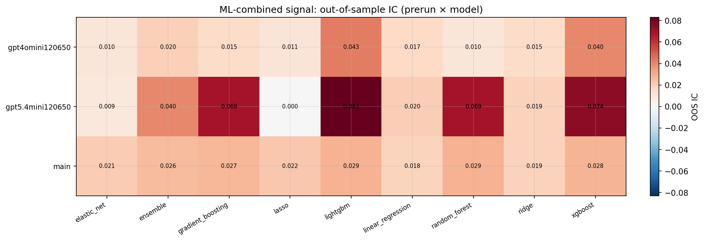

*ML-combined OOS IC (prerun × model)*

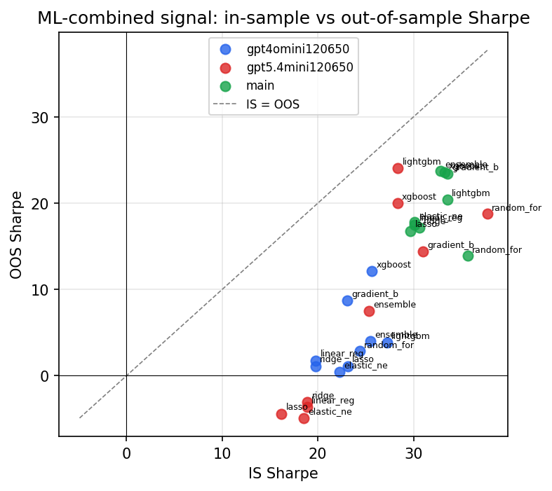

*IS vs OOS Sharpe (overfitting diagnostic)*

---
*Generated by `run_model_comparison.py`. Tables: `*.csv`; interactive: `comparison.ipynb`.*
