# Research-LLM factor comparison — `2024-07`

Comparing the **factor output of different research LLMs** on three axes (raw factor quality → factors as ML features → factors through the full agentic fund). The panel, IS/OOS split, horizon and model hyper-parameters are held identical across preruns — the *only* variable is the factor set.

## Preruns compared

| prerun | research_model | usable_factors | dropped_factors |
| --- | --- | --- | --- |
| gpt4omini120650 | gpt-4o-mini | 66 | 0 |
| gpt5.4mini120650 | gpt-5.4-mini | 68 | 1 |
| main | seed library | 78 | 10 |

> Dropped factors declare fields the current data doesn't have yet (e.g. fundamentals); they light up unchanged once that data is downloaded.

*Usable vs awaiting-data factors per research model*

## Key findings

- **Best ML-combined OOS Sharpe:** `gpt5.4mini120650` with `random_forest` (OOS Sharpe = 14.981).
- **Mean OOS Sharpe across models, by research set:** `gpt4omini120650` = 10.555, `gpt5.4mini120650` = 9.248, `main` = 9.143.
- **Highest mean single-factor |IC| (h=6):** `main` (mean |IC| = 0.0330).
- **Most diverse zoo (highest effective/raw factor ratio):** `gpt5.4mini120650` (eff 56.2 of 68, ratio 0.83).
- **Best selection-deflated single-factor |IC|:** `gpt4omini120650` (deflated |IC| = 0.1953 from 63 factors tried).

## 1. Single-factor IC (raw factor quality)

Per-underlying time-series Spearman rank-IC of every researched factor, recomputed on the shared panel at horizons h=1, h=6, h=60. The per-underlying IC correlates each factor's value vector with the underlying's own forward-return vector (pooled across underlyings); the cross-sectional IC ranks across underlyings per timestamp.

| prerun | n_factors | mean_abs_ic_1 | mean_abs_ic_6 | mean_abs_ic_60 | mean_abs_icir_6 | best_factor_h6 | best_abs_ic_h6 |
| --- | --- | --- | --- | --- | --- | --- | --- |
| gpt4omini120650 | 66 | 0.0119 | 0.0143 | 0.0136 | 0.3776 | effective_spread_reversal_strength | 0.2028 |
| gpt5.4mini120650 | 68 | 0.0096 | 0.0113 | 0.0116 | 0.517 | orderflow_imbalance_divergence | 0.0712 |
| main | 78 | 0.0397 | 0.033 | 0.0248 | 0.6931 | alpha_066 | 0.1488 |

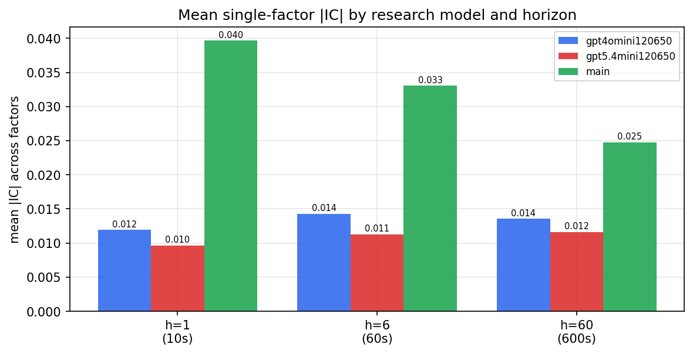

*Mean |IC| by research model and horizon*

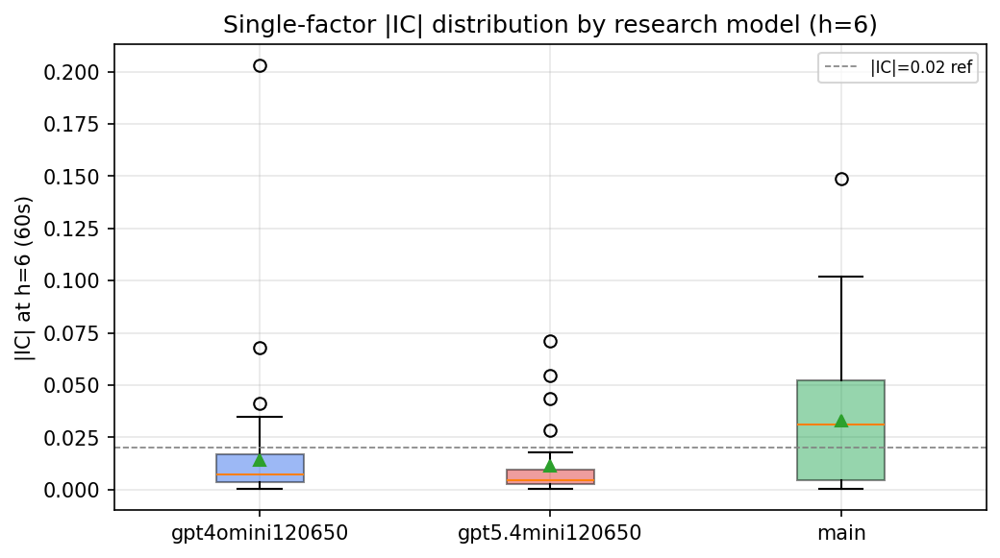

*Per-factor |IC| distribution by research model*

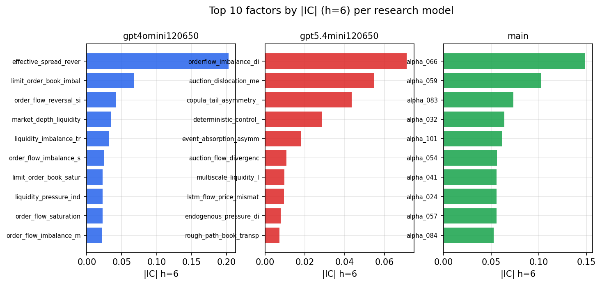

*Top factors by |IC| per research model*

## 2. Factor diversity & redundancy

Pairwise correlation of each zoo's *signals*. `eff_n_factors` is the effective number of independent factors (participation ratio of the correlation eigenvalues); `eff_ratio` and `redundancy` summarise how much unique information the zoo holds vs. how much is duplicated; `n_clusters` groups factors at |corr| ≥ 0.7.

| prerun | n_factors | eff_n_factors | eff_ratio | mean_abs_corr | n_clusters | redundancy |
| --- | --- | --- | --- | --- | --- | --- |
| gpt4omini120650 | 66 | 34.2181 | 0.5185 | 0.0446 | 54 | 0.4815 |
| gpt5.4mini120650 | 68 | 56.1586 | 0.8259 | 0.0086 | 64 | 0.1741 |
| main | 78 | 40.6992 | 0.5218 | 0.0346 | 67 | 0.4782 |

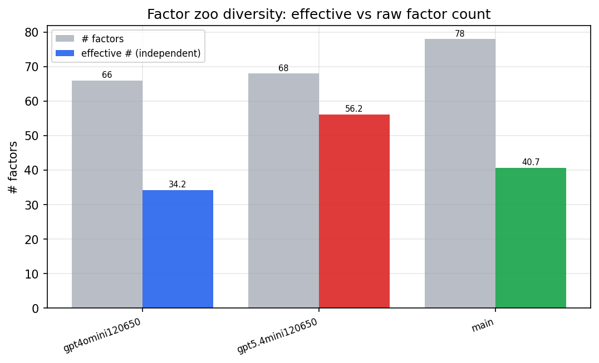

*Effective vs raw factor count per research model*

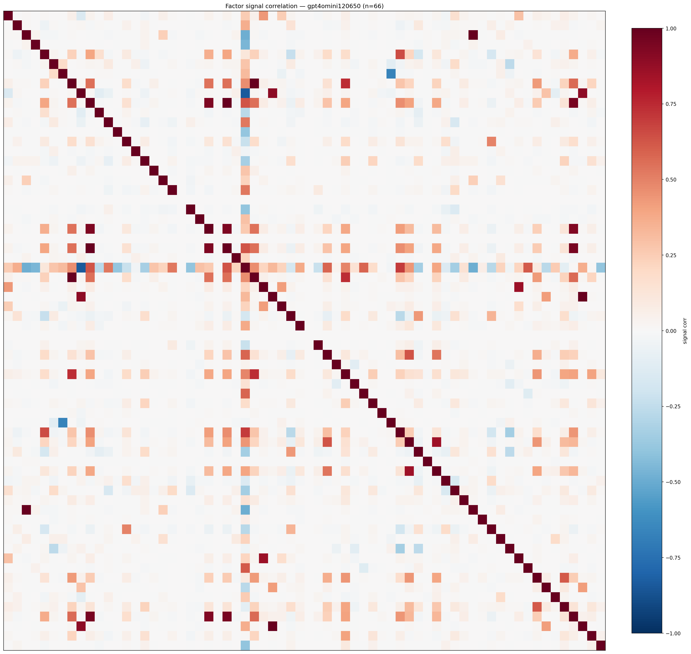

*Signal correlation matrix — gpt4omini120650*

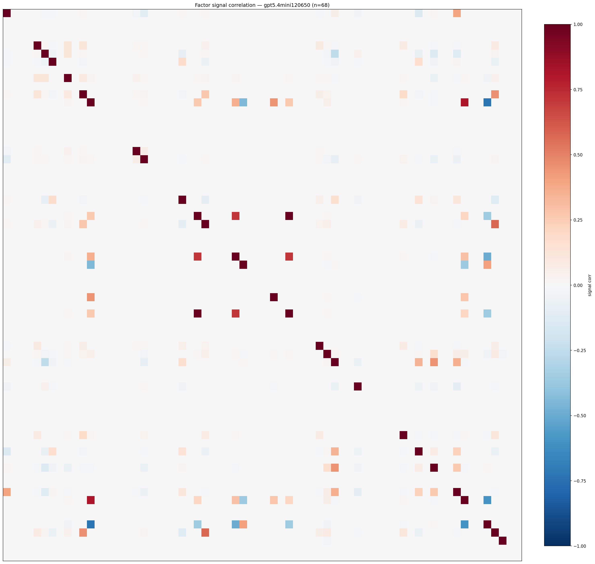

*Signal correlation matrix — gpt5.4mini120650*

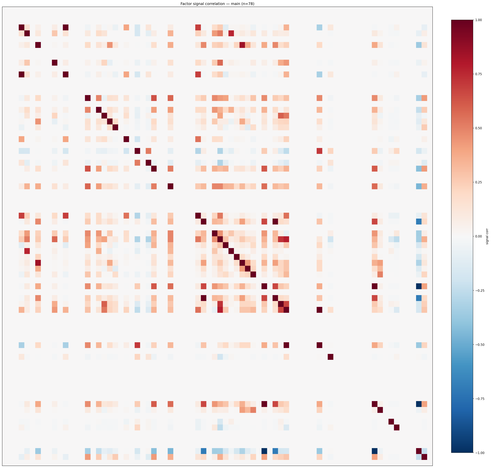

*Signal correlation matrix — main*

## 3. Deflation & model-based importance

`deflated_best_ic` haircuts each zoo's best |IC| for the number of factors tried (`ic_n_tested`) — a bigger zoo's best factor is more likely to be lucky. `lasso_n_nonzero` / `lasso_sparsity` show how many factors a sparse linear model actually keeps (model-view redundancy).

| prerun | best_ic | deflated_best_ic | deflated_best_t | ic_n_tested | ic_n_obs | lasso_n_nonzero | lasso_sparsity |
| --- | --- | --- | --- | --- | --- | --- | --- |
| gpt4omini120650 | 0.2028 | 0.1953 | 74.7127 | 63 | 146339 | 18 | 0.7273 |
| gpt5.4mini120650 | 0.0712 | 0.0644 | 24.6479 | 28 | 146339 | 0 | 1.0 |
| main | 0.1488 | 0.1418 | 54.2313 | 38 | 146339 | 26 | 0.6667 |

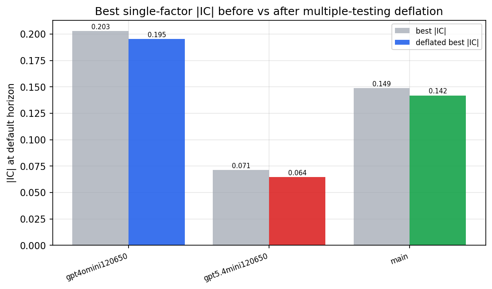

*Best |IC| before vs after multiple-testing deflation*

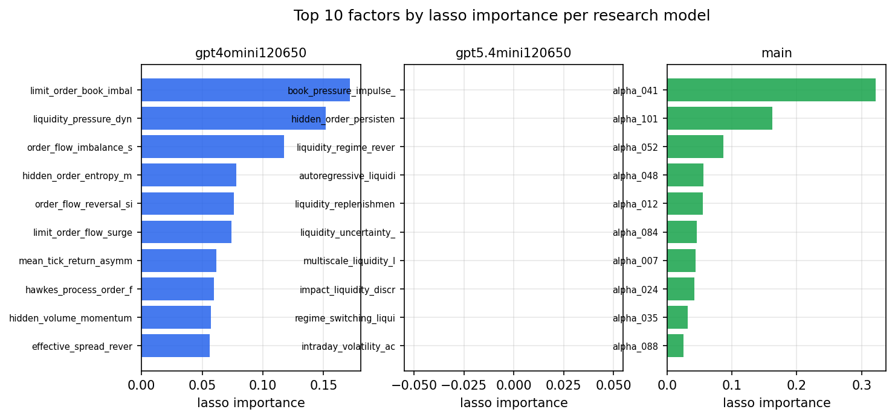

*Top factors by lasso importance per zoo*

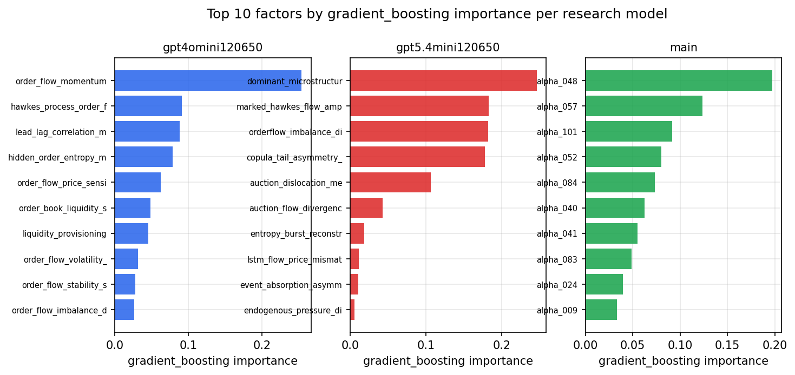

*Top factors by gradient_boosting importance per zoo*

## 4. ML-combined signal — per-underlying vectorised backtest

Each model combines a prerun's factors into ONE signal (fit `factors → forward return` on IS, predict per (bar, underlying)), then that combined signal is run through a simple vectorised backtest — `position(signal) × the underlying's own forward return` — on the held-out OOS tail (+ an equal-weight ensemble). No cross-sectional ranking.

> Config: position=**threshold** (t=1.0, z-score `expanding`), aggregation=**portfolio**, fit-standardise=**per_underlying**, horizon=6.

| prerun | model | n_factors_used | oos_ic | oos_sharpe | is_sharpe | oos_ann_return | oos_max_drawdown |
| --- | --- | --- | --- | --- | --- | --- | --- |
| gpt4omini120650 | linear_regression | 66 | 0.0407 | 8.1658 | 16.562 | 0.4714 | -0.0052 |
| gpt4omini120650 | ridge | 66 | 0.0433 | 7.5514 | 16.3003 | 0.462 | -0.0085 |
| gpt4omini120650 | lasso | 66 | nan | nan | nan | nan | nan |
| gpt4omini120650 | elastic_net | 66 | nan | nan | nan | nan | nan |
| gpt4omini120650 | random_forest | 66 | 0.0468 | 13.1667 | 18.8182 | 0.7229 | -0.0042 |
| gpt4omini120650 | gradient_boosting | 66 | 0.0454 | 9.9447 | 14.9346 | 0.4332 | -0.0025 |
| gpt4omini120650 | xgboost | 66 | 0.0536 | 9.3396 | 20.2197 | 0.5239 | -0.0054 |
| gpt4omini120650 | lightgbm | 66 | 0.0534 | 12.714 | 21.3418 | 0.5603 | -0.0022 |
| gpt4omini120650 | ensemble | 66 | 0.0263 | 13.0041 | 19.0679 | 0.6926 | -0.0023 |
| gpt5.4mini120650 | linear_regression | 68 | 0.0588 | 5.3351 | 12.0058 | 0.5492 | -0.0183 |
| gpt5.4mini120650 | ridge | 68 | 0.059 | 5.6685 | 10.6843 | 0.591 | -0.0184 |
| gpt5.4mini120650 | lasso | 68 | nan | nan | nan | nan | nan |
| gpt5.4mini120650 | elastic_net | 68 | nan | nan | nan | nan | nan |
| gpt5.4mini120650 | random_forest | 68 | 0.0889 | 14.9811 | 25.1639 | 0.9864 | -0.0093 |
| gpt5.4mini120650 | gradient_boosting | 68 | 0.0818 | 14.8599 | 23.3885 | 0.8556 | -0.0071 |
| gpt5.4mini120650 | xgboost | 68 | 0.0804 | 10.3084 | 22.8525 | 0.7559 | -0.011 |
| gpt5.4mini120650 | lightgbm | 68 | 0.0759 | 9.563 | 20.8072 | 0.5358 | -0.0073 |
| gpt5.4mini120650 | ensemble | 68 | 0.0687 | 4.0181 | 9.405 | 0.1127 | -0.0032 |
| main | linear_regression | 78 | 0.0484 | 5.9664 | 29.5944 | 0.4809 | -0.0158 |
| main | ridge | 78 | 0.0438 | 5.3624 | 29.604 | 0.4359 | -0.0158 |
| main | lasso | 78 | 0.045 | 4.7871 | 28.4879 | 0.3907 | -0.0159 |
| main | elastic_net | 78 | 0.0463 | 4.9867 | 26.8991 | 0.4069 | -0.0158 |
| main | random_forest | 78 | 0.0572 | 12.938 | 34.5264 | 0.6766 | -0.0056 |
| main | gradient_boosting | 78 | 0.0595 | 13.3113 | 27.8182 | 0.6672 | -0.0052 |
| main | xgboost | 78 | 0.0403 | 11.0287 | 26.7807 | 0.617 | -0.0078 |
| main | lightgbm | 78 | 0.0486 | 12.1555 | 26.8831 | 0.6432 | -0.0077 |
| main | ensemble | 78 | 0.0481 | 11.7517 | 25.6322 | 0.6574 | -0.0069 |

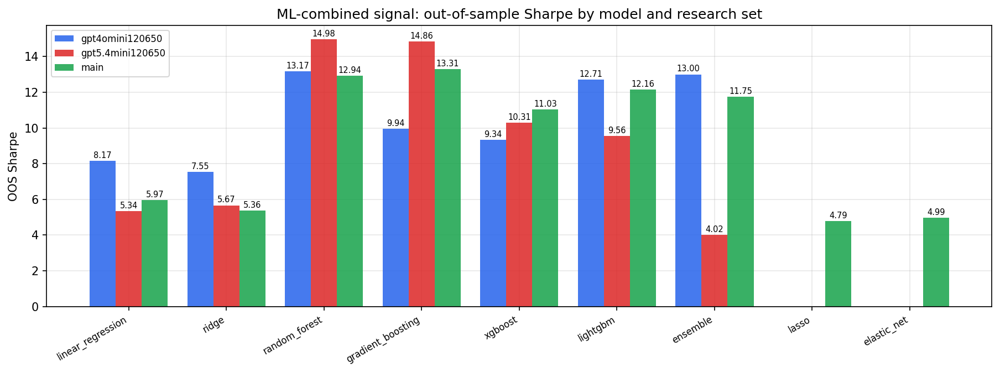

*ML-combined OOS Sharpe by model and research set*

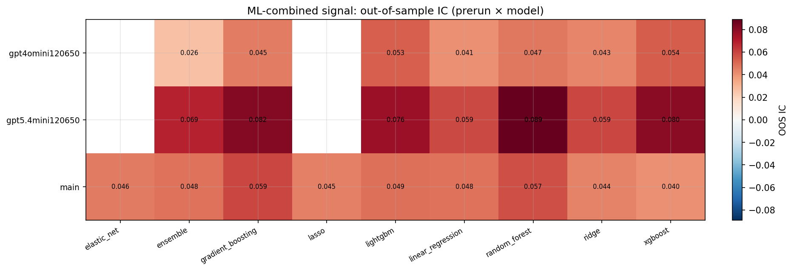

*ML-combined OOS IC (prerun × model)*

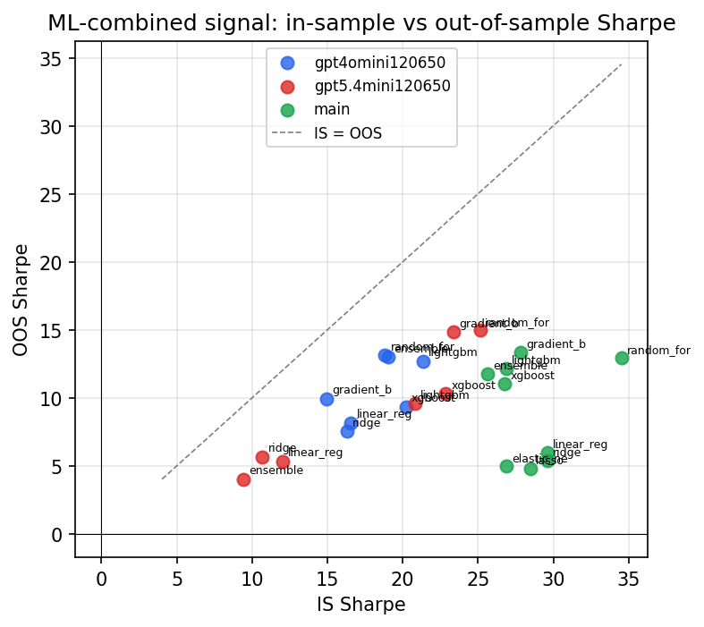

*IS vs OOS Sharpe (overfitting diagnostic)*

---
*Generated by `run_model_comparison.py`. Tables: `*.csv`; interactive: `comparison.ipynb`.*
