# Research-LLM factor comparison — `2024-08`

Comparing the **factor output of different research LLMs** on three axes (raw factor quality → factors as ML features → factors through the full agentic fund). The panel, IS/OOS split, horizon and model hyper-parameters are held identical across preruns — the *only* variable is the factor set.

## Preruns compared

| prerun | research_model | usable_factors | dropped_factors |
| --- | --- | --- | --- |
| gpt4omini120650 | gpt-4o-mini | 66 | 0 |
| gpt5.4mini120650 | gpt-5.4-mini | 68 | 1 |
| main | seed library | 78 | 10 |

> Dropped factors declare fields the current data doesn't have yet (e.g. fundamentals); they light up unchanged once that data is downloaded.

*Usable vs awaiting-data factors per research model*

## Key findings

- **Best ML-combined OOS Sharpe:** `main` with `ensemble` (OOS Sharpe = 35.197).
- **Mean OOS Sharpe across models, by research set:** `main` = 33.842, `gpt4omini120650` = 2.994, `gpt5.4mini120650` = 2.238.
- **Highest mean single-factor |IC| (h=6):** `main` (mean |IC| = 0.0372).
- **Most diverse zoo (highest effective/raw factor ratio):** `gpt5.4mini120650` (eff 57.0 of 68, ratio 0.84).
- **Best selection-deflated single-factor |IC|:** `gpt4omini120650` (deflated |IC| = 0.1355 from 63 factors tried).

## 1. Single-factor IC (raw factor quality)

Per-underlying time-series Spearman rank-IC of every researched factor, recomputed on the shared panel at horizons h=1, h=6, h=60. The per-underlying IC correlates each factor's value vector with the underlying's own forward-return vector (pooled across underlyings); the cross-sectional IC ranks across underlyings per timestamp.

| prerun | n_factors | mean_abs_ic_1 | mean_abs_ic_6 | mean_abs_ic_60 | mean_abs_icir_6 | best_factor_h6 | best_abs_ic_h6 |
| --- | --- | --- | --- | --- | --- | --- | --- |
| gpt4omini120650 | 66 | 0.0121 | 0.0123 | 0.0115 | 0.3536 | effective_spread_reversal_strength | 0.1431 |
| gpt5.4mini120650 | 68 | 0.0102 | 0.0112 | 0.013 | 0.438 | orderflow_imbalance_divergence | 0.0599 |
| main | 78 | 0.0393 | 0.0372 | 0.0251 | 0.8323 | alpha_059 | 0.127 |

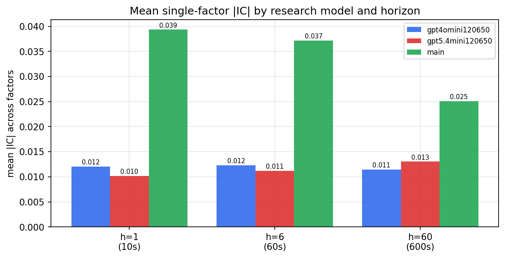

*Mean |IC| by research model and horizon*

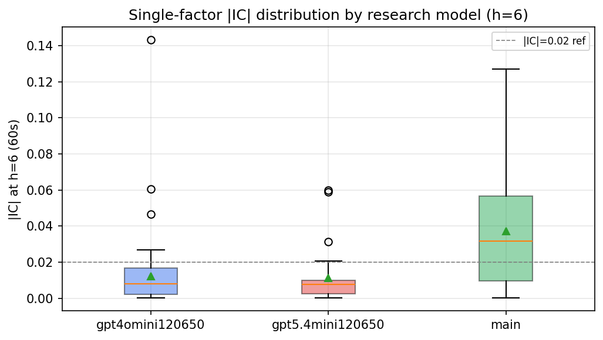

*Per-factor |IC| distribution by research model*

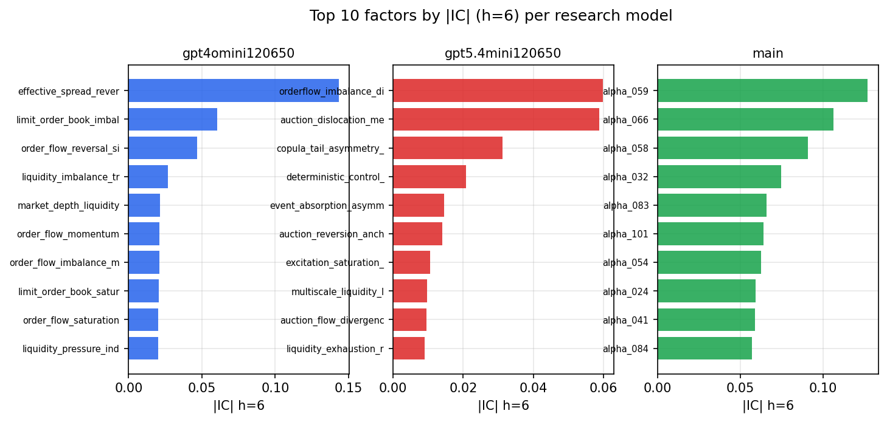

*Top factors by |IC| per research model*

## 2. Factor diversity & redundancy

Pairwise correlation of each zoo's *signals*. `eff_n_factors` is the effective number of independent factors (participation ratio of the correlation eigenvalues); `eff_ratio` and `redundancy` summarise how much unique information the zoo holds vs. how much is duplicated; `n_clusters` groups factors at |corr| ≥ 0.7.

| prerun | n_factors | eff_n_factors | eff_ratio | mean_abs_corr | n_clusters | redundancy |
| --- | --- | --- | --- | --- | --- | --- |
| gpt4omini120650 | 66 | 32.1968 | 0.4878 | 0.0479 | 52 | 0.5122 |
| gpt5.4mini120650 | 68 | 57.0046 | 0.8383 | 0.0077 | 64 | 0.1617 |
| main | 78 | 40.9214 | 0.5246 | 0.0341 | 70 | 0.4754 |

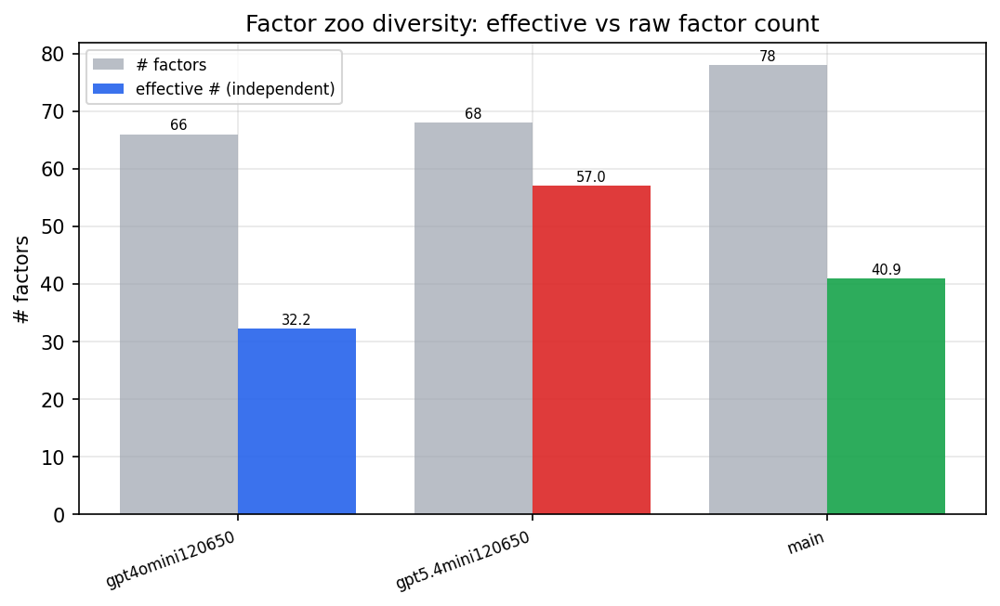

*Effective vs raw factor count per research model*

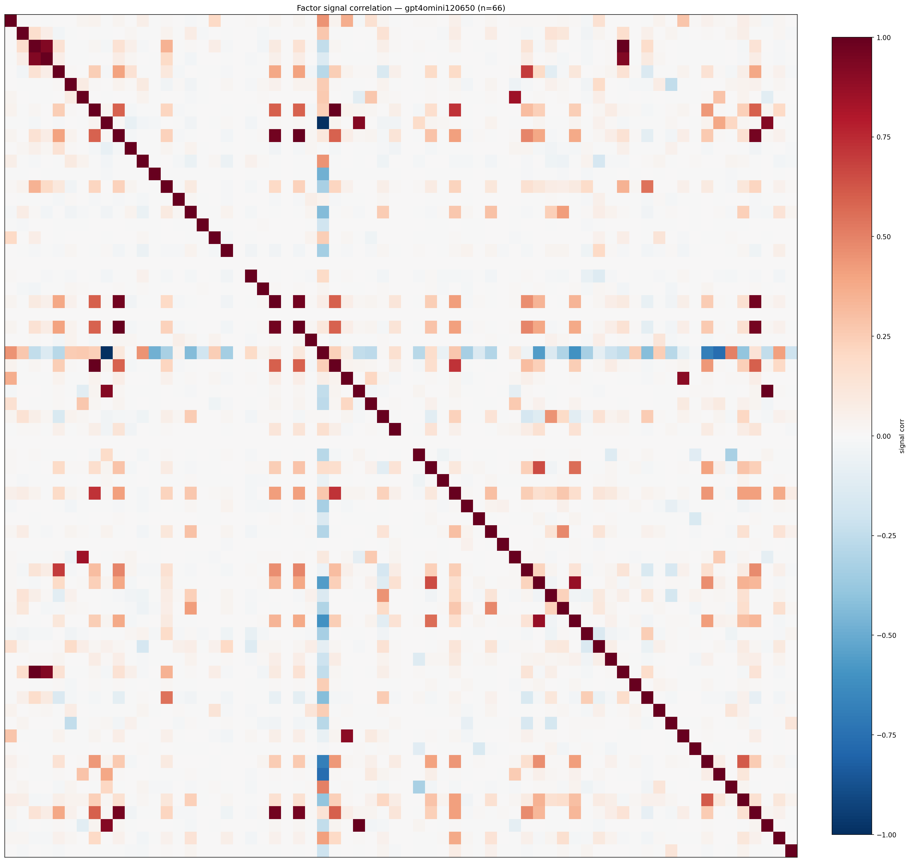

*Signal correlation matrix — gpt4omini120650*

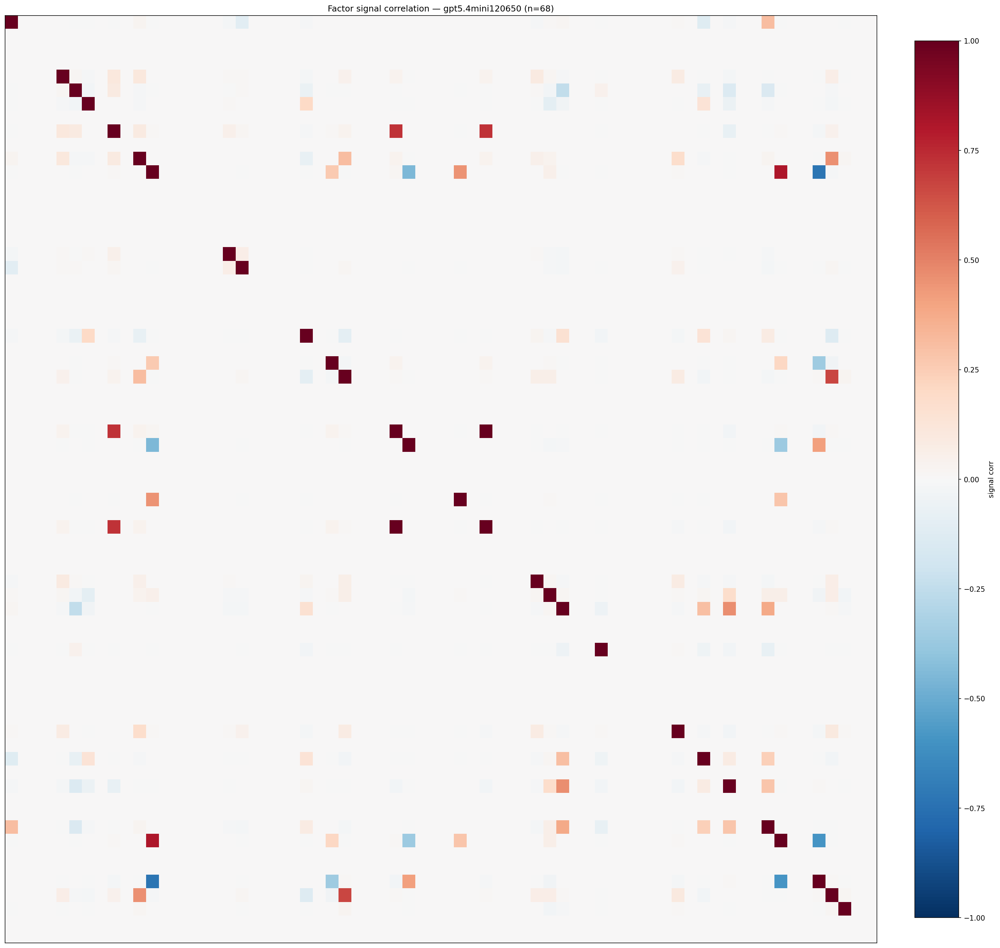

*Signal correlation matrix — gpt5.4mini120650*

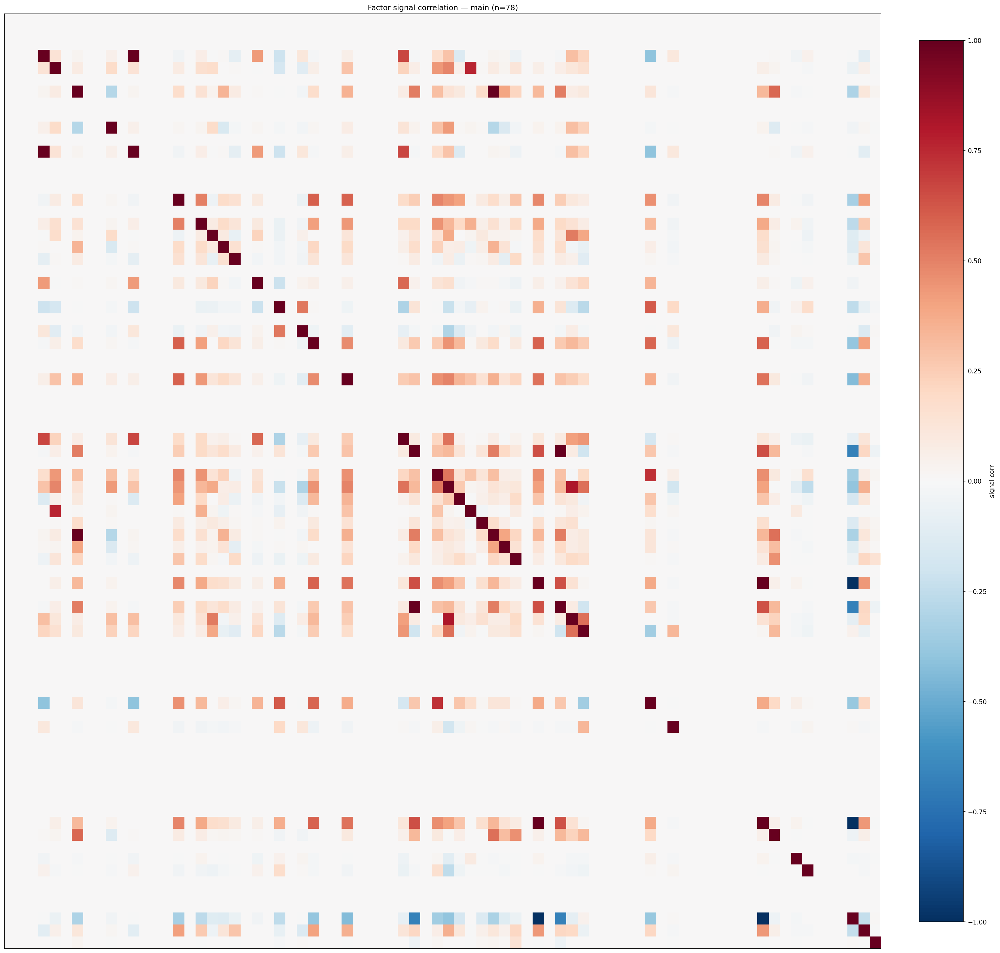

*Signal correlation matrix — main*

## 3. Deflation & model-based importance

`deflated_best_ic` haircuts each zoo's best |IC| for the number of factors tried (`ic_n_tested`) — a bigger zoo's best factor is more likely to be lucky. `lasso_n_nonzero` / `lasso_sparsity` show how many factors a sparse linear model actually keeps (model-view redundancy).

| prerun | best_ic | deflated_best_ic | deflated_best_t | ic_n_tested | ic_n_obs | lasso_n_nonzero | lasso_sparsity |
| --- | --- | --- | --- | --- | --- | --- | --- |
| gpt4omini120650 | 0.1431 | 0.1355 | 51.4355 | 63 | 143998 | 1 | 0.9848 |
| gpt5.4mini120650 | 0.0599 | 0.0531 | 20.1543 | 28 | 143998 | 0 | 1.0 |
| main | 0.127 | 0.1198 | 45.4797 | 38 | 143998 | 16 | 0.7949 |

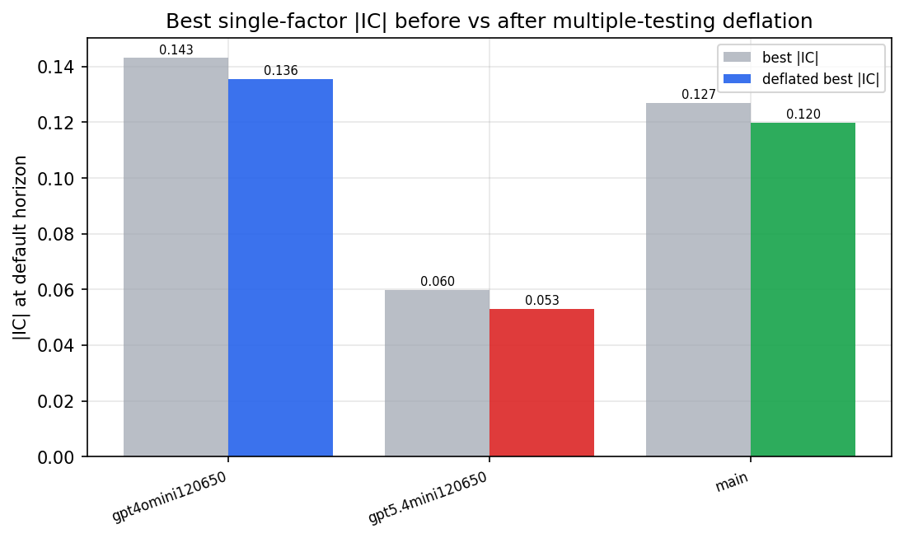

*Best |IC| before vs after multiple-testing deflation*

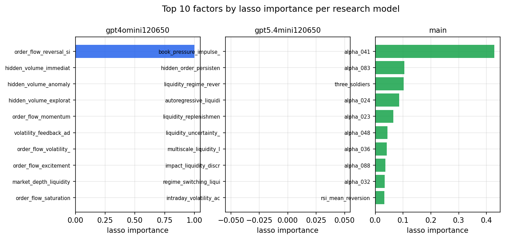

*Top factors by lasso importance per zoo*

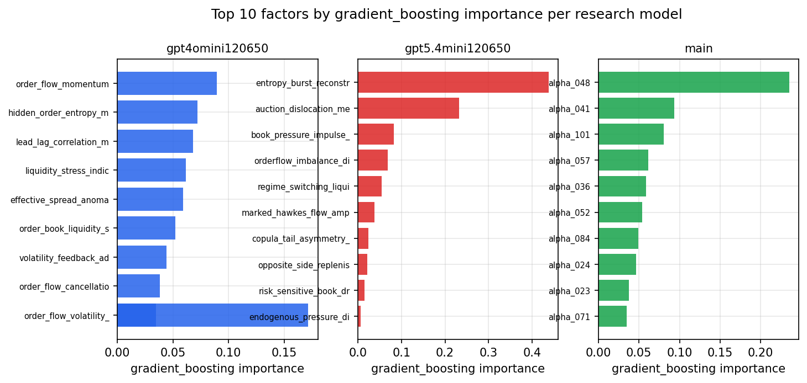

*Top factors by gradient_boosting importance per zoo*

## 4. ML-combined signal — per-underlying vectorised backtest

Each model combines a prerun's factors into ONE signal (fit `factors → forward return` on IS, predict per (bar, underlying)), then that combined signal is run through a simple vectorised backtest — `position(signal) × the underlying's own forward return` — on the held-out OOS tail (+ an equal-weight ensemble). No cross-sectional ranking.

> Config: position=**threshold** (t=1.0, z-score `expanding`), aggregation=**portfolio**, fit-standardise=**per_underlying**, horizon=6.

| prerun | model | n_factors_used | oos_ic | oos_sharpe | is_sharpe | oos_ann_return | oos_max_drawdown |
| --- | --- | --- | --- | --- | --- | --- | --- |
| gpt4omini120650 | linear_regression | 66 | 0.0207 | 3.1489 | 13.4672 | 0.2886 | -0.0197 |
| gpt4omini120650 | ridge | 66 | 0.0225 | 4.1423 | 13.6568 | 0.3786 | -0.0207 |
| gpt4omini120650 | lasso | 66 | 0.0115 | 3.8367 | 8.2341 | 0.2535 | -0.0181 |
| gpt4omini120650 | elastic_net | 66 | 0.0103 | 3.726 | 8.153 | 0.2458 | -0.0178 |
| gpt4omini120650 | random_forest | 66 | 0.0066 | 0.9848 | 11.6375 | 0.0588 | -0.0117 |
| gpt4omini120650 | gradient_boosting | 66 | 0.0042 | -1.4819 | 9.3649 | -0.0326 | -0.0066 |
| gpt4omini120650 | xgboost | 66 | 0.0378 | 5.2649 | 12.3677 | 0.2673 | -0.0107 |
| gpt4omini120650 | lightgbm | 66 | 0.0441 | 3.8576 | 13.7052 | 0.261 | -0.009 |
| gpt4omini120650 | ensemble | 66 | 0.0241 | 3.4665 | 14.322 | 0.2721 | -0.0181 |
| gpt5.4mini120650 | linear_regression | 68 | -0.0106 | -8.8283 | 10.6368 | -0.3896 | -0.0357 |
| gpt5.4mini120650 | ridge | 68 | -0.0112 | -8.0914 | 10.6655 | -0.3644 | -0.0336 |
| gpt5.4mini120650 | lasso | 68 | -0.0162 | -5.0654 | 8.4307 | -0.5637 | -0.0626 |
| gpt5.4mini120650 | elastic_net | 68 | -0.0166 | -8.1302 | 9.3525 | -0.603 | -0.0544 |
| gpt5.4mini120650 | random_forest | 68 | 0.0487 | 15.7705 | 22.9867 | 1.9168 | -0.0258 |
| gpt5.4mini120650 | gradient_boosting | 68 | 0.0378 | -4.3633 | 13.5264 | -0.1455 | -0.0169 |
| gpt5.4mini120650 | xgboost | 68 | 0.0709 | 18.9657 | 20.9778 | 1.6443 | -0.0125 |
| gpt5.4mini120650 | lightgbm | 68 | 0.0687 | 14.5387 | 17.0242 | 0.8262 | -0.0098 |
| gpt5.4mini120650 | ensemble | 68 | 0.032 | 5.3472 | 19.4397 | 0.5257 | -0.0306 |
| main | linear_regression | 78 | 0.069 | 32.8363 | 18.0242 | 2.1644 | -0.0046 |
| main | ridge | 78 | 0.0637 | 33.4774 | 18.8971 | 2.2535 | -0.0049 |
| main | lasso | 78 | 0.0714 | 34.9522 | 19.0714 | 2.4036 | -0.0037 |
| main | elastic_net | 78 | 0.0714 | 34.9522 | 19.0714 | 2.4036 | -0.0037 |
| main | random_forest | 78 | 0.1269 | 33.2983 | 14.8151 | 2.3239 | -0.0048 |
| main | gradient_boosting | 78 | 0.1236 | 32.3676 | 15.2401 | 1.9919 | -0.0036 |
| main | xgboost | 78 | 0.1217 | 32.5067 | 16.289 | 2.2064 | -0.0044 |
| main | lightgbm | 78 | 0.1168 | 34.9875 | 17.9074 | 2.4086 | -0.0029 |
| main | ensemble | 78 | 0.1163 | 35.1969 | 16.0434 | 2.4185 | -0.0036 |

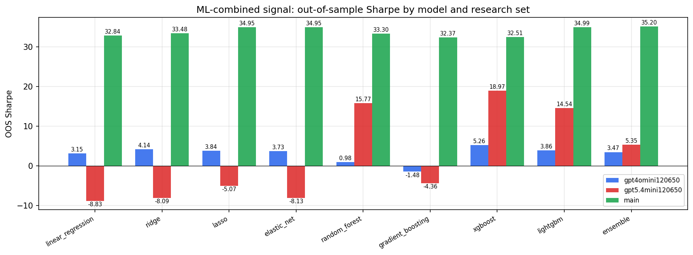

*ML-combined OOS Sharpe by model and research set*

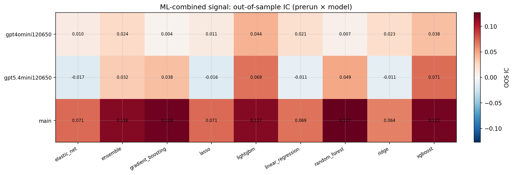

*ML-combined OOS IC (prerun × model)*

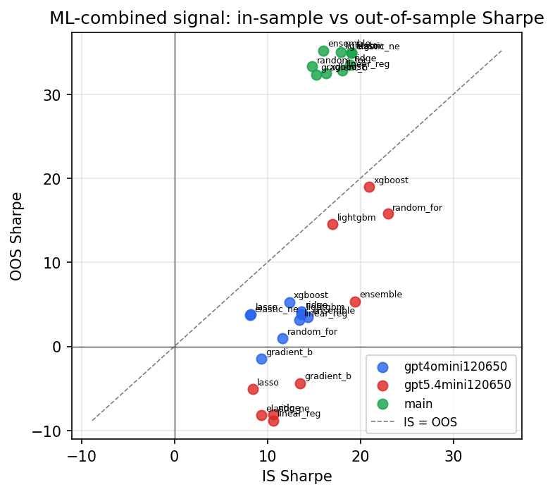

*IS vs OOS Sharpe (overfitting diagnostic)*

---
*Generated by `run_model_comparison.py`. Tables: `*.csv`; interactive: `comparison.ipynb`.*
