# Research-LLM factor comparison — `2024-09`

Comparing the **factor output of different research LLMs** on three axes (raw factor quality → factors as ML features → factors through the full agentic fund). The panel, IS/OOS split, horizon and model hyper-parameters are held identical across preruns — the *only* variable is the factor set.

## Preruns compared

| prerun | research_model | usable_factors | dropped_factors |
| --- | --- | --- | --- |
| gpt4omini120650 | gpt-4o-mini | 66 | 0 |
| gpt5.4mini120650 | gpt-5.4-mini | 68 | 1 |
| main | seed library | 78 | 10 |

> Dropped factors declare fields the current data doesn't have yet (e.g. fundamentals); they light up unchanged once that data is downloaded.

*Usable vs awaiting-data factors per research model*

## Key findings

- **Best ML-combined OOS Sharpe:** `gpt5.4mini120650` with `xgboost` (OOS Sharpe = 28.053).
- **Mean OOS Sharpe across models, by research set:** `main` = 21.111, `gpt5.4mini120650` = 21.030, `gpt4omini120650` = 16.965.
- **Highest mean single-factor |IC| (h=6):** `main` (mean |IC| = 0.0425).
- **Most diverse zoo (highest effective/raw factor ratio):** `gpt5.4mini120650` (eff 56.3 of 68, ratio 0.83).
- **Best selection-deflated single-factor |IC|:** `main` (deflated |IC| = 0.0962 from 38 factors tried).

## 1. Single-factor IC (raw factor quality)

Per-underlying time-series Spearman rank-IC of every researched factor, recomputed on the shared panel at horizons h=1, h=6, h=60. The per-underlying IC correlates each factor's value vector with the underlying's own forward-return vector (pooled across underlyings); the cross-sectional IC ranks across underlyings per timestamp.

| prerun | n_factors | mean_abs_ic_1 | mean_abs_ic_6 | mean_abs_ic_60 | mean_abs_icir_6 | best_factor_h6 | best_abs_ic_h6 |
| --- | --- | --- | --- | --- | --- | --- | --- |
| gpt4omini120650 | 66 | 0.0198 | 0.0162 | 0.0154 | 0.5015 | order_flow_reversal_signal | 0.0631 |
| gpt5.4mini120650 | 68 | 0.0128 | 0.0131 | 0.0125 | 0.5189 | auction_dislocation_mean_reversion | 0.0729 |
| main | 78 | 0.042 | 0.0425 | 0.0281 | 1.1305 | alpha_032 | 0.1033 |

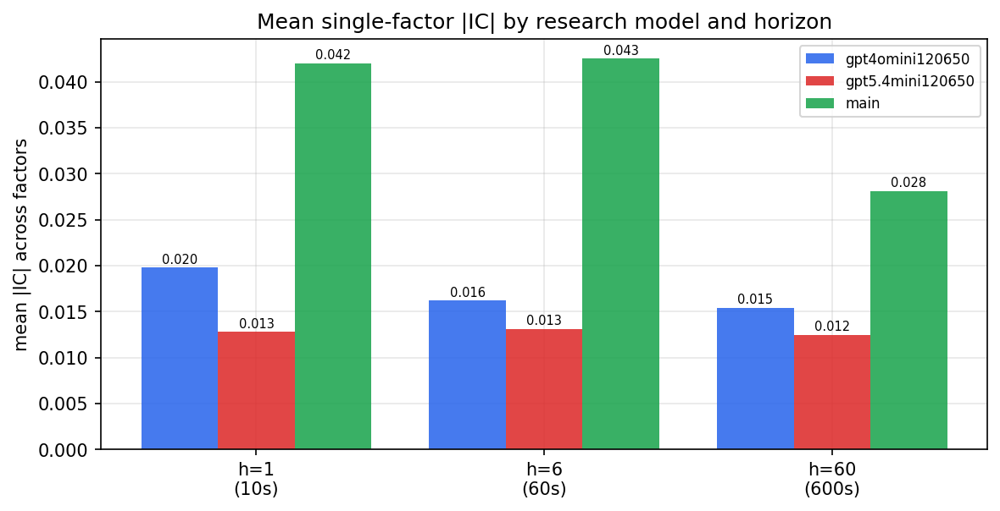

*Mean |IC| by research model and horizon*

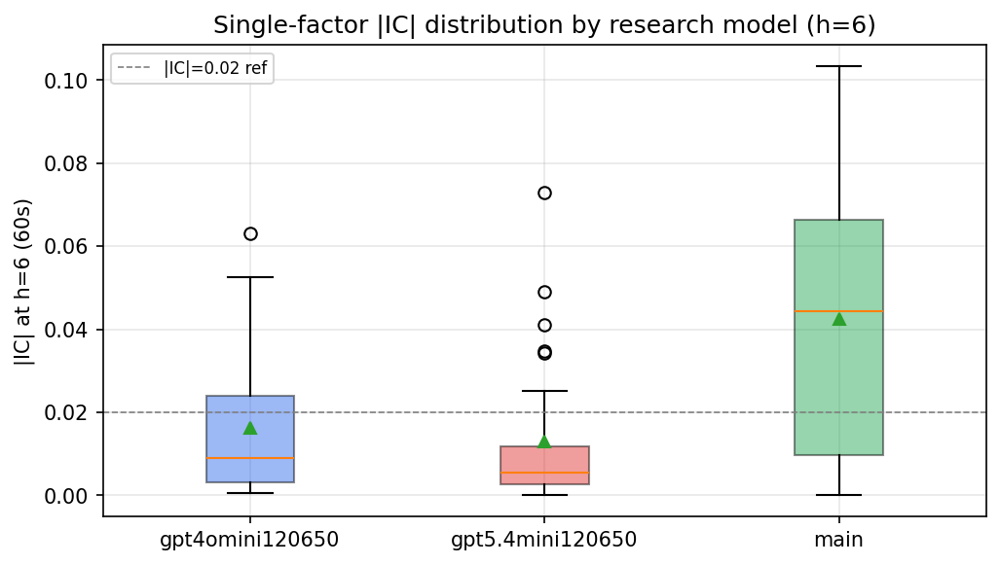

*Per-factor |IC| distribution by research model*

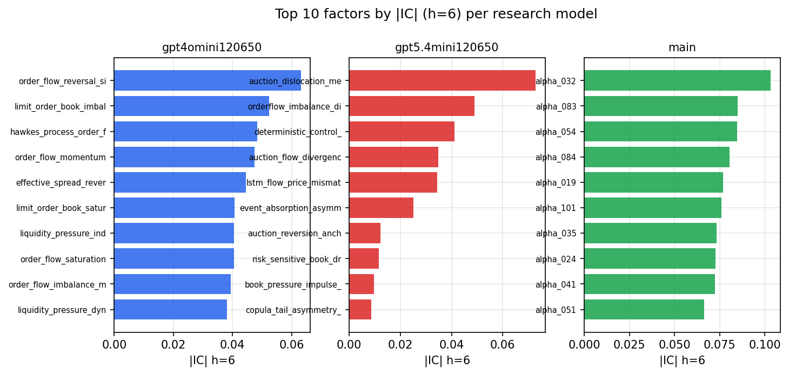

*Top factors by |IC| per research model*

## 2. Factor diversity & redundancy

Pairwise correlation of each zoo's *signals*. `eff_n_factors` is the effective number of independent factors (participation ratio of the correlation eigenvalues); `eff_ratio` and `redundancy` summarise how much unique information the zoo holds vs. how much is duplicated; `n_clusters` groups factors at |corr| ≥ 0.7.

| prerun | n_factors | eff_n_factors | eff_ratio | mean_abs_corr | n_clusters | redundancy |
| --- | --- | --- | --- | --- | --- | --- |
| gpt4omini120650 | 66 | 28.8823 | 0.4376 | 0.0561 | 50 | 0.5624 |
| gpt5.4mini120650 | 68 | 56.3144 | 0.8282 | 0.0077 | 63 | 0.1718 |
| main | 78 | 40.3414 | 0.5172 | 0.0347 | 69 | 0.4828 |

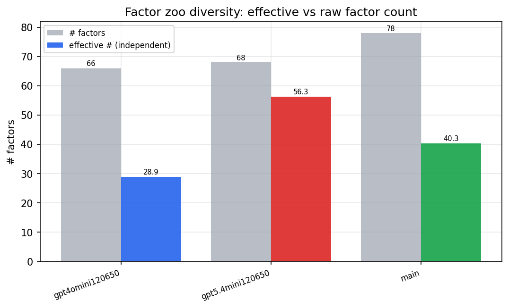

*Effective vs raw factor count per research model*

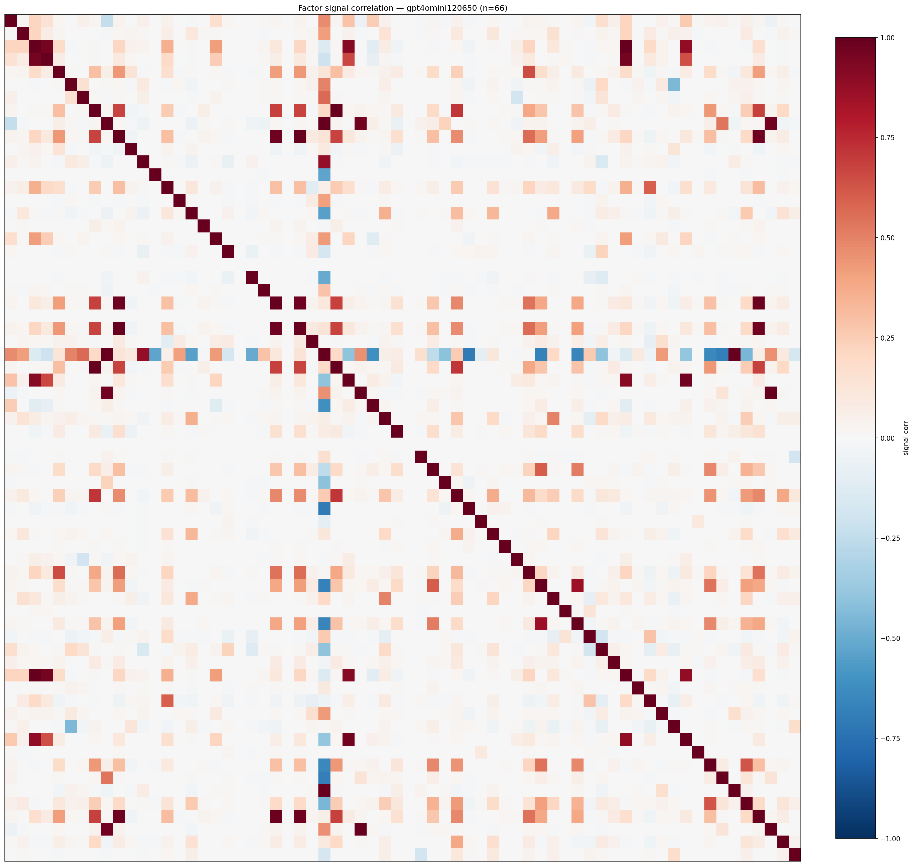

*Signal correlation matrix — gpt4omini120650*

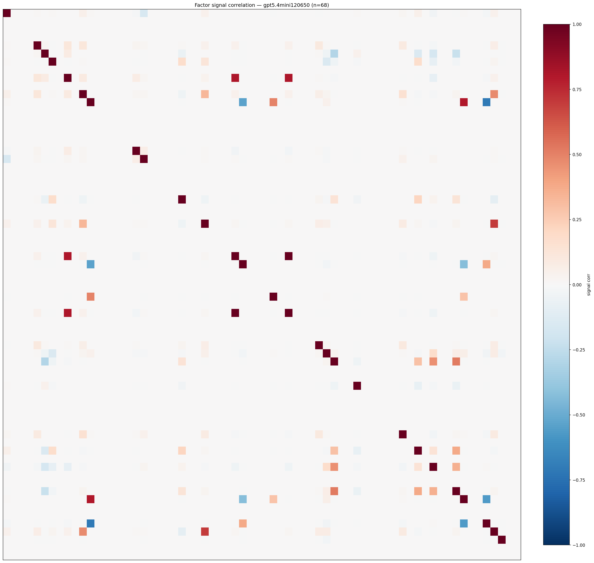

*Signal correlation matrix — gpt5.4mini120650*

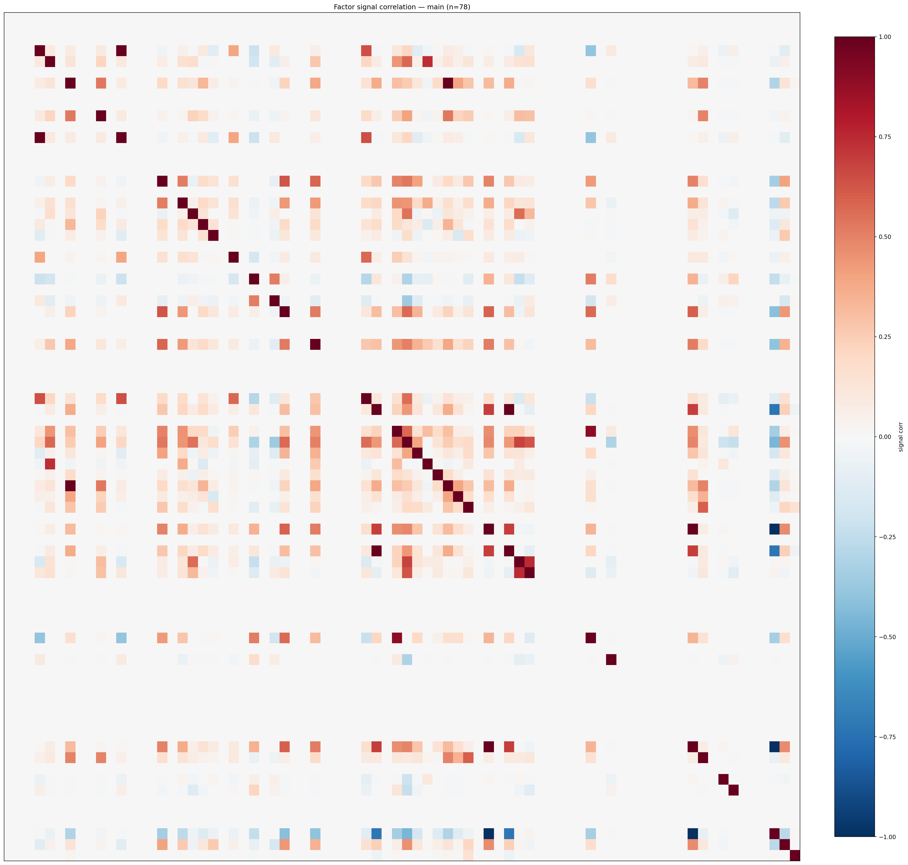

*Signal correlation matrix — main*

## 3. Deflation & model-based importance

`deflated_best_ic` haircuts each zoo's best |IC| for the number of factors tried (`ic_n_tested`) — a bigger zoo's best factor is more likely to be lucky. `lasso_n_nonzero` / `lasso_sparsity` show how many factors a sparse linear model actually keeps (model-view redundancy).

| prerun | best_ic | deflated_best_ic | deflated_best_t | ic_n_tested | ic_n_obs | lasso_n_nonzero | lasso_sparsity |
| --- | --- | --- | --- | --- | --- | --- | --- |
| gpt4omini120650 | 0.0631 | 0.0555 | 21.0622 | 63 | 143997 | 9 | 0.8636 |
| gpt5.4mini120650 | 0.0729 | 0.0661 | 25.0932 | 28 | 143997 | 10 | 0.8529 |
| main | 0.1033 | 0.0962 | 36.4956 | 38 | 143997 | 13 | 0.8333 |

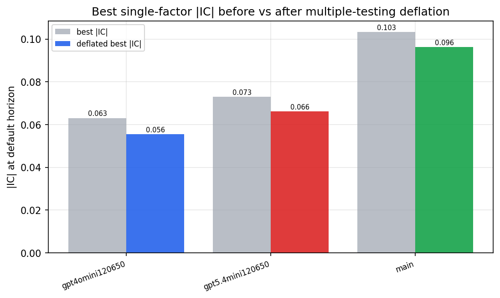

*Best |IC| before vs after multiple-testing deflation*

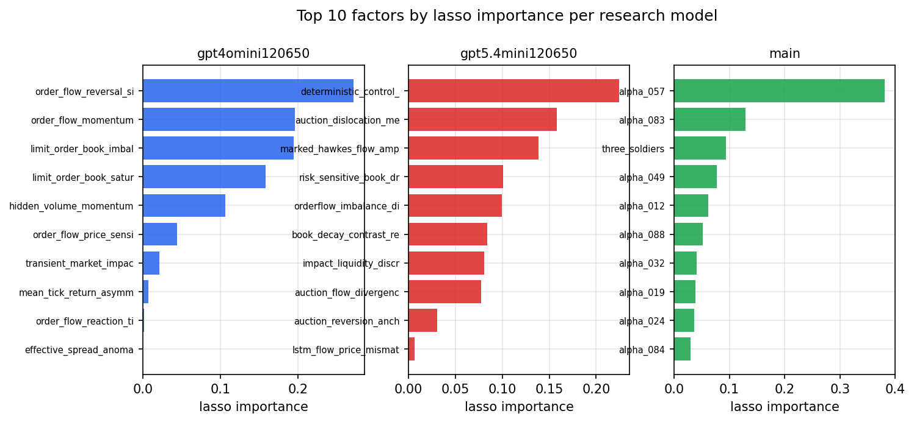

*Top factors by lasso importance per zoo*

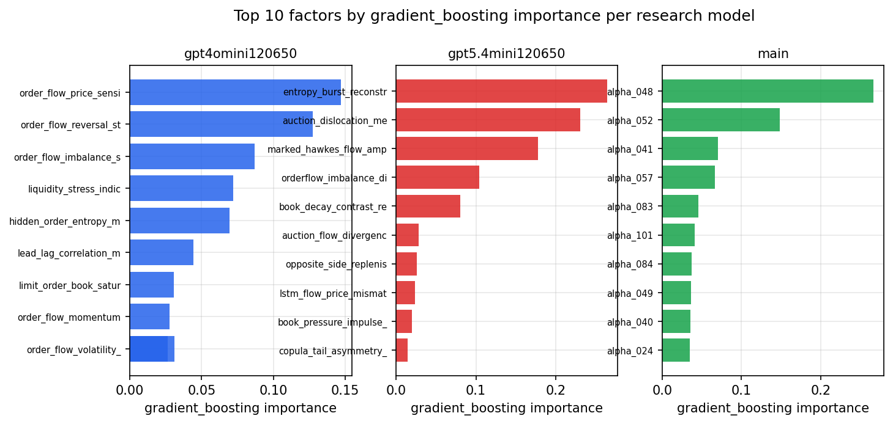

*Top factors by gradient_boosting importance per zoo*

## 4. ML-combined signal — per-underlying vectorised backtest

Each model combines a prerun's factors into ONE signal (fit `factors → forward return` on IS, predict per (bar, underlying)), then that combined signal is run through a simple vectorised backtest — `position(signal) × the underlying's own forward return` — on the held-out OOS tail (+ an equal-weight ensemble). No cross-sectional ranking.

> Config: position=**threshold** (t=1.0, z-score `expanding`), aggregation=**portfolio**, fit-standardise=**per_underlying**, horizon=6.

| prerun | model | n_factors_used | oos_ic | oos_sharpe | is_sharpe | oos_ann_return | oos_max_drawdown |
| --- | --- | --- | --- | --- | --- | --- | --- |
| gpt4omini120650 | linear_regression | 66 | 0.0633 | 19.2608 | 22.0278 | 1.1311 | -0.009 |
| gpt4omini120650 | ridge | 66 | 0.0687 | 19.4279 | 20.793 | 1.1693 | -0.009 |
| gpt4omini120650 | lasso | 66 | 0.0816 | 17.3065 | 17.0443 | 1.0996 | -0.0077 |
| gpt4omini120650 | elastic_net | 66 | 0.0814 | 17.5605 | 17.2027 | 1.1197 | -0.0077 |
| gpt4omini120650 | random_forest | 66 | 0.0726 | 18.7736 | 27.3427 | 1.4148 | -0.0118 |
| gpt4omini120650 | gradient_boosting | 66 | 0.0741 | 12.6501 | 20.2134 | 0.7942 | -0.0146 |
| gpt4omini120650 | xgboost | 66 | 0.0697 | 17.5291 | 22.7047 | 1.3116 | -0.011 |
| gpt4omini120650 | lightgbm | 66 | 0.0712 | 11.3453 | 23.5071 | 0.7445 | -0.0142 |
| gpt4omini120650 | ensemble | 66 | 0.079 | 18.8271 | 23.0444 | 1.4134 | -0.0119 |
| gpt5.4mini120650 | linear_regression | 68 | 0.0846 | 18.7805 | 14.3404 | 1.1778 | -0.0053 |
| gpt5.4mini120650 | ridge | 68 | 0.0855 | 19.7316 | 15.366 | 1.2525 | -0.0059 |
| gpt5.4mini120650 | lasso | 68 | nan | nan | nan | nan | nan |
| gpt5.4mini120650 | elastic_net | 68 | nan | nan | nan | nan | nan |
| gpt5.4mini120650 | random_forest | 68 | 0.0964 | 27.5509 | 29.3176 | 1.861 | -0.0048 |
| gpt5.4mini120650 | gradient_boosting | 68 | 0.0946 | 20.2916 | 22.0858 | 1.2438 | -0.0078 |
| gpt5.4mini120650 | xgboost | 68 | 0.0934 | 28.0531 | 26.025 | 1.802 | -0.0065 |
| gpt5.4mini120650 | lightgbm | 68 | 0.0885 | 22.4367 | 24.7632 | 0.8443 | -0.0034 |
| gpt5.4mini120650 | ensemble | 68 | 0.0912 | 10.3645 | 9.7007 | 0.1439 | -0.0015 |
| main | linear_regression | 78 | 0.0781 | 21.1155 | 21.1711 | 1.2652 | -0.0053 |
| main | ridge | 78 | 0.0854 | 22.5381 | 21.5091 | 1.3516 | -0.0053 |
| main | lasso | 78 | 0.101 | 24.5536 | 22.1607 | 1.5056 | -0.0064 |
| main | elastic_net | 78 | 0.1019 | 25.243 | 22.1717 | 1.5501 | -0.0064 |
| main | random_forest | 78 | 0.0768 | 20.7663 | 27.9624 | 1.4829 | -0.013 |
| main | gradient_boosting | 78 | 0.0736 | 18.375 | 23.7766 | 1.3076 | -0.0127 |
| main | xgboost | 78 | 0.0754 | 19.531 | 26.5966 | 1.3561 | -0.0126 |
| main | lightgbm | 78 | 0.0744 | 16.7015 | 26.0628 | 1.0942 | -0.011 |
| main | ensemble | 78 | 0.0866 | 21.172 | 22.4476 | 1.431 | -0.0109 |

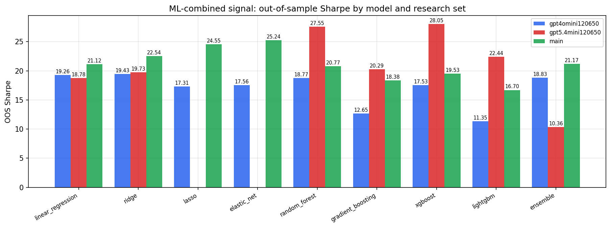

*ML-combined OOS Sharpe by model and research set*

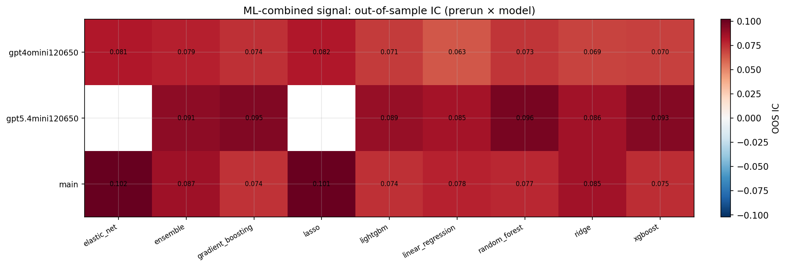

*ML-combined OOS IC (prerun × model)*

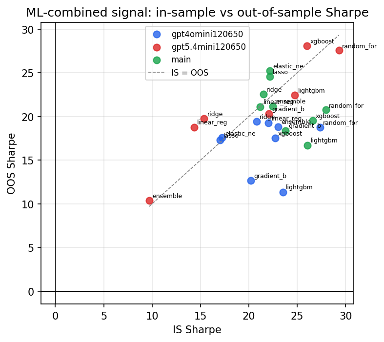

*IS vs OOS Sharpe (overfitting diagnostic)*

---
*Generated by `run_model_comparison.py`. Tables: `*.csv`; interactive: `comparison.ipynb`.*
