# Research-LLM factor comparison — `2024-10`

Comparing the **factor output of different research LLMs** on three axes (raw factor quality → factors as ML features → factors through the full agentic fund). The panel, IS/OOS split, horizon and model hyper-parameters are held identical across preruns — the *only* variable is the factor set.

## Preruns compared

| prerun | research_model | usable_factors | dropped_factors |
| --- | --- | --- | --- |
| gpt4omini120650 | gpt-4o-mini | 66 | 0 |
| gpt5.4mini120650 | gpt-5.4-mini | 68 | 1 |
| main | seed library | 78 | 10 |

> Dropped factors declare fields the current data doesn't have yet (e.g. fundamentals); they light up unchanged once that data is downloaded.

*Usable vs awaiting-data factors per research model*

## Key findings

- **Best ML-combined OOS Sharpe:** `main` with `ensemble` (OOS Sharpe = 36.188).
- **Mean OOS Sharpe across models, by research set:** `main` = 34.157, `gpt5.4mini120650` = 21.351, `gpt4omini120650` = 15.179.
- **Highest mean single-factor |IC| (h=6):** `main` (mean |IC| = 0.0517).
- **Most diverse zoo (highest effective/raw factor ratio):** `gpt5.4mini120650` (eff 56.8 of 68, ratio 0.84).
- **Best selection-deflated single-factor |IC|:** `gpt4omini120650` (deflated |IC| = 0.1970 from 63 factors tried).

## 1. Single-factor IC (raw factor quality)

Per-underlying time-series Spearman rank-IC of every researched factor, recomputed on the shared panel at horizons h=1, h=6, h=60. The per-underlying IC correlates each factor's value vector with the underlying's own forward-return vector (pooled across underlyings); the cross-sectional IC ranks across underlyings per timestamp.

| prerun | n_factors | mean_abs_ic_1 | mean_abs_ic_6 | mean_abs_ic_60 | mean_abs_icir_6 | best_factor_h6 | best_abs_ic_h6 |
| --- | --- | --- | --- | --- | --- | --- | --- |
| gpt4omini120650 | 66 | 0.0258 | 0.0246 | 0.0231 | 0.6783 | effective_spread_reversal_strength | 0.2045 |
| gpt5.4mini120650 | 68 | 0.0147 | 0.0146 | 0.0114 | 0.6652 | auction_dislocation_mean_reversion | 0.0833 |
| main | 78 | 0.0415 | 0.0517 | 0.0383 | 1.1927 | alpha_032 | 0.1327 |

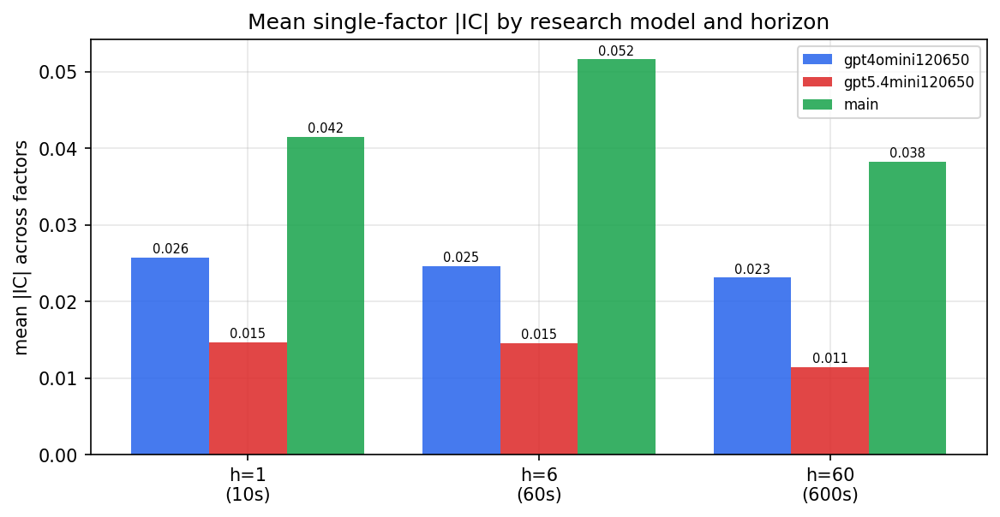

*Mean |IC| by research model and horizon*

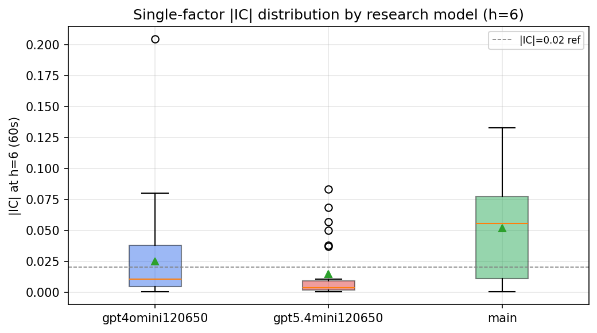

*Per-factor |IC| distribution by research model*

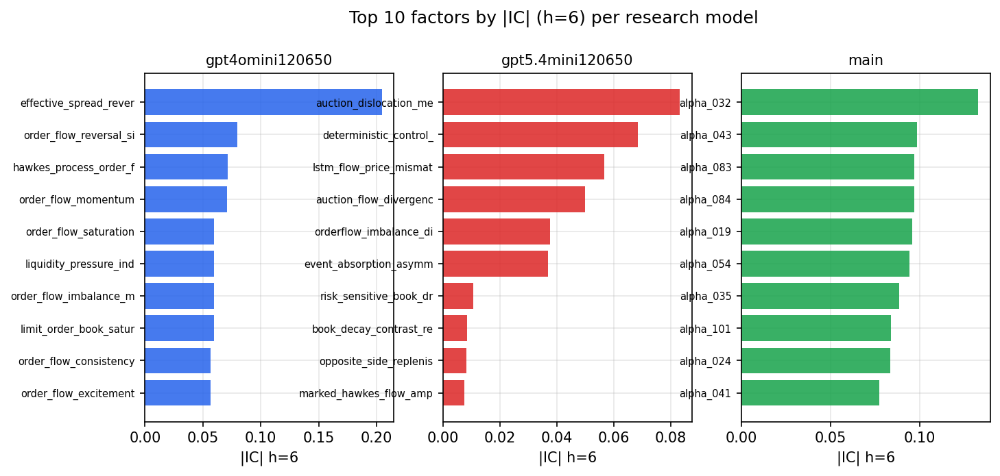

*Top factors by |IC| per research model*

## 2. Factor diversity & redundancy

Pairwise correlation of each zoo's *signals*. `eff_n_factors` is the effective number of independent factors (participation ratio of the correlation eigenvalues); `eff_ratio` and `redundancy` summarise how much unique information the zoo holds vs. how much is duplicated; `n_clusters` groups factors at |corr| ≥ 0.7.

| prerun | n_factors | eff_n_factors | eff_ratio | mean_abs_corr | n_clusters | redundancy |
| --- | --- | --- | --- | --- | --- | --- |
| gpt4omini120650 | 66 | 28.6595 | 0.4342 | 0.056 | 34 | 0.5658 |
| gpt5.4mini120650 | 68 | 56.7896 | 0.8351 | 0.0074 | 64 | 0.1649 |
| main | 78 | 39.2975 | 0.5038 | 0.0367 | 68 | 0.4962 |

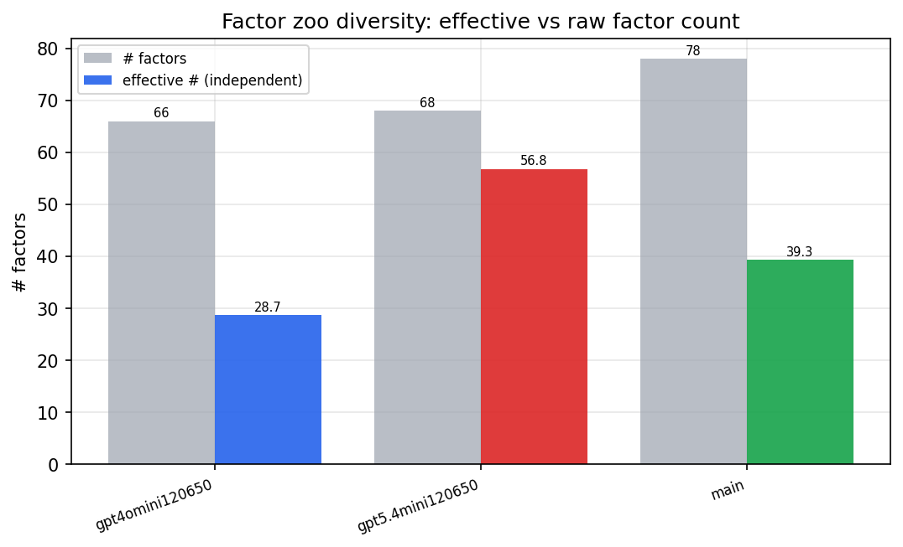

*Effective vs raw factor count per research model*

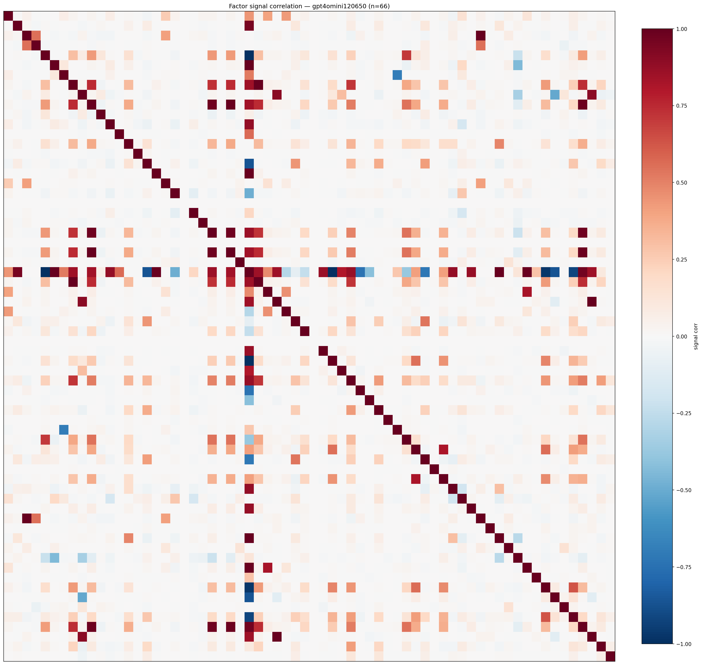

*Signal correlation matrix — gpt4omini120650*

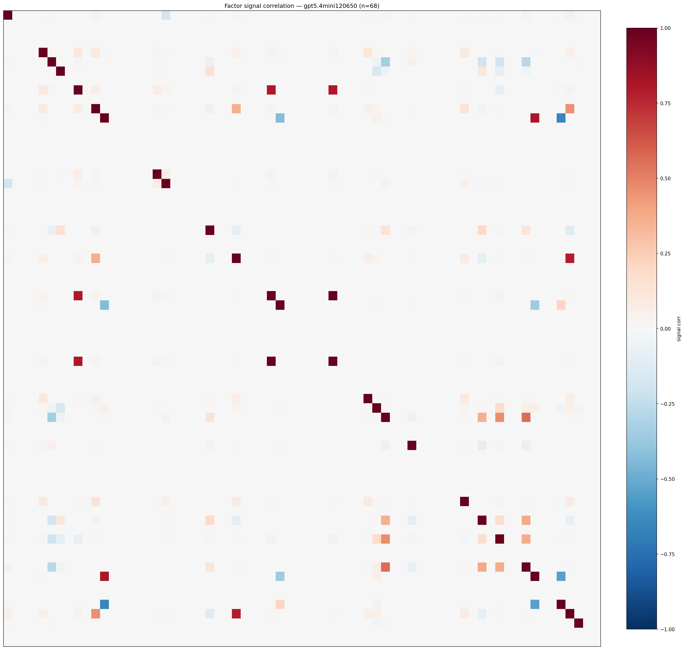

*Signal correlation matrix — gpt5.4mini120650*

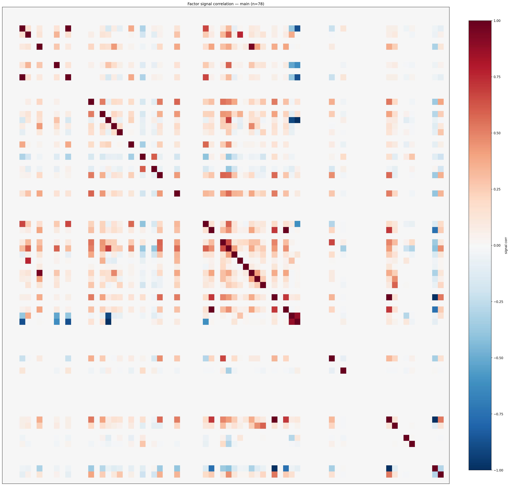

*Signal correlation matrix — main*

## 3. Deflation & model-based importance

`deflated_best_ic` haircuts each zoo's best |IC| for the number of factors tried (`ic_n_tested`) — a bigger zoo's best factor is more likely to be lucky. `lasso_n_nonzero` / `lasso_sparsity` show how many factors a sparse linear model actually keeps (model-view redundancy).

| prerun | best_ic | deflated_best_ic | deflated_best_t | ic_n_tested | ic_n_obs | lasso_n_nonzero | lasso_sparsity |
| --- | --- | --- | --- | --- | --- | --- | --- |
| gpt4omini120650 | 0.2045 | 0.197 | 75.6257 | 63 | 147417 | 11 | 0.8333 |
| gpt5.4mini120650 | 0.0833 | 0.0766 | 29.411 | 28 | 147417 | 7 | 0.8971 |
| main | 0.1327 | 0.1257 | 48.2624 | 37 | 147417 | 20 | 0.7436 |

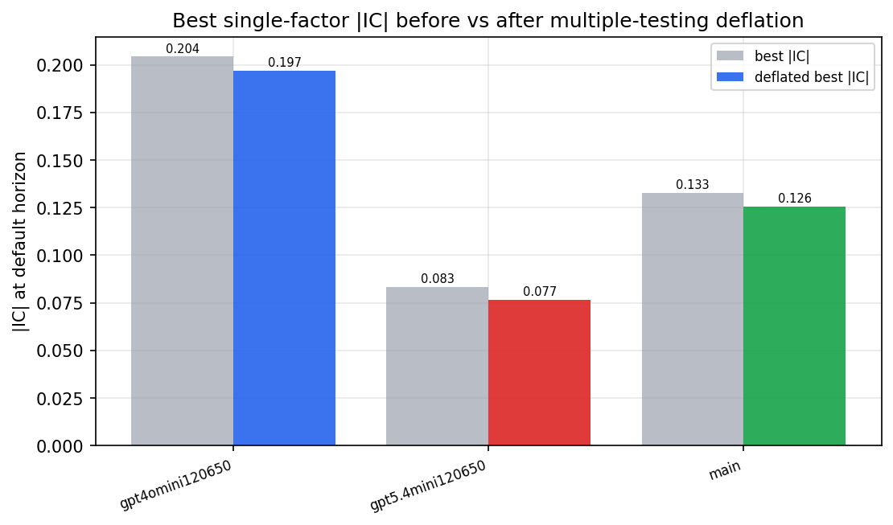

*Best |IC| before vs after multiple-testing deflation*

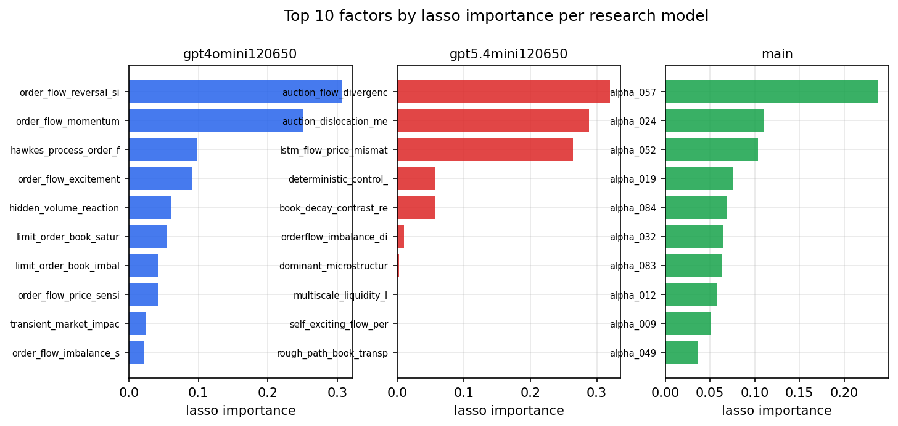

*Top factors by lasso importance per zoo*

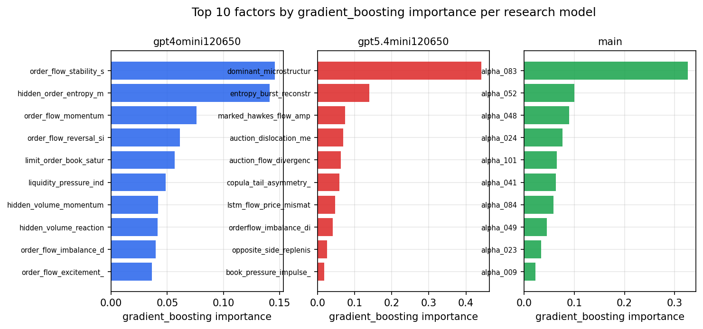

*Top factors by gradient_boosting importance per zoo*

## 4. ML-combined signal — per-underlying vectorised backtest

Each model combines a prerun's factors into ONE signal (fit `factors → forward return` on IS, predict per (bar, underlying)), then that combined signal is run through a simple vectorised backtest — `position(signal) × the underlying's own forward return` — on the held-out OOS tail (+ an equal-weight ensemble). No cross-sectional ranking.

> Config: position=**threshold** (t=1.0, z-score `expanding`), aggregation=**portfolio**, fit-standardise=**per_underlying**, horizon=6.

| prerun | model | n_factors_used | oos_ic | oos_sharpe | is_sharpe | oos_ann_return | oos_max_drawdown |
| --- | --- | --- | --- | --- | --- | --- | --- |
| gpt4omini120650 | linear_regression | 66 | 0.0726 | 5.4388 | 20.7929 | 0.3537 | -0.0102 |
| gpt4omini120650 | ridge | 66 | 0.0741 | 5.8126 | 20.3623 | 0.3877 | -0.0089 |
| gpt4omini120650 | lasso | 66 | 0.0791 | 12.5466 | 18.109 | 0.9571 | -0.0095 |
| gpt4omini120650 | elastic_net | 66 | 0.0802 | 12.4269 | 17.8845 | 0.958 | -0.0096 |
| gpt4omini120650 | random_forest | 66 | 0.0865 | 29.0831 | 25.5262 | 2.608 | -0.0055 |
| gpt4omini120650 | gradient_boosting | 66 | 0.0797 | 7.1667 | 17.7139 | 0.4121 | -0.0086 |
| gpt4omini120650 | xgboost | 66 | 0.0768 | 21.4956 | 23.4656 | 1.6225 | -0.0099 |
| gpt4omini120650 | lightgbm | 66 | 0.0804 | 19.5416 | 25.5709 | 1.4761 | -0.0077 |
| gpt4omini120650 | ensemble | 66 | 0.0838 | 23.0989 | 24.4409 | 1.8601 | -0.0078 |
| gpt5.4mini120650 | linear_regression | 68 | 0.0768 | 16.5255 | 24.2329 | 1.2695 | -0.0114 |
| gpt5.4mini120650 | ridge | 68 | 0.0777 | 16.5797 | 24.9317 | 1.2744 | -0.0125 |
| gpt5.4mini120650 | lasso | 68 | 0.0795 | 22.2163 | 27.7749 | 1.6327 | -0.007 |
| gpt5.4mini120650 | elastic_net | 68 | 0.0795 | 22.3415 | 27.7497 | 1.6458 | -0.0069 |
| gpt5.4mini120650 | random_forest | 68 | 0.0795 | 22.3244 | 28.0867 | 1.4553 | -0.0061 |
| gpt5.4mini120650 | gradient_boosting | 68 | 0.079 | 24.5538 | 25.3614 | 1.599 | -0.0051 |
| gpt5.4mini120650 | xgboost | 68 | 0.0729 | 21.3863 | 27.6883 | 1.3814 | -0.0087 |
| gpt5.4mini120650 | lightgbm | 68 | 0.0715 | 21.7416 | 25.7461 | 1.2132 | -0.0045 |
| gpt5.4mini120650 | ensemble | 68 | 0.0838 | 24.4905 | 25.4807 | 1.8658 | -0.0074 |
| main | linear_regression | 78 | 0.1099 | 34.3411 | 24.8336 | 2.5486 | -0.0099 |
| main | ridge | 78 | 0.1172 | 33.772 | 25.2053 | 2.5079 | -0.01 |
| main | lasso | 78 | 0.1227 | 34.6651 | 27.1318 | 2.8043 | -0.0108 |
| main | elastic_net | 78 | 0.1224 | 34.4374 | 27.1699 | 2.8093 | -0.0108 |
| main | random_forest | 78 | 0.1257 | 35.1098 | 28.1507 | 3.1161 | -0.0045 |
| main | gradient_boosting | 78 | 0.124 | 32.5079 | 31.4179 | 2.1988 | -0.0054 |
| main | xgboost | 78 | 0.1197 | 36.0276 | 32.1666 | 3.2033 | -0.0059 |
| main | lightgbm | 78 | 0.1129 | 30.3639 | 27.473 | 2.1325 | -0.0061 |
| main | ensemble | 78 | 0.1247 | 36.1875 | 28.6686 | 3.0508 | -0.0101 |

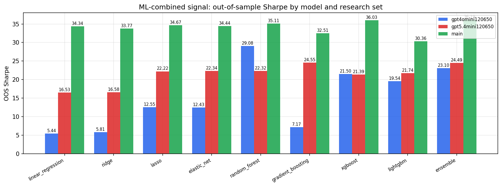

*ML-combined OOS Sharpe by model and research set*

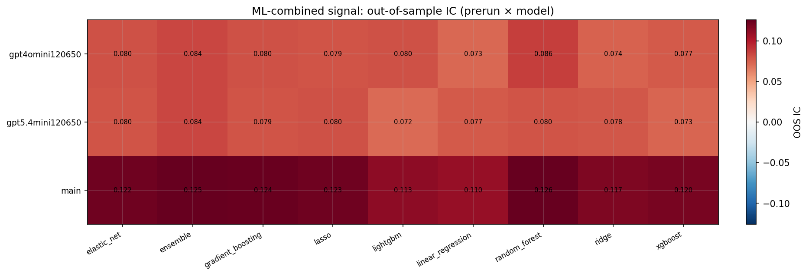

*ML-combined OOS IC (prerun × model)*

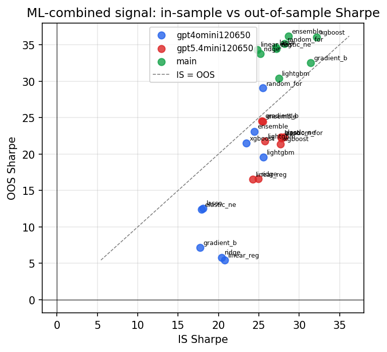

*IS vs OOS Sharpe (overfitting diagnostic)*

---
*Generated by `run_model_comparison.py`. Tables: `*.csv`; interactive: `comparison.ipynb`.*
