# Research-LLM factor comparison — `2024-11`

Comparing the **factor output of different research LLMs** on three axes (raw factor quality → factors as ML features → factors through the full agentic fund). The panel, IS/OOS split, horizon and model hyper-parameters are held identical across preruns — the *only* variable is the factor set.

## Preruns compared

| prerun | research_model | usable_factors | dropped_factors |
| --- | --- | --- | --- |
| gpt4omini120650 | gpt-4o-mini | 66 | 0 |
| gpt5.4mini120650 | gpt-5.4-mini | 68 | 1 |
| main | seed library | 78 | 10 |

> Dropped factors declare fields the current data doesn't have yet (e.g. fundamentals); they light up unchanged once that data is downloaded.

*Usable vs awaiting-data factors per research model*

## Key findings

- **Best ML-combined OOS Sharpe:** `main` with `random_forest` (OOS Sharpe = 25.432).
- **Mean OOS Sharpe across models, by research set:** `main` = 20.834, `gpt5.4mini120650` = 11.294, `gpt4omini120650` = 4.624.
- **Highest mean single-factor |IC| (h=6):** `main` (mean |IC| = 0.0496).
- **Most diverse zoo (highest effective/raw factor ratio):** `gpt5.4mini120650` (eff 56.1 of 68, ratio 0.83).
- **Best selection-deflated single-factor |IC|:** `gpt4omini120650` (deflated |IC| = 0.1260 from 63 factors tried).

## 1. Single-factor IC (raw factor quality)

Per-underlying time-series Spearman rank-IC of every researched factor, recomputed on the shared panel at horizons h=1, h=6, h=60. The per-underlying IC correlates each factor's value vector with the underlying's own forward-return vector (pooled across underlyings); the cross-sectional IC ranks across underlyings per timestamp.

| prerun | n_factors | mean_abs_ic_1 | mean_abs_ic_6 | mean_abs_ic_60 | mean_abs_icir_6 | best_factor_h6 | best_abs_ic_h6 |
| --- | --- | --- | --- | --- | --- | --- | --- |
| gpt4omini120650 | 66 | 0.0248 | 0.0233 | 0.0261 | 0.7181 | effective_spread_reversal_strength | 0.1336 |
| gpt5.4mini120650 | 68 | 0.0161 | 0.0178 | 0.0159 | 0.7236 | deterministic_control_gap | 0.0843 |
| main | 78 | 0.0433 | 0.0496 | 0.0321 | 1.1025 | alpha_032 | 0.1172 |

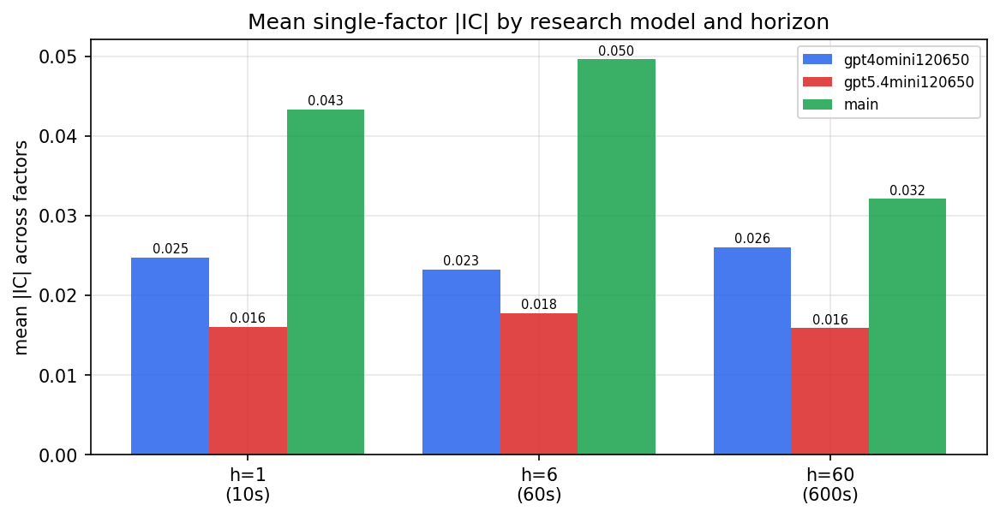

*Mean |IC| by research model and horizon*

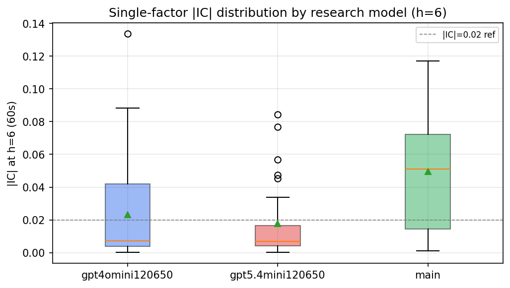

*Per-factor |IC| distribution by research model*

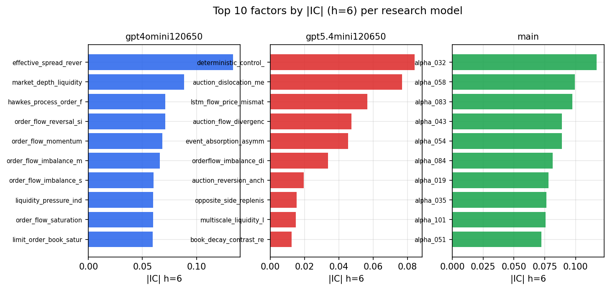

*Top factors by |IC| per research model*

## 2. Factor diversity & redundancy

Pairwise correlation of each zoo's *signals*. `eff_n_factors` is the effective number of independent factors (participation ratio of the correlation eigenvalues); `eff_ratio` and `redundancy` summarise how much unique information the zoo holds vs. how much is duplicated; `n_clusters` groups factors at |corr| ≥ 0.7.

| prerun | n_factors | eff_n_factors | eff_ratio | mean_abs_corr | n_clusters | redundancy |
| --- | --- | --- | --- | --- | --- | --- |
| gpt4omini120650 | 66 | 29.7819 | 0.4512 | 0.0546 | 50 | 0.5488 |
| gpt5.4mini120650 | 68 | 56.1158 | 0.8252 | 0.0083 | 64 | 0.1748 |
| main | 78 | 39.8304 | 0.5106 | 0.037 | 69 | 0.4894 |

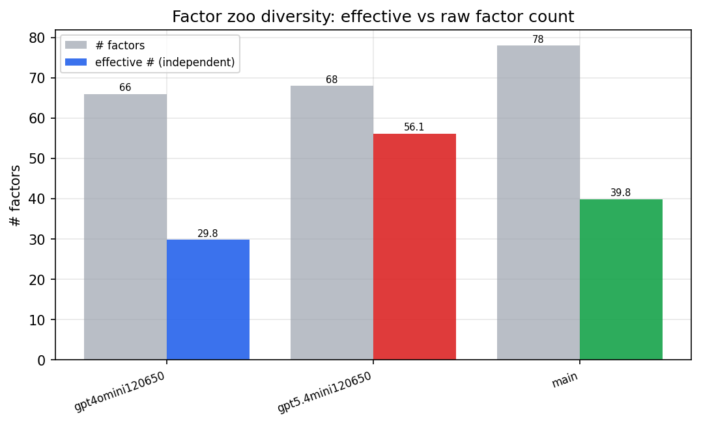

*Effective vs raw factor count per research model*

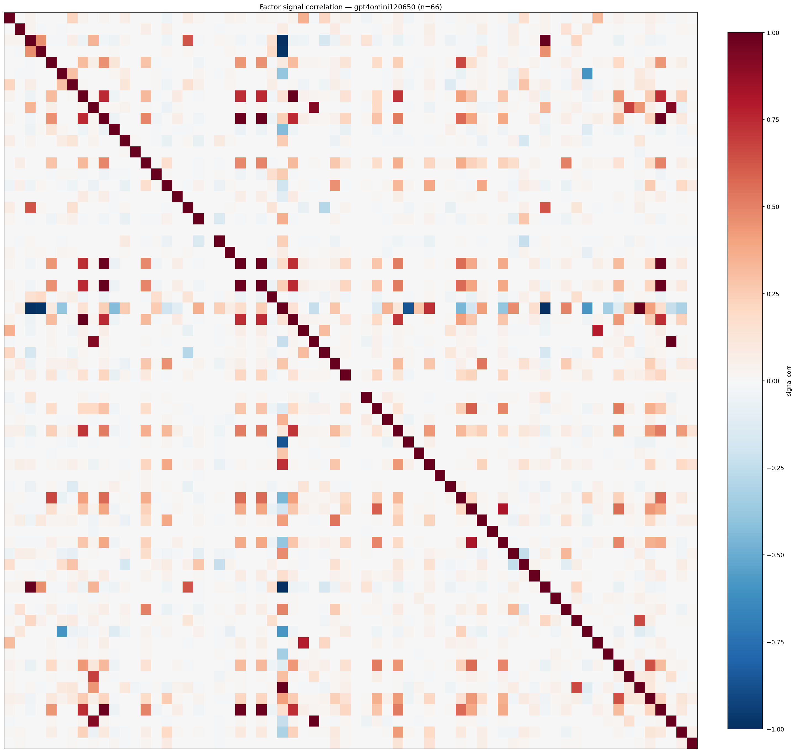

*Signal correlation matrix — gpt4omini120650*

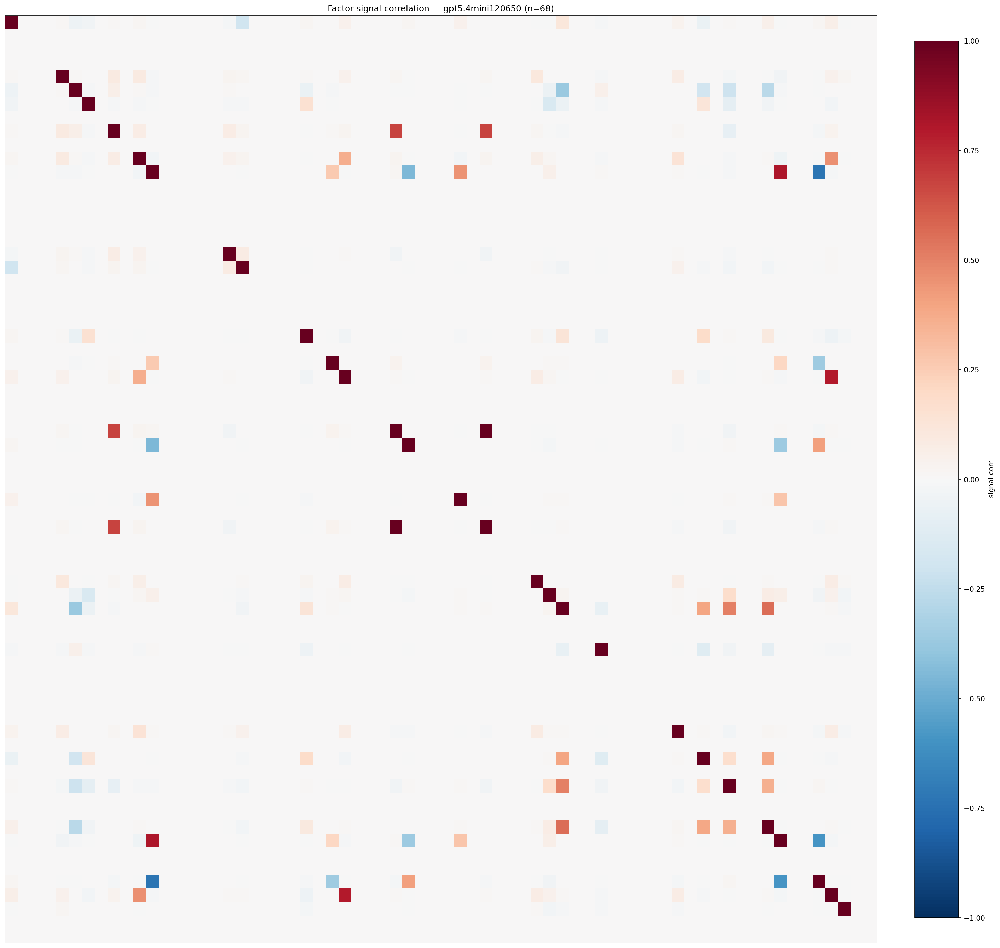

*Signal correlation matrix — gpt5.4mini120650*

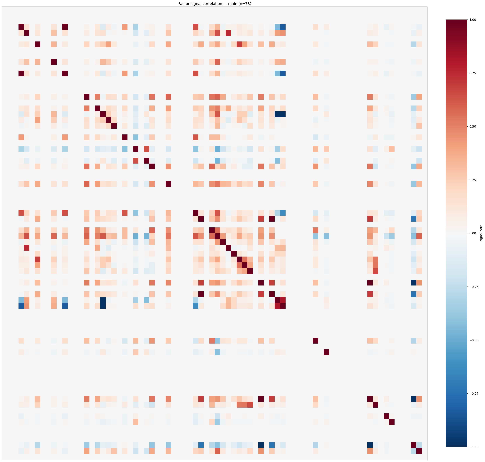

*Signal correlation matrix — main*

## 3. Deflation & model-based importance

`deflated_best_ic` haircuts each zoo's best |IC| for the number of factors tried (`ic_n_tested`) — a bigger zoo's best factor is more likely to be lucky. `lasso_n_nonzero` / `lasso_sparsity` show how many factors a sparse linear model actually keeps (model-view redundancy).

| prerun | best_ic | deflated_best_ic | deflated_best_t | ic_n_tested | ic_n_obs | lasso_n_nonzero | lasso_sparsity |
| --- | --- | --- | --- | --- | --- | --- | --- |
| gpt4omini120650 | 0.1336 | 0.126 | 47.8303 | 63 | 143998 | 7 | 0.8939 |
| gpt5.4mini120650 | 0.0843 | 0.0775 | 29.4254 | 28 | 143998 | 12 | 0.8235 |
| main | 0.1172 | 0.1101 | 41.797 | 37 | 143998 | 33 | 0.5769 |

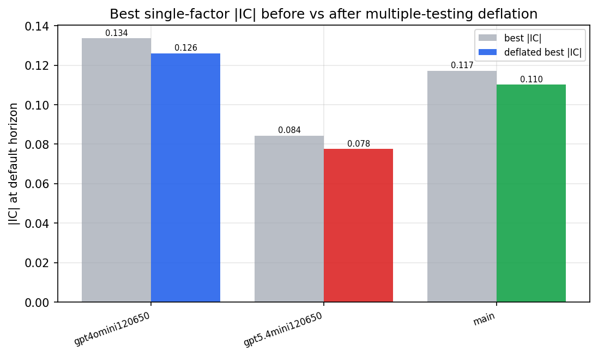

*Best |IC| before vs after multiple-testing deflation*

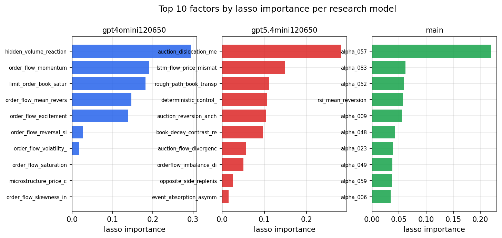

*Top factors by lasso importance per zoo*

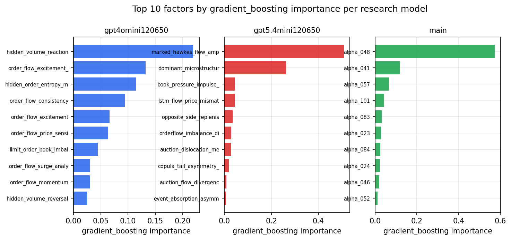

*Top factors by gradient_boosting importance per zoo*

## 4. ML-combined signal — per-underlying vectorised backtest

Each model combines a prerun's factors into ONE signal (fit `factors → forward return` on IS, predict per (bar, underlying)), then that combined signal is run through a simple vectorised backtest — `position(signal) × the underlying's own forward return` — on the held-out OOS tail (+ an equal-weight ensemble). No cross-sectional ranking.

> Config: position=**threshold** (t=1.0, z-score `expanding`), aggregation=**portfolio**, fit-standardise=**per_underlying**, horizon=6.

| prerun | model | n_factors_used | oos_ic | oos_sharpe | is_sharpe | oos_ann_return | oos_max_drawdown |
| --- | --- | --- | --- | --- | --- | --- | --- |
| gpt4omini120650 | linear_regression | 66 | 0.0497 | 2.8858 | 21.4628 | 0.3597 | -0.0415 |
| gpt4omini120650 | ridge | 66 | 0.0518 | 3.9755 | 22.2728 | 0.5097 | -0.039 |
| gpt4omini120650 | lasso | 66 | 0.0616 | 5.232 | 21.7555 | 0.785 | -0.0302 |
| gpt4omini120650 | elastic_net | 66 | 0.057 | 5.832 | 22.7319 | 0.8772 | -0.0307 |
| gpt4omini120650 | random_forest | 66 | 0.0614 | 9.1678 | 23.332 | 1.2326 | -0.0215 |
| gpt4omini120650 | gradient_boosting | 66 | 0.0647 | 0.9034 | 14.826 | 0.1191 | -0.0274 |
| gpt4omini120650 | xgboost | 66 | 0.0642 | 4.7934 | 24.0714 | 0.8044 | -0.0413 |
| gpt4omini120650 | lightgbm | 66 | 0.0691 | 3.3697 | 26.1852 | 0.5389 | -0.0358 |
| gpt4omini120650 | ensemble | 66 | 0.0619 | 5.4542 | 25.3346 | 0.9181 | -0.0394 |
| gpt5.4mini120650 | linear_regression | 68 | 0.0656 | 9.4206 | 21.386 | 0.7961 | -0.0149 |
| gpt5.4mini120650 | ridge | 68 | 0.0658 | 9.9428 | 21.3975 | 0.8593 | -0.0169 |
| gpt5.4mini120650 | lasso | 68 | 0.0654 | 11.9888 | 22.976 | 1.2758 | -0.0162 |
| gpt5.4mini120650 | elastic_net | 68 | 0.0655 | 11.7208 | 23.2711 | 1.3609 | -0.0162 |
| gpt5.4mini120650 | random_forest | 68 | 0.0657 | 14.884 | 30.7137 | 1.2218 | -0.014 |
| gpt5.4mini120650 | gradient_boosting | 68 | 0.0657 | 10.6596 | 26.9665 | 0.8783 | -0.0172 |
| gpt5.4mini120650 | xgboost | 68 | 0.0638 | 11.073 | 24.129 | 0.9617 | -0.0164 |
| gpt5.4mini120650 | lightgbm | 68 | 0.0565 | 10.2485 | 23.5764 | 0.6132 | -0.0089 |
| gpt5.4mini120650 | ensemble | 68 | 0.0677 | 11.7067 | 21.6062 | 1.1029 | -0.0175 |
| main | linear_regression | 78 | 0.0807 | 12.5307 | 29.6613 | 0.8637 | -0.0157 |
| main | ridge | 78 | 0.0799 | 22.2403 | 30.7837 | 1.7003 | -0.0108 |
| main | lasso | 78 | 0.0844 | 23.1285 | 31.1944 | 1.7162 | -0.009 |
| main | elastic_net | 78 | 0.0855 | 23.2449 | 31.4388 | 1.7556 | -0.0089 |
| main | random_forest | 78 | 0.0939 | 25.4323 | 32.1483 | 1.8357 | -0.0053 |
| main | gradient_boosting | 78 | 0.0984 | 22.8695 | 26.3136 | 1.5949 | -0.0081 |
| main | xgboost | 78 | 0.0996 | 22.9718 | 29.4608 | 1.7893 | -0.0105 |
| main | lightgbm | 78 | 0.0947 | 9.9472 | 28.3916 | 1.1891 | -0.0289 |
| main | ensemble | 78 | 0.0934 | 25.1407 | 28.4883 | 2.0125 | -0.0104 |

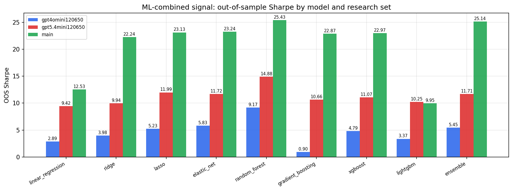

*ML-combined OOS Sharpe by model and research set*

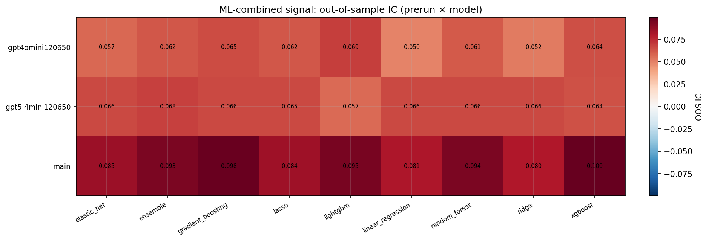

*ML-combined OOS IC (prerun × model)*

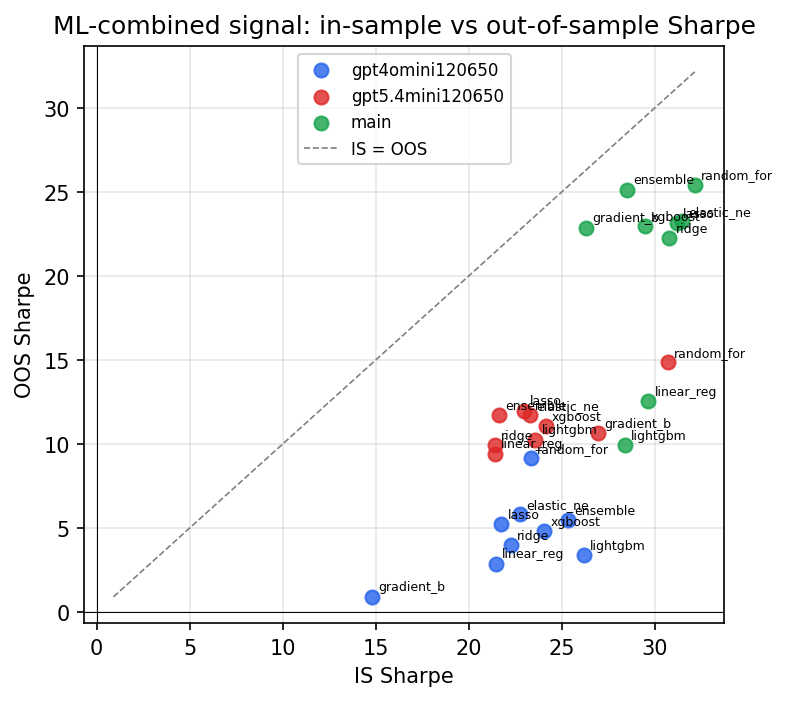

*IS vs OOS Sharpe (overfitting diagnostic)*

---
*Generated by `run_model_comparison.py`. Tables: `*.csv`; interactive: `comparison.ipynb`.*
