# Research-LLM factor comparison — `2024-12`

Comparing the **factor output of different research LLMs** on three axes (raw factor quality → factors as ML features → factors through the full agentic fund). The panel, IS/OOS split, horizon and model hyper-parameters are held identical across preruns — the *only* variable is the factor set.

## Preruns compared

| prerun | research_model | usable_factors | dropped_factors |
| --- | --- | --- | --- |
| gpt4omini120650 | gpt-4o-mini | 66 | 0 |
| gpt5.4mini120650 | gpt-5.4-mini | 68 | 1 |
| main | seed library | 78 | 10 |

> Dropped factors declare fields the current data doesn't have yet (e.g. fundamentals); they light up unchanged once that data is downloaded.

*Usable vs awaiting-data factors per research model*

## Key findings

- **Best ML-combined OOS Sharpe:** `main` with `ensemble` (OOS Sharpe = 25.292).
- **Mean OOS Sharpe across models, by research set:** `main` = 22.968, `gpt5.4mini120650` = 17.392, `gpt4omini120650` = 6.221.
- **Highest mean single-factor |IC| (h=6):** `main` (mean |IC| = 0.0551).
- **Most diverse zoo (highest effective/raw factor ratio):** `gpt5.4mini120650` (eff 55.1 of 68, ratio 0.81).
- **Best selection-deflated single-factor |IC|:** `gpt4omini120650` (deflated |IC| = 0.2161 from 63 factors tried).

## 1. Single-factor IC (raw factor quality)

Per-underlying time-series Spearman rank-IC of every researched factor, recomputed on the shared panel at horizons h=1, h=6, h=60. The per-underlying IC correlates each factor's value vector with the underlying's own forward-return vector (pooled across underlyings); the cross-sectional IC ranks across underlyings per timestamp.

| prerun | n_factors | mean_abs_ic_1 | mean_abs_ic_6 | mean_abs_ic_60 | mean_abs_icir_6 | best_factor_h6 | best_abs_ic_h6 |
| --- | --- | --- | --- | --- | --- | --- | --- |
| gpt4omini120650 | 66 | 0.0269 | 0.0276 | 0.0253 | 0.7137 | effective_spread_reversal_strength | 0.2236 |
| gpt5.4mini120650 | 68 | 0.0165 | 0.0193 | 0.0152 | 0.8042 | deterministic_control_gap | 0.1031 |
| main | 78 | 0.0416 | 0.0551 | 0.0437 | 1.1288 | alpha_058 | 0.1644 |

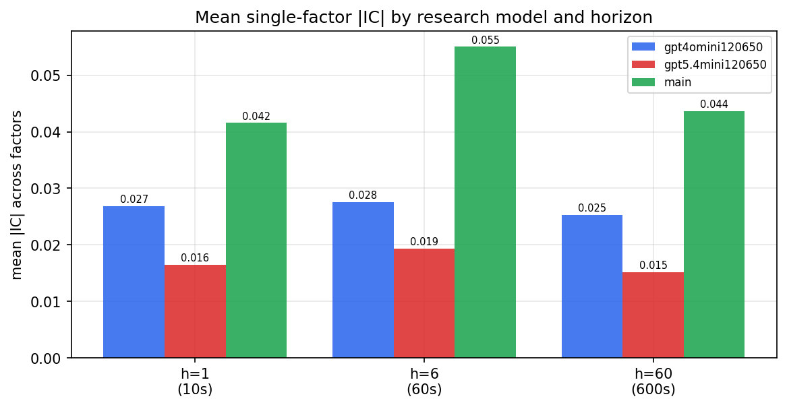

*Mean |IC| by research model and horizon*

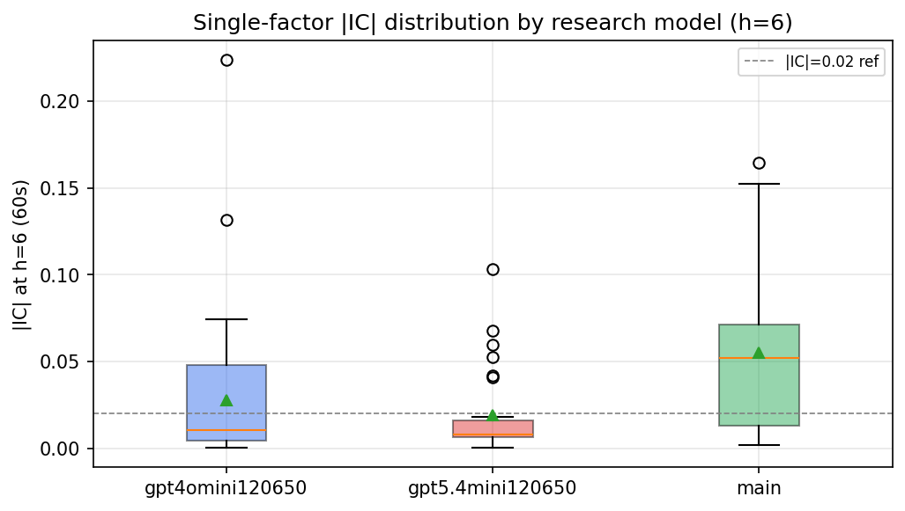

*Per-factor |IC| distribution by research model*

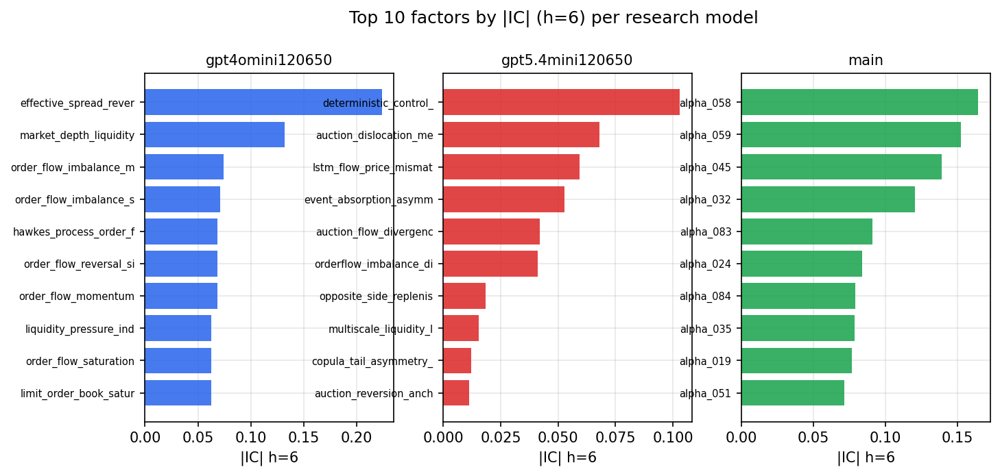

*Top factors by |IC| per research model*

## 2. Factor diversity & redundancy

Pairwise correlation of each zoo's *signals*. `eff_n_factors` is the effective number of independent factors (participation ratio of the correlation eigenvalues); `eff_ratio` and `redundancy` summarise how much unique information the zoo holds vs. how much is duplicated; `n_clusters` groups factors at |corr| ≥ 0.7.

| prerun | n_factors | eff_n_factors | eff_ratio | mean_abs_corr | n_clusters | redundancy |
| --- | --- | --- | --- | --- | --- | --- |
| gpt4omini120650 | 66 | 28.1392 | 0.4264 | 0.0619 | 28 | 0.5736 |
| gpt5.4mini120650 | 68 | 55.1099 | 0.8104 | 0.0089 | 63 | 0.1896 |
| main | 78 | 40.931 | 0.5248 | 0.0357 | 72 | 0.4752 |

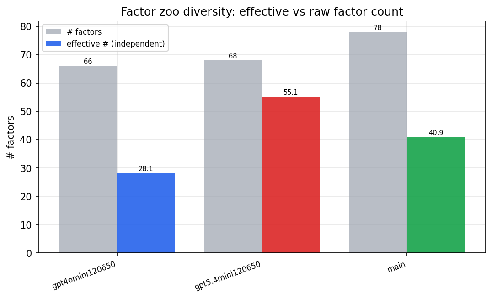

*Effective vs raw factor count per research model*

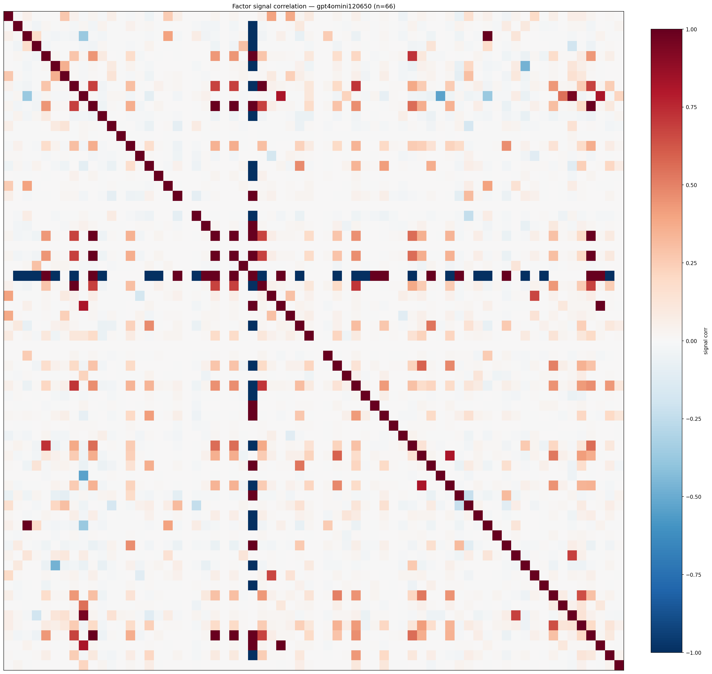

*Signal correlation matrix — gpt4omini120650*

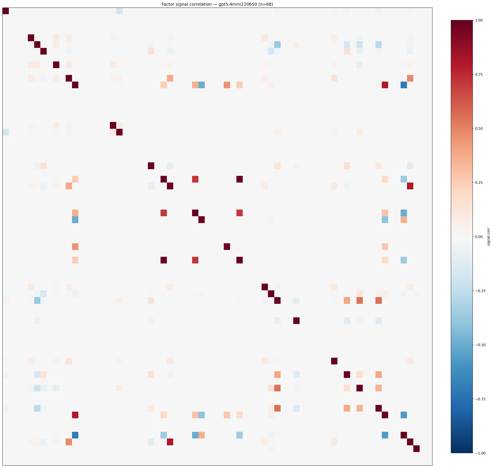

*Signal correlation matrix — gpt5.4mini120650*

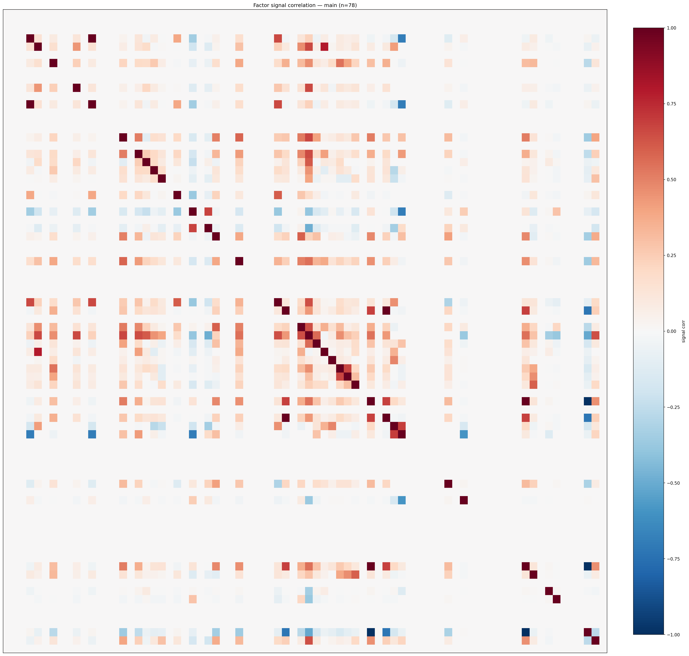

*Signal correlation matrix — main*

## 3. Deflation & model-based importance

`deflated_best_ic` haircuts each zoo's best |IC| for the number of factors tried (`ic_n_tested`) — a bigger zoo's best factor is more likely to be lucky. `lasso_n_nonzero` / `lasso_sparsity` show how many factors a sparse linear model actually keeps (model-view redundancy).

| prerun | best_ic | deflated_best_ic | deflated_best_t | ic_n_tested | ic_n_obs | lasso_n_nonzero | lasso_sparsity |
| --- | --- | --- | --- | --- | --- | --- | --- |
| gpt4omini120650 | 0.2236 | 0.2161 | 83.028 | 63 | 147599 | 8 | 0.8788 |
| gpt5.4mini120650 | 0.1031 | 0.0964 | 37.0223 | 28 | 147599 | 12 | 0.8235 |
| main | 0.1644 | 0.1574 | 60.4572 | 37 | 147599 | 7 | 0.9103 |

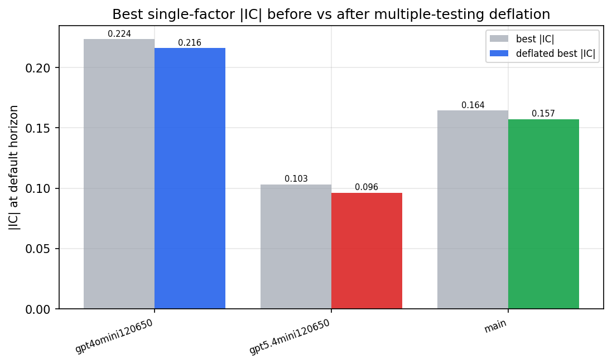

*Best |IC| before vs after multiple-testing deflation*

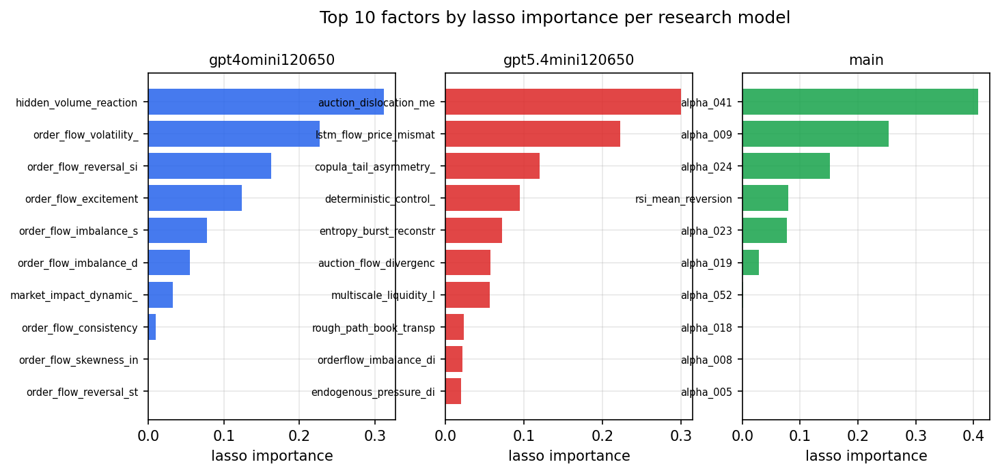

*Top factors by lasso importance per zoo*

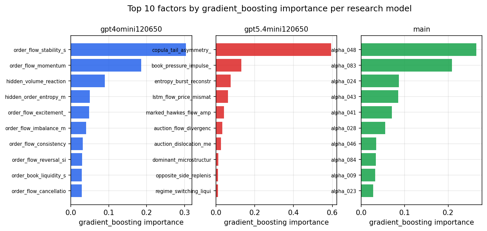

*Top factors by gradient_boosting importance per zoo*

## 4. ML-combined signal — per-underlying vectorised backtest

Each model combines a prerun's factors into ONE signal (fit `factors → forward return` on IS, predict per (bar, underlying)), then that combined signal is run through a simple vectorised backtest — `position(signal) × the underlying's own forward return` — on the held-out OOS tail (+ an equal-weight ensemble). No cross-sectional ranking.

> Config: position=**threshold** (t=1.0, z-score `expanding`), aggregation=**portfolio**, fit-standardise=**per_underlying**, horizon=6.

| prerun | model | n_factors_used | oos_ic | oos_sharpe | is_sharpe | oos_ann_return | oos_max_drawdown |
| --- | --- | --- | --- | --- | --- | --- | --- |
| gpt4omini120650 | linear_regression | 66 | 0.0582 | 6.4955 | 14.281 | 0.4144 | -0.0145 |
| gpt4omini120650 | ridge | 66 | 0.059 | 7.1323 | 14.3334 | 0.4654 | -0.0146 |
| gpt4omini120650 | lasso | 66 | 0.0658 | 10.7854 | 13.1016 | 0.8767 | -0.0144 |
| gpt4omini120650 | elastic_net | 66 | 0.0659 | 11.2567 | 13.1277 | 0.9244 | -0.0143 |
| gpt4omini120650 | random_forest | 66 | 0.0718 | 12.6536 | 17.4146 | 1.1044 | -0.018 |
| gpt4omini120650 | gradient_boosting | 66 | 0.0623 | -2.7805 | 11.1526 | -0.1707 | -0.0179 |
| gpt4omini120650 | xgboost | 66 | 0.0643 | -1.8427 | 15.1069 | -0.1172 | -0.0179 |
| gpt4omini120650 | lightgbm | 66 | 0.0753 | 3.036 | 16.5543 | 0.1503 | -0.0114 |
| gpt4omini120650 | ensemble | 66 | 0.0755 | 9.2558 | 18.723 | 0.7238 | -0.0141 |
| gpt5.4mini120650 | linear_regression | 68 | 0.0842 | 20.8389 | 16.9432 | 1.3588 | -0.0055 |
| gpt5.4mini120650 | ridge | 68 | 0.0846 | 21.0595 | 16.9949 | 1.3804 | -0.0057 |
| gpt5.4mini120650 | lasso | 68 | 0.0773 | 22.0271 | 15.6268 | 1.3336 | -0.0074 |
| gpt5.4mini120650 | elastic_net | 68 | 0.0775 | 22.1389 | 15.6177 | 1.3536 | -0.0074 |
| gpt5.4mini120650 | random_forest | 68 | 0.0961 | 19.2356 | 14.5138 | 0.9482 | -0.0026 |
| gpt5.4mini120650 | gradient_boosting | 68 | 0.0902 | 12.1754 | 10.8441 | 0.4176 | -0.0036 |
| gpt5.4mini120650 | xgboost | 68 | 0.0913 | 14.9753 | 13.1739 | 0.6265 | -0.0038 |
| gpt5.4mini120650 | lightgbm | 68 | 0.0925 | 2.751 | 15.6821 | 0.1585 | -0.0144 |
| gpt5.4mini120650 | ensemble | 68 | 0.0913 | 21.3265 | 16.7645 | 1.3367 | -0.0071 |
| main | linear_regression | 78 | 0.0944 | 23.2859 | 27.8663 | 1.524 | -0.0033 |
| main | ridge | 78 | 0.0941 | 22.9433 | 27.7414 | 1.5002 | -0.0033 |
| main | lasso | 78 | 0.1015 | 24.5842 | 29.0869 | 1.5887 | -0.003 |
| main | elastic_net | 78 | 0.1015 | 24.8152 | 28.8741 | 1.6293 | -0.003 |
| main | random_forest | 78 | 0.1093 | 25.1844 | 20.3093 | 1.6318 | -0.0039 |
| main | gradient_boosting | 78 | 0.1078 | 18.1947 | 13.1887 | 0.9386 | -0.0036 |
| main | xgboost | 78 | 0.1105 | 23.6824 | 18.0852 | 1.4591 | -0.0039 |
| main | lightgbm | 78 | 0.1044 | 18.7268 | 20.4105 | 1.3742 | -0.0033 |
| main | ensemble | 78 | 0.1078 | 25.2916 | 21.5059 | 1.7103 | -0.0033 |

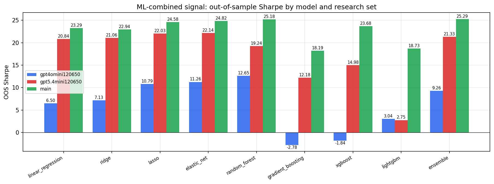

*ML-combined OOS Sharpe by model and research set*

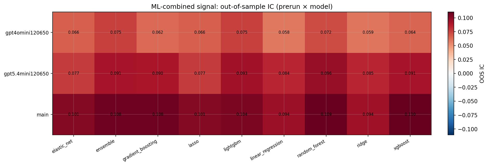

*ML-combined OOS IC (prerun × model)*

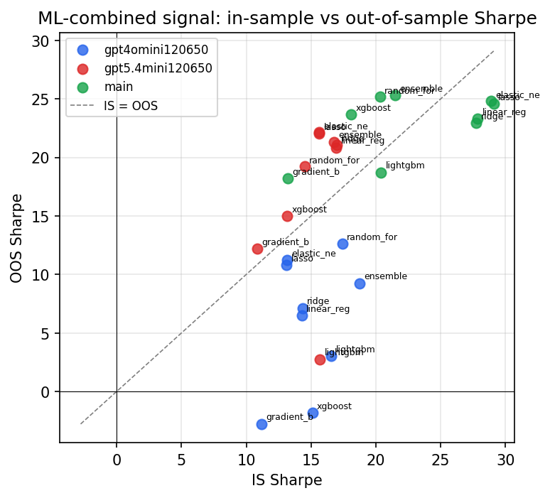

*IS vs OOS Sharpe (overfitting diagnostic)*

---
*Generated by `run_model_comparison.py`. Tables: `*.csv`; interactive: `comparison.ipynb`.*
