# Research-LLM factor comparison — `2025-01`

Comparing the **factor output of different research LLMs** on three axes (raw factor quality → factors as ML features → factors through the full agentic fund). The panel, IS/OOS split, horizon and model hyper-parameters are held identical across preruns — the *only* variable is the factor set.

## Preruns compared

| prerun | research_model | usable_factors | dropped_factors |
| --- | --- | --- | --- |
| gpt4omini120650 | gpt-4o-mini | 66 | 0 |
| gpt5.4mini120650 | gpt-5.4-mini | 68 | 1 |
| main | seed library | 77 | 11 |

> Dropped factors declare fields the current data doesn't have yet (e.g. fundamentals); they light up unchanged once that data is downloaded.

*Usable vs awaiting-data factors per research model*

## Key findings

- **Best ML-combined OOS Sharpe:** `main` with `elastic_net` (OOS Sharpe = 24.528).
- **Mean OOS Sharpe across models, by research set:** `main` = 19.168, `gpt5.4mini120650` = 4.707, `gpt4omini120650` = 2.584.
- **Highest mean single-factor |IC| (h=6):** `main` (mean |IC| = 0.0476).
- **Most diverse zoo (highest effective/raw factor ratio):** `gpt5.4mini120650` (eff 54.8 of 68, ratio 0.81).
- **Best selection-deflated single-factor |IC|:** `gpt4omini120650` (deflated |IC| = 0.1859 from 62 factors tried).

## 1. Single-factor IC (raw factor quality)

Per-underlying time-series Spearman rank-IC of every researched factor, recomputed on the shared panel at horizons h=1, h=6, h=60. The per-underlying IC correlates each factor's value vector with the underlying's own forward-return vector (pooled across underlyings); the cross-sectional IC ranks across underlyings per timestamp.

| prerun | n_factors | mean_abs_ic_1 | mean_abs_ic_6 | mean_abs_ic_60 | mean_abs_icir_6 | best_factor_h6 | best_abs_ic_h6 |
| --- | --- | --- | --- | --- | --- | --- | --- |
| gpt4omini120650 | 66 | 0.0201 | 0.0237 | 0.0201 | 0.6288 | market_depth_liquidity_risk | 0.1936 |
| gpt5.4mini120650 | 68 | 0.0163 | 0.0186 | 0.0147 | 0.6545 | deterministic_control_gap | 0.0983 |
| main | 77 | 0.0507 | 0.0476 | 0.0618 | 0.9994 | alpha_045 | 0.1172 |

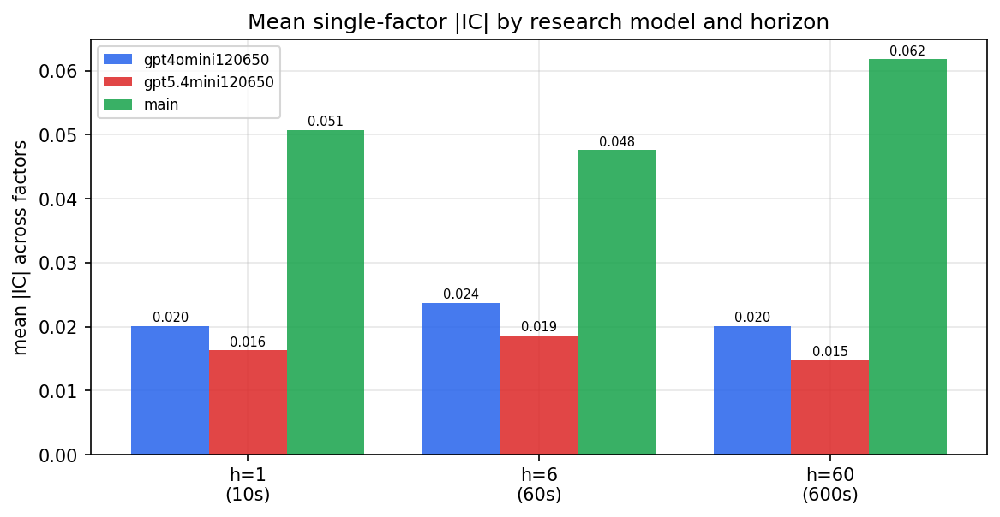

*Mean |IC| by research model and horizon*

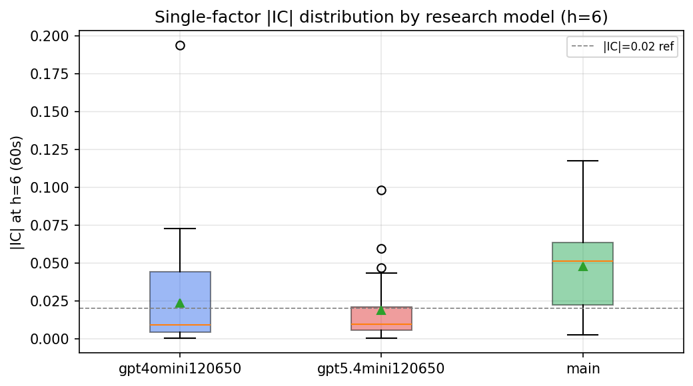

*Per-factor |IC| distribution by research model*

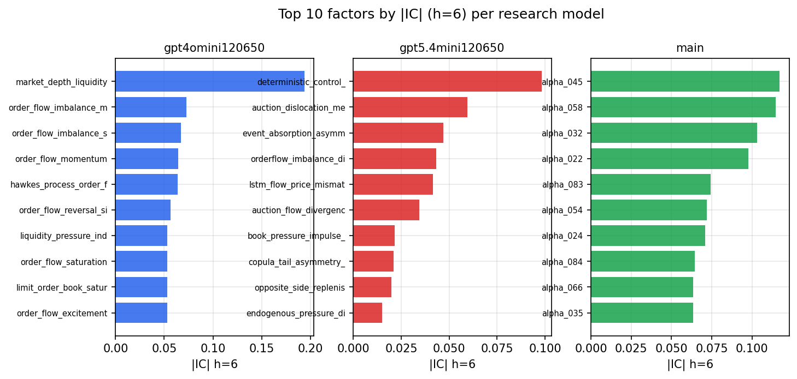

*Top factors by |IC| per research model*

## 2. Factor diversity & redundancy

Pairwise correlation of each zoo's *signals*. `eff_n_factors` is the effective number of independent factors (participation ratio of the correlation eigenvalues); `eff_ratio` and `redundancy` summarise how much unique information the zoo holds vs. how much is duplicated; `n_clusters` groups factors at |corr| ≥ 0.7.

| prerun | n_factors | eff_n_factors | eff_ratio | mean_abs_corr | n_clusters | redundancy |
| --- | --- | --- | --- | --- | --- | --- |
| gpt4omini120650 | 66 | 33.0422 | 0.5006 | 0.0458 | 56 | 0.4994 |
| gpt5.4mini120650 | 68 | 54.771 | 0.8055 | 0.0089 | 63 | 0.1945 |
| main | 77 | 41.903 | 0.5442 | 0.0322 | 68 | 0.4558 |

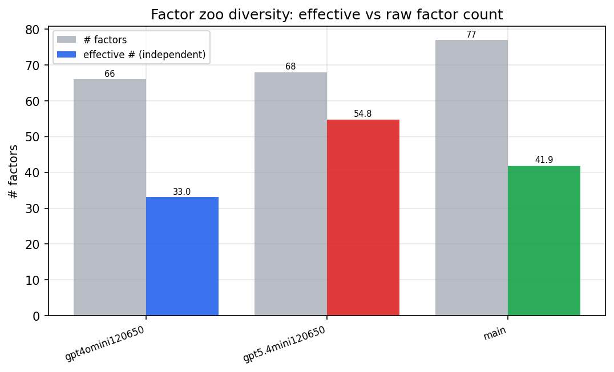

*Effective vs raw factor count per research model*

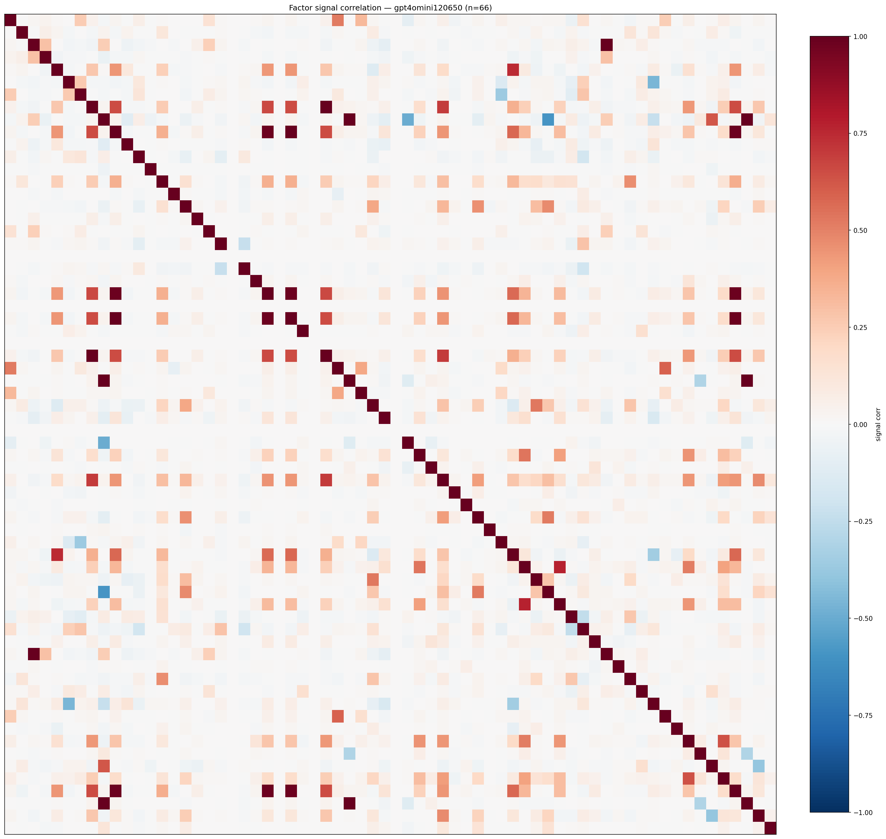

*Signal correlation matrix — gpt4omini120650*

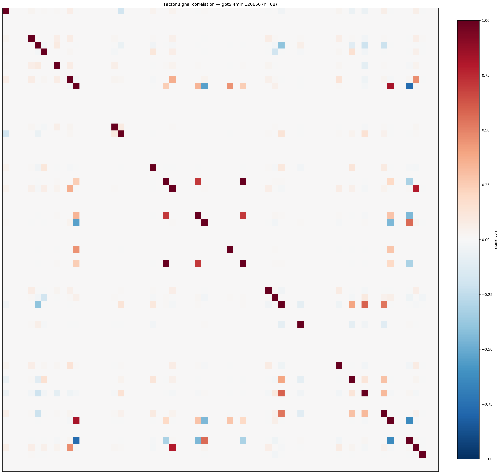

*Signal correlation matrix — gpt5.4mini120650*

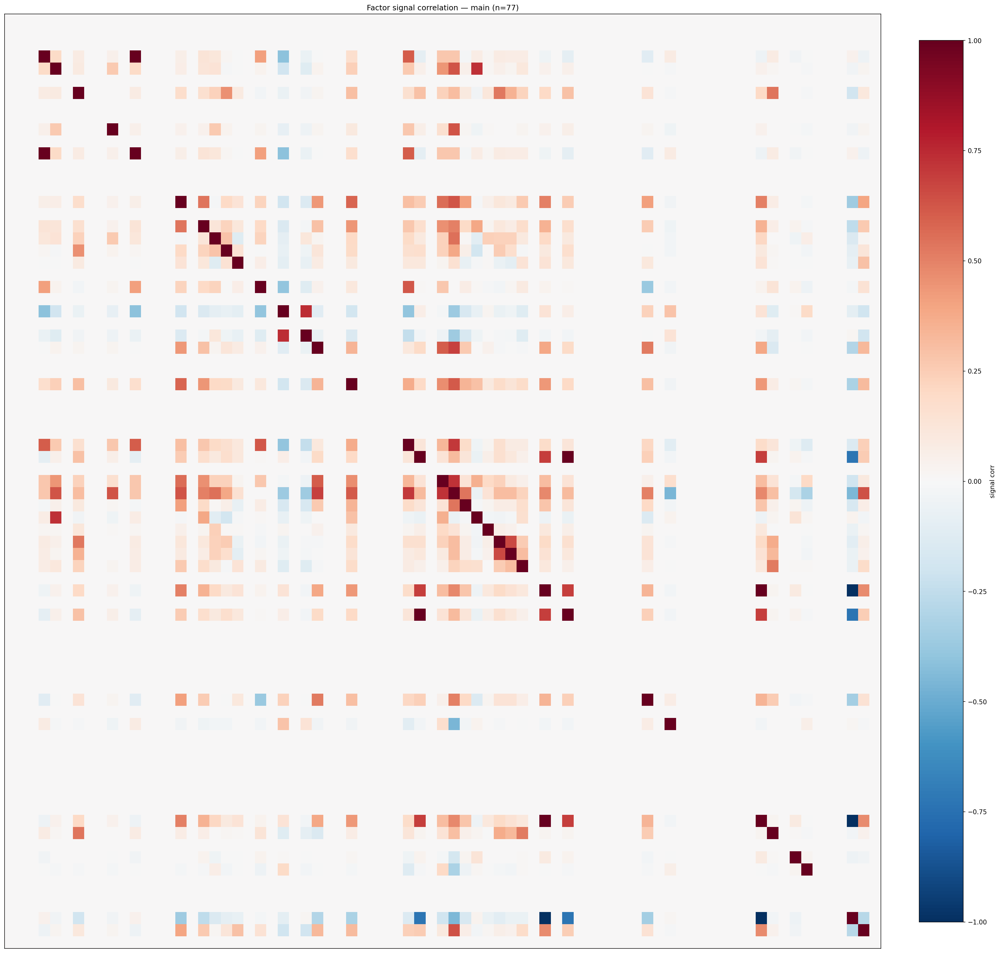

*Signal correlation matrix — main*

## 3. Deflation & model-based importance

`deflated_best_ic` haircuts each zoo's best |IC| for the number of factors tried (`ic_n_tested`) — a bigger zoo's best factor is more likely to be lucky. `lasso_n_nonzero` / `lasso_sparsity` show how many factors a sparse linear model actually keeps (model-view redundancy).

| prerun | best_ic | deflated_best_ic | deflated_best_t | ic_n_tested | ic_n_obs | lasso_n_nonzero | lasso_sparsity |
| --- | --- | --- | --- | --- | --- | --- | --- |
| gpt4omini120650 | 0.1936 | 0.1859 | 69.7016 | 62 | 140579 | 0 | 1.0 |
| gpt5.4mini120650 | 0.0983 | 0.0915 | 34.2933 | 28 | 140579 | 8 | 0.8824 |
| main | 0.1172 | 0.1101 | 41.2806 | 36 | 140579 | 16 | 0.7922 |

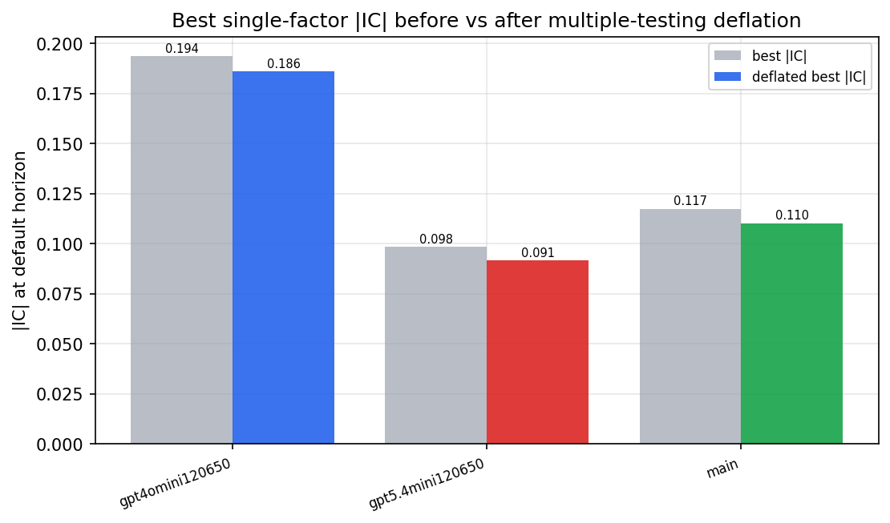

*Best |IC| before vs after multiple-testing deflation*

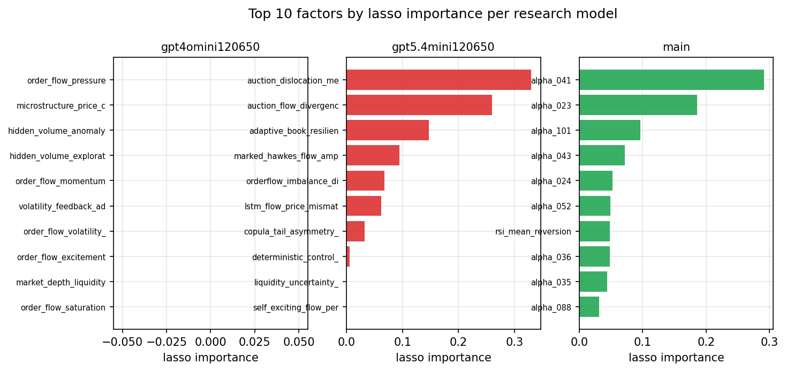

*Top factors by lasso importance per zoo*

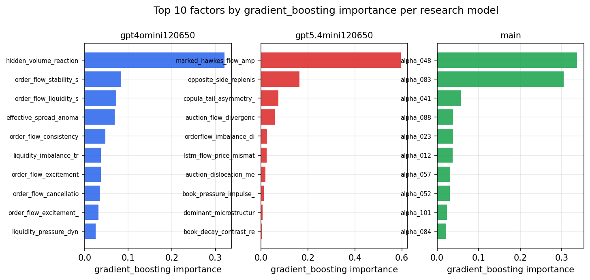

*Top factors by gradient_boosting importance per zoo*

## 4. ML-combined signal — per-underlying vectorised backtest

Each model combines a prerun's factors into ONE signal (fit `factors → forward return` on IS, predict per (bar, underlying)), then that combined signal is run through a simple vectorised backtest — `position(signal) × the underlying's own forward return` — on the held-out OOS tail (+ an equal-weight ensemble). No cross-sectional ranking.

> Config: position=**threshold** (t=1.0, z-score `expanding`), aggregation=**portfolio**, fit-standardise=**per_underlying**, horizon=6.

| prerun | model | n_factors_used | oos_ic | oos_sharpe | is_sharpe | oos_ann_return | oos_max_drawdown |
| --- | --- | --- | --- | --- | --- | --- | --- |
| gpt4omini120650 | linear_regression | 66 | 0.0363 | 2.5453 | 12.1613 | 0.0393 | -0.0026 |
| gpt4omini120650 | ridge | 66 | 0.0374 | 2.6113 | 11.6726 | 0.0393 | -0.0018 |
| gpt4omini120650 | lasso | 66 | 0.0321 | 5.7837 | 10.9174 | 0.5174 | -0.0122 |
| gpt4omini120650 | elastic_net | 66 | 0.0308 | 4.1927 | 11.2158 | 0.3911 | -0.014 |
| gpt4omini120650 | random_forest | 66 | 0.0542 | 5.2457 | 13.635 | 0.5335 | -0.0139 |
| gpt4omini120650 | gradient_boosting | 66 | 0.0441 | 0.0064 | 4.9861 | 0.0001 | -0.0047 |
| gpt4omini120650 | xgboost | 66 | 0.0486 | -3.9955 | 6.32 | -0.1984 | -0.0232 |
| gpt4omini120650 | lightgbm | 66 | 0.0432 | 0.3737 | 9.3835 | 0.027 | -0.0153 |
| gpt4omini120650 | ensemble | 66 | 0.0485 | 6.4887 | 11.0844 | 0.5803 | -0.0134 |
| gpt5.4mini120650 | linear_regression | 68 | 0.0508 | 5.6499 | 14.2643 | 0.6618 | -0.0253 |
| gpt5.4mini120650 | ridge | 68 | 0.0502 | 4.9747 | 14.6223 | 0.6181 | -0.0285 |
| gpt5.4mini120650 | lasso | 68 | 0.0406 | 3.3432 | 11.4548 | 0.3418 | -0.0134 |
| gpt5.4mini120650 | elastic_net | 68 | 0.0399 | 3.3829 | 10.8426 | 0.3381 | -0.0134 |
| gpt5.4mini120650 | random_forest | 68 | 0.0494 | 6.5284 | 12.158 | 0.3689 | -0.0052 |
| gpt5.4mini120650 | gradient_boosting | 68 | 0.0521 | 3.0198 | 6.4349 | 0.1129 | -0.0047 |
| gpt5.4mini120650 | xgboost | 68 | 0.0578 | 8.1253 | 8.4165 | 0.3182 | -0.0045 |
| gpt5.4mini120650 | lightgbm | 68 | 0.0574 | 1.164 | 10.3808 | 0.0552 | -0.0107 |
| gpt5.4mini120650 | ensemble | 68 | 0.0548 | 6.1787 | 14.1238 | 0.5384 | -0.0103 |
| main | linear_regression | 77 | 0.0757 | 24.0685 | 16.119 | 2.1657 | -0.0105 |
| main | ridge | 77 | 0.0747 | 23.069 | 15.6234 | 2.0852 | -0.0105 |
| main | lasso | 77 | 0.0779 | 24.4871 | 16.9677 | 2.1539 | -0.0105 |
| main | elastic_net | 77 | 0.0785 | 24.5279 | 17.0423 | 2.163 | -0.0104 |
| main | random_forest | 77 | 0.0615 | 14.4554 | 15.0761 | 1.6841 | -0.0143 |
| main | gradient_boosting | 77 | 0.0647 | 12.6174 | 9.1496 | 0.7664 | -0.0082 |
| main | xgboost | 77 | 0.0697 | 14.6499 | 11.6054 | 1.0954 | -0.0086 |
| main | lightgbm | 77 | 0.0601 | 12.5956 | 13.118 | 0.8252 | -0.01 |
| main | ensemble | 77 | 0.0733 | 22.0376 | 14.9052 | 2.2423 | -0.0116 |

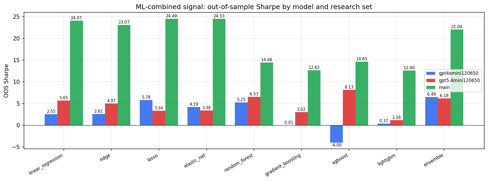

*ML-combined OOS Sharpe by model and research set*

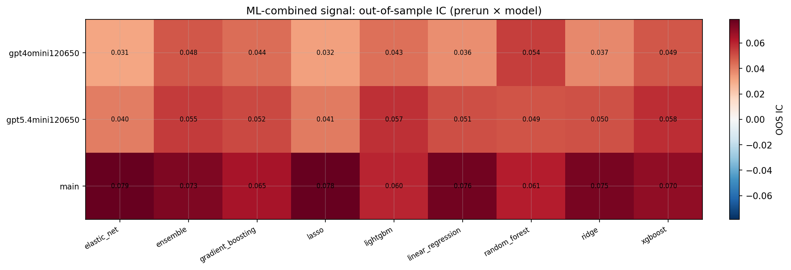

*ML-combined OOS IC (prerun × model)*

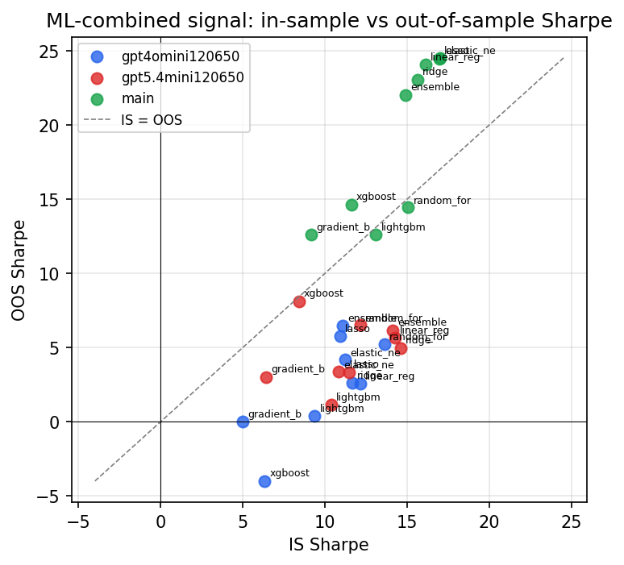

*IS vs OOS Sharpe (overfitting diagnostic)*

---
*Generated by `run_model_comparison.py`. Tables: `*.csv`; interactive: `comparison.ipynb`.*
