# Research-LLM factor comparison — `2025-02`

Comparing the **factor output of different research LLMs** on three axes (raw factor quality → factors as ML features → factors through the full agentic fund). The panel, IS/OOS split, horizon and model hyper-parameters are held identical across preruns — the *only* variable is the factor set.

## Preruns compared

| prerun | research_model | usable_factors | dropped_factors |
| --- | --- | --- | --- |
| gpt4omini120650 | gpt-4o-mini | 66 | 0 |
| gpt5.4mini120650 | gpt-5.4-mini | 68 | 1 |
| main | seed library | 77 | 11 |

> Dropped factors declare fields the current data doesn't have yet (e.g. fundamentals); they light up unchanged once that data is downloaded.

*Usable vs awaiting-data factors per research model*

## Key findings

- **Best ML-combined OOS Sharpe:** `main` with `ridge` (OOS Sharpe = 34.532).
- **Mean OOS Sharpe across models, by research set:** `main` = 26.767, `gpt5.4mini120650` = 17.400, `gpt4omini120650` = 5.243.
- **Highest mean single-factor |IC| (h=6):** `main` (mean |IC| = 0.0451).
- **Most diverse zoo (highest effective/raw factor ratio):** `gpt5.4mini120650` (eff 53.7 of 68, ratio 0.79).
- **Best selection-deflated single-factor |IC|:** `gpt4omini120650` (deflated |IC| = 0.9351 from 64 factors tried).

## 1. Single-factor IC (raw factor quality)

Per-underlying time-series Spearman rank-IC of every researched factor, recomputed on the shared panel at horizons h=1, h=6, h=60. The per-underlying IC correlates each factor's value vector with the underlying's own forward-return vector (pooled across underlyings); the cross-sectional IC ranks across underlyings per timestamp.

| prerun | n_factors | mean_abs_ic_1 | mean_abs_ic_6 | mean_abs_ic_60 | mean_abs_icir_6 | best_factor_h6 | best_abs_ic_h6 |
| --- | --- | --- | --- | --- | --- | --- | --- |
| gpt4omini120650 | 66 | 0.0225 | 0.0379 | 0.0341 | 0.747 | effective_spread_reversal_strength | 0.9428 |
| gpt5.4mini120650 | 68 | 0.0163 | 0.0187 | 0.0147 | 0.7125 | deterministic_control_gap | 0.1052 |
| main | 77 | 0.0502 | 0.0451 | 0.0488 | 1.1601 | alpha_032 | 0.1066 |

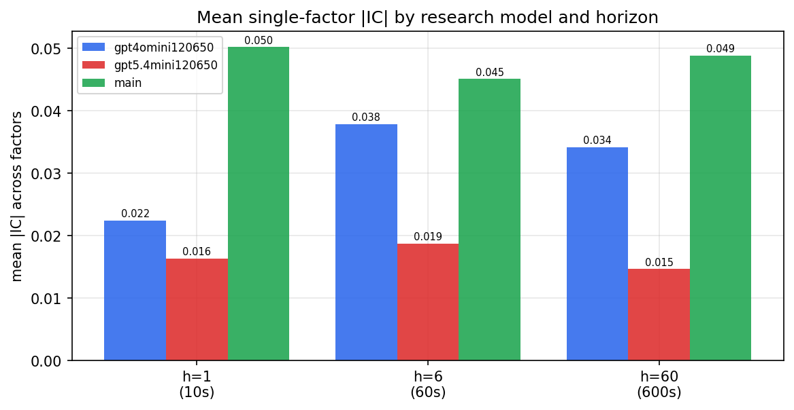

*Mean |IC| by research model and horizon*

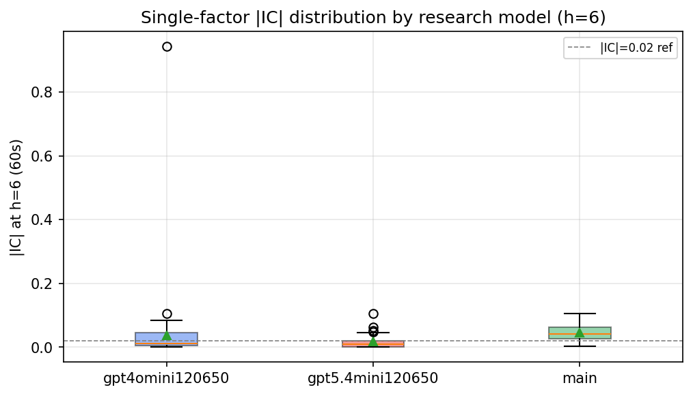

*Per-factor |IC| distribution by research model*

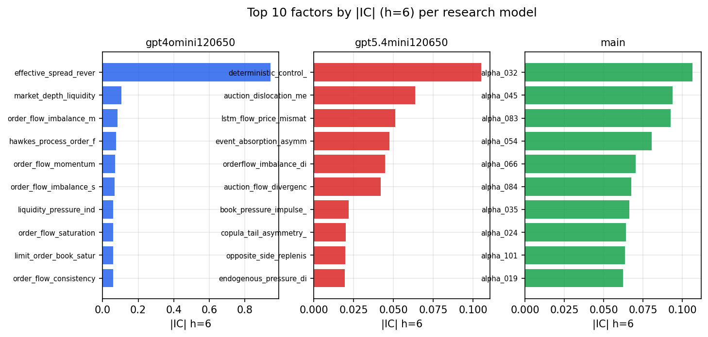

*Top factors by |IC| per research model*

## 2. Factor diversity & redundancy

Pairwise correlation of each zoo's *signals*. `eff_n_factors` is the effective number of independent factors (participation ratio of the correlation eigenvalues); `eff_ratio` and `redundancy` summarise how much unique information the zoo holds vs. how much is duplicated; `n_clusters` groups factors at |corr| ≥ 0.7.

| prerun | n_factors | eff_n_factors | eff_ratio | mean_abs_corr | n_clusters | redundancy |
| --- | --- | --- | --- | --- | --- | --- |
| gpt4omini120650 | 66 | 34.2554 | 0.519 | 0.0438 | 54 | 0.481 |
| gpt5.4mini120650 | 68 | 53.7444 | 0.7904 | 0.0094 | 63 | 0.2096 |
| main | 77 | 39.8272 | 0.5172 | 0.0372 | 66 | 0.4828 |

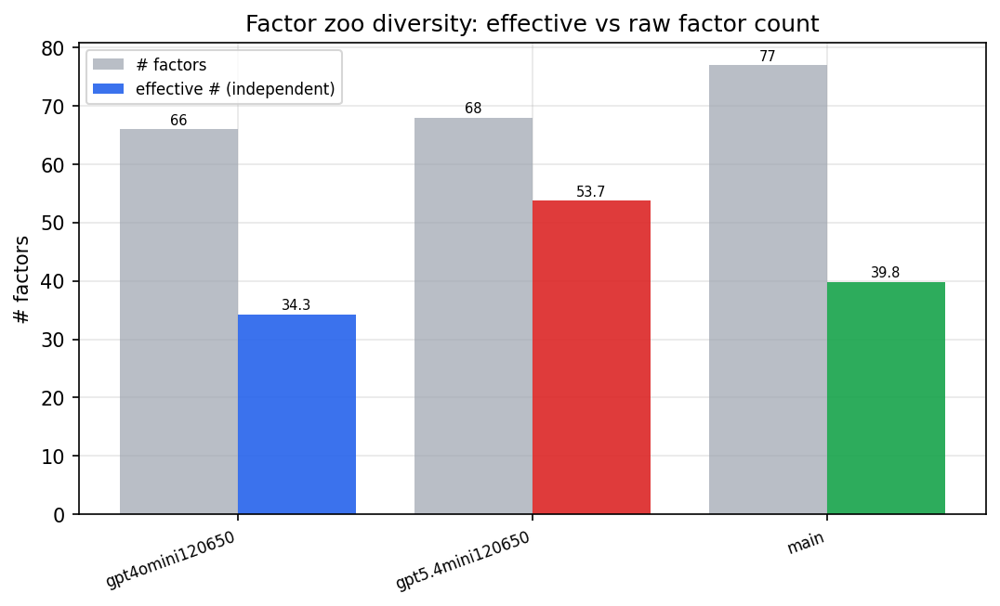

*Effective vs raw factor count per research model*

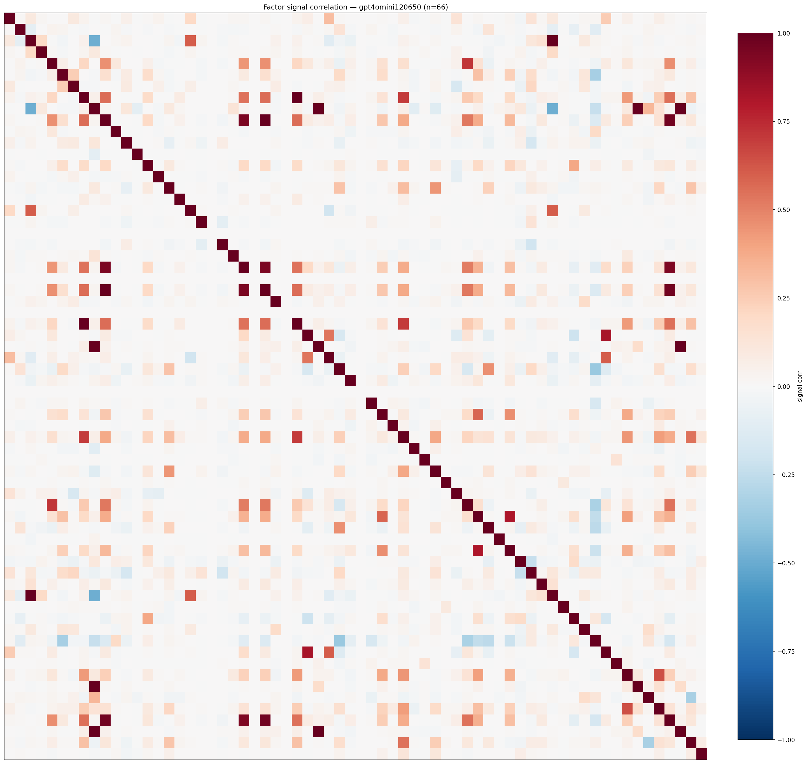

*Signal correlation matrix — gpt4omini120650*

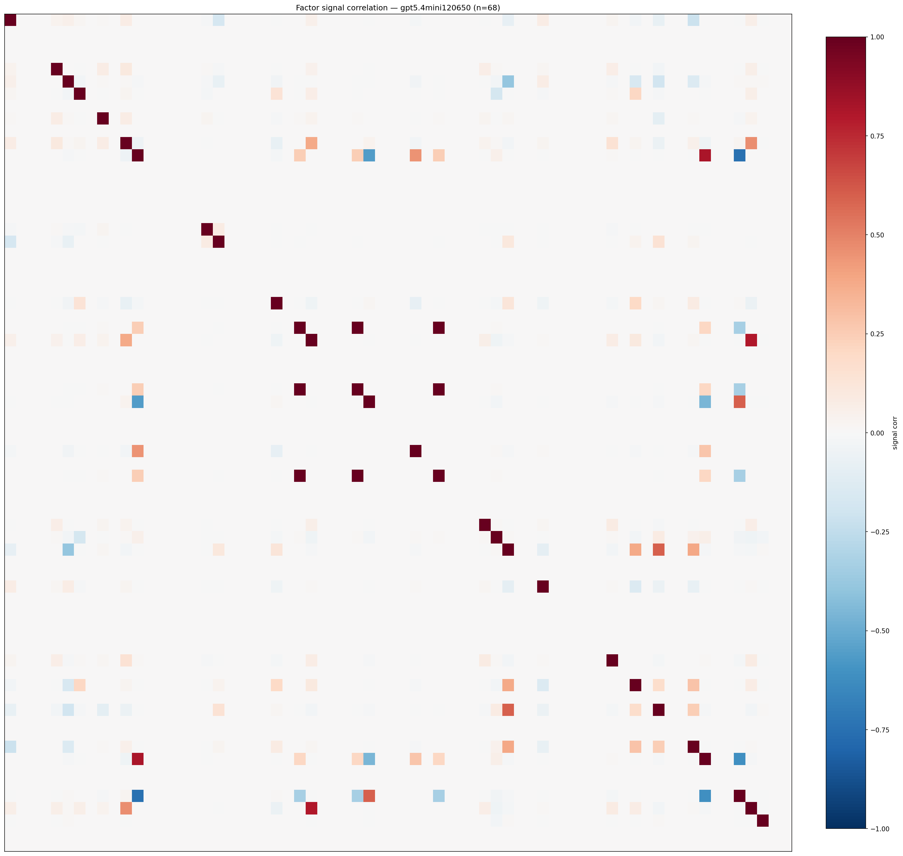

*Signal correlation matrix — gpt5.4mini120650*

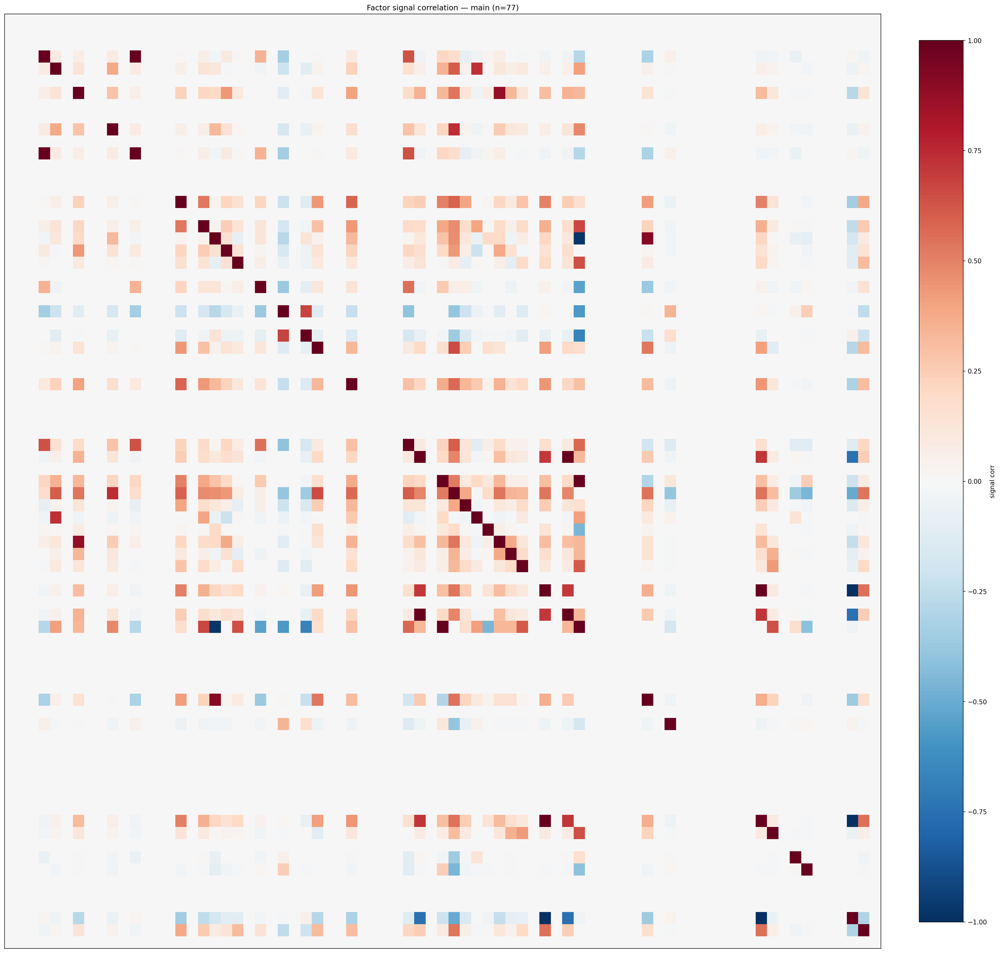

*Signal correlation matrix — main*

## 3. Deflation & model-based importance

`deflated_best_ic` haircuts each zoo's best |IC| for the number of factors tried (`ic_n_tested`) — a bigger zoo's best factor is more likely to be lucky. `lasso_n_nonzero` / `lasso_sparsity` show how many factors a sparse linear model actually keeps (model-view redundancy).

| prerun | best_ic | deflated_best_ic | deflated_best_t | ic_n_tested | ic_n_obs | lasso_n_nonzero | lasso_sparsity |
| --- | --- | --- | --- | --- | --- | --- | --- |
| gpt4omini120650 | 0.9428 | 0.9351 | 349.0238 | 64 | 139319 | 3 | 0.9545 |
| gpt5.4mini120650 | 0.1052 | 0.0983 | 36.6849 | 29 | 139319 | 11 | 0.8382 |
| main | 0.1066 | 0.0994 | 37.0956 | 36 | 139319 | 15 | 0.8052 |

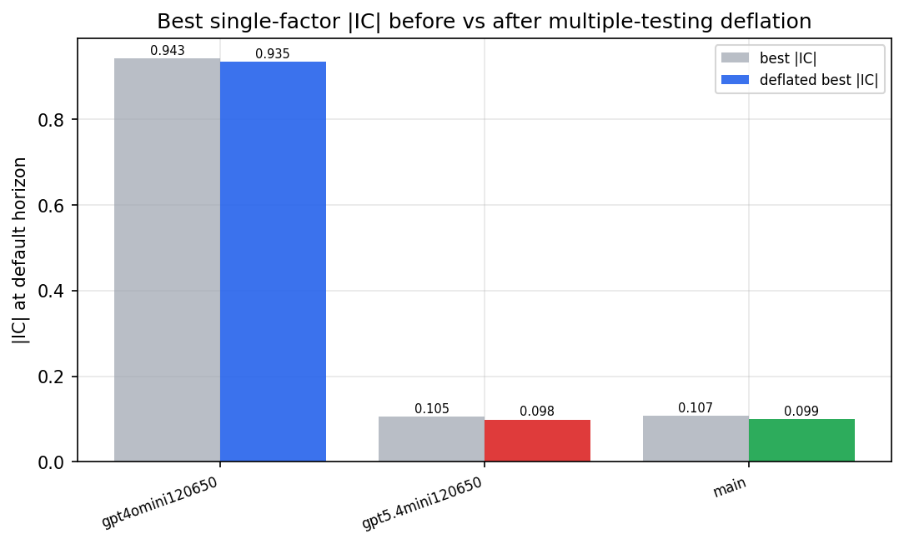

*Best |IC| before vs after multiple-testing deflation*

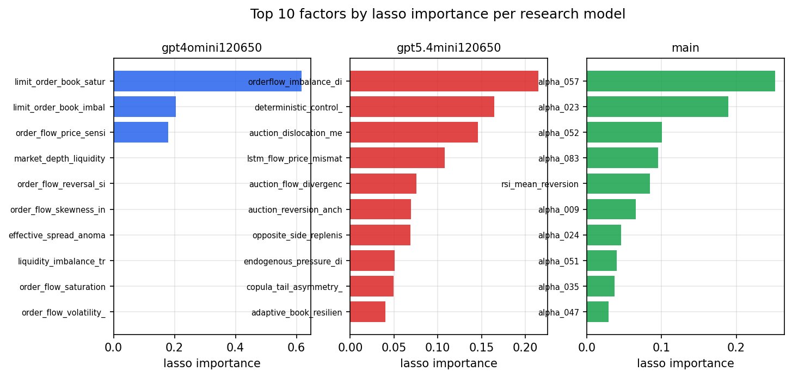

*Top factors by lasso importance per zoo*

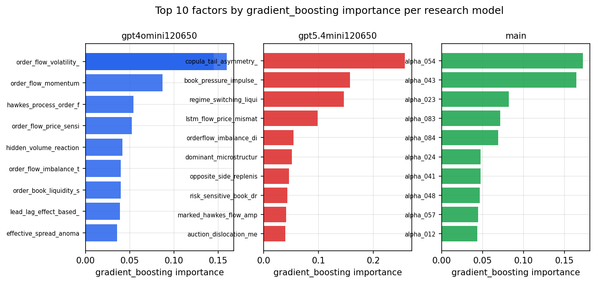

*Top factors by gradient_boosting importance per zoo*

## 4. ML-combined signal — per-underlying vectorised backtest

Each model combines a prerun's factors into ONE signal (fit `factors → forward return` on IS, predict per (bar, underlying)), then that combined signal is run through a simple vectorised backtest — `position(signal) × the underlying's own forward return` — on the held-out OOS tail (+ an equal-weight ensemble). No cross-sectional ranking.

> Config: position=**threshold** (t=1.0, z-score `expanding`), aggregation=**portfolio**, fit-standardise=**per_underlying**, horizon=6.

| prerun | model | n_factors_used | oos_ic | oos_sharpe | is_sharpe | oos_ann_return | oos_max_drawdown |
| --- | --- | --- | --- | --- | --- | --- | --- |
| gpt4omini120650 | linear_regression | 66 | 0.0545 | 5.3022 | 12.2882 | 0.6793 | -0.0248 |
| gpt4omini120650 | ridge | 66 | 0.0581 | 7.0591 | 12.2116 | 0.7702 | -0.0165 |
| gpt4omini120650 | lasso | 66 | nan | nan | nan | nan | nan |
| gpt4omini120650 | elastic_net | 66 | nan | nan | nan | nan | nan |
| gpt4omini120650 | random_forest | 66 | 0.0661 | 5.5182 | 14.2964 | 0.7035 | -0.0256 |
| gpt4omini120650 | gradient_boosting | 66 | 0.0482 | 0.4405 | 9.1366 | 0.0383 | -0.0239 |
| gpt4omini120650 | xgboost | 66 | 0.0539 | 5.6189 | 13.5535 | 0.4743 | -0.0201 |
| gpt4omini120650 | lightgbm | 66 | 0.0559 | 6.3772 | 16.9324 | 0.5624 | -0.0165 |
| gpt4omini120650 | ensemble | 66 | 0.0638 | 6.3864 | 16.2942 | 0.7773 | -0.0262 |
| gpt5.4mini120650 | linear_regression | 68 | 0.0845 | 16.916 | 16.2625 | 1.7823 | -0.0122 |
| gpt5.4mini120650 | ridge | 68 | 0.0851 | 15.9126 | 17.0464 | 1.7821 | -0.0164 |
| gpt5.4mini120650 | lasso | 68 | 0.0877 | 18.2864 | 14.5087 | 1.5102 | -0.0063 |
| gpt5.4mini120650 | elastic_net | 68 | 0.0886 | 17.6146 | 15.0106 | 1.5239 | -0.0098 |
| gpt5.4mini120650 | random_forest | 68 | 0.0876 | 22.1987 | 21.2094 | 2.1003 | -0.0086 |
| gpt5.4mini120650 | gradient_boosting | 68 | 0.0862 | 13.8132 | 15.3066 | 0.5858 | -0.0043 |
| gpt5.4mini120650 | xgboost | 68 | 0.0794 | 13.3098 | 19.2247 | 1.1013 | -0.0115 |
| gpt5.4mini120650 | lightgbm | 68 | 0.0751 | 16.3268 | 18.683 | 1.0328 | -0.005 |
| gpt5.4mini120650 | ensemble | 68 | 0.0968 | 22.2259 | 20.2294 | 1.982 | -0.0065 |
| main | linear_regression | 77 | 0.0825 | 34.2344 | 26.8742 | 3.4275 | -0.0072 |
| main | ridge | 77 | 0.0842 | 34.5318 | 28.6027 | 3.7041 | -0.0091 |
| main | lasso | 77 | 0.0886 | 33.8031 | 26.1029 | 3.5935 | -0.0092 |
| main | elastic_net | 77 | 0.0893 | 34.1521 | 26.0557 | 3.6244 | -0.0092 |
| main | random_forest | 77 | 0.0844 | 25.5238 | 24.6965 | 3.03 | -0.009 |
| main | gradient_boosting | 77 | 0.0867 | 11.0238 | 18.8521 | 1.3416 | -0.0214 |
| main | xgboost | 77 | 0.0846 | 22.8136 | 22.8672 | 2.1766 | -0.0098 |
| main | lightgbm | 77 | 0.0776 | 16.1875 | 24.1029 | 1.7601 | -0.0152 |
| main | ensemble | 77 | 0.089 | 28.6306 | 26.4947 | 3.4931 | -0.012 |

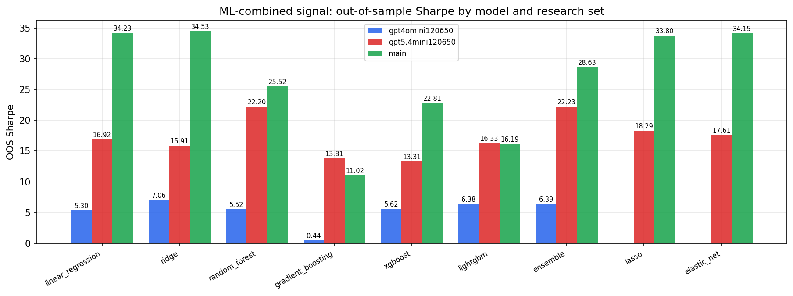

*ML-combined OOS Sharpe by model and research set*

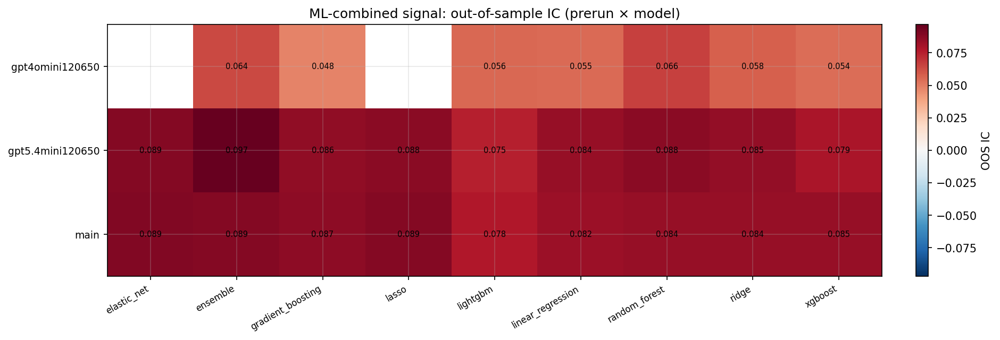

*ML-combined OOS IC (prerun × model)*

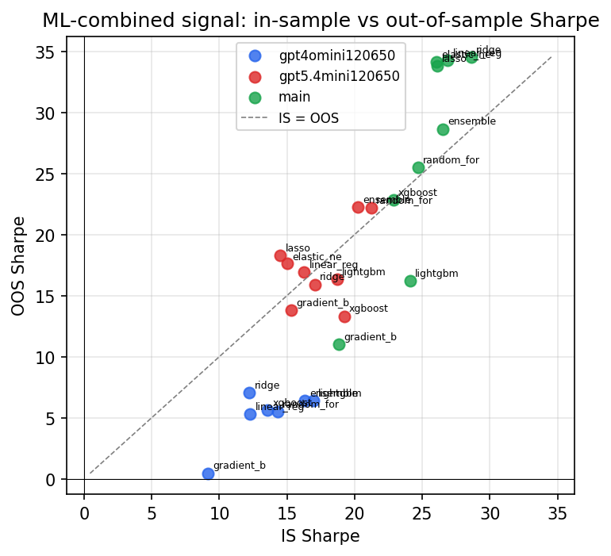

*IS vs OOS Sharpe (overfitting diagnostic)*

---
*Generated by `run_model_comparison.py`. Tables: `*.csv`; interactive: `comparison.ipynb`.*
