# Research-LLM factor comparison — `2025-03`

Comparing the **factor output of different research LLMs** on three axes (raw factor quality → factors as ML features → factors through the full agentic fund). The panel, IS/OOS split, horizon and model hyper-parameters are held identical across preruns — the *only* variable is the factor set.

## Preruns compared

| prerun | research_model | usable_factors | dropped_factors |
| --- | --- | --- | --- |
| gpt4omini120650 | gpt-4o-mini | 66 | 0 |
| gpt5.4mini120650 | gpt-5.4-mini | 68 | 1 |
| main | seed library | 78 | 10 |

> Dropped factors declare fields the current data doesn't have yet (e.g. fundamentals); they light up unchanged once that data is downloaded.

*Usable vs awaiting-data factors per research model*

## Key findings

- **Best ML-combined OOS Sharpe:** `main` with `lasso` (OOS Sharpe = 36.068).
- **Mean OOS Sharpe across models, by research set:** `main` = 29.866, `gpt5.4mini120650` = 17.413, `gpt4omini120650` = 8.507.
- **Highest mean single-factor |IC| (h=6):** `main` (mean |IC| = 0.0430).
- **Most diverse zoo (highest effective/raw factor ratio):** `gpt5.4mini120650` (eff 55.1 of 68, ratio 0.81).
- **Best selection-deflated single-factor |IC|:** `gpt4omini120650` (deflated |IC| = 0.5545 from 64 factors tried).

## 1. Single-factor IC (raw factor quality)

Per-underlying time-series Spearman rank-IC of every researched factor, recomputed on the shared panel at horizons h=1, h=6, h=60. The per-underlying IC correlates each factor's value vector with the underlying's own forward-return vector (pooled across underlyings); the cross-sectional IC ranks across underlyings per timestamp.

| prerun | n_factors | mean_abs_ic_1 | mean_abs_ic_6 | mean_abs_ic_60 | mean_abs_icir_6 | best_factor_h6 | best_abs_ic_h6 |
| --- | --- | --- | --- | --- | --- | --- | --- |
| gpt4omini120650 | 66 | 0.0292 | 0.0323 | 0.0244 | 0.6485 | effective_spread_reversal_strength | 0.5622 |
| gpt5.4mini120650 | 68 | 0.0142 | 0.0148 | 0.0151 | 0.6354 | deterministic_control_gap | 0.0979 |
| main | 78 | 0.0365 | 0.043 | 0.0393 | 0.9851 | alpha_032 | 0.1022 |

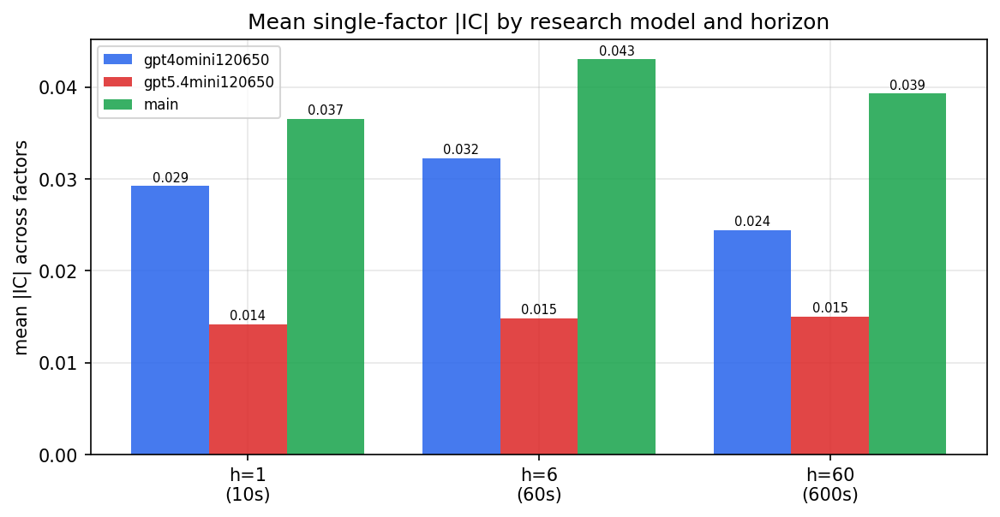

*Mean |IC| by research model and horizon*

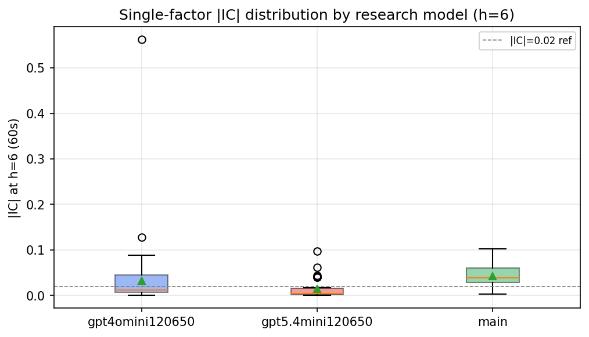

*Per-factor |IC| distribution by research model*

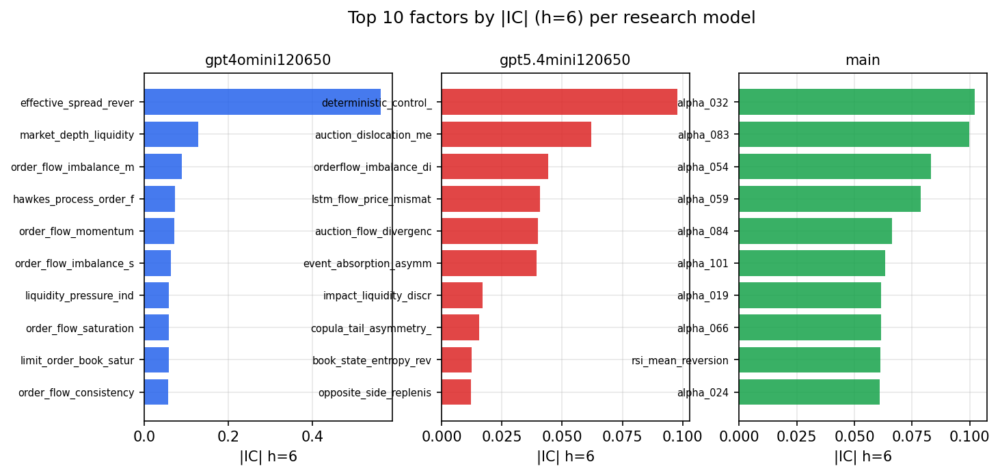

*Top factors by |IC| per research model*

## 2. Factor diversity & redundancy

Pairwise correlation of each zoo's *signals*. `eff_n_factors` is the effective number of independent factors (participation ratio of the correlation eigenvalues); `eff_ratio` and `redundancy` summarise how much unique information the zoo holds vs. how much is duplicated; `n_clusters` groups factors at |corr| ≥ 0.7.

| prerun | n_factors | eff_n_factors | eff_ratio | mean_abs_corr | n_clusters | redundancy |
| --- | --- | --- | --- | --- | --- | --- |
| gpt4omini120650 | 66 | 30.3973 | 0.4606 | 0.0576 | 48 | 0.5394 |
| gpt5.4mini120650 | 68 | 55.1448 | 0.811 | 0.0087 | 63 | 0.189 |
| main | 78 | 38.1449 | 0.489 | 0.0399 | 66 | 0.511 |

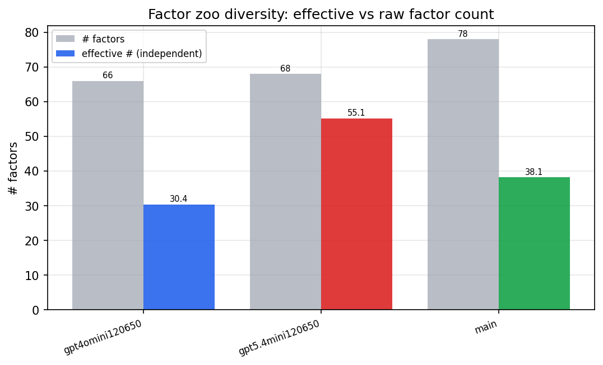

*Effective vs raw factor count per research model*

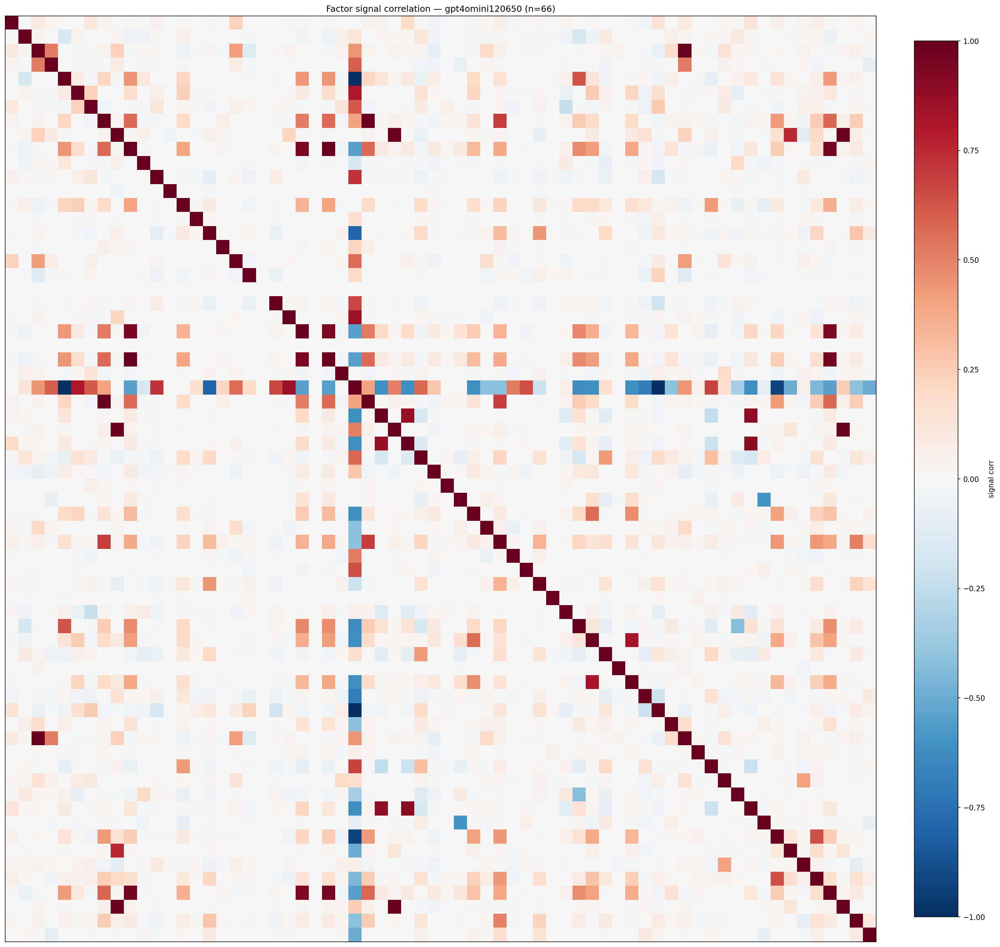

*Signal correlation matrix — gpt4omini120650*

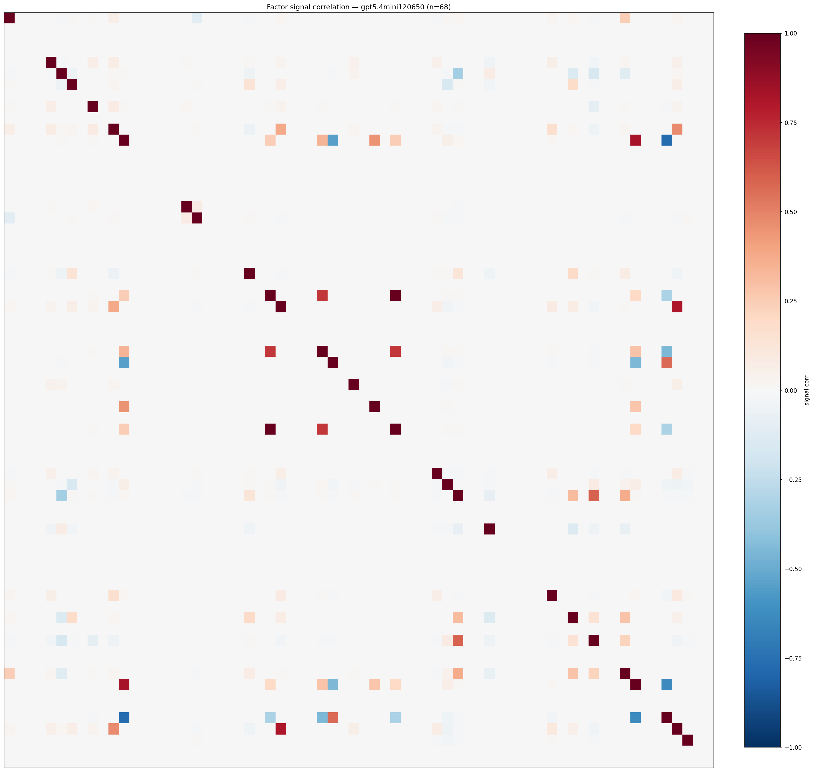

*Signal correlation matrix — gpt5.4mini120650*

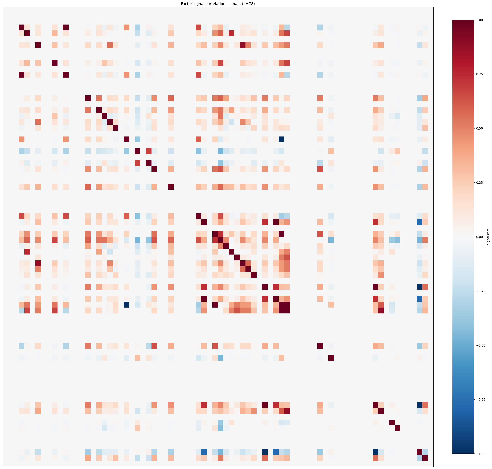

*Signal correlation matrix — main*

## 3. Deflation & model-based importance

`deflated_best_ic` haircuts each zoo's best |IC| for the number of factors tried (`ic_n_tested`) — a bigger zoo's best factor is more likely to be lucky. `lasso_n_nonzero` / `lasso_sparsity` show how many factors a sparse linear model actually keeps (model-view redundancy).

| prerun | best_ic | deflated_best_ic | deflated_best_t | ic_n_tested | ic_n_obs | lasso_n_nonzero | lasso_sparsity |
| --- | --- | --- | --- | --- | --- | --- | --- |
| gpt4omini120650 | 0.5622 | 0.5545 | 207.765 | 64 | 140399 | 0 | 1.0 |
| gpt5.4mini120650 | 0.0979 | 0.091 | 34.1003 | 29 | 140399 | 9 | 0.8676 |
| main | 0.1022 | 0.095 | 35.6096 | 37 | 140399 | 18 | 0.7692 |

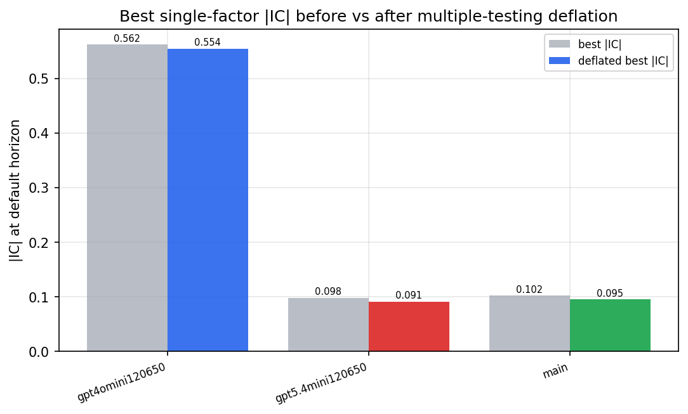

*Best |IC| before vs after multiple-testing deflation*

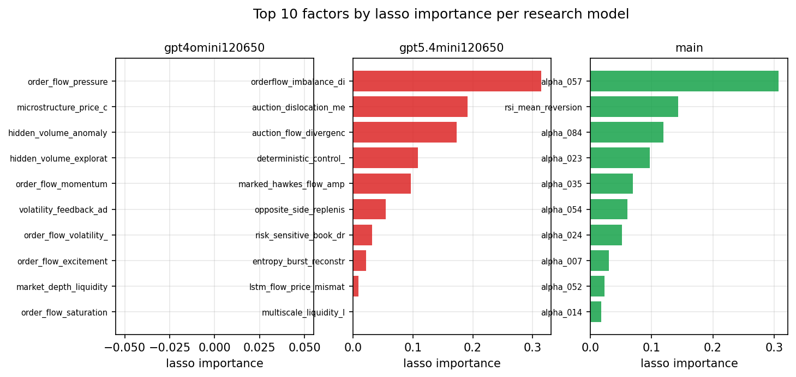

*Top factors by lasso importance per zoo*

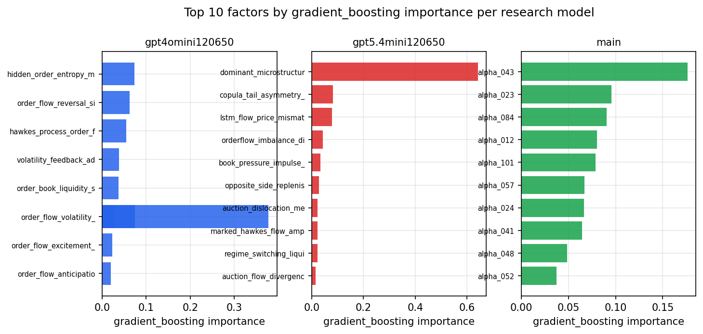

*Top factors by gradient_boosting importance per zoo*

## 4. ML-combined signal — per-underlying vectorised backtest

Each model combines a prerun's factors into ONE signal (fit `factors → forward return` on IS, predict per (bar, underlying)), then that combined signal is run through a simple vectorised backtest — `position(signal) × the underlying's own forward return` — on the held-out OOS tail (+ an equal-weight ensemble). No cross-sectional ranking.

> Config: position=**threshold** (t=1.0, z-score `expanding`), aggregation=**portfolio**, fit-standardise=**per_underlying**, horizon=6.

| prerun | model | n_factors_used | oos_ic | oos_sharpe | is_sharpe | oos_ann_return | oos_max_drawdown |
| --- | --- | --- | --- | --- | --- | --- | --- |
| gpt4omini120650 | linear_regression | 66 | 0.0301 | 9.021 | 12.0292 | 0.9853 | -0.0171 |
| gpt4omini120650 | ridge | 66 | 0.0322 | 9.2067 | 12.2801 | 1.0114 | -0.0159 |
| gpt4omini120650 | lasso | 66 | nan | nan | nan | nan | nan |
| gpt4omini120650 | elastic_net | 66 | nan | nan | nan | nan | nan |
| gpt4omini120650 | random_forest | 66 | 0.0622 | 10.1097 | 14.7262 | 1.3482 | -0.0105 |
| gpt4omini120650 | gradient_boosting | 66 | 0.0557 | 2.1313 | 11.1819 | 0.1462 | -0.0137 |
| gpt4omini120650 | xgboost | 66 | 0.0448 | 13.528 | 17.9077 | 1.3631 | -0.006 |
| gpt4omini120650 | lightgbm | 66 | 0.0342 | 5.8683 | 19.3646 | 0.4702 | -0.013 |
| gpt4omini120650 | ensemble | 66 | 0.035 | 9.683 | 15.7814 | 0.8578 | -0.0066 |
| gpt5.4mini120650 | linear_regression | 68 | 0.0786 | 16.8897 | 18.88 | 2.1301 | -0.0084 |
| gpt5.4mini120650 | ridge | 68 | 0.0793 | 17.4663 | 18.8509 | 2.2184 | -0.0084 |
| gpt5.4mini120650 | lasso | 68 | 0.0903 | 17.2695 | 18.2708 | 1.9576 | -0.0072 |
| gpt5.4mini120650 | elastic_net | 68 | 0.0902 | 16.9096 | 18.56 | 2.0467 | -0.0072 |
| gpt5.4mini120650 | random_forest | 68 | 0.0867 | 18.5924 | 22.0429 | 3.1286 | -0.0061 |
| gpt5.4mini120650 | gradient_boosting | 68 | 0.087 | 14.6062 | 16.4194 | 1.184 | -0.0038 |
| gpt5.4mini120650 | xgboost | 68 | 0.0828 | 17.6865 | 22.9383 | 1.9261 | -0.0039 |
| gpt5.4mini120650 | lightgbm | 68 | 0.0848 | 15.8805 | 21.8673 | 1.507 | -0.0047 |
| gpt5.4mini120650 | ensemble | 68 | 0.0944 | 21.4182 | 22.6069 | 2.6468 | -0.0061 |
| main | linear_regression | 78 | 0.0887 | 33.5391 | 30.5421 | 3.273 | -0.0072 |
| main | ridge | 78 | 0.0889 | 33.2357 | 31.0728 | 3.2821 | -0.0081 |
| main | lasso | 78 | 0.0952 | 36.0683 | 30.9885 | 3.3669 | -0.0065 |
| main | elastic_net | 78 | 0.0952 | 36.0683 | 30.9885 | 3.3669 | -0.0065 |
| main | random_forest | 78 | 0.0977 | 34.8094 | 27.8732 | 3.752 | -0.0036 |
| main | gradient_boosting | 78 | 0.0601 | 8.8087 | 24.2628 | 0.8135 | -0.0123 |
| main | xgboost | 78 | 0.0979 | 29.7904 | 26.7794 | 3.2005 | -0.0056 |
| main | lightgbm | 78 | 0.081 | 22.7214 | 31.5957 | 2.4523 | -0.0084 |
| main | ensemble | 78 | 0.0927 | 33.7516 | 29.0483 | 3.6308 | -0.0064 |

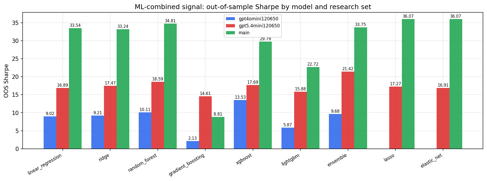

*ML-combined OOS Sharpe by model and research set*

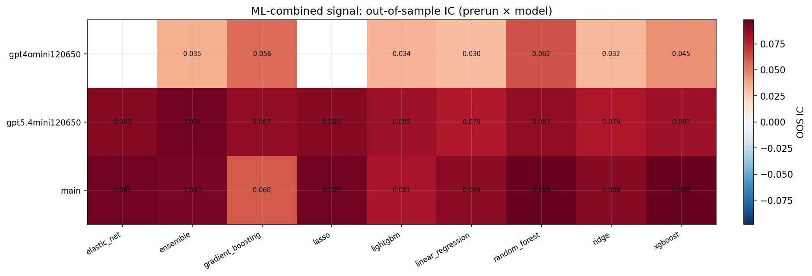

*ML-combined OOS IC (prerun × model)*

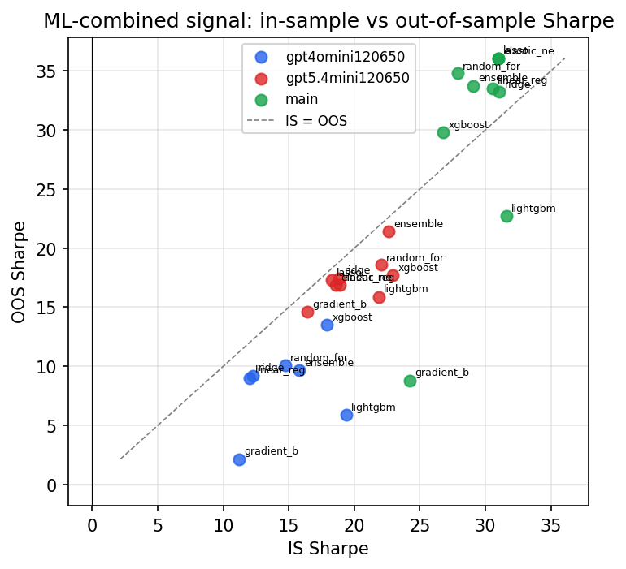

*IS vs OOS Sharpe (overfitting diagnostic)*

---
*Generated by `run_model_comparison.py`. Tables: `*.csv`; interactive: `comparison.ipynb`.*
