# Research-LLM factor comparison — `2025-04`

Comparing the **factor output of different research LLMs** on three axes (raw factor quality → factors as ML features → factors through the full agentic fund). The panel, IS/OOS split, horizon and model hyper-parameters are held identical across preruns — the *only* variable is the factor set.

## Preruns compared

| prerun | research_model | usable_factors | dropped_factors |
| --- | --- | --- | --- |
| gpt4omini120650 | gpt-4o-mini | 66 | 0 |
| gpt5.4mini120650 | gpt-5.4-mini | 68 | 1 |
| main | seed library | 78 | 10 |

> Dropped factors declare fields the current data doesn't have yet (e.g. fundamentals); they light up unchanged once that data is downloaded.

*Usable vs awaiting-data factors per research model*

## Key findings

- **Best ML-combined OOS Sharpe:** `main` with `random_forest` (OOS Sharpe = 20.453).
- **Mean OOS Sharpe across models, by research set:** `main` = 19.083, `gpt5.4mini120650` = 8.042, `gpt4omini120650` = 5.512.
- **Highest mean single-factor |IC| (h=6):** `main` (mean |IC| = 0.0434).
- **Most diverse zoo (highest effective/raw factor ratio):** `gpt5.4mini120650` (eff 55.3 of 68, ratio 0.81).
- **Best selection-deflated single-factor |IC|:** `main` (deflated |IC| = 0.2053 from 38 factors tried).

## 1. Single-factor IC (raw factor quality)

Per-underlying time-series Spearman rank-IC of every researched factor, recomputed on the shared panel at horizons h=1, h=6, h=60. The per-underlying IC correlates each factor's value vector with the underlying's own forward-return vector (pooled across underlyings); the cross-sectional IC ranks across underlyings per timestamp.

| prerun | n_factors | mean_abs_ic_1 | mean_abs_ic_6 | mean_abs_ic_60 | mean_abs_icir_6 | best_factor_h6 | best_abs_ic_h6 |
| --- | --- | --- | --- | --- | --- | --- | --- |
| gpt4omini120650 | 66 | 0.0205 | 0.0226 | 0.021 | 0.6662 | effective_spread_reversal_strength | 0.1103 |
| gpt5.4mini120650 | 68 | 0.0142 | 0.0158 | 0.0143 | 0.6865 | deterministic_control_gap | 0.0976 |
| main | 78 | 0.039 | 0.0434 | 0.0267 | 1.0379 | alpha_059 | 0.2124 |

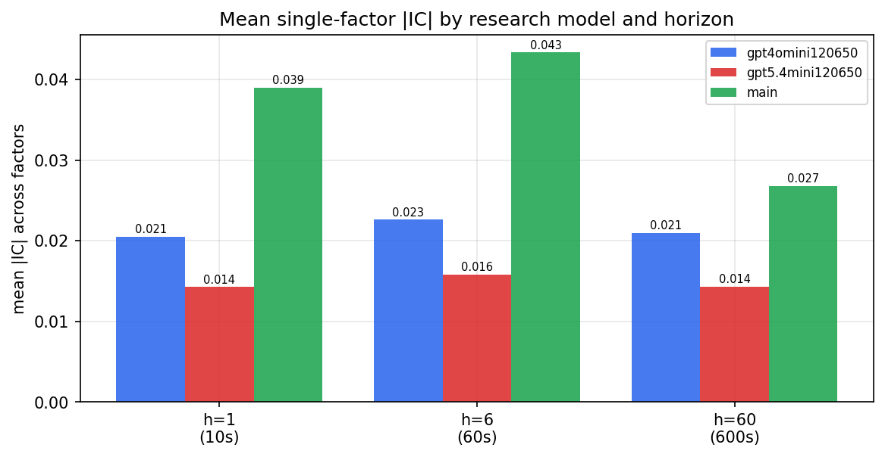

*Mean |IC| by research model and horizon*

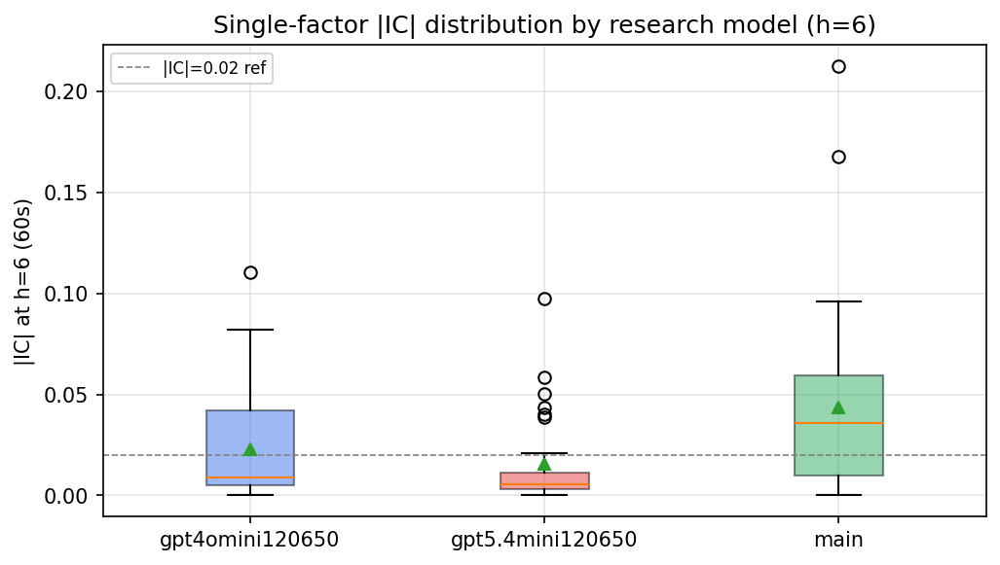

*Per-factor |IC| distribution by research model*

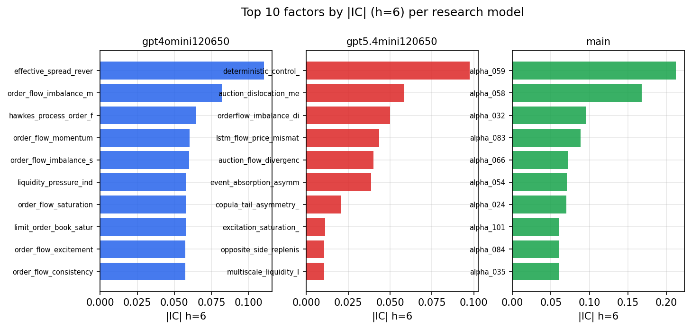

*Top factors by |IC| per research model*

## 2. Factor diversity & redundancy

Pairwise correlation of each zoo's *signals*. `eff_n_factors` is the effective number of independent factors (participation ratio of the correlation eigenvalues); `eff_ratio` and `redundancy` summarise how much unique information the zoo holds vs. how much is duplicated; `n_clusters` groups factors at |corr| ≥ 0.7.

| prerun | n_factors | eff_n_factors | eff_ratio | mean_abs_corr | n_clusters | redundancy |
| --- | --- | --- | --- | --- | --- | --- |
| gpt4omini120650 | 66 | 32.7125 | 0.4956 | 0.0498 | 55 | 0.5044 |
| gpt5.4mini120650 | 68 | 55.3284 | 0.8137 | 0.0085 | 63 | 0.1863 |
| main | 78 | 40.7606 | 0.5226 | 0.0355 | 65 | 0.4774 |

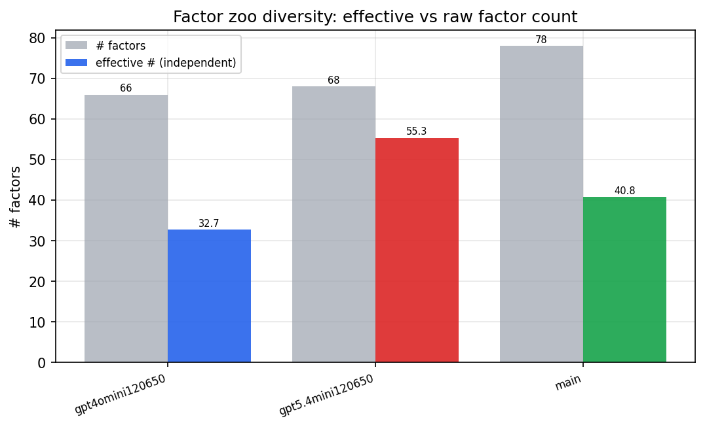

*Effective vs raw factor count per research model*

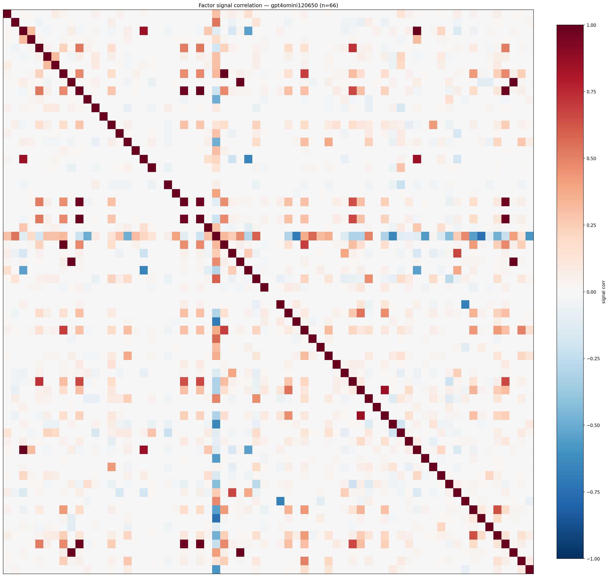

*Signal correlation matrix — gpt4omini120650*

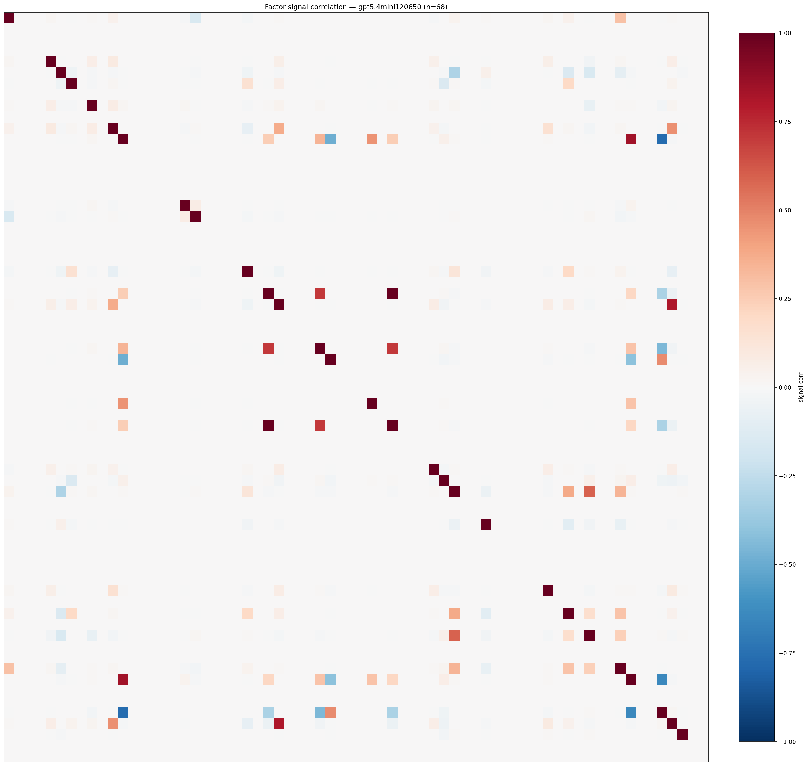

*Signal correlation matrix — gpt5.4mini120650*

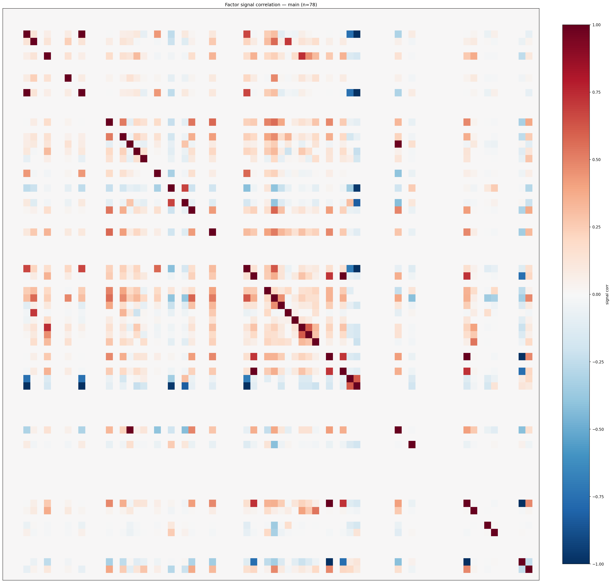

*Signal correlation matrix — main*

## 3. Deflation & model-based importance

`deflated_best_ic` haircuts each zoo's best |IC| for the number of factors tried (`ic_n_tested`) — a bigger zoo's best factor is more likely to be lucky. `lasso_n_nonzero` / `lasso_sparsity` show how many factors a sparse linear model actually keeps (model-view redundancy).

| prerun | best_ic | deflated_best_ic | deflated_best_t | ic_n_tested | ic_n_obs | lasso_n_nonzero | lasso_sparsity |
| --- | --- | --- | --- | --- | --- | --- | --- |
| gpt4omini120650 | 0.1103 | 0.1027 | 38.7883 | 64 | 142739 | 3 | 0.9545 |
| gpt5.4mini120650 | 0.0976 | 0.0908 | 34.2934 | 29 | 142739 | 8 | 0.8824 |
| main | 0.2124 | 0.2053 | 77.5473 | 38 | 142739 | 15 | 0.8077 |

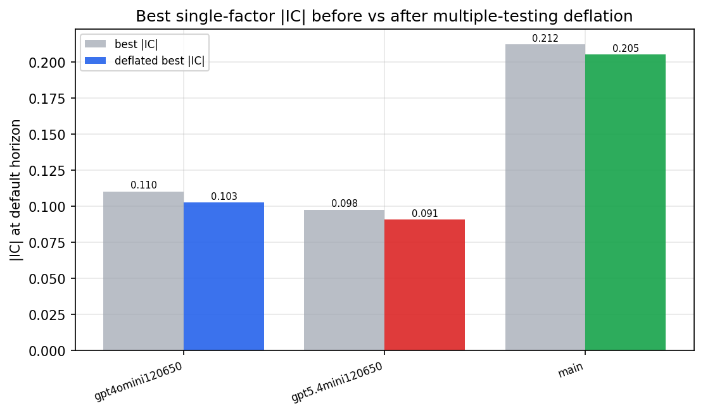

*Best |IC| before vs after multiple-testing deflation*

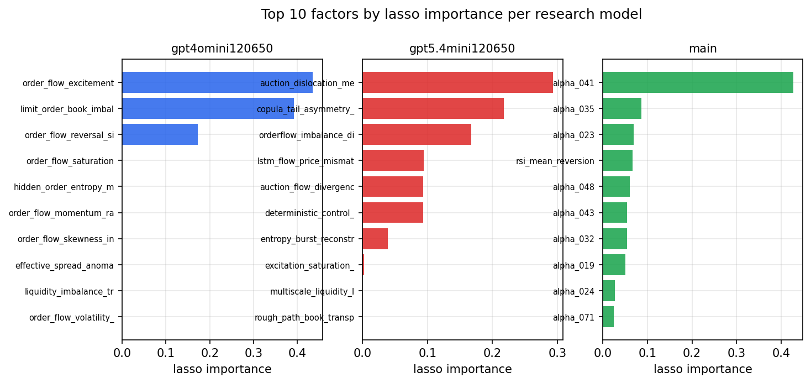

*Top factors by lasso importance per zoo*

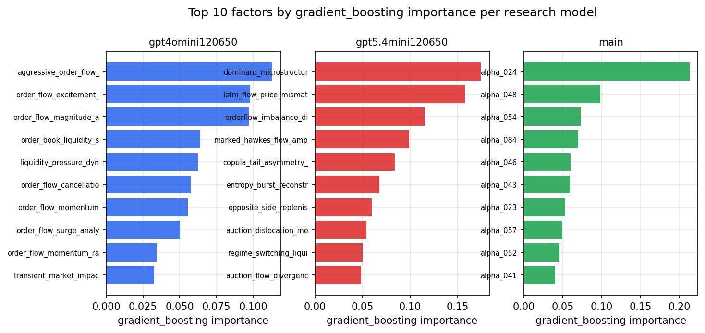

*Top factors by gradient_boosting importance per zoo*

## 4. ML-combined signal — per-underlying vectorised backtest

Each model combines a prerun's factors into ONE signal (fit `factors → forward return` on IS, predict per (bar, underlying)), then that combined signal is run through a simple vectorised backtest — `position(signal) × the underlying's own forward return` — on the held-out OOS tail (+ an equal-weight ensemble). No cross-sectional ranking.

> Config: position=**threshold** (t=1.0, z-score `expanding`), aggregation=**portfolio**, fit-standardise=**per_underlying**, horizon=6.

| prerun | model | n_factors_used | oos_ic | oos_sharpe | is_sharpe | oos_ann_return | oos_max_drawdown |
| --- | --- | --- | --- | --- | --- | --- | --- |
| gpt4omini120650 | linear_regression | 66 | 0.036 | 4.601 | 16.9974 | 0.7166 | -0.0345 |
| gpt4omini120650 | ridge | 66 | 0.0381 | 5.1999 | 17.3714 | 0.8217 | -0.0348 |
| gpt4omini120650 | lasso | 66 | 0.0428 | 4.6779 | 14.5762 | 1.0448 | -0.0417 |
| gpt4omini120650 | elastic_net | 66 | 0.0434 | 4.4491 | 14.8061 | 1.0025 | -0.0413 |
| gpt4omini120650 | random_forest | 66 | 0.0362 | 6.2886 | 19.073 | 1.2718 | -0.0357 |
| gpt4omini120650 | gradient_boosting | 66 | 0.0309 | 2.1902 | 14.6396 | 0.3305 | -0.0278 |
| gpt4omini120650 | xgboost | 66 | 0.0405 | 6.7386 | 20.3157 | 1.0088 | -0.0321 |
| gpt4omini120650 | lightgbm | 66 | 0.0426 | 7.274 | 20.4246 | 0.8126 | -0.0307 |
| gpt4omini120650 | ensemble | 66 | 0.0436 | 8.1911 | 21.5756 | 1.5932 | -0.0383 |
| gpt5.4mini120650 | linear_regression | 68 | 0.0634 | 8.5942 | 17.0787 | 1.3363 | -0.0358 |
| gpt5.4mini120650 | ridge | 68 | 0.0635 | 7.9269 | 17.5876 | 1.2488 | -0.0381 |
| gpt5.4mini120650 | lasso | 68 | 0.0621 | 7.3411 | 16.1101 | 1.3905 | -0.0331 |
| gpt5.4mini120650 | elastic_net | 68 | 0.0622 | 7.5226 | 16.0579 | 1.4292 | -0.0328 |
| gpt5.4mini120650 | random_forest | 68 | 0.0737 | 9.3088 | 23.5606 | 1.53 | -0.046 |
| gpt5.4mini120650 | gradient_boosting | 68 | 0.0737 | 8.4773 | 18.3643 | 0.9159 | -0.0411 |
| gpt5.4mini120650 | xgboost | 68 | 0.0712 | 5.6863 | 21.2959 | 0.6635 | -0.0451 |
| gpt5.4mini120650 | lightgbm | 68 | 0.0762 | 7.2991 | 21.6372 | 0.8566 | -0.0329 |
| gpt5.4mini120650 | ensemble | 68 | 0.072 | 10.2197 | 22.3721 | 1.7657 | -0.0399 |
| main | linear_regression | 78 | 0.0767 | 17.7532 | 32.4487 | 2.5603 | -0.0309 |
| main | ridge | 78 | 0.0771 | 18.8892 | 33.0722 | 2.749 | -0.0335 |
| main | lasso | 78 | 0.0739 | 19.8284 | 36.3803 | 2.5815 | -0.0275 |
| main | elastic_net | 78 | 0.0739 | 19.8284 | 36.3803 | 2.5815 | -0.0275 |
| main | random_forest | 78 | 0.0841 | 20.4526 | 31.6078 | 2.9255 | -0.0271 |
| main | gradient_boosting | 78 | 0.0868 | 15.7317 | 27.6501 | 1.9327 | -0.0306 |
| main | xgboost | 78 | 0.0899 | 19.8339 | 29.6084 | 2.5272 | -0.026 |
| main | lightgbm | 78 | 0.0912 | 19.3313 | 33.523 | 2.6985 | -0.0334 |
| main | ensemble | 78 | 0.0869 | 20.0976 | 32.6054 | 3.0659 | -0.0329 |

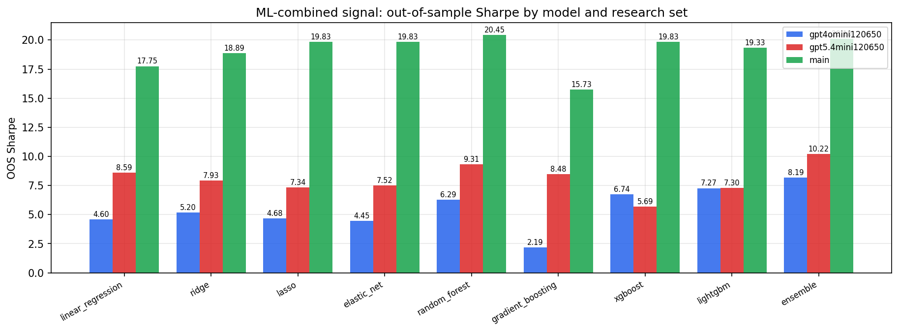

*ML-combined OOS Sharpe by model and research set*

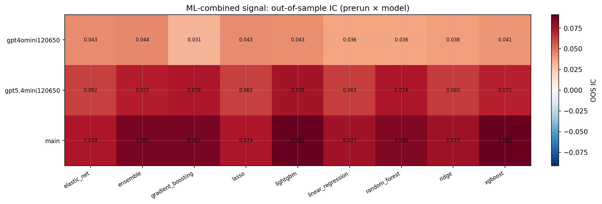

*ML-combined OOS IC (prerun × model)*

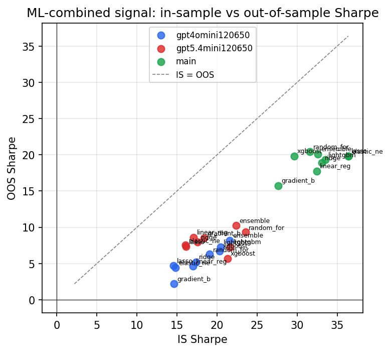

*IS vs OOS Sharpe (overfitting diagnostic)*

---
*Generated by `run_model_comparison.py`. Tables: `*.csv`; interactive: `comparison.ipynb`.*
