# Research-LLM factor comparison — `2025-05`

Comparing the **factor output of different research LLMs** on three axes (raw factor quality → factors as ML features → factors through the full agentic fund). The panel, IS/OOS split, horizon and model hyper-parameters are held identical across preruns — the *only* variable is the factor set.

## Preruns compared

| prerun | research_model | usable_factors | dropped_factors |
| --- | --- | --- | --- |
| gpt4omini120650 | gpt-4o-mini | 66 | 0 |
| gpt5.4mini120650 | gpt-5.4-mini | 68 | 1 |
| main | seed library | 78 | 10 |

> Dropped factors declare fields the current data doesn't have yet (e.g. fundamentals); they light up unchanged once that data is downloaded.

*Usable vs awaiting-data factors per research model*

## Key findings

- **Best ML-combined OOS Sharpe:** `main` with `ensemble` (OOS Sharpe = 33.841).
- **Mean OOS Sharpe across models, by research set:** `main` = 27.347, `gpt5.4mini120650` = 20.159, `gpt4omini120650` = 16.591.
- **Highest mean single-factor |IC| (h=6):** `main` (mean |IC| = 0.0434).
- **Most diverse zoo (highest effective/raw factor ratio):** `gpt5.4mini120650` (eff 56.8 of 68, ratio 0.84).
- **Best selection-deflated single-factor |IC|:** `main` (deflated |IC| = 0.2053 from 38 factors tried).

## 1. Single-factor IC (raw factor quality)

Per-underlying time-series Spearman rank-IC of every researched factor, recomputed on the shared panel at horizons h=1, h=6, h=60. The per-underlying IC correlates each factor's value vector with the underlying's own forward-return vector (pooled across underlyings); the cross-sectional IC ranks across underlyings per timestamp.

| prerun | n_factors | mean_abs_ic_1 | mean_abs_ic_6 | mean_abs_ic_60 | mean_abs_icir_6 | best_factor_h6 | best_abs_ic_h6 |
| --- | --- | --- | --- | --- | --- | --- | --- |
| gpt4omini120650 | 66 | 0.0192 | 0.0224 | 0.0211 | 0.644 | effective_spread_reversal_strength | 0.1111 |
| gpt5.4mini120650 | 68 | 0.0122 | 0.0142 | 0.0145 | 0.6541 | deterministic_control_gap | 0.0989 |
| main | 78 | 0.0323 | 0.0434 | 0.0342 | 0.9419 | alpha_059 | 0.2124 |

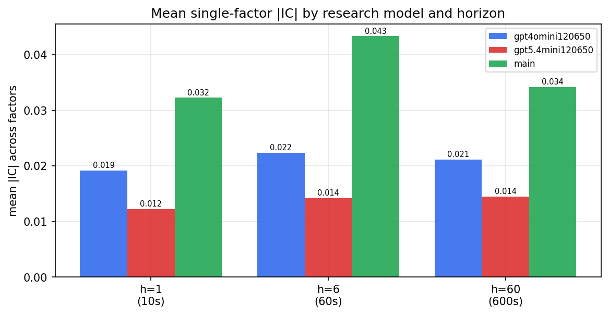

*Mean |IC| by research model and horizon*

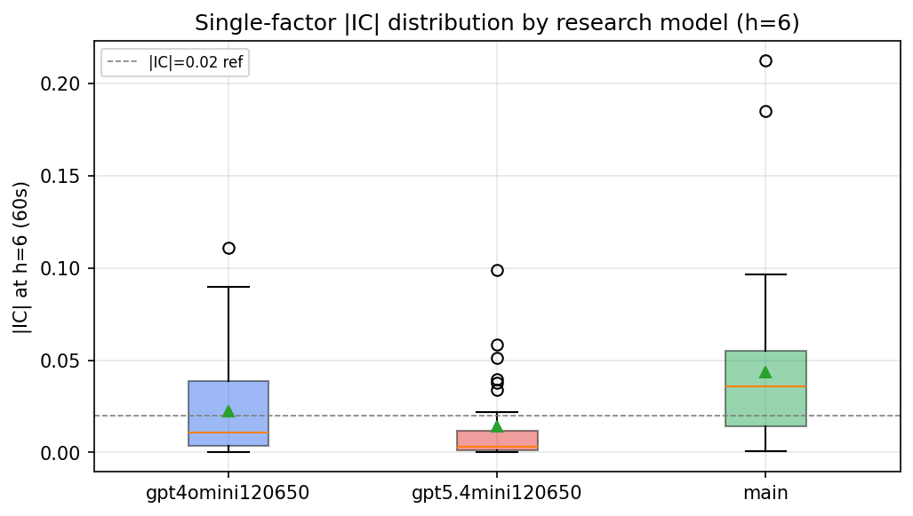

*Per-factor |IC| distribution by research model*

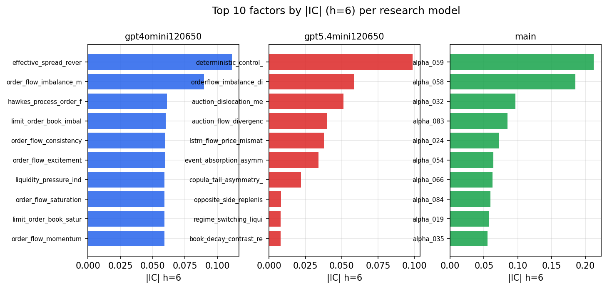

*Top factors by |IC| per research model*

## 2. Factor diversity & redundancy

Pairwise correlation of each zoo's *signals*. `eff_n_factors` is the effective number of independent factors (participation ratio of the correlation eigenvalues); `eff_ratio` and `redundancy` summarise how much unique information the zoo holds vs. how much is duplicated; `n_clusters` groups factors at |corr| ≥ 0.7.

| prerun | n_factors | eff_n_factors | eff_ratio | mean_abs_corr | n_clusters | redundancy |
| --- | --- | --- | --- | --- | --- | --- |
| gpt4omini120650 | 66 | 31.9713 | 0.4844 | 0.0519 | 53 | 0.5156 |
| gpt5.4mini120650 | 68 | 56.8181 | 0.8356 | 0.0074 | 63 | 0.1644 |
| main | 78 | 39.4152 | 0.5053 | 0.0371 | 66 | 0.4947 |

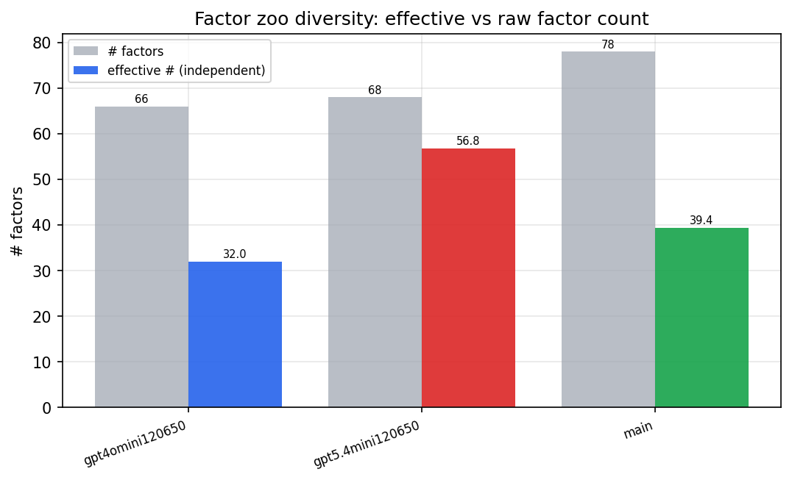

*Effective vs raw factor count per research model*

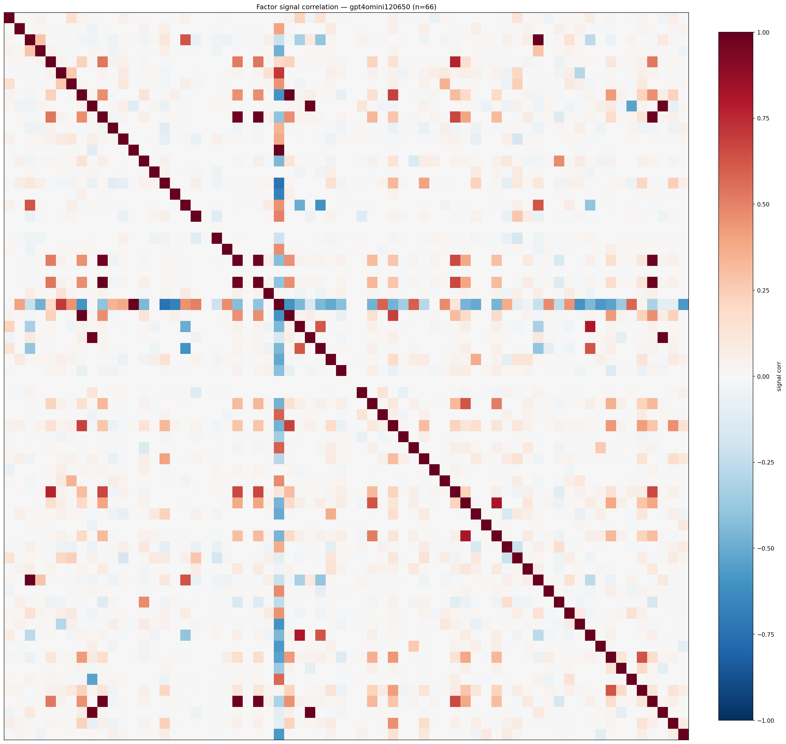

*Signal correlation matrix — gpt4omini120650*

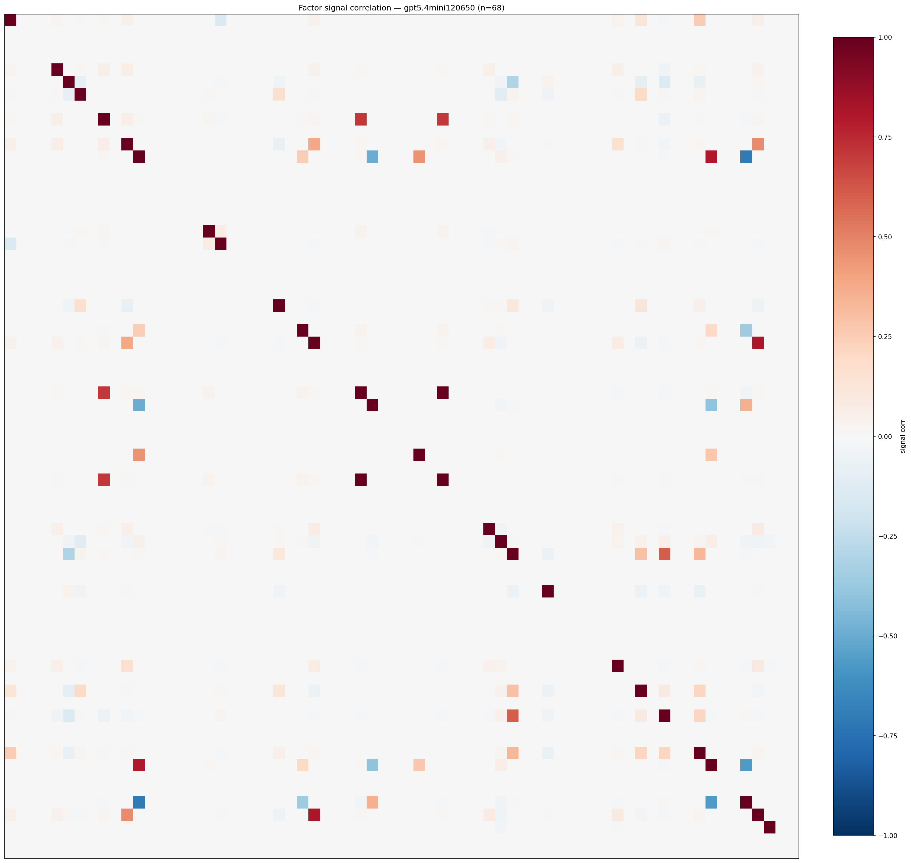

*Signal correlation matrix — gpt5.4mini120650*

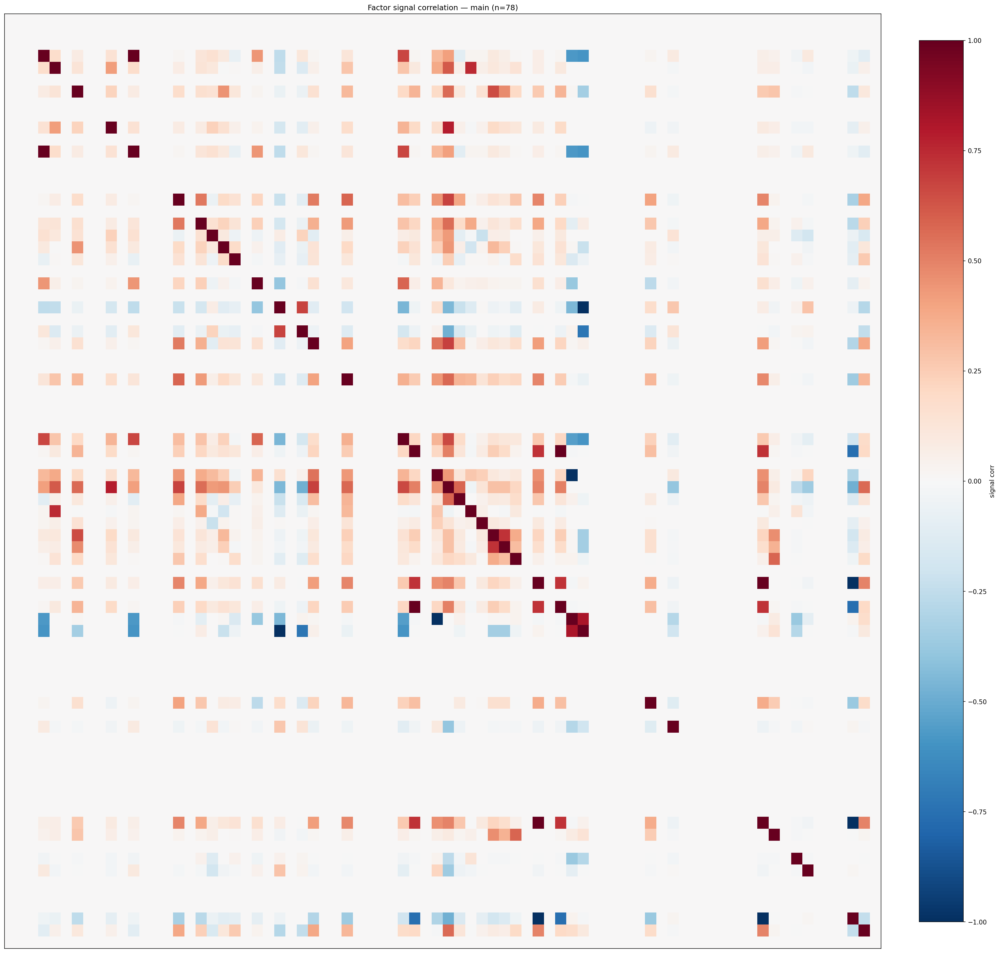

*Signal correlation matrix — main*

## 3. Deflation & model-based importance

`deflated_best_ic` haircuts each zoo's best |IC| for the number of factors tried (`ic_n_tested`) — a bigger zoo's best factor is more likely to be lucky. `lasso_n_nonzero` / `lasso_sparsity` show how many factors a sparse linear model actually keeps (model-view redundancy).

| prerun | best_ic | deflated_best_ic | deflated_best_t | ic_n_tested | ic_n_obs | lasso_n_nonzero | lasso_sparsity |
| --- | --- | --- | --- | --- | --- | --- | --- |
| gpt4omini120650 | 0.1111 | 0.1035 | 39.4197 | 63 | 145078 | 10 | 0.8485 |
| gpt5.4mini120650 | 0.0989 | 0.0921 | 35.0706 | 28 | 145078 | 5 | 0.9265 |
| main | 0.2124 | 0.2053 | 78.2021 | 38 | 145078 | 9 | 0.8846 |

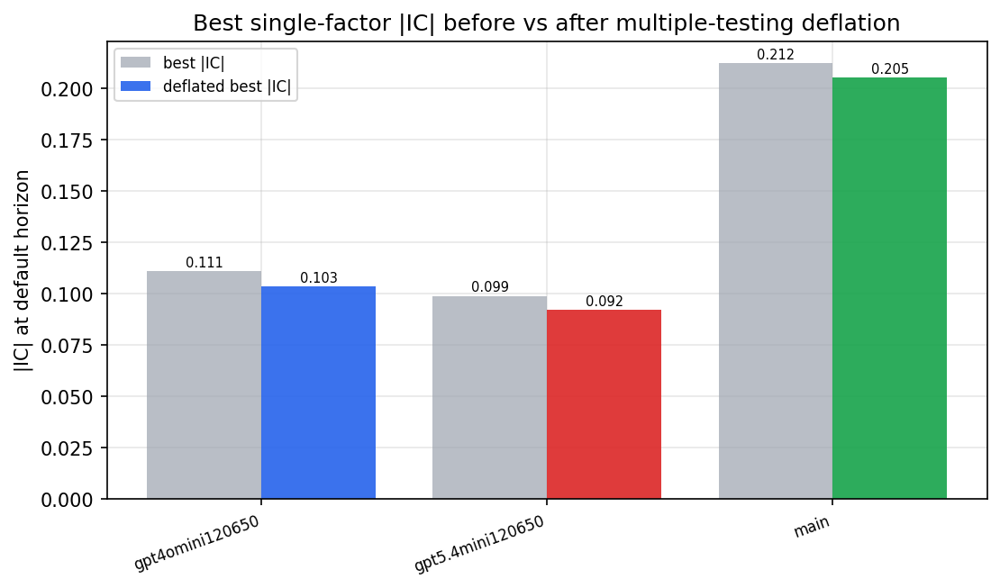

*Best |IC| before vs after multiple-testing deflation*

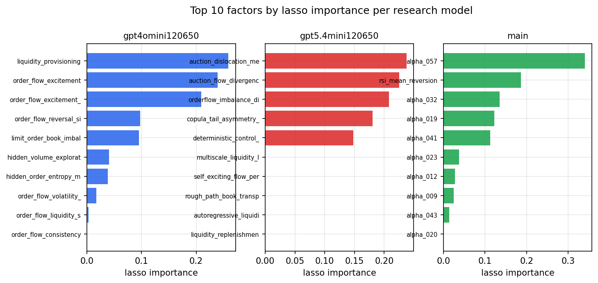

*Top factors by lasso importance per zoo*

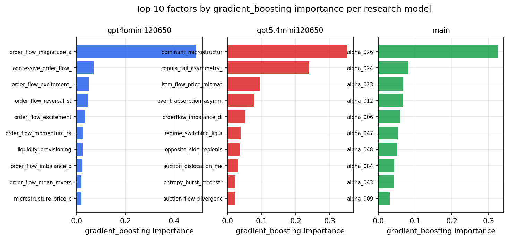

*Top factors by gradient_boosting importance per zoo*

## 4. ML-combined signal — per-underlying vectorised backtest

Each model combines a prerun's factors into ONE signal (fit `factors → forward return` on IS, predict per (bar, underlying)), then that combined signal is run through a simple vectorised backtest — `position(signal) × the underlying's own forward return` — on the held-out OOS tail (+ an equal-weight ensemble). No cross-sectional ranking.

> Config: position=**threshold** (t=1.0, z-score `expanding`), aggregation=**portfolio**, fit-standardise=**per_underlying**, horizon=6.

| prerun | model | n_factors_used | oos_ic | oos_sharpe | is_sharpe | oos_ann_return | oos_max_drawdown |
| --- | --- | --- | --- | --- | --- | --- | --- |
| gpt4omini120650 | linear_regression | 66 | 0.0646 | 20.5205 | 15.0743 | 1.4634 | -0.0065 |
| gpt4omini120650 | ridge | 66 | 0.0604 | 23.4774 | 14.5624 | 1.7274 | -0.0086 |
| gpt4omini120650 | lasso | 66 | 0.069 | 26.0602 | 14.8225 | 1.7187 | -0.0093 |
| gpt4omini120650 | elastic_net | 66 | 0.066 | 26.5261 | 14.6989 | 1.8716 | -0.0099 |
| gpt4omini120650 | random_forest | 66 | 0.0697 | 18.1079 | 16.361 | 2.1354 | -0.0157 |
| gpt4omini120650 | gradient_boosting | 66 | 0.0647 | 1.9531 | 13.3208 | 0.0622 | -0.0068 |
| gpt4omini120650 | xgboost | 66 | 0.0707 | 8.6563 | 17.6489 | 0.6291 | -0.0116 |
| gpt4omini120650 | lightgbm | 66 | 0.0788 | 0.6105 | 18.0712 | 0.0418 | -0.0182 |
| gpt4omini120650 | ensemble | 66 | 0.0675 | 23.4113 | 19.2185 | 2.3336 | -0.0166 |
| gpt5.4mini120650 | linear_regression | 68 | 0.082 | 24.9821 | 18.2583 | 3.1585 | -0.0103 |
| gpt5.4mini120650 | ridge | 68 | 0.082 | 24.7451 | 17.5801 | 3.1393 | -0.0104 |
| gpt5.4mini120650 | lasso | 68 | 0.0851 | 27.0597 | 17.0118 | 3.2267 | -0.0087 |
| gpt5.4mini120650 | elastic_net | 68 | 0.0851 | 27.4818 | 17.5128 | 3.2812 | -0.0087 |
| gpt5.4mini120650 | random_forest | 68 | 0.0869 | 23.2981 | 20.3455 | 2.8578 | -0.0117 |
| gpt5.4mini120650 | gradient_boosting | 68 | 0.0914 | 4.4467 | 12.5854 | 0.1694 | -0.0047 |
| gpt5.4mini120650 | xgboost | 68 | 0.0886 | 13.6584 | 15.9816 | 0.71 | -0.0084 |
| gpt5.4mini120650 | lightgbm | 68 | 0.088 | 10.1297 | 17.7728 | 0.4749 | -0.0071 |
| gpt5.4mini120650 | ensemble | 68 | 0.0906 | 25.6289 | 20.0763 | 3.2453 | -0.012 |
| main | linear_regression | 78 | 0.0842 | 22.1047 | 21.0099 | 1.9133 | -0.0108 |
| main | ridge | 78 | 0.0867 | 25.7603 | 21.7468 | 2.5687 | -0.0113 |
| main | lasso | 78 | 0.091 | 28.2458 | 27.9577 | 2.3714 | -0.008 |
| main | elastic_net | 78 | 0.091 | 28.2458 | 27.9577 | 2.3714 | -0.008 |
| main | random_forest | 78 | 0.0961 | 31.4989 | 23.5547 | 2.4578 | -0.0054 |
| main | gradient_boosting | 78 | 0.0895 | 19.5583 | 18.5092 | 0.9256 | -0.0044 |
| main | xgboost | 78 | 0.094 | 26.9216 | 21.9971 | 1.9243 | -0.0082 |
| main | lightgbm | 78 | 0.0952 | 29.9459 | 25.1399 | 2.2651 | -0.0083 |
| main | ensemble | 78 | 0.1002 | 33.8414 | 22.954 | 2.863 | -0.0053 |

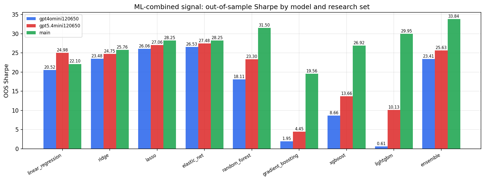

*ML-combined OOS Sharpe by model and research set*

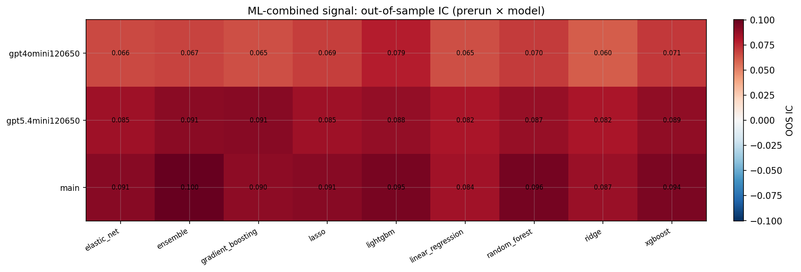

*ML-combined OOS IC (prerun × model)*

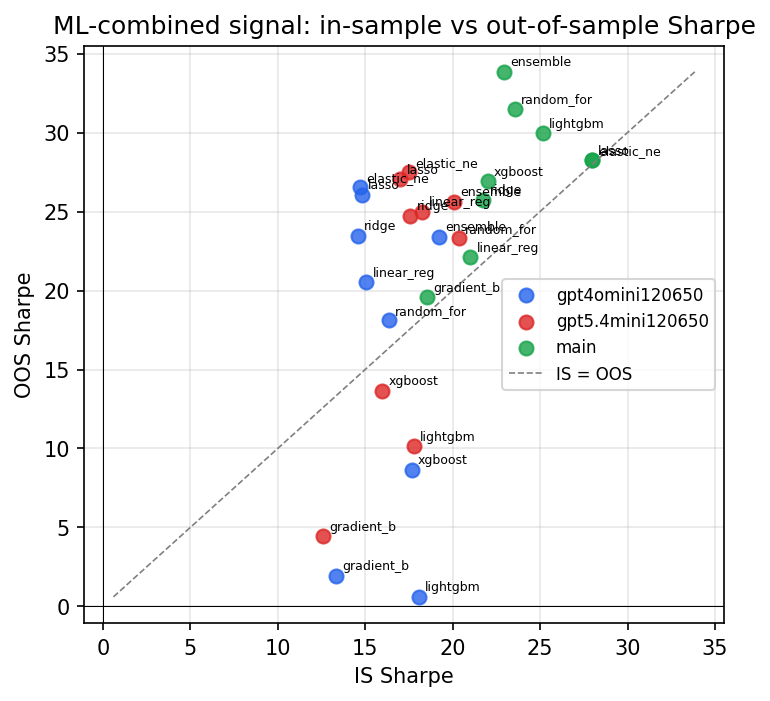

*IS vs OOS Sharpe (overfitting diagnostic)*

---
*Generated by `run_model_comparison.py`. Tables: `*.csv`; interactive: `comparison.ipynb`.*
