# Research-LLM factor comparison — `2025-06`

Comparing the **factor output of different research LLMs** on three axes (raw factor quality → factors as ML features → factors through the full agentic fund). The panel, IS/OOS split, horizon and model hyper-parameters are held identical across preruns — the *only* variable is the factor set.

## Preruns compared

| prerun | research_model | usable_factors | dropped_factors |
| --- | --- | --- | --- |
| gpt4omini120650 | gpt-4o-mini | 66 | 0 |
| gpt5.4mini120650 | gpt-5.4-mini | 68 | 1 |
| main | seed library | 78 | 10 |

> Dropped factors declare fields the current data doesn't have yet (e.g. fundamentals); they light up unchanged once that data is downloaded.

*Usable vs awaiting-data factors per research model*

## Key findings

- **Best ML-combined OOS Sharpe:** `main` with `ensemble` (OOS Sharpe = 39.329).
- **Mean OOS Sharpe across models, by research set:** `main` = 35.387, `gpt5.4mini120650` = 18.976, `gpt4omini120650` = 4.307.
- **Highest mean single-factor |IC| (h=6):** `main` (mean |IC| = 0.0467).
- **Most diverse zoo (highest effective/raw factor ratio):** `gpt5.4mini120650` (eff 56.8 of 68, ratio 0.83).
- **Best selection-deflated single-factor |IC|:** `main` (deflated |IC| = 0.3552 from 38 factors tried).

## 1. Single-factor IC (raw factor quality)

Per-underlying time-series Spearman rank-IC of every researched factor, recomputed on the shared panel at horizons h=1, h=6, h=60. The per-underlying IC correlates each factor's value vector with the underlying's own forward-return vector (pooled across underlyings); the cross-sectional IC ranks across underlyings per timestamp.

| prerun | n_factors | mean_abs_ic_1 | mean_abs_ic_6 | mean_abs_ic_60 | mean_abs_icir_6 | best_factor_h6 | best_abs_ic_h6 |
| --- | --- | --- | --- | --- | --- | --- | --- |
| gpt4omini120650 | 66 | 0.0233 | 0.0229 | 0.0212 | 0.6313 | effective_spread_reversal_strength | 0.2566 |
| gpt5.4mini120650 | 68 | 0.0115 | 0.0147 | 0.0168 | 0.7068 | deterministic_control_gap | 0.0846 |
| main | 78 | 0.0328 | 0.0467 | 0.0443 | 1.1391 | alpha_059 | 0.3623 |

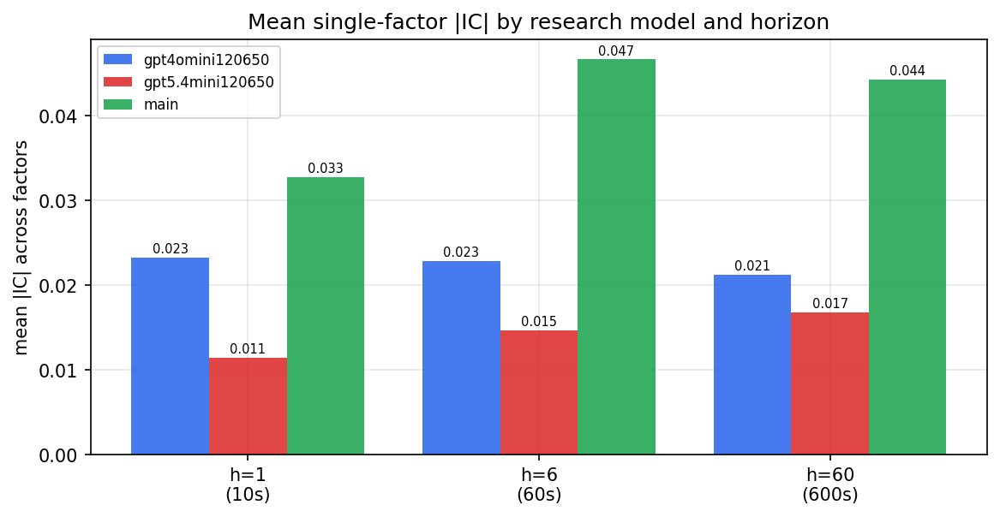

*Mean |IC| by research model and horizon*

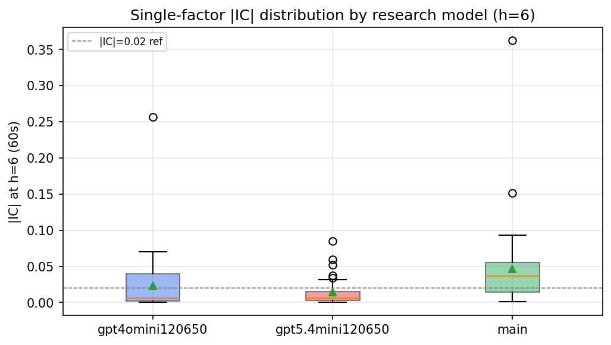

*Per-factor |IC| distribution by research model*

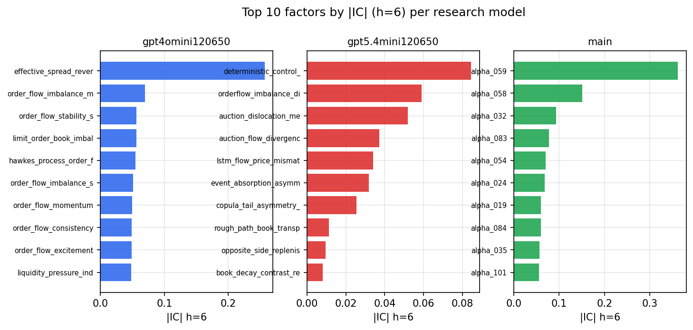

*Top factors by |IC| per research model*

## 2. Factor diversity & redundancy

Pairwise correlation of each zoo's *signals*. `eff_n_factors` is the effective number of independent factors (participation ratio of the correlation eigenvalues); `eff_ratio` and `redundancy` summarise how much unique information the zoo holds vs. how much is duplicated; `n_clusters` groups factors at |corr| ≥ 0.7.

| prerun | n_factors | eff_n_factors | eff_ratio | mean_abs_corr | n_clusters | redundancy |
| --- | --- | --- | --- | --- | --- | --- |
| gpt4omini120650 | 66 | 27.9204 | 0.423 | 0.0599 | 21 | 0.577 |
| gpt5.4mini120650 | 68 | 56.754 | 0.8346 | 0.0074 | 63 | 0.1654 |
| main | 78 | 39.2702 | 0.5035 | 0.0384 | 65 | 0.4965 |

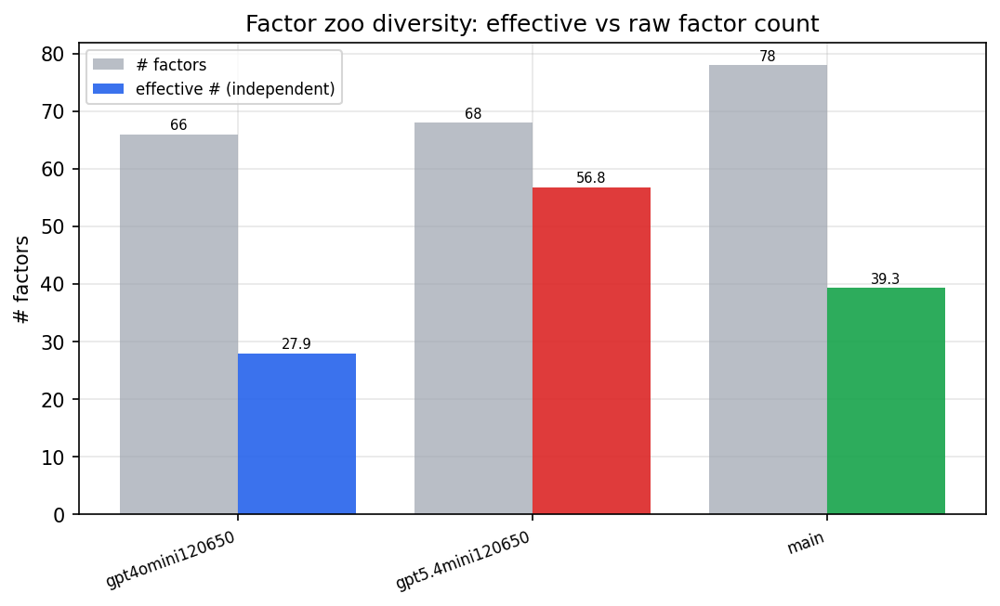

*Effective vs raw factor count per research model*

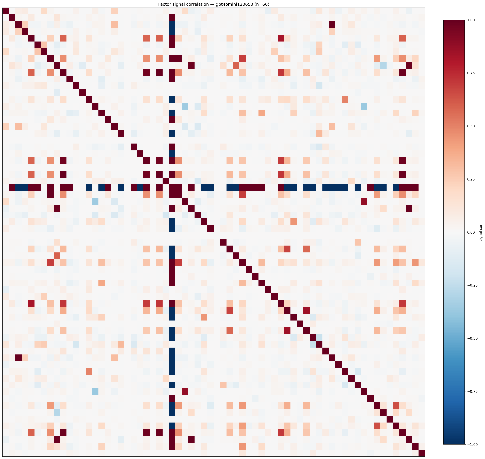

*Signal correlation matrix — gpt4omini120650*

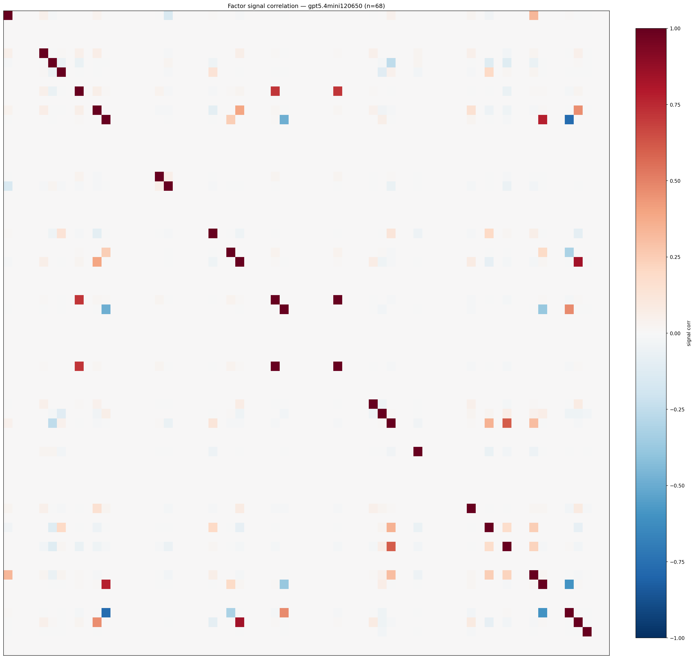

*Signal correlation matrix — gpt5.4mini120650*

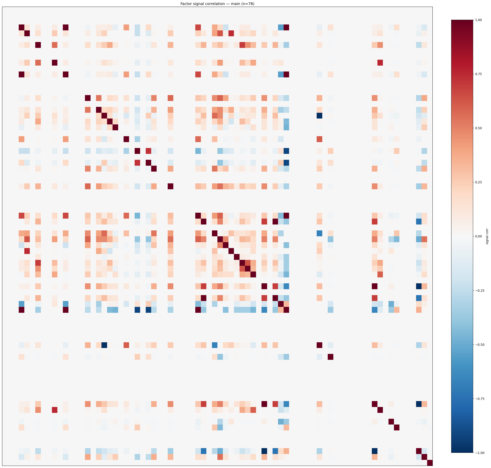

*Signal correlation matrix — main*

## 3. Deflation & model-based importance

`deflated_best_ic` haircuts each zoo's best |IC| for the number of factors tried (`ic_n_tested`) — a bigger zoo's best factor is more likely to be lucky. `lasso_n_nonzero` / `lasso_sparsity` show how many factors a sparse linear model actually keeps (model-view redundancy).

| prerun | best_ic | deflated_best_ic | deflated_best_t | ic_n_tested | ic_n_obs | lasso_n_nonzero | lasso_sparsity |
| --- | --- | --- | --- | --- | --- | --- | --- |
| gpt4omini120650 | 0.2566 | 0.249 | 94.0789 | 63 | 142738 | 28 | 0.5758 |
| gpt5.4mini120650 | 0.0846 | 0.0778 | 29.3918 | 28 | 142738 | 12 | 0.8235 |
| main | 0.3623 | 0.3552 | 134.181 | 38 | 142738 | 6 | 0.9231 |

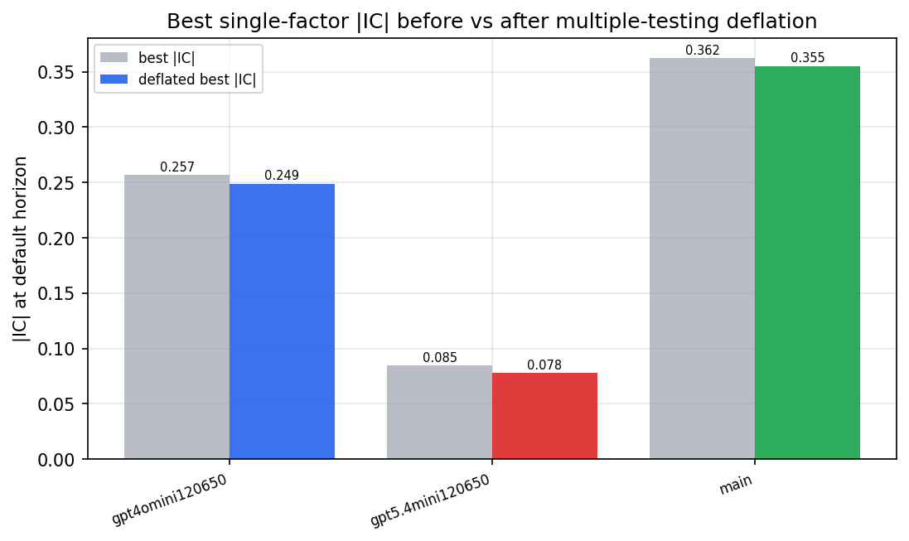

*Best |IC| before vs after multiple-testing deflation*

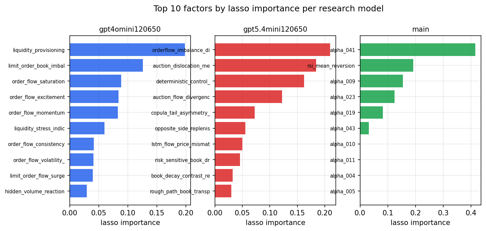

*Top factors by lasso importance per zoo*

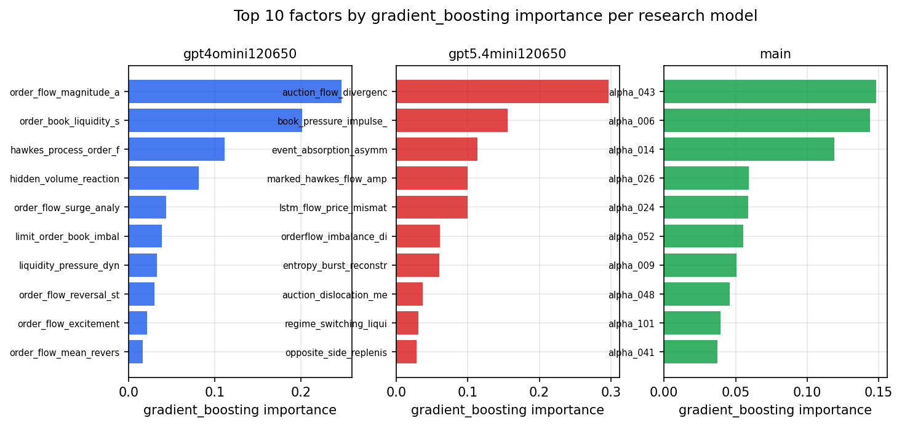

*Top factors by gradient_boosting importance per zoo*

## 4. ML-combined signal — per-underlying vectorised backtest

Each model combines a prerun's factors into ONE signal (fit `factors → forward return` on IS, predict per (bar, underlying)), then that combined signal is run through a simple vectorised backtest — `position(signal) × the underlying's own forward return` — on the held-out OOS tail (+ an equal-weight ensemble). No cross-sectional ranking.

> Config: position=**threshold** (t=1.0, z-score `expanding`), aggregation=**portfolio**, fit-standardise=**per_underlying**, horizon=6.

| prerun | model | n_factors_used | oos_ic | oos_sharpe | is_sharpe | oos_ann_return | oos_max_drawdown |
| --- | --- | --- | --- | --- | --- | --- | --- |
| gpt4omini120650 | linear_regression | 66 | 0.0256 | 0.5439 | 20.4613 | 0.0499 | -0.0285 |
| gpt4omini120650 | ridge | 66 | 0.0268 | 2.4102 | 20.8939 | 0.2231 | -0.0247 |
| gpt4omini120650 | lasso | 66 | 0.0291 | 2.9239 | 18.6692 | 0.2707 | -0.028 |
| gpt4omini120650 | elastic_net | 66 | 0.0294 | 3.5039 | 18.6044 | 0.3224 | -0.0272 |
| gpt4omini120650 | random_forest | 66 | 0.0422 | 11.1696 | 18.7176 | 1.2106 | -0.0094 |
| gpt4omini120650 | gradient_boosting | 66 | 0.0557 | 0.6267 | 8.8498 | 0.0153 | -0.0073 |
| gpt4omini120650 | xgboost | 66 | 0.0327 | 8.8963 | 12.7651 | 0.6106 | -0.0051 |
| gpt4omini120650 | lightgbm | 66 | 0.0311 | 0.0818 | 14.4848 | 0.0046 | -0.0124 |
| gpt4omini120650 | ensemble | 66 | 0.0372 | 8.6026 | 19.2227 | 0.8152 | -0.0123 |
| gpt5.4mini120650 | linear_regression | 68 | 0.0676 | 18.6149 | 18.6314 | 1.6549 | -0.0147 |
| gpt5.4mini120650 | ridge | 68 | 0.0681 | 18.563 | 18.4033 | 1.6612 | -0.0148 |
| gpt5.4mini120650 | lasso | 68 | 0.0707 | 18.7488 | 20.2727 | 2.3116 | -0.0151 |
| gpt5.4mini120650 | elastic_net | 68 | 0.0706 | 18.8989 | 20.6996 | 2.332 | -0.0151 |
| gpt5.4mini120650 | random_forest | 68 | 0.0724 | 23.136 | 22.2837 | 3.1132 | -0.0148 |
| gpt5.4mini120650 | gradient_boosting | 68 | 0.0792 | 11.2434 | 8.2608 | 0.4023 | -0.0034 |
| gpt5.4mini120650 | xgboost | 68 | 0.08 | 18.6247 | 13.3252 | 1.3132 | -0.0091 |
| gpt5.4mini120650 | lightgbm | 68 | 0.079 | 19.4268 | 17.124 | 0.9149 | -0.0032 |
| gpt5.4mini120650 | ensemble | 68 | 0.0794 | 23.5276 | 20.6616 | 2.5757 | -0.0146 |
| main | linear_regression | 78 | 0.1013 | 36.5447 | 23.9676 | 3.3245 | -0.0048 |
| main | ridge | 78 | 0.1022 | 35.3851 | 22.8215 | 3.1944 | -0.0061 |
| main | lasso | 78 | 0.104 | 35.6434 | 19.7457 | 3.2617 | -0.0061 |
| main | elastic_net | 78 | 0.1048 | 35.9011 | 19.7425 | 3.2782 | -0.006 |
| main | random_forest | 78 | 0.0833 | 36.6603 | 17.2927 | 3.2542 | -0.0049 |
| main | gradient_boosting | 78 | 0.0855 | 29.3162 | 14.6356 | 1.9957 | -0.0053 |
| main | xgboost | 78 | 0.0874 | 35.3034 | 15.558 | 2.7673 | -0.0064 |
| main | lightgbm | 78 | 0.0827 | 34.4017 | 21.4864 | 2.795 | -0.005 |
| main | ensemble | 78 | 0.1008 | 39.3289 | 21.7037 | 3.6748 | -0.0055 |

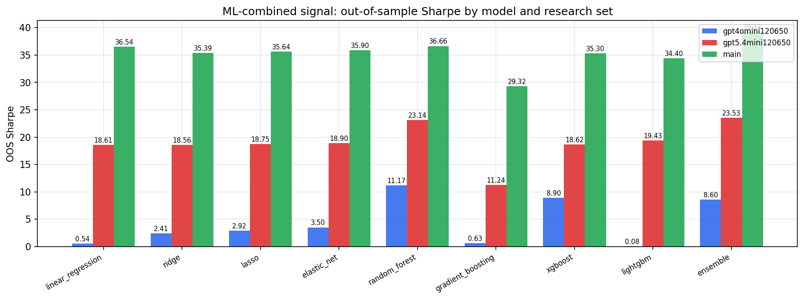

*ML-combined OOS Sharpe by model and research set*

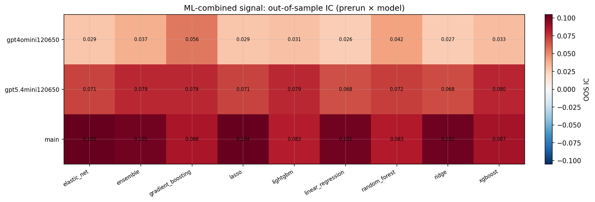

*ML-combined OOS IC (prerun × model)*

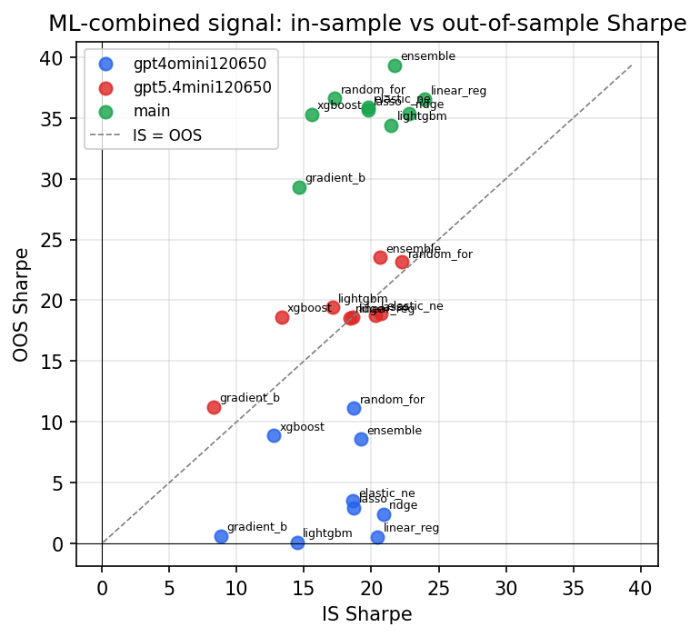

*IS vs OOS Sharpe (overfitting diagnostic)*

---
*Generated by `run_model_comparison.py`. Tables: `*.csv`; interactive: `comparison.ipynb`.*
