# Research-LLM factor comparison — `2025-07`

Comparing the **factor output of different research LLMs** on three axes (raw factor quality → factors as ML features → factors through the full agentic fund). The panel, IS/OOS split, horizon and model hyper-parameters are held identical across preruns — the *only* variable is the factor set.

## Preruns compared

| prerun | research_model | usable_factors | dropped_factors |
| --- | --- | --- | --- |
| gpt4omini120650 | gpt-4o-mini | 66 | 0 |
| gpt5.4mini120650 | gpt-5.4-mini | 68 | 1 |
| main | seed library | 78 | 10 |

> Dropped factors declare fields the current data doesn't have yet (e.g. fundamentals); they light up unchanged once that data is downloaded.

*Usable vs awaiting-data factors per research model*

## Key findings

- **Best ML-combined OOS Sharpe:** `main` with `xgboost` (OOS Sharpe = 11.105).
- **Mean OOS Sharpe across models, by research set:** `main` = 10.137, `gpt5.4mini120650` = 5.268, `gpt4omini120650` = 1.889.
- **Highest mean single-factor |IC| (h=6):** `main` (mean |IC| = 0.0497).
- **Most diverse zoo (highest effective/raw factor ratio):** `gpt5.4mini120650` (eff 56.7 of 68, ratio 0.83).
- **Best selection-deflated single-factor |IC|:** `main` (deflated |IC| = 0.2330 from 37 factors tried).

## 1. Single-factor IC (raw factor quality)

Per-underlying time-series Spearman rank-IC of every researched factor, recomputed on the shared panel at horizons h=1, h=6, h=60. The per-underlying IC correlates each factor's value vector with the underlying's own forward-return vector (pooled across underlyings); the cross-sectional IC ranks across underlyings per timestamp.

| prerun | n_factors | mean_abs_ic_1 | mean_abs_ic_6 | mean_abs_ic_60 | mean_abs_icir_6 | best_factor_h6 | best_abs_ic_h6 |
| --- | --- | --- | --- | --- | --- | --- | --- |
| gpt4omini120650 | 66 | 0.0182 | 0.0207 | 0.0233 | 0.6663 | effective_spread_reversal_strength | 0.0753 |
| gpt5.4mini120650 | 68 | 0.0164 | 0.0175 | 0.0206 | 0.7193 | deterministic_control_gap | 0.0861 |
| main | 78 | 0.0335 | 0.0497 | 0.0379 | 1.0899 | alpha_059 | 0.24 |

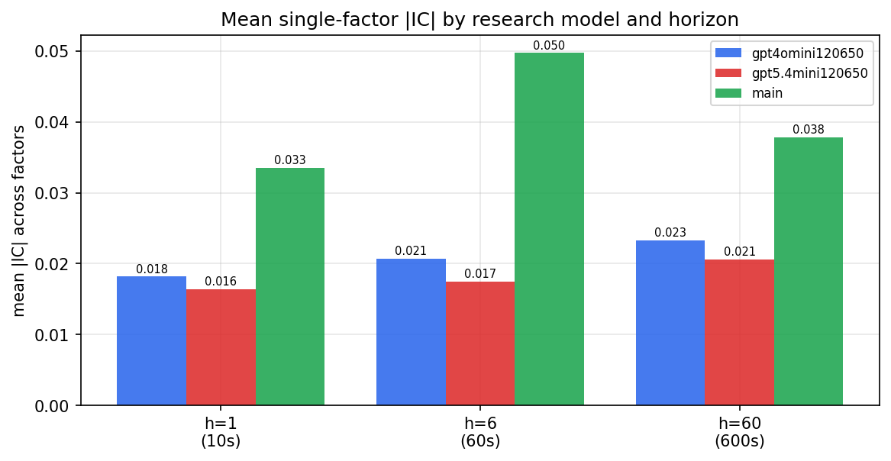

*Mean |IC| by research model and horizon*

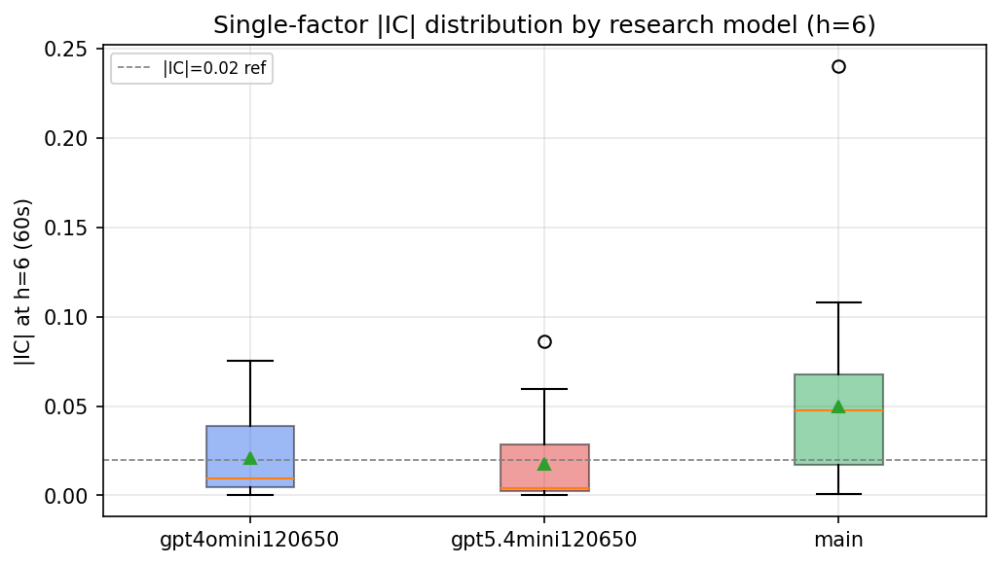

*Per-factor |IC| distribution by research model*

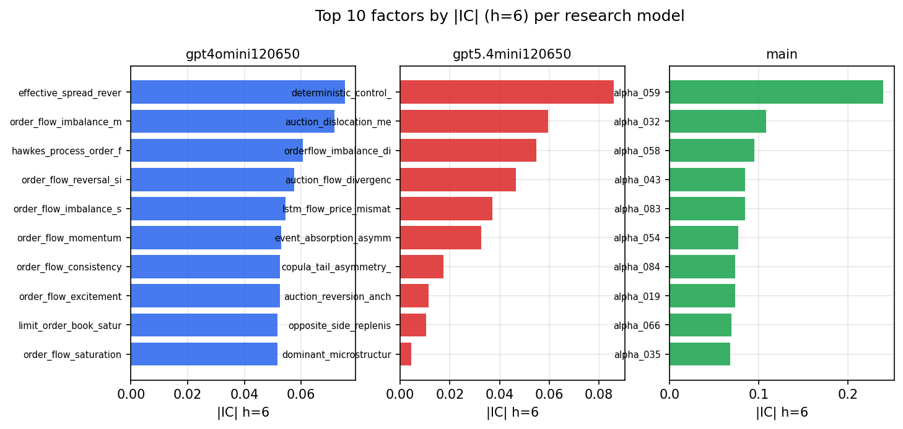

*Top factors by |IC| per research model*

## 2. Factor diversity & redundancy

Pairwise correlation of each zoo's *signals*. `eff_n_factors` is the effective number of independent factors (participation ratio of the correlation eigenvalues); `eff_ratio` and `redundancy` summarise how much unique information the zoo holds vs. how much is duplicated; `n_clusters` groups factors at |corr| ≥ 0.7.

| prerun | n_factors | eff_n_factors | eff_ratio | mean_abs_corr | n_clusters | redundancy |
| --- | --- | --- | --- | --- | --- | --- |
| gpt4omini120650 | 66 | 34.7684 | 0.5268 | 0.0454 | 55 | 0.4732 |
| gpt5.4mini120650 | 68 | 56.6567 | 0.8332 | 0.0084 | 63 | 0.1668 |
| main | 78 | 43.6775 | 0.56 | 0.0322 | 72 | 0.44 |

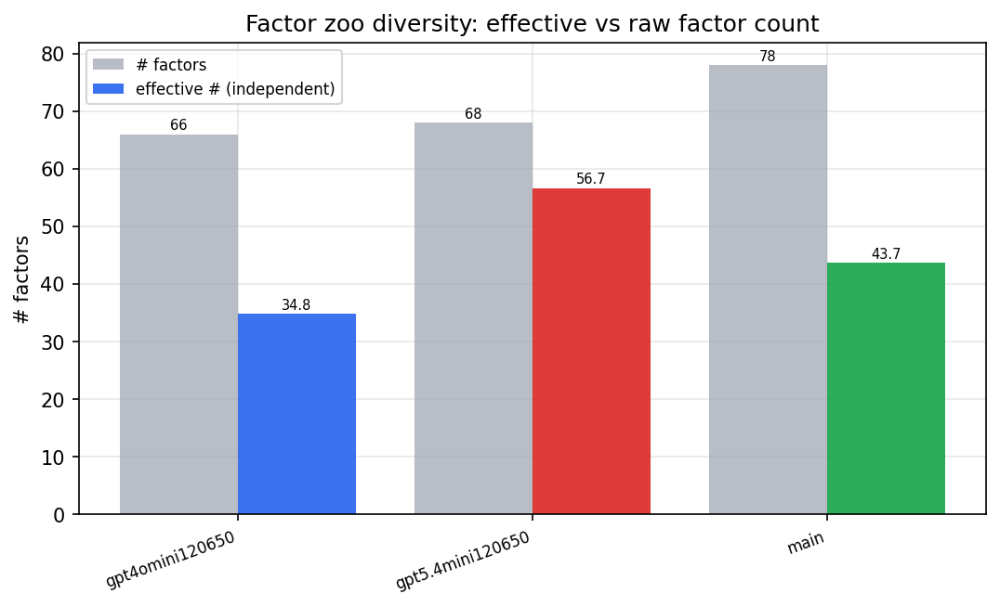

*Effective vs raw factor count per research model*

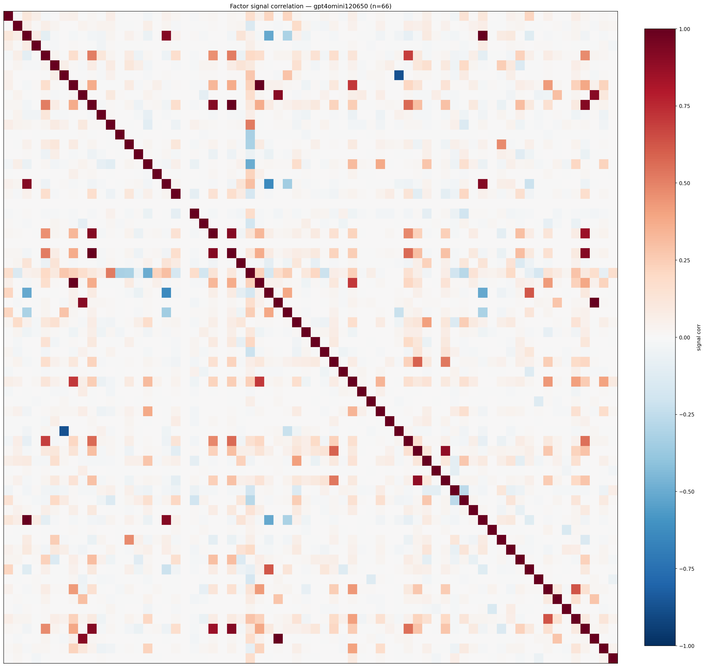

*Signal correlation matrix — gpt4omini120650*

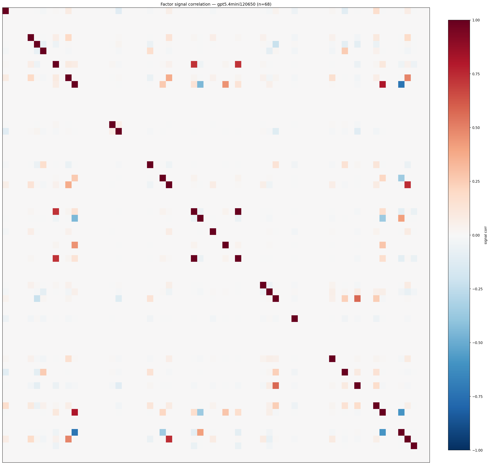

*Signal correlation matrix — gpt5.4mini120650*

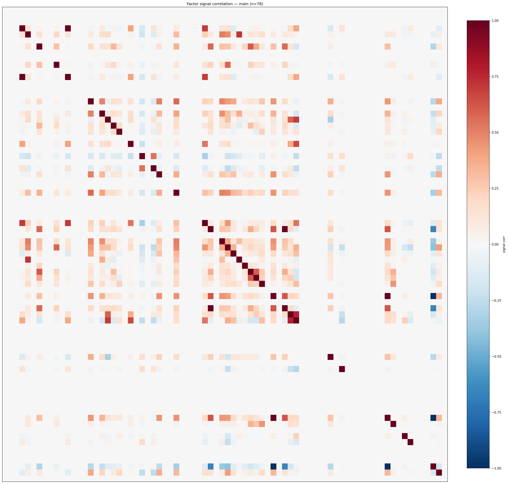

*Signal correlation matrix — main*

## 3. Deflation & model-based importance

`deflated_best_ic` haircuts each zoo's best |IC| for the number of factors tried (`ic_n_tested`) — a bigger zoo's best factor is more likely to be lucky. `lasso_n_nonzero` / `lasso_sparsity` show how many factors a sparse linear model actually keeps (model-view redundancy).

| prerun | best_ic | deflated_best_ic | deflated_best_t | ic_n_tested | ic_n_obs | lasso_n_nonzero | lasso_sparsity |
| --- | --- | --- | --- | --- | --- | --- | --- |
| gpt4omini120650 | 0.0753 | 0.0677 | 25.6928 | 64 | 143999 | 0 | 1.0 |
| gpt5.4mini120650 | 0.0861 | 0.0795 | 30.175 | 22 | 143999 | 9 | 0.8676 |
| main | 0.24 | 0.233 | 88.4036 | 37 | 143999 | 0 | 1.0 |

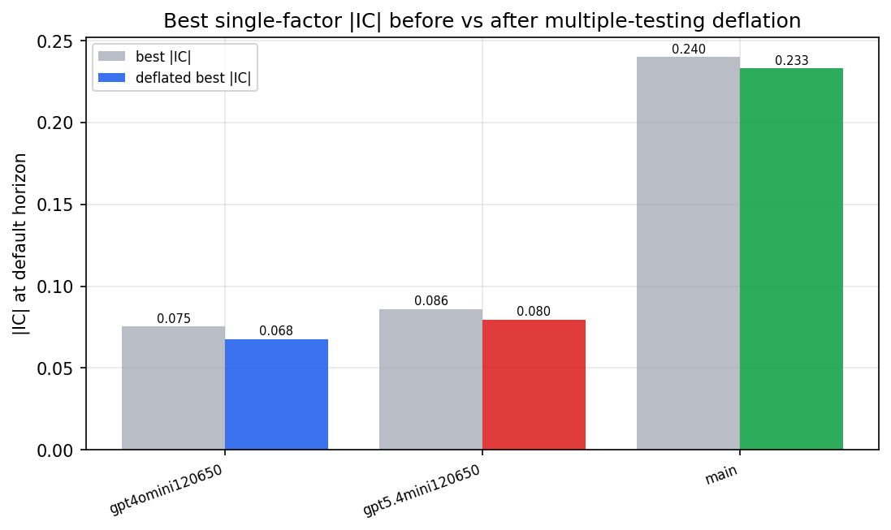

*Best |IC| before vs after multiple-testing deflation*

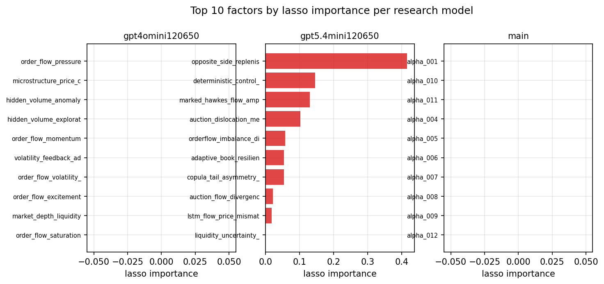

*Top factors by lasso importance per zoo*

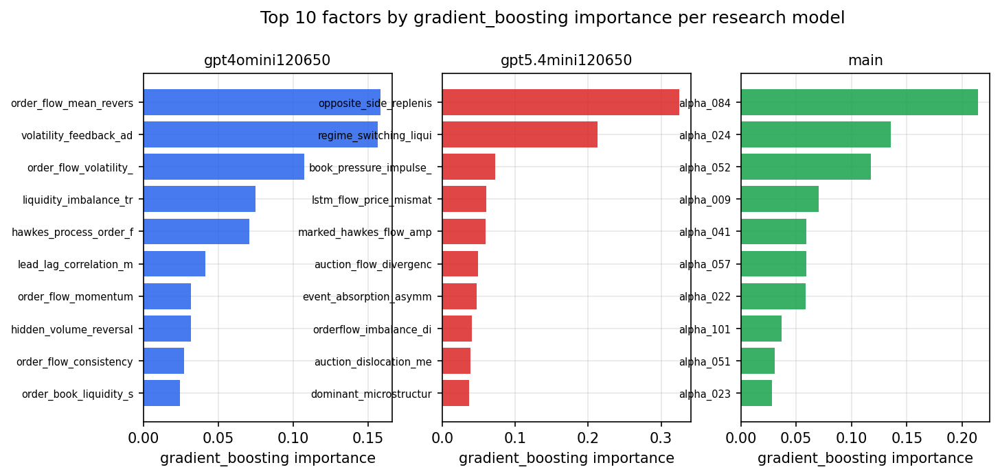

*Top factors by gradient_boosting importance per zoo*

## 4. ML-combined signal — per-underlying vectorised backtest

Each model combines a prerun's factors into ONE signal (fit `factors → forward return` on IS, predict per (bar, underlying)), then that combined signal is run through a simple vectorised backtest — `position(signal) × the underlying's own forward return` — on the held-out OOS tail (+ an equal-weight ensemble). No cross-sectional ranking.

> Config: position=**threshold** (t=1.0, z-score `expanding`), aggregation=**portfolio**, fit-standardise=**per_underlying**, horizon=6.

| prerun | model | n_factors_used | oos_ic | oos_sharpe | is_sharpe | oos_ann_return | oos_max_drawdown |
| --- | --- | --- | --- | --- | --- | --- | --- |
| gpt4omini120650 | linear_regression | 66 | 0.0436 | -1.6362 | 19.4724 | -0.3127 | -0.0794 |
| gpt4omini120650 | ridge | 66 | 0.0449 | -1.488 | 18.9114 | -0.2931 | -0.0752 |
| gpt4omini120650 | lasso | 66 | 0.0508 | 1.3229 | 13.2647 | 0.4018 | -0.1089 |
| gpt4omini120650 | elastic_net | 66 | 0.0452 | 0.2501 | 13.3095 | 0.0829 | -0.1292 |
| gpt4omini120650 | random_forest | 66 | 0.0612 | 2.4202 | 23.0906 | 0.8648 | -0.1643 |
| gpt4omini120650 | gradient_boosting | 66 | 0.0639 | 1.7985 | 15.4908 | 0.4303 | -0.0972 |
| gpt4omini120650 | xgboost | 66 | 0.0775 | 6.2259 | 23.329 | 1.5891 | -0.0463 |
| gpt4omini120650 | lightgbm | 66 | 0.0709 | 5.1446 | 23.8973 | 1.4335 | -0.0465 |
| gpt4omini120650 | ensemble | 66 | 0.0676 | 2.9668 | 22.6433 | 0.9867 | -0.1327 |
| gpt5.4mini120650 | linear_regression | 68 | 0.0765 | 4.4019 | 17.9003 | 0.9538 | -0.062 |
| gpt5.4mini120650 | ridge | 68 | 0.0765 | 4.2421 | 16.5784 | 0.9438 | -0.0671 |
| gpt5.4mini120650 | lasso | 68 | 0.0779 | 7.003 | 21.1971 | 1.7613 | -0.0583 |
| gpt5.4mini120650 | elastic_net | 68 | 0.0776 | 7.1616 | 20.5867 | 1.7867 | -0.0556 |
| gpt5.4mini120650 | random_forest | 68 | 0.0835 | 6.9888 | 28.8506 | 1.7924 | -0.0789 |
| gpt5.4mini120650 | gradient_boosting | 68 | 0.0796 | 0.6575 | 26.085 | 0.1656 | -0.1324 |
| gpt5.4mini120650 | xgboost | 68 | 0.0841 | 4.0303 | 26.6061 | 0.9624 | -0.1172 |
| gpt5.4mini120650 | lightgbm | 68 | 0.0806 | 6.4546 | 24.3235 | 1.4019 | -0.0403 |
| gpt5.4mini120650 | ensemble | 68 | 0.0878 | 6.4739 | 26.6238 | 1.5648 | -0.0783 |
| main | linear_regression | 78 | 0.0972 | 10.7097 | 32.2346 | 3.0411 | -0.0601 |
| main | ridge | 78 | 0.0998 | 10.892 | 31.381 | 3.0914 | -0.0604 |
| main | lasso | 78 | 0.1026 | 10.8656 | 31.0341 | 3.052 | -0.0609 |
| main | elastic_net | 78 | 0.103 | 10.7469 | 31.0277 | 3.0199 | -0.0611 |
| main | random_forest | 78 | 0.104 | 10.0942 | 26.7405 | 2.6684 | -0.0528 |
| main | gradient_boosting | 78 | 0.0997 | 10.6265 | 30.1017 | 2.7265 | -0.0415 |
| main | xgboost | 78 | 0.0955 | 11.1051 | 29.6535 | 2.8487 | -0.0501 |
| main | lightgbm | 78 | 0.0831 | 6.4318 | 29.9436 | 1.7412 | -0.0763 |
| main | ensemble | 78 | 0.1019 | 9.7569 | 32.2912 | 2.8806 | -0.0506 |

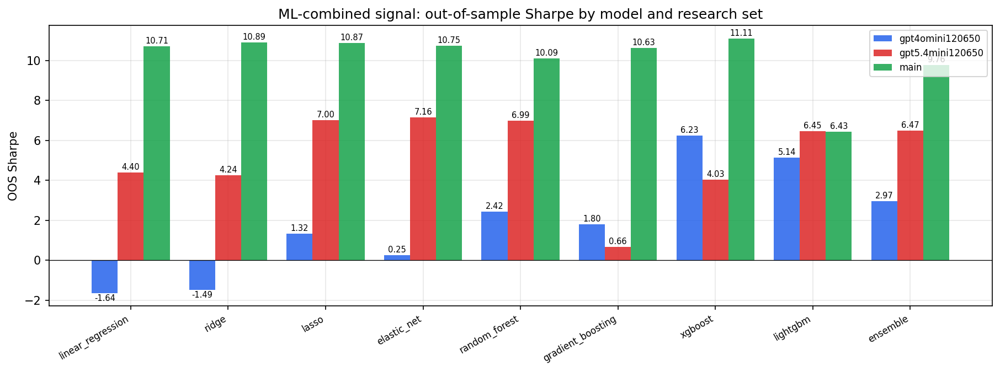

*ML-combined OOS Sharpe by model and research set*

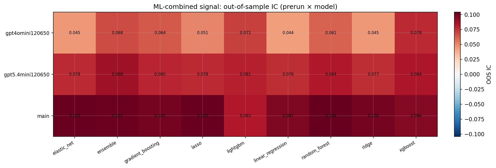

*ML-combined OOS IC (prerun × model)*

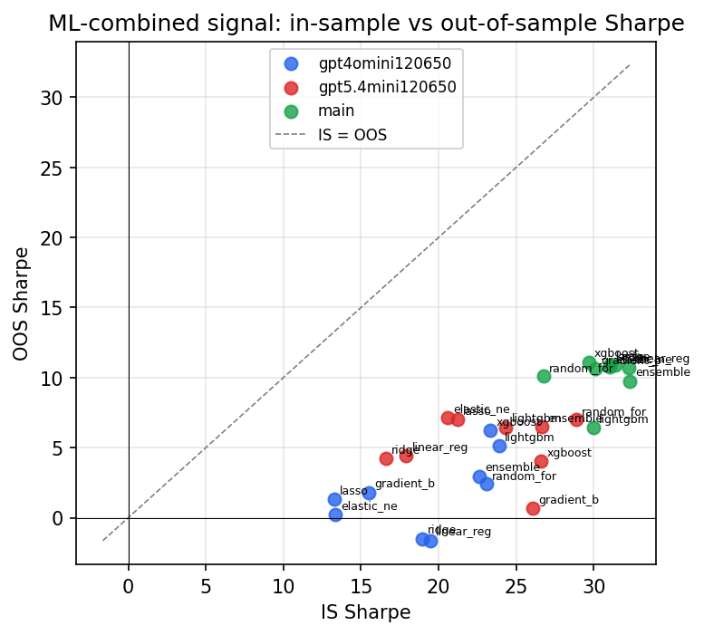

*IS vs OOS Sharpe (overfitting diagnostic)*

---
*Generated by `run_model_comparison.py`. Tables: `*.csv`; interactive: `comparison.ipynb`.*
