# Research-LLM factor comparison — `2025-08`

Comparing the **factor output of different research LLMs** on three axes (raw factor quality → factors as ML features → factors through the full agentic fund). The panel, IS/OOS split, horizon and model hyper-parameters are held identical across preruns — the *only* variable is the factor set.

## Preruns compared

| prerun | research_model | usable_factors | dropped_factors |
| --- | --- | --- | --- |
| gpt4omini120650 | gpt-4o-mini | 66 | 0 |
| gpt5.4mini120650 | gpt-5.4-mini | 68 | 1 |
| main | seed library | 78 | 10 |

> Dropped factors declare fields the current data doesn't have yet (e.g. fundamentals); they light up unchanged once that data is downloaded.

*Usable vs awaiting-data factors per research model*

## Key findings

- **Best ML-combined OOS Sharpe:** `main` with `linear_regression` (OOS Sharpe = 26.245).
- **Mean OOS Sharpe across models, by research set:** `main` = 16.248, `gpt5.4mini120650` = 2.915, `gpt4omini120650` = 0.094.
- **Highest mean single-factor |IC| (h=6):** `main` (mean |IC| = 0.0512).
- **Most diverse zoo (highest effective/raw factor ratio):** `gpt5.4mini120650` (eff 55.3 of 68, ratio 0.81).
- **Best selection-deflated single-factor |IC|:** `main` (deflated |IC| = 0.3050 from 37 factors tried).

## 1. Single-factor IC (raw factor quality)

Per-underlying time-series Spearman rank-IC of every researched factor, recomputed on the shared panel at horizons h=1, h=6, h=60. The per-underlying IC correlates each factor's value vector with the underlying's own forward-return vector (pooled across underlyings); the cross-sectional IC ranks across underlyings per timestamp.

| prerun | n_factors | mean_abs_ic_1 | mean_abs_ic_6 | mean_abs_ic_60 | mean_abs_icir_6 | best_factor_h6 | best_abs_ic_h6 |
| --- | --- | --- | --- | --- | --- | --- | --- |
| gpt4omini120650 | 66 | 0.0188 | 0.0193 | 0.0216 | 0.6802 | effective_spread_reversal_strength | 0.0824 |
| gpt5.4mini120650 | 68 | 0.0123 | 0.0133 | 0.0146 | 0.661 | deterministic_control_gap | 0.0851 |
| main | 78 | 0.0344 | 0.0512 | 0.0467 | 1.2987 | alpha_059 | 0.312 |

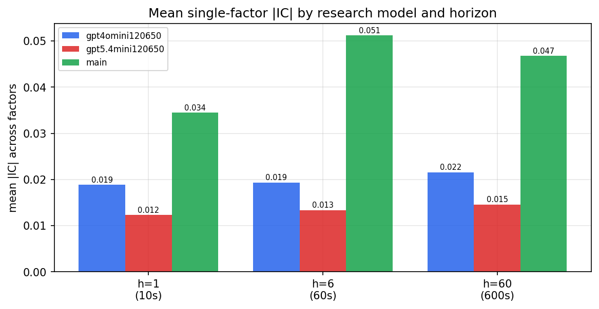

*Mean |IC| by research model and horizon*

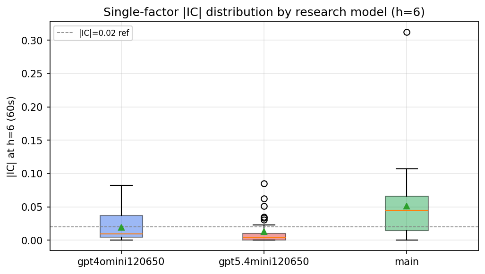

*Per-factor |IC| distribution by research model*

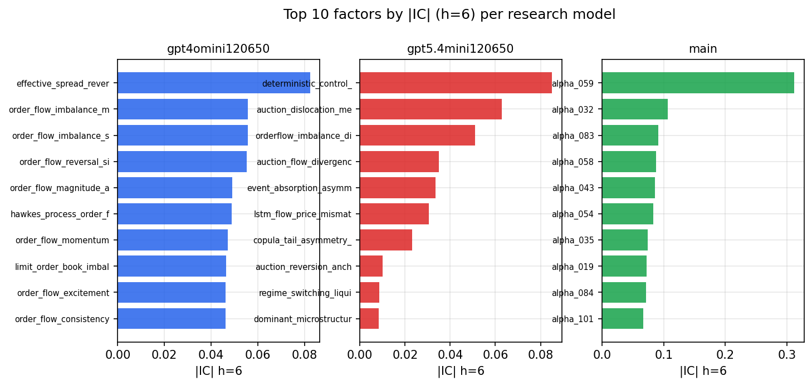

*Top factors by |IC| per research model*

## 2. Factor diversity & redundancy

Pairwise correlation of each zoo's *signals*. `eff_n_factors` is the effective number of independent factors (participation ratio of the correlation eigenvalues); `eff_ratio` and `redundancy` summarise how much unique information the zoo holds vs. how much is duplicated; `n_clusters` groups factors at |corr| ≥ 0.7.

| prerun | n_factors | eff_n_factors | eff_ratio | mean_abs_corr | n_clusters | redundancy |
| --- | --- | --- | --- | --- | --- | --- |
| gpt4omini120650 | 66 | 35.9155 | 0.5442 | 0.0419 | 53 | 0.4558 |
| gpt5.4mini120650 | 68 | 55.346 | 0.8139 | 0.0087 | 62 | 0.1861 |
| main | 78 | 42.6175 | 0.5464 | 0.0336 | 73 | 0.4536 |

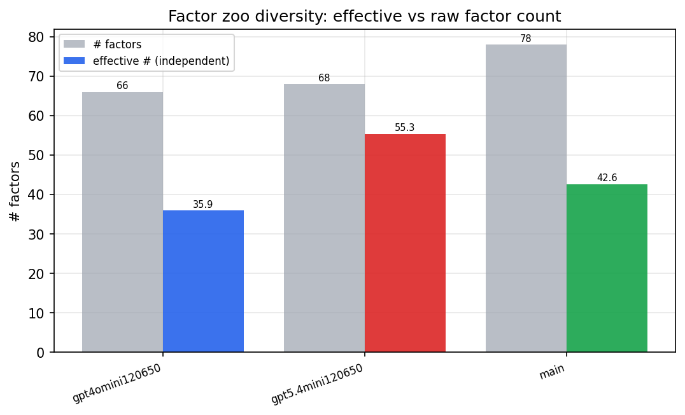

*Effective vs raw factor count per research model*

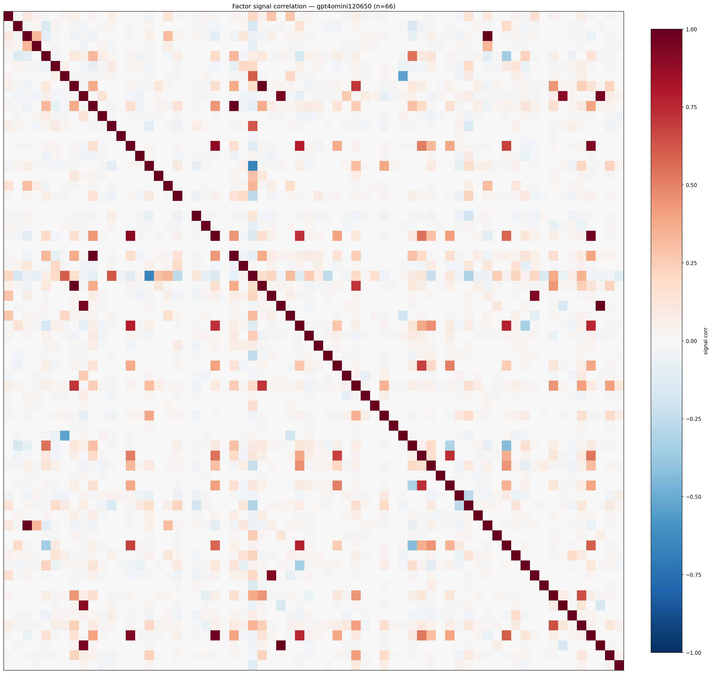

*Signal correlation matrix — gpt4omini120650*

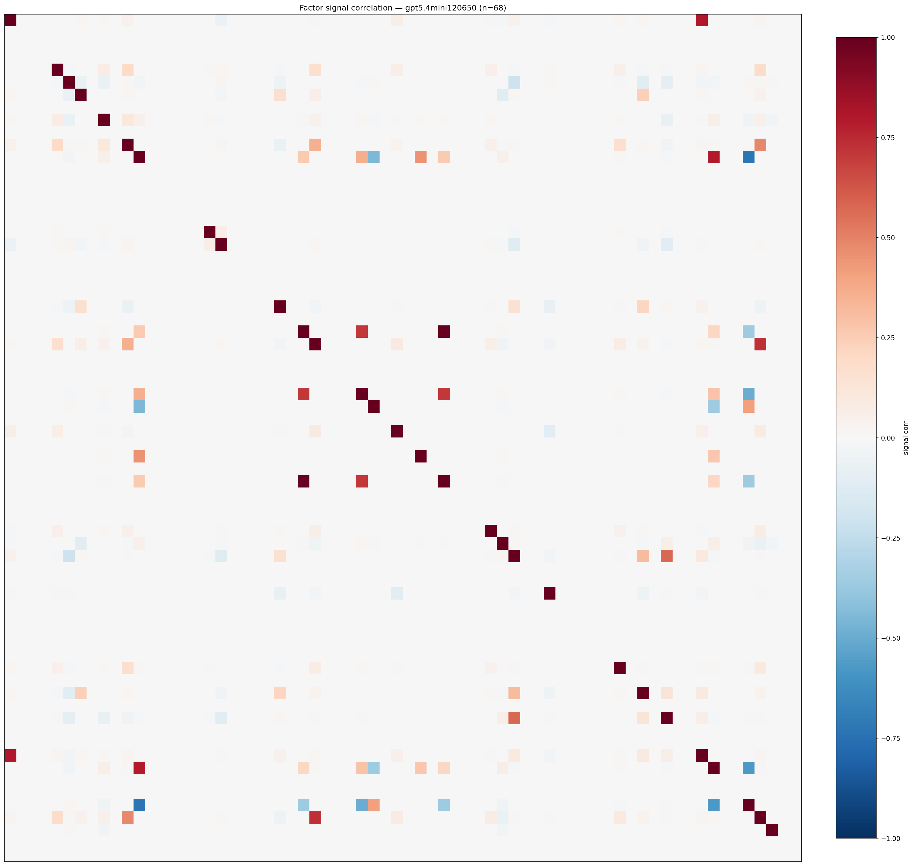

*Signal correlation matrix — gpt5.4mini120650*

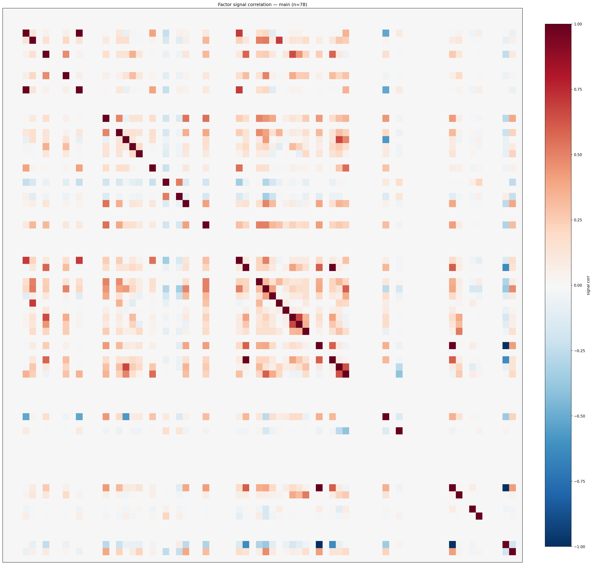

*Signal correlation matrix — main*

## 3. Deflation & model-based importance

`deflated_best_ic` haircuts each zoo's best |IC| for the number of factors tried (`ic_n_tested`) — a bigger zoo's best factor is more likely to be lucky. `lasso_n_nonzero` / `lasso_sparsity` show how many factors a sparse linear model actually keeps (model-view redundancy).

| prerun | best_ic | deflated_best_ic | deflated_best_t | ic_n_tested | ic_n_obs | lasso_n_nonzero | lasso_sparsity |
| --- | --- | --- | --- | --- | --- | --- | --- |
| gpt4omini120650 | 0.0824 | 0.0748 | 28.6302 | 64 | 146339 | 0 | 1.0 |
| gpt5.4mini120650 | 0.0851 | 0.0784 | 29.9762 | 29 | 146339 | 0 | 1.0 |
| main | 0.312 | 0.305 | 116.6631 | 37 | 146339 | 0 | 1.0 |

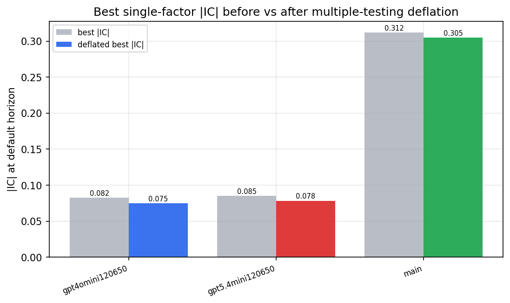

*Best |IC| before vs after multiple-testing deflation*

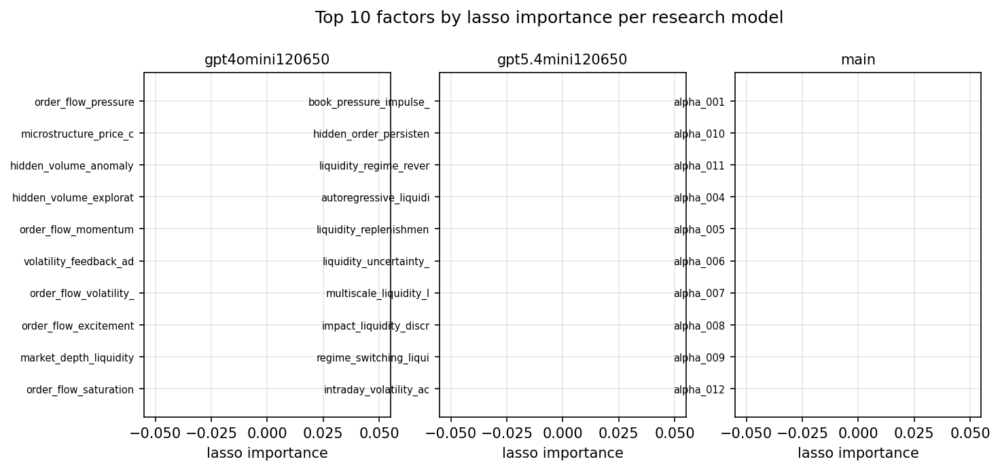

*Top factors by lasso importance per zoo*

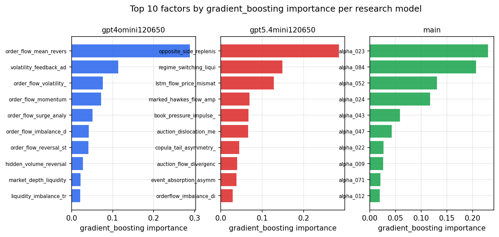

*Top factors by gradient_boosting importance per zoo*

## 4. ML-combined signal — per-underlying vectorised backtest

Each model combines a prerun's factors into ONE signal (fit `factors → forward return` on IS, predict per (bar, underlying)), then that combined signal is run through a simple vectorised backtest — `position(signal) × the underlying's own forward return` — on the held-out OOS tail (+ an equal-weight ensemble). No cross-sectional ranking.

> Config: position=**threshold** (t=1.0, z-score `expanding`), aggregation=**portfolio**, fit-standardise=**per_underlying**, horizon=6.

| prerun | model | n_factors_used | oos_ic | oos_sharpe | is_sharpe | oos_ann_return | oos_max_drawdown |
| --- | --- | --- | --- | --- | --- | --- | --- |
| gpt4omini120650 | linear_regression | 66 | 0.021 | -0.2266 | 7.4288 | -0.0099 | -0.0079 |
| gpt4omini120650 | ridge | 66 | 0.024 | 0.1272 | 7.4119 | 0.0057 | -0.0072 |
| gpt4omini120650 | lasso | 66 | nan | nan | nan | nan | nan |
| gpt4omini120650 | elastic_net | 66 | nan | nan | nan | nan | nan |
| gpt4omini120650 | random_forest | 66 | 0.048 | -1.2374 | 7.9545 | -0.0541 | -0.0103 |
| gpt4omini120650 | gradient_boosting | 66 | -0.0099 | -1.2667 | 10.3086 | -0.0198 | -0.0047 |
| gpt4omini120650 | xgboost | 66 | 0.044 | -0.007 | 18.1952 | -0.0002 | -0.0047 |
| gpt4omini120650 | lightgbm | 66 | 0.0543 | 1.3917 | 23.4401 | 0.0311 | -0.0055 |
| gpt4omini120650 | ensemble | 66 | 0.0445 | 1.8784 | 16.136 | 0.0659 | -0.0042 |
| gpt5.4mini120650 | linear_regression | 68 | 0.0654 | 5.7451 | 11.6009 | 0.2817 | -0.007 |
| gpt5.4mini120650 | ridge | 68 | 0.0658 | 5.8011 | 11.4085 | 0.2832 | -0.0068 |
| gpt5.4mini120650 | lasso | 68 | nan | nan | nan | nan | nan |
| gpt5.4mini120650 | elastic_net | 68 | nan | nan | nan | nan | nan |
| gpt5.4mini120650 | random_forest | 68 | 0.086 | 6.3479 | 16.8578 | 0.2829 | -0.0102 |
| gpt5.4mini120650 | gradient_boosting | 68 | 0.0775 | -1.1272 | 11.4552 | -0.0161 | -0.0051 |
| gpt5.4mini120650 | xgboost | 68 | 0.0834 | 1.0472 | 20.7354 | 0.0282 | -0.0089 |
| gpt5.4mini120650 | lightgbm | 68 | 0.0853 | -2.8618 | 25.7274 | -0.0624 | -0.0136 |
| gpt5.4mini120650 | ensemble | 68 | 0.0839 | 5.4543 | 19.3849 | 0.2156 | -0.0114 |
| main | linear_regression | 78 | 0.0956 | 26.2451 | 19.6567 | 1.4758 | -0.0048 |
| main | ridge | 78 | 0.0942 | 22.9103 | 19.634 | 1.1327 | -0.0044 |
| main | lasso | 78 | nan | nan | nan | nan | nan |
| main | elastic_net | 78 | nan | nan | nan | nan | nan |
| main | random_forest | 78 | 0.1042 | 16.1668 | 15.7855 | 0.589 | -0.004 |
| main | gradient_boosting | 78 | 0.0799 | 6.5939 | 15.0119 | 0.0542 | -0.0006 |
| main | xgboost | 78 | 0.1028 | 7.9442 | 19.5595 | 0.1369 | -0.0045 |
| main | lightgbm | 78 | 0.1068 | 11.9247 | 24.4239 | 0.209 | -0.002 |
| main | ensemble | 78 | 0.1044 | 21.9503 | 22.5711 | 0.7368 | -0.004 |

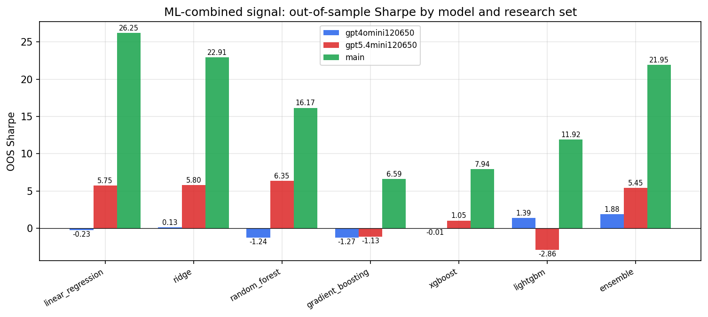

*ML-combined OOS Sharpe by model and research set*

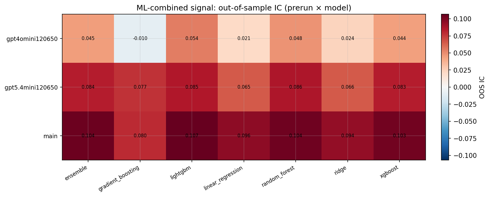

*ML-combined OOS IC (prerun × model)*

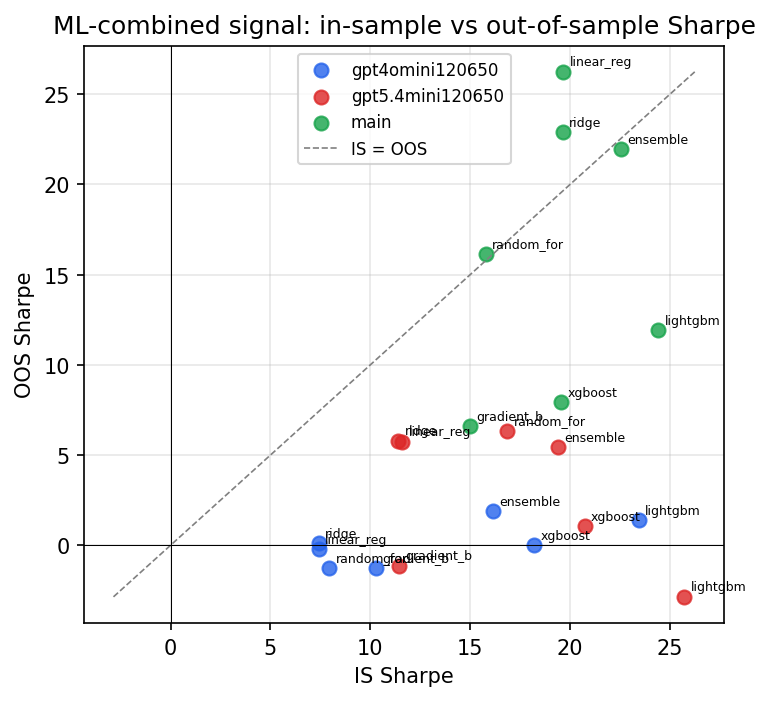

*IS vs OOS Sharpe (overfitting diagnostic)*

---
*Generated by `run_model_comparison.py`. Tables: `*.csv`; interactive: `comparison.ipynb`.*
